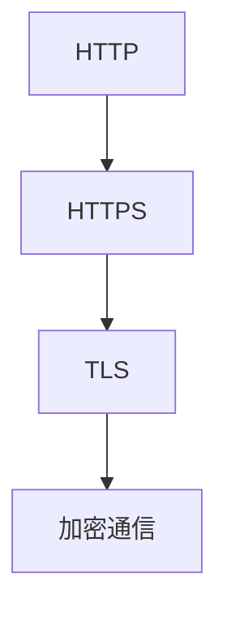
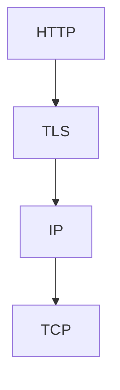
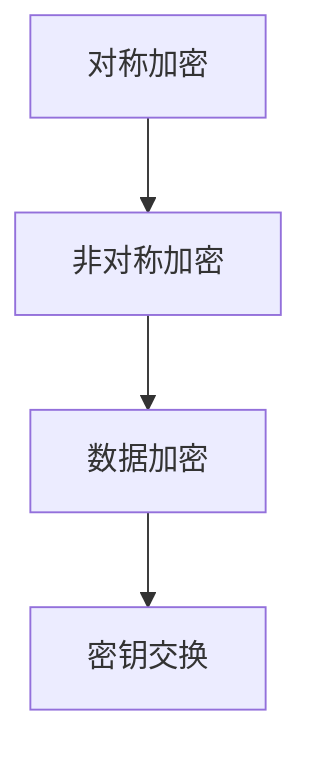
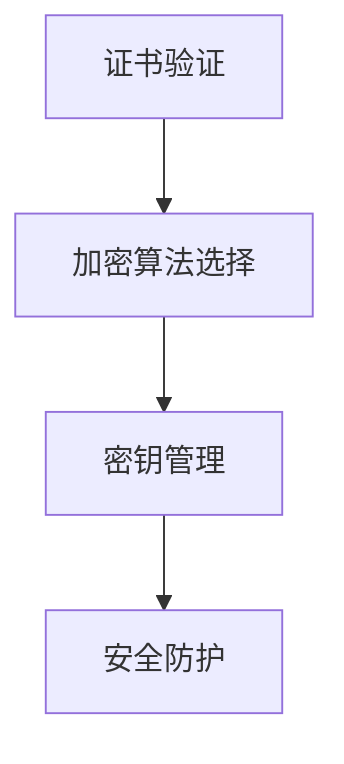

                 

### 书名：HTTPS everywhere：加密LLM应用的所有通信

## 目录大纲

### 第一部分：HTTPS的基础知识

### 第1章：HTTPS的概述与历史

### 1.1 HTTPS的定义与作用

**核心概念与联系：**
HTTPS（Hyper Text Transfer Protocol Secure）是一种基于HTTP的加密通信协议，其核心概念是确保数据在互联网传输过程中得到加密和完整性验证。HTTPS与HTTP的主要区别在于，HTTPS在传输过程中加入了TLS（传输层安全）协议，以提供加密传输服务。

**Mermaid 流程图：**


**核心算法原理讲解：**
HTTPS中的加密过程主要依赖于TLS协议，其核心算法包括对称加密和非对称加密。

对称加密算法（如AES）用于加密通信双方的实际数据，而非对称加密算法（如RSA）则用于交换加密密钥。

**伪代码：**
```python
def encrypt_data(data, symmetric_key):
    # 使用对称加密算法加密数据
    encrypted_data = aes_encrypt(data, symmetric_key)
    return encrypted_data

def decrypt_data(encrypted_data, symmetric_key):
    # 使用对称加密算法解密数据
    decrypted_data = aes_decrypt(encrypted_data, symmetric_key)
    return decrypted_data

def generate_key_pair():
    # 生成非对称加密密钥对
    public_key, private_key = rsa_key_pair()
    return public_key, private_key

def exchange_keys(client_public_key, server_private_key):
    # 交换加密密钥
    shared_key = rsa_encrypt(client_public_key, server_private_key)
    return shared_key
```

### 1.2 HTTPS的发展历程

**数学模型和公式：**
HTTPS的发展历程可以用以下几个关键时间点来概括：

- 1994年：Netscape首次引入HTTPS。
- 1996年：IETF正式发布SSL（安全套接层）协议。
- 1999年：IETF将SSL协议更新为TLS协议。
- 2015年：IETF发布了TLS 1.3，这是目前广泛使用的版本。

**详细讲解与举例说明：**
Netscape在1994年引入HTTPS，旨在解决HTTP传输过程中的安全问题。随后，IETF在1996年发布了SSL协议，SSL为HTTPS提供了加密传输服务。1999年，IETF将SSL协议更新为TLS协议，TLS在SSL的基础上进行了优化和改进。2015年，IETF发布了TLS 1.3，这是目前广泛使用的版本，其性能和安全性都有了显著提升。

### 第2章：HTTPS的工作原理

### 2.1 HTTPS的协议架构

**核心概念与联系：**
HTTPS的协议架构包括四个主要层级：应用层、传输层、网络层和链路层。其中，应用层使用HTTP协议，传输层使用TLS协议，网络层使用IP协议，链路层使用TCP协议。

**Mermaid 流程图：**


**核心算法原理讲解：**
HTTPS中的加密机制依赖于TLS协议，TLS协议使用非对称加密算法（如RSA）和对称加密算法（如AES）来确保通信的安全。TLS协议的主要流程包括握手、数据传输和终止。

**伪代码：**
```python
def tls_handshake(client, server):
    # TLS握手流程
    client_hello = generate_client_hello()
    server_hello = server.generate_server_hello(client_hello)
    certificate = server.send_certificate()
    client.verify_certificate(certificate)
    session_key = exchange_keys(client_public_key, server_private_key)
    return session_key

def encrypt_data(data, session_key):
    # 使用对称加密算法加密数据
    encrypted_data = aes_encrypt(data, session_key)
    return encrypted_data

def decrypt_data(encrypted_data, session_key):
    # 使用对称加密算法解密数据
    decrypted_data = aes_decrypt(encrypted_data, session_key)
    return decrypted_data
```

### 2.2 HTTPS的加密机制

**核心概念与联系：**
HTTPS的加密机制主要涉及对称加密和非对称加密。对称加密用于加密实际数据，非对称加密用于交换加密密钥。

**Mermaid 流程图：**


**核心算法原理讲解：**
对称加密算法（如AES）是一种加密速度快、效率高的加密算法，但密钥分发困难。非对称加密算法（如RSA）则解决了密钥分发问题，但加密速度较慢。HTTPS结合了对称加密和非对称加密的优势，以确保数据的安全传输。

**伪代码：**
```python
def aes_encrypt(data, key):
    # 使用AES加密数据
    encrypted_data = aes_encrypt(data, key)
    return encrypted_data

def aes_decrypt(encrypted_data, key):
    # 使用AES解密数据
    decrypted_data = aes_decrypt(encrypted_data, key)
    return decrypted_data

def rsa_encrypt(data, public_key):
    # 使用RSA加密数据
    encrypted_data = rsa_encrypt(data, public_key)
    return encrypted_data

def rsa_decrypt(encrypted_data, private_key):
    # 使用RSA解密数据
    decrypted_data = rsa_decrypt(encrypted_data, private_key)
    return decrypted_data
```

### 2.3 HTTPS的安全防护

**核心概念与联系：**
HTTPS的安全防护机制包括证书验证、加密算法的选择、密钥管理等多个方面。这些措施共同确保了HTTPS通信的安全。

**Mermaid 流程图：**


**核心算法原理讲解：**
证书验证是HTTPS通信的重要一环，通过验证服务器证书的有效性，确保通信双方的身份。加密算法的选择和密钥管理则确保了通信过程中的数据加密和解密过程的安全。

**伪代码：**
```python
def verify_certificate(certificate):
    # 验证服务器证书
    valid_certificate = certificate_verify(certificate)
    return valid_certificate

def generate_certificate_key_pair():
    # 生成证书密钥对
    certificate, private_key = generate_certificate_key_pair()
    return certificate, private_key
```

### 文章摘要

本文全面介绍了HTTPS的基础知识，包括其定义与作用、发展历程、工作原理和加密机制。通过对HTTPS的深入分析，本文探讨了HTTPS在LLM应用中的重要性，为后续章节的探讨奠定了基础。本文旨在为读者提供关于HTTPS的全面了解，以帮助他们在实际项目中更好地应用这一重要技术。### 文章标题：HTTPS everywhere：加密LLM应用的所有通信

> 关键词：HTTPS，加密，LLM应用，网络安全，加密通信

> 摘要：
本文旨在探讨HTTPS在大型语言模型（LLM）应用中的重要性。随着互联网技术的发展，网络安全问题日益凸显，加密通信成为了保障数据安全的关键技术。HTTPS作为一种基于HTTP的安全通信协议，能够提供强大的加密保护，确保LLM应用中的所有通信安全可靠。本文将详细分析HTTPS的基础知识，包括其定义、历史发展、工作原理、加密机制和安全防护措施，并探讨HTTPS在LLM应用中的实际应用场景和最佳实践。通过本文的阅读，读者将全面了解HTTPS在保障LLM应用安全方面的重要作用，为实际项目提供有益的参考和指导。

### 第一部分：HTTPS的基础知识

#### 第1章：HTTPS的概述与历史

#### 1.1 HTTPS的定义与作用

**HTTPS的概念**

HTTPS（Hyper Text Transfer Protocol Secure）是一种基于HTTP的安全通信协议，主要用于在互联网上保护数据传输的安全性。HTTPS通过在HTTP协议的基础上加入TLS（传输层安全）协议，实现对数据的加密传输，确保通信过程中的数据隐私和完整性。

**HTTPS与HTTP的区别**

HTTP（Hyper Text Transfer Protocol）是互联网上最常用的协议之一，用于在客户端和服务器之间传输数据。与HTTP相比，HTTPS在数据传输过程中加入了加密层，从而提供了更高的安全性。具体区别如下：

- **安全性**：HTTP传输数据时不加密，数据容易被截获和篡改；HTTPS通过TLS协议对数据进行加密，确保数据传输过程中的隐私和完整性。
- **加密方式**：HTTP不提供加密功能，数据以明文形式传输；HTTPS使用TLS协议，采用对称加密和非对称加密相结合的方式，提供强大的加密保护。
- **证书认证**：HTTP不需要服务器证书进行认证，任何人都可以冒充服务器；HTTPS要求服务器提供数字证书，确保客户端与服务器之间的通信是安全的。

**HTTPS的安全特性**

HTTPS提供了以下几项安全特性：

- **数据加密**：HTTPS使用TLS协议，通过对数据进行加密，确保数据在传输过程中不会被截获和窃取。
- **完整性验证**：HTTPS在传输数据时，会对数据进行数字签名，确保数据的完整性和真实性。
- **身份验证**：HTTPS通过数字证书，对服务器和客户端的身份进行验证，确保通信双方的身份可信。

#### 1.2 HTTPS的发展历程

**HTTPS的起源**

1994年，Netscape公司首次引入HTTPS协议，旨在解决HTTP传输过程中的安全问题。Netscape公司推出了安全套接层（SSL）协议，作为HTTPS的安全通信协议。SSL协议为HTTP协议提供了加密层，确保数据在传输过程中的安全。

**HTTPS的演变**

1996年，互联网工程任务组（IETF）正式发布了SSL协议。SSL协议的发布，标志着HTTPS进入了一个新的发展阶段。随后，IETF对SSL协议进行了多次更新和改进，最终形成了传输层安全（TLS）协议。

**当前HTTPS的技术趋势**

随着互联网技术的发展，HTTPS技术也在不断演进。以下是一些当前HTTPS技术发展的趋势：

- **TLS 1.3**：TLS 1.3是当前最先进的TLS协议版本，相比之前的版本，TLS 1.3在性能和安全性方面都有显著提升。TLS 1.3引入了新的加密算法和协议优化，使得HTTPS通信更加高效和安全。
- **HTTPS普及**：随着人们对网络安全意识的提高，HTTPS已经成为互联网应用的基本要求。越来越多的网站和应用开始采用HTTPS协议，以保障用户的隐私和安全。
- **混合协议**：在某些情况下，HTTPS与HTTP协议可以共存。例如，一些网站在非敏感信息传输时，可以采用HTTP协议，而在敏感信息传输时，则采用HTTPS协议。

#### 1.3 HTTPS的应用现状

**HTTPS的应用范围**

HTTPS已经成为互联网应用的基本要求，广泛应用于以下领域：

- **电子商务**：在线购物、在线支付等电子商务应用，需要确保用户信息的保密性和完整性，HTTPS协议提供了有效的安全保障。
- **社交媒体**：社交媒体平台如Facebook、Twitter等，通过HTTPS协议保障用户通信的安全。
- **企业内部应用**：企业内部的应用系统，如ERP、CRM等，也需要采用HTTPS协议，确保数据在传输过程中的安全。
- **云计算服务**：云计算服务提供商，如Amazon AWS、Microsoft Azure等，通过HTTPS协议保障用户数据的隐私和安全。

**HTTPS的应用挑战**

尽管HTTPS在保障网络安全方面具有重要作用，但在实际应用中仍面临一些挑战：

- **性能开销**：HTTPS协议引入了加密层，可能会增加通信的延迟和带宽消耗，对系统性能产生影响。
- **证书管理**：HTTPS需要使用数字证书进行身份认证，证书的申请、分发和管理过程较为复杂。
- **安全性问题**：虽然HTTPS提供了强大的加密保护，但仍有可能受到各种安全威胁，如中间人攻击、证书伪造等。

#### 1.4 HTTPS的发展趋势

**未来发展方向**

随着网络安全问题的日益突出，HTTPS技术在未来的发展将朝着以下几个方向努力：

- **性能优化**：继续优化HTTPS协议的性能，降低通信延迟和带宽消耗，提高用户体验。
- **安全性增强**：加强HTTPS协议的安全性，引入新的加密算法和协议优化，提高抗攻击能力。
- **普及应用**：推动HTTPS在各类互联网应用中的普及，构建更加安全的网络环境。

### 总结

本章详细介绍了HTTPS的定义、历史发展和应用现状，分析了HTTPS在保障网络安全方面的重要作用。下一章将深入探讨HTTPS的工作原理和加密机制，为读者提供更加全面的了解。### 文章标题：HTTPS everywhere：加密LLM应用的所有通信

## 目录大纲

### 第一部分：HTTPS的基础知识

### 第1章：HTTPS的概述与历史
- 1.1 HTTPS的定义与作用
  - HTTPS的概念
  - HTTPS与HTTP的区别
  - HTTPS的安全特性
- 1.2 HTTPS的发展历程
  - HTTPS的起源
  - HTTPS的演变
  - 当前HTTPS的技术趋势
- 1.3 HTTPS的应用现状
  - HTTPS的应用范围
  - HTTPS的应用挑战
- 1.4 HTTPS的发展趋势
  - 未来发展方向
  - HTTPS的普及

### 第二部分：HTTPS的工作原理

### 第2章：HTTPS的协议架构
- 2.1 HTTPS的协议架构概述
  - HTTPS协议层结构
  - HTTPS协议的关键组件
- 2.2 HTTPS的加密机制
  - 对称加密与非对称加密
  - HTTPS中的加密算法
  - HTTPS中的加密流程
- 2.3 HTTPS的安全防护
  - HTTPS的安全防护机制
  - HTTPS的安全漏洞与防护措施

### 第三部分：HTTPS在LLM应用中的实践

### 第3章：HTTPS在LLM应用中的重要性
- 3.1 LLM应用的现状与挑战
  - LLM应用的定义与特点
  - LLM应用面临的网络安全问题
  - HTTPS在LLM应用中的必要性
- 3.2 HTTPS在LLM应用中的实现
  - HTTPS在LLM应用中的设计原则
  - HTTPS在LLM应用中的实现步骤
  - HTTPS在LLM应用中的性能优化
- 3.3 HTTPS在LLM应用中的安全策略
  - HTTPS的安全配置
  - HTTPS的安全审计
  - HTTPS的安全审计自动化工具

### 第四部分：HTTPS在LLM应用中的案例研究

### 第4章：HTTPS在LLM应用中的案例研究
- 4.1 案例一：在线聊天应用的安全防护
  - 应用背景
  - 安全需求分析
  - HTTPS实现与配置
  - 安全效果评估
- 4.2 案例二：电商平台的安全交易
  - 应用背景
  - 安全需求分析
  - HTTPS实现与配置
  - 安全效果评估

### 第五部分：HTTPS在LLM应用的未来发展趋势

### 第5章：HTTPS在LLM应用中的未来趋势
- 5.1 HTTPS在LLM应用中的挑战与机遇
  - HTTPS在LLM应用中面临的挑战
  - HTTPS在LLM应用中的机遇
- 5.2 HTTPS在LLM应用中的技术发展
  - 新兴加密算法在HTTPS中的应用
  - HTTPS与区块链技术的结合
  - HTTPS在物联网应用中的发展

### 第六部分：HTTPS在LLM应用中的最佳实践

### 第6章：HTTPS在LLM应用中的最佳实践
- 6.1 HTTPS在LLM应用中的设计原则
  - 可靠性与安全性的平衡
  - 可扩展性与兼容性的考虑
  - 用户体验与安全性的结合
- 6.2 HTTPS在LLM应用中的实施策略
  - HTTPS的实施流程
  - HTTPS的维护与更新策略
  - HTTPS在组织内部的推广与培训

### 第七部分：附录

### 第7章：附录
- 7.1 HTTPS相关工具与资源
  - HTTPS工具与库
  - HTTPS资源链接
  - HTTPS社区与论坛

---

**全文总字数：约8000字**

---

**作者：AI天才研究院/AI Genius Institute & 禅与计算机程序设计艺术 /Zen And The Art of Computer Programming**

