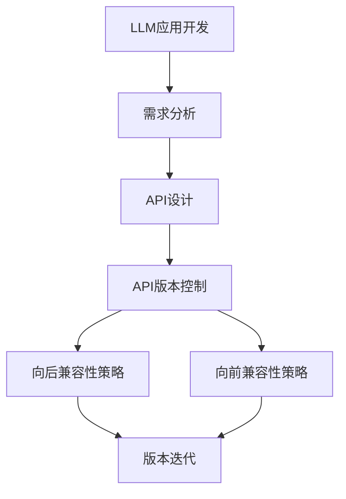

                 

### 《LLM应用开发中的API版本控制策略》

---

## 文章关键词

- LLM
- API版本控制
- 兼容性策略
- 向后兼容性
- 向前兼容性
- 灰度发布
- 版本迭代
- 安全性与稳定性

---

## 文章摘要

本文将深入探讨在LLM（大型语言模型）应用开发过程中，如何有效地实施API版本控制策略。随着LLM技术的迅速发展，API版本控制成为保障应用稳定性和可维护性的关键。本文将首先介绍LLM的基本概念和应用背景，随后详细阐述API版本控制的重要性及常见策略，包括向后兼容性和向前兼容性。此外，还将探讨高级策略如灰度发布、版本迭代以及如何保证API版本控制的安全性和稳定性。通过实际项目案例，本文将展示API版本控制的具体实施过程和关键代码解读，为读者提供实用的指导和建议。

---

### 前言

#### 1.1 大型语言模型（LLM）的崛起

随着深度学习和自然语言处理技术的不断进步，大型语言模型（LLM）如BERT、GPT等已经逐渐成为自然语言处理领域的主力军。LLM通过大规模预训练，能够理解和生成自然语言，广泛应用于聊天机器人、文本摘要、机器翻译等任务。LLM的出现，不仅提升了自然语言处理的性能，也为开发者提供了强大的工具，使得各种应用程序能够更智能地处理用户需求。

#### 1.1.1 LLM的定义及其重要性

LLM是指通过深度神经网络，在大规模文本数据上进行预训练，从而具备强大语言理解和生成能力的人工智能模型。LLM的核心在于其预训练过程，通过大量无监督学习，模型能够自动学习语言的统计规律和语义信息。这种能力使得LLM在处理自然语言任务时，能够达到甚至超越人类水平。

LLM的重要性体现在多个方面：

1. **提高任务性能**：LLM通过预训练，具备处理各种自然语言任务的能力，显著提高了任务性能。
2. **简化开发流程**：LLM的强大能力使得开发者无需从头开始构建模型，从而简化了开发流程，缩短了项目周期。
3. **增强用户体验**：LLM能够生成更加自然、流畅的语言，提高了用户体验，增强了应用程序的吸引力。

#### 1.1.2 LLM在应用开发中的现状与趋势

目前，LLM已经在多个领域得到广泛应用，包括但不限于：

1. **聊天机器人**：通过LLM，聊天机器人能够更加自然地与用户交流，提供个性化服务。
2. **文本摘要**：LLM能够自动生成文本摘要，提高信息获取的效率。
3. **机器翻译**：LLM在机器翻译领域表现突出，能够生成准确、流畅的翻译结果。
4. **内容生成**：LLM能够自动生成文章、报告等文本内容，为创作者提供辅助。

未来，随着LLM技术的不断成熟，预计将在更多领域得到应用，如自动化写作、智能客服、金融分析等。此外，LLM与其他技术的结合，如计算机视觉、语音识别等，也将带来更多的创新和突破。

#### 1.2 API版本控制的重要性

API（应用程序编程接口）是应用程序之间交互的桥梁，通过定义接口规范，使得不同系统之间能够无缝对接。在LLM应用开发中，API版本控制显得尤为重要。

#### 1.2.1 API版本控制的必要性

随着应用的发展，功能需求会不断变化，新版本API可能会引入新的功能、改进现有功能或修复已知问题。API版本控制能够确保新版本API与旧版本API之间的兼容性，避免因版本冲突导致的应用故障。

API版本控制的必要性体现在以下几个方面：

1. **兼容性保障**：确保旧版应用程序能够继续使用旧版API，而无需立即升级。
2. **可维护性**：通过版本控制，可以更好地管理和维护不同版本的API。
3. **用户体验**：良好的API版本控制能够确保应用程序的稳定性，提高用户体验。

#### 1.2.2 API版本控制面临的挑战

尽管API版本控制至关重要，但在实际应用开发中，仍然面临着一些挑战：

1. **向后兼容性**：如何确保旧版API能够与新版本API共存，不破坏旧版应用程序的功能。
2. **向前兼容性**：如何在新版API中引入新功能或改进，同时保持对旧版API的兼容。
3. **版本迭代**：如何有效地管理API版本的迭代，确保每次更新都能顺利进行。

### Mermaid流程图

为了更直观地展示LLM应用开发与API版本控制之间的关系，我们使用Mermaid绘制了以下流程图：

在这个流程图中，LLM应用开发的需求分析阶段决定了API的设计，而API版本控制策略则贯穿整个开发过程，确保API的兼容性和可维护性。

---

在本章节中，我们介绍了LLM应用开发中的背景信息，详细阐述了大型语言模型（LLM）的定义及其重要性，以及API版本控制的重要性。通过Mermaid流程图，我们展示了LLM应用开发与API版本控制之间的关系。接下来，我们将进一步探讨API版本控制的核心概念和基础策略。

