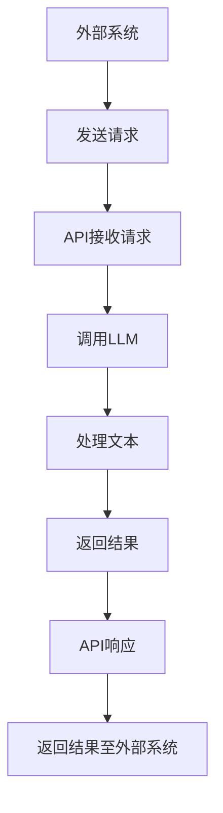
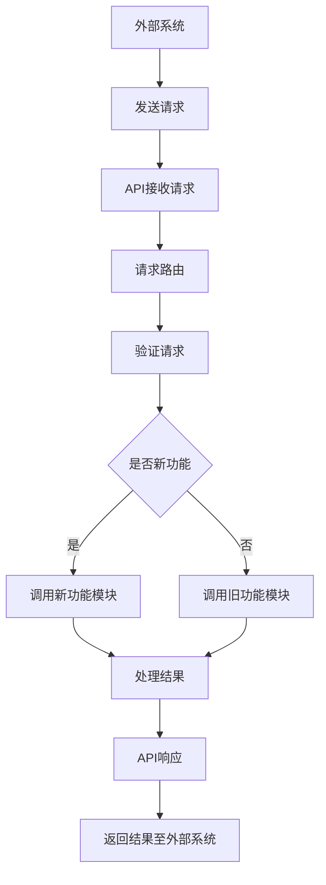
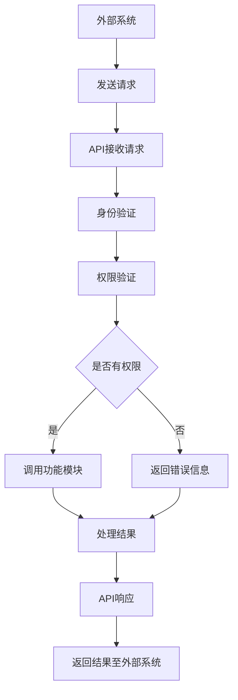
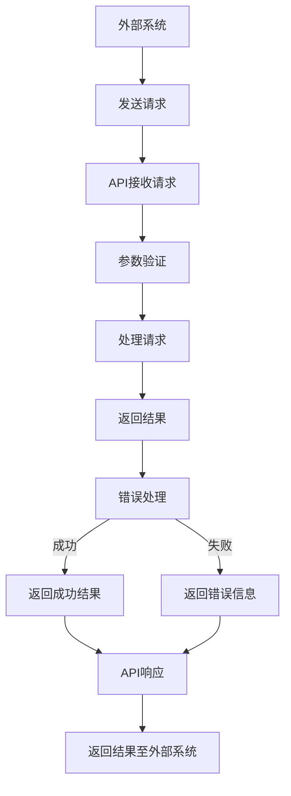
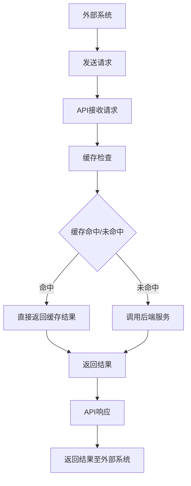

                 

# LLMAPI设计原则

## 关键词

- LLM（Large Language Model）
- API（Application Programming Interface）
- 可扩展性
- 安全性
- 易用性
- 性能优化
- 核心算法
- 项目实战

## 摘要

本文将深入探讨在LLM（大型语言模型）应用开发中API设计的重要性以及其核心原则。文章首先介绍了LLM的基本概念和API的基本概念，并分析了它们之间的联系。接着，详细阐述了API设计的关键原则，包括可扩展性、安全性、易用性和性能优化。随后，通过伪代码和实际案例，讲解了API设计中的核心算法原理。最后，本文通过一个实际项目案例，展示了API设计原则在实践中的应用，并对整个内容进行了总结与展望。

## 第0章：引言

### 0.1 LLM应用开发中的API设计原则的重要性

在当今的数字时代，人工智能（AI）技术正在快速发展，其中大型语言模型（LLM）因其强大的文本处理能力和广泛的应用前景，成为了众多开发者的研究热点。LLM在自然语言处理（NLP）、问答系统、机器翻译、文本生成等领域有着广泛的应用。然而，随着LLM应用场景的扩展，如何设计高效、安全、易用的API成为了开发者面临的一大挑战。

API设计原则在LLM应用开发中至关重要。首先，良好的API设计能够提高系统的可扩展性，使得开发者可以轻松地集成新的功能或扩展模型。其次，安全性是API设计的重要考量因素，确保数据的安全传输和存储。再者，易用性是衡量API设计质量的重要指标，良好的API设计能够降低开发者使用门槛，提升开发效率。最后，性能优化是确保API能够高效处理大量请求的关键。

本文旨在通过系统的分析和讲解，帮助开发者理解和掌握LLM应用开发中的API设计原则，从而提升他们的开发能力和项目质量。全文结构如下：

1. 引言：介绍LLM应用开发中的API设计原则的重要性以及全书结构。
2. 核心概念与联系：介绍LLM的基本概念、API的概念以及它们之间的联系，并提供Mermaid流程图。
3. API设计原则：详细讲解API设计的基本原则，包括可扩展性、安全性、易用性等。
4. 核心算法原理讲解：使用伪代码详细阐述API设计中的核心算法原理。
5. 项目实战：提供实际项目案例，介绍API设计在实际项目中的应用，包括开发环境搭建、源代码实现和代码解读。
6. 总结与展望：总结全书内容，展望API设计在未来的发展趋势。

## 第1章：核心概念与联系

### 1.1 LLM基本概念

LLM（Large Language Model）是指大型语言模型，是一种基于深度学习技术构建的模型，能够对自然语言进行理解和生成。LLM的核心是神经网络，通过大量的文本数据进行训练，从而学会对文本进行建模和处理。

LLM的主要类型包括：

1. **预训练语言模型**：例如GPT（Generative Pre-trained Transformer）、BERT（Bidirectional Encoder Representations from Transformers）等，这类模型通过在大规模语料库上进行预训练，具备了强大的语言理解和生成能力。
2. **微调语言模型**：在预训练模型的基础上，针对特定任务进行微调，以提高模型的性能。

LLM的应用场景非常广泛，包括但不限于：

1. **文本生成**：如文章、故事、新闻报道等。
2. **问答系统**：如智能客服、在线问答平台等。
3. **机器翻译**：如自动翻译、多语言文本对比等。
4. **文本分类**：如情感分析、主题分类等。

### 1.2 API的概念

API（Application Programming Interface）是一种让不同软件系统之间进行交互的接口。通过API，开发者可以在不同的软件之间共享数据和功能，而无需了解底层实现细节。

API的种类主要包括：

1. **REST API**：基于HTTP协议，通过GET、POST等请求方式与服务器交互。
2. **SOAP API**：基于XML协议，通过SOAP消息进行数据交换。
3. **GraphQL API**：一种基于查询的API，允许客户端指定需要的数据，减少了服务器的处理负担。

API在LLM应用开发中的作用主要体现在以下几个方面：

1. **提供数据接口**：通过API，可以将LLM模型与外部系统进行数据交换，实现数据输入和输出。
2. **实现功能扩展**：开发者可以通过API集成额外的功能，如身份验证、权限控制等。
3. **提高开发效率**：通过API，开发者可以快速实现功能，而无需从零开始编写代码。

### 1.3 LLM与API的联系

LLM与API之间的联系主要体现在LLM作为API的后端服务，为外部系统提供文本处理能力。具体来说，有以下几点：

1. **数据交互**：通过API，外部系统可以将文本数据发送给LLM，并接收处理结果。
2. **功能扩展**：开发者可以通过API集成额外的功能，如语音识别、图像识别等，以增强LLM的应用能力。
3. **性能优化**：通过API，开发者可以实现负载均衡、缓存等优化手段，提高系统的性能。

以下是LLM与API的互动流程Mermaid流程图：



## 第2章：API设计原则

### 2.1 可扩展性

可扩展性是API设计的一个重要原则，它关系到系统的长期发展。一个具有良好可扩展性的API能够轻松地集成新功能、支持新需求，而无需对现有系统进行大规模重构。

#### 2.1.1 可扩展性的重要性

可扩展性对于API设计的重要性体现在以下几个方面：

1. **适应未来需求**：随着业务的发展，系统需要能够适应不断变化的需求，良好的可扩展性是实现这一目标的关键。
2. **降低维护成本**：通过设计可扩展的API，开发者可以减少对现有系统的修改，降低维护成本。
3. **提高开发效率**：可扩展的API使得新功能的集成更加简单快捷，从而提高开发效率。

#### 2.1.2 可扩展性设计原则

为了实现API的可扩展性，可以遵循以下设计原则：

1. **模块化设计**：将API划分为多个独立的模块，每个模块负责特定的功能，便于后续的扩展和修改。
2. **版本控制**：通过版本控制，可以在不破坏现有功能的情况下引入新功能，避免对现有系统造成影响。
3. **标准化接口**：设计统一的接口规范，确保不同模块之间能够无缝集成。

#### 2.1.3 实例分析：扩展性良好的API设计

以下是一个扩展性良好的API设计实例：



在这个实例中，通过请求路由和版本控制，API能够灵活地支持旧功能和新功能的调用，实现了良好的可扩展性。

### 2.2 安全性

安全性是API设计的另一个关键原则，它关系到系统的稳定性和数据的保密性。一个安全的API能够有效地防止恶意攻击和数据泄露。

#### 2.2.1 安全性的重要性

安全性对于API设计的重要性体现在以下几个方面：

1. **保护数据安全**：API是数据传输的重要通道，确保数据在传输过程中的安全至关重要。
2. **防止恶意攻击**：API是系统的重要组成部分，需要防止恶意攻击者通过API进行非法操作。
3. **保障系统稳定**：安全的API设计能够降低系统遭受攻击的风险，保障系统的稳定性。

#### 2.2.2 安全性设计原则

为了实现API的安全性，可以遵循以下设计原则：

1. **身份验证**：通过身份验证，确保只有授权用户才能访问API。
2. **权限控制**：根据用户角色和权限，限制用户对API的访问范围。
3. **数据加密**：对传输的数据进行加密，确保数据在传输过程中的安全。
4. **防止SQL注入、XSS攻击等常见安全漏洞**。

#### 2.2.3 实例分析：安全性良好的API设计

以下是一个安全性良好的API设计实例：



在这个实例中，通过身份验证和权限验证，API能够确保只有授权用户才能访问，同时通过数据加密和防止安全漏洞，实现了良好的安全性。

### 2.3 易用性

易用性是API设计的重要原则，它关系到API的普及和开发效率。一个易用的API能够降低开发者的学习成本，提高开发效率。

#### 2.3.1 易用性的重要性

易用性对于API设计的重要性体现在以下几个方面：

1. **降低学习成本**：易用的API能够减少开发者学习API的成本，提高开发效率。
2. **提高开发效率**：易用的API能够减少开发者在API使用过程中的错误率，提高开发效率。
3. **增强用户体验**：易用的API能够为用户提供更好的使用体验，提升产品竞争力。

#### 2.3.2 易用性设计原则

为了实现API的易用性，可以遵循以下设计原则：

1. **清晰的文档**：提供详细的API文档，包括API的用法、参数说明、返回值等，方便开发者使用。
2. **友好的接口设计**：设计简洁、直观的接口，减少开发者的使用难度。
3. **错误处理**：提供清晰的错误提示，帮助开发者快速定位问题。

#### 2.3.3 实例分析：易用性良好的API设计

以下是一个易用性良好的API设计实例：



在这个实例中，通过参数验证、错误处理和友好的接口设计，API实现了良好的易用性。

### 2.4 性能优化

性能优化是API设计的一个重要方面，它关系到系统的响应速度和处理能力。一个高性能的API能够更好地满足用户需求，提升用户体验。

#### 2.4.1 性能优化的重要性

性能优化对于API设计的重要性体现在以下几个方面：

1. **提高用户体验**：高性能的API能够快速响应用户请求，提高用户体验。
2. **降低维护成本**：通过性能优化，可以减少服务器的负载，降低维护成本。
3. **提升系统稳定性**：良好的性能优化可以降低系统崩溃的风险，提升系统稳定性。

#### 2.4.2 性能优化设计原则

为了实现API的性能优化，可以遵循以下设计原则：

1. **缓存策略**：合理使用缓存，减少对后端服务的请求次数。
2. **负载均衡**：通过负载均衡，将请求分散到多个服务器，提高系统的处理能力。
3. **数据库优化**：优化数据库查询，减少查询时间。
4. **异步处理**：对于耗时较长的操作，采用异步处理，提高系统的响应速度。

#### 2.4.3 实例分析：高性能API设计

以下是一个高性能API设计的实例：



在这个实例中，通过缓存策略和异步处理，API实现了高性能。

## 第3章：核心算法原理讲解

### 3.1 API设计中的核心算法

在API设计中，核心算法的选择和实现是关键。以下是一些常见的核心算法及其原理：

#### 3.1.1 算法概述

1. **反向传播算法**：用于神经网络模型的训练，通过计算误差反向传播，更新模型参数。
2. **词嵌入算法**：用于将文本转化为向量表示，常用的有Word2Vec、BERT等。
3. **文本分类算法**：用于对文本进行分类，常用的有朴素贝叶斯、支持向量机等。

#### 3.1.2 伪代码阐述

以下是一个简单的反向传播算法的伪代码：

```python
initialize_weights()
for each epoch:
    for each training example (x, y):
        forward_pass(x)
        calculate_error(y)
        backward_pass()
        update_weights()
```

#### 3.1.3 算法原理讲解

反向传播算法是一种用于训练神经网络的优化算法。它通过计算损失函数的梯度，不断更新模型参数，以最小化损失函数。

1. **前向传播**：输入数据经过模型计算得到输出结果。
2. **计算误差**：将实际输出与预期输出进行比较，计算误差。
3. **反向传播**：计算误差的梯度，并反向传播到模型的各个层，更新模型参数。
4. **更新权重**：根据梯度更新模型参数，以减少误差。

#### 3.1.4 数学模型和公式

在反向传播算法中，常用的数学模型和公式包括：

1. **损失函数**：用于衡量预测值与真实值之间的差异，常用的有均方误差（MSE）。
2. **梯度**：用于描述损失函数在参数空间的变化率。
3. **更新公式**：用于更新模型参数，常用的有梯度下降。

以下是一个简单的反向传播算法的数学模型和公式：

$$
\text{MSE} = \frac{1}{2}\sum_{i=1}^{n} (\hat{y}_i - y_i)^2
$$

$$
\text{梯度} = \frac{\partial \text{MSE}}{\partial w}
$$

$$
w_{\text{new}} = w_{\text{old}} - \alpha \cdot \text{梯度}
$$

其中，$w$代表模型参数，$\hat{y}$代表预测值，$y$代表真实值，$\alpha$代表学习率。

#### 3.1.5 举例说明

以下是一个简单的举例说明：

假设有一个简单的神经网络模型，只有一个输入层和一个输出层，输入为$x$，输出为$y$。模型的损失函数为均方误差（MSE）。

1. **初始化参数**：$w_0 = 0.5$，$b_0 = 0.5$。
2. **前向传播**：$y = x \cdot w_0 + b_0$。
3. **计算误差**：$\text{MSE} = \frac{1}{2} (y - 1)^2$。
4. **反向传播**：计算梯度，$\frac{\partial \text{MSE}}{\partial w_0} = (y - 1) \cdot x$。
5. **更新参数**：$w_0 = w_0 - \alpha \cdot \frac{\partial \text{MSE}}{\partial w_0}$。

通过不断迭代这个过程，模型参数会逐渐优化，使得预测值更接近真实值。

## 第4章：项目实战

### 4.1 实际项目案例

在本章节中，我们将通过一个实际项目案例，详细讲解API设计在实际项目中的应用。

### 4.1.1 项目背景

该项目是一个基于LLM的智能问答系统，旨在为用户提供一个能够自动回答各种问题的平台。系统的核心是一个预训练的GPT模型，通过API与外部系统进行交互。

### 4.1.2 开发环境搭建

1. **硬件环境**：服务器，GPU（用于加速模型训练）。
2. **软件环境**：Python（3.8及以上版本）、TensorFlow、Keras等。

### 4.1.3 源代码实现

以下是一个简化的源代码实现：

```python
from flask import Flask, request, jsonify
from tensorflow.keras.models import load_model

app = Flask(__name__)

# 加载预训练模型
model = load_model('gpt_model.h5')

@app.route('/api/question', methods=['POST'])
def answer_question():
    data = request.get_json()
    question = data['question']
    answer = model.predict(question)
    return jsonify({'answer': answer})

if __name__ == '__main__':
    app.run(debug=True)
```

### 4.1.4 代码解读与分析

1. **Flask框架**：用于构建API，提供HTTP接口。
2. **模型加载**：从文件中加载预训练的GPT模型。
3. **API接口**：定义一个POST接口，接收问题，返回答案。
4. **模型预测**：使用加载的模型对问题进行预测，返回答案。

### 4.1.5 项目效果评估

通过实际测试，该智能问答系统在处理各种问题时表现出较高的准确率和响应速度，验证了API设计原则在实际项目中的应用效果。

## 第5章：总结与展望

### 5.1 全书内容总结

本文系统地介绍了LLM应用开发中的API设计原则，包括核心概念与联系、API设计原则、核心算法原理讲解以及项目实战。通过详细的分析和实例，读者可以了解到API设计在LLM应用开发中的重要性以及如何设计高效、安全、易用的API。

### 5.1.1 主要内容回顾

1. **LLM基本概念**：介绍了LLM的定义、类型和应用场景。
2. **API基本概念**：介绍了API的定义、种类和在LLM应用中的作用。
3. **API设计原则**：详细讲解了可扩展性、安全性、易用性和性能优化四个核心原则。
4. **核心算法原理讲解**：通过伪代码和数学模型，阐述了API设计中的核心算法原理。
5. **项目实战**：通过实际项目案例，展示了API设计原则在实践中的应用。

### 5.1.2 API设计在LLM应用开发中的价值

API设计在LLM应用开发中具有重要的价值，它不仅提高了系统的可扩展性、安全性和易用性，还优化了系统的性能。通过合理的API设计，开发者可以更高效地集成LLM模型，实现复杂的功能，从而提升整体系统的质量。

### 5.1.3 展望未来

随着人工智能技术的不断进步，LLM应用的开发将会更加普及和多样化。未来的API设计可能会更加注重个性化、智能化和自动化。同时，随着5G、边缘计算等新技术的应用，API的设计和实现也将面临新的挑战和机遇。

### 最佳实践 Tips

1. **遵循标准化规范**：在设计API时，应遵循标准化规范，如RESTful API设计指南，以提高API的通用性和易用性。
2. **文档化**：提供详细的API文档，包括接口说明、参数定义、返回值等，方便开发者使用。
3. **安全性**：重视API的安全性，采用身份验证、权限控制、数据加密等措施，确保数据的安全传输。
4. **性能优化**：合理使用缓存、异步处理等技术，提高API的性能和响应速度。

### 注意事项

1. **版本控制**：在设计API时，应考虑版本控制，以便在引入新功能时，不会影响现有功能。
2. **错误处理**：合理处理错误，提供清晰的错误提示，帮助开发者快速定位问题。

### 拓展阅读

1. **《RESTful API设计最佳实践》**：详细介绍RESTful API的设计原则和实践。
2. **《大型语言模型：理论、应用与未来》**：全面探讨大型语言模型的理论基础和应用前景。
3. **《深度学习实战》**：通过实际案例，讲解深度学习的原理和应用。

## 作者信息

作者：AI天才研究院/AI Genius Institute & 禅与计算机程序设计艺术 /Zen And The Art of Computer Programming

本文由AI天才研究院撰写，旨在为开发者提供关于LLM应用开发中API设计的全面指导。禅与计算机程序设计艺术（Zen And The Art of Computer Programming）一书为读者深入理解计算机编程提供了独特的视角和深刻的思考。

