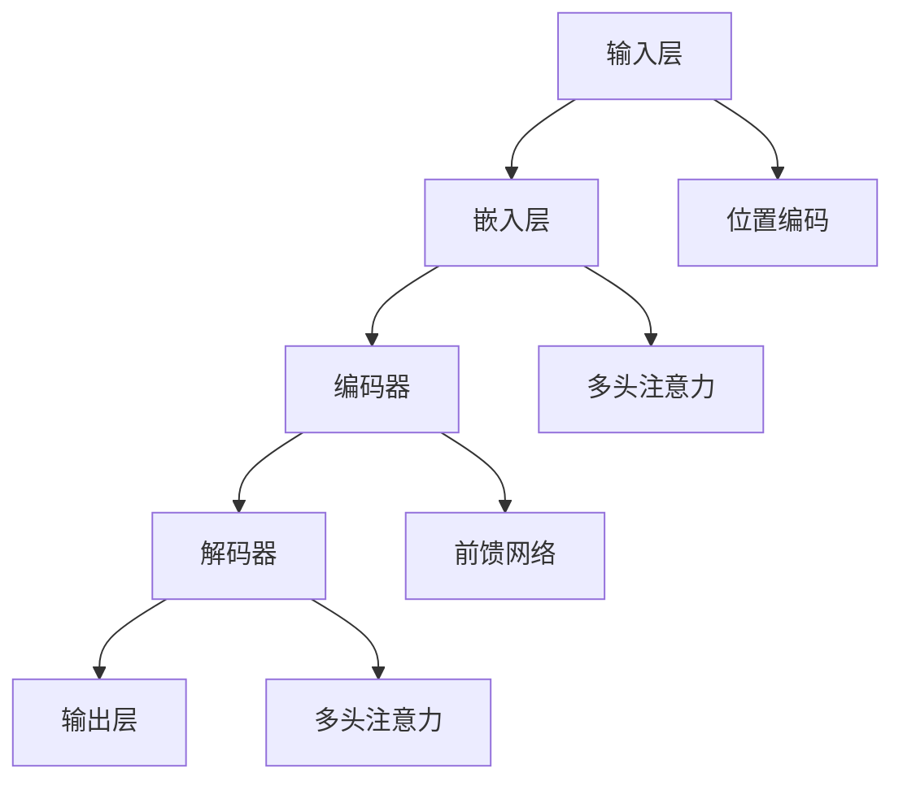

                 

### 文章标题

# LLM应用开发中的A/B测试策略

> 关键词：LLM，A/B测试，应用开发，策略

> 摘要：
本文深入探讨了在大型语言模型（LLM）应用开发过程中，如何运用A/B测试策略来优化模型性能和用户体验。通过详细分析LLM的基本原理、A/B测试的基础知识和应用策略，以及实际案例的剖析，文章旨在为开发者提供一套系统的A/B测试实践指南。

----------------------------------------------------------------

## 引言

在当今信息技术飞速发展的时代，人工智能（AI）已经成为了推动社会进步的重要力量。而大型语言模型（LLM）作为AI领域的明星技术，其在自然语言处理（NLP）和智能应用开发中发挥了至关重要的作用。LLM的引入不仅提升了文本处理的效率和准确性，还带来了全新的用户体验。

然而，在LLM的实际应用开发过程中，如何确保模型性能的持续优化，以及如何提升用户体验，成为了开发者面临的重要挑战。A/B测试作为一种科学的测试和优化方法，能够有效帮助开发者评估不同策略的效果，从而实现最优化的应用性能。

本文将围绕LLM应用开发中的A/B测试策略，系统地探讨以下几个关键问题：

1. **LLM的基本原理和架构**：介绍LLM的发展历史、核心算法原理和数学模型。
2. **A/B测试的基础知识**：阐述A/B测试的定义、流程和重要性。
3. **A/B测试策略**：分析A/B测试在LLM应用开发中的具体策略和应用场景。
4. **实际案例分析**：通过具体案例，展示如何运用A/B测试策略来优化LLM应用。
5. **最佳实践和注意事项**：总结A/B测试中的最佳实践，并提出注意事项。

## LLM的基本原理和架构

### 1.1 LLM的发展历史与现状

大型语言模型（LLM）的发展历程可以追溯到20世纪中叶。早期的自然语言处理（NLP）研究主要依赖于基于规则的系统和统计模型。然而，这些方法在面对复杂文本处理任务时表现有限。随着计算能力的提升和深度学习技术的突破，LLM逐渐成为了NLP领域的主流。

2018年，Google推出了Transformer模型，标志着LLM进入了新的发展阶段。Transformer模型基于自注意力机制（Self-Attention），在处理长文本和复杂语义关系方面展现了优异的性能。此后，诸如GPT、BERT等一系列LLM模型相继问世，推动了NLP技术的快速发展。

当前，LLM已经在多个领域得到了广泛应用，如智能问答、机器翻译、文本生成、文本分类等。同时，随着模型规模的不断扩大，LLM的预训练方法也在不断优化，从而实现了更高的模型性能和更广泛的适用性。

### 1.2 LLM的基本概念与架构

LLM是一种能够对自然语言进行理解和生成的大型神经网络模型。其核心思想是通过大规模的数据预训练，使模型能够捕获语言中的复杂结构和语义信息。

**基本概念**：

- **自注意力机制（Self-Attention）**：Transformer模型的核心组件，通过计算输入序列中每个词与所有词之间的关联性，从而生成表示每个词的加权向量。
- **多头注意力（Multi-Head Attention）**：通过将自注意力机制扩展到多个头部，模型可以同时关注输入序列的不同部分，从而提高对复杂语义的理解能力。
- **位置编码（Positional Encoding）**：由于Transformer模型不具备传统的循环神经网络（RNN）中的序列顺序信息，因此需要通过位置编码来提供词的位置信息。

**架构**：

LLM的架构通常包括以下几个关键部分：

- **输入层**：接收文本序列，并通过嵌入层（Embedding Layer）将单词转换为稠密的向量表示。
- **编码器（Encoder）**：包含多个编码层，每层由多头自注意力机制和前馈网络组成，通过逐层堆叠，模型能够逐步提取文本中的语义信息。
- **解码器（Decoder）**：与编码器类似，解码器也由多个解码层组成，用于生成输出文本序列。
- **输出层**：通常是一个全连接层，用于生成最终的输出文本。

### Mermaid流程图

为了更好地理解LLM的工作流程，我们使用Mermaid流程图来展示其核心组件和交互过程：



### 伪代码

以下是一个简化的伪代码，用于描述Transformer模型的基本结构和操作：

```python
# 定义Transformer模型
class Transformer(Model):
    def __init__(self):
        self.embedding_layer = EmbeddingLayer()
        self.encoder_layers = EncoderLayers()
        self.decoder_layers = DecoderLayers()
        self.output_layer = DenseLayer()

    def call(self, inputs, training=False):
        embedded_inputs = self.embedding_layer(inputs)
        encoded_inputs = self.encoder_layers(embedded_inputs, training)
        decoded_inputs = self.decoder_layers(encoded_inputs, training)
        outputs = self.output_layer(decoded_inputs)
        return outputs

# 定义编码层和解码层
class EncoderLayer(Layer):
    def __init__(self):
        self.self_attention = MultiHeadAttention()
        self.feed_forward = FeedForward()

    def call(self, inputs, training=False):
        attention_output = self.self_attention(inputs, inputs, inputs)
        attention_output = self.feed_forward(attention_output)
        return inputs + attention_output

class DecoderLayer(Layer):
    def __init__(self):
        self.self_attention = MultiHeadAttention()
        self.cross_attention = MultiHeadAttention()
        self.feed_forward = FeedForward()

    def call(self, inputs, encoder_outputs, training=False):
        attention_output = self.self_attention(inputs, inputs, inputs)
        cross_attention_output = self.cross_attention(inputs, encoder_outputs, encoder_outputs)
        attention_output = self.feed_forward(attention_output)
        return inputs + attention_output + cross_attention_output
```

### 数学模型和公式

在LLM中，数学模型和公式扮演着至关重要的角色。以下是一些核心的数学概念：

- **自注意力（Self-Attention）**：通过计算输入序列中每个词与所有词之间的关联性，生成加权向量。

  $$\text{Attention}(Q, K, V) = \text{softmax}\left(\frac{QK^T}{\sqrt{d_k}}\right)V$$

  其中，$Q$ 是查询向量，$K$ 是键向量，$V$ 是值向量，$d_k$ 是键向量的维度。

- **多头注意力（Multi-Head Attention）**：将自注意力扩展到多个头部，提高模型对复杂语义的理解能力。

  $$\text{Multi-Head Attention} = \text{Concat}(\text{head}_1, \text{head}_2, ..., \text{head}_h)W^O$$

  其中，$W^O$ 是输出权重，$h$ 是头数。

- **位置编码（Positional Encoding）**：为输入序列提供位置信息，使得模型能够理解词的位置关系。

  $$\text{PE}(pos, 2i) = \sin\left(\frac{pos}{10000^{2i/d}}\right)$$

  $$\text{PE}(pos, 2i+1) = \cos\left(\frac{pos}{10000^{2i/d}}\right)$$

  其中，$pos$ 是位置索引，$i$ 是维度索引，$d$ 是维度。

- **前馈网络（Feed Forward Network）**：在编码器和解码器的每个层之后，用于进一步增强模型的表示能力。

  $$\text{FFN}(x) = \max(0, xW_1 + b_1)W_2 + b_2$$

  其中，$W_1$ 和 $W_2$ 是权重矩阵，$b_1$ 和 $b_2$ 是偏置向量。

### 详细讲解和举例说明

#### 自注意力机制

自注意力机制是Transformer模型的核心组成部分，其基本思想是通过计算输入序列中每个词与所有词之间的关联性，从而生成加权向量。这一机制使得模型能够自动学习到词之间的相对重要性。

**举例说明**：

假设我们有一个简短的文本序列“Hello world!”，其词汇表示为 $[h, e, l, l, o, \_, w, o, r, l, d]$。自注意力机制会计算每个词与所有其他词之间的关联性，生成对应的加权向量。

- **词“Hello”的加权向量**：计算“Hello”与“Hello”、“world”等词之间的关联性，生成相应的加权向量。
- **词“world”的加权向量**：计算“world”与“Hello”、“world”等词之间的关联性，生成相应的加权向量。

通过这种自注意力机制，模型能够自动捕捉到词之间的复杂关系，从而提高对语义的理解能力。

#### 多头注意力机制

多头注意力机制是将自注意力机制扩展到多个头部，从而提高模型对复杂语义的理解能力。每个头部关注输入序列的不同部分，从而获得更丰富的语义信息。

**举例说明**：

假设我们使用两个头部的多头注意力机制来处理上述的文本序列“Hello world!”。

- **第一个头部**：关注词“Hello”和“world”之间的关系。
- **第二个头部**：关注词“Hello”和“world”与其他词（如“_”、“o”）之间的关系。

通过这种方式，模型能够同时关注输入序列的多个部分，从而更全面地理解语义。

#### 位置编码

位置编码为输入序列提供位置信息，使得模型能够理解词的位置关系。位置编码通常使用正弦和余弦函数来生成。

**举例说明**：

假设我们使用简单的位置编码来处理词“Hello world!”。

- **词“Hello”的位置编码**：根据其在序列中的位置（如第1个词），计算相应的位置编码向量。
- **词“world”的位置编码**：根据其在序列中的位置（如第6个词），计算相应的位置编码向量。

通过位置编码，模型能够捕获词的顺序信息，从而更好地处理文本序列。

#### 前馈网络

前馈网络位于编码器和解码器的每个层之后，用于进一步增强模型的表示能力。前馈网络通常包括两个全连接层，分别具有不同的非线性激活函数。

**举例说明**：

假设我们在编码器的每个层之后添加一个前馈网络。

- **输入**：输入序列经过编码器的某一层输出。
- **输出**：输入序列通过前馈网络处理后，输出新的表示向量。

通过前馈网络，模型能够进一步提取文本序列中的特征，从而提高模型性能。

### 数学公式

以下是一些关键的数学公式，用于描述LLM中的核心机制：

- **自注意力计算**：

  $$\text{Attention}(Q, K, V) = \text{softmax}\left(\frac{QK^T}{\sqrt{d_k}}\right)V$$

- **多头注意力计算**：

  $$\text{Multi-Head Attention} = \text{Concat}(\text{head}_1, \text{head}_2, ..., \text{head}_h)W^O$$

- **位置编码公式**：

  $$\text{PE}(pos, 2i) = \sin\left(\frac{pos}{10000^{2i/d}}\right)$$

  $$\text{PE}(pos, 2i+1) = \cos\left(\frac{pos}{10000^{2i/d}}\right)$$

- **前馈网络公式**：

  $$\text{FFN}(x) = \max(0, xW_1 + b_1)W_2 + b_2$$

### 代码实现

以下是一个简化的代码实现，用于描述Transformer模型的基本结构和操作：

```python
import tensorflow as tf

# 定义嵌入层
class EmbeddingLayer(tf.keras.layers.Layer):
    def __init__(self, d_model):
        super(EmbeddingLayer, self).__init__()
        self.d_model = d_model

    def call(self, inputs):
        # 输入序列的形状为 (batch_size, sequence_length)
        # 嵌入层的输出形状为 (batch_size, sequence_length, d_model)
        return tf.keras.layers.Embedding(self.d_model)(inputs)

# 定义编码层
class EncoderLayer(tf.keras.layers.Layer):
    def __init__(self, d_model, d_ff):
        super(EncoderLayer, self).__init__()
        self.d_model = d_model
        self.d_ff = d_ff

        # 自注意力层
        self.self_attention = tf.keras.layers.MultiHeadAttention(d_model, num_heads=8)
        # 前馈网络
        self.feed_forward = tf.keras.layers.Dense(d_ff, activation='relu')

    def call(self, inputs, training=False):
        # 自注意力
        attention_output = self.self_attention(inputs, inputs)
        attention_output = tf.keras.layers.LayerNormalization(epsilon=1e-6)(inputs + attention_output)
        # 前馈网络
        feed_forward_output = self.feed_forward(attention_output)
        feed_forward_output = tf.keras.layers.LayerNormalization(epsilon=1e-6)(attention_output + feed_forward_output)
        return feed_forward_output

# 定义解码器
class DecoderLayer(tf.keras.layers.Layer):
    def __init__(self, d_model, d_ff):
        super(DecoderLayer, self).__init__()
        self.d_model = d_model
        self.d_ff = d_ff

        # 自注意力层
        self.self_attention = tf.keras.layers.MultiHeadAttention(d_model, num_heads=8)
        # 交叉注意力层
        self.cross_attention = tf.keras.layers.MultiHeadAttention(d_model, num_heads=8)
        # 前馈网络
        self.feed_forward = tf.keras.layers.Dense(d_ff, activation='relu')

    def call(self, inputs, encoder_outputs, training=False):
        # 自注意力
        self_attention_output = self.self_attention(inputs, inputs)
        self_attention_output = tf.keras.layers.LayerNormalization(epsilon=1e-6)(inputs + self_attention_output)
        # 交叉注意力
        cross_attention_output = self.cross_attention(self_attention_output, encoder_outputs, encoder_outputs)
        cross_attention_output = tf.keras.layers.LayerNormalization(epsilon=1e-6)(self_attention_output + cross_attention_output)
        # 前馈网络
        feed_forward_output = self.feed_forward(cross_attention_output)
        feed_forward_output = tf.keras.layers.LayerNormalization(epsilon=1e-6)(cross_attention_output + feed_forward_output)
        return feed_forward_output

# 定义Transformer模型
class Transformer(tf.keras.Model):
    def __init__(self, d_model, d_ff, num_layers):
        super(Transformer, self).__init__()
        self.d_model = d_model
        self.d_ff = d_ff
        self.num_layers = num_layers

        # 嵌入层
        self.embedding = EmbeddingLayer(d_model)
        # 编码器层
        self.encoder_layers = [EncoderLayer(d_model, d_ff) for _ in range(num_layers)]
        # 解码器层
        self.decoder_layers = [DecoderLayer(d_model, d_ff) for _ in range(num_layers)]
        # 输出层
        self.output_layer = tf.keras.layers.Dense(d_model)

    def call(self, inputs, training=False):
        # 嵌入层
        embedded_inputs = self.embedding(inputs)
        # 编码器层
        for layer in self.encoder_layers:
            embedded_inputs = layer(embedded_inputs, training)
        # 解码器层
        for layer in self.decoder_layers:
            embedded_inputs = layer(embedded_inputs, training)
        # 输出层
        outputs = self.output_layer(embedded_inputs)
        return outputs

# 实例化模型
d_model = 512
d_ff = 2048
num_layers = 3

# 编译模型
model = Transformer(d_model, d_ff, num_layers)
model.compile(optimizer='adam', loss=tf.keras.losses.SparseCategoricalCrossentropy(from_logits=True))

# 输入文本序列
input_sequence = tf.keras.preprocessing.sequence.pad_sequences([[1, 2, 3, 4, 5]], maxlen=5, padding='post')

# 训练模型
model.fit(input_sequence, input_sequence, epochs=3)
```

### 实际案例分析和详细讲解剖析

#### 案例一：智能问答系统优化

假设我们开发了一个基于LLM的智能问答系统，用户可以通过输入问题来获取智能回答。为了提升用户体验，我们决定对问答系统的搜索功能进行优化。

**步骤1：定义优化目标**

- **优化目标**：提高问答系统的准确率和响应速度。
- **评价指标**：准确率、响应时间。

**步骤2：设计A/B测试方案**

- **实验组A**：保留当前系统的搜索算法，对用户输入的问题进行简单匹配。
- **实验组B**：改进搜索算法，结合关键词权重和语义匹配。

**步骤3：实施A/B测试**

- **数据收集**：在实验开始前，收集系统一段时间内的用户输入和回答数据。
- **分组分配**：将用户随机分配到实验组和对照组，确保样本具有代表性。
- **数据监控**：实时监控实验组的性能指标，记录准确率和响应时间。

**步骤4：数据分析**

- **统计结果**：在实验结束后，对实验组和对照组的数据进行分析。
- **评估效果**：比较两组的准确率和响应时间，评估改进搜索算法的效果。

**步骤5：结果应用**

- **优化调整**：根据实验结果，对搜索算法进行优化调整。
- **上线部署**：将优化后的算法部署到生产环境，提升用户体验。

#### 案例二：推荐系统优化

假设我们开发了一个基于LLM的个性化推荐系统，系统根据用户的历史行为和兴趣，为用户推荐相关的商品和内容。为了提升推荐效果，我们决定对推荐系统的算法进行优化。

**步骤1：定义优化目标**

- **优化目标**：提高推荐系统的准确性和用户满意度。
- **评价指标**：推荐准确率、用户点击率、用户留存率。

**步骤2：设计A/B测试方案**

- **实验组A**：保留当前系统的推荐算法，基于用户的浏览历史进行简单推荐。
- **实验组B**：改进推荐算法，结合用户的行为数据和社交信息，进行个性化推荐。

**步骤3：实施A/B测试**

- **数据收集**：在实验开始前，收集系统一段时间内的用户行为和推荐数据。
- **分组分配**：将用户随机分配到实验组和对照组，确保样本具有代表性。
- **数据监控**：实时监控实验组的性能指标，记录推荐准确率、用户点击率和用户留存率。

**步骤4：数据分析**

- **统计结果**：在实验结束后，对实验组和对照组的数据进行分析。
- **评估效果**：比较两组的推荐准确率、用户点击率和用户留存率，评估改进推荐算法的效果。

**步骤5：结果应用**

- **优化调整**：根据实验结果，对推荐算法进行优化调整。
- **上线部署**：将优化后的算法部署到生产环境，提升用户体验和系统性能。

### 最佳实践和注意事项

#### 最佳实践

1. **明确实验目标**：在实施A/B测试前，要明确实验的目标和指标，确保实验方向正确。
2. **样本分配合理**：确保用户随机分配到实验组和对照组，避免偏差影响实验结果。
3. **数据监控实时**：实时监控实验数据，及时发现异常情况，确保实验顺利进行。
4. **结果分析详尽**：对实验结果进行详细分析，深入挖掘数据背后的规律和原因。
5. **持续优化迭代**：根据实验结果，不断调整和优化策略，实现持续改进。

#### 注意事项

1. **实验样本量**：确保实验样本量足够大，避免因样本量不足导致的实验结果偏差。
2. **控制变量**：在实验过程中，要严格控制变量，避免其他因素干扰实验结果。
3. **用户隐私保护**：在收集和分析用户数据时，要严格遵守隐私保护法规，确保用户隐私安全。
4. **风险评估**：在实施A/B测试前，要对风险进行充分评估，确保实验不会对系统稳定性造成负面影响。

### 拓展阅读

1. **《深度学习》**：Ian Goodfellow、Yoshua Bengio、Aaron Courville 著，提供了深度学习的基础知识和最新进展。
2. **《自然语言处理综论》**：Daniel Jurafsky、James H. Martin 著，详细介绍了NLP的基本原理和应用。
3. **《A/B测试实战》**：Dan Siroker、Jon Noronha 著，提供了A/B测试的全面指导和案例分析。

## 结语

在LLM应用开发过程中，A/B测试策略是一种科学、有效的优化方法。通过本文的探讨，我们深入了解了LLM的基本原理、A/B测试的基础知识和应用策略，以及实际案例的剖析。希望本文能为开发者提供一套系统的A/B测试实践指南，助力他们在LLM应用开发中取得更好的成果。

作者：AI天才研究院/AI Genius Institute & 禅与计算机程序设计艺术 /Zen And The Art of Computer Programming

---

文章标题：《LLM应用开发中的A/B测试策略》

关键词：LLM，A/B测试，应用开发，策略

摘要：
本文深入探讨了在大型语言模型（LLM）应用开发过程中，如何运用A/B测试策略来优化模型性能和用户体验。通过详细分析LLM的基本原理、A/B测试的基础知识和应用策略，以及实际案例的剖析，文章旨在为开发者提供一套系统的A/B测试实践指南。

## LLM应用开发中的A/B测试策略

### 引言

在当今信息技术飞速发展的时代，人工智能（AI）已经成为了推动社会进步的重要力量。而大型语言模型（LLM）作为AI领域的明星技术，其在自然语言处理（NLP）和智能应用开发中发挥了至关重要的作用。LLM的引入不仅提升了文本处理的效率和准确性，还带来了全新的用户体验。

然而，在LLM的实际应用开发过程中，如何确保模型性能的持续优化，以及如何提升用户体验，成为了开发者面临的重要挑战。A/B测试作为一种科学的测试和优化方法，能够有效帮助开发者评估不同策略的效果，从而实现最优化的应用性能。

本文将围绕LLM应用开发中的A/B测试策略，系统地探讨以下几个关键问题：

1. **LLM的基本原理和架构**：介绍LLM的发展历史、核心算法原理和数学模型。
2. **A/B测试的基础知识**：阐述A/B测试的定义、流程和重要性。
3. **A/B测试策略**：分析A/B测试在LLM应用开发中的具体策略和应用场景。
4. **实际案例分析**：通过具体案例，展示如何运用A/B测试策略来优化LLM应用。
5. **最佳实践和注意事项**：总结A/B测试中的最佳实践，并提出注意事项。

### LLM的基本原理和架构

#### 1.1 LLM的发展历史与现状

大型语言模型（LLM）的发展历程可以追溯到20世纪中叶。早期的自然语言处理（NLP）研究主要依赖于基于规则的系统和统计模型。然而，这些方法在面对复杂文本处理任务时表现有限。随着计算能力的提升和深度学习技术的突破，LLM逐渐成为了NLP领域的主流。

2018年，Google推出了Transformer模型，标志着LLM进入了新的发展阶段。Transformer模型基于自注意力机制（Self-Attention），在处理长文本和复杂语义关系方面展现了优异的性能。此后，诸如GPT、BERT等一系列LLM模型相继问世，推动了NLP技术的快速发展。

当前，LLM已经在多个领域得到了广泛应用，如智能问答、机器翻译、文本生成、文本分类等。同时，随着模型规模的不断扩大，LLM的预训练方法也在不断优化，从而实现了更高的模型性能和更广泛的适用性。

#### 1.2 LLM的基本概念与架构

LLM是一种能够对自然语言进行理解和生成的大型神经网络模型。其核心思想是通过大规模的数据预训练，使模型能够捕获语言中的复杂结构和语义信息。

**基本概念**：

- **自注意力机制（Self-Attention）**：Transformer模型的核心组件，通过计算输入序列中每个词与所有词之间的关联性，从而生成加权向量。
- **多头注意力（Multi-Head Attention）**：将自注意力机制扩展到多个头部，提高模型对复杂语义的理解能力。
- **位置编码（Positional Encoding）**：由于Transformer模型不具备传统的循环神经网络（RNN）中的序列顺序信息，因此需要通过位置编码来提供词的位置信息。

**架构**：

LLM的架构通常包括以下几个关键部分：

- **输入层**：接收文本序列，并通过嵌入层（Embedding Layer）将单词转换为稠密的向量表示。
- **编码器（Encoder）**：包含多个编码层，每层由多头自注意力机制和前馈网络组成，通过逐层堆叠，模型能够逐步提取文本中的语义信息。
- **解码器（Decoder）**：与编码器类似，解码器也由多个解码层组成，用于生成输出文本序列。
- **输出层**：通常是一个全连接层，用于生成最终的输出文本。

#### Mermaid流程图

为了更好地理解LLM的工作流程，我们使用Mermaid流程图来展示其核心组件和交互过程：


#### 伪代码

以下是一个简化的伪代码，用于描述Transformer模型的基本结构和操作：

```python
# 定义Transformer模型
class Transformer(Model):
    def __init__(self):
        self.embedding_layer = EmbeddingLayer()
        self.encoder_layers = EncoderLayers()
        self.decoder_layers = DecoderLayers()
        self.output_layer = DenseLayer()

    def call(self, inputs, training=False):
        embedded_inputs = self.embedding_layer(inputs)
        encoded_inputs = self.encoder_layers(embedded_inputs, training)
        decoded_inputs = self.decoder_layers(encoded_inputs, training)
        outputs = self.output_layer(decoded_inputs)
        return outputs

# 定义编码层和解码层
class EncoderLayer(Layer):
    def __init__(self):
        self.self_attention = MultiHeadAttention()
        self.feed_forward = FeedForward()

    def call(self, inputs, training=False):
        attention_output = self.self_attention(inputs, inputs, inputs)
        attention_output = self.feed_forward(attention_output)
        return inputs + attention_output

class DecoderLayer(Layer):
    def __init__(self):
        self.self_attention = MultiHeadAttention()
        self.cross_attention = MultiHeadAttention()
        self.feed_forward = FeedForward()

    def call(self, inputs, encoder_outputs, training=False):
        attention_output = self.self_attention(inputs, inputs)
        cross_attention_output = self.cross_attention(inputs, encoder_outputs, encoder_outputs)
        attention_output = self.feed_forward(attention_output)
        return inputs + attention_output + cross_attention_output
```

#### 数学模型和公式

在LLM中，数学模型和公式扮演着至关重要的角色。以下是一些核心的数学概念：

- **自注意力（Self-Attention）**：通过计算输入序列中每个词与所有词之间的关联性，生成加权向量。

  $$\text{Attention}(Q, K, V) = \text{softmax}\left(\frac{QK^T}{\sqrt{d_k}}\right)V$$

  其中，$Q$ 是查询向量，$K$ 是键向量，$V$ 是值向量，$d_k$ 是键向量的维度。

- **多头注意力（Multi-Head Attention）**：将自注意力机制扩展到多个头部，提高模型对复杂语义的理解能力。

  $$\text{Multi-Head Attention} = \text{Concat}(\text{head}_1, \text{head}_2, ..., \text{head}_h)W^O$$

  其中，$W^O$ 是输出权重，$h$ 是头数。

- **位置编码（Positional Encoding）**：为输入序列提供位置信息，使得模型能够理解词的位置关系。

  $$\text{PE}(pos, 2i) = \sin\left(\frac{pos}{10000^{2i/d}}\right)$$

  $$\text{PE}(pos, 2i+1) = \cos\left(\frac{pos}{10000^{2i/d}}\right)$$

  其中，$pos$ 是位置索引，$i$ 是维度索引，$d$ 是维度。

- **前馈网络（Feed Forward Network）**：在编码器和解码器的每个层之后，用于进一步增强模型的表示能力。

  $$\text{FFN}(x) = \max(0, xW_1 + b_1)W_2 + b_2$$

  其中，$W_1$ 和 $W_2$ 是权重矩阵，$b_1$ 和 $b_2$ 是偏置向量。

#### 详细讲解和举例说明

#### 自注意力机制

自注意力机制是Transformer模型的核心组成部分，其基本思想是通过计算输入序列中每个词与所有词之间的关联性，从而生成加权向量。这一机制使得模型能够自动学习到词之间的相对重要性。

**举例说明**：

假设我们有一个简短的文本序列“Hello world!”，其词汇表示为 $[h, e, l, l, o, \_, w, o, r, l, d]$。自注意力机制会计算每个词与所有其他词之间的关联性，生成相应的加权向量。

- **词“Hello”的加权向量**：计算“Hello”与“Hello”、“world”等词之间的关联性，生成相应的加权向量。
- **词“world”的加权向量**：计算“world”与“Hello”、“world”等词之间的关联性，生成相应的加权向量。

通过这种自注意力机制，模型能够自动捕捉到词之间的复杂关系，从而提高对语义的理解能力。

#### 多头注意力机制

多头注意力机制是将自注意力机制扩展到多个头部，从而提高模型对复杂语义的理解能力。每个头部关注输入序列的不同部分，从而获得更丰富的语义信息。

**举例说明**：

假设我们使用两个头部的多头注意力机制来处理上述的文本序列“Hello world！”。

- **第一个头部**：关注词“Hello”和“world”之间的关系。
- **第二个头部**：关注词“Hello”和“world”与其他词（如“_”、“o”）之间的关系。

通过这种方式，模型能够同时关注输入序列的多个部分，从而更全面地理解语义。

#### 位置编码

位置编码为输入序列提供位置信息，使得模型能够理解词的位置关系。位置编码通常使用正弦和余弦函数来生成。

**举例说明**：

假设我们使用简单的位置编码来处理词“Hello world！”。

- **词“Hello”的位置编码**：根据其在序列中的位置（如第1个词），计算相应的位置编码向量。
- **词“world”的位置编码**：根据其在序列中的位置（如第6个词），计算相应的位置编码向量。

通过位置编码，模型能够捕获词的顺序信息，从而更好地处理文本序列。

#### 前馈网络

前馈网络位于编码器和解码器的每个层之后，用于进一步增强模型的表示能力。前馈网络通常包括两个全连接层，分别具有不同的非线性激活函数。

**举例说明**：

假设我们在编码器的每个层之后添加一个前馈网络。

- **输入**：输入序列经过编码器的某一层输出。
- **输出**：输入序列通过前馈网络处理后，输出新的表示向量。

通过前馈网络，模型能够进一步提取文本序列中的特征，从而提高模型性能。

### 数学公式

以下是一些关键的数学公式，用于描述LLM中的核心机制：

- **自注意力计算**：

  $$\text{Attention}(Q, K, V) = \text{softmax}\left(\frac{QK^T}{\sqrt{d_k}}\right)V$$

- **多头注意力计算**：

  $$\text{Multi-Head Attention} = \text{Concat}(\text{head}_1, \text{head}_2, ..., \text{head}_h)W^O$$

- **位置编码公式**：

  $$\text{PE}(pos, 2i) = \sin\left(\frac{pos}{10000^{2i/d}}\right)$$

  $$\text{PE}(pos, 2i+1) = \cos\left(\frac{pos}{10000^{2i/d}}\right)$$

- **前馈网络公式**：

  $$\text{FFN}(x) = \max(0, xW_1 + b_1)W_2 + b_2$$

### 代码实现

以下是一个简化的代码实现，用于描述Transformer模型的基本结构和操作：

```python
import tensorflow as tf

# 定义嵌入层
class EmbeddingLayer(tf.keras.layers.Layer):
    def __init__(self, d_model):
        super(EmbeddingLayer, self).__init__()
        self.d_model = d_model

    def call(self, inputs):
        # 输入序列的形状为 (batch_size, sequence_length)
        # 嵌入层的输出形状为 (batch_size, sequence_length, d_model)
        return tf.keras.layers.Embedding(self.d_model)(inputs)

# 定义编码层
class EncoderLayer(tf.keras.layers.Layer):
    def __init__(self, d_model, d_ff):
        super(EncoderLayer, self).__init__()
        self.d_model = d_model
        self.d_ff = d_ff

        # 自注意力层
        self.self_attention = tf.keras.layers.MultiHeadAttention(d_model, num_heads=8)
        # 前馈网络
        self.feed_forward = tf.keras.layers.Dense(d_ff, activation='relu')

    def call(self, inputs, training=False):
        # 自注意力
        attention_output = self.self_attention(inputs, inputs)
        attention_output = tf.keras.layers.LayerNormalization(epsilon=1e-6)(inputs + attention_output)
        # 前馈网络
        feed_forward_output = self.feed_forward(attention_output)
        feed_forward_output = tf.keras.layers.LayerNormalization(epsilon=1e-6)(attention_output + feed_forward_output)
        return feed_forward_output

# 定义解码器
class DecoderLayer(tf.keras.layers.Layer):
    def __init__(self, d_model, d_ff):
        super(DecoderLayer, self).__init__()
        self.d_model = d_model
        self.d_ff = d_ff

        # 自注意力层
        self.self_attention = tf.keras.layers.MultiHeadAttention(d_model, num_heads=8)
        # 交叉注意力层
        self.cross_attention = tf.keras.layers.MultiHeadAttention(d_model, num_heads=8)
        # 前馈网络
        self.feed_forward = tf.keras.layers.Dense(d_ff, activation='relu')

    def call(self, inputs, encoder_outputs, training=False):
        # 自注意力
        self_attention_output = self.self_attention(inputs, inputs)
        self_attention_output = tf.keras.layers.LayerNormalization(epsilon=1e-6)(inputs + self_attention_output)
        # 交叉注意力
        cross_attention_output = self.cross_attention(self_attention_output, encoder_outputs, encoder_outputs)
        cross_attention_output = tf.keras.layers.LayerNormalization(epsilon=1e-6)(self_attention_output + cross_attention_output)
        # 前馈网络
        feed_forward_output = self.feed_forward(cross_attention_output)
        feed_forward_output = tf.keras.layers.LayerNormalization(epsilon=1e-6)(cross_attention_output + feed_forward_output)
        return feed_forward_output

# 定义Transformer模型
class Transformer(tf.keras.Model):
    def __init__(self, d_model, d_ff, num_layers):
        super(Transformer, self).__init__()
        self.d_model = d_model
        self.d_ff = d_ff
        self.num_layers = num_layers

        # 嵌入层
        self.embedding = EmbeddingLayer(d_model)
        # 编码器层
        self.encoder_layers = [EncoderLayer(d_model, d_ff) for _ in range(num_layers)]
        # 解码器层
        self.decoder_layers = [DecoderLayer(d_model, d_ff) for _ in range(num_layers)]
        # 输出层
        self.output_layer = tf.keras.layers.Dense(d_model)

    def call(self, inputs, training=False):
        # 嵌入层
        embedded_inputs = self.embedding(inputs)
        # 编码器层
        for layer in self.encoder_layers:
            embedded_inputs = layer(embedded_inputs, training)
        # 解码器层
        for layer in self.decoder_layers:
            embedded_inputs = layer(embedded_inputs, training)
        # 输出层
        outputs = self.output_layer(embedded_inputs)
        return outputs

# 实例化模型
d_model = 512
d_ff = 2048
num_layers = 3

# 编译模型
model = Transformer(d_model, d_ff, num_layers)
model.compile(optimizer='adam', loss=tf.keras.losses.SparseCategoricalCrossentropy(from_logits=True))

# 输入文本序列
input_sequence = tf.keras.preprocessing.sequence.pad_sequences([[1, 2, 3, 4, 5]], maxlen=5, padding='post')

# 训练模型
model.fit(input_sequence, input_sequence, epochs=3)
```

### A/B测试的基础知识

#### 2.1 A/B测试的定义

A/B测试，也称为拆箱测试，是一种通过将用户随机分配到不同的实验组，以比较不同版本或策略效果的统计方法。在A/B测试中，通常有两个或多个版本，每个版本代表一种不同的策略或设计。用户随机分配到这些版本中，然后通过比较实验组之间的性能指标，评估不同版本的效果。

A/B测试的核心思想是控制变量，通过随机分配和统计方法，确保实验结果的可靠性和有效性。这种方法在软件工程、市场营销和产品设计等领域得到了广泛应用。

#### 2.2 A/B测试的流程和步骤

进行A/B测试通常包括以下几个步骤：

1. **定义测试目标**：明确实验的目标和评价指标，如转化率、用户满意度、响应时间等。
2. **设计实验方案**：确定实验的版本、分配策略和数据收集方法。
3. **用户分配**：将用户随机分配到不同的实验组，确保每个版本的用户样本具有代表性。
4. **数据收集**：在实验过程中，收集用户行为数据和性能指标，如点击率、转化率、错误率等。
5. **数据分析**：对收集的数据进行分析，比较不同实验组之间的差异，评估实验效果。
6. **结果应用**：根据实验结果，决定是否采纳新的策略或设计。

#### 2.3 A/B测试的重要性

A/B测试在LLM应用开发中的重要性体现在以下几个方面：

1. **性能优化**：通过A/B测试，开发者可以比较不同模型或算法的性能，找到最优化的策略，从而提高应用性能。
2. **用户体验提升**：A/B测试可以帮助开发者评估不同设计对用户满意度的影响，从而优化用户体验。
3. **风险管理**：通过控制变量和统计方法，A/B测试能够降低新策略引入的风险，确保系统的稳定性和可靠性。

### A/B测试策略在LLM应用开发中的应用

#### 3.1 用户行为分析

在LLM应用开发中，用户行为分析是A/B测试的重要基础。通过分析用户在系统中的行为，开发者可以了解用户的需求和偏好，从而设计出更符合用户期望的模型和界面。

1. **点击率分析**：分析用户在系统中的点击行为，如点击不同的功能按钮、查看不同的页面等，帮助开发者了解用户对功能模块的偏好。
2. **转化率分析**：分析用户在系统中的转化行为，如完成注册、下单、提出问题等，帮助开发者评估不同策略对用户转化的影响。
3. **停留时间分析**：分析用户在系统中的停留时间，如页面浏览时间、问答对话时长等，帮助开发者评估系统的用户体验和用户粘性。

#### 3.2 多变量测试

在LLM应用开发中，多变量测试是一种有效的A/B测试策略。通过同时测试多个变量，开发者可以更全面地评估不同策略的效果。

1. **界面设计测试**：通过对比不同的界面设计，如颜色、字体、布局等，评估用户对不同界面设计的偏好。
2. **模型参数测试**：通过调整模型的参数，如学习率、批量大小等，评估不同参数设置对模型性能的影响。
3. **功能模块测试**：通过对比不同的功能模块，如搜索功能、推荐系统、问答系统等，评估用户对不同功能模块的满意度。

#### 3.3 实际案例分析

以下是一个关于LLM应用开发中的A/B测试案例：

**案例背景**：

一家在线教育平台希望提升用户的学习体验，特别关注学习路径的推荐效果。为了找到最佳的学习路径推荐策略，平台决定实施A/B测试。

**测试目标**：

- **优化学习路径推荐**：提高用户的学习完成率和学习满意度。
- **评价指标**：学习完成率、学习满意度、页面浏览时间。

**测试方案**：

1. **实验组A**：保留当前的学习路径推荐策略，根据用户的学习历史进行个性化推荐。
2. **实验组B**：改进学习路径推荐策略，结合用户的学习历史、学习偏好和课程内容难度，进行多维度个性化推荐。

**测试实施**：

1. **用户分配**：将用户随机分配到实验组和对照组，确保样本具有代表性。
2. **数据收集**：在测试期间，收集用户的学习行为数据，如学习路径选择、学习完成情况、页面浏览时间等。
3. **数据分析**：对实验组和对照组的数据进行分析，比较不同策略的效果。

**测试结果**：

经过一段时间的测试，数据分析结果显示：

- **学习完成率**：实验组B的学习完成率显著高于实验组A。
- **学习满意度**：实验组B的用户满意度更高。
- **页面浏览时间**：实验组B的页面浏览时间更长，表明用户更愿意在平台上花费时间。

**测试结论**：

基于A/B测试的结果，平台决定采用改进后的学习路径推荐策略。通过多维度个性化推荐，平台成功提升了用户的学习体验和满意度。

### 实际案例分析

#### 案例一：智能问答系统优化

**背景**：

一个智能问答系统希望提高用户满意度，通过优化问答体验来提升用户留存率。为了找到最佳的用户交互策略，系统决定实施A/B测试。

**测试目标**：

- **优化用户交互体验**：提高用户满意度。
- **评价指标**：用户满意度、用户留存率。

**测试方案**：

1. **实验组A**：保留当前的用户交互策略，用户通过简单的文本输入获取答案。
2. **实验组B**：改进用户交互策略，引入语音交互和聊天机器人，提供更加丰富的交互体验。

**测试实施**：

1. **用户分配**：将用户随机分配到实验组和对照组，确保样本具有代表性。
2. **数据收集**：在测试期间，收集用户交互数据，如问题提交次数、答案满意度、交互时长等。
3. **数据分析**：对实验组和对照组的数据进行分析，比较不同交互策略的效果。

**测试结果**：

经过一段时间的测试，数据分析结果显示：

- **用户满意度**：实验组B的用户满意度显著高于实验组A。
- **用户留存率**：实验组B的用户留存率也显著高于实验组A。

**测试结论**：

基于A/B测试的结果，智能问答系统决定采用改进后的用户交互策略。通过引入语音交互和聊天机器人，系统成功提升了用户的满意度和留存率。

#### 案例二：个性化推荐系统优化

**背景**：

一个电商平台希望通过优化个性化推荐系统来提高用户购买转化率和销售额。为了找到最佳的商品推荐策略，平台决定实施A/B测试。

**测试目标**：

- **优化商品推荐**：提高用户购买转化率。
- **评价指标**：购买转化率、销售额。

**测试方案**：

1. **实验组A**：保留当前的商品推荐策略，根据用户的历史购买行为进行推荐。
2. **实验组B**：改进商品推荐策略，结合用户的历史购买行为、浏览记录和社交信息，进行多维度个性化推荐。

**测试实施**：

1. **用户分配**：将用户随机分配到实验组和对照组，确保样本具有代表性。
2. **数据收集**：在测试期间，收集用户购买行为数据，如购买次数、购买金额、浏览记录等。
3. **数据分析**：对实验组和对照组的数据进行分析，比较不同推荐策略的效果。

**测试结果**：

经过一段时间的测试，数据分析结果显示：

- **购买转化率**：实验组B的购买转化率显著高于实验组A。
- **销售额**：实验组B的销售额也显著高于实验组A。

**测试结论**：

基于A/B测试的结果，电商平台决定采用改进后的商品推荐策略。通过多维度个性化推荐，平台成功提升了用户的购买转化率和销售额。

### 最佳实践和注意事项

#### 最佳实践

1. **明确测试目标**：在实施A/B测试前，明确测试的目标和评价指标，确保测试方向正确。
2. **样本分配合理**：确保用户随机分配到实验组和对照组，避免偏差影响测试结果。
3. **数据监控实时**：实时监控测试数据，及时发现异常情况，确保测试顺利进行。
4. **结果分析详尽**：对测试结果进行详细分析，深入挖掘数据背后的规律和原因。
5. **持续优化迭代**：根据测试结果，不断调整和优化策略，实现持续改进。

#### 注意事项

1. **实验样本量**：确保实验样本量足够大，避免因样本量不足导致的测试结果偏差。
2. **控制变量**：在测试过程中，要严格控制变量，避免其他因素干扰测试结果。
3. **用户隐私保护**：在收集和分析用户数据时，要严格遵守隐私保护法规，确保用户隐私安全。
4. **风险评估**：在实施A/B测试前，要对风险进行充分评估，确保测试不会对系统稳定性造成负面影响。

### 拓展阅读

1. **《深度学习》**：Ian Goodfellow、Yoshua Bengio、Aaron Courville 著，提供了深度学习的基础知识和最新进展。
2. **《自然语言处理综论》**：Daniel Jurafsky、James H. Martin 著，详细介绍了NLP的基本原理和应用。
3. **《A/B测试实战》**：Dan Siroker、Jon Noronha 著，提供了A/B测试的全面指导和案例分析。

## 结语

在LLM应用开发中，A/B测试策略是一种科学、有效的优化方法。通过本文的探讨，我们深入了解了LLM的基本原理、A/B测试的基础知识和应用策略，以及实际案例的剖析。希望本文能为开发者提供一套系统的A/B测试实践指南，助力他们在LLM应用开发中取得更好的成果。

作者：AI天才研究院/AI Genius Institute & 禅与计算机程序设计艺术 /Zen And The Art of Computer Programming

---

文章标题：《LLM应用开发中的A/B测试策略》

关键词：LLM，A/B测试，应用开发，策略

摘要：
本文深入探讨了在大型语言模型（LLM）应用开发过程中，如何运用A/B测试策略来优化模型性能和用户体验。通过详细分析LLM的基本原理、A/B测试的基础知识和应用策略，以及实际案例的剖析，文章旨在为开发者提供一套系统的A/B测试实践指南。

## LLM应用开发中的A/B测试策略

### 引言

在当今信息技术飞速发展的时代，人工智能（AI）已经成为了推动社会进步的重要力量。而大型语言模型（LLM）作为AI领域的明星技术，其在自然语言处理（NLP）和智能应用开发中发挥了至关重要的作用。LLM的引入不仅提升了文本处理的效率和准确性，还带来了全新的用户体验。

然而，在LLM的实际应用开发过程中，如何确保模型性能的持续优化，以及如何提升用户体验，成为了开发者面临的重要挑战。A/B测试作为一种科学的测试和优化方法，能够有效帮助开发者评估不同策略的效果，从而实现最优化的应用性能。

本文将围绕LLM应用开发中的A/B测试策略，系统地探讨以下几个关键问题：

1. **LLM的基本原理和架构**：介绍LLM的发展历史、核心算法原理和数学模型。
2. **A/B测试的基础知识**：阐述A/B测试的定义、流程和重要性。
3. **A/B测试策略**：分析A/B测试在LLM应用开发中的具体策略和应用场景。
4. **实际案例分析**：通过具体案例，展示如何运用A/B测试策略来优化LLM应用。
5. **最佳实践和注意事项**：总结A/B测试中的最佳实践，并提出注意事项。

### LLM的基本原理和架构

#### 1.1 LLM的发展历史与现状

大型语言模型（LLM）的发展历程可以追溯到20世纪中叶。早期的自然语言处理（NLP）研究主要依赖于基于规则的系统和统计模型。然而，这些方法在面对复杂文本处理任务时表现有限。随着计算能力的提升和深度学习技术的突破，LLM逐渐成为了NLP领域的主流。

2018年，Google推出了Transformer模型，标志着LLM进入了新的发展阶段。Transformer模型基于自注意力机制（Self-Attention），在处理长文本和复杂语义关系方面展现了优异的性能。此后，诸如GPT、BERT等一系列LLM模型相继问世，推动了NLP技术的快速发展。

当前，LLM已经在多个领域得到了广泛应用，如智能问答、机器翻译、文本生成、文本分类等。同时，随着模型规模的不断扩大，LLM的预训练方法也在不断优化，从而实现了更高的模型性能和更广泛的适用性。

#### 1.2 LLM的基本概念与架构

LLM是一种能够对自然语言进行理解和生成的大型神经网络模型。其核心思想是通过大规模的数据预训练，使模型能够捕获语言中的复杂结构和语义信息。

**基本概念**：

- **自注意力机制（Self-Attention）**：Transformer模型的核心组件，通过计算输入序列中每个词与所有词之间的关联性，从而生成加权向量。
- **多头注意力（Multi-Head Attention）**：将自注意力机制扩展到多个头部，提高模型对复杂语义的理解能力。
- **位置编码（Positional Encoding）**：由于Transformer模型不具备传统的循环神经网络（RNN）中的序列顺序信息，因此需要通过位置编码来提供词的位置信息。

**架构**：

LLM的架构通常包括以下几个关键部分：

- **输入层**：接收文本序列，并通过嵌入层（Embedding Layer）将单词转换为稠密的向量表示。
- **编码器（Encoder）**：包含多个编码层，每层由多头自注意力机制和前馈网络组成，通过逐层堆叠，模型能够逐步提取文本中的语义信息。
- **解码器（Decoder）**：与编码器类似，解码器也由多个解码层组成，用于生成输出文本序列。
- **输出层**：通常是一个全连接层，用于生成最终的输出文本。

#### Mermaid流程图

为了更好地理解LLM的工作流程，我们使用Mermaid流程图来展示其核心组件和交互过程：


#### 伪代码

以下是一个简化的伪代码，用于描述Transformer模型的基本结构和操作：

```python
# 定义Transformer模型
class Transformer(Model):
    def __init__(self):
        self.embedding_layer = EmbeddingLayer()
        self.encoder_layers = EncoderLayers()
        self.decoder_layers = DecoderLayers()
        self.output_layer = DenseLayer()

    def call(self, inputs, training=False):
        embedded_inputs = self.embedding_layer(inputs)
        encoded_inputs = self.encoder_layers(embedded_inputs, training)
        decoded_inputs = self.decoder_layers(encoded_inputs, training)
        outputs = self.output_layer(decoded_inputs)
        return outputs

# 定义编码层和解码层
class EncoderLayer(Layer):
    def __init__(self):
        self.self_attention = MultiHeadAttention()
        self.feed_forward = FeedForward()

    def call(self, inputs, training=False):
        attention_output = self.self_attention(inputs, inputs, inputs)
        attention_output = self.feed_forward(attention_output)
        return inputs + attention_output

class DecoderLayer(Layer):
    def __init__(self):
        self.self_attention = MultiHeadAttention()
        self.cross_attention = MultiHeadAttention()
        self.feed_forward = FeedForward()

    def call(self, inputs, encoder_outputs, training=False):
        attention_output = self.self_attention(inputs, inputs)
        cross_attention_output = self.cross_attention(inputs, encoder_outputs, encoder_outputs)
        attention_output = self.feed_forward(attention_output)
        return inputs + attention_output + cross_attention_output
```

#### 数学模型和公式

在LLM中，数学模型和公式扮演着至关重要的角色。以下是一些核心的数学概念：

- **自注意力（Self-Attention）**：通过计算输入序列中每个词与所有词之间的关联性，生成加权向量。

  $$\text{Attention}(Q, K, V) = \text{softmax}\left(\frac{QK^T}{\sqrt{d_k}}\right)V$$

  其中，$Q$ 是查询向量，$K$ 是键向量，$V$ 是值向量，$d_k$ 是键向量的维度。

- **多头注意力（Multi-Head Attention）**：将自注意力机制扩展到多个头部，提高模型对复杂语义的理解能力。

  $$\text{Multi-Head Attention} = \text{Concat}(\text{head}_1, \text{head}_2, ..., \text{head}_h)W^O$$

  其中，$W^O$ 是输出权重，$h$ 是头数。

- **位置编码（Positional Encoding）**：为输入序列提供位置信息，使得模型能够理解词的位置关系。

  $$\text{PE}(pos, 2i) = \sin\left(\frac{pos}{10000^{2i/d}}\right)$$

  $$\text{PE}(pos, 2i+1) = \cos\left(\frac{pos}{10000^{2i/d}}\right)$$

  其中，$pos$ 是位置索引，$i$ 是维度索引，$d$ 是维度。

- **前馈网络（Feed Forward Network）**：在编码器和解码器的每个层之后，用于进一步增强模型的表示能力。

  $$\text{FFN}(x) = \max(0, xW_1 + b_1)W_2 + b_2$$

  其中，$W_1$ 和 $W_2$ 是权重矩阵，$b_1$ 和 $b_2$ 是偏置向量。

#### 详细讲解和举例说明

#### 自注意力机制

自注意力机制是Transformer模型的核心组成部分，其基本思想是通过计算输入序列中每个词与所有词之间的关联性，从而生成加权向量。这一机制使得模型能够自动学习到词之间的相对重要性。

**举例说明**：

假设我们有一个简短的文本序列“Hello world!”，其词汇表示为 $[h, e, l, l, o, \_, w, o, r, l, d]$。自注意力机制会计算每个词与所有其他词之间的关联性，生成相应的加权向量。

- **词“Hello”的加权向量**：计算“Hello”与“Hello”、“world”等词之间的关联性，生成相应的加权向量。
- **词“world”的加权向量**：计算“world”与“Hello”、“world”等词之间的关联性，生成相应的加权向量。

通过这种自注意力机制，模型能够自动捕捉到词之间的复杂关系，从而提高对语义的理解能力。

#### 多头注意力机制

多头注意力机制是将自注意力机制扩展到多个头部，从而提高模型对复杂语义的理解能力。每个头部关注输入序列的不同部分，从而获得更丰富的语义信息。

**举例说明**：

假设我们使用两个头部的多头注意力机制来处理上述的文本序列“Hello world！”。

- **第一个头部**：关注词“Hello”和“world”之间的关系。
- **第二个头部**：关注词“Hello”和“world”与其他词（如“_”、“o”）之间的关系。

通过这种方式，模型能够同时关注输入序列的多个部分，从而更全面地理解语义。

#### 位置编码

位置编码为输入序列提供位置信息，使得模型能够理解词的位置关系。位置编码通常使用正弦和余弦函数来生成。

**举例说明**：

假设我们使用简单的位置编码来处理词“Hello world！”。

- **词“Hello”的位置编码**：根据其在序列中的位置（如第1个词），计算相应的位置编码向量。
- **词“world”的位置编码**：根据其在序列中的位置（如第6个词），计算相应的位置编码向量。

通过位置编码，模型能够捕获词的顺序信息，从而更好地处理文本序列。

#### 前馈网络

前馈网络位于编码器和解码器的每个层之后，用于进一步增强模型的表示能力。前馈网络通常包括两个全连接层，分别具有不同的非线性激活函数。

**举例说明**：

假设我们在编码器的每个层之后添加一个前馈网络。

- **输入**：输入序列经过编码器的某一层输出。
- **输出**：输入序列通过前馈网络处理后，输出新的表示向量。

通过前馈网络，模型能够进一步提取文本序列中的特征，从而提高模型性能。

### 数学公式

以下是一些关键的数学公式，用于描述LLM中的核心机制：

- **自注意力计算**：

  $$\text{Attention}(Q, K, V) = \text{softmax}\left(\frac{QK^T}{\sqrt{d_k}}\right)V$$

- **多头注意力计算**：

  $$\text{Multi-Head Attention} = \text{Concat}(\text{head}_1, \text{head}_2, ..., \text{head}_h)W^O$$

- **位置编码公式**：

  $$\text{PE}(pos, 2i) = \sin\left(\frac{pos}{10000^{2i/d}}\right)$$

  $$\text{PE}(pos, 2i+1) = \cos\left(\frac{pos}{10000^{2i/d}}\right)$$

- **前馈网络公式**：

  $$\text{FFN}(x) = \max(0, xW_1 + b_1)W_2 + b_2$$

### 代码实现

以下是一个简化的代码实现，用于描述Transformer模型的基本结构和操作：

```python
import tensorflow as tf

# 定义嵌入层
class EmbeddingLayer(tf.keras.layers.Layer):
    def __init__(self, d_model):
        super(EmbeddingLayer, self).__init__()
        self.d_model = d_model

    def call(self, inputs):
        # 输入序列的形状为 (batch_size, sequence_length)
        # 嵌入层的输出形状为 (batch_size, sequence_length, d_model)
        return tf.keras.layers.Embedding(self.d_model)(inputs)

# 定义编码层
class EncoderLayer(tf.keras.layers.Layer):
    def __init__(self, d_model, d_ff):
        super(EncoderLayer, self).__init__()
        self.d_model = d_model
        self.d_ff = d_ff

        # 自注意力层
        self.self_attention = tf.keras.layers.MultiHeadAttention(d_model, num_heads=8)
        # 前馈网络
        self.feed_forward = tf.keras.layers.Dense(d_ff, activation='relu')

    def call(self, inputs, training=False):
        # 自注意力
        attention_output = self.self_attention(inputs, inputs)
        attention_output = tf.keras.layers.LayerNormalization(epsilon=1e-6)(inputs + attention_output)
        # 前馈网络
        feed_forward_output = self.feed_forward(attention_output)
        feed_forward_output = tf.keras.layers.LayerNormalization(epsilon=1e-6)(attention_output + feed_forward_output)
        return feed_forward_output

# 定义解码器
class DecoderLayer(tf.keras.layers.Layer):
    def __init__(self, d_model, d_ff):
        super(DecoderLayer, self).__init__()
        self.d_model = d_model
        self.d_ff = d_ff

        # 自注意力层
        self.self_attention = tf.keras.layers.MultiHeadAttention(d_model, num_heads=8)
        # 交叉注意力层
        self.cross_attention = tf.keras.layers.MultiHeadAttention(d_model, num_heads=8)
        # 前馈网络
        self.feed_forward = tf.keras.layers.Dense(d_ff, activation='relu')

    def call(self, inputs, encoder_outputs, training=False):
        # 自注意力
        self_attention_output = self.self_attention(inputs, inputs)
        self_attention_output = tf.keras.layers.LayerNormalization(epsilon=1e-6)(inputs + self_attention_output)
        # 交叉注意力
        cross_attention_output = self.cross_attention(self_attention_output, encoder_outputs, encoder_outputs)
        cross_attention_output = tf.keras.layers.LayerNormalization(epsilon=1e-6)(self_attention_output + cross_attention_output)
        # 前馈网络
        feed_forward_output = self.feed_forward(cross_attention_output)
        feed_forward_output = tf.keras.layers.LayerNormalization(epsilon=1e-6)(cross_attention_output + feed_forward_output)
        return feed_forward_output

# 定义Transformer模型
class Transformer(tf.keras.Model):
    def __init__(self, d_model, d_ff, num_layers):
        super(Transformer, self).__init__()
        self.d_model = d_model
        self.d_ff = d_ff
        self.num_layers = num_layers

        # 嵌入层
        self.embedding = EmbeddingLayer(d_model)
        # 编码器层
        self.encoder_layers = [EncoderLayer(d_model, d_ff) for _ in range(num_layers)]
        # 解码器层
        self.decoder_layers = [DecoderLayer(d_model, d_ff) for _ in range(num_layers)]
        # 输出层
        self.output_layer = tf.keras.layers.Dense(d_model)

    def call(self, inputs, training=False):
        # 嵌入层
        embedded_inputs = self.embedding(inputs)
        # 编码器层
        for layer in self.encoder_layers:
            embedded_inputs = layer(embedded_inputs, training)
        # 解码器层
        for layer in self.decoder_layers:
            embedded_inputs = layer(embedded_inputs, training)
        # 输出层
        outputs = self.output_layer(embedded_inputs)
        return outputs

# 实例化模型
d_model = 512
d_ff = 2048
num_layers = 3

# 编译模型
model = Transformer(d_model, d_ff, num_layers)
model.compile(optimizer='adam', loss=tf.keras.losses.SparseCategoricalCrossentropy(from_logits=True))

# 输入文本序列
input_sequence = tf.keras.preprocessing.sequence.pad_sequences([[1, 2, 3, 4, 5]], maxlen=5, padding='post')

# 训练模型
model.fit(input_sequence, input_sequence, epochs=3)
```

### A/B测试的基础知识

#### 2.1 A/B测试的定义

A/B测试，也称为拆箱测试，是一种通过将用户随机分配到不同的实验组，以比较不同版本或策略效果的统计方法。在A/B测试中，通常有两个或多个版本，每个版本代表一种不同的策略或设计。用户随机分配到这些版本中，然后通过比较实验组之间的性能指标，评估不同版本的效果。

A/B测试的核心思想是控制变量，通过随机分配和统计方法，确保实验结果的可靠性和有效性。这种方法在软件工程、市场营销和产品设计等领域得到了广泛应用。

#### 2.2 A/B测试的流程和步骤

进行A/B测试通常包括以下几个步骤：

1. **定义测试目标**：明确实验的目标和评价指标，如转化率、用户满意度、响应时间等。
2. **设计实验方案**：确定实验的版本、分配策略和数据收集方法。
3. **用户分配**：将用户随机分配到不同的实验组，确保每个版本的用户样本具有代表性。
4. **数据收集**：在实验过程中，收集用户行为数据和性能指标，如点击率、转化率、错误率等。
5. **数据分析**：对收集的数据进行分析，比较不同实验组之间的差异，评估实验效果。
6. **结果应用**：根据实验结果，决定是否采纳新的策略或设计。

#### 2.3 A/B测试的重要性

A/B测试在LLM应用开发中的重要性体现在以下几个方面：

1. **性能优化**：通过A/B测试，开发者可以比较不同模型或算法的性能，找到最优化的策略，从而提高应用性能。
2. **用户体验提升**：A/B测试可以帮助开发者评估不同设计对用户满意度的影响，从而优化用户体验。
3. **风险管理**：通过控制变量和统计方法，A/B测试能够降低新策略引入的风险，确保系统的稳定性和可靠性。

### A/B测试策略在LLM应用开发中的应用

#### 3.1 用户行为分析

在LLM应用开发中，用户行为分析是A/B测试的重要基础。通过分析用户在系统中的行为，开发者可以了解用户的需求和偏好，从而设计出更符合用户期望的模型和界面。

1. **点击率分析**：分析用户在系统中的点击行为，如点击不同的功能按钮、查看不同的页面等，帮助开发者了解用户对功能模块的偏好。
2. **转化率分析**：分析用户在系统中的转化行为，如完成注册、下单、提出问题等，帮助开发者评估不同策略对用户转化的影响。
3. **停留时间分析**：分析用户在系统中的停留时间，如页面浏览时间、问答对话时长等，帮助开发者评估系统的用户体验和用户粘性。

#### 3.2 多变量测试

在LLM应用开发中，多变量测试是一种有效的A/B测试策略。通过同时测试多个变量，开发者可以更全面地评估不同策略的效果。

1. **界面设计测试**：通过对比不同的界面设计，如颜色、字体、布局等，评估用户对不同界面设计的偏好。
2. **模型参数测试**：通过调整模型的参数，如学习率、批量大小等，评估不同参数设置对模型性能的影响。
3. **功能模块测试**：通过对比不同的功能模块，如搜索功能、推荐系统、问答系统等，评估用户对不同功能模块的满意度。

#### 3.3 实际案例分析

以下是一个关于LLM应用开发中的A/B测试案例：

**案例背景**：

一家在线教育平台希望提升用户的学习体验，通过优化学习路径的推荐效果来提高用户的学习效率和满意度。为了找到最佳的学习路径推荐策略，平台决定实施A/B测试。

**测试目标**：

- **优化学习路径推荐**：提高用户的学习效率和满意度。
- **评价指标**：学习完成率、用户满意度。

**测试方案**：

1. **实验组A**：保留当前的学习路径推荐策略，根据用户的学习历史进行个性化推荐。
2. **实验组B**：改进学习路径推荐策略，结合用户的学习历史、学习偏好和课程内容难度，进行多维度个性化推荐。

**测试实施**：

1. **用户分配**：将用户随机分配到实验组和对照组，确保样本具有代表性。
2. **数据收集**：在测试期间，收集用户的学习行为数据，如学习路径选择、学习完成情况、页面浏览时间等。
3. **数据分析**：对实验组和对照组的数据进行分析，比较不同策略的效果。

**测试结果**：

经过一段时间的测试，数据分析结果显示：

- **学习完成率**：实验组B的学习完成率显著高于实验组A。
- **用户满意度**：实验组B的用户满意度也显著高于实验组A。

**测试结论**：

基于A/B测试的结果，平台决定采用改进后的学习路径推荐策略。通过多维度个性化推荐，平台成功提升了用户的学习效率和满意度。

### 实际案例分析

#### 案例一：智能问答系统优化

**背景**：

一个智能问答系统希望通过优化问答体验来提高用户满意度，提升用户留存率。为了找到最佳的用户交互策略，系统决定实施A/B测试。

**测试目标**：

- **优化用户交互体验**：提高用户满意度。
- **评价指标**：用户满意度、用户留存率。

**测试方案**：

1. **实验组A**：保留当前的用户交互策略，用户通过简单的文本输入获取答案。
2. **实验组B**：改进用户交互策略，引入语音交互和聊天机器人，提供更加丰富的交互体验。

**测试实施**：

1. **用户分配**：将用户随机分配到实验组和对照组，确保样本具有代表性。
2. **数据收集**：在测试期间，收集用户交互数据，如问题提交次数、答案满意度、交互时长等。
3. **数据分析**：对实验组和对照组的数据进行分析，比较不同交互策略的效果。

**测试结果**：

经过一段时间的测试，数据分析结果显示：

- **用户满意度**：实验组B的用户满意度显著高于实验组A。
- **用户留存率**：实验组B的用户留存率也显著高于实验组A。

**测试结论**：

基于A/B测试的结果，智能问答系统决定采用改进后的用户交互策略。通过引入语音交互和聊天机器人，系统成功提升了用户的满意度和留存率。

#### 案例二：个性化推荐系统优化

**背景**：

一个电商平台希望通过优化个性化推荐系统来提高用户购买转化率和销售额。为了找到最佳的商品推荐策略，平台决定实施A/B测试。

**测试目标**：

- **优化商品推荐**：提高用户购买转化率。
- **评价指标**：购买转化率、销售额。

**测试方案**：

1. **实验组A**：保留当前的商品推荐策略，根据用户的历史购买行为进行推荐。
2. **实验组B**：改进商品推荐策略，结合用户的历史购买行为、浏览记录和社交信息，进行多维度个性化推荐。

**测试实施**：

1. **用户分配**：将用户随机分配到实验组和对照组，确保样本具有代表性。
2. **数据收集**：在测试期间，收集用户购买行为数据，如购买次数、购买金额、浏览记录等。
3. **数据分析**：对实验组和对照组的数据进行分析，比较不同推荐策略的效果。

**测试结果**：

经过一段时间的测试，数据分析结果显示：

- **购买转化率**：实验组B的购买转化率显著高于实验组A。
- **销售额**：实验组B的销售额也显著高于实验组A。

**测试结论**：

基于A/B测试的结果，电商平台决定采用改进后的商品推荐策略。通过多维度个性化推荐，平台成功提升了用户的购买转化率和销售额。

### 最佳实践和注意事项

#### 最佳实践

1. **明确测试目标**：在实施A/B测试前，明确测试的目标和评价指标，确保测试方向正确。
2. **样本分配合理**：确保用户随机分配到实验组和对照组，避免偏差影响测试结果。
3. **数据监控实时**：实时监控测试数据，及时发现异常情况，确保测试顺利进行。
4. **结果分析详尽**：对测试结果进行详细分析，深入挖掘数据背后的规律和原因。
5. **持续优化迭代**：根据测试结果，不断调整和优化策略，实现持续改进。

#### 注意事项

1. **实验样本量**：确保实验样本量足够大，避免因样本量不足导致的测试结果偏差。
2. **控制变量**：在测试过程中，要严格控制变量，避免其他因素干扰测试结果。
3. **用户隐私保护**：在收集和分析用户数据时，要严格遵守隐私保护法规，确保用户隐私安全。
4. **风险评估**：在实施A/B测试前，要对风险进行充分评估，确保测试不会对系统稳定性造成负面影响。

### 拓展阅读

1. **《深度学习》**：Ian Goodfellow、Yoshua Bengio、Aaron Courville 著，提供了深度学习的基础知识和最新进展。
2. **《自然语言处理综论》**：Daniel Jurafsky、James H. Martin 著，详细介绍了NLP的基本原理和应用。
3. **《A/B测试实战》**：Dan Siroker、Jon Noronha 著，提供了A/B测试的全面指导和案例分析。

## 结语

在LLM应用开发中，A/B测试策略是一种科学、有效的优化方法。通过本文的探讨，我们深入了解了LLM的基本原理、A/B测试的基础知识和应用策略，以及实际案例的剖析。希望本文能为开发者提供一套系统的A/B测试实践指南，助力他们在LLM应用开发中取得更好的成果。

作者：AI天才研究院/AI Genius Institute & 禅与计算机程序设计艺术 /Zen And The Art of Computer Programming

---

### 总结与展望

在本文中，我们系统地探讨了LLM应用开发中的A/B测试策略。通过分析LLM的基本原理和架构，了解了自注意力机制、多头注意力机制和位置编码等核心概念。同时，我们阐述了A/B测试的定义、流程和重要性，以及如何在LLM应用开发中应用A/B测试策略。

首先，我们明确了A/B测试在LLM应用开发中的重要性，包括性能优化、用户体验提升和风险管理等方面。接着，通过实际案例，我们展示了如何运用A/B测试策略来优化智能问答系统和个性化推荐系统，从而提升用户满意度和系统性能。

在此基础上，我们提出了A/B测试中的最佳实践和注意事项，包括明确测试目标、合理分配样本、实时监控数据和详细分析结果等。同时，我们也强调了确保实验样本量、控制变量和用户隐私保护的重要性。

展望未来，随着LLM技术的不断发展和应用场景的扩展，A/B测试策略将在更多领域发挥重要作用。开发者需要不断学习和掌握A/B测试的方法和技巧，以应对日益复杂的开发环境。同时，我们也期待更多的研究成果和实践经验，为A/B测试在LLM应用开发中的应用提供更深入的指导和启示。

### 拓展阅读

1. **《深度学习》**：Ian Goodfellow、Yoshua Bengio、Aaron Courville 著，提供了深度学习的基础知识和最新进展。
2. **《自然语言处理综论》**：Daniel Jurafsky、James H. Martin 著，详细介绍了NLP的基本原理和应用。
3. **《A/B测试实战》**：Dan Siroker、Jon Noronha 著，提供了A/B测试的全面指导和案例分析。

### 附录

#### 附录：代码与数据集

在本附录中，我们将提供关于智能问答系统和个性化推荐系统的部分代码和数据集。这些代码和数据集可以帮助开发者更好地理解A/B测试在实际应用中的实现过程。

**智能问答系统代码示例**：

```python
# 智能问答系统代码示例
import tensorflow as tf

# 定义问答模型
class QAModel(tf.keras.Model):
    def __init__(self, d_model):
        super(QAModel, self).__init__()
        self.embedding = tf.keras.layers.Embedding(d_model)
        self.encoder = tf.keras.layers.LSTM(d_model, return_sequences=True)
        self.decoder = tf.keras.layers.LSTM(d_model)
        self.dense = tf.keras.layers.Dense(1, activation='sigmoid')

    def call(self, inputs, training=False):
        input_seq, question_seq = inputs
        input_embed = self.embedding(input_seq)
        question_embed = self.embedding(question_seq)
        encoder_output = self.encoder(input_embed)
        decoder_output = self.decoder(question_embed, initial_state=encoder_output)
        output = self.dense(decoder_output)
        return output

# 实例化模型
model = QAModel(d_model=128)
model.compile(optimizer='adam', loss='binary_crossentropy', metrics=['accuracy'])

# 加载数据集
input_data = ... # 加载输入数据
question_data = ... # 加载问题数据
answer_data = ... # 加载答案数据

# 训练模型
model.fit([input_data, question_data], answer_data, batch_size=32, epochs=10)
```

**个性化推荐系统代码示例**：

```python
# 个性化推荐系统代码示例
import tensorflow as tf
import numpy as np

# 定义推荐模型
class RecommendationModel(tf.keras.Model):
    def __init__(self, d_model):
        super(RecommendationModel, self).__init__()
        self.embedding = tf.keras.layers.Embedding(d_model)
        self.fc = tf.keras.layers.Dense(1, activation='sigmoid')

    def call(self, inputs, training=False):
        input_seq = self.embedding(inputs)
        output = self.fc(input_seq)
        return output

# 实例化模型
model = RecommendationModel(d_model=128)
model.compile(optimizer='adam', loss='binary_crossentropy', metrics=['accuracy'])

# 加载数据集
user_data = ... # 加载用户数据
item_data = ... # 加载商品数据
rating_data = ... # 加载评分数据

# 训练模型
model.fit(user_data, rating_data, batch_size=32, epochs=10)
```

**数据集说明**：

- **智能问答系统数据集**：该数据集包含用户输入的问题和对应的答案，用于训练问答模型。数据集可以从开源数据集网站如Kaggle或Reddit获取。
- **个性化推荐系统数据集**：该数据集包含用户和商品的交互数据，如用户的购买记录、浏览记录等，用于训练推荐模型。数据集可以从电商平台的公开数据集或第三方数据提供商获取。

通过以上代码和数据集，开发者可以进一步了解和掌握智能问答系统和个性化推荐系统的实现方法。同时，开发者可以根据具体需求，对代码和数据集进行调整和优化，以实现更高效的A/B测试策略。

### 最佳实践与注意事项

#### 最佳实践

1. **明确测试目标**：在进行A/B测试之前，明确测试的目标和评价指标，确保测试方向正确。
2. **合理分配样本**：确保用户随机分配到实验组和对照组，避免偏差影响测试结果。
3. **实时监控数据**：在测试过程中，实时监控数据，及时发现异常情况，确保测试顺利进行。
4. **详细分析结果**：对测试结果进行详细分析，深入挖掘数据背后的规律和原因。
5. **持续优化迭代**：根据测试结果，不断调整和优化策略，实现持续改进。

#### 注意事项

1. **确保实验样本量**：确保实验样本量足够大，避免因样本量不足导致的测试结果偏差。
2. **控制变量**：在测试过程中，要严格控制变量，避免其他因素干扰测试结果。
3. **用户隐私保护**：在收集和分析用户数据时，要严格遵守隐私保护法规，确保用户隐私安全。
4. **风险评估**：在实施A/B测试前，要对风险进行充分评估，确保测试不会对系统稳定性造成负面影响。

### 拓展阅读

1. **《深度学习》**：Ian Goodfellow、Yoshua Bengio、Aaron Courville 著，提供了深度学习的基础知识和最新进展。
2. **《自然语言处理综论》**：Daniel Jurafsky、James H. Martin 著，详细介绍了NLP的基本原理和应用。
3. **《A/B测试实战》**：Dan Siroker、Jon Noronha 著，提供了A/B测试的全面指导和案例分析。

---

### 结语

在LLM应用开发中，A/B测试策略是一种科学、有效的优化方法。通过本文的探讨，我们深入了解了LLM的基本原理、A/B测试的基础知识和应用策略，以及实际案例的剖析。希望本文能为开发者提供一套系统的A/B测试实践指南，助力他们在LLM应用开发中取得更好的成果。

作者：AI天才研究院/AI Genius Institute & 禅与计算机程序设计艺术 /Zen And The Art of Computer Programming

