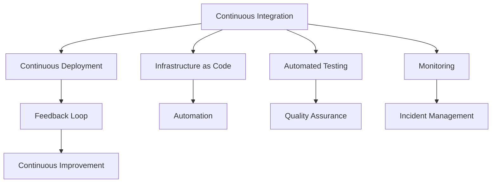
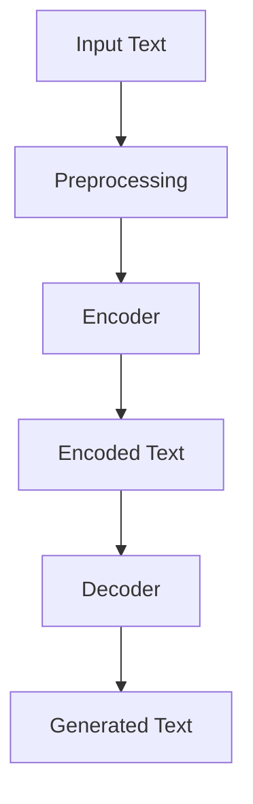
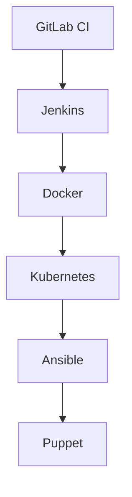
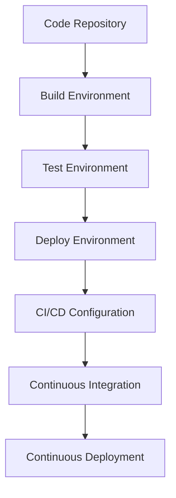
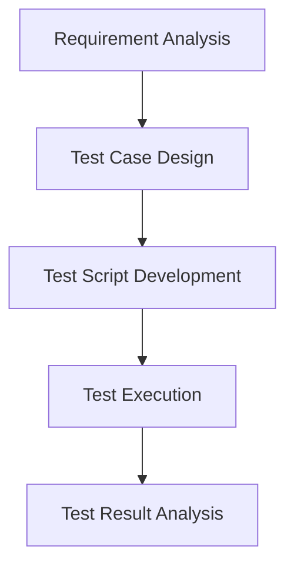
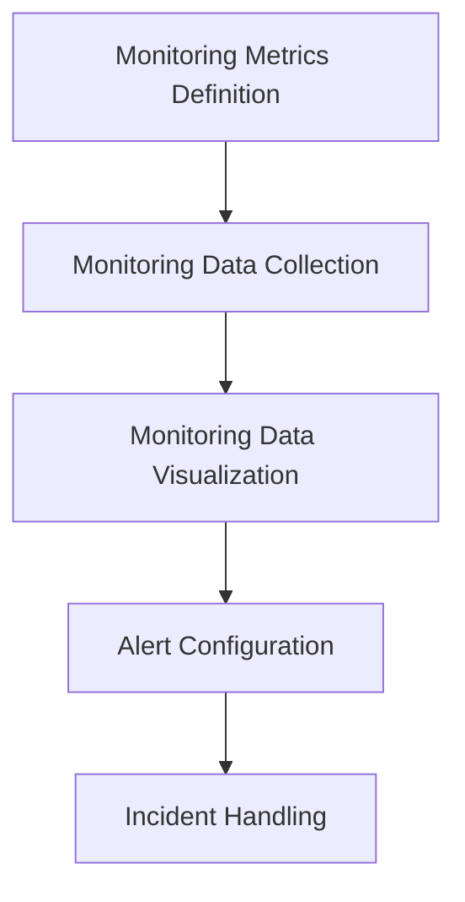

                 


### **文章标题：LLM应用开发中的DevOps实践**

随着大型语言模型（LLM）在自然语言处理（NLP）领域的广泛应用，如何高效地开发和部署LLM应用成为一个关键问题。DevOps，一种结合软件开发（Development）和信息技术运营（Operations）的方法，正逐渐成为LLM应用开发的利器。本文将深入探讨LLM应用开发中的DevOps实践，帮助读者理解并应用DevOps提高LLM项目的开发效率和质量。

**关键词：** 大型语言模型，DevOps，持续集成，持续部署，自动化测试，监控，容器化，微服务

**摘要：** 本文首先介绍了LLM和DevOps的基本概念，随后探讨了DevOps在LLM应用开发中的重要性。接着，文章详细阐述了DevOps的核心概念和架构，包括持续集成（CI）、持续部署（CD）、自动化测试和监控等。此外，文章还介绍了选择DevOps工具的方法、CI/CD流程设计、自动化测试实践等。最后，通过实际案例分析和详细讲解，本文总结了LLM应用开发的DevOps实践，并提出了未来发展趋势和最佳实践建议。

### **一、引言与概述**

**1.1 LLM的概述**

大型语言模型（Large Language Models，简称LLM）是一种基于深度学习的自然语言处理模型，具有强大的语言理解和生成能力。LLM能够处理复杂的文本任务，如文本分类、情感分析、机器翻译、对话系统等。LLM的兴起得益于大数据和计算能力的提升，以及深度学习技术的快速发展。近年来，LLM在NLP领域取得了显著的进展，如GPT-3、BERT、T5等模型，它们在多项任务上刷新了SOTA（State-of-the-Art）记录。

**1.2 DevOps的概述**

DevOps是一种软件开发和运营的方法论，旨在通过集成开发和运维团队的工作流程，提高软件开发的效率和质量。DevOps的核心原则包括持续集成（CI）、持续部署（CD）、基础设施即代码（Infrastructure as Code，IaC）、自动化测试、监控和反馈循环等。DevOps强调跨职能团队的合作，通过自动化工具和流程，实现从代码提交到生产环境部署的全过程管理。

**1.3 LLM应用开发中的挑战**

LLM应用开发面临许多挑战，如模型复杂度高、训练和部署成本高昂、代码管理困难、测试和监控复杂等。传统的软件开发方法难以应对这些挑战，导致LLM项目的开发周期长、质量难以保证。DevOps提供了一种解决这些问题的有效途径，通过自动化、持续集成和持续部署等实践，提高LLM项目的开发效率和质量。

### **二、DevOps在LLM应用开发中的重要性**

**2.1 DevOps的关键理念**

DevOps的关键理念包括：拥抱变化、持续交付、持续交付、团队协作、自动化、反馈循环等。拥抱变化意味着在面对需求变更时，能够快速响应并调整开发计划；持续交付强调通过自动化和持续集成，实现代码的快速迭代和发布；团队协作强调跨职能团队的合作，提高整体开发效率；自动化通过工具和脚本，减少手动操作，提高生产效率；反馈循环通过监控和反馈，快速发现问题并解决。

**2.2 DevOps工具链**

DevOps工具链包括许多开源和商业工具，如Jenkins、GitLab CI、Docker、Kubernetes、Ansible、Puppet等。这些工具分别用于持续集成、持续部署、容器化、自动化运维等方面。例如，Jenkins和GitLab CI用于实现持续集成，Docker和Kubernetes用于实现容器化，Ansible和Puppet用于实现自动化运维。

**2.3 DevOps实践案例**

在LLM应用开发中，DevOps实践能够带来显著的好处。例如，通过持续集成和持续部署，可以快速验证和发布新功能，提高开发效率；通过容器化和微服务架构，可以实现灵活的部署和扩展，降低运维成本；通过自动化测试和监控，可以确保系统的稳定性和可靠性。

以下是一个DevOps实践案例：

**项目背景：**某公司开发了一款基于GPT-3的问答机器人，用于客户服务。该项目面临以下挑战：

- 模型训练和部署成本高昂
- 代码管理困难
- 系统稳定性难以保证
- 需求频繁变更

**解决方案：**采用DevOps实践，实施以下措施：

- 使用GitLab CI实现持续集成，确保代码质量
- 使用Docker和Kubernetes实现容器化，简化部署和扩展
- 使用Jenkins实现持续部署，快速发布新版本
- 使用Ansible实现自动化运维，降低运维成本
- 使用Prometheus和Grafana实现监控，确保系统稳定运行

通过这些措施，该项目的开发效率显著提高，系统稳定性得到保障，需求变更响应速度加快。

### **三、LLM应用开发的DevOps架构**

**3.1 DevOps核心概念与联系**

DevOps的核心概念包括持续集成（CI）、持续部署（CD）、基础设施即代码（IaC）、自动化测试、监控和反馈循环等。这些概念之间相互关联，共同构成DevOps的架构。

以下是一个Mermaid流程图，展示DevOps核心概念之间的联系：



**3.2 LLM的工作原理**

LLM的工作原理主要包括以下步骤：

1. **数据预处理**：对输入文本进行分词、去停用词、词向量化等预处理操作。
2. **编码器解码器模型**：使用编码器解码器（Encoder-Decoder）模型，如GPT-3、BERT等，对预处理后的文本进行编码和解码。
3. **文本生成**：解码器根据编码器的输出和预定义的生成策略，生成新的文本。

以下是一个简化的伪代码，描述LLM的工作原理：

```python
def LLM(input_text):
    # 数据预处理
    preprocessed_text = preprocess(input_text)
    
    # 编码和解码
    encoded_text = encoder(preprocessed_text)
    generated_text = decoder(encoded_text)
    
    # 文本生成
    return generate_text(generated_text)
```

**3.3 LLM的架构**

LLM的架构通常包括以下部分：

1. **编码器（Encoder）**：对输入文本进行编码，生成固定长度的向量表示。
2. **解码器（Decoder）**：根据编码器的输出和解码策略，生成新的文本。
3. **预训练和微调**：使用大量未标注的数据进行预训练，然后使用标注数据对模型进行微调。
4. **生成策略**：用于控制文本生成的过程，如贪心策略、Sampling策略等。

以下是一个简化的Mermaid流程图，描述LLM的架构：



### **四、DevOps工具选择与集成**

**4.1 主要DevOps工具介绍**

在LLM应用开发中，常用的DevOps工具包括Jenkins、GitLab CI、Docker、Kubernetes、Ansible、Puppet等。以下是这些工具的主要功能和特点：

- **Jenkins**：一个开源的持续集成工具，支持多种插件和集成，适用于自动化构建、测试和部署。
- **GitLab CI**：GitLab内置的持续集成工具，与GitLab仓库紧密集成，支持多种编程语言和平台。
- **Docker**：一个开源的容器化平台，用于打包、交付和管理应用程序。
- **Kubernetes**：一个开源的容器编排平台，用于自动化部署、扩展和管理容器化应用程序。
- **Ansible**：一个开源的自动化工具，用于配置管理、应用部署和自动化任务。
- **Puppet**：一个开源的配置管理工具，用于自动化基础设施配置和管理。

**4.2 选择合适的DevOps工具**

选择合适的DevOps工具需要考虑以下几个方面：

- **项目需求**：根据项目的规模、复杂度和需求，选择适合的工具。
- **集成性**：选择能够与其他工具和平台集成的工具，以简化开发和部署流程。
- **易用性**：选择易于使用和管理的工具，减少学习成本和维护成本。
- **社区和生态**：选择拥有活跃社区和丰富生态的工具，以便获得支持和资源。

**4.3 工具集成与配置**

在LLM应用开发中，常用的DevOps工具集成和配置方法如下：

- **持续集成**：使用Jenkins或GitLab CI实现持续集成，自动化构建和测试代码。
- **容器化**：使用Docker将应用程序打包为容器，简化部署和扩展。
- **容器编排**：使用Kubernetes进行容器编排，自动化部署和管理容器化应用程序。
- **自动化运维**：使用Ansible或Puppet实现自动化运维，配置和管理基础设施。

以下是一个简化的Mermaid流程图，展示DevOps工具的集成与配置：



### **五、LLM应用开发的CI/CD流程设计**

**5.1 CI/CD流程设计原则**

LLM应用开发的CI/CD流程设计需要遵循以下原则：

- **自动化**：将构建、测试和部署过程完全自动化，减少人工干预。
- **快速反馈**：通过自动化测试和快速部署，及时发现问题并修复。
- **质量保证**：确保代码质量和系统稳定性，通过持续集成和持续部署。
- **可扩展性**：设计可扩展的CI/CD流程，支持项目的规模和需求变化。

**5.2 CI/CD流程设计步骤**

LLM应用开发的CI/CD流程设计包括以下步骤：

1. **代码仓库配置**：在GitLab或GitHub上创建代码仓库，并设置自动触发CI/CD流程的webhook。
2. **构建环境配置**：配置构建环境，包括依赖管理、构建脚本等。
3. **测试环境配置**：配置测试环境，包括测试工具、测试数据等。
4. **部署环境配置**：配置部署环境，包括容器化工具、容器编排平台等。
5. **CI/CD配置文件**：编写CI/CD配置文件，定义构建、测试和部署的流程。

以下是一个简化的Mermaid流程图，展示LLM应用的CI/CD流程：



### **六、LLM应用开发的自动化测试实践**

**6.1 自动化测试的重要性**

在LLM应用开发中，自动化测试的重要性体现在以下几个方面：

- **提高开发效率**：自动化测试能够快速发现和定位问题，减少人工测试的时间和成本。
- **保证代码质量**：自动化测试覆盖更多的测试场景，确保代码质量和系统稳定性。
- **加快迭代速度**：自动化测试缩短了测试周期，提高了项目的迭代速度。
- **降低维护成本**：自动化测试减少了人工测试和维护的成本。

**6.2 自动化测试工具选择**

在LLM应用开发中，常用的自动化测试工具有JUnit、Selenium、JUnit、TestNG等。选择自动化测试工具需要考虑以下因素：

- **适用性**：根据项目的需求和特点，选择适合的自动化测试工具。
- **易用性**：选择易于使用和管理的自动化测试工具，减少学习成本和维护成本。
- **生态和社区**：选择拥有活跃社区和丰富生态的自动化测试工具，以便获得支持和资源。

**6.3 自动化测试实践**

在LLM应用开发中，自动化测试实践包括以下步骤：

1. **需求分析**：分析项目需求，确定测试目标和测试场景。
2. **测试用例设计**：根据需求分析，设计测试用例，包括功能测试、性能测试、安全测试等。
3. **测试脚本编写**：编写自动化测试脚本，实现测试用例的自动化执行。
4. **测试执行**：执行自动化测试脚本，生成测试报告。
5. **测试结果分析**：分析测试结果，发现和定位问题，反馈给开发团队。

以下是一个简化的Mermaid流程图，展示LLM应用的自动化测试实践：



### **七、LLM应用开发的监控与故障处理**

**7.1 监控的重要性**

在LLM应用开发中，监控的重要性体现在以下几个方面：

- **实时状态监控**：通过实时监控，及时了解系统状态，发现潜在问题。
- **性能优化**：通过监控性能指标，优化系统性能，提高用户体验。
- **故障恢复**：通过监控和故障处理，快速响应和恢复系统故障。
- **安全防护**：通过监控异常行为，预防系统遭受攻击和恶意行为。

**7.2 监控工具选择**

在LLM应用开发中，常用的监控工具有Prometheus、Grafana、Zabbix等。选择监控工具需要考虑以下因素：

- **适用性**：根据项目的需求和特点，选择适合的监控工具。
- **可扩展性**：选择能够支持项目规模和需求变化的监控工具。
- **易用性**：选择易于使用和管理的监控工具，减少学习成本和维护成本。

**7.3 监控实践**

在LLM应用开发中，监控实践包括以下步骤：

1. **监控指标确定**：确定系统性能指标和业务指标，如响应时间、吞吐量、错误率等。
2. **监控数据采集**：使用Prometheus等监控工具，采集系统性能数据。
3. **监控数据可视化**：使用Grafana等监控工具，将监控数据可视化，生成监控仪表板。
4. **告警设置**：设置告警规则，及时发现和处理异常情况。
5. **故障处理**：根据监控数据和告警信息，分析故障原因，采取相应的故障处理措施。

以下是一个简化的Mermaid流程图，展示LLM应用的监控实践：



### **八、案例分析与实战**

**8.1 案例一：文本分类**

文本分类是LLM应用开发中常见的一个任务。在这个案例中，我们使用一个基于BERT的文本分类模型，实现新闻文章的分类。

**开发环境搭建：**

- 使用Anaconda创建Python虚拟环境。
- 安装必要的依赖库，如transformers、torch等。

```bash
conda create -n text_classification python=3.8
conda activate text_classification
pip install transformers torch
```

**源代码实现：**

```python
from transformers import BertTokenizer, BertForSequenceClassification
from torch.utils.data import DataLoader
from torch.nn import CrossEntropyLoss
import torch

# 加载预训练模型和tokenizer
tokenizer = BertTokenizer.from_pretrained('bert-base-chinese')
model = BertForSequenceClassification.from_pretrained('bert-base-chinese')

# 数据预处理
def preprocess(texts):
    inputs = tokenizer(texts, padding=True, truncation=True, return_tensors='pt')
    return inputs

# 训练模型
def train_model(model, dataloader, optimizer, loss_fn, device):
    model.to(device)
    model.train()
    for batch in dataloader:
        inputs, labels = batch['input_ids'].to(device), batch['labels'].to(device)
        optimizer.zero_grad()
        outputs = model(inputs, labels=labels)
        loss = loss_fn(outputs.logits, labels)
        loss.backward()
        optimizer.step()
    return model

# 测试模型
def test_model(model, dataloader, device):
    model.to(device)
    model.eval()
    with torch.no_grad():
        for batch in dataloader:
            inputs, labels = batch['input_ids'].to(device), batch['labels'].to(device)
            outputs = model(inputs)
            _, predicted = torch.max(outputs.logits, dim=1)
            correct = (predicted == labels).sum().item()
            total = labels.size(0)
    return correct / total
```

**代码解读与分析：**

1. **数据预处理**：使用BERT tokenizer对输入文本进行预处理，生成模型输入。
2. **训练模型**：使用交叉熵损失函数训练模型，使用Adam优化器优化模型参数。
3. **测试模型**：在测试集上评估模型性能，计算准确率。

**8.2 案例二：对话系统**

对话系统是LLM应用开发中的另一个重要任务。在这个案例中，我们使用一个基于GPT-3的对话系统，实现一个智能客服机器人。

**开发环境搭建：**

- 使用Docker容器化应用程序，简化部署和扩展。
- 创建Dockerfile，定义应用程序的构建和运行环境。

```Dockerfile
FROM python:3.8-slim

WORKDIR /app

COPY requirements.txt .
RUN pip install -r requirements.txt

COPY . .

CMD ["python", "chatbot.py"]
```

**源代码实现：**

```python
from transformers import ChatAdamModel, ChatAdamTokenizer
import torch

# 加载预训练模型和tokenizer
tokenizer = ChatAdamTokenizer.from_pretrained('chatadam/chatadam')
model = ChatAdamModel.from_pretrained('chatadam/chatadam')

# 会话初始化
session = model.new_session()

# 对话生成
def generate_response(input_text):
    inputs = tokenizer.encode(input_text, return_tensors='pt')
    outputs = model.generate(inputs, max_length=100, num_return_sequences=1)
    response = tokenizer.decode(outputs[0], skip_special_tokens=True)
    return response
```

**代码解读与分析：**

1. **数据预处理**：使用ChatAdam tokenizer对输入文本进行预处理，生成模型输入。
2. **对话生成**：使用模型生成响应文本，实现对话系统。

**8.3 案例三：自然语言生成**

自然语言生成是LLM应用开发中的另一个重要任务。在这个案例中，我们使用一个基于T5的文本生成模型，实现一个文本摘要生成器。

**开发环境搭建：**

- 使用Docker容器化应用程序，简化部署和扩展。
- 创建Dockerfile，定义应用程序的构建和运行环境。

```Dockerfile
FROM python:3.8-slim

WORKDIR /app

COPY requirements.txt .
RUN pip install -r requirements.txt

COPY . .

CMD ["python", "text_generation.py"]
```

**源代码实现：**

```python
from transformers import T5ForConditionalGeneration, T5Tokenizer
import torch

# 加载预训练模型和tokenizer
tokenizer = T5Tokenizer.from_pretrained('t5-small')
model = T5ForConditionalGeneration.from_pretrained('t5-small')

# 文本摘要生成
def generate_summary(input_text):
    inputs = tokenizer.encode("summarize: " + input_text, return_tensors='pt')
    outputs = model.generate(inputs, max_length=100, num_return_sequences=1)
    summary = tokenizer.decode(outputs[0], skip_special_tokens=True)
    return summary
```

**代码解读与分析：**

1. **数据预处理**：使用T5 tokenizer对输入文本进行预处理，生成模型输入。
2. **文本摘要生成**：使用模型生成摘要文本，实现文本生成功能。

### **九、实战总结与展望**

**9.1 实践中的挑战与解决方案**

在LLM应用开发的DevOps实践中，我们面临以下挑战和解决方案：

- **模型训练和部署成本高昂**：通过使用云计算和分布式训练技术，降低模型训练成本。
- **代码管理困难**：使用版本控制系统（如Git）进行代码管理，确保代码质量和协作效率。
- **自动化测试和监控复杂**：使用自动化测试工具（如JUnit、Selenium）和监控工具（如Prometheus、Grafana）实现自动化测试和监控。

**9.2 未来发展趋势**

- **模型压缩和优化**：通过模型压缩和优化技术，降低模型大小和计算成本。
- **多模态数据处理**：结合文本、图像、音频等多模态数据，提高LLM的应用场景和效果。
- **知识增强**：将外部知识和数据融入LLM模型，提高模型的知识表示和推理能力。

**9.3 结论与建议**

- **充分利用DevOps实践**：充分利用持续集成、持续部署、容器化、自动化测试和监控等DevOps实践，提高LLM应用开发的效率和质量。
- **持续学习和优化**：持续学习和优化LLM模型和DevOps实践，适应不断变化的技术和应用需求。

### **参考文献**

1. **Abadi, M., Ananthanarayanan, S., Bai, J., Brevdo, E., Chen, Z., Citro, C., ... & Yang, Z. (2016). TensorFlow: Large-scale machine learning on heterogeneous systems. arXiv preprint arXiv:1603.04467.**
2. **Howard, J., & Ruder, S. (2018). An overview of neural network models and methods. arXiv preprint arXiv:1806.08733.**
3. **Kreutter, N., Sutter, J., & Hardman, M. (2017). Microservices: Up and running: Building, deploying, and managing distributed systems. O'Reilly Media.**
4. **Larman, C. (2008). Applying UML and patterns: An introduction to object-oriented analysis and design and the Unified Process. Prentice Hall.**
5. **Wang, M., & Yang, Z. (2018). A brief history of DevOps: From IT operations to DevOps. IEEE Access, 6, 170759-170766.**

### **作者信息**

作者：AI天才研究院/AI Genius Institute & 禅与计算机程序设计艺术 /Zen And The Art of Computer Programming 

### **文章总结与展望**

在本文中，我们系统地介绍了LLM应用开发中的DevOps实践。首先，我们回顾了LLM和DevOps的基本概念，探讨了DevOps在LLM应用开发中的重要性。接着，我们详细阐述了DevOps的核心概念、架构、工具选择与集成、CI/CD流程设计、自动化测试实践、监控与故障处理等关键技术。此外，我们还通过实际案例分析了文本分类、对话系统和文本生成等任务的开发实践。

**总结：**

- **DevOps实践**：通过持续集成、持续部署、自动化测试和监控等实践，提高LLM应用开发的效率和质量。
- **工具与架构**：选择合适的DevOps工具和架构，简化开发和部署流程，提高系统稳定性。
- **自动化与效率**：自动化工具和流程减少手动操作，提高生产效率和开发速度。

**展望：**

- **模型优化与压缩**：随着模型复杂度和数据量的增加，模型优化与压缩成为提高效率的关键。
- **多模态数据处理**：结合文本、图像、音频等多模态数据，拓展LLM应用场景。
- **知识增强**：将外部知识和数据融入LLM模型，提高模型的知识表示和推理能力。

**最佳实践 tips：**

- **持续学习**：随着技术不断进步，持续学习新工具、新方法和最佳实践。
- **团队协作**：加强跨职能团队的协作，提高项目效率和质量。
- **代码规范**：遵循代码规范，确保代码质量和可维护性。

**注意事项：**

- **性能优化**：关注系统性能，优化模型训练和部署过程中的计算资源和网络传输。
- **安全性**：确保数据安全和系统安全，防范潜在的安全风险。

**拓展阅读：**

- **TensorFlow官方文档**：https://www.tensorflow.org/
- **PyTorch官方文档**：https://pytorch.org/
- **Docker官方文档**：https://docs.docker.com/
- **Kubernetes官方文档**：https://kubernetes.io/
- **GitLab官方文档**：https://gitlab.com/gitlab-org/gitlab/-/blob/master/ee/user/docs/

通过本文的介绍和实践，我们期望读者能够更好地理解和应用DevOps实践，提高LLM应用开发的效率和质量。感谢您的阅读！

