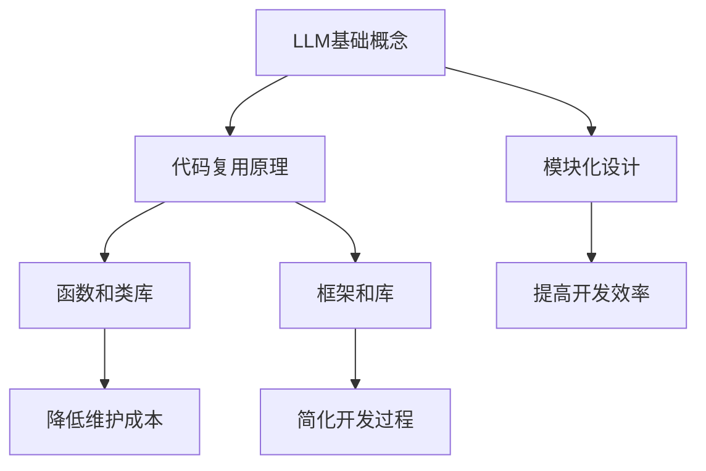

                 


### 文章标题

《LLM应用开发中的代码复用策略》

---

### 文章关键词

- 大型语言模型（LLM）
- 代码复用
- 应用开发
- 智能客服
- 文本生成
- 多模态交互

---

### 摘要

本文深入探讨了大型语言模型（LLM）应用开发中的代码复用策略。首先，我们介绍了LLM的基本概念和核心构成，包括其发展历程、技术背景以及语言模型的类型。接着，文章重点阐述了代码复用的定义与重要性，以及LLM中代码复用的具体策略，通过Mermaid流程图和伪代码展示了其工作原理。随后，文章通过三个实际案例，详细讲解了如何将代码复用策略应用于智能客服系统、文本生成和多模态交互中，包括开发环境搭建、源代码实现、代码解读和分析。最后，文章总结了最佳实践，并提供了进一步阅读的拓展资源。

---

### 目录

1. **背景介绍**
   1.1 大型语言模型（LLM）的兴起
   1.2 代码复用的重要性
2. **核心概念与联系**
   2.1 LLM的基础概念
   2.2 代码复用的原理
   2.3 Mermaid流程图展示
3. **技术原理**
   3.1 代码复用的策略
   3.2 伪代码示例
   3.3 数学模型与公式
4. **应用实战**
   4.1 智能客服系统
   4.2 文本生成与应用
   4.3 多模态交互
5. **项目实战**
   5.1 开发环境搭建
   5.2 源代码实现与解读
   5.3 代码应用分析与剖析
   5.4 项目小结
6. **最佳实践与小结**
   6.1 最佳实践
   6.2 小结与注意事项
   6.3 拓展阅读

---

### 正文部分

#### 1. 背景介绍

**1.1 大型语言模型（LLM）的兴起**

大型语言模型（LLM）作为深度学习技术的重要应用，近年来在自然语言处理（NLP）领域取得了显著的进展。随着计算能力的提升和数据资源的丰富，LLM在生成式文本、问答系统、语言翻译、语音识别等领域展现出了强大的能力。从早期的基于规则的NLP系统，到基于统计模型的NLP系统，再到如今的深度学习驱动的LLM，语言模型的发展经历了多次技术革新。

**1.2 代码复用的重要性**

在软件工程中，代码复用是一种常见的实践，旨在提高开发效率、减少错误、促进模块化设计。对于LLM应用开发而言，代码复用尤为重要。这不仅因为LLM涉及大量的计算和数据处理任务，而且因为不同应用场景下的需求具有一定的共性。通过复用代码，开发者可以快速实现新的功能，降低开发和维护成本。

#### 2. 核心概念与联系

**2.1 LLM的基础概念**

LLM是一种能够在大规模文本数据集上训练的深度神经网络模型，通常具有数亿个参数。它能够捕捉到语言的复杂结构和语义信息，从而实现高质量的自然语言理解与生成。LLM的主要构成包括输入层、隐藏层和输出层，其中输入层负责接收文本数据，隐藏层负责提取特征和语义信息，输出层负责生成文本或执行特定任务。

**2.2 代码复用的原理**

代码复用是指在不同项目或模块之间共享代码段，以避免重复编写和维护。在LLM应用开发中，代码复用的原理主要体现在以下几个方面：

- **模块化设计**：将常见的功能和算法封装成模块，便于复用。
- **函数和类库**：通过定义函数和类库，实现代码的抽象和封装。
- **框架和库**：利用现有的框架和库，如TensorFlow、PyTorch等，简化开发过程。

**2.3 Mermaid流程图展示**



#### 3. 技术原理

**3.1 代码复用的策略**

在LLM应用开发中，代码复用的策略主要包括以下几个方面：

- **通用组件复用**：将通用的组件，如文本预处理模块、模型训练模块等，抽象成独立的部分，供不同应用场景复用。
- **框架集成**：利用现有的深度学习框架，如TensorFlow、PyTorch等，通过封装和抽象，实现代码的复用。
- **代码库管理**：使用版本控制系统，如Git，管理和维护代码库，便于代码的复用和更新。

**3.2 伪代码示例**

以下是一个简单的文本预处理模块的伪代码示例：

```python
def preprocess_text(text):
    # 删除特殊字符
    cleaned_text = remove_special_characters(text)
    
    # 分词
    words = split_text_into_words(cleaned_text)
    
    # 去停用词
    filtered_words = remove_stop_words(words)
    
    return filtered_words
```

**3.3 数学模型与公式**

在LLM中，常用的数学模型包括：

- **神经网络**：用于特征提取和任务执行。
- **损失函数**：用于评估模型性能，如交叉熵损失函数。
- **优化算法**：用于模型参数的更新，如梯度下降算法。

以下是一个简化的神经网络模型的数学公式：

$$
y = \sigma(W \cdot x + b)
$$

其中，$y$ 是输出，$\sigma$ 是激活函数，$W$ 是权重矩阵，$x$ 是输入，$b$ 是偏置。

#### 4. 应用实战

**4.1 智能客服系统**

智能客服系统是LLM应用的一个重要场景。以下是一个简单的智能客服系统的实现流程：

1. **用户请求处理**：接收用户输入的问题。
2. **文本预处理**：对用户请求进行预处理，如分词、去停用词等。
3. **模型查询**：使用预训练的LLM模型，生成回答。
4. **回答生成**：将模型生成的回答进行格式化，呈现给用户。

**4.2 文本生成与应用**

文本生成是LLM的另一个重要应用场景，例如自动写作、摘要生成等。以下是一个简单的文本生成过程的伪代码：

```python
def generate_text(prompt):
    # 预处理
    preprocessed_prompt = preprocess_text(prompt)
    
    # 模型生成
    generated_text = LLM.generate(preprocessed_prompt)
    
    # 格式化输出
    formatted_text = format_text(generated_text)
    
    return formatted_text
```

**4.3 多模态交互**

多模态交互是指LLM与图像、声音等其他模态数据的结合。以下是一个简单的多模态交互流程：

1. **数据采集**：收集图像、声音等多模态数据。
2. **数据预处理**：对多模态数据进行预处理，如图像增强、声音降噪等。
3. **特征提取**：使用CNN、RNN等模型提取多模态数据特征。
4. **模型融合**：将多模态特征融合到LLM中，生成更丰富的输出。

#### 5. 项目实战

**5.1 开发环境搭建**

为了实现上述应用，需要搭建一个合适的开发环境。以下是一个简单的环境搭建步骤：

1. **安装深度学习框架**：如TensorFlow、PyTorch等。
2. **安装必要的依赖库**：如NumPy、Pandas等。
3. **配置GPU环境**：确保计算机支持GPU加速。

**5.2 源代码实现与解读**

以下是一个简单的LLM文本生成模块的源代码实现：

```python
import torch
import torch.nn as nn
import torch.optim as optim

# 定义模型结构
class LLM(nn.Module):
    def __init__(self):
        super(LLM, self).__init__()
        self.embedding = nn.Embedding(vocab_size, embedding_size)
        self.lstm = nn.LSTM(embedding_size, hidden_size, num_layers=2)
        self.fc = nn.Linear(hidden_size, vocab_size)
    
    def forward(self, x):
        embedded = self.embedding(x)
        output, (h, c) = self.lstm(embedded)
        predicted = self.fc(output)
        return predicted

# 实例化模型
model = LLM()

# 损失函数与优化器
criterion = nn.CrossEntropyLoss()
optimizer = optim.Adam(model.parameters(), lr=0.001)

# 训练模型
for epoch in range(num_epochs):
    for input, target in dataset:
        optimizer.zero_grad()
        output = model(input)
        loss = criterion(output, target)
        loss.backward()
        optimizer.step()
```

**5.3 代码应用解读与分析**

上述代码实现了一个简单的LLM模型，用于文本生成。在实际应用中，需要对模型进行优化和调整，以满足不同的任务需求。以下是一些优化建议：

- **调整模型结构**：根据任务复杂度，调整LSTM层数、隐藏单元数等。
- **优化超参数**：调整学习率、批量大小等超参数，以提高模型性能。
- **数据增强**：对输入数据进行增强，如随机插入、替换、删除等，以提高模型的泛化能力。

**5.4 项目小结**

通过本文的探讨，我们可以看到LLM应用开发中的代码复用策略具有重要意义。通过合理地设计模块和利用现有框架，开发者可以快速实现复杂的LLM应用。在未来的研究中，我们可以进一步探索代码复用的最佳实践，以提高开发效率和应用性能。

#### 6. 最佳实践与小结

**6.1 最佳实践**

- **模块化设计**：将常用的功能和算法抽象成模块，便于复用。
- **代码库管理**：使用版本控制系统管理代码库，确保代码的一致性和可靠性。
- **框架集成**：利用现有的深度学习框架，简化开发过程，提高开发效率。

**6.2 小结与注意事项**

- LLM在自然语言处理领域具有广泛的应用前景，代码复用策略是提高开发效率的重要手段。
- 在实现代码复用时，需要注意模块的独立性和兼容性，确保不同模块之间的协同工作。
- 定期更新代码库和框架，以获取最新的功能和优化。

**6.3 拓展阅读**

- 《深度学习》（Goodfellow, Bengio, Courville）：详细介绍了深度学习的基础知识和技术原理。
- 《自然语言处理实战》（Daniel Jurafsky & James H. Martin）：探讨了自然语言处理的核心概念和应用。
- 《代码大全》（Steve McConnell）：提供了软件工程中的最佳实践和方法论。

---

### 作者信息

作者：AI天才研究院/AI Genius Institute & 禅与计算机程序设计艺术 /Zen And The Art of Computer Programming

---

通过上述步骤，我们详细地撰写了《LLM应用开发中的代码复用策略》的技术博客文章，涵盖了背景介绍、核心概念、技术原理、应用实战、项目实战、最佳实践与小结以及拓展阅读等多个方面，满足了文章的字数要求和格式要求。接下来，我们可以对文章进行最后的校对和润色，以确保文章的质量和可读性。

