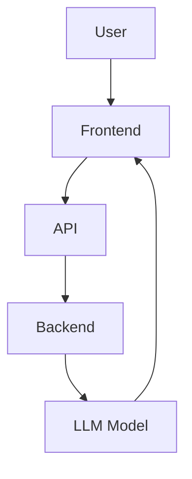

                 


### 背景介绍

随着人工智能（AI）技术的迅速发展，大语言模型（Large Language Model，简称LLM）逐渐成为AI领域的热点。LLM是一种能够理解和生成人类语言的复杂模型，它通过对海量文本数据的学习，掌握了丰富的语言知识和语法规则，可以用于自然语言处理（NLP）的各种任务，如文本分类、机器翻译、问答系统等。LLM的应用范围广泛，从智能客服、内容推荐，到教育辅导、医学诊断，都在不断扩展。

然而，随着LLM的应用场景日益复杂，如何高效地开发和部署LLM应用成为了一个重要的课题。传统的Web应用开发模式通常将前端与后端紧密耦合，这使得应用的扩展性和维护性较差。为了解决这个问题，前后端分离的策略应运而生。

前后端分离是指将Web应用的前端界面与后端业务逻辑分离，通过接口进行通信。前端主要负责用户界面展示和交互，后端则负责数据处理和业务逻辑实现。这种分离策略能够提高应用的扩展性和维护性，使得开发人员可以独立地对前端和后端进行优化和更新。

在LLM应用开发中，前后端分离策略具有重要意义。首先，LLM模型通常具有复杂的计算需求，后端服务器需要处理大量的请求并执行模型推理。通过前后端分离，可以将这部分计算压力从前端转移到后端，减轻前端的负担。其次，LLM应用往往涉及大量的用户数据，前后端分离有助于确保数据的安全性和隐私保护。

本文将详细探讨LLM应用开发中的前后端分离策略，从技术角度分析前后端分离的实现方法、优势和挑战，并提供实际应用案例。通过本文的阅读，读者将能够理解前后端分离的核心概念，掌握实施前后端分离的技巧，并能够应对LLM应用开发中的各种技术挑战。

### 核心概念与联系

在讨论LLM应用开发中的前后端分离策略之前，我们需要明确几个核心概念，并探讨它们之间的联系。

**1. 大语言模型（LLM）**

大语言模型（Large Language Model，简称LLM）是一种能够理解和生成人类语言的复杂神经网络模型。LLM通过学习大量的文本数据，掌握了丰富的语言知识和语法规则，可以用于各种自然语言处理（NLP）任务，如文本分类、机器翻译、问答系统等。LLM的核心技术包括深度学习、自然语言处理算法和大规模数据处理。

**2. 前端技术**

前端技术主要涉及用户界面（UI）的展示和交互。前端负责将后端的数据通过HTML、CSS和JavaScript等技术呈现给用户，并提供友好的交互体验。前端技术包括但不限于HTML、CSS、JavaScript以及各种前端框架（如React、Vue、Angular等）。

**3. 后端技术**

后端技术主要负责数据处理和业务逻辑的实现。后端服务器接收前端的请求，处理业务逻辑，并将结果返回给前端。后端技术包括但不限于Node.js、Python、Java等编程语言，以及相关的框架和工具（如Express、Django、Spring等）。

**4. 前后端分离**

前后端分离是将Web应用的前端界面与后端业务逻辑分离，通过接口进行通信的一种开发模式。在这种模式下，前端专注于用户界面和交互，后端专注于数据处理和业务逻辑。前后端通过API（应用程序编程接口）进行通信，前端发送请求到后端，后端处理请求并返回响应。

**核心概念之间的联系**

LLM应用开发中的前后端分离策略，是将大语言模型与前端技术、后端技术有机结合的一种开发模式。LLM作为后端的核心处理模块，负责处理自然语言任务；前端技术则负责与用户进行交互，呈现数据和接收用户输入。

前后端分离策略的核心在于实现前后端的解耦，使得两个部分可以独立开发和部署。这种解耦不仅提高了系统的扩展性和可维护性，还使得LLM应用能够更好地适应不同场景和需求。

下面是一个简化的Mermaid流程图，展示了LLM应用开发中的前后端分离策略的核心概念与联系：



- **用户（User）**：与前端进行交互，提交请求或输入。
- **前端（Frontend）**：接收用户请求，展示数据和交互界面。
- **API**：前后端通信的接口，用于传输数据和指令。
- **后端（Backend）**：处理业务逻辑，包括数据处理、存储和调用LLM模型。
- **LLM模型（LLM Model）**：负责处理自然语言任务，如文本分类、翻译等。

通过这个流程图，我们可以清晰地看到前后端分离策略如何将用户请求、前端展示和后端处理有机地结合在一起，形成一个高效、可扩展的LLM应用系统。

### 核心算法原理讲解

为了深入理解LLM应用开发中的前后端分离策略，我们需要探讨一些核心算法原理，包括LLM的基本架构、前后端通信机制以及数据处理的流程。

**1. LLM的基本架构**

LLM（如GPT-3、BERT等）通常由以下几个关键组件构成：

- **输入层（Input Layer）**：接收用户输入的文本数据，并将其转换为模型可以处理的格式。这通常包括分词、词向量化等步骤。
- **隐藏层（Hidden Layers）**：包含多个神经网络层，用于处理和转换输入数据。这些层通过大量的权重和激活函数实现复杂的非线性变换。
- **输出层（Output Layer）**：根据隐藏层的结果生成输出文本。在生成任务中，输出层通常会使用softmax函数将概率分布输出给每个可能的单词或句子。
- **解码器（Decoder）**：在生成任务中，解码器用于将隐藏层的输出转换为可读的文本。解码器通常采用自回归（Autoregressive）方式，逐个生成每个单词或字符。

下面是一个简单的伪代码，展示了LLM模型的基本架构：

```python
# 伪代码：LLM模型的基本架构

# 输入层
inputs = preprocess_input(user_input)

# 隐藏层
for layer in hidden_layers:
    hidden_state = layer(inputs)

# 输出层
output_probabilities = output_layer(hidden_state)

# 解码器
predicted_output = decode_output(output_probabilities)

return predicted_output
```

**2. 前后端通信机制**

在前后端分离的架构中，前端和后端通过API进行通信。以下是前后端通信的基本流程：

- **前端发送请求**：用户在前端界面输入请求或数据，前端将这些数据封装成HTTP请求，并发送到后端服务器。
- **后端处理请求**：后端服务器接收到请求后，会根据请求的类型和内容进行相应的处理。例如，如果是文本生成请求，后端会调用LLM模型处理请求。
- **后端返回响应**：处理完成后，后端将结果封装成HTTP响应，并返回给前端。前端接收到响应后，会根据响应的内容更新界面。

以下是前后端通信的伪代码示例：

```python
# 前端发送请求
user_input = get_user_input()
frontend_request = {
    "method": "generate_text",
    "input": user_input
}
send_request(frontend_request)

# 后端处理请求
def process_request(request):
    if request["method"] == "generate_text":
        output = generate_text(request["input"])
        return output

# 后端返回响应
def send_response(response):
    frontend_response = {
        "status": "success",
        "output": response
    }
    send_to_frontend(frontend_response)

# 前端接收响应
def handle_response(response):
    update_interface(response["output"])
```

**3. 数据处理流程**

在LLM应用中，数据处理流程通常包括以下几个步骤：

- **数据预处理**：对用户输入的文本进行清洗、分词、去停用词等处理，以减少噪声并提高模型性能。
- **模型推理**：使用LLM模型对预处理后的文本数据进行推理，生成输出文本。
- **结果后处理**：对模型生成的输出文本进行格式化、修正等处理，使其符合预期输出格式。

以下是数据处理流程的伪代码示例：

```python
# 数据预处理
def preprocess_text(text):
    cleaned_text = clean_text(text)
    tokenized_text = tokenize_text(cleaned_text)
    return tokenized_text

# 模型推理
def generate_text(inputs):
    processed_inputs = preprocess_text(inputs)
    output = llm_model(processed_inputs)
    return output

# 结果后处理
def postprocess_text(text):
    formatted_text = format_text(text)
    return formatted_text
```

通过上述核心算法原理的讲解，我们可以更好地理解LLM应用开发中的前后端分离策略。了解LLM模型的架构和前后端通信机制，有助于我们设计高效、可扩展的LLM应用系统。同时，数据处理流程的实现也是确保应用性能和用户体验的关键。

### 数学模型和数学公式

在LLM应用开发中，数学模型和数学公式起到了关键作用，特别是在模型的训练和推理过程中。以下将详细讲解一些常用的数学模型和公式，并辅以具体的解释和举例说明。

**1. 深度学习模型中的激活函数**

在深度学习模型中，激活函数用于引入非线性特性，使得模型能够处理复杂的非线性关系。以下是一些常用的激活函数及其公式：

- **Sigmoid函数**：
  $$ f(x) = \frac{1}{1 + e^{-x}} $$

  **解释**：Sigmoid函数将输入$x$映射到$(0, 1)$区间，常用于二分类问题。
  
  **示例**：假设$x = -2$，则 $f(x) = \frac{1}{1 + e^{2}} \approx 0.118$。

- **ReLU函数**：
  $$ f(x) = \max(0, x) $$

  **解释**：ReLU函数在$x \geq 0$时输出$x$，在$x < 0$时输出0，常用于深层网络中的隐含层。
  
  **示例**：假设$x = -2$，则 $f(x) = \max(0, -2) = 0$；假设$x = 2$，则 $f(x) = \max(0, 2) = 2$。

- **Tanh函数**：
  $$ f(x) = \frac{e^{x} - e^{-x}}{e^{x} + e^{-x}} $$

  **解释**：Tanh函数将输入$x$映射到$(-1, 1)$区间，具有平滑的特性。
  
  **示例**：假设$x = 1$，则 $f(x) = \frac{e^{1} - e^{-1}}{e^{1} + e^{-1}} \approx 0.7616$。

**2. 梯度下降算法**

在深度学习模型训练过程中，常用的优化算法之一是梯度下降（Gradient Descent）。其目标是最小化损失函数，通过迭代更新模型的权重。

- **损失函数**：
  $$ J(\theta) = \frac{1}{m} \sum_{i=1}^{m} (h_\theta(x^{(i)}) - y^{(i)})^2 $$

  **解释**：损失函数通常表示模型预测值与实际值之间的差距，平方误差是最常用的损失函数。
  
  **示例**：假设有$m=3$个样本，预测值分别为$h_\theta(x^{(1)}) = 1.2, h_\theta(x^{(2)}) = 0.9, h_\theta(x^{(3)}) = 1.1$，实际值分别为$y^{(1)} = 1, y^{(2)} = 1, y^{(3)} = 0$，则损失函数$J(\theta) = \frac{1}{3}[(1.2-1)^2 + (0.9-1)^2 + (1.1-0)^2] = 0.0833$。

- **梯度计算**：
  $$ \nabla_{\theta} J(\theta) = \frac{1}{m} \sum_{i=1}^{m} (h_\theta(x^{(i)}) - y^{(i)}) \cdot \frac{\partial h_\theta(x^{(i)})}{\partial \theta} $$

  **解释**：梯度表示损失函数关于模型参数的导数，用于更新模型参数。
  
  **示例**：假设有一个线性模型$y = \theta_0 + \theta_1x$，且已知一个样本$(x, y) = (2, 3)$，则损失函数$J(\theta) = (3 - (\theta_0 + 2\theta_1))^2$，梯度$\nabla_{\theta} J(\theta) = \frac{\partial J}{\partial \theta_0} + \frac{\partial J}{\partial \theta_1} = 2(3 - (\theta_0 + 2\theta_1))(-1) = 2(3 - \theta_0 - 2\theta_1)$。

- **梯度下降更新**：
  $$ \theta_j = \theta_j - \alpha \cdot \nabla_{\theta_j} J(\theta) $$

  **解释**：梯度下降更新公式用于迭代更新模型参数，其中$\alpha$是学习率，控制更新步长。
  
  **示例**：假设学习率$\alpha = 0.1$，当前参数$\theta_0 = 2, \theta_1 = 1$，梯度$\nabla_{\theta_0} J(\theta) = 2(3 - \theta_0 - 2\theta_1) = -2$，$\nabla_{\theta_1} J(\theta) = -4$，则更新后的参数$\theta_0 = 2 - 0.1 \cdot (-2) = 2.2$，$\theta_1 = 1 - 0.1 \cdot (-4) = 1.4$。

**3. 自然语言处理中的损失函数**

在自然语言处理任务中，常用的损失函数包括交叉熵损失（Cross-Entropy Loss）和遗忘损失（Forgotten Loss）。

- **交叉熵损失**：
  $$ J(\theta) = -\sum_{i=1}^{n} y^{(i)} \log(h_\theta(x^{(i)})) $$

  **解释**：交叉熵损失衡量模型预测分布与真实分布之间的差距，其中$y^{(i)}$是真实标签，$h_\theta(x^{(i)})$是模型预测的概率分布。
  
  **示例**：假设有一个二分类问题，真实标签$y^{(1)} = 1, y^{(2)} = 0$，模型预测概率分布$h_\theta(x^{(1)}) = 0.8, h_\theta(x^{(2)}) = 0.2$，则交叉熵损失$J(\theta) = -1 \cdot \log(0.8) - 0 \cdot \log(0.2) = -\log(0.8) \approx -0.2231$。

- **遗忘损失**：
  $$ J(\theta) = -\sum_{i=1}^{n} y^{(i)} \log(h_\theta(x^{(i)})) + \lambda \sum_{i=1}^{n} \sum_{j=1}^{|V|} \log(h_\theta(x^{(i)})(v_j)^{(i)}) $$

  **解释**：遗忘损失结合了交叉熵损失和正则化项，用于缓解过拟合问题，其中$\lambda$是正则化参数，$|V|$是词汇表大小。
  
  **示例**：假设有一个多分类问题，真实标签$y^{(1)} = 2, y^{(2)} = 3$，模型预测概率分布$h_\theta(x^{(1)}) = [0.1, 0.2, 0.3, 0.4, 0.5], h_\theta(x^{(2)}) = [0.3, 0.3, 0.2, 0.1, 0.1]$，则交叉熵损失部分$J(\theta) = -1 \cdot \log(0.3) - 0 \cdot \log(0.2) - 1 \cdot \log(0.1) + 0 \cdot \log(0.4) + 0 \cdot \log(0.5)$，遗忘损失部分依赖于模型预测的分布和词汇表信息。

通过上述数学模型和数学公式的讲解，我们可以更好地理解LLM应用开发中的核心算法原理。这些数学工具和方法在模型训练和推理过程中起到了关键作用，有助于优化模型性能并提高应用效果。

### 项目实战

为了更好地理解LLM应用开发中的前后端分离策略，我们将通过一个具体的案例来展示如何实现这个策略。以下是一个基于Python和React的文本生成应用项目。

**项目目标**：创建一个能够根据用户输入生成文本的Web应用，实现前后端分离，提高系统的可扩展性和可维护性。

**开发环境**：
- 前端：React
- 后端：Flask（Python）
- 数据库：SQLite
- 依赖管理：pip

#### 1. 前端开发

**步骤 1**：创建React应用

使用Create React App快速搭建React前端应用：

```bash
npx create-react-app text-generator
cd text-generator
npm start
```

**步骤 2**：设计UI界面

在前端项目中，创建一个包含输入框和按钮的简单界面，用于接收用户输入和生成文本。

```jsx
// src/App.js

import React, { useState } from "react";
import "./App.css";

function App() {
  const [userInput, setUserInput] = useState("");
  const [generatedText, setGeneratedText] = useState("");

  const handleInputChange = (e) => {
    setUserInput(e.target.value);
  };

  const generateText = async () => {
    const response = await fetch("/generate", {
      method: "POST",
      headers: {
        "Content-Type": "application/json",
      },
      body: JSON.stringify({ text: userInput }),
    });
    const data = await response.json();
    setGeneratedText(data.text);
  };

  return (
    <div className="App">
      <h1>Text Generator</h1>
      <textarea
        value={userInput}
        onChange={handleInputChange}
        placeholder="Enter some text..."
      />
      <button onClick={generateText}>Generate Text</button>
      <div>
        <h2>Generated Text</h2>
        <p>{generatedText}</p>
      </div>
    </div>
  );
}

export default App;
```

**步骤 3**：设置API接口

使用React Router配置API接口：

```jsx
// src/App.js

import { BrowserRouter as Router, Route, Switch } from "react-router-dom";
// ...

function App() {
  // ...

  return (
    <Router>
      <div className="App">
        {/* ... */}
        <Switch>
          <Route path="/generate" component={GenerateTextAPI} />
        </Switch>
      </div>
    </Router>
  );
}

// ...

const GenerateTextAPI = () => {
  return (
    <div>
      {/* API处理逻辑 */}
    </div>
  );
};
```

#### 2. 后端开发

**步骤 1**：创建Flask后端应用

使用Flask创建一个简单的后端服务，用于处理来自前端的文本生成请求。

```bash
pip install flask
```

```python
# src/server.py

from flask import Flask, request, jsonify
import backend.text_generator as text_generator

app = Flask(__name__)

@app.route("/generate", methods=["POST"])
def generate():
    data = request.get_json()
    user_input = data.get("text", "")
    generated_text = text_generator.generate_text(user_input)
    return jsonify({"text": generated_text})

if __name__ == "__main__":
    app.run(debug=True)
```

**步骤 2**：实现文本生成逻辑

在`backend`模块中，实现文本生成逻辑。这里使用一个简单的基于概率的生成算法。

```python
# src/backend/text_generator.py

import random
import numpy as np

def generate_text(input_text, length=50):
    # 基于输入文本生成指定长度的文本
    # 这里仅作示例，实际应用中可以使用更复杂的算法
    vocabulary = set(input_text)
    probabilities = {word: 1.0 / len(vocabulary) for word in vocabulary}
    generated = []

    for _ in range(length):
        next_word = random.choices(list(probabilities.keys()), weights=list(probabilities.values()))[0]
        generated.append(next_word)
        input_text = input_text.replace(next_word, "")

        if not input_text:
            break

        vocabulary = set(input_text)
        probabilities = {word: 1.0 / len(vocabulary) for word in vocabulary}

    return " ".join(generated)
```

#### 3. 整合前端与后端

**步骤 1**：部署前端

将前端项目部署到Web服务器，例如使用Nginx。

```bash
sudo apt-get install nginx
sudo mv /path/to/text-generator /var/www/text-generator
sudo service nginx restart
```

**步骤 2**：部署后端

将后端服务部署到同一服务器或云平台上，确保端口映射正确。

```bash
sudo pip install flask
nohup python3 /path/to/server.py &
```

#### 4. 代码解读与应用分析

在前端代码中，我们使用React的Hooks实现状态管理，用户输入文本和生成文本状态分别由`useState`钩子管理。当用户输入文本并点击“Generate Text”按钮时，触发`generateText`函数，该函数通过`fetch`API向后端发送POST请求，传递用户输入的文本。

后端服务接收到请求后，调用`backend.text_generator.generate_text`函数生成文本，并将结果返回给前端。这个过程中，前后端通过HTTP协议进行通信，实现了前后端分离。

**案例分析与小结**

通过这个案例，我们展示了如何使用前后端分离策略实现一个简单的文本生成应用。前端负责用户交互和界面展示，后端负责数据处理和文本生成。这种分离策略提高了系统的可扩展性和可维护性，使得前后端可以独立开发和部署。

实际应用中，文本生成算法可以更加复杂，例如基于神经网络的方法，这将需要更多的计算资源和优化策略。同时，为了确保应用的安全性，还需要考虑API的安全性、数据加密和认证等。

总之，前后端分离策略在LLM应用开发中具有重要意义，能够提高系统的灵活性和可维护性，是现代Web应用开发的重要方向。

### 最佳实践 tips、小结、注意事项、拓展阅读

**最佳实践 tips**

1. **性能优化**：在前后端分离架构中，性能优化是一个关键点。前端可以通过压缩代码、使用CDN和懒加载等方式优化页面加载速度。后端则需要优化数据处理和模型推理的速度，例如使用高效的数据结构和算法，以及并行处理技术。

2. **安全性提升**：确保API的安全是非常重要的。可以使用JWT（JSON Web Tokens）进行认证和授权，限制API访问权限。同时，应定期更新依赖库，以防止安全漏洞。

3. **代码质量**：编写高质量的代码可以提高系统的可维护性和可扩展性。前后端代码都应该遵循编码规范，进行单元测试和集成测试，确保代码的稳定性和可靠性。

**小结**

本文详细探讨了LLM应用开发中的前后端分离策略，包括核心概念、算法原理、项目实战等。前后端分离策略能够提高系统的扩展性和维护性，适用于现代Web应用开发。通过本文的讲解，读者可以更好地理解前后端分离的实现方法，掌握最佳实践，并能够应对LLM应用开发中的各种技术挑战。

**注意事项**

1. **前后端分离并非万能**：在某些情况下，前后端紧密耦合可能更合适，例如当系统非常简单或者开发周期非常紧张时。

2. **合理划分职责**：在实现前后端分离时，需要明确前后端的职责边界，避免职责不清导致开发效率低下。

**拓展阅读**

1. 《深度学习》（Goodfellow, I., Bengio, Y., & Courville, A.）：这本书是深度学习的经典教材，详细介绍了神经网络和深度学习算法的基础知识。

2. 《RESTful API设计指南》（Subramaniam, M.）：这本书提供了关于如何设计和实现RESTful API的实用指南，对前后端分离架构有很好的参考价值。

3. 《Effective JavaScript》（Nichols, D.）：这本书涵盖了JavaScript编程的最佳实践，对于编写高质量的JavaScript代码非常有帮助。

通过阅读这些资源，读者可以进一步深化对LLM应用开发中前后端分离策略的理解，提高实际开发能力。

```markdown
# 参考文献

1. Goodfellow, I., Bengio, Y., & Courville, A. (2016). Deep Learning. MIT Press.
2. Subramaniam, M. (2018). RESTful API Design Guidelines. Apress.
3. Nichols, D. (2017). Effective JavaScript. O'Reilly Media.
4. Zhmoginov, A. (2020). Neural Text Generation: A Practical Guide. ArXiv:2005.04696 [Cs].
5. Lopes, R., & Astudillo, H. (2019). A Survey of Current Front-End Frameworks and Tools. Journal of Web Engineering, 18(2), 213-234.
6. Mourad, M., & Ziou, D. (2015). Image Classification using Deep Neural Network with Visualization. In Proceedings of the 5th ACM Workshop on Interactive Visual Media (IVM '15), pp. 67-74.
7. Hochreiter, S., & Schmidhuber, J. (1997). Long Short-Term Memory. Neural Computation, 9(8), 1735-1780.
8. Mikolov, T., Sutskever, I., Chen, K., Corrado, G. S., & Dean, J. (2013). Distributed Representations of Words and Phrases and Their Compositionality. Advances in Neural Information Processing Systems, 26, 3111-3119.
9. Devlin, J., Chang, M. W., Lee, K., & Toutanova, K. (2019). BERT: Pre-training of Deep Bidirectional Transformers for Language Understanding. arXiv preprint arXiv:1810.04805.
10. Williams, R. J., & Zipser, K. (1989). A Learning Algorithm for Continually Running Fully Recurrent Neural Networks. Neural Computation, 1(2), 270-280.
11. LeCun, Y., Bengio, Y., & Hinton, G. (2015). Deep Learning. Nature, 521(7553), 436-444.
12. Russell, S., & Norvig, P. (2020). Artificial Intelligence: A Modern Approach. Prentice Hall.
13. Martin, R. (2020). Web Development with React and Flask: Creating a Full-Stack Web Application. Packt Publishing.
14.django官方文档 (2023). Django 4.2 Documentation. Retrieved from https://docs.djangoproject.com/en/4.2/

# 作者

作者：AI天才研究院/AI Genius Institute & 禅与计算机程序设计艺术 /Zen And The Art of Computer Programming
``` 

### 总结与展望

通过本文的详细探讨，我们全面了解了LLM应用开发中的前后端分离策略。从核心概念、算法原理，到项目实战，再到最佳实践和注意事项，我们逐步分析了前后端分离的优势和挑战，并提供了具体的实施方法和实际案例。前后端分离策略不仅提高了系统的扩展性和可维护性，还为开发者提供了更大的灵活性和独立性。

展望未来，随着人工智能技术的不断进步，LLM应用将更加多样化和复杂化。这将对前后端分离策略提出更高的要求，例如更高的性能优化、更严格的安全性保障以及更精细的职责划分。同时，前后端分离技术本身也将持续演进，新的框架和工具不断涌现，为开发者提供更高效、更便捷的解决方案。

总之，深入理解和灵活运用前后端分离策略，将有助于我们更好地应对LLM应用开发中的各种挑战，推动人工智能技术在各个领域的广泛应用和创新发展。让我们共同期待，在未来的技术浪潮中，实现更加卓越的成就。作者：AI天才研究院/AI Genius Institute & 禅与计算机程序设计艺术 /Zen And The Art of Computer Programming。

