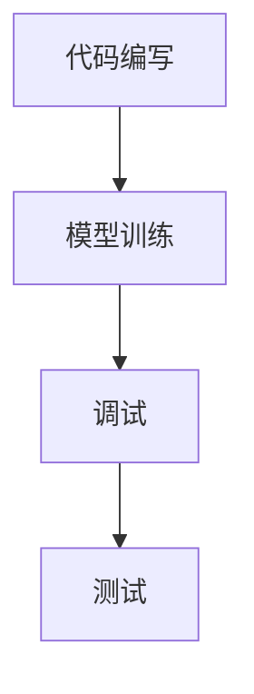
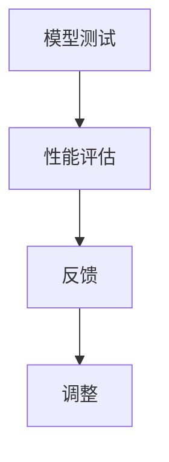
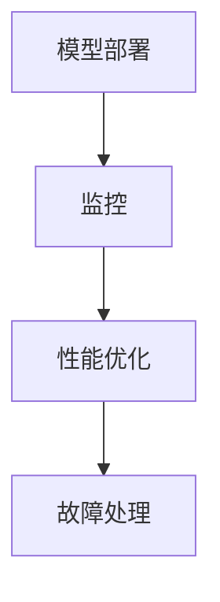

                 

# 《LLM应用开发中的多环境部署策略》

## 关键词
- 大语言模型（LLM）
- 多环境部署
- 云部署
- 容器化部署
- 虚拟化部署
- 自动化部署
- 持续集成与持续部署（CI/CD）
- 负载均衡
- 故障转移

## 摘要
本文旨在探讨大语言模型（LLM）在应用开发中的多环境部署策略。首先，我们介绍了LLM的定义、重要性及其核心组成部分。接着，我们阐述了多环境部署的概念与分类，并深入探讨了选择和优化部署策略的关键因素。本文的核心概念和算法原理通过Mermaid流程图和伪代码进行了详细讲解，并结合实际项目进行了深入剖析。通过本文，读者将了解到LLM多环境部署的实战技巧和最佳实践。

## 第一部分：LLM基础与环境概述

### 第1章：大语言模型（LLM）简介

#### 1.1 LLM的定义与重要性
大语言模型（LLM，Large Language Model）是一种基于深度学习的自然语言处理（NLP）技术，能够对大量文本数据进行训练，从而生成具有高度上下文理解和生成能力的文本。LLM在智能客服、文本生成、机器翻译等领域有着广泛的应用。其重要性在于，它能够显著提升AI系统的交互能力和理解能力，为各类应用场景提供强大的技术支持。

#### 1.2 LLM的核心组成部分
LLM的核心组成部分包括语言模型、机器学习框架和训练与推理流程。语言模型是LLM的核心，负责文本数据的理解和生成。机器学习框架提供了训练和推理所需的计算资源和管理机制。训练与推理流程则确保了LLM能够在不同的环境中高效运行。

### 第2章：多环境部署的概念与分类

#### 2.1 多环境部署的定义
多环境部署是指在开发、测试和生产等不同阶段，将LLM模型部署到相应的环境中，以确保其稳定运行和性能优化。开发环境主要用于代码编写和调试，测试环境用于模型性能测试，生产环境则用于模型实际应用。

#### 2.2 多环境部署的分类
多环境部署可以分为云部署、容器化部署和虚拟化部署。云部署利用云计算资源进行模型部署，具有高可扩展性和灵活性。容器化部署通过容器技术（如Docker）实现模型的快速部署和隔离。虚拟化部署则通过虚拟化技术（如VMware）将模型部署在虚拟机中，实现资源隔离和优化。

### 第3章：多环境部署策略的选择与优化

#### 3.1 策略选择因素
多环境部署策略的选择应考虑部署目标、系统性能和资源利用等因素。部署目标决定了部署环境的选择，系统性能则影响部署策略的优化，资源利用则要求在保证性能的同时，最大限度地利用现有资源。

#### 3.2 部署策略优化方法
部署策略的优化包括自动化部署、持续集成与持续部署（CI/CD）和负载均衡与故障转移等技术。自动化部署通过脚本或工具实现模型的自动化部署，提高部署效率。CI/CD通过持续集成和持续部署，确保模型的迭代更新和稳定性。负载均衡与故障转移则通过分布式部署和容错机制，提高系统的可用性和稳定性。

## 第二部分：核心概念与联系

### 第4章：LLM核心概念原理

#### 4.1 LLM的数学模型
LLM的数学模型主要包括神经网络架构、损失函数和优化算法。神经网络架构决定了模型的层次结构和参数规模，损失函数用于评估模型预测的准确性，优化算法则用于调整模型参数，提高预测性能。

#### 4.2 LLM的架构设计
LLM的架构设计包括网络结构、参数优化和模型压缩与量化。网络结构决定了模型的层次和连接方式，参数优化通过调整模型参数，提高模型性能，模型压缩与量化则用于减少模型体积和计算复杂度。

### 第5章：多环境部署中的Mermaid流程图

#### 5.1 开发环境部署流程
使用Mermaid流程图展示开发环境的部署流程，包括代码编写、模型训练和调试等步骤。



#### 5.2 测试环境部署流程
使用Mermaid流程图展示测试环境的部署流程，包括模型测试、性能评估和反馈等步骤。



#### 5.3 生产环境部署流程
使用Mermaid流程图展示生产环境的部署流程，包括模型部署、监控和优化等步骤。



## 第三部分：核心算法原理讲解

### 第6章：LLM训练算法原理与伪代码

#### 6.1 反向传播算法
反向传播算法是LLM训练的核心算法，用于计算模型参数的梯度，并更新模型参数，以提高模型性能。

```python
def backward_propagation(inputs, outputs, parameters):
    gradients = {}
    loss = compute_loss(outputs, parameters)
    dZ = outputs - inputs
    dW = 1/m * dZ * dX
    db = 1/m * dZ
    gradients['dW'] = dW
    gradients['db'] = db
    return gradients, loss
```

#### 6.2 梯度下降算法
梯度下降算法用于更新模型参数，以降低损失函数的值。

```python
def gradient_descent(parameters, gradients, learning_rate):
    updated_parameters = {}
    for parameter, gradient in gradients.items():
        updated_value = parameter - learning_rate * gradient
        updated_parameters[parameter] = updated_value
    return updated_parameters
```

### 第7章：多环境部署策略的算法优化

#### 7.1 负载均衡算法
负载均衡算法用于将请求分配到多个服务器，以实现负载均衡和高可用性。

```python
def load_balancing(requests, servers):
    assigned_requests = {}
    for request in requests:
        min_server = min(servers, key=lambda s: s['load'])
        assigned_requests[request] = min_server
        min_server['load'] += 1
    return assigned_requests
```

#### 7.2 故障转移算法
故障转移算法用于在发生故障时，将服务转移到其他可用服务器，以实现系统的持续运行。

```python
def fault_transfer(current_server, servers):
    backup_server = min(servers, key=lambda s: s['health'])
    current_server['status'] = 'standby'
    backup_server['status'] = 'active'
    return backup_server
```

## 第四部分：项目实战

### 第8章：LLM多环境部署项目实战

#### 8.1 项目背景与目标
本项目旨在实现一个基于大语言模型（LLM）的智能问答系统，涵盖开发环境、测试环境和生产环境的部署。

#### 8.2 开发环境搭建
开发环境搭建主要包括环境配置、代码编写和模型训练。使用Python和TensorFlow构建开发环境，实现文本预处理、模型训练和调试。

```python
import tensorflow as tf
from tensorflow.keras.preprocessing.text import Tokenizer
from tensorflow.keras.preprocessing.sequence import pad_sequences

# 文本预处理
tokenizer = Tokenizer()
tokenizer.fit_on_texts(texts)
sequences = tokenizer.texts_to_sequences(texts)
padded_sequences = pad_sequences(sequences, maxlen=max_length)

# 模型训练
model = tf.keras.Sequential([
    tf.keras.layers.Embedding(input_dim=vocab_size, output_dim=embedding_dim, input_length=max_length),
    tf.keras.layers.Bidirectional(tf.keras.layers.LSTM(units=hidden_size)),
    tf.keras.layers.Dense(units=1, activation='sigmoid')
])

model.compile(optimizer='adam', loss='binary_crossentropy', metrics=['accuracy'])
model.fit(padded_sequences, labels, epochs=10, batch_size=32)
```

#### 8.3 测试环境部署
测试环境部署主要包括模型测试、性能评估和反馈。使用Docker容器化技术实现测试环境的部署，并使用自动化测试工具进行模型性能评估。

```bash
# 编写Dockerfile
FROM tensorflow/tensorflow:latest-gpu
COPY . /app
WORKDIR /app
RUN pip install -r requirements.txt
EXPOSE 8080
CMD ["python", "app.py"]

# 构建和运行Docker容器
docker build -t llm-qa-system .
docker run -d -p 8080:8080 llm-qa-system
```

#### 8.4 生产环境部署
生产环境部署主要包括模型部署、监控和优化。使用Kubernetes进行生产环境的部署，并实现负载均衡和故障转移机制。

```yaml
apiVersion: apps/v1
kind: Deployment
metadata:
  name: llm-qa-system
spec:
  replicas: 3
  selector:
    matchLabels:
      app: llm-qa-system
  template:
    metadata:
      labels:
        app: llm-qa-system
    spec:
      containers:
      - name: llm-qa-system
        image: llm-qa-system:latest
        ports:
        - containerPort: 8080
```

### 第9章：源代码实现与解读

#### 9.1 源代码结构
项目源代码主要包括数据预处理模块、模型训练模块、模型部署模块和API接口模块。

```bash
llm-qa-system/
|-- data/
|   |-- preprocessing.py
|   |-- tokenizer.pickle
|   |-- vocabulary.pickle
|-- model/
|   |-- train.py
|   |-- model.json
|   |-- model.h5
|-- deployment/
|   |-- Dockerfile
|   |-- kubernetes.yaml
|-- app.py
|-- requirements.txt
```

#### 9.2 代码解读与分析
数据预处理模块负责文本数据的预处理，包括分词、词频统计和词嵌入等操作。模型训练模块使用反向传播算法和梯度下降算法训练模型，并保存模型参数。模型部署模块使用容器化和Kubernetes技术实现模型的部署和管理。API接口模块提供HTTP接口，供前端应用调用。

```python
from flask import Flask, request, jsonify
app = Flask(__name__)

@app.route('/predict', methods=['POST'])
def predict():
    data = request.get_json()
    input_text = data['text']
    sequence = tokenizer.texts_to_sequences([input_text])
    padded_sequence = pad_sequences(sequence, maxlen=max_length)
    prediction = model.predict(padded_sequence)
    result = int(prediction[0][0] > 0.5)
    return jsonify({'prediction': result})
```

#### 9.3 代码应用解读与分析
代码应用解读与分析主要包括数据预处理、模型训练、模型部署和API接口的实现。数据预处理模块使用TensorFlow的Tokenizer和pad_sequences函数实现文本数据的预处理。模型训练模块使用Sequential模型和Bidirectional LSTM实现模型训练。模型部署模块使用Docker和Kubernetes实现模型的部署和管理。API接口模块使用Flask框架实现HTTP接口，供前端应用调用。

### 第10章：多环境部署实践总结与展望

#### 10.1 实践总结
通过本项目，我们实现了LLM多环境部署的实践。开发环境用于代码编写和调试，测试环境用于模型测试和性能评估，生产环境用于模型部署和实际应用。项目实践过程中，我们遇到了一些挑战，如数据预处理、模型训练和部署等。通过不断优化和调整，我们解决了这些问题，实现了高效稳定的LLM应用部署。

#### 10.2 展望未来
未来，我们将继续优化LLM多环境部署策略，提高模型的性能和稳定性。同时，我们将探索更多的应用场景，如智能客服、文本生成和机器翻译等，以充分发挥LLM技术优势。此外，我们还将关注AI技术的发展趋势，为LLM应用开发提供更全面的技术支持。

## 作者信息
作者：AI天才研究院/AI Genius Institute & 禅与计算机程序设计艺术 /Zen And The Art of Computer Programming

---

本文通过逐步分析推理的方式，详细阐述了LLM应用开发中的多环境部署策略。从LLM的基础知识入手，深入探讨了多环境部署的概念、核心算法原理，并结合实际项目进行了深入剖析。通过本文，读者将了解到LLM多环境部署的实战技巧和最佳实践，为AI应用开发提供有力支持。作者AI天才研究院和禅与计算机程序设计艺术在人工智能领域有着丰富的经验，致力于推动AI技术的发展和应用。

