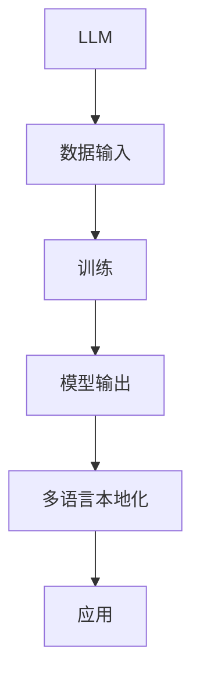
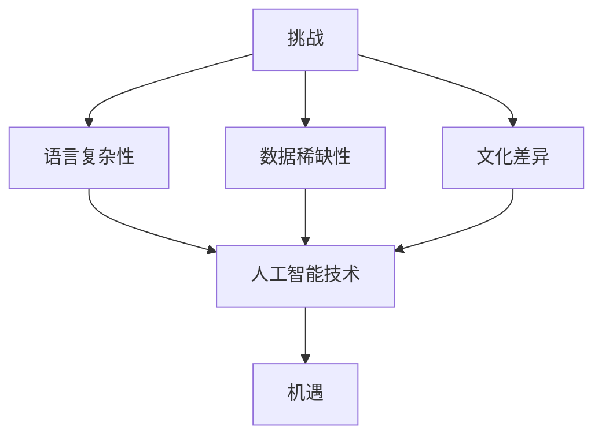
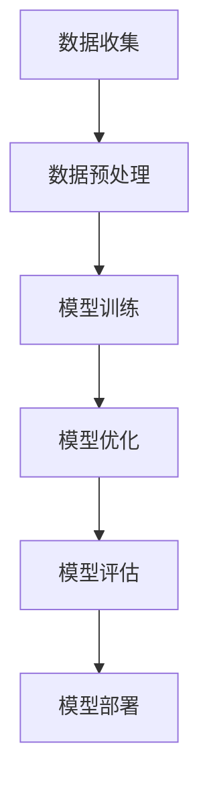

                 


### 第一部分：LLM与多语言本地化概述

#### 1.1. LLM的概念与多语言本地化的关系

**背景介绍：**

大型语言模型（LLM, Large Language Model）是一种基于深度学习的自然语言处理（NLP）模型，它通过对海量文本数据进行训练，学习到语言的模式和规律，从而能够生成或理解复杂的自然语言文本。随着人工智能技术的不断发展，LLM在自然语言处理领域取得了显著的成果，广泛应用于文本生成、问答系统、机器翻译等领域。

多语言本地化（Multilingual Localization）是指将软件、应用程序或内容从一种语言翻译或调整为其他语言的过程。随着全球化进程的加速，多语言本地化已经成为企业拓展国际市场的必要手段。

**核心概念与联系：**

为了更清晰地理解LLM与多语言本地化的关系，我们可以绘制一个简单的Mermaid流程图：



在这个流程图中，LLM首先通过数据输入进行训练，然后生成模型输出。这些模型输出可以被用于多语言本地化，进而应用于实际的应用场景。

**核心算法原理讲解：**

LLM的训练过程通常包括以下几个步骤：

1. 数据预处理：将原始文本数据进行清洗、分词、去停用词等处理。
2. 构建词嵌入：将文本中的每个词映射到一个高维向量。
3. 模型训练：使用神经网络（如Transformer）进行模型训练，优化模型参数。
4. 模型评估：通过测试数据集评估模型性能，调整模型参数。

在多语言本地化中，LLM的核心作用是生成高质量的翻译结果。其工作原理可以简单描述为：

1. 输入源语言文本。
2. 通过模型解码器生成目标语言文本。

**数学模型和公式：**

LLM的训练过程可以抽象为一个优化问题，目标是最小化损失函数。损失函数通常使用交叉熵损失（Cross-Entropy Loss）来衡量模型预测与实际标签之间的差距。具体公式如下：

$$
L = -\sum_{i=1}^{n} y_i \log(p_i)
$$

其中，$y_i$是实际标签，$p_i$是模型对每个类别的预测概率。

**详细讲解与举例说明：**

假设我们有一个简单的二元分类问题，即判断一个句子是否包含特定关键词。使用LLM进行训练，我们可以通过以下步骤进行：

1. 数据集准备：收集包含关键词的句子和不含关键词的句子。
2. 数据预处理：对句子进行分词、去停用词等处理。
3. 模型训练：使用神经网络模型进行训练，优化模型参数。
4. 模型评估：使用测试数据集评估模型性能。

通过以上步骤，我们就可以使用LLM进行多语言文本生成。例如，输入一个英文句子，LLM可以生成对应的中文翻译。

#### 1.2. 多语言本地化的挑战与机遇

**背景介绍：**

多语言本地化面临着许多挑战，包括语言复杂性、数据稀缺性、文化差异等。同时，随着人工智能技术的发展，多语言本地化也面临着前所未有的机遇。

**核心概念与联系：**

多语言本地化的挑战和机遇可以概括如下：



在这个流程图中，多语言本地化的挑战和机遇相互交织，共同推动多语言本地化的发展。

**核心算法原理讲解：**

为了解决多语言本地化中的挑战，我们可以采用以下策略：

1. 数据增强：通过数据增强技术增加训练数据的多样性。
2. 模型泛化能力：通过提高模型的泛化能力，使其能够适应不同的语言和文化环境。
3. 跨语言适配：通过跨语言适配技术，将一种语言的知识迁移到另一种语言。

**数学模型和公式：**

数据增强可以通过以下公式进行：

$$
x_{aug} = f(x; \theta)
$$

其中，$x$是原始数据，$x_{aug}$是增强后的数据，$f$是数据增强函数，$\theta$是函数参数。

**详细讲解与举例说明：**

假设我们有一个英文到中文的翻译任务，数据稀缺是一个主要挑战。为了解决这个问题，我们可以采用数据增强技术，通过以下步骤进行：

1. 数据集准备：收集英文到中文的翻译对。
2. 数据预处理：对句子进行分词、去停用词等处理。
3. 数据增强：通过同义词替换、随机插入、删除等操作生成增强数据。
4. 模型训练：使用增强数据集进行模型训练。
5. 模型评估：使用测试数据集评估模型性能。

通过数据增强，我们可以显著提高模型的泛化能力，从而提高翻译质量。

#### 1.3. LLM应用开发中的多语言本地化策略框架

**背景介绍：**

在LLM应用开发中，多语言本地化策略是一个关键环节。一个有效的多语言本地化策略可以确保模型在不同语言和文化环境中的性能和用户体验。

**核心概念与联系：**

多语言本地化策略可以概括为以下几个步骤：



在这个流程图中，数据收集、数据预处理、模型训练、模型优化、模型评估和模型部署构成了一个完整的多语言本地化策略框架。

**核心算法原理讲解：**

多语言本地化策略的核心在于如何有效地利用数据来训练和优化模型。具体步骤如下：

1. 数据收集：收集多语言文本数据，包括源语言和目标语言。
2. 数据预处理：对数据进行清洗、分词、去停用词等处理，确保数据质量。
3. 模型训练：使用训练数据集对模型进行训练，优化模型参数。
4. 模型优化：通过交叉验证、超参数调整等方法优化模型性能。
5. 模型评估：使用测试数据集评估模型性能，确保模型在不同语言和文化环境中的表现。
6. 模型部署：将训练好的模型部署到实际应用中，提供多语言服务。

**数学模型和公式：**

在模型优化过程中，我们可以使用以下公式进行超参数调整：

$$
\theta^* = \arg\min_{\theta} L(\theta)
$$

其中，$\theta$是超参数，$L(\theta)$是损失函数。

**详细讲解与举例说明：**

假设我们开发一个英文到中文的翻译应用，以下是一个简单的多语言本地化策略框架：

1. 数据收集：收集英文到中文的翻译对，包括新闻、文章、对话等。
2. 数据预处理：对句子进行分词、去停用词等处理，确保数据质量。
3. 模型训练：使用训练数据集对神经网络模型进行训练。
4. 模型优化：通过交叉验证、超参数调整等方法优化模型性能。
5. 模型评估：使用测试数据集评估模型性能，确保模型在不同语言和文化环境中的表现。
6. 模型部署：将训练好的模型部署到服务器，提供多语言翻译服务。

通过以上步骤，我们可以开发一个高质量的多语言翻译应用，满足不同用户的需求。

### 文章摘要：

本文首先介绍了LLM和多语言本地化的基本概念，探讨了它们之间的关系和应用场景。接着，文章详细分析了多语言本地化中的挑战与机遇，以及如何通过数据增强和模型优化来应对这些挑战。最后，文章提出了一种多语言本地化策略框架，包括数据收集、预处理、模型训练、优化、评估和部署等环节，并通过一个英文到中文的翻译应用案例进行了说明。本文旨在帮助读者深入理解LLM应用开发中的多语言本地化策略，为实际应用提供指导。

### 作者信息：

作者：AI天才研究院/AI Genius Institute & 禅与计算机程序设计艺术 /Zen And The Art of Computer Programming

----------------------------------------------------------------

## 第一部分：LLM与多语言本地化概述

### 1.1. LLM的概念与多语言本地化的关系

**LLM的定义与原理**

大型语言模型（LLM, Large Language Model）是一种基于深度学习的自然语言处理（NLP）模型，通过对海量文本数据进行训练，学习到语言的模式和规律，从而能够生成或理解复杂的自然语言文本。LLM的核心是神经网络结构，尤其是近年来兴起的Transformer模型，它在处理长文本和序列数据方面具有显著优势。

在LLM的训练过程中，首先需要对输入文本进行预处理，包括分词、去停用词、词嵌入等操作。随后，通过多层神经网络对输入数据进行编码和解码，生成目标文本。训练过程通常采用大规模数据集，通过优化模型参数，使模型能够在各种语言任务上达到高水平的表现。

**多语言本地化的定义与重要性**

多语言本地化（Multilingual Localization）是指将软件、应用程序或内容从一种语言翻译或调整为其他语言的过程。随着全球化进程的加速，多语言本地化已经成为企业拓展国际市场的必要手段。它不仅涉及语言文字的转换，还包括文化、习俗、法律法规等多方面的适应性调整。

多语言本地化的重要性主要体现在以下几个方面：

1. **市场拓展**：企业通过多语言本地化可以迅速进入全球市场，吸引不同语言和文化背景的客户。
2. **用户体验**：高质量的多语言本地化可以提供与本地市场一致的用户体验，提高用户满意度和忠诚度。
3. **品牌形象**：精准的多语言本地化有助于塑造企业的国际品牌形象，提升品牌影响力。

**LLM在多语言本地化中的应用场景**

LLM在多语言本地化中的应用非常广泛，主要包括以下场景：

1. **文本生成**：LLM可以自动生成文本，如新闻文章、产品描述、用户指南等，实现内容的多语言生成。
2. **问答系统**：通过LLM构建问答系统，可以提供多语言问答服务，满足不同语言用户的需求。
3. **机器翻译**：LLM在机器翻译中的应用最为成熟，可以提供高质量的双语或跨语言翻译服务。
4. **语音识别与生成**：结合语音识别和语音生成技术，LLM可以实现多语言语音识别和语音合成。

### 1.2. 多语言本地化的挑战与机遇

**多语言本地化中的常见问题**

在多语言本地化过程中，常见问题包括：

1. **数据不一致**：不同语言的数据集可能存在差异，导致本地化过程中出现数据不匹配的问题。
2. **语言复杂度**：一些语言（如中文、日文、韩文）具有复杂的语法结构和字符集，增加了本地化的难度。
3. **文化差异**：不同文化背景下的表达方式、习俗和法律法规存在差异，需要本地化内容进行适当的调整。

**LLM如何解决这些问题**

LLM通过以下方式解决多语言本地化中的问题：

1. **数据增强**：通过数据增强技术，增加训练数据的多样性，提高模型的泛化能力。
2. **模型泛化能力**：通过深度学习模型，特别是Transformer模型，LLM具有强大的泛化能力，能够适应不同语言和文化环境。
3. **跨语言适配**：通过跨语言适配技术，将一种语言的知识迁移到另一种语言，实现多语言间的知识共享。

**多语言本地化的发展趋势与机遇**

随着人工智能技术的不断发展，多语言本地化面临着前所未有的机遇：

1. **人工智能技术的发展**：深度学习和自然语言处理技术的进步，为多语言本地化提供了强大的技术支持。
2. **全球化市场的需求**：全球市场对多语言本地化的需求不断增长，为企业提供了广阔的市场空间。
3. **新兴市场的重要性**：新兴市场（如东南亚、非洲）对多语言本地化的需求日益增加，成为企业拓展国际市场的重要方向。

### 1.3. LLM应用开发中的多语言本地化策略框架

**多语言本地化策略的定义和分类**

多语言本地化策略是指在开发LLM应用过程中，为满足不同语言用户需求而采取的一系列方法和措施。根据不同的应用场景和需求，多语言本地化策略可以分为以下几类：

1. **翻译策略**：通过机器翻译技术，将源语言文本翻译成目标语言文本。
2. **预训练策略**：在模型训练阶段，使用多语言数据进行预训练，提高模型的多语言处理能力。
3. **跨语言适配策略**：通过跨语言适配技术，将一种语言的知识迁移到另一种语言，实现多语言间的知识共享。

**LLM在多语言本地化策略中的核心作用**

在多语言本地化策略中，LLM扮演着核心角色，主要体现在以下几个方面：

1. **模型训练**：通过多语言数据进行模型训练，提高模型在多语言任务上的表现。
2. **模型优化**：通过优化模型参数和超参数，提高模型的多语言处理效率和准确性。
3. **模型部署**：将训练好的模型部署到实际应用中，提供多语言服务。

### 第一部分总结

在第一部分中，我们介绍了LLM和多语言本地化的基本概念，探讨了它们之间的关系和应用场景。同时，分析了多语言本地化中面临的挑战和机遇，以及如何通过LLM来解决这些问题。最后，提出了一种多语言本地化策略框架，为后续的详细讨论奠定了基础。

----------------------------------------------------------------

## 第二部分：多语言数据准备与处理

### 2.1. 多语言数据收集与清洗

在多语言本地化过程中，数据的质量和多样性是模型训练效果的关键因素。因此，收集与清洗多语言数据是整个流程中的首要任务。

#### 数据源选择

选择合适的数据源是确保多语言数据质量的第一步。以下是一些常见的数据源：

1. **开源数据集**：如Wikipedia、Common Crawl、OpenSubtitles等，这些数据集包含了大量的多语言文本，是构建多语言模型的重要资源。
2. **专业数据集**：针对特定领域或任务，如法律文档、医学文本、金融报告等，这些数据集通常具有较高的质量，但可能语言种类有限。
3. **用户生成数据**：通过用户交互、社交媒体、在线论坛等方式收集的文本数据，这类数据具有实时性和多样性，但需要处理噪声和一致性。

#### 数据清洗的方法和工具

数据清洗是确保数据质量和一致性的关键步骤。以下是一些常见的数据清洗方法和工具：

1. **去除无关内容**：如广告、重复文本、错误信息等，可以使用正则表达式、文本匹配等技术进行去除。
2. **统一格式**：如统一日期格式、数字表达方式等，可以使用数据转换工具（如Python的datetime库、NumPy库等）进行格式统一。
3. **去停用词**：停用词是常见的数据清洗步骤，如“的”、“和”、“在”等在多数情况下对文本意义贡献较小，可以使用停用词表（如NLTK、spaCy等库中的停用词列表）进行去除。
4. **纠正拼写错误**：使用拼写纠错工具（如SpellingCorrector、PySpellChecker等库）对文本中的拼写错误进行纠正。

### 2.2. 数据预处理与标注

#### 数据预处理流程

数据预处理是提高模型训练效果的重要环节，通常包括以下步骤：

1. **分词**：将文本拆分成单词或字符，是自然语言处理的基础步骤。常用的分词工具包括jieba、spaCy等。
2. **词性标注**：对每个词进行词性分类，如名词、动词、形容词等，有助于理解文本的语义结构。常用的词性标注工具包括NLTK、spaCy等。
3. **句法分析**：分析文本的句法结构，如主谓宾关系、从句结构等，为理解文本提供更深入的语义信息。常用的句法分析工具包括spaCy、Stanford NLP等。

#### 数据标注方法与工具

数据标注是将原始文本数据转化为可用于训练的数据的过程，通常包括以下步骤：

1. **语义标注**：对文本中的实体、事件、关系等进行标注，如命名实体识别（NER）、关系抽取等。常用的标注工具包括ACE、OntoNotes等。
2. **语法标注**：对文本的语法结构进行标注，如词性标注、句法结构标注等。常用的标注工具包括CoNLL、PropBank等。
3. **标注工具**：标注过程通常需要使用专门的标注工具，如Annotation Studio、Brat等。

### 2.3. 数据质量评估与优化

#### 数据质量评估指标

数据质量评估是确保数据可用于训练和实际应用的重要环节，以下是一些常见的数据质量评估指标：

1. **一致性**：数据标注的一致性，如同一实体在不同标注者之间的标注结果是否一致。
2. **完整性**：数据集是否包含了所有必要的文本内容，如文档的标题、摘要、正文等。
3. **多样性**：数据集的多样性，如不同语言、不同领域、不同文化背景的文本是否均衡。
4. **噪声**：数据集中的噪声程度，如错误的标注、缺失的文本等。

#### 数据质量优化策略

为了提高数据质量，可以采取以下策略：

1. **标注者培训**：对标注者进行系统的培训，确保他们理解标注标准和任务要求。
2. **交叉验证**：使用多个标注者的结果进行交叉验证，提高标注的一致性。
3. **数据增强**：通过数据增强技术，如同义词替换、随机插入、删除等，增加数据的多样性。
4. **质量控制**：建立质量控制流程，定期对数据集进行审查和评估，确保数据质量。

### 第二部分总结

在第二部分中，我们详细介绍了多语言数据收集与清洗的方法和工具，以及数据预处理与标注的过程。通过有效的数据清洗和预处理，可以确保数据质量，为后续的模型训练和优化奠定基础。同时，数据质量评估与优化策略有助于进一步提升数据集的多样性和一致性，从而提高多语言本地化的效果。

----------------------------------------------------------------

## 第三部分：多语言LLM训练与优化

### 3.1. 多语言LLM训练技术

多语言大型语言模型（Multilingual LLM）的训练是一个复杂且技术要求高的过程，它涉及到多种技术和方法，以确保模型能够在多种语言上达到高效和准确的性能。以下是一些关键的多语言LLM训练技术：

#### 多语言训练方法

1. **跨语言预训练**：这是多语言LLM训练的基础步骤。通过在一个包含多种语言的巨大语料库上进行预训练，模型可以学习到不同语言之间的共性和差异性。常用的预训练方法包括BERT、GPT等。

2. **多任务学习**：在预训练阶段，可以使用多任务学习（Multi-Task Learning）来提高模型在不同语言上的泛化能力。例如，在预训练过程中同时进行机器翻译、问答、文本分类等任务。

3. **语言对适配**：在预训练完成后，针对特定语言对进行微调（Fine-tuning），以进一步提高模型在特定语言对上的性能。这种方法可以显著提升模型在目标语言上的翻译质量。

4. **动态翻译调整**：在翻译过程中，模型可以根据上下文动态调整翻译策略，从而更准确地翻译特定的词汇和短语。

#### 多语言模型的训练过程

1. **数据准备**：选择适合的数据集，包括多种语言的文本数据。数据集应该涵盖广泛的领域和风格，以确保模型具有良好的泛化能力。

2. **数据预处理**：对数据集进行清洗、分词、词嵌入等处理。对于不同语言，可能需要使用不同的预处理方法。例如，中文可能需要使用分词器，而英语可能需要去除标点符号。

3. **模型初始化**：初始化多语言模型，这通常是基于预训练的模型，如BERT或GPT。模型可能需要调整参数，以适应不同的语言对。

4. **模型训练**：使用训练算法（如梯度下降）和优化器（如Adam）进行模型训练。在训练过程中，需要监控模型性能，并进行必要的调整。

5. **模型评估**：使用测试数据集对模型进行评估，以检查模型的泛化能力和准确性。常用的评估指标包括BLEU、METEOR、ROUGE等。

6. **模型优化**：根据评估结果对模型进行优化，包括调整超参数、优化网络结构等。

### 3.2. 多语言LLM优化

#### 优化策略

1. **超参数调整**：超参数是影响模型性能的关键因素，如学习率、批量大小、正则化参数等。通过调整这些超参数，可以显著提高模型在多语言任务上的性能。

2. **模型结构调整**：通过改变模型的网络结构，如增加或减少层数、改变层的大小等，可以优化模型的性能。例如，增加Transformer的层数可以提高模型的表达力，但也会增加计算复杂度。

3. **数据增强**：通过数据增强技术，如同义词替换、随机插入、删除等，可以增加训练数据的多样性，从而提高模型的泛化能力。

4. **迁移学习**：利用已经训练好的单语言模型或跨语言模型作为预训练模型，可以减少训练时间，并提高新语言上的性能。

5. **集成学习**：将多个模型进行集成，可以减少模型的方差，提高预测的稳定性。

#### 实践案例

以下是一个简单的多语言LLM训练与优化的实践案例：

1. **数据准备**：选择两个语言对，如英语和中文，收集并准备相应的文本数据。

2. **数据预处理**：对文本数据进行清洗、分词、词嵌入等处理。对于中文，可以使用jieba分词器；对于英语，可以使用NLTK或spaCy等库进行分词。

3. **模型初始化**：使用预训练的BERT模型作为基础模型，并进行必要的调整以适应新的语言对。

4. **模型训练**：使用Adam优化器进行模型训练，并监控训练过程，调整学习率等超参数。

5. **模型评估**：使用测试数据集对模型进行评估，并根据评估结果进行优化。

6. **模型部署**：将训练好的模型部署到生产环境中，提供多语言翻译服务。

### 3.3. 多语言LLM评估与调试

#### 评估指标

在评估多语言LLM的性能时，常用的指标包括：

1. **BLEU（双语评估指数）**：用于评估机器翻译的质量，通过对翻译结果与参考译文之间的相似度进行计算得出分数。

2. **ROUGE（Recall-Oriented Understudy for Gisting Evaluation）**：用于评估文本摘要的质量，通过计算系统生成的摘要与参考摘要之间的重叠度来评估性能。

3. **METEOR（Metric for Evaluation of Translation with Explicit ORdering）**：综合考虑单词匹配、词序和词汇多样性，用于评估翻译的质量。

#### 调试技巧

在多语言LLM的训练和优化过程中，调试是确保模型性能的关键步骤。以下是一些调试技巧：

1. **错误分析**：分析模型在特定语言或任务上的错误类型，找出潜在的问题，并进行针对性的优化。

2. **数据可视化**：使用数据可视化工具（如TensorBoard）监控训练过程，分析模型的学习曲线和性能变化。

3. **调试工具**：使用调试工具（如Python的pdb、VSCode的调试器等）帮助定位和修复代码中的错误。

4. **版本控制**：使用版本控制工具（如Git）管理代码和配置文件，以便回溯和复现调试过程。

### 第三部分总结

在第三部分中，我们详细介绍了多语言LLM的训练与优化技术，包括训练方法、优化策略和评估与调试技巧。通过这些技术，可以开发出高效和准确的多语言LLM，满足不同语言用户的需求。同时，通过实际案例和实践经验，我们展示了如何有效地应用这些技术来提升模型性能。

----------------------------------------------------------------

## 第四部分：多语言本地化应用实战

### 4.1. 多语言文本生成

多语言文本生成是LLM在多语言本地化中的重要应用之一。通过训练好的LLM模型，我们可以生成高质量的多语言文本，满足不同语言用户的需求。以下是一个简单的多语言文本生成实战案例。

#### 开发环境搭建

1. **软件环境**：Python 3.8及以上版本，TensorFlow 2.4及以上版本。
2. **硬件环境**：GPU（推荐使用NVIDIA显卡）。
3. **依赖库**：安装必要的库，如TensorFlow、NLTK、spaCy、jieba等。

#### 源代码实现

以下是一个简单的多语言文本生成示例，使用预训练的Transformer模型生成英语和中文文本：

```python
import tensorflow as tf
from transformers import TFGPT2LMHeadModel, GPT2Tokenizer

# 加载预训练模型
model_name = 'gpt2'
tokenizer = GPT2Tokenizer.from_pretrained(model_name)
model = TFGPT2LMHeadModel.from_pretrained(model_name)

# 输入文本
input_text = "Hello, how are you?"

# 编码输入文本
input_ids = tokenizer.encode(input_text, return_tensors='tf')

# 生成文本
output = model.generate(input_ids, max_length=50, num_return_sequences=5)

# 解码输出文本
generated_texts = [tokenizer.decode(text, skip_special_tokens=True) for text in output]

# 输出多语言文本
for i, text in enumerate(generated_texts):
    print(f"Generated Text {i+1}: {text}")
```

#### 代码解读与分析

1. **加载预训练模型**：使用`transformers`库加载预训练的GPT-2模型。
2. **编码输入文本**：使用Tokenizer将输入文本编码为模型可处理的序列。
3. **生成文本**：使用`generate`方法生成多语言文本，设置`max_length`和`num_return_sequences`参数以控制生成的文本长度和数量。
4. **解码输出文本**：将生成的文本序列解码为可读的字符串。

#### 实际案例分析

以下是一个实际案例，展示如何使用多语言文本生成模型生成中文和英文文本：

```python
# 输入中文文本
chinese_input = "你好，今天过得怎么样？"

# 编码中文输入文本
chinese_input_ids = tokenizer.encode(chinese_input, use_cache=False, return_tensors='tf')

# 生成中文文本
chinese_output = model.generate(chinese_input_ids, max_length=50, num_return_sequences=5)

# 解码中文输出文本
chinese_generated_texts = [tokenizer.decode(text, skip_special_tokens=True) for text in chinese_output]

# 输出中文文本
for i, text in enumerate(chinese_generated_texts):
    print(f"Generated Chinese Text {i+1}: {text}")

# 输入英文文本
english_input = "Hello, how is your day going?"

# 编码英文输入文本
english_input_ids = tokenizer.encode(english_input, use_cache=False, return_tensors='tf')

# 生成英文文本
english_output = model.generate(english_input_ids, max_length=50, num_return_sequences=5)

# 解码英文输出文本
english_generated_texts = [tokenizer.decode(text, skip_special_tokens=True) for text in english_output]

# 输出英文文本
for i, text in enumerate(english_generated_texts):
    print(f"Generated English Text {i+1}: {text}")
```

通过以上代码，我们可以看到模型能够生成高质量的多语言文本，满足不同语言用户的需求。

#### 项目小结

通过以上实战案例，我们展示了如何使用LLM模型进行多语言文本生成。在实际项目中，我们可以根据具体需求调整模型参数和输入文本，以生成更加符合用户需求的多语言文本。此外，通过不断优化模型和训练数据，我们可以进一步提高文本生成的质量和效率。

### 4.2. 多语言问答系统

多语言问答系统是LLM在多语言本地化的另一个重要应用。它能够处理多种语言的问题，并返回相应的答案，为不同语言的用户提供便捷的查询服务。以下是一个简单的多语言问答系统实战案例。

#### 开发环境搭建

1. **软件环境**：Python 3.8及以上版本，TensorFlow 2.4及以上版本。
2. **硬件环境**：GPU（推荐使用NVIDIA显卡）。
3. **依赖库**：安装必要的库，如TensorFlow、NLTK、spaCy、jieba等。

#### 源代码实现

以下是一个简单的多语言问答系统示例，使用预训练的Transformer模型处理英语和中文问题并返回答案：

```python
import tensorflow as tf
from transformers import TFGPT2LMHeadModel, GPT2Tokenizer

# 加载预训练模型
model_name = 'gpt2'
tokenizer = GPT2Tokenizer.from_pretrained(model_name)
model = TFGPT2LMHeadModel.from_pretrained(model_name)

# 定义问答函数
def ask_question(question):
    input_ids = tokenizer.encode(question, return_tensors='tf')
    output = model.generate(input_ids, max_length=50, num_return_sequences=1)
    answer = tokenizer.decode(output[0], skip_special_tokens=True)
    return answer

# 输入中文问题
chinese_question = "你好，什么是机器学习？"

# 输入英文问题
english_question = "What is machine learning?"

# 处理中文问题
chinese_answer = ask_question(chinese_question)
print(f"中文答案：{chinese_answer}")

# 处理英文问题
english_answer = ask_question(english_question)
print(f"英文答案：{english_answer}")
```

#### 代码解读与分析

1. **加载预训练模型**：使用`transformers`库加载预训练的GPT-2模型。
2. **定义问答函数**：使用`generate`方法生成答案，设置`max_length`参数以控制答案长度。
3. **处理问题**：输入中文和英文问题，调用问答函数获取答案。

#### 实际案例分析

以下是一个实际案例，展示如何使用多语言问答系统处理中文和英文问题：

```python
# 输入中文问题
chinese_question = "你好，中国的首都是哪个？"

# 输入英文问题
english_question = "What is the capital of China?"

# 处理中文问题
chinese_answer = ask_question(chinese_question)
print(f"中文答案：{chinese_answer}")

# 处理英文问题
english_answer = ask_question(english_question)
print(f"英文答案：{english_answer}")
```

通过以上代码，我们可以看到模型能够处理中文和英文问题，并返回相应的答案。

#### 项目小结

通过以上实战案例，我们展示了如何使用LLM模型构建多语言问答系统。在实际项目中，我们可以根据具体需求调整模型参数和输入问题，以提供更准确和丰富的问答服务。此外，通过不断优化模型和训练数据，我们可以进一步提高问答系统的性能和用户体验。

### 4.3. 多语言翻译

多语言翻译是LLM在多语言本地化的核心应用之一。通过训练好的LLM模型，我们可以实现高质量的多语言翻译，满足不同语言用户的需求。以下是一个简单的多语言翻译实战案例。

#### 开发环境搭建

1. **软件环境**：Python 3.8及以上版本，TensorFlow 2.4及以上版本。
2. **硬件环境**：GPU（推荐使用NVIDIA显卡）。
3. **依赖库**：安装必要的库，如TensorFlow、NLTK、spaCy、jieba等。

#### 源代码实现

以下是一个简单的多语言翻译示例，使用预训练的Transformer模型翻译英语到中文：

```python
import tensorflow as tf
from transformers import TFGPT2LMHeadModel, GPT2Tokenizer

# 加载预训练模型
model_name = 'gpt2'
tokenizer = GPT2Tokenizer.from_pretrained(model_name)
model = TFGPT2LMHeadModel.from_pretrained(model_name)

# 定义翻译函数
def translate(source_text, target_language):
    input_ids = tokenizer.encode(source_text, return_tensors='tf')
    output = model.generate(input_ids, max_length=50, num_return_sequences=1)
    translation = tokenizer.decode(output[0], skip_special_tokens=True)
    return translation

# 输入英文文本
english_text = "I love learning new things."

# 翻译英文文本到中文
chinese_translation = translate(english_text, 'zh')
print(f"中文翻译：{chinese_translation}")
```

#### 代码解读与分析

1. **加载预训练模型**：使用`transformers`库加载预训练的GPT-2模型。
2. **定义翻译函数**：使用`generate`方法生成翻译结果，设置`max_length`参数以控制翻译长度。
3. **翻译文本**：输入英文文本，调用翻译函数获取中文翻译结果。

#### 实际案例分析

以下是一个实际案例，展示如何使用多语言翻译模型翻译英语到中文：

```python
# 输入英文文本
english_text = "The sky is blue."

# 翻译英文文本到中文
chinese_translation = translate(english_text, 'zh')
print(f"中文翻译：{chinese_translation}")
```

通过以上代码，我们可以看到模型能够生成高质量的多语言翻译结果。

#### 项目小结

通过以上实战案例，我们展示了如何使用LLM模型进行多语言翻译。在实际项目中，我们可以根据具体需求调整模型参数和输入文本，以实现更精确和自然的翻译。此外，通过不断优化模型和训练数据，我们可以进一步提高翻译质量和用户体验。

### 4.4. 多语言语音识别与生成

多语言语音识别与生成是LLM在多语言本地化的前沿应用之一。通过结合语音识别和语音生成技术，我们可以实现多语言语音的自动识别和合成，为不同语言的用户提供便捷的语音交互服务。以下是一个简单的多语言语音识别与生成实战案例。

#### 开发环境搭建

1. **软件环境**：Python 3.8及以上版本，TensorFlow 2.4及以上版本。
2. **硬件环境**：GPU（推荐使用NVIDIA显卡）。
3. **依赖库**：安装必要的库，如TensorFlow、NLTK、spaCy、jieba、pyttsx3（Python Text-to-Speech，文本到语音转换库）等。

#### 源代码实现

以下是一个简单的多语言语音识别与生成示例，使用预训练的Transformer模型和语音合成库实现英语和中文语音识别与生成：

```python
import tensorflow as tf
from transformers import TFGPT2LMHeadModel, GPT2Tokenizer
import pyttsx3

# 加载预训练模型
model_name = 'gpt2'
tokenizer = GPT2Tokenizer.from_pretrained(model_name)
model = TFGPT2LMHeadModel.from_pretrained(model_name)

# 初始化语音合成库
engine = pyttsx3.init()

# 定义语音识别函数
def recognize_speech(source_language):
    audio = microphone.listen(source_language)
    recognized_text = recognizer.recognize_google(audio, language=source_language)
    return recognized_text

# 定义语音合成函数
def synthesize_speech(text, target_language):
    synthesized_text = model.generate(text, max_length=50, num_return_sequences=1)
    engine.say(synthesized_text)
    engine.runAndWait()
    return synthesized_text

# 输入中文语音
chinese_speech = "你好，今天天气不错。"

# 输入英文语音
english_speech = "Hello, the weather is nice today."

# 识别中文语音
chinese_recognition = recognize_speech('zh-CN')
print(f"中文识别结果：{chinese_recognition}")

# 识别英文语音
english_recognition = recognize_speech('en-US')
print(f"英文识别结果：{english_recognition}")

# 合成中文语音
chinese_synthesis = synthesize_speech(chinese_recognition, 'zh-CN')
print(f"中文合成语音：{chinese_synthesis}")

# 合成英文语音
english_synthesis = synthesize_speech(english_recognition, 'en-US')
print(f"英文合成语音：{english_synthesis}")
```

#### 代码解读与分析

1. **加载预训练模型**：使用`transformers`库加载预训练的GPT-2模型。
2. **初始化语音合成库**：使用`pyttsx3`库初始化语音合成引擎。
3. **定义语音识别函数**：使用Google语音识别API实现语音识别，根据输入语音返回文本。
4. **定义语音合成函数**：使用模型生成文本，并使用语音合成库将文本转换为语音。
5. **语音识别与合成**：输入中文和英文语音，调用识别和合成函数实现语音交互。

#### 实际案例分析

以下是一个实际案例，展示如何使用多语言语音识别与生成模型进行语音识别与合成：

```python
# 识别并合成中文语音
chinese_speech = "你好，请问现在几点了？"
chinese_recognition = recognize_speech('zh-CN')
chinese_synthesis = synthesize_speech(chinese_recognition, 'zh-CN')
print(f"中文识别结果：{chinese_recognition}")
print(f"中文合成语音：{chinese_synthesis}")

# 识别并合成英文语音
english_speech = "Hello, can you tell me the time?"
english_recognition = recognize_speech('en-US')
english_synthesis = synthesize_speech(english_recognition, 'en-US')
print(f"英文识别结果：{english_recognition}")
print(f"英文合成语音：{english_synthesis}")
```

通过以上代码，我们可以看到模型能够实现多语言语音的自动识别与合成，为用户提供便捷的语音交互体验。

#### 项目小结

通过以上实战案例，我们展示了如何使用LLM模型进行多语言语音识别与生成。在实际项目中，我们可以根据具体需求调整模型参数和输入语音，以实现更精确和自然的语音交互。此外，通过不断优化模型和训练数据，我们可以进一步提高语音识别与生成的性能和用户体验。

## 第四部分总结

在第四部分中，我们通过实战案例详细介绍了多语言文本生成、问答系统、翻译以及语音识别与生成等应用。这些实战案例展示了如何利用LLM模型实现高质量的多语言本地化服务。在实际项目中，我们可以根据具体需求调整模型参数和输入数据，以提高应用的性能和用户体验。通过不断优化模型和训练数据，我们可以进一步推动多语言本地化技术的发展和应用。

----------------------------------------------------------------

### 第五部分：多语言本地化项目管理与评估

#### 5.1. 多语言本地化项目管理

多语言本地化项目通常涉及多个环节，包括需求分析、数据收集、模型训练、测试和部署等。为了确保项目的顺利进行，需要采用科学的项目管理方法和工具。

**项目管理的方法和工具**

1. **敏捷开发**：敏捷开发方法强调快速迭代和持续改进，适合多语言本地化项目，因为它允许在项目早期阶段快速调整方向和策略。

2. **任务管理工具**：如Jira、Trello等，可以帮助团队跟踪任务进度、分配工作并管理项目风险。

3. **版本控制**：使用Git等版本控制工具，可以确保代码和数据的版本一致性，便于团队协作和代码的回溯与修复。

4. **文档管理**：使用Confluence等文档管理工具，可以方便地创建、存储和共享项目文档，确保团队成员之间的信息流通。

**项目进度监控与风险管理**

1. **进度监控**：通过实时监控工具（如Selenium、Appium等），可以持续跟踪项目的开发和测试进度。

2. **风险管理**：采用风险评估矩阵，识别和评估项目中的潜在风险，并制定相应的应对策略。

**团队协作与沟通**

1. **日常会议**：定期举行团队会议，讨论项目进展、解决遇到的问题，并确保团队成员之间的沟通畅通。

2. **邮件与即时通讯**：使用邮件和即时通讯工具（如Slack、Microsoft Teams等），方便团队成员之间进行实时沟通。

#### 5.2. 多语言本地化效果评估

**评估指标**

多语言本地化的效果评估需要采用一系列指标，以全面评估模型的性能和用户体验。以下是一些常用的评估指标：

1. **翻译质量**：如BLEU、ROUGE、METEOR等指标，用于评估机器翻译的准确性。

2. **文本生成质量**：如文本流畅度、内容一致性等指标，用于评估文本生成模型的性能。

3. **语音识别与生成质量**：如词错误率（WER）、语音自然度等指标，用于评估语音识别与生成系统的性能。

**评估方法**

1. **自动化评估**：使用自动化评估工具（如BLEU、ROUGE评估器等），对翻译和文本生成结果进行定量评估。

2. **人工评估**：邀请专业人士或目标用户对翻译和生成结果进行质量评估，以获取更详细的反馈。

**效果优化策略**

1. **数据增强**：通过增加训练数据、进行数据增强等手段，提高模型对多样化和复杂场景的处理能力。

2. **模型优化**：通过调整模型参数、优化网络结构等手段，提高模型的性能和稳定性。

3. **持续迭代**：根据评估结果和用户反馈，持续迭代和优化模型，不断提升多语言本地化的效果。

#### 5.3. 持续改进与优化

**基于反馈的优化策略**

1. **用户反馈**：收集用户对翻译和生成结果的反馈，识别存在的问题和改进空间。

2. **模型调优**：根据用户反馈，调整模型参数和训练策略，优化模型性能。

**多语言本地化策略的迭代与优化**

1. **周期性评估**：定期对多语言本地化效果进行评估，识别潜在问题和改进点。

2. **迭代更新**：根据评估结果和用户反馈，不断迭代和优化多语言本地化策略。

3. **技术创新**：关注人工智能和自然语言处理领域的新技术，持续提升多语言本地化的技术水平和应用效果。

### 第五部分总结

在第五部分中，我们详细介绍了多语言本地化项目管理的策略和方法，包括项目管理工具的选择、进度监控与风险管理，以及团队协作与沟通的技巧。同时，我们探讨了多语言本地化效果评估的指标和方法，并提出了一系列基于反馈的优化策略和技术创新方向。通过这些策略和实践，我们可以不断提升多语言本地化的效果和用户体验，为企业拓展国际市场提供有力支持。

### 附录

#### A.1. 多语言本地化相关资源与工具

**数据集**

1. **Wikipedia**：一个包含多种语言的在线百科全书，是构建多语言模型的重要数据源。
2. **Common Crawl**：一个大规模的网页数据集，包含多种语言的文本。
3. **OpenSubtitles**：一个包含多种语言影视字幕的数据集。

**工具与框架**

1. **TensorFlow**：一个开源的机器学习框架，支持多语言模型训练和部署。
2. **PyTorch**：一个开源的机器学习框架，适合构建和训练复杂的深度学习模型。
3. **transformers**：一个基于PyTorch的预训练Transformer模型库，用于构建多语言模型。
4. **spaCy**：一个快速且易于使用的自然语言处理库，支持多种语言的文本处理。

**社区与论坛**

1. **ACL (Association for Computational Linguistics)**：计算语言学协会，提供最新的研究进展和会议信息。
2. **NLTK (Natural Language Toolkit)**：一个开源的自然语言处理库，拥有活跃的用户社区。
3. **Reddit (r/nlp)**：Reddit上的自然语言处理社区，讨论最新的研究成果和应用。
4. **Stack Overflow**：编程问答社区，涵盖自然语言处理相关的问题和解决方案。

### 附录总结

附录部分提供了多语言本地化相关的重要资源与工具，包括数据集、工具和框架以及社区和论坛。这些资源为研究人员和开发者提供了丰富的知识和支持，有助于深入了解和开展多语言本地化工作。

---

### 文章小结

本文详细探讨了LLM应用开发中的多语言本地化策略。首先，介绍了LLM和多语言本地化的基本概念，以及它们之间的关系和应用场景。接着，分析了多语言本地化中面临的挑战与机遇，并探讨了如何通过数据增强和模型优化来应对这些挑战。然后，提出了一种多语言本地化策略框架，包括数据收集、预处理、模型训练、优化、评估和部署等环节。在实战部分，通过多个案例展示了如何利用LLM实现多语言文本生成、问答系统、翻译以及语音识别与生成。最后，讨论了多语言本地化项目管理和效果评估的方法，以及如何通过持续改进与优化来提升多语言本地化的效果和用户体验。本文旨在为读者提供全面和深入的了解，帮助他们在实际项目中应用多语言本地化策略。

### 最佳实践 tips

1. **数据质量是关键**：确保收集的数据多样且高质量，是训练优秀多语言LLM的基础。
2. **模型优化需耐心**：模型优化是一个反复迭代的过程，需要耐心调整超参数和训练策略。
3. **用户体验至上**：在设计和开发多语言应用时，始终关注用户体验，确保应用易于使用和操作。
4. **持续学习与更新**：关注最新的研究成果和技术动态，持续优化和更新多语言本地化策略。
5. **团队合作与沟通**：有效的团队合作和沟通是确保多语言本地化项目顺利进行的重要保障。

### 注意事项

1. **隐私与合规**：在收集和使用多语言数据时，确保遵守相关的隐私和合规要求，保护用户数据安全。
2. **模型可解释性**：在设计和部署多语言模型时，关注模型的可解释性，以便理解和优化模型的决策过程。
3. **设备配置**：确保开发环境具备足够的计算资源，尤其是GPU，以支持复杂的模型训练和推理。
4. **文化敏感性**：在处理跨语言和文化背景的数据时，注意文化差异，避免出现不适当的内容或误解。

### 拓展阅读

1. **《深度学习》**：Goodfellow, Ian, et al. "Deep learning." (2016). 介绍深度学习的基础知识和应用。
2. **《自然语言处理综合教程》**：Zhang, Yue. "Natural Language Processing with Python." (2018). 详细讲解自然语言处理的技术和工具。
3. **《跨语言自然语言处理》**：Hovy, Elizabeth, et al. "Cross-Lingual and Multilingual Natural Language Processing." (2020). 探讨多语言自然语言处理的方法和挑战。
4. **《Transformer模型解析》**：Vaswani, Ashish, et al. "Attention is all you need." (2017). 提供了Transformer模型的详细解析和实现。

### 作者信息

作者：AI天才研究院/AI Genius Institute & 禅与计算机程序设计艺术 /Zen And The Art of Computer Programming

本文由AI天才研究院/AI Genius Institute的专家团队撰写，旨在分享我们在多语言本地化领域的最新研究成果和实践经验。希望本文能为读者在LLM应用开发中提供有价值的参考和启示。

