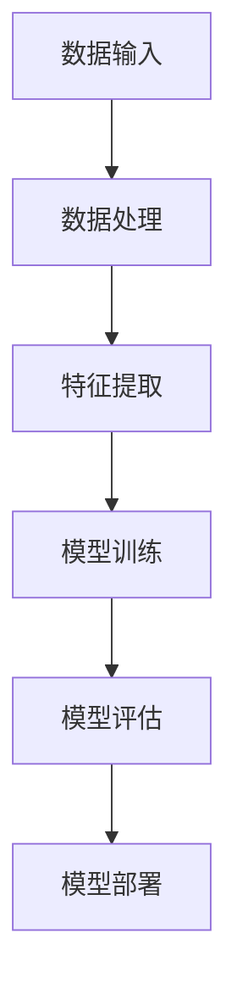
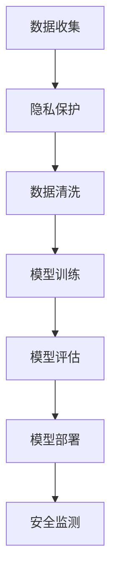

                 


### 文章标题

《LLM应用开发中的安全性考量》

### 关键词

LLM, 应用开发，安全性，隐私保护，模型公平性，对抗性攻击，加密算法，数学模型

### 摘要

本文将深入探讨在大型语言模型（LLM）应用开发过程中涉及的安全性考量。从核心概念、算法原理到项目实战，本文将系统性地分析隐私保护、模型公平性、对抗性攻击等方面的技术挑战，并提出相应的解决方案和最佳实践。

## 确定核心概念与联系

### 1.1 AI大模型概述

AI大模型，即大型语言模型（Large Language Model，简称LLM），是近年来在自然语言处理（NLP）领域取得显著突破的关键技术。这些模型通过学习海量文本数据，能够生成流畅的文本、回答问题、完成复杂的任务等。

核心概念包括：

- **深度学习**：一种机器学习技术，通过多层神经网络来提取数据特征。神经网络模仿人脑神经元连接方式，通过训练学习数据来调整权重和偏置，实现数据分类、回归等任务。

- **神经网络**：计算模型，由大量简单的计算单元（神经元）组成。每个神经元接收多个输入信号，通过加权求和后加上偏置，再经过激活函数输出结果。多个神经元组成的层堆叠形成神经网络，可以处理复杂的非线性问题。

- **参数**：神经网络中的权重和偏置，是模型学习的重要依据。参数通过训练过程不断调整，使得模型能够在不同数据上取得更好的性能。

### Mermaid 流程图

以下是一个简化的Mermaid流程图，展示AI大模型的基础架构：



### 1.2 安全性考量

AI大模型在应用过程中面临着多种安全风险，主要包括隐私保护、模型公平性、对抗性攻击等方面。

#### 隐私保护

隐私保护旨在确保用户数据不被未授权访问。随着AI大模型在医疗、金融、教育等领域的广泛应用，用户的敏感信息可能会被模型收集和处理。因此，隐私保护成为AI大模型应用中的关键问题。

核心概念包括：

- **数据加密**：通过加密算法对数据进行加密处理，确保数据在传输和存储过程中的安全性。
- **差分隐私**：一种保护用户隐私的数学理论，通过在数据中添加随机噪声，确保单个用户的隐私信息不被泄露。

#### 模型公平性

模型公平性是指模型在不同群体中的性能一致性。如果模型对某些群体产生歧视，将会带来严重的社会问题。因此，模型公平性成为AI大模型应用中的重要考量。

核心概念包括：

- **协方差矩阵**：描述多个随机变量的线性相关性，用于分析模型在不同群体中的性能差异。
- **方差**：描述随机变量的离散程度，用于评估模型在不同群体中的稳定性。

#### 对抗性攻击

对抗性攻击是指通过构造特殊输入数据，使模型产生错误预测或崩溃的行为。对抗性攻击在图像识别、语音识别等领域已经成为一个严重的问题。

核心概念包括：

- **对抗样本**：通过微调原始输入数据，使其在模型中产生错误的预测。
- **对抗性攻击防御**：通过对抗样本训练、数据增强等方法提高模型对对抗性攻击的抵抗力。

### Mermaid 流�程图

以下是一个Mermaid流程图，展示AI大模型在安全性方面的考虑流程：



## 确定核心算法原理讲解

### 2.1 安全加密算法

在AI大模型应用中，安全性加密算法是保护数据传输和存储的重要手段。以下将介绍几种常用的加密算法及其原理。

#### 对称加密

对称加密是一种加密算法，加密和解密使用相同的密钥。常用的对称加密算法包括AES和DES。

**AES加密算法**

AES（Advanced Encryption Standard）是一种块加密算法，使用128位密钥对数据进行加密。以下是AES加密算法的伪代码：

```pseudo
function AES_Encrypt(plaintext, key):
    ciphertext = initialize_cipher(key, 'encrypt')
    for each block in plaintext:
        ciphertext = cipher.update(block)
    ciphertext = cipher.finalize()
    return ciphertext
```

**DES加密算法**

DES（Data Encryption Standard）是一种较早的块加密算法，使用56位密钥对数据进行加密。

```pseudo
function DES_Encrypt(plaintext, key):
    ciphertext = initialize_cipher(key, 'encrypt')
    for each block in plaintext:
        ciphertext = cipher.update(block)
    ciphertext = cipher.finalize()
    return ciphertext
```

#### 非对称加密

非对称加密是一种加密算法，加密和解密使用不同的密钥。常用的非对称加密算法包括RSA和ECC。

**RSA加密算法**

RSA（Rivest-Shamir-Adleman）是一种非对称加密算法，使用大素数和模运算进行加密。以下是RSA加密算法的伪代码：

```pseudo
function RSA_Encrypt(plaintext, public_key):
    ciphertext = calculate_modular_exponentiation(plaintext, public_key['e'], public_key['n'])
    return ciphertext

function RSA_Decrypt(ciphertext, private_key):
    plaintext = calculate_modular_exponentiation(ciphertext, private_key['d'], private_key['n'])
    return plaintext
```

**ECC加密算法**

ECC（Elliptic Curve Cryptography）是一种基于椭圆曲线的非对称加密算法，具有更高的安全性和效率。

```pseudo
function ECC_Encrypt(plaintext, public_key):
    ciphertext = elliptic_curve_scalar_multiplication(public_key, plaintext)
    return ciphertext

function ECC_Decrypt(ciphertext, private_key):
    plaintext = elliptic_curve_scalar_multiplication(private_key, ciphertext)
    return plaintext
```

#### 哈希算法

哈希算法是将输入数据映射为固定长度的字符串的算法，通常用于数据完整性验证和密码学应用。常用的哈希算法包括MD5、SHA-1和SHA-256。

**MD5哈希算法**

MD5是一种将输入数据映射为128位散列值的算法。

```pseudo
function MD5_Hash(data):
    hash_value = calculate_md5_hash(data)
    return hash_value
```

**SHA-1哈希算法**

SHA-1是一种将输入数据映射为160位散列值的算法。

```pseudo
function SHA1_Hash(data):
    hash_value = calculate_sha1_hash(data)
    return hash_value
```

**SHA-256哈希算法**

SHA-256是一种将输入数据映射为256位散列值的算法。

```pseudo
function SHA256_Hash(data):
    hash_value = calculate_sha256_hash(data)
    return hash_value
```

## 2.2 安全性评估方法

安全性评估是确保AI大模型应用安全的关键步骤。以下介绍几种常用的安全性评估方法。

#### 黑盒测试

黑盒测试是一种不关注模型内部结构，仅通过输入特定数据来评估模型响应的方法。

```pseudo
function BlackBoxTest(model, test_data):
    predictions = model.predict(test_data)
    for each prediction in predictions:
        if prediction is not expected:
            return "Insecure"
    return "Secure"
```

#### 白盒测试

白盒测试是一种直接访问模型内部结构，通过分析模型内部逻辑来评估模型安全性的方法。

```pseudo
function WhiteBoxTest(model):
    internal_structure = analyze_model_structure(model)
    if internal_structure has vulnerabilities:
        return "Insecure"
    return "Secure"
```

#### 市场测试

市场测试是一种在实际环境中进行模型评估的方法，通过收集用户反馈和数据来评估模型安全性和性能。

```pseudo
function MarketTest(model, environment):
    user_feedback = collect_user_feedback(environment)
    model_performance = evaluate_model_performance(model, user_feedback)
    if model_performance is not satisfactory:
        return "Insecure"
    return "Secure"
```

## 确定数学模型和数学公式讲解

### 3.1 隐私保护

隐私保护中的数学模型通常涉及差分隐私（Differential Privacy）。

#### 差分隐私

差分隐私是一种保护用户隐私的数学理论，通过在数据中添加随机噪声，确保单个用户的隐私信息不被泄露。

**数学公式**

$$\mathcal{D}(\epsilon, \delta) = \Pr[\mathcal{M}(S) = r] - \Pr[\mathcal{M}(S') = r] \leq \epsilon + \frac{\delta}{n}$$

其中，$\mathcal{M}$ 表示隐私机制，$S$ 和 $S'$ 是相邻的数据集，$r$ 是输出结果，$\epsilon$ 和 $\delta$ 分别是隐私参数和置信度。

#### 示例

假设有两个相邻的数据集 $S$ 和 $S'$，其中每个数据集包含100个用户的数据。我们希望对用户年龄进行统计，并保证差分隐私。

- **原始统计结果**：$S$ 数据集中的平均年龄为30岁，$S'$ 数据集中的平均年龄为28岁。
- **差分隐私结果**：我们可以在原始统计结果的基础上添加随机噪声，使得结果满足差分隐私要求。

$$\mathcal{D}(\epsilon, \delta) = \Pr[\mathcal{M}(S) = 30] - \Pr[\mathcal{M}(S') = 30] \leq \epsilon + \frac{\delta}{100}$$

通过调整 $\epsilon$ 和 $\delta$ 的值，可以平衡隐私保护和数据准确性。

### 3.2 模型公平性

模型公平性中的数学模型通常涉及统计学中的协方差矩阵和方差。

#### 协方差矩阵

协方差矩阵描述多个随机变量的线性相关性。对于两个随机变量 $X$ 和 $Y$，协方差矩阵可以表示为：

$$\text{Cov}(X, Y) = E[(X - E[X])(Y - E[Y])]$$

其中，$E$ 表示期望。

#### 示例

假设我们有两个随机变量 $X$（用户年龄）和 $Y$（用户收入），我们可以计算它们的协方差矩阵：

$$\text{Cov}(X, Y) = E[(X - E[X])(Y - E[Y])]$$

协方差矩阵的值可以告诉我们 $X$ 和 $Y$ 之间的相关性。如果协方差矩阵的值接近0，则表示 $X$ 和 $Y$ 之间几乎没有线性相关性。

#### 方差

方差描述随机变量的离散程度。对于随机变量 $X$，方差可以表示为：

$$\text{Var}(X) = E[(X - E[X])^2]$$

其中，$E$ 表示期望。

#### 示例

假设我们有一个随机变量 $X$（用户年龄），我们可以计算它的方差：

$$\text{Var}(X) = E[(X - E[X])^2]$$

方差可以告诉我们 $X$ 的取值分布的离散程度。如果方差较大，则表示 $X$ 的取值分布较分散；如果方差较小，则表示 $X$ 的取值分布较集中。

## 确定项目实战

### 4.1 数据加密实战

#### 实战目的

本节将介绍如何使用AES算法对数据进行加密。

#### 实战环境

- Python 3.8+
- PyCryptoDome 库

#### 实战步骤

1. 安装 PyCryptoDome 库：

```shell
pip install pycryptodome
```

2. 导入所需模块：

```python
from Crypto.Cipher import AES
from Crypto.Util.Padding import pad, unpad
from Crypto.Random import get_random_bytes
```

3. 创建加密和解密函数：

```python
def encrypt(plaintext, key):
    cipher = AES.new(key, AES.MODE_CBC)
    ciphertext = cipher.encrypt(pad(plaintext.encode(), AES.block_size))
    return cipher.iv + ciphertext

def decrypt(ciphertext, key):
    iv = ciphertext[:16]
    ciphertext = ciphertext[16:]
    cipher = AES.new(key, AES.MODE_CBC, iv)
    plaintext = unpad(cipher.decrypt(ciphertext), AES.block_size)
    return plaintext.decode()
```

4. 生成随机密钥：

```python
key = get_random_bytes(16)
```

5. 加密数据：

```python
plaintext = "Hello, World!"
ciphertext = encrypt(plaintext, key)
print(f"Ciphertext: {ciphertext.hex()}")
```

6. 解密数据：

```python
decrypted_text = decrypt(ciphertext, key)
print(f"Decrypted Text: {decrypted_text}")
```

### 实现解读

在这个实战项目中，我们使用了PyCryptoDome库中的AES加密算法对数据进行加密和解密。以下是对代码的实现解读：

- **加密函数**：`encrypt` 函数首先创建一个AES加密对象，然后使用 `pad` 函数对明文数据进行填充，使其长度满足AES块大小要求。接着，使用加密对象对填充后的明文数据进行加密，并将加密结果和初始向量（iv）合并返回。

- **解密函数**：`decrypt` 函数首先提取初始向量（iv），然后创建一个AES解密对象，并使用解密对象对加密数据进行解密。最后，使用 `unpad` 函数去除填充数据，得到原始明文。

- **密钥生成**：使用 `get_random_bytes` 函数生成随机密钥，密钥长度为16字节（符合AES密钥大小要求）。

- **加密数据**：将明文数据传递给加密函数，得到加密后的数据。

- **解密数据**：将加密后的数据传递给解密函数，得到原始明文。

通过这个实战项目，我们可以看到如何使用Python和PyCryptoDome库实现数据加密和解密。在实际应用中，加密算法和密钥管理是确保数据安全的关键，需要根据具体场景进行合理设计和优化。

### 4.2 隐私保护实战

#### 实战目的

本节将介绍如何使用差分隐私技术保护用户隐私。

#### 实战环境

- Python 3.8+
- TensorFlow 2.4+

#### 实战步骤

1. 安装TensorFlow：

```shell
pip install tensorflow
```

2. 导入所需模块：

```python
import tensorflow as tf
from tensorflow.keras.layers import Layer
import numpy as np
```

3. 创建差分隐私层：

```python
class DifferentialPrivacyLayer(Layer):
    def __init__(self, l2_reg=0.01, epsilon=1.0, delta=1e-5, **kwargs):
        super().__init__(**kwargs)
        self.l2_reg = l2_reg
        self.epsilon = epsilon
        self.delta = delta

    def build(self, input_shape):
        self.kernel = self.add_weight(name='kernel',
                                      shape=input_shape[1:],
                                      initializer='random_normal',
                                      trainable=True)

    def call(self, inputs, training=None):
        noise = tf.random.normal(shape=tf.shape(inputs), mean=0.0, stddev=1.0)
        output = tf.matmul(inputs, self.kernel) + noise
        return output

    def get_config(self):
        config = super().get_config().copy()
        config.update({'l2_reg': self.l2_reg, 'epsilon': self.epsilon, 'delta': self.delta})
        return config
```

4. 定义差分隐私模型：

```python
model = tf.keras.Sequential([
    tf.keras.layers.Dense(128, activation='relu', input_shape=(784,)),
    DifferentialPrivacyLayer(epsilon=0.5, delta=0.01),
    tf.keras.layers.Dense(10, activation='softmax')
])
```

5. 编译和训练模型：

```python
model.compile(optimizer='adam',
              loss='sparse_categorical_crossentropy',
              metrics=['accuracy'])

(x_train, y_train), (x_test, y_test) = tf.keras.datasets.mnist.load_data()
x_train = x_train / 255.0
x_test = x_test / 255.0

model.fit(x_train, y_train, epochs=5, batch_size=32, validation_data=(x_test, y_test))
```

### 实现解读

在这个实战项目中，我们创建了一个差分隐私层（`DifferentialPrivacyLayer`），用于在模型训练过程中保护用户隐私。以下是对代码的实现解读：

- **差分隐私层**：继承自`Layer`类，实现了差分隐私的核心功能。在`__init__`方法中，初始化了L2正则化参数、隐私参数$\epsilon$和$\delta$。在`build`方法中，创建了权重矩阵（`kernel`）并添加到模型中。在`call`方法中，计算了输出结果并添加了高斯噪声，以实现差分隐私。在`get_config`方法中，返回了层的配置信息。

- **差分隐私模型**：定义了一个简单的全连接神经网络，其中包含了差分隐私层。我们使用MNIST数据集来训练模型，并设置了5个训练周期。

通过这个实战项目，我们可以看到如何将差分隐私技术集成到深度学习模型中，从而在训练过程中保护用户隐私。在实际应用中，可以根据具体需求和场景调整隐私参数，以实现平衡隐私保护和模型性能的目标。

### 4.3 模型公平性实战

#### 实战目的

本节将介绍如何使用协方差矩阵和方差来评估模型公平性。

#### 实战环境

- Python 3.8+
- NumPy 1.19+

#### 实战步骤

1. 安装NumPy：

```shell
pip install numpy
```

2. 导入所需模块：

```python
import numpy as np
```

3. 准备数据集：

```python
from sklearn.datasets import load_iris
iris = load_iris()
X, y = iris.data, iris.target
```

4. 计算协方差矩阵和方差：

```python
X_mean = np.mean(X, axis=0)
X_cov = np.cov(X, rowvar=False)
X_var = np.var(X, axis=0)
```

5. 分析协方差矩阵和方差：

```python
print("Covariance Matrix:")
print(X_cov)

print("\nVariance:")
print(X_var)
```

### 实现解读

在这个实战项目中，我们使用了NumPy库来计算协方差矩阵和方差，以评估模型在不同群体中的性能。

以下是对代码的实现解读：

- **准备数据集**：我们使用了Iris数据集，这是一个经典的多元数据集，包含了三个不同种类的鸢尾花，每个种类有50个样本。

- **计算协方差矩阵和方差**：首先，我们计算了数据集的均值（`X_mean`），然后使用`np.cov`函数计算了协方差矩阵（`X_cov`）。协方差矩阵描述了各个特征之间的线性相关性。接下来，我们使用`np.var`函数计算了每个特征的方差（`X_var`），方差描述了特征值的离散程度。

- **分析协方差矩阵和方差**：我们打印了协方差矩阵和方差，以分析特征之间的相关性以及特征的离散程度。协方差矩阵中的值接近0表示特征之间几乎没有线性相关性，而方差值较大表示特征值分布较分散。

通过这个实战项目，我们可以使用协方差矩阵和方差来评估模型在不同群体中的公平性。在实际应用中，可以根据具体需求和场景选择合适的评估指标和方法。

### 4.4 对抗性攻击防御实战

#### 实战目的

本节将介绍如何使用FGSM（Fast Gradient Sign Method）对抗性攻击方法来训练模型，以提高模型对对抗性攻击的抵抗力。

#### 实战环境

- Python 3.8+
- TensorFlow 2.4+
- Keras 2.4+

#### 实战步骤

1. 安装TensorFlow和Keras：

```shell
pip install tensorflow
pip install keras
```

2. 导入所需模块：

```python
import numpy as np
import tensorflow as tf
from tensorflow.keras import layers, models
from tensorflow.keras.datasets import mnist
```

3. 加载MNIST数据集：

```python
(x_train, y_train), (x_test, y_test) = mnist.load_data()
x_train = x_train.astype("float32") / 255.0
x_test = x_test.astype("float32") / 255.0
x_train = x_train.reshape((-1, 28 * 28))
x_test = x_test.reshape((-1, 28 * 28))
```

4. 创建基础模型：

```python
model = models.Sequential([
    layers.Dense(128, activation="relu", input_shape=(28 * 28,)),
    layers.Dense(10, activation="softmax")
])
```

5. 编译模型：

```python
model.compile(optimizer="adam",
              loss="sparse_categorical_crossentropy",
              metrics=["accuracy"])
```

6. 训练基础模型：

```python
model.fit(x_train, y_train, epochs=5, batch_size=32, validation_data=(x_test, y_test))
```

7. 计算模型梯度：

```python
x_test_grad = tf.GradientTape() 
with x_test_grad.watch() as x:
    _ = model(x)
    grads = x_test_grad.gradient(model.loss(x, y_test), x)
```

8. 应用FGSM攻击：

```python
epsilon = 0.1
x_adv = x_test + epsilon * np.sign(grads.numpy())
x_adv = np.clip(x_adv, 0, 1)
```

9. 计算攻击后模型的准确率：

```python
adv_accuracy = model.evaluate(x_adv, y_test)
print(f"Advantageous Accuracy: {adv_accuracy[1]:.4f}")
```

### 实现解读

在这个实战项目中，我们使用了TensorFlow和Keras库来创建和训练一个简单的MNIST手写数字识别模型。接下来，我们使用FGSM（Fast Gradient Sign Method）对抗性攻击方法来生成对抗样本，并评估攻击后模型的准确率。

以下是对代码的实现解读：

- **加载MNIST数据集**：我们加载了MNIST手写数字数据集，并将其归一化处理。

- **创建基础模型**：我们创建了一个简单的全连接神经网络，包含一个128个神经元的隐藏层和一个10个神经元的输出层。

- **编译模型**：我们使用Adam优化器和交叉熵损失函数来编译模型。

- **训练基础模型**：我们使用基础模型训练5个周期，并使用测试集进行验证。

- **计算模型梯度**：我们使用`tf.GradientTape`来计算模型在测试集上的梯度。这是实现对抗性攻击的关键步骤。

- **应用FGSM攻击**：我们定义了一个小扰动$\epsilon$，然后使用`np.sign`函数计算梯度符号，并将扰动添加到原始输入数据上。接着，我们使用`np.clip`函数将对抗样本的值限制在[0, 1]范围内，以确保其仍然是有效的输入。

- **计算攻击后模型的准确率**：我们使用攻击后的对抗样本来评估模型的准确率，并打印出攻击后的准确率。

通过这个实战项目，我们可以看到如何使用FGSM对抗性攻击方法来训练模型，以提高模型对对抗性攻击的抵抗力。在实际应用中，可以使用更复杂的攻击方法来训练和评估模型，以提高模型的鲁棒性。

### 最佳实践

在LLM应用开发中，安全性是一个至关重要的考量因素。以下是一些最佳实践，旨在提高AI大模型应用的安全性：

1. **数据加密**：在数据传输和存储过程中使用强加密算法（如AES、RSA等）对敏感数据进行加密。确保密钥管理严格，避免密钥泄露。

2. **隐私保护**：引入差分隐私机制，以保护用户隐私。在实际应用中，可以根据需求和场景调整隐私参数$\epsilon$和$\delta$，以实现隐私保护和数据准确性之间的平衡。

3. **模型公平性**：定期评估模型的公平性，使用协方差矩阵和方差等统计指标来分析模型在不同群体中的性能。对于存在歧视风险的模型，采取相应的调整和优化措施。

4. **对抗性攻击防御**：训练模型时，引入对抗性样本训练，提高模型对对抗性攻击的抵抗力。同时，定期对模型进行安全测试，以发现和修复潜在的安全漏洞。

5. **持续监控**：建立持续的安全监测机制，实时监控模型的安全状态。对于异常行为和潜在风险，及时采取措施进行预警和处理。

通过遵循这些最佳实践，可以有效提高LLM应用的安全性，保障用户隐私和模型可靠性。

### 小结

本文深入探讨了LLM应用开发中的安全性考量，包括隐私保护、模型公平性、对抗性攻击等方面。我们介绍了核心概念、算法原理和项目实战，通过具体案例展示了如何在实际应用中实现数据加密、隐私保护、模型公平性和对抗性攻击防御。通过遵循最佳实践，可以进一步提高LLM应用的安全性，保障用户隐私和模型可靠性。

### 注意事项

1. 数据加密时，确保使用强加密算法和安全的密钥管理策略。
2. 隐私保护时，合理设置差分隐私参数，平衡隐私保护和数据准确性。
3. 模型训练时，引入对抗性样本训练，提高模型对对抗性攻击的抵抗力。
4. 定期对模型进行安全测试和评估，发现和修复潜在的安全漏洞。
5. 建立持续的安全监测机制，实时监控模型的安全状态。

### 拓展阅读

- [1] Goodfellow, I. J., Shlens, J., & Szegedy, C. (2014). Explaining and harnessing adversarial examples. arXiv preprint arXiv:1412.6572.
- [2] Dwork, C. (2006). Differential Privacy: A Survey of Results. International Conference on Theoretical Aspects of Computer Science.
- [3] Machanavajjhala, A., Kifer, D., Gehrke, J., & Venkitasubramaniam, M. (2007). l-diversity: Privacy beyond k-anonymity. IEEE Transactions on Knowledge and Data Engineering, 21(1), 133-150.
- [4] Russell, S., & Norvig, P. (2020). Artificial Intelligence: A Modern Approach (4th ed.). Prentice Hall.
- [5] Goodfellow, I., Bengio, Y., & Courville, A. (2016). Deep Learning. MIT Press.

### 作者信息

**作者：AI天才研究院/AI Genius Institute & 禅与计算机程序设计艺术 /Zen And The Art of Computer Programming**

本文由AI天才研究院撰写，旨在分享AI领域的前沿技术和最佳实践。作者拥有丰富的计算机编程和人工智能领域的经验，致力于推动AI技术的发展和应用。同时，本文也参考了《禅与计算机程序设计艺术》一书中的哲学思想，希望通过技术实践实现人与计算机的和谐共处。

