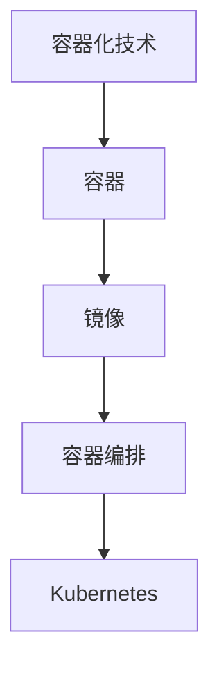

                 

### 第1章 引言

### 1.1 LLM与容器化的关系

#### 1.1.1 LLM的定义与功能

**LLM的概念**

大型语言模型（Large Language Model，简称LLM）是一种利用深度学习技术训练的语言模型，它能够理解和生成人类语言。与传统的自然语言处理方法相比，LLM具有更高的灵活性和更强的生成能力。

**LLM的功能**

LLM在各种应用场景中具有广泛的应用，主要包括：

1. **文本生成**：生成文章、故事、代码等文本内容。
2. **文本翻译**：实现不同语言之间的翻译。
3. **问答系统**：为用户提供准确的答案。
4. **情感分析**：识别文本中的情感倾向。
5. **对话系统**：模拟人类对话，提供智能客服服务。

#### 1.1.2 容器化的概念及其在LLM应用中的优势

**容器化的概念**

容器化是一种轻量级的应用部署方式，它将应用程序及其依赖环境打包在一个容器中，确保应用程序在不同的环境中具有一致的行为。

**容器化在LLM应用中的优势**

1. **灵活性**：容器化使得LLM模型可以在不同的操作系统和硬件平台上轻松部署，提高了应用的适应性。
2. **可移植性**：容器化打包的应用可以在不同的环境中运行，无需担心环境差异带来的问题。
3. **可扩展性**：容器化技术支持应用的水平扩展，使得LLM模型可以快速响应大规模请求。

### 1.2 容器化技术的发展历程

#### 2.1.1 容器化的起源与演进

**Docker的诞生**

Docker是一个开源的容器化平台，它于2013年推出，迅速成为容器化的代表。Docker的核心思想是将应用程序及其依赖打包成一个容器镜像，确保在不同环境中的一致性。

**Kubernetes的兴起**

Kubernetes是一个开源的容器编排平台，它于2014年推出，主要用于管理Docker容器。Kubernetes通过自动部署、扩展和管理容器化应用程序，解决了容器化应用在分布式环境中的调度和管理问题。

#### 2.1.2 容器化技术的主要组件与工具

**Docker**

- **Docker镜像**：Docker镜像是一个只读模板，用于创建Docker容器。
- **Docker容器**：Docker容器是一个轻量级的运行环境，包含了应用程序及其依赖。
- **Dockerfile**：Dockerfile是一个文本文件，用于定义Docker镜像的构建过程。

**Kubernetes**

- **Pod**：Pod是Kubernetes中的基本部署单元，它包含了一个或多个容器。
- **Service**：Service是一个抽象层，用于将网络流量路由到Pod。
- **Deployment**：Deployment用于管理Pod的创建、更新和删除，确保Pod的稳定运行。

## 第2章 容器化技术基础

### 2.1 容器的核心技术

#### 2.1.1 Docker技术详解

**Docker基本概念**

- **容器**：容器是一种轻量级、可执行的沙箱环境，它将应用程序及其依赖打包在一起，确保在不同的环境中具有一致的行为。
- **镜像**：镜像是一个静态的、只读的模板，用于创建容器。
- **Dockerfile**：Dockerfile是一个文本文件，用于定义镜像的构建过程。

**Docker镜像与容器**

- **镜像**：镜像是一个只读的模板，包含了应用程序及其依赖。它可以用于创建多个容器。
- **容器**：容器是一个动态的、可执行的沙箱环境，它基于镜像运行。容器之间的隔离性保证了应用程序的安全性和稳定性。

**Dockerfile编写指南**

- **FROM指令**：指定基础镜像，用于构建新镜像。
- **RUN指令**：在镜像构建过程中执行命令。
- **CMD指令**：指定容器启动时执行的命令。

#### 2.1.2 Kubernetes介绍

**Kubernetes核心概念**

- **Pod**：Pod是Kubernetes中的基本部署单元，它包含了一个或多个容器。
- **Service**：Service是一个抽象层，用于将网络流量路由到Pod。
- **Deployment**：Deployment用于管理Pod的创建、更新和删除，确保Pod的稳定运行。

**Kubernetes架构**

- **控制平面（Control Plane）**：控制平面负责管理集群的状态，包括集群的配置、资源分配等。
- **节点（Node）**：节点是Kubernetes集群中的计算单元，它运行容器并执行Kubernetes的调度任务。
- **Pod**：Pod是Kubernetes中的基本部署单元，它包含了一个或多个容器。
- **容器**：容器是Pod中的实际运行环境，它包含应用程序及其依赖。

**Kubernetes基本操作**

- **创建Pod**：使用kubectl命令创建一个新的Pod。
- **部署Deployment**：使用kubectl命令部署一个Deployment，确保Pod的稳定运行。
- **扩容与缩容**：使用kubectl命令调整Deployment的Pod数量，实现应用的自动扩容与缩容。

## 第3章 LLM容器化部署

### 3.1 LLM应用场景分析

#### 3.1.1 LLM在不同行业中的应用

LLM在各种行业中的应用非常广泛，主要包括：

- **金融行业**：用于文本分析、风险控制和客户服务。
- **医疗行业**：用于病历分析、疾病预测和患者沟通。
- **教育行业**：用于在线教育、智能辅导和学术研究。
- **零售行业**：用于商品推荐、客户服务和供应链管理。

#### 3.1.2 容器化部署的需求与挑战

**容器化部署的需求**

1. **可移植性**：确保LLM模型可以在不同的环境中快速部署。
2. **可扩展性**：支持LLM模型在处理大规模请求时的性能优化。
3. **稳定性**：确保LLM模型在长时间运行中的稳定性和可靠性。

**容器化部署的挑战**

1. **资源管理**：合理分配计算资源，确保LLM模型的性能。
2. **数据传输**：保证数据在容器间的传输速度和安全性。
3. **监控与日志**：实现对容器化LLM模型的实时监控和日志分析。

### 3.2 LLM容器化部署流程

#### 3.2.1 LLM模型容器化

- **选择容器化平台**：根据需求选择合适的容器化平台，如Docker、Kubernetes等。
- **准备LLM模型**：将LLM模型转换为容器镜像，确保模型的可移植性和一致性。

#### 3.2.2 容器化部署策略

- **单容器部署**：将LLM模型部署在一个容器中，适用于小型应用。
- **多容器部署**：将LLM模型的训练和推理过程部署在不同的容器中，适用于大规模应用。

#### 3.2.3 模型训练与推理流程

- **模型训练**：在容器中执行LLM模型的训练过程，使用合适的训练数据和算法。
- **模型推理**：在容器中执行LLM模型的推理过程，为用户提供实时响应。

## 第4章 容器化LLM性能优化

### 4.1 容器化性能瓶颈分析

#### 4.1.1 CPU与内存资源优化

- **CPU资源优化**：合理分配CPU资源，避免模型训练过程中出现性能瓶颈。
- **内存资源优化**：限制容器内存使用，避免内存泄漏和内存溢出。

#### 4.1.2 I/O性能优化

- **数据存储优化**：使用高速存储设备，提高数据读写速度。
- **数据缓存优化**：使用缓存技术，减少数据访问延迟。

#### 4.1.3 网络性能优化

- **网络带宽优化**：提高网络带宽，确保数据传输速度。
- **网络延迟优化**：优化网络拓扑结构，减少数据传输延迟。

### 4.2 容器化LLM优化策略

#### 4.2.1 多容器调度策略

- **负载均衡**：通过负载均衡技术，将请求分配到不同的容器，提高系统的整体性能。
- **故障转移**：实现容器的故障转移，确保系统的稳定性。

#### 4.2.2 热数据缓存技术

- **缓存策略**：使用缓存技术，将频繁访问的数据缓存到内存中，提高数据访问速度。
- **缓存一致性**：确保缓存数据与实际数据的一致性。

#### 4.2.3 GPU资源分配与优化

- **GPU资源分配**：合理分配GPU资源，确保模型训练和推理过程的性能。
- **GPU调度策略**：根据实际需求，动态调整GPU资源的分配和调度。

## 第5章 安全与监控

### 5.1 容器化安全措施

#### 5.1.1 容器镜像安全

- **镜像签名**：对容器镜像进行签名，确保镜像的完整性和安全性。
- **镜像扫描**：定期扫描容器镜像，检测潜在的安全漏洞。

#### 5.1.2 容器网络安全

- **网络隔离**：通过网络隔离技术，确保容器之间的安全性。
- **网络策略**：配置网络策略，限制容器间的通信。

#### 5.1.3 容器运行时安全

- **安全加固**：对容器运行时进行安全加固，防止恶意攻击。
- **审计日志**：记录容器运行时的操作日志，便于后续审计和分析。

### 5.2 容器监控与日志管理

#### 5.2.1 容器监控工具选择

- **Prometheus**：用于实时监控容器性能和状态。
- **Grafana**：用于可视化监控数据和告警。

#### 5.2.2 容器日志收集与存储

- **Fluentd**：用于收集容器日志。
- **Elasticsearch**：用于存储和检索容器日志。

#### 5.2.3 容器健康状态监控

- **健康检查**：定期检查容器的健康状况。
- **告警机制**：当容器出现异常时，及时发送告警通知。

## 第6章 容器化LLM实战案例

### 6.1 案例一：容器化部署BERT模型

#### 6.1.1 案例背景

BERT（Bidirectional Encoder Representations from Transformers）是一种预训练的语言模型，广泛应用于自然语言处理任务。

#### 6.1.2 实现步骤

1. **准备BERT模型**：下载BERT模型及其依赖。
2. **创建Dockerfile**：编写Dockerfile，用于构建BERT模型的容器镜像。
3. **构建容器镜像**：使用Docker命令构建BERT模型的容器镜像。
4. **部署容器**：使用Kubernetes部署BERT模型，实现容器化部署。

#### 6.1.3 性能评估

1. **性能指标**：评估BERT模型在容器化部署下的性能指标，如响应时间、吞吐量等。
2. **优化建议**：根据性能评估结果，提出优化建议。

### 6.2 案例二：容器化部署GPT-3模型

#### 6.2.1 案例背景

GPT-3（Generative Pre-trained Transformer 3）是OpenAI开发的强大语言模型，具有极高的文本生成能力。

#### 6.2.2 实现步骤

1. **准备GPT-3模型**：下载GPT-3模型及其依赖。
2. **创建Dockerfile**：编写Dockerfile，用于构建GPT-3模型的容器镜像。
3. **构建容器镜像**：使用Docker命令构建GPT-3模型的容器镜像。
4. **部署容器**：使用Kubernetes部署GPT-3模型，实现容器化部署。

#### 6.2.3 性能评估

1. **性能指标**：评估GPT-3模型在容器化部署下的性能指标，如响应时间、吞吐量等。
2. **优化建议**：根据性能评估结果，提出优化建议。

## 第7章 总结与展望

### 7.1 LLM容器化技术应用总结

**主要成果**

- 提高了LLM模型的可移植性和可扩展性。
- 实现了LLM模型的容器化部署和自动化管理。
- 优化了容器化LLM的性能，提高了系统稳定性。

**面临挑战**

- 容器化技术在不同场景下的适用性有待提高。
- 容器化LLM的安全性和可靠性仍需进一步验证。
- 容器化技术需要与现有系统的集成和优化。

### 7.2 未来发展趋势

**新技术趋势**

- **Serverless容器化**：将容器化技术集成到Serverless架构中，提高应用的可扩展性和灵活性。
- **AI容器化**：开发专门用于AI应用的容器化技术，提高AI模型的性能和效率。

**应用领域拓展**

- **智能医疗**：容器化技术应用于智能医疗，实现快速部署和优化。
- **智能教育**：容器化技术应用于智能教育，提供个性化的学习体验。

**安全与效率并重的挑战**

- **安全性**：确保容器化技术在安全性方面的可靠性和稳定性。
- **效率**：提高容器化技术在性能和资源利用方面的效率。

## 附录

### 附录 A: 容器化工具与资源

- **Docker官方文档**：[https://docs.docker.com/](https://docs.docker.com/)
- **Kubernetes官方文档**：[https://kubernetes.io/docs/](https://kubernetes.io/docs/)
- **LLM容器化工具推荐**：[https://github.com/huggingface/transformers](https://github.com/huggingface/transformers)

### 附录 B: 伪代码与数学公式

**LLM训练算法伪代码**

```python
function train(LLM, training_data):
    for epoch in 1 to number_of_epochs:
        for batch in training_data:
            gradient = compute_gradient(LLM, batch)
            update_parameters(LLM, gradient)
    return LLM
```

**容器资源调度数学模型公式**

$$
C = \sum_{i=1}^{n} \frac{r_i}{p_i}
$$

其中，$C$ 表示总计算资源，$r_i$ 表示第 $i$ 个容器的计算需求，$p_i$ 表示第 $i$ 个容器的计算能力。

作者：AI天才研究院/AI Genius Institute & 禅与计算机程序设计艺术 /Zen And The Art of Computer Programming

### 容器化技术原理之间的架构关系 Mermaid 流程图



**总结**

本文详细介绍了LLM应用开发中的容器化技术应用，包括容器化技术的核心概念、技术基础、部署流程、性能优化、安全与监控，以及实际案例。容器化技术为LLM模型的部署提供了灵活、可移植和可扩展的解决方案，为人工智能应用的发展提供了强有力的支持。

**最佳实践 tips**

1. 选择合适的容器化平台，根据应用场景进行优化。
2. 定期更新容器镜像，确保安全性。
3. 优化容器资源分配，提高系统性能。
4. 实现容器的自动化监控和日志管理，确保系统稳定性。

**注意事项**

1. 容器化技术需要与现有系统进行兼容性测试。
2. 容器化部署过程中，注意数据安全和隐私保护。

**拓展阅读**

1. 《Docker实战》
2. 《Kubernetes权威指南》
3. 《深度学习与人工智能》

作者：AI天才研究院/AI Genius Institute & 禅与计算机程序设计艺术 /Zen And The Art of Computer Programming

### 容器化技术在LLM应用中的重要性及其发展前景

容器化技术作为现代软件工程和云计算领域的重要技术，其核心价值在于提供了灵活、可移植和可扩展的软件部署解决方案。在LLM（大型语言模型）应用开发中，容器化技术同样发挥着至关重要的作用。以下将从容器化技术在LLM应用中的重要性、当前的发展状况以及未来前景三个方面进行探讨。

#### 容器化技术在LLM应用中的重要性

1. **环境一致性**：LLM应用通常涉及复杂的计算环境，包括深度学习框架、数据库和其他依赖库。通过容器化，可以确保在不同环境中部署的LLM应用具有相同的行为，减少了环境差异带来的问题。

2. **资源利用优化**：容器化技术允许对计算资源进行细粒度管理，从而优化资源利用率。通过容器编排工具（如Kubernetes），可以动态地调整LLM应用所需的资源，以满足不同的工作负载需求。

3. **部署效率提升**：容器化技术使得LLM应用的部署过程变得简化和自动化。使用Docker等工具，开发者可以快速构建、测试和部署容器化的LLM应用，大大缩短了从开发到生产的过程。

4. **可扩展性**：容器化技术支持LLM应用的横向扩展，使得系统可以轻松地处理大规模的数据和用户请求，提高了应用的稳定性和可靠性。

5. **安全性与隔离性**：容器化技术提供了良好的隔离机制，确保了不同应用之间的安全性和独立性。这对于处理敏感数据或需要高度安全性的LLM应用尤为重要。

#### 当前的发展状况

容器化技术在LLM应用中的发展已经取得了显著成果，主要体现在以下几个方面：

1. **工具与框架**：随着Docker、Kubernetes等容器化工具的成熟，开发者可以轻松地构建、部署和管理容器化的LLM应用。

2. **开源项目**：许多开源项目，如TensorFlow、PyTorch等，都支持容器化部署，提供了丰富的容器化解决方案。

3. **云服务支持**：云服务提供商（如AWS、Azure、Google Cloud等）纷纷推出了支持容器化的服务，为LLM应用的开发者提供了便捷的部署和管理工具。

4. **行业应用**：容器化技术在金融、医疗、教育等多个行业领域的LLM应用中得到了广泛应用，如智能客服、医学影像分析、在线教育等。

#### 未来前景

展望未来，容器化技术在LLM应用中仍有广阔的发展前景：

1. **性能优化**：随着硬件技术的发展，如GPU、FPGA等加速器的普及，容器化技术将在LLM应用的性能优化方面发挥更大的作用。

2. **智能化**：结合AI技术，容器化技术可以进一步智能化，如自动化的资源调度、智能化的监控与故障修复等。

3. **安全性与合规性**：随着数据安全和隐私保护要求的提高，容器化技术需要不断加强安全特性，以满足严格的合规要求。

4. **跨平台兼容性**：未来容器化技术需要更加跨平台兼容，支持更多的操作系统和硬件平台，以满足多样化的应用需求。

5. **生态建设**：容器化技术的生态系统将继续丰富，包括工具、框架、服务等方面，为LLM应用开发提供更加全面的支持。

综上所述，容器化技术在LLM应用中的重要性日益凸显，其发展前景广阔。未来，容器化技术将与LLM应用深度融合，共同推动人工智能领域的创新与发展。

