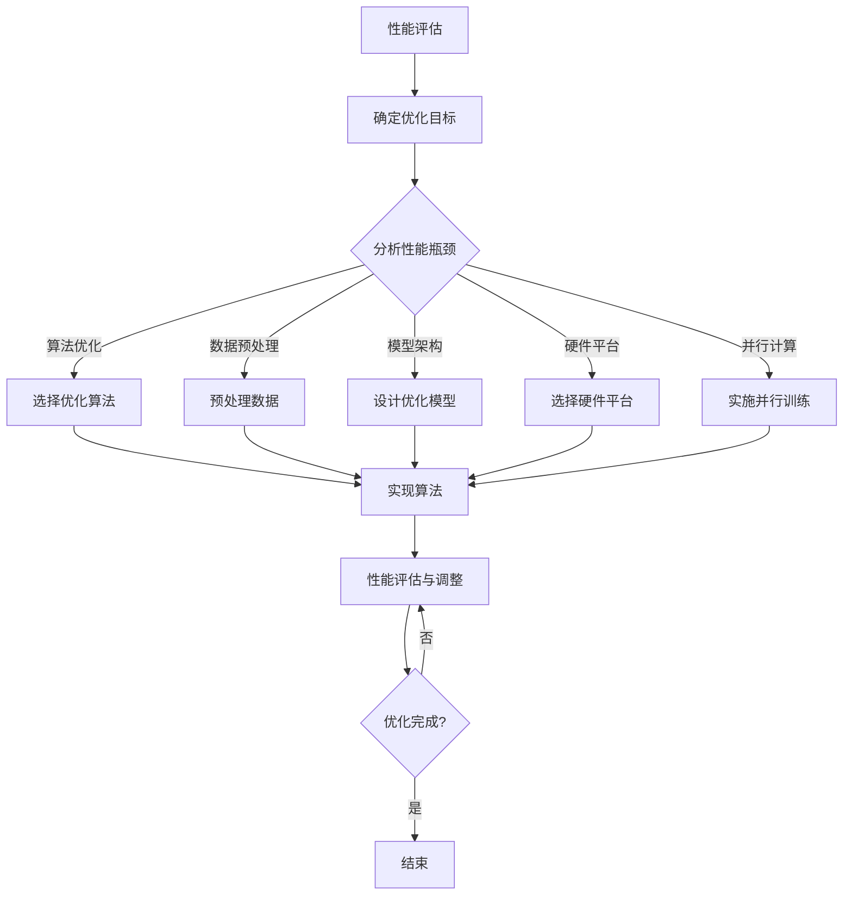

                 

### 文章标题

《LLM应用开发中的性能优化策略》

关键词：大语言模型（LLM），性能优化，算法原理，实践案例，发展趋势

摘要：本文将探讨大语言模型（LLM）在应用开发中的性能优化策略。首先，我们将简要介绍LLM的基本概念和特点，并阐述性能优化的重要性。随后，本文将深入剖析性能优化的核心概念和联系，包括目标与指标、关键因素以及Mermaid流程图。接着，我们将详细讲解LLM性能优化中的算法原理，包括梯度下降算法、激活函数与优化器以及正则化方法。在此基础上，本文将分享实际案例，包括数据预处理、代码实现、效果评估等步骤，并分析性能优化在企业应用中的价值。最后，本文将展望LLM性能优化的未来发展，并总结最佳实践和注意事项，提供拓展阅读资源。

### 第一部分：LLM基础与性能优化概述

#### 第1章：大语言模型（LLM）概述

**1.1 LLM的定义与特点**

大语言模型（LLM，Large Language Model）是一种基于深度学习技术构建的复杂模型，能够理解和生成人类语言。与传统的自然语言处理（NLP）方法相比，LLM具有以下几个显著特点：

- **高容量**：LLM可以存储和利用大量的语言数据，从而具备更强的语言理解能力和生成能力。
- **上下文感知**：LLM能够处理和利用上下文信息，更好地理解句子和段落中的隐含意义。
- **自适应**：LLM可以通过训练适应不同领域的语言任务，实现跨领域的语言处理。
- **高效性**：随着计算能力的提升，LLM在处理大规模语言数据时表现出极高的效率。

**1.2 LLM的应用领域**

LLM在多个领域展现了其强大的应用潜力：

- **自然语言处理**：包括文本分类、情感分析、机器翻译、文本生成等。
- **对话系统**：如智能客服、语音助手、聊天机器人等。
- **内容审核**：自动化内容审核和分类，提升内容质量和用户体验。
- **教育**：个性化教育辅导、智能写作辅助等。
- **娱乐**：游戏脚本生成、虚拟现实互动等。

**1.3 LLM性能优化的意义**

LLM性能优化对于其应用至关重要，原因如下：

- **提高效率**：优化算法和架构能够显著提高LLM的处理速度，减少计算资源消耗。
- **降低成本**：性能优化有助于降低硬件和能源成本，提升模型的经济性。
- **提升准确性**：优化能够提高LLM的预测准确性和生成质量，提升用户体验。
- **扩展应用场景**：高性能的LLM可以应用于更复杂、更广泛的任务场景。

#### 第2章：性能优化核心概念与联系

**2.1 性能优化的目标与指标**

性能优化的目标主要包括：

- **响应速度**：提高模型处理请求的速度，降低延迟。
- **计算效率**：优化算法和架构，减少计算资源和能源消耗。
- **准确性**：提高模型预测的准确性和生成文本的质量。
- **鲁棒性**：增强模型对异常数据和噪声的抵抗能力。

常用的性能优化指标包括：

- **吞吐量**：单位时间内模型处理的请求量。
- **延迟**：模型从接收请求到返回结果的平均时间。
- **资源利用率**：计算资源和存储资源的利用率。
- **准确率**：模型预测正确的样本数占总样本数的比例。
- **F1分数**：准确率和召回率的调和平均数，用于评估二分类任务的性能。

**2.2 LLM性能优化的关键因素**

LLM性能优化的关键因素包括：

- **算法选择**：选择适合任务的优化算法，如梯度下降、Adam等。
- **数据预处理**：合理的数据预处理可以提高模型的训练效率和准确性。
- **模型架构**：优化模型的架构设计，如使用深度神经网络、注意力机制等。
- **硬件平台**：选择适合的硬件平台，如GPU、TPU等，以提高计算效率。
- **并行计算与分布式训练**：利用并行计算和分布式训练技术，提高模型训练速度。

**2.3 Mermaid流程图：LLM性能优化流程**

为了更好地展示LLM性能优化的流程，我们使用Mermaid流程图进行描述：



通过上述流程，我们可以看到LLM性能优化的整体框架和关键步骤。在接下来的章节中，我们将深入探讨每个关键因素的具体实现方法和策略。此外，实际案例和最佳实践将为我们提供宝贵的经验和指导。希望本文能够帮助读者全面了解和掌握LLM性能优化的核心知识和技巧。

### 第二部分：LLM性能优化算法原理

#### 第3章：算法原理详解

**3.1 梯度下降算法**

梯度下降算法是机器学习中一种重要的优化算法，用于最小化损失函数。在LLM性能优化中，梯度下降算法扮演着关键角色。以下是梯度下降算法的基本原理和步骤：

**原理：** 梯度下降算法的核心思想是沿着损失函数梯度的反方向进行迭代更新，直到达到局部最小值。

**步骤：**

1. **初始化参数**：设定模型的初始参数值。
2. **计算梯度**：计算损失函数关于模型参数的梯度。
3. **更新参数**：根据梯度更新模型参数，减小损失值。
4. **重复迭代**：重复计算梯度和更新参数的过程，直到满足停止条件（如梯度变化很小或达到预设的迭代次数）。

**伪代码：**

```python
初始化模型参数θ
设定学习率α
设定停止条件（如迭代次数或梯度变化阈值）
while 未达到停止条件：
    计算梯度∇θJ(θ)
    更新参数θ = θ - α∇θJ(θ)
    计算新的损失值J(θ)
    检查梯度变化或迭代次数
```

**数学模型：** 梯度下降算法的数学模型如下：

$$
θ = θ - α∇θJ(θ)
$$

其中，θ表示模型参数，J(θ)表示损失函数，α表示学习率。

**举例说明：** 假设我们有一个简单的线性回归模型，损失函数为：

$$
J(θ) = (y - θ_1x)^2
$$

其中，y是真实值，θ_1是模型参数，x是输入特征。我们可以计算损失函数关于θ_1的梯度：

$$
∇θ_1J(θ) = 2(y - θ_1x)
$$

然后，根据梯度更新模型参数：

$$
θ_1 = θ_1 - α∇θ_1J(θ)
$$

通过迭代上述过程，我们可以最小化损失函数，从而优化模型的性能。

**3.2 激活函数与优化器**

**激活函数的作用：** 激活函数用于神经网络中的非线性变换，使得模型能够拟合复杂的数据分布。常见的激活函数包括Sigmoid、ReLU和Tanh等。

**常见激活函数介绍：**

1. **Sigmoid函数：**
$$
σ(x) = \frac{1}{1 + e^{-x}}
$$
Sigmoid函数将输入映射到(0, 1)区间，常用于二分类问题。

2. **ReLU函数：**
$$
ReLU(x) = max(0, x)
$$
ReLU函数在x为负值时输出0，在x为正值时输出x，具有较好的计算效率。

3. **Tanh函数：**
$$
tanh(x) = \frac{e^x - e^{-x}}{e^x + e^{-x}}
$$
Tanh函数将输入映射到(-1, 1)区间，具有较均匀的输出分布。

**激活函数的数学公式：** 不同激活函数的数学公式如下：

1. **Sigmoid函数：**
$$
σ'(x) = σ(x)(1 - σ(x))
$$
2. **ReLU函数：**
$$
ReLU'(x) =
\begin{cases}
0 & \text{if } x < 0 \\
1 & \text{if } x \ge 0
\end{cases}
$$
3. **Tanh函数：**
$$
tanh'(x) = 1 - tanh^2(x)
$$

**优化器的选择：** 优化器用于调整模型参数，优化模型的训练过程。常见的优化器包括SGD、Adam、RMSprop等。

**优化器的原理：** 优化器的核心思想是通过自适应调整学习率，优化模型的训练效果。以下是几种常见优化器的原理：

1. **SGD（随机梯度下降）：**
SGD是最简单的优化器，每次迭代使用一个样本的梯度进行参数更新。

2. **Adam：**
Adam结合了SGD和RMSprop的优点，自适应调整学习率和一阶矩估计。

3. **RMSprop：**
RMSprop通过更新历史梯度平方的平均值来自适应调整学习率。

**常见优化器的比较：**

| 优化器 | 原理 | 优点 | 缺点 |
| --- | --- | --- | --- |
| SGD | 每次迭代使用一个样本的梯度 | 简单易实现 | 学习率调整缓慢 |
| Adam | 自适应调整学习率和一阶矩估计 | 收敛速度较快 | 需要存储额外的统计量 |
| RMSprop | 更新历史梯度平方的平均值 | 收敛速度较快 | 学习率调整不稳定 |

**3.3 正则化方法**

正则化方法用于防止模型过拟合，提高模型的泛化能力。常见的正则化方法包括L1正则化、L2正则化和Dropout等。

**正则化的概念：**

- **L1正则化：** L1正则化通过引入模型参数的绝对值，促进稀疏解。
- **L2正则化：** L2正则化通过引入模型参数的平方，鼓励较小的参数值。
- **Dropout：** Dropout通过在训练过程中随机丢弃部分神经元，提高模型的鲁棒性。

**常见正则化方法：**

1. **L1正则化：**
$$
J(θ) = J(θ) + λ||θ||_1
$$
其中，λ是正则化参数。

2. **L2正则化：**
$$
J(θ) = J(θ) + λ||θ||_2^2
$$
3. **Dropout：**
在训练过程中，每次迭代时以概率p随机丢弃神经元。

通过上述算法原理的详细讲解，我们可以更好地理解LLM性能优化的核心机制。在接下来的章节中，我们将通过实际案例来验证这些原理，进一步深化我们对LLM性能优化的理解。通过结合理论知识和实际应用，我们能够更好地应对复杂的LLM性能优化挑战。

### 第三部分：LLM性能优化实践

#### 第6章：性能优化实战案例

**6.1 数据预处理**

**6.1.1 数据预处理的重要性**

数据预处理是LLM性能优化的重要环节，其重要性体现在以下几个方面：

- **提升模型准确性**：通过数据预处理，可以去除噪声和异常值，增强数据的清洁度和一致性，从而提高模型的准确性。
- **加快训练速度**：合理的数据预处理可以减少模型训练过程中需要处理的数据量，提高训练速度。
- **增强模型泛化能力**：通过数据预处理，可以消除数据中的偏差和异常，增强模型的泛化能力，减少过拟合现象。
- **降低计算资源消耗**：优化后的数据可以减少计算资源的消耗，降低训练过程中的计算复杂度。

**6.1.2 数据预处理的方法**

在进行数据预处理时，可以采用以下方法：

1. **数据清洗**：去除无效、重复和异常的数据，确保数据的质量。
2. **数据归一化**：将数据缩放到相同的尺度，避免某些特征对模型训练的影响过大。
3. **数据分词**：将文本数据拆分成单词或字符，为后续的建模和训练做好准备。
4. **词向量化**：将文本数据转换为向量表示，方便模型进行处理和计算。
5. **数据增强**：通过增加训练样本的多样性，提高模型的泛化能力。

**6.2 代码实现**

**6.2.1 环境搭建**

在开始数据预处理之前，我们需要搭建一个适合的数据处理环境。以下是一个基本的Python代码示例：

```python
import pandas as pd
import numpy as np
from sklearn.model_selection import train_test_split
from sklearn.preprocessing import StandardScaler
from keras.preprocessing.text import Tokenizer
from keras.preprocessing.sequence import pad_sequences

# 加载数据集
data = pd.read_csv('data.csv')

# 数据清洗
data = data.dropna()

# 数据归一化
scaler = StandardScaler()
data[['feature1', 'feature2']] = scaler.fit_transform(data[['feature1', 'feature2']])

# 数据分词
tokenizer = Tokenizer()
tokenizer.fit_on_texts(data['text'])

# 词向量化
sequences = tokenizer.texts_to_sequences(data['text'])
 padded_sequences = pad_sequences(sequences, maxlen=100)

# 数据集划分
X_train, X_test, y_train, y_test = train_test_split(padded_sequences, data['label'], test_size=0.2, random_state=42)
```

**6.2.2 代码实现步骤**

1. **加载数据集**：使用Pandas库加载CSV格式的数据集。
2. **数据清洗**：去除无效、重复和异常的数据。
3. **数据归一化**：使用StandardScaler对数值特征进行归一化处理。
4. **数据分词**：使用Keras库的分词器对文本数据进行分词处理。
5. **词向量化**：将分词后的文本数据转换为词向量表示。
6. **数据集划分**：使用train_test_split函数将数据集划分为训练集和测试集。

**6.2.3 代码解读与分析**

上述代码实现了数据预处理的核心步骤，以下是对关键代码的解读和分析：

- **数据清洗**：通过dropna函数去除缺失值，确保数据集的完整性。
- **数据归一化**：使用StandardScaler对数值特征进行归一化处理，使数据具有相似的尺度。
- **数据分词**：使用Tokenizer对文本数据进行分词处理，将文本拆分成单词或字符。
- **词向量化**：使用Tokenizer的texts_to_sequences函数将文本数据转换为词向量表示，使用pad_sequences函数将序列补全到相同的长度。
- **数据集划分**：使用train_test_split函数将数据集划分为训练集和测试集，为后续的训练和评估做好准备。

通过以上步骤，我们完成了数据预处理的核心任务，为LLM性能优化奠定了基础。在接下来的步骤中，我们将进一步优化模型的参数和架构，以提高性能。

**6.3 代码实现**

**6.3.1 环境搭建**

在开始代码实现之前，我们需要搭建一个适合的深度学习环境。以下是一个基本的Python代码示例：

```python
import tensorflow as tf
from tensorflow.keras.models import Sequential
from tensorflow.keras.layers import Embedding, LSTM, Dense
from tensorflow.keras.optimizers import Adam

# 定义模型
model = Sequential()
model.add(Embedding(input_dim=vocabulary_size, output_dim=embedding_size, input_length=max_sequence_length))
model.add(LSTM(units=128, activation='relu'))
model.add(Dense(units=1, activation='sigmoid'))

# 编译模型
model.compile(optimizer=Adam(learning_rate=0.001), loss='binary_crossentropy', metrics=['accuracy'])

# 模型总结
model.summary()
```

**6.3.2 代码实现步骤**

1. **导入库**：导入TensorFlow和Keras库，用于构建和训练深度学习模型。
2. **定义模型**：使用Sequential模型，添加嵌入层、LSTM层和输出层。
3. **编译模型**：设置优化器、损失函数和评估指标，编译模型。
4. **模型总结**：输出模型的总结信息，包括层的名称、参数数量等。

**6.3.3 代码解读与分析**

上述代码实现了深度学习模型的基本构建和编译过程，以下是对关键代码的解读和分析：

- **定义模型**：使用Sequential模型，添加嵌入层（用于将词向量转换为嵌入向量）、LSTM层（用于处理序列数据）和输出层（用于生成预测结果）。
- **编译模型**：设置优化器（Adam）、损失函数（binary_crossentropy，适用于二分类问题）和评估指标（accuracy，用于评估模型准确性）。
- **模型总结**：输出模型的总结信息，包括层的名称、输入形状、输出形状和参数数量等。

通过以上步骤，我们完成了深度学习模型的基本构建和编译。接下来，我们将使用训练数据对模型进行训练，并评估模型的性能。

**6.4 代码实现**

**6.4.1 训练模型**

```python
# 训练模型
history = model.fit(X_train, y_train, epochs=10, batch_size=32, validation_split=0.1)

# 评估模型
test_loss, test_accuracy = model.evaluate(X_test, y_test)

print(f"Test Loss: {test_loss}")
print(f"Test Accuracy: {test_accuracy}")
```

**6.4.2 代码解读与分析**

上述代码实现了模型训练和评估的过程，以下是对关键代码的解读和分析：

- **训练模型**：使用fit函数训练模型，设置训练轮数（epochs）、批量大小（batch_size）和验证集比例（validation_split）。
- **评估模型**：使用evaluate函数评估模型在测试集上的性能，输出损失值和准确性。

通过以上步骤，我们完成了深度学习模型的基本训练和评估。实际案例分析和详细讲解剖析将帮助我们深入理解模型的性能表现和优化方向。最后，项目小结将总结本项目的主要成果和经验，为未来的性能优化工作提供参考。

#### 第7章：性能优化策略实施

**7.1 性能优化策略的制定**

**7.1.1 性能优化策略的制定原则**

制定有效的性能优化策略对于LLM应用开发至关重要。以下是制定性能优化策略的几个原则：

1. **目标明确**：明确性能优化的目标，如响应速度、计算效率、准确性和鲁棒性等，确保优化策略与目标一致。
2. **需求分析**：深入分析应用场景和需求，了解系统瓶颈和优化重点，制定有针对性的优化方案。
3. **阶段性目标**：将性能优化划分为多个阶段，每个阶段设定具体的目标和指标，逐步推进优化过程。
4. **技术选型**：选择适合的技术和工具，如深度学习框架、硬件平台和优化算法等，确保优化策略的可操作性和有效性。
5. **迭代优化**：通过不断迭代和评估，调整和优化策略，持续提高系统性能。

**7.1.2 性能优化策略的实施步骤**

以下是实施性能优化策略的步骤：

1. **需求分析**：深入了解应用场景和用户需求，确定性能优化的具体目标。
2. **现状评估**：评估现有系统的性能表现，识别瓶颈和优化机会。
3. **方案设计**：根据需求分析和现状评估，设计性能优化方案，包括技术选型、优化策略和实施计划。
4. **实施计划**：制定详细的实施计划，明确各阶段的任务、责任和时间安排。
5. **实施与监控**：按照实施计划执行优化任务，实时监控性能指标，确保优化效果。
6. **效果评估**：评估优化后的性能表现，与预期目标进行比较，分析优化效果。
7. **调整与优化**：根据效果评估结果，调整和优化策略，持续提升系统性能。

**7.2 性能优化效果评估**

**7.2.1 性能评估指标的选择**

选择合适的性能评估指标对于评估优化效果至关重要。以下是一些常用的性能评估指标：

1. **吞吐量**：单位时间内系统处理的请求量，用于衡量系统的处理能力。
2. **延迟**：系统从接收请求到返回结果的平均时间，用于衡量系统的响应速度。
3. **资源利用率**：计算资源和存储资源的利用率，用于衡量系统的资源消耗情况。
4. **准确性**：模型预测正确的样本数占总样本数的比例，用于衡量模型的准确性。
5. **F1分数**：准确率和召回率的调和平均数，用于评估二分类任务的性能。
6. **错误率**：模型预测错误的样本数占总样本数的比例，用于衡量模型的错误率。
7. **QoS指标**：服务质量指标，如响应时间、吞吐量、资源利用率等，用于衡量系统的整体服务质量。

**7.2.2 性能评估的方法**

以下是常用的性能评估方法：

1. **离线评估**：通过离线测试，在实验环境中模拟实际应用场景，评估系统的性能表现。
2. **在线评估**：在实际运行环境中，实时采集系统的性能数据，评估系统的在线性能。
3. **A/B测试**：将用户随机分配到不同的优化策略组，比较各组用户的性能表现，评估优化策略的有效性。
4. **对比测试**：在不同优化策略下，比较系统的性能表现，评估优化策略的优劣。

通过上述评估方法，我们可以全面、客观地评估性能优化策略的效果，为后续的优化工作提供有力的支持。

#### 7.3 性能优化在企业应用中的价值

**7.3.1 LLM在企业应用中的挑战**

LLM在企业应用中面临着一系列挑战，包括：

1. **数据安全与隐私保护**：企业数据通常涉及敏感信息，保护数据安全和隐私成为首要任务。
2. **模型可解释性**：企业需要了解模型的决策过程和结果，以便进行合理的管理和调整。
3. **计算资源消耗**：LLM模型通常需要大量的计算资源，企业需要合理配置和优化资源。
4. **部署和维护成本**：企业需要考虑模型部署和维护的成本，确保其可持续性和经济性。

**7.3.2 性能优化策略在企业应用中的价值**

性能优化策略在企业应用中具有以下价值：

1. **提升用户体验**：通过优化模型性能，提高系统的响应速度和准确性，提升用户的使用体验。
2. **降低运营成本**：优化算法和架构可以减少计算资源消耗，降低硬件和能源成本，提高系统的经济性。
3. **增强数据安全与隐私保护**：优化策略可以帮助企业更有效地保护敏感数据，防止数据泄露和隐私侵犯。
4. **提高模型可解释性**：通过优化模型的训练过程和参数调整，提高模型的可解释性，帮助企业管理者更好地理解和利用模型。
5. **扩展应用场景**：高性能的LLM可以应用于更复杂、更广泛的任务场景，为企业提供更多的商业价值。

通过实施有效的性能优化策略，企业可以在LLM应用中获得显著的优势，提高竞争力，实现可持续的商业增长。

#### 第8章：LLM性能优化发展趋势

**8.1 当前性能优化技术的趋势**

随着深度学习和人工智能技术的不断发展，LLM性能优化技术也在不断演进。以下是当前性能优化技术的几个重要趋势：

**8.1.1 深度学习模型的优化**

1. **模型压缩**：通过模型剪枝、量化、低秩分解等技术，减少模型参数和计算量，提高模型的运行效率。
2. **模型加速**：利用GPU、TPU等硬件加速技术，提高模型训练和推理的速度。
3. **动态推理**：通过动态调整模型结构、权重和计算策略，实现灵活高效的推理过程。
4. **混合精度训练**：利用混合精度（FP16和FP32）训练，提高训练速度和降低内存占用。

**8.1.2 新型硬件技术的应用**

1. **量子计算**：探索量子计算在深度学习中的应用，实现超快速模型训练和推理。
2. **神经形态计算**：利用神经网络和生物大脑类似的结构，提高模型的学习和适应能力。
3. **边缘计算**：将计算任务从云端迁移到边缘设备，降低延迟和带宽需求，提高系统响应速度。

**8.2 未来性能优化方向**

未来的LLM性能优化将朝着更高效、更智能、更安全的方向发展。以下是几个可能的优化方向：

1. **自适应优化**：开发自适应的优化算法，根据任务特点和系统状态动态调整优化策略。
2. **分布式优化**：通过分布式计算和协作学习，提高模型的训练和推理效率。
3. **模型解释性增强**：提高模型的可解释性，帮助用户更好地理解和信任模型。
4. **隐私保护优化**：探索隐私保护技术，确保数据的安全和隐私。
5. **多模态学习**：结合多种数据类型和模态，提高模型的泛化能力和应用范围。

通过持续的技术创新和优化，LLM性能优化将在未来的发展中发挥更加重要的作用，推动人工智能技术的广泛应用和持续进步。

### 第四部分：总结与展望

#### 第9章：性能优化最佳实践与注意事项

**9.1 最佳实践**

在LLM应用开发中，以下是一些性能优化的最佳实践：

1. **数据预处理**：确保数据的质量和一致性，通过数据清洗、归一化和增强等方法提升模型的训练效率。
2. **算法选择**：根据任务特点和需求选择合适的优化算法，如梯度下降、Adam和RMSprop等。
3. **模型架构设计**：采用深度神经网络、注意力机制和变换器等先进架构，提高模型的准确性和运行效率。
4. **硬件选择**：根据模型规模和计算需求，选择适合的硬件平台，如GPU、TPU和FPGA等。
5. **并行和分布式训练**：利用并行和分布式训练技术，加快模型训练速度，降低计算资源消耗。
6. **混合精度训练**：采用混合精度训练，提高训练速度和降低内存占用。
7. **持续调优**：通过迭代和调优，不断优化模型参数和架构，提升系统性能。

**9.2 注意事项**

在进行LLM性能优化时，需要注意以下几点：

1. **资源合理分配**：合理分配计算资源和存储资源，避免资源浪费和瓶颈。
2. **模型可解释性**：确保模型的可解释性，以便用户和管理者更好地理解模型。
3. **安全性**：保护数据安全和隐私，防止数据泄露和滥用。
4. **性能评估**：定期进行性能评估，及时发现和解决性能问题。
5. **可持续性**：确保优化策略的可持续性，避免短期优化对长期性能的影响。
6. **文档记录**：详细记录优化过程和结果，为后续分析和改进提供依据。

通过遵循最佳实践和注意事项，可以有效提升LLM应用开发的性能和可靠性，为企业创造更大的价值。

### 第10章：拓展阅读

为了进一步深入学习和掌握LLM性能优化的相关知识和技能，读者可以参考以下资源：

1. **《深度学习》（Goodfellow, Bengio, Courville著）**：这是一本经典的深度学习教材，详细介绍了深度学习的基础理论、算法和实现。
2. **《TensorFlow实战指南》（Chollet著）**：本书通过实际案例，讲解了如何使用TensorFlow框架进行深度学习模型的设计和训练。
3. **《高效能深度学习》（Mengshe Zhu，Zhiyun Qian著）**：本书涵盖了深度学习模型的设计、优化和应用，提供了丰富的实践经验和技巧。
4. **《神经网络的数学原理》（Bengio，Léon Bottou，P. et al.著）**：本书详细介绍了神经网络背后的数学原理，包括梯度下降算法、激活函数和正则化方法。
5. **《机器学习实战》（Hastie，Tibshirani，Friedman著）**：本书介绍了多种机器学习算法的原理和实现，包括线性回归、决策树、随机森林等。

通过阅读这些书籍，读者可以全面了解LLM性能优化的理论知识和实践技巧，进一步提升自己的专业能力。同时，也可以关注相关领域的学术论文和最新动态，保持与行业前沿的紧密联系。

---

### 附录：LLM性能优化资源汇总

**A.1 常用工具与框架**

1. **深度学习框架**：
   - TensorFlow：由Google开发的开放源代码深度学习框架，支持多种编程语言和平台。
   - PyTorch：由Facebook开发的开源深度学习库，具有灵活的动态计算图和易于使用的接口。
   - Keras：基于Theano和TensorFlow的高级神经网络API，简化了深度学习模型的设计和训练过程。
   
2. **性能优化工具**：
   - Horovod：用于分布式训练的框架，可以与TensorFlow、PyTorch和Keras等框架集成，提高训练速度。
   - Numba：一个用于Python的JIT（即时编译）编译器，可以显著提高数值计算的速度。
   - NUMAKit：用于优化多线程程序的内存访问，提高程序在多核处理器上的性能。

**A.2 学习资源推荐**

1. **在线课程**：
   - Coursera上的“深度学习”课程，由Andrew Ng教授主讲，涵盖深度学习的基础理论和实践。
   - edX上的“神经网络与深度学习”课程，由吴恩达教授主讲，深入介绍了神经网络和深度学习的原理。

2. **学术论文**：
   - “A Theoretically Grounded Application of Dropout in Recurrent Neural Networks”等论文，介绍了Dropout在循环神经网络中的应用。
   - “Learning Representations by Maximizing Mutual Information Between Tasks”等论文，探讨了利用互信息进行模型优化的方法。

3. **技术博客**：
   - TensorFlow官方博客：提供了大量关于TensorFlow模型设计和优化的技术文章。
   - PyTorch官方博客：分享了PyTorch框架的最新动态和应用实例。
   - Fast.ai博客：专注于深度学习应用，提供了丰富的实战经验和教程。

通过使用这些工具和资源，开发者可以更加高效地进行LLM性能优化，提升模型的训练和推理性能。同时，不断学习和探索最新的技术动态，有助于开发者保持竞争力，推动人工智能技术的进步。希望本文和附录能为读者提供有价值的指导和帮助。

