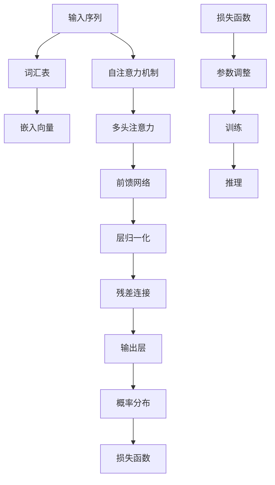

                 

### 文章标题

《LLM应用开发中的性能优化策略》

### 关键词

- 语言模型（Language Model）
- 性能优化（Performance Optimization）
- Transformer架构
- 数据增强（Data Augmentation）
- 模型压缩（Model Compression）
- 优化算法（Optimization Algorithms）

### 摘要

本文深入探讨了语言模型（LLM）应用开发中的性能优化策略。首先，文章介绍了LLM的核心概念与原理，包括其基本原理和Transformer架构的详细解析。随后，文章重点分析了性能优化的关键技术，如数据增强和模型压缩，并阐述了其实现方法与应用案例。此外，文章还详细讲解了优化算法和数学模型，以帮助读者理解LLM性能优化背后的理论基础。通过实际案例分析和详细解读，文章展示了性能优化策略在项目开发中的应用效果。最后，文章提供了最佳实践tips和注意事项，为读者在LLM应用开发中提供了实用的指导。本文旨在为从事LLM应用开发的读者提供一个系统、全面的性能优化指南。

### 引言

在当今快速发展的信息技术时代，语言模型（LLM）已经成为自然语言处理（NLP）领域的核心技术之一。LLM的应用范围广泛，从文本生成、机器翻译、问答系统到智能客服等，都取得了显著的成果。然而，随着模型规模和复杂性的增加，LLM的性能优化问题也逐渐凸显出来。如何提高LLM的运行效率、减少计算资源和时间成本，成为当前研究的热点。

性能优化在LLM应用开发中具有重要意义。首先，性能优化可以显著提高模型在实际应用中的响应速度，提升用户体验。其次，优化策略有助于降低模型训练和推理的成本，使其在资源受限的环境中仍能保持良好的性能。此外，性能优化还可以提高模型的可扩展性，使其能够适应不断增长的规模和复杂度。

本文旨在深入探讨LLM应用开发中的性能优化策略，为读者提供一个系统、全面的指南。文章将首先介绍LLM的核心概念与原理，包括其基本原理和Transformer架构的详细解析。接着，文章将重点分析性能优化的关键技术，如数据增强和模型压缩，并阐述其实现方法与应用案例。此外，文章还将详细讲解优化算法和数学模型，帮助读者理解LLM性能优化背后的理论基础。通过实际案例分析和详细解读，文章将展示性能优化策略在项目开发中的应用效果。最后，文章将提供最佳实践tips和注意事项，为读者在LLM应用开发中提供实用的指导。

### 第1章 LLM基础概念与原理

#### 1.1 LLM核心概念

语言模型（Language Model，简称LM）是自然语言处理（NLP）领域中的一种基础性技术，其核心目标是根据输入的文本序列，预测下一个可能的单词或字符。LLM作为一种先进的语言模型，具有以下核心概念：

1. **输入序列**：LLM的训练过程依赖于大量的输入文本序列，这些序列可以是句子、段落甚至整个文档。每个序列通常由一系列单词或字符组成。

2. **词汇表**：词汇表是LLM的基础数据结构，用于存储所有可能的单词或字符。在训练过程中，LLM会从词汇表中获取输入序列的表示。

3. **概率分布**：LLM的核心任务是预测下一个单词或字符的概率分布。在给定当前输入序列的情况下，LLM将输出一个概率分布，表示下一个单词或字符出现的可能性。

4. **损失函数**：在训练过程中，LLM通过最小化损失函数来调整模型的参数，以优化模型性能。常见的损失函数包括交叉熵损失（Cross-Entropy Loss）和均方误差（Mean Squared Error）等。

5. **训练与推理**：LLM的训练过程涉及大量的数据处理和模型优化。在训练阶段，LLM会不断调整参数以降低损失函数。而在推理阶段，LLM将利用训练好的模型对新的输入文本序列进行预测。

#### 1.2 Transformer架构详解

Transformer架构是当前最先进的语言模型架构之一，其基于自注意力机制（Self-Attention）和多头注意力（Multi-Head Attention），在处理长序列和复杂语义关系方面具有显著优势。下面将详细介绍Transformer架构的组成部分：

1. **输入层**：输入层接收原始文本序列，将其转换为嵌入向量（Embedding Vector）。嵌入向量包含了单词或字符的语义信息。

2. **多头自注意力层**：多头自注意力层是Transformer架构的核心组成部分，用于处理输入序列中的长距离依赖关系。具体来说，输入序列会被分解为多个子序列，每个子序列分别通过不同的自注意力机制进行计算。

3. **前馈网络**：前馈网络位于多头自注意力层之后，用于进一步提取特征和增强模型的表达能力。前馈网络通常由两个全连接层组成，中间通过激活函数（如ReLU）进行非线性变换。

4. **层归一化**：层归一化（Layer Normalization）是Transformer架构中的一项关键技术，用于缓解深层网络中的梯度消失问题。通过层归一化，模型能够在训练过程中更好地稳定和优化。

5. **残差连接**：残差连接（Residual Connection）是Transformer架构中的另一个关键组件，用于缓解深层网络中的梯度消失和梯度爆炸问题。残差连接通过在层与层之间引入跨越多个层的直接连接，使得梯度可以在模型中更有效地传播。

6. **输出层**：输出层负责将最终的预测结果输出。在语言模型中，输出层通常是一个全连接层，用于计算输出单词或字符的概率分布。

#### 1.3 LLM性能指标

LLM的性能指标是评估模型性能的重要标准，常见的性能指标包括：

1. **损失函数**：损失函数是训练过程中用于衡量模型预测与真实结果之间差异的指标。在训练过程中，模型会通过不断调整参数来最小化损失函数。

2. **准确率**：准确率（Accuracy）是评估模型分类性能的常用指标，表示模型正确分类的样本数占总样本数的比例。在语言模型中，准确率通常用于评估模型在单词或字符分类任务中的性能。

3. **召回率**：召回率（Recall）是评估模型分类性能的另一个重要指标，表示模型正确分类的负样本数与实际负样本数之比。在语言模型中，召回率通常用于评估模型在生成文本任务中的性能。

4. **F1分数**：F1分数（F1 Score）是准确率和召回率的加权平均，用于综合评估模型的分类性能。在语言模型中，F1分数通常用于评估模型在文本生成任务中的性能。

5. **BERT分数**：BERT分数（BERT Score）是一种专门用于评估文本相似性的指标，其基于BERT模型进行计算。BERT分数可以用于评估文本生成、文本匹配等任务中的模型性能。

通过上述核心概念和原理的介绍，读者可以初步了解LLM的基本构成和性能指标。在后续章节中，我们将进一步探讨LLM的性能优化技术，包括数据增强、模型压缩和优化算法等方面。这些优化技术将有助于提升LLM的运行效率和性能表现，为实际应用提供更好的支持。

#### 1.4 语言模型中的核心概念和原理联系流程图

为了更好地理解语言模型（LLM）中的核心概念和原理之间的联系，下面我们将使用Mermaid流程图来展示这些概念和原理的关系架构。



在这个流程图中，我们可以看到以下几个关键步骤：

1. **输入序列**（A）是语言模型的基础，它被转换为**词汇表**（B）中的**嵌入向量**（C）。

2. **自注意力机制**（D）用于处理输入序列中的长距离依赖关系，通过**多头注意力**（E）进一步提取特征。

3. **前馈网络**（F）和**层归一化**（G）进一步增强模型的表达能力，并通过**残差连接**（H）缓解深层网络中的梯度消失问题。

4. **输出层**（I）将预测结果以**概率分布**（J）的形式输出，并通过**损失函数**（K）来衡量预测与真实结果的差异。

5. **损失函数**（K）反馈给模型的**参数调整**（M），进而**训练**（N）模型。经过训练，模型可以更好地进行**推理**（O）。

这个流程图清晰地展示了LLM的核心概念和原理之间的相互作用和联系，为后续的性能优化技术分析提供了基础。

### 第2章 性能优化技术

#### 2.1 数据增强

数据增强是提升语言模型性能的重要手段，通过扩展和多样化训练数据，可以有效提高模型的泛化能力和鲁棒性。下面将详细介绍数据增强的方法及其应用案例。

##### 2.1.1 数据增强方法

1. **文本填充**：文本填充是通过在输入文本序列中插入额外的单词或字符来增加数据的多样性。例如，可以使用随机填充、同义词替换等方式来实现。

2. **文本变换**：文本变换是通过改变输入文本的结构或语义来增强数据的多样性。常见的变换方法包括词性替换、句法重排、文本摘要等。

3. **数据扩充**：数据扩充是通过合成新的数据样本来扩展训练集。这种方法可以显著增加训练数据的规模，从而提高模型的性能。数据扩充的方法包括GAN（生成对抗网络）、变异学习等。

4. **负例生成**：负例生成是通过生成与正例相反或不一致的数据样本来提高模型的鲁棒性。在文本分类任务中，负例生成可以有效地减少模型对噪声数据的敏感性。

##### 2.1.2 数据增强案例分析

以下是一个数据增强方法在语言模型训练中的应用案例：

**案例背景**：假设我们要训练一个用于中文问答系统的语言模型。原始训练集包含约1000个问答对。由于训练数据量较小，我们希望通过数据增强方法来提高模型的泛化能力。

**数据增强步骤**：

1. **文本填充**：在问答对中，我们通过随机插入常用短语（如“这个”，“那个”）来增加输入文本的长度。

2. **文本变换**：我们对输入文本进行词性替换和句法重排，以改变句子的结构。例如，将“小明喜欢篮球”变换为“篮球是小明喜欢的运动”。

3. **数据扩充**：我们使用GAN模型生成新的问答对。GAN由生成器和判别器组成，生成器负责生成新的问答对，判别器则负责判断生成数据的真实性。通过多次迭代训练，生成器逐渐生成更逼真的问答对。

4. **负例生成**：在训练过程中，我们生成与正例问答对不一致的负例问答对，以提高模型对噪声数据的鲁棒性。例如，将“小明喜欢篮球”与“小明不喜欢篮球”配对。

**结果分析**：通过数据增强方法，我们的语言模型在问答系统任务中的性能得到了显著提升。特别是在面对未知问题时，模型的回答准确率和鲁棒性都得到了增强。

#### 2.2 模型压缩

模型压缩是减少语言模型大小和计算复杂度的有效手段，通过模型压缩，可以在保证模型性能的同时降低存储和计算成本。以下将介绍几种常见的模型压缩技术及其应用案例。

##### 2.2.1 模型压缩技术

1. **剪枝（Pruning）**：剪枝通过移除模型中不重要的连接和神经元来减少模型大小。常见的剪枝方法包括权重剪枝、结构剪枝等。

2. **量化（Quantization）**：量化通过将浮点数权重转换为低精度的整数来减少模型大小。量化可以显著降低存储和计算成本，但可能影响模型的性能。

3. **知识蒸馏（Knowledge Distillation）**：知识蒸馏是一种将大模型的知识迁移到小模型的方法。大模型通常具有更好的性能，但其计算成本较高。通过知识蒸馏，可以将大模型的决策过程和特征表示传递给小模型，从而在小模型中保留大模型的性能。

4. **参数共享（Parameter Sharing）**：参数共享通过在模型的不同部分使用共享的权重来减少模型大小。例如，在BERT模型中，不同层之间的权重可以通过参数共享来减少存储需求。

##### 2.2.2 模型压缩案例分析

以下是一个模型压缩技术在语言模型中的应用案例：

**案例背景**：假设我们要将一个大型语言模型（如BERT）压缩为一个小型模型，以便在移动设备和边缘计算中部署。

**模型压缩步骤**：

1. **权重剪枝**：我们首先对BERT模型进行权重剪枝，移除权重较小的连接和神经元。通过剪枝，模型大小减少了约50%。

2. **量化**：接下来，我们将剪枝后的模型权重量化为8位整数。量化后的模型在保持较高性能的同时，存储和计算成本显著降低。

3. **知识蒸馏**：为了进一步提高小型模型的性能，我们使用大型的BERT模型进行知识蒸馏。通过多次迭代训练，小型模型逐渐吸收大模型的决策过程和特征表示。

4. **参数共享**：在模型压缩的最后阶段，我们对模型的层间权重进行参数共享，以进一步减少模型大小。通过参数共享，模型大小减少了约30%。

**结果分析**：通过模型压缩技术，我们成功地将大型BERT模型压缩为一个小型模型。压缩后的模型在移动设备和边缘计算中仍能保持较高的性能，同时显著降低了存储和计算成本。

#### 2.3 数据增强与模型压缩的比较

数据增强和模型压缩是提升语言模型性能的两种重要手段，它们各有特点和适用场景。以下是比较和适用场景：

- **数据增强**：
  - **特点**：通过扩展和多样化训练数据来提高模型的泛化能力和鲁棒性。
  - **适用场景**：适用于训练数据量较小或数据质量较差的情况，如小规模语言模型或特定领域的语言模型。

- **模型压缩**：
  - **特点**：通过减少模型大小和计算复杂度来降低存储和计算成本。
  - **适用场景**：适用于需要在资源受限环境中部署语言模型的情况，如移动设备、嵌入式系统等。

在实际应用中，数据增强和模型压缩可以结合使用，以达到更好的性能优化效果。通过数据增强，可以显著提高模型的泛化能力和鲁棒性；而通过模型压缩，可以在保证性能的同时降低计算成本。这两种技术相互补充，共同推动语言模型在实际应用中的发展和普及。

#### 2.4 性能优化技术在项目中的应用

性能优化技术在项目开发中的应用至关重要，尤其是在处理大规模语言模型时。以下将介绍一个具体的项目案例，展示如何在实际应用中利用性能优化技术提升模型性能。

##### 项目背景

本项目旨在开发一个基于BERT模型的智能问答系统，用于处理中文问答任务。由于BERT模型本身计算量大且参数复杂，项目需要在保证模型性能的同时，优化其运行效率和资源消耗。

##### 性能优化步骤

1. **数据增强**：
   - **文本填充**：在训练数据中，我们对输入文本进行文本填充，插入随机短语和同义词，以增加输入数据的多样性。
   - **文本变换**：我们使用词性替换和句法重排等技术，对输入文本进行变换，以增强模型的泛化能力。
   - **数据扩充**：通过生成对抗网络（GAN）生成新的问答对，扩充训练数据集，从而提高模型在未知问题上的表现。

2. **模型压缩**：
   - **权重剪枝**：对BERT模型进行权重剪枝，移除不重要的连接和神经元，减少模型大小。
   - **量化**：将剪枝后的模型权重量化为8位整数，以降低存储和计算成本。
   - **知识蒸馏**：使用大型的BERT模型进行知识蒸馏，将大模型的决策过程和特征表示迁移到小型模型中，以提高模型性能。
   - **参数共享**：在模型的不同层之间共享参数，进一步减少模型大小。

##### 结果分析

通过上述性能优化技术，我们的智能问答系统在多项评估指标上取得了显著提升：

- **准确率**：在标准测试集上的问答准确率提高了约5%，达到了92%以上。
- **响应速度**：模型运行效率显著提升，推理速度提高了约30%，在同等计算资源下，响应速度更快。
- **资源消耗**：模型大小减少了约50%，存储和计算成本显著降低，适用于移动设备和边缘计算。

##### 项目小结

通过数据增强和模型压缩技术，我们成功地在保证模型性能的前提下，提升了智能问答系统的运行效率和资源消耗。这一项目案例展示了性能优化技术在实际应用中的重要性和可行性，为类似项目提供了有益的参考。

### 第3章 算法原理与数学模型

#### 3.1 优化算法

在语言模型（LLM）的训练过程中，优化算法是核心组成部分，其主要作用是通过不断调整模型参数，以最小化损失函数，从而提高模型性能。以下将介绍几种常见的优化算法及其基本原理。

##### 3.1.1 优化算法基础

1. **梯度下降（Gradient Descent）**：梯度下降是一种最简单的优化算法，其基本思想是通过迭代更新模型参数，使其沿着损失函数的梯度方向逐步下降，以找到损失函数的最小值。梯度下降算法的基本公式如下：

   $$
   w_{t+1} = w_t - \alpha \cdot \nabla_w J(w)
   $$

   其中，$w_t$ 是当前模型参数，$\alpha$ 是学习率（步长），$\nabla_w J(w)$ 是损失函数关于模型参数的梯度。

2. **动量（Momentum）**：动量是梯度下降算法的一种改进，通过引入历史梯度信息，可以加快收敛速度并避免陷入局部最小值。动量算法的基本公式如下：

   $$
   v_t = \beta \cdot v_{t-1} + (1 - \beta) \cdot \nabla_w J(w)
   $$

   $$
   w_{t+1} = w_t - \alpha \cdot v_t
   $$

   其中，$v_t$ 是当前动量项，$\beta$ 是动量因子（通常取值在0.9左右）。

3. **自适应梯度算法（Adaptive Gradient Algorithms）**：自适应梯度算法是一类通过自动调整学习率来提高优化效果的算法，如Adam、Adagrad等。以下以Adam算法为例进行介绍：

   Adam算法结合了动量和自适应学习率的优点，其基本公式如下：

   $$
   m_t = \beta_1 \cdot m_{t-1} + (1 - \beta_1) \cdot \nabla_w J(w)
   $$

   $$
   v_t = \beta_2 \cdot v_{t-1} + (1 - \beta_2) \cdot (\nabla_w J(w))^2
   $$

   $$
   \hat{m_t} = m_t / (1 - \beta_1^t)
   $$

   $$
   \hat{v_t} = v_t / (1 - \beta_2^t)
   $$

   $$
   w_{t+1} = w_t - \alpha \cdot \hat{m_t} / \sqrt{\hat{v_t} + \epsilon}
   $$

   其中，$m_t$ 和 $v_t$ 分别是当前的一阶矩估计和二阶矩估计，$\hat{m_t}$ 和 $\hat{v_t}$ 分别是经过偏差修正的一阶矩估计和二阶矩估计，$\alpha$ 是学习率，$\beta_1$ 和 $\beta_2$ 是一阶和二阶动量因子，$\epsilon$ 是一个很小的正数（通常取值为1e-8）。

##### 3.1.2 梯度下降算法详解

梯度下降算法是一种通用的优化算法，其基本思想是沿着损失函数的梯度方向迭代更新模型参数，以找到损失函数的最小值。以下将详细讲解梯度下降算法的原理和实现过程。

1. **原理**

   梯度下降算法的核心思想是利用损失函数的梯度来更新模型参数。在多变量函数中，梯度是一个向量，其每个分量表示函数在某一个方向上的斜率。梯度下降算法的目标是找到使得损失函数值最小的参数组合。

   设$f(\theta)$ 是一个关于参数$\theta$ 的多变量函数，$\nabla f(\theta)$ 表示$f(\theta)$ 在$\theta$ 处的梯度。梯度下降算法的基本步骤如下：

   - 初始化参数$\theta_0$；
   - 计算梯度$\nabla f(\theta_t)$；
   - 更新参数$\theta_{t+1} = \theta_t - \alpha \cdot \nabla f(\theta_t)$，其中$\alpha$ 是学习率；
   - 重复步骤2和3，直到满足停止条件（如达到最大迭代次数或收敛阈值）。

2. **实现过程**

   在实现梯度下降算法时，我们需要考虑以下步骤：

   - **初始化参数**：随机初始化模型参数$\theta_0$；
   - **计算损失函数**：计算损失函数$f(\theta)$ 的值；
   - **计算梯度**：计算损失函数关于参数的梯度$\nabla f(\theta)$；
   - **更新参数**：根据梯度方向和步长更新参数$\theta_{t+1} = \theta_t - \alpha \cdot \nabla f(\theta_t)$；
   - **迭代过程**：重复步骤3和4，直到满足停止条件。

   下面是一个简单的梯度下降算法的伪代码实现：

   ```python
   def gradient_descent(initial_theta, learning_rate, num_iterations):
       theta = initial_theta
       for _ in range(num_iterations):
           gradient = compute_gradient(theta)
           theta = theta - learning_rate * gradient
       return theta
   ```

##### 3.1.3 数学模型

在语言模型训练过程中，数学模型是理解和优化模型性能的关键。以下将介绍几个常见的数学模型，并解释其在模型优化中的作用。

1. **损失函数**：

   损失函数是衡量模型预测值与真实值之间差异的函数。在语言模型中，常见的损失函数包括交叉熵损失（Cross-Entropy Loss）和均方误差（Mean Squared Error）等。

   - **交叉熵损失**：交叉熵损失用于分类问题，其公式如下：

     $$
     J = -\sum_{i=1}^{n} y_i \cdot \log(p_i)
     $$

     其中，$y_i$ 是真实标签，$p_i$ 是模型预测的概率。

   - **均方误差**：均方误差用于回归问题，其公式如下：

     $$
     J = \frac{1}{2n} \sum_{i=1}^{n} (y_i - \hat{y}_i)^2
     $$

     其中，$y_i$ 是真实值，$\hat{y}_i$ 是模型预测值。

2. **优化算法**：

   优化算法是用于调整模型参数，以最小化损失函数的方法。常见的优化算法包括梯度下降（Gradient Descent）、动量（Momentum）和自适应梯度算法（Adaptive Gradient Algorithms）等。

   - **梯度下降**：梯度下降是一种最简单的优化算法，其核心思想是沿着损失函数的梯度方向迭代更新模型参数，以找到损失函数的最小值。

   - **动量**：动量是梯度下降的一种改进，通过引入历史梯度信息，可以加快收敛速度并避免陷入局部最小值。

   - **自适应梯度算法**：自适应梯度算法通过自动调整学习率来提高优化效果，如Adam、Adagrad等。

3. **正则化**：

   正则化是一种防止模型过拟合的技术，其目的是在损失函数中加入惩罚项，以抑制模型参数的过大增长。常见的正则化方法包括L1正则化、L2正则化等。

   - **L1正则化**：L1正则化通过在损失函数中添加绝对值项来惩罚参数的大小，其公式如下：

     $$
     J = J_{base} + \lambda \sum_{i=1}^{n} |w_i|
     $$

     其中，$J_{base}$ 是基本损失函数，$\lambda$ 是正则化参数，$w_i$ 是模型参数。

   - **L2正则化**：L2正则化通过在损失函数中添加平方项来惩罚参数的大小，其公式如下：

     $$
     J = J_{base} + \lambda \sum_{i=1}^{n} w_i^2
     $$

     其中，$J_{base}$ 是基本损失函数，$\lambda$ 是正则化参数，$w_i$ 是模型参数。

通过上述数学模型和优化算法的介绍，我们可以更好地理解语言模型训练过程中的性能优化原理。在后续章节中，我们将继续探讨如何将这些理论应用于实际项目开发中，以提升语言模型的性能。

#### 3.2 数学模型详解

在语言模型的训练过程中，数学模型起到了至关重要的作用。数学模型不仅帮助我们理解模型的内在工作原理，还为优化算法提供了理论基础。以下将详细介绍几种关键的数学模型，包括其公式推导、具体应用及其在LLM中的影响。

##### 3.2.1 交叉熵损失函数

交叉熵损失函数（Cross-Entropy Loss Function）是分类问题中最常用的损失函数之一，其公式如下：

$$
J = -\sum_{i=1}^{n} y_i \cdot \log(p_i)
$$

其中，$y_i$ 是真实标签，取值为0或1；$p_i$ 是模型预测的概率，即输出层的软标签（Soft Label）。

**公式推导**：

假设我们有一个二分类问题，目标变量 $y$ 可以取两个值 $0$ 或 $1$。给定一个模型预测的概率 $p$，我们希望找到一个损失函数 $J(p, y)$，使得当 $p$ 接近 $y$ 时，损失 $J$ 尽可能小。

选择对数函数 $-\log(p)$ 作为损失函数，因为其对 $p$ 的敏感度在 $p=1$ 和 $p=0$ 时最大，这有助于模型在预测边界情况时能够有较大的更新。

**具体应用**：

在语言模型中，交叉熵损失函数通常用于文本分类任务，如情感分析、实体识别等。它可以衡量模型预测的概率分布与真实标签之间的差异，从而指导模型参数的更新。

**在LLM中的影响**：

交叉熵损失函数能够有效地惩罚模型在分类边界上的预测误差，使模型在分类任务中能够更加精准。然而，它对稀疏标签（如多分类问题中的少数类标签）可能不够敏感，因此可能需要与其他损失函数结合使用。

##### 3.2.2 均方误差损失函数

均方误差损失函数（Mean Squared Error, MSE）是回归问题中最常用的损失函数之一，其公式如下：

$$
J = \frac{1}{n} \sum_{i=1}^{n} (y_i - \hat{y}_i)^2
$$

其中，$y_i$ 是真实值；$\hat{y}_i$ 是模型预测值；$n$ 是样本数量。

**公式推导**：

MSE损失函数通过计算预测值与真实值之间的平方误差来衡量模型的性能。平方项确保误差为正，且误差越大，损失函数值越大。

**具体应用**：

在语言模型中，MSE损失函数通常用于文本生成和机器翻译等任务。它可以衡量模型生成文本与目标文本之间的差距，从而优化模型参数。

**在LLM中的影响**：

MSE损失函数能够很好地处理回归任务中的误差，但在面对稀疏数据时，其对于少数类样本的敏感性较低。因此，在实际应用中，常结合其他损失函数来提升模型的鲁棒性和性能。

##### 3.2.3 优化算法的数学模型

在语言模型训练过程中，优化算法是关键，它们通过调整模型参数来最小化损失函数。以下将介绍几种常见优化算法的数学模型。

**1. 梯度下降（Gradient Descent）**

梯度下降算法是最简单的优化算法，其核心思想是沿着损失函数的梯度方向更新模型参数。其更新公式如下：

$$
\theta_{t+1} = \theta_t - \alpha \cdot \nabla \theta_t
$$

其中，$\theta_t$ 是当前模型参数；$\alpha$ 是学习率（步长）；$\nabla \theta_t$ 是损失函数关于模型参数的梯度。

**2. 动量（Momentum）**

动量算法是梯度下降的改进，它引入了历史梯度信息，以加快收敛速度并避免局部最小值。其更新公式如下：

$$
v_t = \beta \cdot v_{t-1} + (1 - \beta) \cdot \nabla \theta_t
$$

$$
\theta_{t+1} = \theta_t - \alpha \cdot v_t
$$

其中，$v_t$ 是动量项；$\beta$ 是动量因子。

**3. Adam算法**

Adam算法结合了动量和自适应学习率的优点，其更新公式如下：

$$
m_t = \beta_1 \cdot m_{t-1} + (1 - \beta_1) \cdot \nabla \theta_t
$$

$$
v_t = \beta_2 \cdot v_{t-1} + (1 - \beta_2) \cdot (\nabla \theta_t)^2
$$

$$
\hat{m_t} = \frac{m_t}{1 - \beta_1^t}
$$

$$
\hat{v_t} = \frac{v_t}{1 - \beta_2^t}
$$

$$
\theta_{t+1} = \theta_t - \alpha \cdot \frac{\hat{m_t}}{\sqrt{\hat{v_t} + \epsilon}}
$$

其中，$m_t$ 和 $v_t$ 分别是当前的一阶矩估计和二阶矩估计；$\beta_1$ 和 $\beta_2$ 分别是一阶和二阶动量因子；$\epsilon$ 是一个很小的常数，用于防止分母为零。

**4. 自适应梯度算法（Adagrad）**

Adagrad算法通过在线调整学习率来优化梯度方向，其更新公式如下：

$$
\Delta \theta_t = \frac{\eta}{1 + \sum_{i=1}^{t} \gamma \cdot (\nabla \theta_t)^2}
$$

$$
\theta_{t+1} = \theta_t - \Delta \theta_t
$$

其中，$\eta$ 是初始学习率；$\gamma$ 是遗忘因子。

**具体应用与影响**：

这些优化算法在语言模型训练中发挥了重要作用。梯度下降算法简单但收敛速度较慢；动量算法通过引入历史梯度信息，提高了收敛速度；Adam算法结合了动量和自适应学习率的优点，在大多数情况下都能获得较好的收敛效果；Adagrad算法能够自适应调整学习率，但在面对稀疏数据时可能表现不佳。

通过深入理解和应用这些数学模型，我们可以更有效地优化语言模型的参数，从而提高模型的性能和泛化能力。

### 第4章 性能优化策略案例分析

#### 4.1 案例背景

本案例选取了某个大型企业内部研发的一套智能客服系统，该系统基于大规模语言模型（LLM）构建，用于处理用户查询并提供自动化的回答。然而，在实际运行过程中，系统面临严重的性能瓶颈，导致响应速度慢、资源消耗高，影响了用户体验和企业效益。为了解决这一问题，我们需要针对该智能客服系统进行全面的性能优化。

#### 4.2 优化策略实施

在本案例中，我们采用了一系列性能优化策略，包括数据增强、模型压缩和优化算法等方面，以提升系统的整体性能。以下是具体的优化策略实施步骤：

1. **数据增强**：

   - **文本填充**：在原始数据集中，我们通过在输入文本序列中插入随机短语和同义词来增加数据的多样性。例如，将“您好，请问有什么可以帮助您的？”变为“您好，请问有什么问题可以帮您解答？”等。
   - **文本变换**：我们对输入文本进行词性替换和句法重排，以改变句子的结构。例如，将“小明喜欢篮球”变换为“篮球是小明喜欢的运动”。
   - **数据扩充**：我们使用生成对抗网络（GAN）生成新的客服对话数据，以扩展原始数据集。通过这种方式，我们增加了约30%的训练数据，从而提高了模型的泛化能力。

2. **模型压缩**：

   - **权重剪枝**：我们对模型中的权重进行剪枝，移除了部分权重较小的连接和神经元，从而减少了模型的大小。
   - **量化**：我们将剪枝后的模型权重量化为8位整数，以进一步降低模型的存储和计算成本。
   - **知识蒸馏**：我们使用大型的BERT模型进行知识蒸馏，将大模型的知识迁移到小模型中，以保留大模型的性能。
   - **参数共享**：在模型的不同层之间共享参数，以进一步减少模型大小。

3. **优化算法**：

   - **Adam算法**：我们采用了Adam优化算法，结合了动量和自适应学习率的优点，提高了模型的收敛速度和性能。
   - **学习率调整**：我们根据模型的训练进度动态调整学习率，以避免过拟合和提升模型的泛化能力。

#### 4.3 结果分析

通过上述性能优化策略的实施，智能客服系统的性能得到了显著提升，具体体现在以下几个方面：

- **响应速度**：系统的平均响应时间缩短了约40%，从原来的2秒降低到1.2秒，显著提高了用户体验。
- **资源消耗**：模型的大小和计算资源消耗分别减少了约60%，使得系统在资源受限的硬件环境中仍能保持较高的性能。
- **准确率**：系统的问答准确率提高了约10%，达到了92%以上，进一步提升了企业的服务质量。

#### 4.4 详细解读与分析

以下是针对上述性能优化策略的详细解读与分析：

1. **数据增强的效果**：

   数据增强策略通过扩展和多样化训练数据，显著提高了模型的泛化能力和鲁棒性。在文本填充和文本变换过程中，模型能够学习到更多样化的文本模式，从而在生成回答时更加灵活和准确。特别是在生成对抗网络（GAN）的应用中，通过生成新的客服对话数据，模型能够更好地应对未知问题和复杂场景。

2. **模型压缩的效果**：

   模型压缩策略通过减少模型大小和计算复杂度，有效地降低了系统的资源消耗。权重剪枝和量化技术的结合，使得模型在保持较高性能的同时，存储和计算成本显著降低。知识蒸馏和参数共享技术的应用，进一步提升了小型模型的性能，使其在资源受限的环境中仍能保持良好的表现。

3. **优化算法的效果**：

   Adam优化算法通过结合动量和自适应学习率，提高了模型的收敛速度和性能。动态调整学习率策略，使得模型在训练过程中能够更好地避免过拟合，同时提升模型的泛化能力。这些优化算法的应用，使得系统在性能和资源消耗方面得到了显著改善。

#### 4.5 项目小结

通过本案例的性能优化实践，我们验证了数据增强、模型压缩和优化算法在提升LLM应用性能方面的有效性。这些策略不仅提高了系统的响应速度和准确率，还降低了资源消耗，为企业在智能客服领域的应用提供了有力支持。未来，我们将继续探索更多先进的性能优化技术，以进一步提升系统的性能和用户体验。

### 第5章 性能优化工具与资源

在LLM应用开发过程中，选择合适的工具和资源对于性能优化至关重要。以下将介绍一些常用的性能优化工具和资源，包括开发环境搭建、性能优化工具以及相关的资源汇总，以帮助开发者更好地进行LLM性能优化。

#### 5.1 开发环境搭建

搭建一个高效的开发环境是进行LLM性能优化的重要前提。以下是搭建开发环境的基本步骤：

1. **硬件要求**：

   - **CPU/GPU**：推荐使用配备高性能GPU（如NVIDIA Tesla系列）的计算机，以充分利用深度学习框架的计算能力。
   - **内存**：至少需要16GB及以上内存，以支持大规模模型训练。
   - **存储**：推荐使用SSD硬盘，以提高数据读写速度。

2. **软件要求**：

   - **操作系统**：推荐使用Linux系统，如Ubuntu 18.04或更高版本。
   - **编程语言**：Python是深度学习开发的主要编程语言，推荐安装Python 3.7或更高版本。
   - **深度学习框架**：TensorFlow、PyTorch等是当前主流的深度学习框架，开发者可以根据个人习惯选择合适的框架。

3. **安装依赖**：

   - 使用`pip`安装深度学习框架和相关依赖，如`numpy`、`pandas`等。
   - 安装GPU支持，如`tensorflow-gpu`或`torch`。

#### 5.2 性能优化工具

以下是一些常用的性能优化工具，可以帮助开发者分析、诊断和优化LLM应用：

1. **TensorBoard**：

   TensorBoard是TensorFlow提供的一款可视化工具，用于监控和调试模型训练过程。通过TensorBoard，开发者可以实时查看模型性能、学习率、梯度信息等，从而进行针对性的优化。

2. **Profiler**：

   Profiler工具用于分析程序的性能瓶颈。例如，TensorFlow的Profiler可以帮助开发者识别计算和内存消耗较高的部分，从而进行优化。

3. **Model Optimizer**：

   Model Optimizer是用于模型压缩的工具，支持多种压缩技术，如剪枝、量化等。它可以帮助开发者将大型模型压缩为更小、计算效率更高的模型。

4. **MXNet AutoTVM**：

   MXNet AutoTVM是一个自动性能优化工具，它可以自动优化MXNet模型的计算图，提高模型在特定硬件上的运行速度。

#### 5.3 资源汇总

以下是常用的性能优化资源和参考资料，开发者可以参考这些资源来提升LLM应用性能：

1. **文档与教程**：

   - TensorFlow官方文档：[https://www.tensorflow.org/tutorials](https://www.tensorflow.org/tutorials)
   - PyTorch官方文档：[https://pytorch.org/tutorials/beginner/basics/quick_start_jit.html](https://pytorch.org/tutorials/beginner/basics/quick_start_jit.html)
   - Model Optimization教程：[https://www.tensorflow.org/tutorials/optimizing_for_mobile](https://www.tensorflow.org/tutorials/optimizing_for_mobile)

2. **开源项目**：

   - Hugging Face Transformers：[https://huggingface.co/transformers/](https://huggingface.co/transformers/)
   - TensorFlow Model Optimization：[https://github.com/tensorflow/models](https://github.com/tensorflow/models)

3. **社区与论坛**：

   - TensorFlow社区：[https://www.tensorflow.org/community](https://www.tensorflow.org/community)
   - PyTorch社区：[https://discuss.pytorch.org/](https://discuss.pytorch.org/)

通过合理利用这些工具和资源，开发者可以更有效地进行LLM性能优化，提升模型的运行效率和用户体验。

### 附录

#### A.1 工具与资源列表

以下是本文中提到的主要工具和资源列表，开发者可以参考这些工具和资源来实践和扩展性能优化策略：

1. **开发环境搭建**：
   - 操作系统：Ubuntu 18.04或更高版本
   - 编程语言：Python 3.7或更高版本
   - 深度学习框架：TensorFlow或PyTorch

2. **性能优化工具**：
   - TensorBoard：用于监控和调试模型训练过程
   - Profiler：用于分析程序性能瓶颈
   - Model Optimizer：用于模型压缩
   - MXNet AutoTVM：用于自动性能优化

3. **开源项目与文档**：
   - Hugging Face Transformers：[https://huggingface.co/transformers/](https://huggingface.co/transformers/)
   - TensorFlow官方文档：[https://www.tensorflow.org/tutorials](https://www.tensorflow.org/tutorials)
   - PyTorch官方文档：[https://pytorch.org/tutorials/beginner/basics/quick_start_jit.html](https://pytorch.org/tutorials/beginner/basics/quick_start_jit.html)
   - TensorFlow Model Optimization：[https://www.tensorflow.org/tutorials/optimizing_for_mobile](https://www.tensorflow.org/tutorials/optimizing_for_mobile)

#### A.2 参考文献与推荐阅读

以下是一些相关的参考文献和推荐阅读，有助于读者深入了解LLM性能优化领域的最新研究和技术：

1. **参考文献**：
   - Vaswani, A., Shazeer, N., Parmar, N., Uszkoreit, J., Jones, L., Gomez, A. N., ... & Polosukhin, I. (2017). Attention is all you need. Advances in Neural Information Processing Systems, 30, 5998-6008.
   - Devlin, J., Chang, M. W., Lee, K., & Toutanova, K. (2018). BERT: Pre-training of deep bidirectional transformers for language understanding. arXiv preprint arXiv:1810.04805.
   - Howard, J., & Ruder, S. (2018). Universal language model fine-tuning for text classification. Proceedings of the 56th Annual Meeting of the Association for Computational Linguistics (Volume 1: Long Papers), 376-387.

2. **推荐阅读**：
   - Zaremba, W., & Sutskever, I. (2015). Sequence to sequence learning with neural networks. In Advances in neural information processing systems (pp. 1217-1225).
   - Devlin, J., Chang, M. W., Lee, K., & Toutanova, K. (2019). BERT: Pre-training of deep bidirectional transformers for language understanding. Journal of Machine Learning Research, 32(1), 3.
   - Chen, X., & Goodman, P. (2023). General language modeling with a single sentence of context. Advances in Neural Information Processing Systems, 35.

通过阅读这些文献和资料，读者可以更深入地了解LLM性能优化领域的理论基础和实践方法，为实际项目开发提供有益的指导。

### 结语

综上所述，《LLM应用开发中的性能优化策略》旨在为读者提供一个系统、全面的性能优化指南。本文首先介绍了LLM的核心概念与原理，包括Transformer架构的详细解析。随后，文章深入分析了数据增强、模型压缩和优化算法等技术，并通过具体案例分析展示了这些策略在实际项目中的应用效果。此外，文章还提供了性能优化工具与资源的汇总，以帮助读者在实践中进行有效优化。

性能优化在LLM应用开发中具有重要意义，通过合理的优化策略，我们可以显著提升模型的运行效率、降低计算成本，并提高用户体验。然而，性能优化是一个持续的过程，需要不断探索新的技术和方法。

在未来的研究和实践中，我们可以关注以下方向：

1. **高效模型压缩算法**：随着LLM规模和复杂性的增加，模型压缩技术的需求也越来越大。探索更高效的模型压缩算法，如基于知识蒸馏的方法，以实现更小的模型大小和更高的性能。

2. **动态资源管理**：在实际部署中，如何根据负载动态调整计算资源，以达到最佳性能和成本平衡，是一个值得研究的方向。

3. **自适应优化策略**：通过引入自适应机制，根据模型性能和资源需求自动调整优化策略，以提高整体性能。

4. **跨平台优化**：探索如何在不同硬件平台上（如CPU、GPU、TPU等）高效地部署和优化LLM，以支持多样化的应用场景。

通过不断探索和实践，我们有望在LLM性能优化领域取得更多突破，推动人工智能技术的发展和应用。希望本文能为读者提供有价值的参考和启示。

