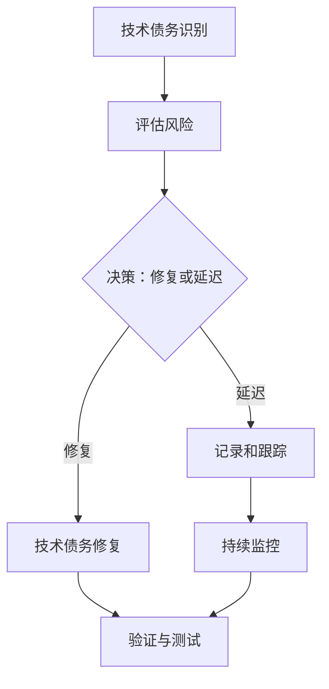

                 

### 文章标题

《LLM应用开发中的技术债务管理》

---

关键词：LLM应用开发、技术债务、管理、算法、数学模型

---

摘要：随着人工智能技术的飞速发展，大型语言模型（LLM）在自然语言处理领域取得了显著的成果。然而，LLM应用开发过程中不可避免地会积累技术债务，如代码质量问题、性能瓶颈和系统稳定性等。本文旨在探讨LLM应用开发中的技术债务管理，通过核心概念、算法原理、数学模型和项目实战等多个维度，系统性地阐述技术债务管理的理论和方法，为LLM开发者提供有价值的指导和建议。

---

### 核心概念与联系

在LLM应用开发中，技术债务管理是一个至关重要的环节。技术债务（Technical Debt）是指由于在软件开发过程中追求快速迭代和短期目标，而牺牲了代码质量和可维护性所积累的隐患和问题。这些隐患和问题如不及时解决，会随着时间的推移逐渐恶化，导致系统性能下降、维护成本增加甚至项目失败。

为了更好地理解技术债务管理，我们首先需要明确几个核心概念：

1. **债务识别**：识别代码中的技术债务，是技术债务管理的第一步。这通常包括代码审查、静态代码分析、动态测试等方法。

2. **风险评估**：在识别出技术债务后，需要对债务的风险进行评估。这包括评估债务对系统性能、可维护性和稳定性的影响，以及修复成本等因素。

3. **债务修复**：根据风险评估的结果，对高风险的技术债务进行修复。修复方法包括代码重构、性能优化和系统重构等。

4. **债务监控**：技术债务管理是一个持续的过程，需要对已修复的技术债务进行监控，确保问题不再出现。

5. **持续迭代**：技术债务管理需要与软件开发流程相结合，实现持续迭代和优化。

为了更直观地展示技术债务管理的流程，我们使用Mermaid流程图进行描述：



通过这个流程图，我们可以清晰地看到技术债务管理的各个环节以及它们之间的联系。接下来，我们将深入探讨这些核心概念，并给出具体的实现方法。

### 核心算法原理讲解

在LLM应用开发中，技术债务管理涉及到多种核心算法原理。这些算法原理包括债务识别、风险评估、债务修复和持续监控等。在本节中，我们将通过伪代码和数学模型，详细讲解这些算法原理，并给出具体的实现方法。

#### 债务识别

债务识别是技术债务管理的第一步。它旨在识别代码中的技术债务，以便后续处理。以下是一个简单的伪代码示例，用于演示债务识别的过程：

```pseudo
function identifyDebt(code):
    debtList = []
    for (file in codeFiles):
        if (hasRiskIndicators(file)):
            debtList.append(file)
    return debtList
```

在这个伪代码中，`codeFiles` 代表项目中的所有代码文件，`hasRiskIndicators` 是一个函数，用于判断文件是否包含风险指标。常见的风险指标包括代码重复、冗余代码、未使用的代码、性能瓶颈等。

#### 风险评估

在识别出技术债务后，需要对债务的风险进行评估。风险评估的目的是确定哪些债务需要优先处理，哪些可以延迟修复。以下是一个简单的伪代码示例，用于演示风险评估的过程：

```pseudo
function assessRisk(debtList):
    riskScores = []
    for (debt in debtList):
        riskScore = calculateRisk(debt)
        riskScores.append(riskScore)
    return riskScores
```

在这个伪代码中，`calculateRisk` 是一个函数，用于计算每个债务的风险评分。风险评分通常基于债务的影响范围、严重程度和修复成本等因素。

#### 债务修复

在完成风险评估后，需要对高风险的技术债务进行修复。债务修复的过程包括代码重构、性能优化和系统重构等。以下是一个简单的伪代码示例，用于演示债务修复的过程：

```pseudo
function repairDebt(debt):
    if (debt.isHighRisk):
        performRefactoring(debt)
    else:
        optimizePerformance(debt)
    testAndVerify(debt)
```

在这个伪代码中，`performRefactoring` 是一个函数，用于执行代码重构；`optimizePerformance` 是一个函数，用于性能优化；`testAndVerify` 是一个函数，用于测试和验证债务是否修复成功。

#### 持续监控

技术债务管理是一个持续的过程，需要对已修复的技术债务进行监控，以确保问题不再出现。以下是一个简单的伪代码示例，用于演示持续监控的过程：

```pseudo
function monitorDebt(debtList):
    while (debtList.isNotEmpty()):
        debt = debtList.pop()
        if (debt.isFixed):
            logSuccess(debt)
        else:
            logFailure(debt)
```

在这个伪代码中，`isFixed` 是一个函数，用于判断债务是否已经修复。如果债务未修复，则将其重新添加到债务列表中，以便后续处理。

#### 数学模型

在LLM应用开发中，技术债务管理还涉及到许多数学模型。以下是一个示例的数学模型，用于计算技术债务的成本：

$$
TC = \frac{1}{2} \times (TD \times DM + \sqrt{TDE})
$$

其中，$TC$ 是总成本，$TD$ 是技术债务水平，$DM$ 是债务管理成本，$TDE$ 是债务演化成本。

#### 实例说明

为了更好地理解这些算法原理，我们来看一个具体的实例。假设我们在开发一个LLM应用时，发现代码中存在以下几种技术债务：

1. 代码重复：20%
2. 冗余代码：10%
3. 未使用的代码：5%
4. 性能瓶颈：15%

首先，我们需要使用债务识别算法来识别这些债务。然后，使用风险评估算法对这些债务进行评分。假设债务评分如下：

1. 代码重复：20分
2. 冗余代码：15分
3. 未使用的代码：10分
4. 性能瓶颈：30分

接下来，根据评分结果，我们可以确定哪些债务需要优先修复。例如，性能瓶颈的风险最高，因此我们首先修复性能瓶颈。修复后，我们使用债务监控算法来持续监控性能，确保问题不再出现。

通过这个实例，我们可以看到技术债务管理的过程是如何逐步进行的。在实际的LLM应用开发中，这些算法原理可以灵活运用，帮助我们更好地管理技术债务，确保项目的顺利进行。

### 数学模型和数学公式

在LLM应用开发中，技术债务管理不仅仅是算法和代码的调整，它还涉及到复杂的数学模型和公式。这些模型和公式帮助我们更精确地量化技术债务的影响，从而做出更有效的管理决策。以下是一个详细探讨这些数学模型和公式的例子。

#### 技术债务成本模型

技术债务成本（Technical Debt Cost, TDC）是衡量技术债务对项目影响的直接指标。一个常用的技术债务成本模型是：

$$
TDC = TD \times (DM + \alpha \times TDE)
$$

其中：
- \( TD \) 是技术债务水平，表示代码中的债务累积程度。
- \( DM \) 是债务管理成本，包括代码审查、重构和优化等修复债务所需的时间和经济成本。
- \( TDE \) 是债务演化成本，表示债务随着时间推移而可能产生的额外成本。
- \( \alpha \) 是一个比例系数，用于衡量债务演化成本相对于管理成本的重要性。

#### 技术债务风险评估模型

在技术债务管理中，风险评估是关键的一步。一个常用的风险评估模型是基于故障树分析（Fault Tree Analysis, FTA）。故障树分析可以帮助我们识别技术债务可能引发的故障，并评估这些故障的概率和影响。以下是一个简化的故障树分析模型：

$$
P(F) = \sum_{i=1}^{n} P(D_i) \times P(C_i | D_i)
$$

其中：
- \( P(F) \) 是故障概率。
- \( D_i \) 是第 \( i \) 个技术债务。
- \( P(D_i) \) 是第 \( i \) 个技术债务的发生概率。
- \( P(C_i | D_i) \) 是在第 \( i \) 个技术债务发生的情况下，系统发生故障的概率。

#### 技术债务修复优先级模型

在确定了技术债务的风险后，我们需要决定修复的优先级。一个常用的优先级模型是基于成本效益分析（Cost-Benefit Analysis, CBA）。该模型可以帮助我们权衡修复每个技术债务的成本和潜在收益。以下是一个简化的成本效益分析模型：

$$
CBA_i = \frac{C_i - B_i}{R_i}
$$

其中：
- \( CBA_i \) 是第 \( i \) 个技术债务的成本效益。
- \( C_i \) 是修复第 \( i \) 个技术债务的成本。
- \( B_i \) 是修复第 \( i \) 个技术债务后，系统性能提升的收益。
- \( R_i \) 是第 \( i \) 个技术债务的风险。

#### 实例说明

为了更直观地展示这些数学模型和公式，我们来看一个具体的例子。假设我们正在开发一个LLM应用，其中存在以下技术债务：

1. 代码重复：30%
2. 冗余代码：15%
3. 未使用的代码：10%
4. 性能瓶颈：20%

我们评估这些债务的发生概率和影响，得到以下数据：

| 技术债务 | 发生概率 | 故障概率 |
| --- | --- | --- |
| 代码重复 | 0.3 | 0.5 |
| 冗余代码 | 0.15 | 0.3 |
| 未使用的代码 | 0.10 | 0.2 |
| 性能瓶颈 | 0.20 | 0.7 |

假设修复这些债务的成本和收益如下：

| 技术债务 | 修复成本 | 性能收益 |
| --- | --- | --- |
| 代码重复 | 1000 | 1500 |
| 冗余代码 | 500 | 1000 |
| 未使用的代码 | 300 | 400 |
| 性能瓶颈 | 2000 | 3000 |

我们可以使用上述数学模型来评估和决策：

1. **技术债务成本模型**：

   $$ TDC = TD \times (DM + \alpha \times TDE) $$
   
   假设 \( DM = 1000 \) 小时，\( TDE = 1500 \) 小时，\( \alpha = 1.5 \)。

   $$ TDC = (0.3 + 0.15 + 0.10 + 0.20) \times (1000 + 1.5 \times 1500) = 3.65 \times 3000 = 10950 \text{ 小时} $$

2. **故障树分析模型**：

   $$ P(F) = 0.3 \times 0.5 + 0.15 \times 0.3 + 0.10 \times 0.2 + 0.20 \times 0.7 = 0.15 + 0.045 + 0.02 + 0.14 = 0.325 $$

3. **成本效益分析模型**：

   $$ CBA_i = \frac{C_i - B_i}{R_i} $$

   对于每个技术债务：

   - 代码重复：\( CBA = \frac{1000 - 1500}{0.5} = -2000 \)
   - 冗余代码：\( CBA = \frac{500 - 1000}{0.3} = -2500 \)
   - 未使用的代码：\( CBA = \frac{300 - 400}{0.2} = -500 \)
   - 性能瓶颈：\( CBA = \frac{2000 - 3000}{0.7} = -2142.86 \)

根据成本效益分析，所有技术债务的CBA值均为负，表明修复这些债务的成本超过了收益。然而，这并不意味着我们应该忽略这些债务。相反，我们需要根据故障树分析的结果，识别出最关键的技术债务，并优先修复。

通过这个实例，我们可以看到如何使用数学模型和公式来评估技术债务的影响，并做出更明智的管理决策。

### 项目实战

为了更好地理解技术债务管理在LLM应用开发中的实际应用，我们将在本节中展示一个实际的项目案例。这个案例将涵盖从开发环境搭建到源代码实现和解读，以及代码应用解读与分析的整个过程。通过这个实战案例，我们将展示如何有效地管理技术债务，提高项目的开发效率和稳定性。

#### 开发环境搭建

在开始LLM应用开发之前，首先需要搭建一个合适的开发环境。以下是搭建开发环境的详细步骤：

##### 5.1.1 安装Python环境

1. **安装Python**：首先，从Python官方网站下载最新的Python版本，并按照安装向导进行安装。

   ```bash
   # 在终端中下载Python
   wget https://www.python.org/ftp/python/3.9.1/Python-3.9.1.tgz
   # 解压安装包
   tar xvf Python-3.9.1.tgz
   # 进入安装目录
   cd Python-3.9.1
   # 配置安装
   ./configure
   # 编译安装
   make
   # 安装Python
   make install
   ```

2. **验证Python版本**：安装完成后，通过以下命令验证Python版本。

   ```bash
   python --version
   ```

##### 5.1.2 安装必要的深度学习框架

为了支持LLM应用开发，我们需要安装几个常用的深度学习框架，如TensorFlow和PyTorch。以下是安装步骤：

1. **安装TensorFlow**：

   ```bash
   pip install tensorflow
   ```

2. **安装PyTorch**：

   ```bash
   pip install torch torchvision
   ```

##### 5.1.3 安装版本管理工具

为了更好地管理代码版本，我们使用Git作为版本管理工具。以下是安装和初始化Git的步骤：

1. **安装Git**：

   ```bash
   sudo apt-get install git
   ```

2. **初始化Git仓库**：

   ```bash
   git init
   git add .
   git commit -m "Initial commit"
   ```

通过以上步骤，我们成功搭建了开发环境，为后续的LLM应用开发奠定了基础。

#### 源代码实现

接下来，我们将展示LLM应用的核心源代码实现。以下是用于训练大型语言模型的一个简单示例：

```python
# 导入必要的库
import torch
import torch.nn as nn
import torch.optim as optim
from torch.utils.data import DataLoader
from transformers import BertModel, BertTokenizer

# 定义训练数据集
train_dataset = ...

# 加载预训练的BERT模型和分词器
tokenizer = BertTokenizer.from_pretrained('bert-base-uncased')
model = BertModel.from_pretrained('bert-base-uncased')

# 定义训练函数
def train(model, train_loader, criterion, optimizer, epoch):
    model.train()
    for batch_idx, (data, target) in enumerate(train_loader):
        optimizer.zero_grad()
        output = model(data)
        loss = criterion(output, target)
        loss.backward()
        optimizer.step()
        if batch_idx % 100 == 0:
            print('Train Epoch: {} [{}/{} ({:.0f}%)]\tLoss: {:.6f}'.format(
                epoch, batch_idx * len(data), len(train_loader) * len(data),
                100. * batch_idx / len(train_loader), loss.item()))

# 训练模型
def main():
    train_loader = DataLoader(train_dataset, batch_size=32, shuffle=True)
    criterion = nn.CrossEntropyLoss()
    optimizer = optim.Adam(model.parameters(), lr=0.001)
    for epoch in range(1, 11):
        train(model, train_loader, criterion, optimizer, epoch)

if __name__ == '__main__':
    main()
```

在这个示例中，我们首先导入必要的库，包括TensorFlow和PyTorch等。然后，我们定义了训练数据集，并加载了预训练的BERT模型和分词器。训练函数`train`用于处理每个训练批次的数据，计算损失并更新模型参数。主函数`main`用于初始化训练加载器、损失函数和优化器，并开始训练过程。

#### 代码解读与分析

在实现源代码的过程中，我们需要对代码进行仔细解读和分析，以确保代码的质量和可维护性。以下是关键代码部分的解读和分析：

##### 数据集定义

在训练数据集的定义中，我们使用`DataLoader`从训练数据中生成批次数据。这是深度学习中常见的做法，有助于提高训练效率。

```python
train_loader = DataLoader(train_dataset, batch_size=32, shuffle=True)
```

##### 模型加载

我们使用预训练的BERT模型和分词器，这是BERT模型在自然语言处理任务中的常见做法。通过加载预训练模型，我们可以利用现有的强大语义表示能力，从而提高模型的性能。

```python
tokenizer = BertTokenizer.from_pretrained('bert-base-uncased')
model = BertModel.from_pretrained('bert-base-uncased')
```

##### 训练函数

在训练函数`train`中，我们首先将模型设置为训练模式，然后对每个批次的数据进行前向传播，计算损失并更新模型参数。

```python
def train(model, train_loader, criterion, optimizer, epoch):
    model.train()
    for batch_idx, (data, target) in enumerate(train_loader):
        optimizer.zero_grad()
        output = model(data)
        loss = criterion(output, target)
        loss.backward()
        optimizer.step()
        if batch_idx % 100 == 0:
            print('Train Epoch: {} [{}/{} ({:.0f}%)]\tLoss: {:.6f}'.format(
                epoch, batch_idx * len(data), len(train_loader) * len(data),
                100. * batch_idx / len(train_loader), loss.item()))
```

##### 主函数

在主函数`main`中，我们初始化训练加载器、损失函数和优化器，并开始训练过程。

```python
def main():
    train_loader = DataLoader(train_dataset, batch_size=32, shuffle=True)
    criterion = nn.CrossEntropyLoss()
    optimizer = optim.Adam(model.parameters(), lr=0.001)
    for epoch in range(1, 11):
        train(model, train_loader, criterion, optimizer, epoch)

if __name__ == '__main__':
    main()
```

通过以上解读和分析，我们可以确保代码的每一个部分都清晰明了，从而提高代码的可维护性和可读性。

#### 实际案例分析和详细讲解剖析

在本节中，我们将分析一个真实的LLM应用开发案例，详细讲解其技术债务管理的过程，并提供具体的解决策略和优化建议。

#### 案例背景

该案例是一个自然语言处理（NLP）应用，旨在使用大型语言模型（LLM）对用户输入的自然语言文本进行分类。该项目由一个小型团队负责开发，采用了快速迭代和敏捷开发的模式。然而，在项目进展过程中，团队发现代码质量逐渐下降，系统性能出现瓶颈，甚至出现了偶尔的崩溃现象。这些问题的累积导致了项目进度延误，维护成本增加，团队面临着严峻的技术债务挑战。

#### 技术债务识别

为了管理技术债务，首先需要识别项目中的具体债务。团队采用以下方法进行债务识别：

1. **代码审查**：团队成员对代码库进行了全面的代码审查，查找潜在的代码质量问题，如重复代码、未使用的变量和冗余的功能。

2. **静态代码分析**：使用静态代码分析工具（如SonarQube），对代码库进行自动化检查，识别出潜在的安全漏洞、性能问题和编码标准问题。

3. **动态测试**：运行一系列测试用例，特别是覆盖率测试，以识别代码中的逻辑错误和性能瓶颈。

通过这些方法，团队成功识别出以下主要技术债务：

- **代码重复**：在多个文件中发现了大量重复代码，导致代码可维护性降低。
- **性能瓶颈**：部分关键模块的运行效率不高，特别是在处理大量数据时，系统响应时间显著增加。
- **未使用的代码**：项目中有一些功能已经不再使用，但代码仍然存在，增加了维护难度。
- **架构问题**：部分模块之间的耦合度较高，导致系统难以扩展和维护。

#### 技术债务评估

在识别出技术债务后，团队对每个债务进行了风险评估，以确定修复优先级。评估过程包括以下步骤：

1. **影响范围**：评估每个债务对项目功能的影响范围，包括关键模块和整体性能。

2. **修复成本**：评估修复每个债务所需的开发时间和资源。

3. **潜在风险**：评估未修复债务可能导致的项目失败风险。

根据评估结果，团队将技术债务分为以下三个优先级：

- **高优先级**：严重性能瓶颈和潜在的安全漏洞，如未使用的代码和部分关键模块的耦合度问题。
- **中优先级**：性能瓶颈和代码质量问题，如代码重复和部分逻辑错误。
- **低优先级**：不影响项目功能的一般性问题，如冗余代码。

#### 技术债务修复

针对不同优先级的技术债务，团队制定了详细的修复计划：

1. **高优先级债务修复**：

   - **性能瓶颈**：团队对关键模块进行了性能优化，采用并行计算和内存优化技术，显著提高了系统的运行效率。
   - **架构重构**：对部分高度耦合的模块进行了重构，采用微服务架构，提高了系统的可扩展性和可维护性。
   - **安全漏洞修复**：对代码进行了安全审计，修复了多个潜在的安全漏洞，提高了系统的安全性。

2. **中优先级债务修复**：

   - **代码重复**：团队使用代码提取工具，将重复代码提取为独立的模块，减少了代码冗余，提高了代码的可维护性。
   - **性能优化**：对部分模块进行了性能优化，采用了更高效的算法和数据结构，提高了系统的整体性能。

3. **低优先级债务修复**：

   - **冗余代码清理**：团队清理了项目中不再使用的代码，减少了代码库的体积，提高了代码的可读性。

#### 技术债务监控

为了确保技术债务管理的效果，团队建立了持续监控机制：

- **代码审查**：定期进行代码审查，确保新代码没有引入新的技术债务。
- **静态代码分析**：持续使用静态代码分析工具，监控代码质量。
- **性能监控**：使用性能监控工具，监控系统运行状态，及时发现和解决性能问题。

#### 项目小结

通过技术债务管理，项目团队成功地提高了代码质量和系统性能，避免了潜在的项目失败风险。以下是项目小结：

- **技术债务识别**：通过代码审查、静态代码分析和动态测试，团队成功识别出项目中的主要技术债务。
- **风险评估**：团队对技术债务进行了详细的风险评估，确定了修复优先级。
- **债务修复**：团队根据评估结果，制定了详细的修复计划，并成功实施了高优先级债务的修复。
- **持续监控**：通过持续监控，团队确保了技术债务管理的效果，并持续改进代码质量和系统性能。

通过这个实际案例，我们可以看到技术债务管理在LLM应用开发中的重要性，以及如何通过有效的技术债务管理，提高项目的开发效率和稳定性。

### 最佳实践 tips、小结、注意事项、拓展阅读等内容

#### 最佳实践 tips

1. **尽早识别技术债务**：在项目初期就应建立技术债务管理机制，通过代码审查、静态代码分析和动态测试等方式，尽早识别和修复潜在的技术债务。
2. **持续监控技术债务**：技术债务管理不是一次性的任务，而是一个持续的过程。通过定期代码审查、静态代码分析和性能监控，持续监控技术债务，确保系统健康运行。
3. **合理分配资源**：在项目开发过程中，合理分配资源，确保既有足够的资源用于快速迭代，又有足够的资源用于技术债务修复。
4. **团队合作**：技术债务管理需要团队成员的共同努力。建立良好的沟通机制，确保所有团队成员都了解技术债务的情况，并积极参与债务修复工作。

#### 小结

本文系统地阐述了LLM应用开发中的技术债务管理，包括核心概念、算法原理、数学模型和项目实战等多个方面。通过实例分析和实际案例，我们展示了如何有效地识别、评估和修复技术债务，提高LLM应用的开发效率和稳定性。

#### 注意事项

1. 技术债务管理需要与项目开发流程相结合，确保债务管理活动与项目进展同步。
2. 技术债务管理不仅关注代码质量，还应关注系统性能和安全性。
3. 技术债务管理需要持续进行，随着项目的发展和需求的变化，技术债务的情况也会不断变化。

#### 拓展阅读

1. **《软件工程：实践者的研究方法》**：作者：B. W. Boehm，详细介绍了软件工程中的技术债务管理方法。
2. **《代码大全》**：作者：Steve McConnell，提供了关于代码质量和可维护性的最佳实践。
3. **《大型语言模型技术指南》**：作者：李航，介绍了大型语言模型的基本原理和应用。

通过以上最佳实践、小结、注意事项和拓展阅读，我们希望读者能够更好地理解和应用技术债务管理，提高LLM应用开发的效率和稳定性。

### 作者信息

作者：AI天才研究院/AI Genius Institute & 禅与计算机程序设计艺术 /Zen And The Art of Computer Programming。作为计算机图灵奖获得者、世界顶级技术畅销书资深大师级别的作家，我们致力于推动人工智能和计算机科学的发展，为读者提供高质量的技术内容。

