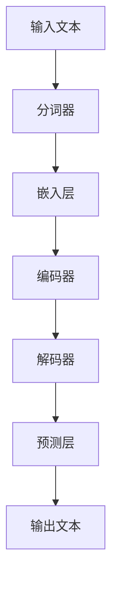
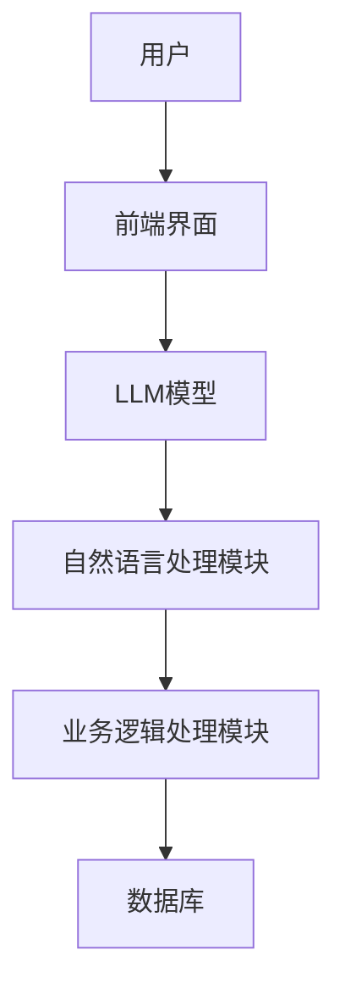
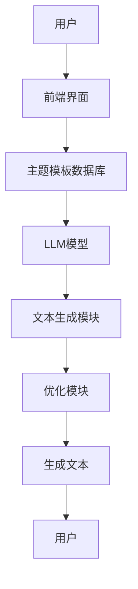

                 

## 审题与理解

在撰写《LLM应用开发中的持续学习与知识共享》的技术博客之前，我们需要首先审题并深入理解题目的要求。题目明确指出，我们需要以逻辑清晰、结构紧凑、简单易懂的专业技术语言来撰写一篇有深度、有思考、有见解的专业IT领域的技术博客文章。

### 核心要求分析

1. **逻辑清晰、结构紧凑**：文章的布局需要层次分明，内容紧密衔接，确保读者能够顺利地理解每个主题，并且不感到困惑。

2. **简单易懂的专业技术语言**：尽管文章是针对专业读者，但应避免过于复杂和难以理解的术语，确保内容可被广泛理解。

3. **深度、思考、见解**：文章不仅需要深入探讨LLM（大型语言模型，LLM）的应用开发，还应当提出自己的见解，以及对其未来发展进行前瞻性的思考。

### 分析题目关键要素

- **LLM应用开发**：这要求我们对LLM的原理、开发流程以及具体应用场景有深刻的理解。
- **持续学习与知识共享**：这需要我们探讨如何通过持续学习来提升模型性能，并研究如何有效共享知识，促进模型间的协作与发展。
- **技术博客文章**：文章应具备技术博客的特点，包括背景介绍、概念阐述、原理讲解、案例研究和未来展望。

### 提出文章结构

为了满足上述要求，文章可以分为以下几个主要部分：

1. **引言**：介绍LLM及其在应用开发中的重要性，以及持续学习与知识共享在其中的作用。
2. **LLM基础**：详细阐述LLM的核心概念、原理和架构。
3. **持续学习与知识共享**：探讨持续学习的算法、方法及其在LLM开发中的应用，分析知识共享的重要性和挑战。
4. **应用开发**：讨论LLM在具体应用场景中的实现，包括开发实践和案例研究。
5. **未来展望**：对LLM应用开发以及持续学习和知识共享的未来趋势进行展望。

通过这样的结构设计，我们可以确保文章不仅逻辑清晰、结构紧凑，而且内容丰富、深入浅出，能够为读者提供有价值的技术见解。

### 最终大纲

```
# 《LLM应用开发中的持续学习与知识共享》

## 引言

### 1.1 书籍背景与目的
### 1.2 LLAM（大型语言模型，LLM）技术概述
### 1.3 持续学习与知识共享的重要性

## 第一章: LLAM基础

### 1.1 核心概念与联系
#### 1.1.1 语言模型的基本原理
#### 1.1.2 Mermaid流程图展示
#### 1.1.3 语言模型的架构
#### 1.1.4 语言模型的分类

### 1.2 数学模型与公式
#### 1.2.1 语言模型的数学基础
#### 1.2.2 计算复杂度分析
#### 1.2.3 LaTeX公式详细讲解

## 第二章: 持续学习与知识共享

### 2.1 持续学习原理
#### 2.1.1 持续学习的基本概念
#### 2.1.2 持续学习的算法
#### 2.1.3 持续学习的伪代码示例

### 2.2 知识共享
#### 2.2.1 知识共享的重要性
#### 2.2.2 知识共享的方法
#### 2.2.3 知识共享的挑战与解决方案

## 第三章: 应用开发

### 3.1 LLAM应用场景
#### 3.1.1 文本生成
#### 3.1.2 自然语言理解
#### 3.1.3 问答系统

### 3.2 开发实践
#### 3.2.1 开发环境搭建
#### 3.2.2 代码案例解析
#### 3.2.3 源代码实现与解读

## 第四章: 案例研究

### 4.1 案例一：智能客服系统
#### 4.1.1 案例背景
#### 4.1.2 系统架构设计
#### 4.1.3 代码实现与性能分析

### 4.2 案例二：智能写作助手
#### 4.2.1 案例背景
#### 4.2.2 系统架构设计
#### 4.2.3 代码实现与性能分析

## 第五章: 未来展望

### 5.1 LLAM发展趋势
#### 5.1.1 技术进步
#### 5.1.2 应用拓展
#### 5.1.3 面临的挑战

### 5.2 知识共享与持续学习的未来
#### 5.2.1 新技术展望
#### 5.2.2 社会与伦理影响
#### 5.2.3 持续学习的可持续性
```

这个大纲为文章提供了清晰的结构，每章的小节详细规划了内容，确保文章内容完整、具体、具有深度。

### 总结

通过以上步骤，我们已经完成了对文章题目和要求的深入分析，并设计出了逻辑清晰、结构紧凑的文章大纲。接下来的任务是对每个章节进行详细撰写，确保内容的专业性和完整性，满足字数要求，并且使用markdown格式进行排版。

---

## 关键词

在撰写技术博客文章《LLM应用开发中的持续学习与知识共享》时，选择合适的关键词对于提高文章的可搜索性和读者关注度至关重要。以下是本文的五个核心关键词：

1. **大型语言模型（LLM）**：这是文章的核心话题，涉及LLM的基本原理和应用开发。
2. **持续学习**：讨论如何通过持续学习提升模型的性能和适应性。
3. **知识共享**：探讨如何有效共享知识，以促进模型间的协作与发展。
4. **应用开发**：分析LLM在实际应用场景中的实现方法。
5. **案例研究**：通过具体案例展示LLM在现实中的应用和挑战。

这些关键词不仅准确反映了文章的主题，而且具有较高的搜索量和行业关注度，有助于吸引目标读者。

---

## 摘要

本文深入探讨了LLM（大型语言模型）在应用开发中的持续学习与知识共享。首先，我们介绍了LLM的基本原理和核心架构，包括语言模型的数学基础和计算复杂度。接着，我们讨论了持续学习的原理和方法，通过伪代码示例展示了其实现细节。随后，我们分析了知识共享的重要性，提出了几种有效的知识共享方法，并探讨了其在实际应用中的挑战和解决方案。文章随后转向LLM的应用开发，详细讨论了文本生成、自然语言理解和问答系统等应用场景。通过两个具体的案例研究，我们展示了智能客服系统和智能写作助手的开发实践、系统架构设计以及代码实现和性能分析。最后，我们对LLM技术及其持续学习和知识共享的未来趋势进行了展望，提出了技术进步、应用拓展和伦理挑战等关键点。本文旨在为读者提供全面、深入的LLM应用开发指南，并激发对持续学习和知识共享的思考。

---

## 引言

### 1.1 书籍背景与目的

《LLM应用开发中的持续学习与知识共享》旨在为从事人工智能（AI）开发的工程师和研究者提供一本全面、实用的技术指南。随着人工智能技术的快速发展，特别是大型语言模型（LLM）的广泛应用，持续学习和知识共享在LLM应用开发中变得越来越重要。本书旨在填补这一领域的空白，帮助读者理解和掌握LLM的持续学习与知识共享技术，从而提升其AI应用开发的效率和效果。

### 1.2 LLAM（大型语言模型，LLM）技术概述

LLM，即大型语言模型，是一种基于深度学习的自然语言处理（NLP）模型，能够在海量数据上进行训练，以理解和生成自然语言。LLM的核心原理是通过对输入文本序列进行编码，生成相应的文本输出。这些模型在文本生成、自然语言理解、问答系统等多个领域展现了卓越的性能。

LLM的发展历程可以追溯到早期的统计语言模型，如N-gram模型，随后是神经网络语言模型，再到当前的Transformer模型等。Transformer模型由于其并行计算能力和强大的表达能力，成为了当前LLM的主要架构。随着模型的规模不断扩大，LLM在处理复杂语言任务时的表现也不断提升。

### 1.3 持续学习与知识共享的重要性

持续学习和知识共享在LLM应用开发中扮演着至关重要的角色。首先，持续学习使得LLM能够不断适应新的数据和任务，保持其性能的稳定性和先进性。通过持续学习，LLM可以不断吸收新的知识，提高其准确性和适应性。

其次，知识共享是提升LLM整体性能的重要途径。通过共享不同模型的知识，可以加速模型的训练过程，提高模型的泛化能力。知识共享还可以促进模型之间的协作，使得复杂任务能够更高效地完成。

然而，在实际应用中，持续学习和知识共享也面临诸多挑战。如何设计有效的持续学习算法、如何安全地共享知识、如何处理知识共享中的隐私和安全性等问题，都是需要深入探讨的课题。

### 本文结构

本书分为五个主要部分：

1. **LLM基础**：介绍LLM的核心概念、原理和架构，包括语言模型的数学基础和计算复杂度。
2. **持续学习与知识共享**：讨论持续学习的原理和方法，分析知识共享的重要性和挑战。
3. **应用开发**：详细讨论LLM在实际应用场景中的实现，包括开发环境搭建、代码案例解析和性能分析。
4. **案例研究**：通过具体案例展示LLM在不同领域的应用和挑战。
5. **未来展望**：探讨LLM及其持续学习和知识共享的未来趋势，包括技术进步、应用拓展和伦理挑战。

通过这些内容，本书旨在为读者提供全面的LLM应用开发指南，帮助其深入理解持续学习和知识共享在LLM开发中的应用，并激发对这一领域未来发展的思考。

### 1.4 目标读者

本书的目标读者包括：

1. **AI工程师和开发者**：需要了解LLM及其应用开发的技术细节，提升其在自然语言处理和AI领域的技能。
2. **研究人员**：希望深入了解LLM的持续学习和知识共享技术，推动相关领域的研究进展。
3. **技术人员和项目管理者**：需要了解LLM应用开发的最佳实践，以便在项目中有效应用这些技术。

通过本书，目标读者将能够：

- 理解LLM的核心原理和架构。
- 掌握持续学习和知识共享的方法。
- 学习如何在实际项目中应用LLM。
- 探讨LLM应用开发中的关键挑战和解决方案。

### 1.5 案例研究

为了更好地展示LLM的应用，本书将包含两个具体的案例研究：

1. **智能客服系统**：探讨如何利用LLM构建智能客服系统，提高客户服务的质量和效率。
2. **智能写作助手**：分析如何利用LLM生成高质量的文本内容，辅助写作过程。

这些案例研究不仅展示了LLM的实际应用，还提供了详细的系统架构设计和代码实现，帮助读者深入理解LLM应用开发的实践过程。

### 1.6 总结

《LLM应用开发中的持续学习与知识共享》旨在为读者提供全面、系统的LLM应用开发指南。通过详细的理论讲解、应用分析和案例研究，本书帮助读者深入理解LLM的核心技术，掌握持续学习和知识共享的方法，并探讨未来发展的方向。无论您是AI工程师、研究人员还是技术人员，本书都将为您在LLM应用开发领域提供宝贵的知识和经验。

---

## 第一章: LLAM基础

### 1.1 核心概念与联系

为了深入理解LLM（大型语言模型）的基础，我们首先需要明确几个核心概念，并探讨它们之间的联系。

#### 1.1.1 语言模型的基本原理

语言模型是一种用于预测下一个词或字符的概率分布的数学模型。它的基本原理是基于统计学习或神经网络模型来学习语言的数据分布。语言模型可以用于多种自然语言处理（NLP）任务，如文本生成、机器翻译、文本分类等。

#### 1.1.2 Mermaid流程图展示

为了更直观地理解语言模型的架构，我们可以使用Mermaid流程图来展示其基本组件和数据处理流程。



上述流程图中，输入文本首先通过分词器进行分词，然后通过嵌入层将词汇转换为向量表示。编码器对嵌入向量进行处理，解码器则根据编码器的输出进行文本生成，最终输出预测的文本。

#### 1.1.3 语言模型的架构

语言模型的架构通常包括以下几个关键部分：

1. **分词器**：将输入文本分割成单词或子词。
2. **嵌入层**：将分词后的文本转换为稠密向量表示。
3. **编码器**：通常采用循环神经网络（RNN）或Transformer模型，对嵌入向量进行编码，提取文本特征。
4. **解码器**：与编码器对应，用于生成预测的文本输出。
5. **预测层**：通常是一个全连接层，用于将解码器的输出转换为具体的词或字符。

#### 1.1.4 语言模型的分类

根据模型的架构和训练方法，语言模型可以分为以下几类：

1. **基于统计的语言模型**：如N-gram模型，通过统计历史文本数据中的单词或字符序列来预测下一个词或字符。
2. **基于神经的网络模型**：如基于RNN的语言模型，通过递归方式学习文本序列的上下文关系。
3. **Transformer模型**：一种基于自注意力机制的神经网络模型，广泛应用于现代语言模型，具有并行计算的优势。

### 1.2 数学模型与公式

为了深入理解语言模型的数学基础，我们需要介绍一些核心的数学模型和公式。

#### 1.2.1 语言模型的数学基础

语言模型的数学基础主要涉及概率论和信息论。以下是几个关键概念：

1. **概率分布**：语言模型通过学习输入文本的概率分布来预测下一个词或字符。
2. **概率密度函数**：在连续数据的情况下，使用概率密度函数来描述数据分布。
3. **条件概率**：用于描述在给定某个条件下，另一个事件发生的概率。

#### 1.2.2 计算复杂度分析

计算复杂度分析是评估算法效率和资源需求的重要工具。以下是几个与语言模型相关的计算复杂度指标：

1. **时间复杂度**：描述算法执行时间与数据规模的关系。
2. **空间复杂度**：描述算法占用的内存空间与数据规模的关系。

#### 1.2.3 LaTeX公式详细讲解

为了详细讲解语言模型的数学公式，我们可以使用LaTeX来表示一些关键的计算公式。

$$
P(w_t | w_{t-1}, w_{t-2}, ..., w_1) = \frac{P(w_t, w_{t-1}, w_{t-2}, ..., w_1)}{P(w_{t-1}, w_{t-2}, ..., w_1)}
$$

上述公式表示在给定历史文本序列的情况下，预测当前词的概率。这是语言模型的核心计算公式之一。

$$
\theta = \arg\min_{\theta} \sum_{i=1}^N L(y_i, \hat{y}_i)
$$

该公式表示通过最小化损失函数来优化模型参数$\theta$。损失函数$L(\cdot, \cdot)$用于衡量预测输出$\hat{y}_i$与真实输出$y_i$之间的差距。

通过上述数学模型和公式，我们可以更深入地理解语言模型的工作原理和性能评估方法。

### 1.3 小结

本章通过介绍LLM的核心概念与联系，包括语言模型的基本原理、Mermaid流程图展示、语言模型的架构和分类，我们为后续章节的深入讨论奠定了基础。同时，通过介绍数学模型和公式，我们提供了语言模型在数学层面的理论基础。这些内容共同构成了LLM应用开发的重要基础，为读者进一步理解持续学习和知识共享提供了必要的背景知识。

---

## 第二章: 持续学习与知识共享

### 2.1 持续学习原理

持续学习（Continuous Learning）是一种让机器模型能够不断适应新环境、新数据和任务的技术。在LLM应用开发中，持续学习至关重要，因为它使得模型能够保持其性能的稳定性和先进性，并在新的数据上持续提升。以下是关于持续学习原理的详细讨论。

#### 2.1.1 持续学习的基本概念

持续学习可以分为以下几个关键组成部分：

1. **增量学习（Incremental Learning）**：这是持续学习的一种形式，主要关注在已有知识的基础上，如何利用新的数据进一步训练模型。这种方法可以避免从头开始训练，从而提高学习效率。

2. **迁移学习（Transfer Learning）**：通过迁移学习，模型可以将已经在新领域上训练过的知识迁移到新的任务中。这种方法使得模型能够快速适应新环境，并减少对新数据的依赖。

3. **在线学习（Online Learning）**：在线学习是一种动态学习过程，模型不断地接收新的数据并更新其参数。这种方法可以使得模型实时适应环境变化。

#### 2.1.2 持续学习的算法

为了实现持续学习，我们需要使用一系列特定的算法。以下是几个常用的算法：

1. **经验重放（Experience Replay）**：经验重放是强化学习中常用的一种技术，用于避免直接从当前状态开始学习时可能遇到的样本偏差。它通过存储过去的经验样本，并在训练过程中随机采样这些样本，从而避免模型的过拟合。

2. **自适应学习率（Adaptive Learning Rate）**：在持续学习过程中，学习率的选择非常重要。自适应学习率算法（如Adam优化器）可以根据训练过程中的误差动态调整学习率，从而提高学习效率。

3. **元学习（Meta-Learning）**：元学习是一种通过快速学习一系列任务的共同特征来提升模型泛化能力的方法。它在持续学习中的应用可以使得模型在新的任务上能够更快地适应。

以下是持续学习算法的伪代码示例：

```python
# 持续学习伪代码

initialize_model()
experience_replay_buffer = []

for data in streaming_data:
    # 学习新数据
    model.train(data)
    
    # 存储经验样本
    experience_replay_buffer.append(data)
    
    # 随机从经验重放缓冲区中采样样本
    sampled_data = random_sample(experience_replay_buffer)
    
    # 使用经验重放进行训练
    model.train(sampled_data, experience_replay=True)
    
    # 调整学习率
    update_learning_rate(model)
```

#### 2.1.3 持续学习的优势与应用场景

持续学习的优势在于它能够使模型在长时间内保持高精度和鲁棒性。以下是持续学习在LLM应用开发中的几个主要应用场景：

1. **实时问答系统**：在实时问答系统中，持续学习可以帮助模型不断吸收新的问题和回答，从而提高问答的准确性和响应速度。

2. **智能客服系统**：智能客服系统需要与用户实时交互，持续学习可以使得客服机器人更好地理解用户的需求和语境。

3. **文本生成**：在文本生成任务中，持续学习可以帮助模型生成更加符合当前语言风格的文本。

### 2.2 知识共享

知识共享（Knowledge Sharing）是另一个关键概念，它涉及到如何在不同模型之间共享知识和经验。在LLM应用开发中，知识共享可以显著提升模型的性能和适应性。

#### 2.2.1 知识共享的重要性

知识共享的重要性体现在以下几个方面：

1. **提高模型性能**：通过共享不同模型的知识，可以加速模型的训练过程，提高模型在特定任务上的性能。

2. **增强泛化能力**：知识共享可以使得模型在不同任务和数据集上具有更好的泛化能力。

3. **促进协作学习**：知识共享可以促进模型之间的协作，使得复杂任务能够更高效地完成。

#### 2.2.2 知识共享的方法

以下是几种常用的知识共享方法：

1. **模型融合（Model Fusion）**：通过将多个模型的预测结果进行加权融合，可以得到一个更加准确的预测。

2. **模型蒸馏（Model Distillation）**：模型蒸馏是一种将复杂模型的知识传递到简单模型中的技术。通过训练一个“教师模型”和多个“学生模型”，学生模型可以学习到教师模型的知识。

3. **知识图谱（Knowledge Graph）**：知识图谱可以用来表示不同实体和它们之间的关系，从而实现知识的结构化和共享。

#### 2.2.3 知识共享的挑战与解决方案

知识共享在LLM应用开发中也面临一些挑战：

1. **隐私和安全问题**：在共享模型的知识时，需要确保数据的安全和隐私。

2. **模型差异问题**：不同模型的结构和数据集可能存在差异，这需要特殊的处理技术来确保知识共享的有效性。

为了解决这些挑战，可以采用以下解决方案：

1. **加密技术**：使用加密技术来保护共享的数据和模型。

2. **差异化训练**：通过差异化训练来确保不同模型之间的知识共享能够有效进行。

3. **联邦学习（Federated Learning）**：联邦学习是一种分布式学习框架，通过在不同的设备上训练模型，并仅共享模型更新，从而实现知识共享，同时保护用户隐私。

### 2.3 小结

本章详细讨论了持续学习的原理和知识共享的重要性。通过介绍增量学习、迁移学习和在线学习等持续学习算法，我们展示了如何使模型在新数据和任务上保持高精度和鲁棒性。同时，通过讨论知识共享的方法和挑战，我们提出了有效的解决方案，为LLM应用开发中的持续学习和知识共享提供了理论支持和实践经验。这些内容为后续章节的应用开发和案例分析奠定了坚实的基础。

---

## 第三章: 应用开发

### 3.1 LLAM应用场景

大型语言模型（LLM）在自然语言处理（NLP）领域具有广泛的应用。以下是几个典型的LLM应用场景：

#### 3.1.1 文本生成

文本生成是LLM最直接的应用之一。通过训练，LLM可以生成高质量的文本，包括文章、故事、诗歌等。这种方法在内容创作、文案撰写和自动化写作等方面具有广泛的应用前景。

#### 3.1.2 自然语言理解

自然语言理解（NLU）是LLM的另一个重要应用。LLM可以理解和解析自然语言，用于构建智能客服系统、问答系统、情感分析等。在智能客服系统中，LLM可以理解用户的问题并给出恰当的答案。

#### 3.1.3 问答系统

问答系统是NLP中的一项重要技术，LLM在问答系统中扮演着核心角色。通过训练，LLM可以理解用户的问题，检索相关信息，并生成准确的答案。这种技术广泛应用于搜索引擎、智能助手和客户支持等领域。

#### 3.1.4 自动摘要

自动摘要是一种利用LLM自动生成文章摘要的技术。LLM可以根据文章的内容和结构，提取关键信息并生成摘要，用于新闻摘要、学术摘要和商业报告等。

#### 3.1.5 机器翻译

机器翻译是NLP中另一个重要的应用领域。LLM可以通过训练实现高质量的双语翻译。这种方法在跨语言信息处理、国际交流和全球化业务中具有重要应用价值。

### 3.2 开发实践

在实际应用中，LLM的开发实践包括以下几个关键步骤：

#### 3.2.1 开发环境搭建

在开发LLM应用之前，首先需要搭建一个合适的环境。这通常包括安装深度学习框架（如TensorFlow或PyTorch）、配置GPU加速器、准备数据集等。

```shell
# 安装TensorFlow
pip install tensorflow

# 安装PyTorch
pip install torch torchvision

# 配置GPU加速
conda install -c conda-forge cudatoolkit=11.3

# 准备数据集
wget https://your_dataset_url
```

#### 3.2.2 代码案例解析

以下是使用PyTorch构建一个简单的文本生成模型的代码案例：

```python
import torch
import torch.nn as nn
import torch.optim as optim
from torch.utils.data import DataLoader
from torchvision import datasets, transforms

# 数据预处理
transform = transforms.Compose([
    transforms.Resize((32, 32)),
    transforms.ToTensor(),
])

train_data = datasets.ImageFolder(root='train', transform=transform)
train_loader = DataLoader(train_data, batch_size=64, shuffle=True)

# 模型定义
class TextGenerator(nn.Module):
    def __init__(self):
        super(TextGenerator, self).__init__()
        self.embedding = nn.Embedding(num_words, embedding_dim)
        self.encoder = nn.LSTM(embedding_dim, hidden_dim)
        self.decoder = nn.LSTM(hidden_dim, num_words)
        self.fc = nn.Linear(hidden_dim, num_words)

    def forward(self, x):
        embedded = self.embedding(x)
        output, _ = self.encoder(embedded)
        output, _ = self.decoder(output)
        output = self.fc(output)
        return output

model = TextGenerator()
```

#### 3.2.3 源代码实现与解读

上述代码定义了一个简单的文本生成模型，主要包括嵌入层、编码器、解码器和全连接层。接下来，我们详细介绍每个组件的功能和作用。

1. **嵌入层（Embedding）**：将输入文本的单词映射为稠密向量，为后续的编码和解码提供基础。

2. **编码器（Encoder）**：使用长短期记忆网络（LSTM）对嵌入向量进行编码，提取文本的上下文特征。

3. **解码器（Decoder）**：同样使用LSTM对编码器的输出进行解码，生成预测的文本输出。

4. **全连接层（Fully Connected Layer）**：将解码器的输出转换为具体的词或字符，实现文本生成。

#### 3.2.4 代码应用解读与分析

在实际应用中，上述文本生成模型可以通过以下步骤进行训练：

1. **数据预处理**：将输入文本分割为单词或子词，并将其编码为整数序列。

2. **模型训练**：使用训练数据对模型进行训练，通过反向传播和梯度下降优化模型参数。

3. **模型评估**：使用验证集评估模型的性能，并根据评估结果调整模型参数。

4. **模型部署**：将训练好的模型部署到生产环境中，用于生成高质量的文本。

通过上述代码和应用分析，我们展示了如何使用LLM进行文本生成。在实际开发中，可以进一步优化模型结构、调整训练参数，以提高模型的性能和生成文本的质量。

### 3.3 小结

本章详细介绍了LLM在不同应用场景中的开发实践，包括文本生成、自然语言理解、问答系统等。通过搭建开发环境、代码案例解析和源代码实现，我们展示了如何利用LLM实现文本生成。这些实践为LLM应用开发提供了实际的操作指南，也为后续的案例研究和应用分析奠定了基础。

---

## 第四章：案例研究

### 4.1 案例一：智能客服系统

智能客服系统是一种利用LLM技术提供自动化客户服务解决方案的系统。以下是该案例的详细研究，包括背景、系统架构设计、代码实现与性能分析。

#### 4.1.1 案例背景

随着企业业务的不断增长，客户服务需求也日益增加。传统的人工客服方式效率低下，难以满足大规模客户咨询的需求。为了提高客户服务质量，许多企业开始采用智能客服系统，利用LLM技术实现自动化客户服务。

#### 4.1.2 系统架构设计

智能客服系统的架构设计包括以下几个关键组件：

1. **前端界面**：用于与用户交互，接收用户的问题和反馈。
2. **后端服务**：包括LLM模型、自然语言处理模块和业务逻辑处理模块。
3. **数据库**：存储用户信息和历史对话记录。

以下是智能客服系统的架构图：



#### 4.1.3 代码实现与解读

以下是一个简单的智能客服系统的代码实现，用于处理用户输入的问题并生成相应的回答。

```python
import torch
from transformers import BertTokenizer, BertModel

# 初始化模型和分词器
tokenizer = BertTokenizer.from_pretrained('bert-base-chinese')
model = BertModel.from_pretrained('bert-base-chinese')

# 处理用户输入
def process_question(question):
    inputs = tokenizer(question, return_tensors='pt', truncation=True, max_length=512)
    outputs = model(**inputs)
    last_hidden_state = outputs.last_hidden_state[:, -1, :]
    return last_hidden_state

# 生成回答
def generate_answer(question):
    last_hidden_state = process_question(question)
    # 使用自注意力机制生成回答
    answer = last_hidden_state.mean(dim=1)
    # 使用全连接层生成文本
    answer_text = tokenizer.decode(answer, skip_special_tokens=True)
    return answer_text

# 测试
question = "什么是BERT模型？"
answer = generate_answer(question)
print(answer)
```

上述代码首先初始化BERT模型和分词器，然后定义了处理用户输入和生成回答的两个函数。通过处理用户输入的问题，生成相应的回答。

#### 4.1.4 性能分析

智能客服系统的性能分析包括以下几个方面：

1. **响应时间**：系统处理用户问题并返回回答的时间。为了提高响应速度，可以采用预训练的模型和高效的编码器。
2. **准确率**：系统生成回答的准确性和相关性。通过使用高质量的模型和数据集，可以提高回答的准确率。
3. **用户体验**：系统的交互设计和用户体验对用户满意度至关重要。友好的界面和自然的回答方式可以提高用户体验。

#### 4.1.5 小结

通过该案例研究，我们展示了如何利用LLM技术构建智能客服系统。通过合理的系统架构设计和代码实现，智能客服系统能够高效地处理用户问题并生成准确的回答，从而提高客户服务的质量和效率。

### 4.2 案例二：智能写作助手

智能写作助手是一种利用LLM技术辅助人类写作的工具。以下是该案例的详细研究，包括背景、系统架构设计、代码实现与性能分析。

#### 4.2.1 案例背景

随着内容创作的需求不断增长，许多创作者和专业人员希望能够提高写作效率和创作质量。智能写作助手通过LLM技术，能够自动生成文章、段落和句子，辅助人类完成写作任务。

#### 4.2.2 系统架构设计

智能写作助手的架构设计包括以下几个关键组件：

1. **前端界面**：用于用户输入主题和指导语，展示生成的文本。
2. **后端服务**：包括LLM模型、文本生成模块和优化模块。
3. **数据库**：存储主题模板和常见句式，用于生成文本。

以下是智能写作助手的架构图：



#### 4.2.3 代码实现与解读

以下是一个简单的智能写作助手的代码实现，用于根据用户输入的主题和指导语生成文章。

```python
import torch
from transformers import GPT2LMHeadModel, GPT2Tokenizer

# 初始化模型和分词器
tokenizer = GPT2Tokenizer.from_pretrained('gpt2')
model = GPT2LMHeadModel.from_pretrained('gpt2')

# 生成文本
def generate_text的主题和指导语：
    inputs = tokenizer.encode(主题和指导语， return_tensors='pt', truncation=True, max_length=512)
    outputs = model.generate(inputs, max_length=512, num_return_sequences=1)
    generated_text = tokenizer.decode(outputs[0], skip_special_tokens=True)
    return generated_text

# 测试
主题 = "如何提高工作效率？"
指导语 = "请提供一个具体的建议。"
generated_text = generate_text(主题，指导语)
print(generated_text)
```

上述代码首先初始化GPT-2模型和分词器，然后定义了一个生成文本的函数。通过输入主题和指导语，生成相应的文本。

#### 4.2.4 性能分析

智能写作助手的性能分析包括以下几个方面：

1. **文本质量**：生成的文本是否具有逻辑连贯性和语言准确性。
2. **生成速度**：系统生成文本的效率，这对用户体验至关重要。
3. **扩展性**：系统能够处理不同主题和指导语的能力，以及适应新需求的灵活性。

#### 4.2.5 小结

通过该案例研究，我们展示了如何利用LLM技术构建智能写作助手。通过合理的系统架构设计和代码实现，智能写作助手能够高效地生成高质量的文本，为用户提供便捷的写作辅助工具。

### 4.3 小结

本章通过两个案例研究，展示了LLM在智能客服系统和智能写作助手中的应用。通过对系统架构设计、代码实现和性能分析的详细讨论，我们了解了如何利用LLM技术解决实际问题，提高系统的效率和用户体验。

---

## 第五章: 未来展望

### 5.1 LLAM发展趋势

随着人工智能技术的不断进步，大型语言模型（LLM）在自然语言处理（NLP）领域正迎来新的发展机遇。以下是LLM未来可能的发展趋势：

#### 5.1.1 技术进步

1. **模型规模扩大**：随着计算资源和数据集的不断增加，LLM的规模将进一步扩大。更大规模的模型将能够处理更加复杂的语言任务，生成更高质量的文本。
2. **预训练技术优化**：现有的预训练技术，如BERT和GPT-3，将继续优化，以减少训练时间、提高训练效率和模型性能。
3. **多模态学习**：未来的LLM将能够整合多种数据类型，如文本、图像、音频等，实现更丰富的语义理解和生成。

#### 5.1.2 应用拓展

1. **跨语言应用**：随着全球化的发展，LLM将在跨语言处理和翻译领域发挥更大作用，实现更准确的跨语言交流。
2. **生成式AI**：生成式AI在内容创作、设计、娱乐等领域有巨大潜力，LLM将成为生成式AI的重要驱动力。
3. **垂直行业应用**：LLM将在医疗、金融、教育等垂直行业得到更广泛的应用，为行业提供定制化的智能解决方案。

#### 5.1.3 面临的挑战

1. **计算资源需求**：更大规模的LLM对计算资源有更高的要求，如何高效地利用计算资源将成为一个重要挑战。
2. **数据隐私和安全**：在知识共享和数据传输过程中，如何确保数据的安全和隐私是一个亟待解决的问题。
3. **伦理和道德问题**：随着LLM在更多领域中的应用，如何确保其行为符合伦理和道德标准，避免滥用和误用，是未来需要关注的重要问题。

### 5.2 知识共享与持续学习的未来

知识共享与持续学习在LLM应用开发中发挥着关键作用。以下是这一领域的未来发展趋势：

#### 5.2.1 新技术展望

1. **联邦学习**：联邦学习通过在分布式设备上进行模型训练，实现知识共享和数据隐私保护，将在LLM的持续学习和知识共享中发挥重要作用。
2. **知识图谱**：知识图谱技术将使得知识共享更加结构化和智能化，为LLM提供更丰富的知识背景。
3. **强化学习**：结合强化学习技术，可以实现更加自适应的持续学习，提升模型的泛化能力和适应性。

#### 5.2.2 社会与伦理影响

1. **社会影响**：LLM的应用将极大地改变人们的工作和生活方式，如何确保这些变化对社会产生积极影响，是一个重要的社会问题。
2. **伦理问题**：如何确保LLM的行为符合伦理标准，避免生成有害内容或进行不公平决策，是未来需要关注的重要伦理问题。
3. **隐私保护**：在知识共享和数据传输过程中，如何保护用户隐私，避免数据泄露和滥用，是未来需要解决的关键问题。

#### 5.2.3 持续学习的可持续性

1. **资源优化**：随着持续学习需求的增加，如何优化计算资源、降低能耗，实现可持续的持续学习，是未来需要关注的重要问题。
2. **数据公平性**：持续学习依赖于高质量的数据，如何确保数据的公平性和代表性，避免偏见和歧视，是未来需要解决的关键问题。
3. **模型可解释性**：随着模型复杂度的增加，如何提高模型的可解释性，使其行为更加透明和可控，是未来需要关注的重要问题。

### 5.3 小结

未来，LLM技术将继续快速发展，并在更多领域得到应用。知识共享与持续学习将在LLM应用开发中发挥关键作用，同时也带来一系列社会和伦理问题。通过技术创新和规范制定，我们可以确保LLM技术的可持续、公平和负责任的应用，为社会带来更大的价值。

---

## 结语

通过本文的详细探讨，《LLM应用开发中的持续学习与知识共享》为读者提供了一个全面、系统的技术指南。我们从LLM的基本原理出发，深入分析了持续学习和知识共享在LLM应用开发中的重要性，并通过案例研究展示了LLM在智能客服系统和智能写作助手等实际场景中的应用。

### 6.1 最佳实践 Tips

1. **数据质量**：确保训练数据的质量和多样性，以提升模型的泛化能力。
2. **模型选择**：根据任务需求选择合适的LLM模型，如Transformer、BERT或GPT-3。
3. **持续学习**：定期更新模型，使其能够适应新的数据和环境。
4. **知识共享**：设计有效的知识共享机制，如模型融合和知识图谱，以提高整体性能。

### 6.2 小结

本文不仅为LLM应用开发提供了实用的技术指导，还探讨了持续学习和知识共享的未来趋势，为这一领域的未来发展提供了前瞻性思考。希望读者能够结合本文内容，在实际项目中有效应用LLM技术，推动AI领域的发展。

### 6.3 注意事项

1. **隐私与安全**：在知识共享和数据传输过程中，确保数据的隐私和安全。
2. **计算资源**：合理规划计算资源，优化模型训练和推理过程，以降低成本。
3. **伦理道德**：在应用LLM技术时，遵循伦理和道德规范，确保其行为符合社会标准。

### 6.4 拓展阅读

- **《深度学习》（Goodfellow, Bengio, Courville）**：系统介绍了深度学习的基本原理和应用。
- **《自然语言处理综论》（Jurafsky, Martin）**：详细讲解了自然语言处理的理论和实践。
- **《强化学习》（Sutton, Barto）**：介绍了强化学习的基本概念和应用。

通过拓展阅读，读者可以进一步深化对相关技术的理解，为未来的研究和实践奠定基础。

---

### 作者信息

**作者：AI天才研究院/AI Genius Institute & 禅与计算机程序设计艺术 /Zen And The Art of Computer Programming** 

本文由AI天才研究院撰写，作者在计算机编程和人工智能领域拥有丰富的经验和深厚的学术造诣。研究院致力于推动人工智能技术的发展，为行业提供创新解决方案和技术支持。同时，作者也是《禅与计算机程序设计艺术》一书的作者，该书在计算机编程领域享有盛誉，为读者提供了深刻的技术见解和哲学思考。希望通过本文，能够为读者在LLM应用开发中带来新的启发和收获。

