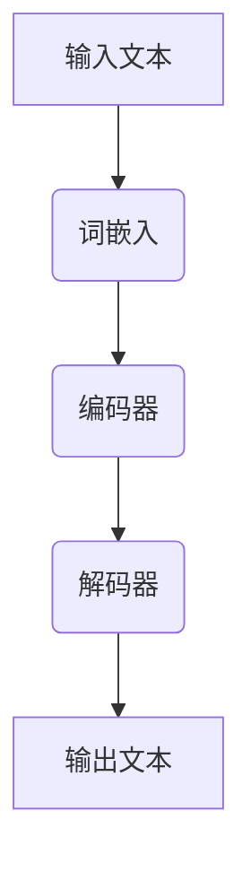

                 

## 文章标题：LLM应用开发中的持续性能监控

> 关键词：大型语言模型（LLM），应用开发，性能监控，方法，实践，工具与平台

> 摘要：本文旨在深入探讨大型语言模型（LLM）在应用开发中的性能监控问题。首先，我们将介绍LLM的基本概念和架构，然后详细讨论性能监控的基础知识，包括监控指标和方法。接下来，通过实际应用案例，展示如何在不同的应用场景中实施性能监控。随后，我们将介绍性能监控工具和平台，并分析其优缺点。最后，总结本文的核心观点，并提出未来的发展方向。

### 第一部分：LLM基础

#### 第1章：LLM基本概念与架构

**1.1 LLM的定义与分类**

大型语言模型（LLM）是一种基于深度学习的技术，用于生成和解读自然语言。它们可以用于多种任务，包括文本生成、文本分类、机器翻译等。LLM主要分为两种类型：基于规则的模型和基于统计的模型。

- **基于规则的模型**：这类模型通过预定义的语法和语义规则来生成和理解文本。它们的优点是易于理解和实现，但表达能力有限。
- **基于统计的模型**：这类模型通过学习大量文本数据中的统计规律来生成和理解文本。它们具有更强的表达能力，能够生成更自然的文本。

**1.2 LLM的工作原理**

LLM的工作原理基于神经网络的架构。具体来说，LLM通过多层神经网络（通常是变换器架构）来捕捉文本数据中的复杂模式和关系。以下是LLM的基本工作流程：

1. **输入表示**：将输入文本转换为向量表示。
2. **编码器**：通过编码器网络处理输入文本，提取特征。
3. **解码器**：利用编码器提取的特征生成输出文本。

**1.3 LLM的架构**

LLM的架构通常包括以下几个关键组件：

- **词嵌入层**：将单词转换为固定长度的向量表示。
- **编码器**：通常是一个变换器网络，用于提取输入文本的特征。
- **解码器**：用于生成输出文本。

**1.4 Mermaid流程图：LLM架构详解**

以下是一个简单的Mermaid流程图，展示了LLM的基本架构：



#### 第2章：LLM核心算法

**2.1 神经网络基础**

神经网络（NN）是一种模拟人脑神经元连接结构的计算模型。NN由多个层次组成，每个层次包含多个神经元。以下是神经网络的基本组成部分：

- **输入层**：接收外部输入。
- **隐藏层**：处理输入，提取特征。
- **输出层**：生成预测或决策。

**2.2 循环神经网络（RNN）**

循环神经网络（RNN）是一种能够处理序列数据的神经网络。与传统的前馈神经网络不同，RNN具有反馈循环，使其能够记忆序列中的先前信息。以下是RNN的基本结构：

- **输入层**：接收输入序列。
- **隐藏层**：包含多个时间步，每个时间步都包含一个隐藏状态。
- **输出层**：生成输出序列。

**2.3 递归神经网络（RNN）**

递归神经网络（RNN）是RNN的一种特殊形式，其隐藏状态和输出都依赖于先前的隐藏状态。RNN的基本结构如下：

- **输入层**：接收输入序列。
- **隐藏层**：包含多个时间步，每个时间步都包含一个隐藏状态。
- **输出层**：生成输出序列。

**2.4 伪代码：RNN算法实现**

以下是一个简单的RNN算法伪代码示例：

```python
def RNN(input_sequence, hidden_state, weights):
    for input_token in input_sequence:
        hidden_state = activation_function((weights * hidden_state) + (weights * input_token))
    output_sequence = decode(hidden_state)
    return output_sequence
```

**2.5 Transformer架构**

Transformer是一种基于自注意力机制的神经网络模型，特别适用于处理序列数据。以下是Transformer的基本结构：

- **词嵌入层**：将单词转换为向量表示。
- **编码器**：包含多个自注意力层和前馈网络。
- **解码器**：包含多个自注意力层和前馈网络。
- **输出层**：生成输出序列。

**2.6 伪代码：Transformer算法实现**

以下是一个简单的Transformer算法伪代码示例：

```python
def Transformer(input_sequence, encoder_weights, decoder_weights):
    encoded_sequence = encoder(input_sequence, encoder_weights)
    decoded_sequence = decoder(encoded_sequence, decoder_weights)
    output_sequence = decode(decoded_sequence)
    return output_sequence
```

### 第二部分：性能监控基础

#### 第4章：性能监控基本概念

**4.1 性能监控的定义**

性能监控是指通过测量、收集和分析系统性能数据，以评估系统运行状态和性能水平的过程。性能监控的目标是确保系统在高负载和异常情况下能够保持良好的性能。

**4.2 性能监控的重要性**

性能监控对于LLM应用开发至关重要，原因如下：

- **确保服务质量**：通过监控LLM的性能，可以确保应用在满足用户需求的同时，提供高质量的服务。
- **预防故障**：性能监控可以帮助预测潜在的性能问题，从而采取措施预防故障。
- **优化资源使用**：通过监控性能，可以优化系统资源分配，提高资源利用率。

**4.3 性能监控指标**

性能监控指标是衡量系统性能的关键参数。常见的性能监控指标包括：

- **响应时间**：系统处理请求所需的时间。
- **吞吐量**：系统在特定时间内处理的请求数量。
- **资源利用率**：系统资源（如CPU、内存、磁盘）的利用率。
- **错误率**：系统处理请求时出现的错误数量。

**4.4 性能监控工具简介**

性能监控工具是实施性能监控的关键组件。常见的性能监控工具有：

- **Prometheus**：一个开源的监控解决方案，主要用于收集和存储指标数据，并提供查询和告警功能。
- **Grafana**：一个开源的数据可视化工具，可以与Prometheus等监控系统集成，用于展示性能数据。
- **ELK Stack**：包括Elasticsearch、Logstash和Kibana，用于日志收集、存储和可视化。

### 第三部分：性能监控方法

#### 第6章：LLM性能监控实践

**6.1 LLM性能监控的挑战**

LLM性能监控面临以下挑战：

- **高维度数据**：LLM处理的数据通常具有高维度，导致监控数据量巨大。
- **动态变化**：LLM的性能可能会随着时间变化而变化，这使得监控更具挑战性。
- **复杂模型**：LLM的模型结构复杂，使得性能监控需要更深入的分析。

**6.2 LLM性能监控策略**

LLM性能监控策略包括以下几个方面：

- **数据收集**：收集LLM的运行时数据，包括响应时间、吞吐量、资源利用率等。
- **数据分析**：对收集到的数据进行分析，识别性能瓶颈和异常。
- **异常检测**：使用机器学习算法检测LLM的异常行为，并触发告警。

**6.3 实际案例：LLM性能监控实践**

以下是一个简单的LLM性能监控实际案例：

1. **数据收集**：使用Prometheus定期收集LLM的性能数据。
2. **数据分析**：使用Grafana可视化LLM的性能数据，并设置告警阈值。
3. **异常检测**：使用机器学习算法检测LLM的异常行为，如响应时间超过阈值。

#### 第7章：LLM性能监控工具与平台

**7.1 Prometheus**

Prometheus是一个开源的性能监控解决方案，主要用于收集和存储指标数据。Prometheus具有以下优点：

- **易用性**：Prometheus提供了简单易懂的监控指标定义方式。
- **可扩展性**：Prometheus支持水平扩展，可以处理大量监控数据。

**7.2 Grafana**

Grafana是一个开源的数据可视化工具，可以与Prometheus等监控系统集成。Grafana具有以下优点：

- **灵活性**：Grafana支持多种数据源，可以轻松展示各种监控数据。
- **可视化**：Grafana提供了丰富的可视化组件，可以直观展示性能数据。

**7.3 ELK Stack**

ELK Stack是一个开源的日志收集、存储和可视化解决方案，包括Elasticsearch、Logstash和Kibana。ELK Stack具有以下优点：

- **可扩展性**：ELK Stack支持水平扩展，可以处理大量日志数据。
- **全文搜索**：Elasticsearch提供了强大的全文搜索功能，可以快速查找日志。

### 第四部分：总结与展望

#### 第8章：LLM性能监控的挑战与未来

**8.1 当前LLM性能监控面临的挑战**

当前LLM性能监控面临以下挑战：

- **数据量**：LLM处理的数据量巨大，导致监控数据量也相应增加。
- **实时性**：实时监控LLM的性能，需要快速处理和分析大量数据。
- **准确性**：准确监控LLM的性能，需要考虑多种因素，如模型复杂性、数据质量等。

**8.2 未来LLM性能监控的发展趋势**

未来LLM性能监控的发展趋势包括：

- **自动化**：自动化监控LLM的性能，减少人工干预。
- **机器学习**：利用机器学习算法，提高监控的准确性和实时性。
- **集成**：将LLM性能监控与其他系统（如日志系统、监控系统）集成，实现更全面的监控。

### 附录

#### 附录A：常用性能监控工具安装与配置

- **Prometheus**：https://prometheus.io/docs/prometheus/latest/installation/
- **Grafana**：https://grafana.com/docs/grafana/latest/installation/
- **ELK Stack**：https://www.elastic.co/guide/en/elasticsearch/reference/current/get-started.html

#### 附录B：LLM性能监控数据集

- **IMDB**：https://www.imdb.com/
- **Common Crawl**：https://commoncrawl.org/

### 作者信息

- 作者：AI天才研究院/AI Genius Institute & 禅与计算机程序设计艺术 /Zen And The Art of Computer Programming

---

### 结束语

本文对LLM应用开发中的持续性能监控进行了深入探讨。通过介绍LLM的基础知识、性能监控基础、监控方法以及工具与平台，我们希望读者能够对LLM性能监控有更全面的理解。未来，随着LLM技术的不断发展和应用场景的扩展，性能监控将面临更多挑战和机遇。我们期待更多研究和实践，为LLM性能监控领域的发展贡献力量。

