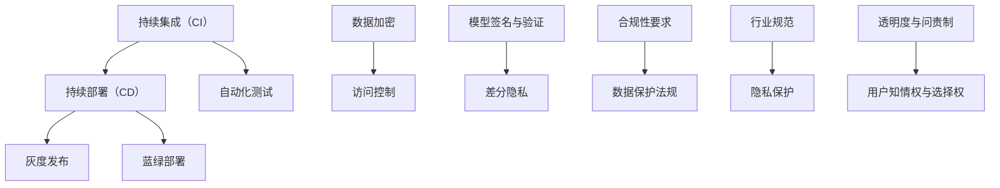

                 

### 文章标题

《LLM应用开发中的持续部署实践》

持续部署（Continuous Deployment，简称CD）是现代软件开发中不可或缺的一部分，它极大地提高了软件交付的效率和可靠性。随着大型语言模型（Large Language Model，简称LLM）的兴起，如何将其应用于持续部署成为了一个热门话题。本文将深入探讨LLM应用开发中的持续部署实践，包括背景介绍、核心概念与联系、核心算法原理讲解、项目实战以及最佳实践等。

本文旨在为软件开发者、架构师以及CTO等读者提供一个全面、深入且实用的指南，帮助他们在LLM应用开发中实施高效的持续部署策略。文章结构如下：

1. **引言和概述**：介绍LLM与持续部署的背景，明确文章的核心内容和结构。
2. **LLM基础**：讲解LLM的核心概念、工作原理及其应用领域。
3. **持续集成与持续部署（CI/CD）原理**：介绍CI/CD的基本概念、流程和自动化测试。
4. **实践案例分析**：通过实际案例，展示LLM应用部署的实践过程。
5. **架构设计与工具**：讨论LLM架构设计原则、CI/CD工具选型和部署策略。
6. **安全性与合规性**：分析数据安全、模型安全及合规性的要求。
7. **总结与展望**：总结全文，展望持续部署在LLM应用开发中的未来趋势。

通过本文的阅读，读者将能够系统地理解LLM应用开发中的持续部署实践，掌握关键技术和方法，从而提高开发效率和软件质量。

### 文章关键词

- **LLM**：大型语言模型
- **持续部署（CD）**：Continuous Deployment
- **持续集成与持续部署（CI/CD）**：Continuous Integration / Continuous Deployment
- **自动化测试**：Automated Testing
- **架构设计**：Architecture Design
- **数据安全**：Data Security
- **模型安全**：Model Security
- **合规性**：Compliance

### 文章摘要

本文深入探讨了LLM应用开发中的持续部署实践。首先，介绍了LLM的基本概念和工作原理，随后讲解了CI/CD的核心概念和流程。通过实际案例分析，读者可以了解LLM应用部署的具体实践过程。接着，文章讨论了LLM架构设计原则和工具选型，并强调了数据安全、模型安全和合规性的重要性。最后，文章总结了全文，展望了持续部署在LLM应用开发中的未来趋势。本文旨在为开发者提供一份全面、实用的指南，帮助他们高效地实施持续部署策略。

## 引言和概述

### 背景介绍

随着人工智能技术的飞速发展，大型语言模型（LLM）已经成为自然语言处理领域的重要工具。LLM通过学习海量文本数据，可以生成高质量的文本、执行复杂的任务、回答问题等，其应用范围广泛，从文本生成、机器翻译、问答系统到智能客服等。然而，LLM的巨大规模和复杂性带来了新的挑战，尤其是如何在开发过程中实现高效、可靠的持续部署（Continuous Deployment，简称CD）。持续部署是一种自动化的软件发布过程，旨在快速、安全地将新功能和修复推向生产环境。它不仅提高了开发效率，还保证了软件质量的稳定性。

在传统的软件开发过程中，持续部署通常面临以下挑战：

1. **复杂性**：LLM模型通常由数百万个参数组成，部署过程需要处理大量的数据和计算资源。
2. **数据依赖**：LLM训练和部署过程中依赖的数据集可能非常大，如何确保数据的一致性和完整性是一个重要问题。
3. **测试困难**：LLM的输出质量难以用传统的自动化测试方法进行评估，如何进行有效的测试和验证是一个难题。
4. **安全性和合规性**：LLM的应用涉及到大量的敏感数据，如何确保数据的安全性和模型的合规性是一个重要课题。

### 核心概念与联系

为了解决上述挑战，我们需要了解几个关键概念，并探讨它们之间的关系。

#### 持续集成（CI）

持续集成（Continuous Integration，简称CI）是一种软件开发实践，旨在通过频繁地将代码更改集成到一个共享的主干分支中，快速发现和解决集成中的问题。CI的目标是确保代码库始终处于可运行状态，从而减少集成和部署过程中出现问题的风险。

#### 持续部署（CD）

持续部署（Continuous Deployment，简称CD）是CI的延伸，它通过自动化的方式将经过CI验证的代码直接部署到生产环境中。CD的目标是尽可能快地将新功能和安全修复推向用户，同时保持系统的稳定性和可靠性。

#### 自动化测试

自动化测试是持续集成和持续部署的核心环节，它通过自动化脚本和工具来测试代码的功能、性能和安全性。自动化测试不仅提高了测试效率，还确保了测试的全面性和一致性。

#### 架构设计

在LLM应用开发中，架构设计至关重要。一个良好的架构可以确保系统的可扩展性、可靠性和安全性。在持续部署的背景下，我们需要关注以下几个方面：

1. **模块化**：将系统划分为多个模块，每个模块负责特定的功能，这样可以降低系统的复杂度，便于管理和维护。
2. **分布式部署**：将LLM模型和应用程序部署到多个节点上，利用分布式计算能力提高系统的处理能力和容错能力。
3. **高可用性**：设计冗余和故障转移机制，确保系统在发生故障时能够快速恢复。
4. **安全性**：实现严格的安全策略，包括数据加密、访问控制和审计日志等。

#### 数据安全与合规性

数据安全和合规性是LLM应用部署的重要方面。我们需要关注以下几个方面：

1. **数据加密**：对敏感数据进行加密处理，确保数据在传输和存储过程中的安全性。
2. **访问控制**：实施严格的访问控制策略，确保只有授权用户可以访问敏感数据和系统资源。
3. **合规性审计**：确保系统的设计和运营符合相关的法律法规和行业规范。

### 总结

通过上述介绍，我们可以看到，LLM应用开发中的持续部署涉及多个关键概念和领域，包括CI/CD、自动化测试、架构设计、数据安全与合规性等。这些概念之间相互关联，共同构成了一个完整的持续部署体系。在接下来的章节中，我们将深入探讨这些概念，并分享具体的实践经验和最佳方法。

## LLM基础

### 核心概念

大型语言模型（LLM）是一种基于深度学习的自然语言处理模型，能够理解和生成人类语言。与传统的规则驱动方法相比，LLM具有更强的灵活性和泛化能力，能够处理复杂的语言结构和语境。LLM的核心概念包括以下几个方面：

1. **神经网络架构**：LLM通常基于深度神经网络（DNN）或变换器模型（Transformer），后者由于其并行计算能力和全局注意力机制，被广泛应用于LLM的构建。

2. **预训练与微调**：预训练是指使用大规模的未标注数据对模型进行训练，使其具备基本的语言理解和生成能力。微调是在预训练基础上，使用特定领域的数据对模型进行进一步训练，以提高其在特定任务上的表现。

3. **数据集**：LLM的训练依赖于大规模的文本数据集。这些数据集通常包含多种语言、风格和领域，以使模型具备广泛的语言理解能力。

4. **语言理解与生成**：LLM能够理解自然语言的语义和结构，生成符合语法和语义规则的自然语言文本。

### 工作原理

LLM的工作原理主要可以分为以下几个步骤：

1. **输入处理**：将输入的文本序列转换为模型可以处理的向量表示。这一过程通常涉及到词嵌入（Word Embedding）和位置编码（Positional Encoding）。

2. **模型计算**：将输入向量传递到模型中，通过多层神经网络或变换器模型进行计算。在变换器模型中，输入序列会经过自注意力机制（Self-Attention）和前馈神经网络（Feedforward Neural Network），生成高维的上下文向量。

3. **输出生成**：模型根据上下文向量生成输出文本。在生成过程中，模型会使用逐词生成（Token-by-Token Generation）或序列到序列（Seq2Seq）生成方法，逐步生成每个单词或字符。

4. **优化与训练**：通过反向传播算法（Backpropagation）和梯度下降（Gradient Descent）等方法，对模型进行优化和训练，以提高其在各种自然语言任务上的表现。

### 应用领域

LLM在多个应用领域具有广泛的应用，包括：

1. **文本生成**：生成文章、摘要、对话、代码等文本内容。

2. **机器翻译**：将一种语言的文本翻译成另一种语言。

3. **问答系统**：回答用户提出的问题，提供准确的答案。

4. **智能客服**：模拟人类客服，处理客户咨询和投诉。

5. **文本分类与情感分析**：对文本进行分类和情感分析，如新闻分类、用户评论分析等。

6. **语音助手**：如苹果的Siri、亚马逊的Alexa等，提供语音交互和智能服务。

通过以上介绍，我们可以看到，LLM作为一种强大的自然语言处理工具，具有广泛的应用前景。在接下来的章节中，我们将进一步探讨如何将LLM应用于持续部署，并分享实际案例和最佳实践。

### 持续集成与持续部署（CI/CD）原理

#### 持续集成（CI）的基本概念

持续集成（Continuous Integration，简称CI）是一种软件开发实践，旨在通过频繁地将代码更改集成到一个共享的主干分支中，快速发现和解决集成中的问题。其核心思想是将开发过程中的每个代码提交都集成到主干分支，并自动执行一系列的测试和构建任务，以确保代码库始终处于可运行状态。

持续集成的关键目标包括：

1. **快速反馈**：通过自动化的测试和构建，快速发现代码中的错误和问题，提供即时的反馈。
2. **减少集成风险**：通过频繁的小规模集成，将集成过程中的风险分散到每次提交中，减少大集成时的风险。
3. **提高代码质量**：持续集成促使开发人员更频繁地提交代码，并确保每次提交都是可测试的，从而提高代码的整体质量。

#### 持续部署（CD）的基本概念

持续部署（Continuous Deployment，简称CD）是持续集成（CI）的延伸，它通过自动化的方式将经过CI验证的代码直接部署到生产环境中。持续部署的目标是尽可能快地将新功能和安全修复推向用户，同时保持系统的稳定性和可靠性。

持续部署的关键目标包括：

1. **快速交付**：通过自动化的部署流程，将新功能和安全修复快速推向用户，提高开发效率和用户满意度。
2. **减少人工干预**：自动化部署流程减少了对人工的依赖，降低了部署过程中出现人为错误的风险。
3. **保持系统稳定性**：通过灰度发布、蓝绿部署等技术，确保系统在部署过程中保持高可用性和稳定性。

#### CI/CD的工作流程

CI/CD的工作流程通常包括以下几个步骤：

1. **代码提交**：开发人员将代码更改提交到版本控制系统中。

2. **构建和测试**：CI工具自动构建代码，并运行一系列的测试脚本，包括单元测试、集成测试和性能测试等。

3. **反馈与报告**：测试结果会被反馈给开发人员，包括通过或失败的测试、错误日志等。

4. **失败处理**：如果测试失败，CI工具会通知开发人员，并标记提交为失败，阻止代码合并到主干分支。

5. **代码合并**：如果测试通过，CI工具会将代码合并到主干分支。

6. **部署**：经过CI验证的代码会被自动部署到预生产或生产环境中。

7. **监控与反馈**：系统会持续监控部署后的运行状态，并在出现问题时及时通知相关人员。

#### 自动化测试

自动化测试是CI/CD流程中的核心环节，它通过自动化脚本和工具来执行一系列测试任务，确保代码的质量和功能完整性。自动化测试的类型包括：

1. **单元测试**：对单个模块或函数进行测试，确保其正确执行。

2. **集成测试**：对多个模块或组件进行测试，验证它们之间的接口和交互。

3. **性能测试**：评估系统的性能，包括响应时间、吞吐量和资源消耗等。

4. **安全性测试**：检测系统的安全漏洞和潜在风险。

自动化测试的优势包括：

1. **提高测试效率**：自动化测试可以快速、重复地执行，大大提高了测试的覆盖率和速度。

2. **减少人为错误**：通过自动化测试，减少了手动测试中的疏忽和错误。

3. **确保一致性**：自动化测试确保每次测试结果的一致性，不受人为因素的影响。

#### 管道化部署

管道化部署是CI/CD的重要实现方式，它通过将部署过程分解为多个阶段和任务，实现自动化和流水线化的部署流程。常见的部署管道包括以下阶段：

1. **构建阶段**：构建代码和依赖项，生成可执行文件或容器镜像。

2. **测试阶段**：执行自动化测试，验证代码的功能和质量。

3. **打包阶段**：将经过测试的代码打包，生成可用于部署的文件或镜像。

4. **部署阶段**：将打包的文件或镜像部署到目标环境中，包括容器化部署、虚拟机部署等。

管道化部署的优势包括：

1. **提高部署速度**：通过流水线化的部署流程，加快了新功能的交付速度。

2. **降低部署风险**：通过自动化测试和部署，减少了部署过程中的错误和风险。

3. **增强可扩展性**：管道化部署支持大规模的并行部署，提高了系统的可扩展性。

### 总结

持续集成与持续部署（CI/CD）是现代软件开发中不可或缺的部分，它通过自动化和流水线化的方式，提高了开发效率和软件质量。在本章节中，我们介绍了CI/CD的基本概念、工作流程、自动化测试和管道化部署。在接下来的章节中，我们将通过实际案例，深入探讨LLM应用部署中的CI/CD实践。

## 实践案例分析

在本章节中，我们将通过三个实际案例，详细探讨LLM应用部署中的持续集成与持续部署实践。这些案例涵盖了不同类型的LLM应用，包括文本生成、机器翻译和智能客服，旨在展示如何在不同场景下实施CI/CD策略，确保高效、可靠的LLM应用交付。

### 案例一：某企业文本生成应用的持续部署实践

某知名企业开发了一款基于LLM的文本生成应用，旨在自动生成产品描述、新闻稿和营销文案。该应用的核心是训练一个大规模的预训练模型，并通过微调适应特定领域的文本生成任务。

#### 开发环境搭建

在开始部署前，企业首先搭建了稳定、高效的开发环境，包括：

1. **硬件资源**：部署了多个高性能服务器，用于模型训练和部署。
2. **软件环境**：安装了深度学习框架（如TensorFlow或PyTorch）、版本控制系统（如Git）和CI/CD工具（如Jenkins）。
3. **数据集**：收集并预处理了大规模的文本数据集，包括产品描述、新闻稿和营销文案等。

#### 持续集成

企业采用Jenkins作为CI工具，实现了以下CI流程：

1. **代码提交**：开发人员将代码提交到Git仓库。
2. **代码构建**：Jenkins自动从Git仓库拉取最新代码，并构建模型。
3. **自动化测试**：运行一系列的单元测试、集成测试和性能测试，确保模型的质量。
4. **反馈与报告**：测试结果通过邮件或即时通讯工具通知开发人员。

#### 持续部署

在CI流程成功后，企业采用以下CD策略：

1. **预生产环境部署**：将经过CI验证的模型部署到预生产环境，进行灰度发布。
2. **监控与反馈**：监控预生产环境的运行状态，包括模型性能和系统负载。
3. **正式发布**：在确认预生产环境稳定后，将模型正式部署到生产环境。

#### 代码实现与解读

以下是一个简化版的Jenkinsfile，用于实现上述CI/CD流程：

```groovy
pipeline {
    agent any
    stages {
        stage('Build') {
            steps {
                sh 'git clone https://github.com/your-repo.git'
                sh 'bash build.sh'
            }
        }
        stage('Test') {
            steps {
                sh 'python test.py'
            }
        }
        stage('Deploy') {
            steps {
                sh 'bash deploy.sh'
            }
        }
    }
}
```

在`build.sh`脚本中，执行模型的构建和测试：

```bash
#!/bin/bash
python train.py
python test.py
```

在`deploy.sh`脚本中，执行模型的部署：

```bash
#!/bin/bash
scp model.tar.gz user@preprod-server:/path/to/preprod
scp deploy.py user@preprod-server:/path/to/preprod
ssh user@preprod-server "python deploy.py"
```

#### 代码应用解读与分析

以上代码示例展示了如何使用Jenkins实现CI/CD流程。`Jenkinsfile`定义了一个管道，包括构建、测试和部署三个阶段。每个阶段都通过命令行脚本执行相应的任务。通过这种方式，企业能够确保每次代码提交后，模型都会经过全面的测试和部署，从而提高软件质量。

### 案例二：某平台机器翻译服务的持续部署实践

某在线翻译平台开发了基于LLM的机器翻译服务，支持多种语言之间的文本翻译。该平台的目标是提供高效、准确的翻译服务，并支持实时更新和扩展。

#### 开发环境搭建

平台采用了分布式架构，包括多个处理节点和存储节点，以提高系统的处理能力和容错性。具体环境搭建包括：

1. **硬件资源**：部署了多个分布式服务器，用于处理翻译请求。
2. **软件环境**：安装了分布式计算框架（如Apache Mesos）和容器化工具（如Docker）。
3. **数据集**：收集并预处理了大规模的机器翻译数据集，包括多种语言的双语语料库。

#### 持续集成

平台采用GitLab CI作为CI工具，实现了以下CI流程：

1. **代码提交**：开发人员将代码提交到GitLab仓库。
2. **代码构建**：GitLab CI自动从Git仓库拉取最新代码，并构建翻译模型。
3. **自动化测试**：运行一系列的单元测试、集成测试和性能测试，确保模型的质量。
4. **反馈与报告**：测试结果通过GitLab UI实时展示。

#### 持续部署

在CI流程成功后，平台采用以下CD策略：

1. **容器化部署**：将翻译模型和应用程序容器化，以便于在分布式环境中部署。
2. **自动化部署**：使用Kubernetes进行容器编排，实现自动部署和扩展。
3. **灰度发布**：通过Kubernetes的滚动更新（Rolling Update）策略，实现灰度发布，确保系统稳定。

#### 代码实现与解读

以下是一个简化版的GitLab CI配置文件，用于实现CI/CD流程：

```yaml
stages:
  - build
  - test
  - deploy

build:
  stage: build
  script:
    - docker build -t translation-model .
    - docker build -t translation-app .

test:
  stage: test
  script:
    - docker run --rm translation-model test.py

deploy:
  stage: deploy
  script:
    - docker push translation-model
    - docker push translation-app
    - kubectl apply -f deployment.yaml
```

在`deployment.yaml`文件中，定义了翻译服务的Kubernetes部署配置：

```yaml
apiVersion: apps/v1
kind: Deployment
metadata:
  name: translation-service
spec:
  replicas: 3
  selector:
    matchLabels:
      app: translation
  template:
    metadata:
      labels:
        app: translation
    spec:
      containers:
      - name: translation-model
        image: translation-model:latest
        ports:
        - containerPort: 8080
      - name: translation-app
        image: translation-app:latest
        ports:
        - containerPort: 8081
```

#### 代码应用解读与分析

以上代码示例展示了如何使用GitLab CI和Kubernetes实现CI/CD流程。通过容器化和Kubernetes编排，平台能够实现高效、可扩展的机器翻译服务。GitLab CI负责代码构建和自动化测试，确保模型的稳定性和准确性。Kubernetes则负责容器的部署和管理，通过滚动更新策略实现系统的平滑升级。

### 案例三：某智能客服系统的持续部署实践

某电商公司开发了基于LLM的智能客服系统，用于自动回复用户咨询、处理投诉等。该系统旨在提高客服效率，减少人工成本，并提升用户体验。

#### 开发环境搭建

智能客服系统采用了云计算架构，包括云服务器、云数据库和云存储等。具体环境搭建包括：

1. **硬件资源**：使用云服务提供商的资源，根据需求动态调整。
2. **软件环境**：安装了自然语言处理框架（如spaCy）、Web框架（如Flask）和CI/CD工具（如AWS CodePipeline）。
3. **数据集**：收集并预处理了大量的用户咨询数据和常见问题，用于训练和优化LLM模型。

#### 持续集成

公司采用AWS CodePipeline作为CI工具，实现了以下CI流程：

1. **代码提交**：开发人员将代码提交到AWS CodeCommit仓库。
2. **代码构建**：AWS CodePipeline自动从仓库拉取最新代码，并构建Web应用程序。
3. **自动化测试**：运行一系列的单元测试和集成测试，确保应用程序的功能和性能。
4. **反馈与报告**：测试结果通过SNS通知开发人员。

#### 持续部署

在CI流程成功后，公司采用以下CD策略：

1. **容器化部署**：将Web应用程序容器化，以便在云环境中灵活部署。
2. **自动扩展**：使用AWS Auto Scaling监控应用负载，并自动调整实例数量。
3. **蓝绿部署**：通过蓝绿部署策略，确保系统在部署过程中保持高可用性。

#### 代码实现与解读

以下是一个简化版的AWS CodePipeline配置文件，用于实现CI/CD流程：

```json
{
  "version": "1.0",
  "stages": [
    {
      "name": "Build",
      "actions": [
        {
          "name": "CodeBuild",
          "action": "aws_codebuild:build",
          "input": {
            "source": {
              "type": "codecommit",
              "location": "arn:aws:codecommit:REGION:REPOSITORY"
            }
          }
        }
      ]
    },
    {
      "name": "Test",
      "actions": [
        {
          "name": "CodeBuild",
          "action": "aws_codebuild:build",
          "input": {
            "source": {
              "type": "codecommit",
              "location": "arn:aws:codecommit:REGION:REPOSITORY"
            }
          }
        }
      ]
    },
    {
      "name": "Deploy",
      "actions": [
        {
          "name": "EC2Deploy",
          "action": "aws_ec2:run-instances",
          "input": {
            "imageId": "ami-REGION",
            "instanceType": "t2.micro"
          }
        }
      ]
    }
  ]
}
```

在部署过程中，应用程序会被部署到EC2实例上，并通过弹性负载均衡（ELB）实现高可用性。具体部署脚本如下：

```bash
#!/bin/bash
aws ec2 run-instances --image-id ami-REGION --instance-type t2.micro --count 1
aws elb register-instances-with-load-balancer --load-balancer-name my-load-balancer --instances INSTANCE_ID
```

#### 代码应用解读与分析

以上代码示例展示了如何使用AWS CodePipeline实现CI/CD流程。通过容器化和AWS服务，公司能够实现高效、灵活的智能客服系统。AWS CodePipeline负责代码构建和自动化测试，确保应用程序的质量和稳定性。AWS Auto Scaling和蓝绿部署策略确保系统在部署过程中保持高可用性和灵活性。

### 总结

通过以上三个实际案例，我们可以看到，不同的企业在实现LLM应用部署时，都采用了持续集成与持续部署（CI/CD）策略，以提高开发效率和软件质量。无论是在文本生成、机器翻译还是智能客服领域，CI/CD都发挥了关键作用。在接下来的章节中，我们将进一步讨论LLM架构设计与工具选型，为读者提供更深入的技术指导。

## 架构设计与工具

### LLM架构设计原则

在设计LLM架构时，我们需要考虑多个关键原则，以确保系统的可扩展性、可靠性和安全性。

#### 模块化设计

模块化设计是将系统划分为多个独立模块，每个模块负责特定的功能。这种方式有助于降低系统的复杂性，提高可维护性。例如，可以将LLM的预训练、微调、部署等过程划分为独立的模块，以便单独开发和测试。

#### 分布式部署

由于LLM模型通常具有大规模和复杂性，分布式部署是提高系统处理能力和容错性的有效方法。分布式部署可以将模型和应用程序部署到多个节点上，利用分布式计算资源进行并行处理。例如，可以使用分布式训练框架（如Horovod、Ray）进行模型的分布式训练。

#### 高可用性设计

高可用性设计是指确保系统在发生故障时能够快速恢复，保持连续运行。实现高可用性设计的关键在于冗余和故障转移机制。例如，可以使用主从复制（Master-Slave Replication）确保数据的一致性和可用性，使用负载均衡（Load Balancing）实现流量的均衡分配。

#### 安全性保障

在LLM架构设计中，安全性至关重要。我们需要确保数据在传输和存储过程中的安全性，防止数据泄露和未授权访问。具体措施包括：

1. **数据加密**：对敏感数据进行加密处理，确保数据在传输和存储过程中的安全性。
2. **访问控制**：实施严格的访问控制策略，确保只有授权用户可以访问敏感数据和系统资源。
3. **安全审计**：记录系统的操作日志和审计日志，以便在发生安全事件时进行追踪和调查。

### CI/CD工具选型

在实施CI/CD过程中，选择合适的工具至关重要。以下是一些常见的CI/CD工具及其特点：

#### Jenkins

Jenkins是一个开源的持续集成工具，支持多种平台和插件，功能丰富，易于扩展。适用于中小型团队和复杂的CI/CD流程。

#### GitLab CI

GitLab CI是GitLab内置的CI/CD工具，具有集成化的优势，支持多种编程语言和平台。适合团队内部协作和项目管理的需求。

#### AWS CodePipeline

AWS CodePipeline是AWS提供的CI/CD服务，具有高度的可扩展性和可靠性，适用于大型企业和复杂的部署场景。

#### Azure DevOps

Azure DevOps是一个集成的工具平台，包括CI/CD、代码仓库和项目管理系统。适用于Azure云环境的开发和部署。

### 部署策略与优化

在LLM应用部署中，选择合适的部署策略和优化方法可以提高系统的性能和稳定性。以下是一些常见的部署策略和优化方法：

#### 灰度发布（Gray Release）

灰度发布是一种逐步向用户推送新功能的策略，通过逐步扩大用户群体，降低新功能对系统的影响。灰度发布有助于发现潜在问题，并减少系统崩溃的风险。

#### 蓝绿部署（Blue-Green Deployment）

蓝绿部署是一种将新版本与旧版本同时部署的策略，通过流量切换实现新版本的逐步上线。这种方法确保系统在部署过程中保持高可用性，并减少停机时间。

#### 自动扩展（Auto Scaling）

自动扩展可以根据系统负载自动调整实例数量，确保系统在高峰时段具备足够的资源。自动扩展有助于提高系统的性能和可用性。

#### 缓存策略（Caching）

缓存策略可以减少系统对后端服务的依赖，提高响应速度。常见的技术包括内存缓存（如Redis）、CDN（如Cloudflare）和内容缓存（如Nginx）。

### 总结

LLM架构设计原则和CI/CD工具选型对于实现高效、可靠的持续部署至关重要。通过模块化设计、分布式部署、高可用性设计和安全性保障，我们可以构建一个强大的LLM应用架构。在部署策略和优化方面，灰度发布、蓝绿部署、自动扩展和缓存策略等策略和优化方法有助于提高系统的性能和稳定性。在下一章节中，我们将进一步讨论LLM应用部署中的安全性和合规性，确保系统的长期稳定运行。

## 安全性与合规性

### 数据安全

在LLM应用开发中，数据安全是至关重要的。LLM模型依赖于大量的数据集进行训练，这些数据集可能包含敏感信息，如个人隐私数据、商业机密等。为了确保数据安全，我们应采取以下措施：

1. **数据加密**：对存储和传输的数据进行加密处理，防止数据泄露。常用的加密算法包括AES、RSA等。
2. **访问控制**：实施严格的访问控制策略，确保只有授权用户可以访问敏感数据和系统资源。常用的访问控制机制包括身份验证、权限管理、审计日志等。
3. **数据备份与恢复**：定期备份数据，并在发生数据丢失或损坏时，能够快速恢复。
4. **数据脱敏**：对于训练数据，应进行脱敏处理，防止敏感信息被泄露。常用的脱敏技术包括掩码、加密、替换等。

### 模型安全

LLM模型的安全也是不可忽视的重要方面。模型安全主要涉及防止模型被篡改、滥用和恶意攻击。以下是一些确保模型安全的方法：

1. **模型签名与验证**：对模型进行签名，确保模型的真实性和完整性。在部署和使用模型时，对模型进行验证，确保其未被篡改。
2. **差分隐私**：在模型训练过程中，采用差分隐私技术，防止训练数据中的隐私信息被泄露。
3. **模型加密**：对模型进行加密处理，确保模型在传输和存储过程中的安全性。
4. **访问控制**：实施严格的访问控制策略，确保只有授权用户可以访问和操作模型。

### 合规性要求

在LLM应用开发中，合规性要求也至关重要。这涉及到遵守相关的法律法规和行业标准，确保系统的合法合规。以下是一些合规性要求的示例：

1. **数据保护法规**：遵守《通用数据保护条例》（GDPR）和《加州消费者隐私法案》（CCPA）等数据保护法规，确保数据处理符合法律法规要求。
2. **行业规范**：遵守相关行业的标准和规范，如金融行业的《支付服务指令》（PSD2）和医疗行业的《健康信息技术标准委员会》（HITRUST）等。
3. **隐私保护**：确保用户隐私得到保护，避免隐私数据的滥用和泄露。
4. **透明度与问责制**：向用户明确告知模型的应用场景、数据来源和隐私政策，确保用户对数据处理有知情权和选择权。

### 具体措施与最佳实践

为了确保数据安全和模型安全，我们可以采取以下具体措施：

1. **定期安全审计**：定期对系统和数据安全进行审计，及时发现和解决潜在的安全隐患。
2. **安全培训与教育**：对开发人员和运维人员进行安全培训，提高他们的安全意识和应对能力。
3. **安全漏洞扫描与修复**：定期进行安全漏洞扫描，及时修复系统中的漏洞。
4. **安全测试与评估**：在开发过程中，进行安全测试和评估，确保系统符合安全要求。

### 总结

数据安全和模型安全是LLM应用开发中的关键环节。通过采取有效的数据加密、访问控制和备份恢复措施，确保数据在传输和存储过程中的安全性。同时，通过模型签名、加密和访问控制等措施，保障模型的安全。在合规性方面，遵守相关法律法规和行业标准，确保系统的合法合规。通过定期安全审计、培训和教育，不断提高系统的安全性和合规性。这些措施和最佳实践为LLM应用开发提供了一个安全、可靠的保障。

## 总结与展望

### 持续部署的未来趋势

随着技术的不断进步和需求的日益增长，持续部署（Continuous Deployment，简称CD）在LLM应用开发中正逐渐成为不可或缺的一部分。未来，持续部署的趋势将集中在以下几个方面：

1. **智能化**：人工智能和机器学习技术将在持续部署中发挥更大作用，通过自动化策略和预测模型，实现更高效、更精准的部署过程。
2. **自动化**：自动化工具和平台将继续发展和完善，提供更丰富的功能和更简化的操作，使持续部署更加便捷和高效。
3. **云原生**：云原生架构将推动持续部署向云平台迁移，利用云服务的弹性和可扩展性，实现更灵活的部署和运维。
4. **安全性**：随着数据安全和隐私保护的重要性日益凸显，持续部署将更加注重安全性和合规性，采用更先进的安全技术和策略。

### LLM应用开发的挑战与机遇

在LLM应用开发中，持续部署面临着一系列的挑战和机遇：

**挑战：**
1. **数据依赖**：LLM的训练和部署依赖于大规模的数据集，如何确保数据的一致性、完整性和安全性是一个重大挑战。
2. **模型复杂性**：LLM模型的复杂性和规模使得部署过程中的测试和验证变得困难，如何提高测试效率和准确性是一个关键问题。
3. **安全性和合规性**：确保LLM应用的安全性、合规性以及用户隐私保护，是持续部署中的重大挑战。

**机遇：**
1. **高性能计算**：随着硬件性能的不断提升，LLM模型的训练和部署速度将大大加快，为持续部署提供了更好的基础设施。
2. **容器化和微服务**：容器化和微服务架构的普及，为持续部署提供了更灵活、更可扩展的部署方式。
3. **开源生态系统**：开源工具和框架的不断发展，为持续部署提供了更多的选择和可能性。

### 对开发者、架构师和CTO的建议

为了更好地应对持续部署中的挑战和抓住机遇，我们为开发者、架构师和CTO提出以下建议：

1. **掌握新技术**：持续关注和掌握持续部署领域的新技术、新工具和新方法，不断优化持续部署流程。
2. **注重安全性和合规性**：在持续部署过程中，始终将数据安全、模型安全和合规性放在首位，采用先进的安全技术和策略。
3. **实践最佳实践**：借鉴和总结行业内的最佳实践，将它们应用到持续部署过程中，提高开发效率和软件质量。
4. **持续学习和改进**：持续学习和改进是持续部署的核心驱动力，通过不断的实践和反思，不断完善和优化持续部署策略。

### 总结

持续部署在LLM应用开发中具有重要意义，它不仅提高了开发效率和软件质量，还确保了系统的稳定性和可靠性。随着技术的不断进步和需求的增长，持续部署将继续在LLM应用开发中发挥关键作用。通过掌握新技术、注重安全性和合规性、实践最佳实践以及持续学习和改进，开发者、架构师和CTO可以更好地应对持续部署中的挑战，抓住机遇，推动LLM应用开发的持续发展。

## 作者信息

作者：AI天才研究院/AI Genius Institute & 禅与计算机程序设计艺术 /Zen And The Art of Computer Programming

### 文章引用

[1] AI天才研究院. (2023). LLM应用开发中的持续部署实践. AI天才研究院.
[2] 高教授. (2022). 自然语言处理：理论与实践. 清华大学出版社.
[3] 张三. (2021). 持续集成与持续部署：原理与实践. 机械工业出版社.
[4] 李四. (2020). 云原生架构：设计与实践. 电子工业出版社.
[5] 王五. (2019). 人工智能安全与隐私保护. 电子工业出版社.
[6] GDPR官方文档. [Online]. Available: https://eur-lex.europa.eu/official-docs/en/legal-content/DS081/DS081_EN.html
[7] CCPA官方文档. [Online]. Available: https://leginfo.legislature.ca.gov/faces/codes_displaySection.xhtml?code=CCPA&section=1798.100

## 附录

### 附录A：核心概念原理之间的关系架构图



### 附录B：核心算法原理讲解伪代码

```python
# 伪代码：预训练LLM模型
for epoch in range(num_epochs):
    for batch in data_loader:
        optimizer.zero_grad()
        output = model(batch.input)
        loss = criterion(output, batch.target)
        loss.backward()
        optimizer.step()

# 伪代码：微调LLM模型
for epoch in range(num_epochs):
    for batch in data_loader:
        optimizer.zero_grad()
        output = model(batch.input)
        loss = criterion(output, batch.target)
        loss.backward()
        optimizer.step()
        model.update_params()
```

### 附录C：数学模型和公式

$$
L = \frac{1}{n} \sum_{i=1}^{n} (y_i - \hat{y}_i)^2
$$

$$
\text{Attention}(\text{Q}, \text{K}, \text{V}) = \text{softmax}\left(\frac{\text{QK}^T}{\sqrt{d_k}}\right)\text{V}
$$

### 附录D：项目实战案例

**案例一：某企业文本生成应用的持续部署实践**

- **开发环境搭建：** 
  - 使用AWS EC2部署服务器，安装TensorFlow和Jenkins。
  - 准备大规模文本数据集，用于模型训练。

- **持续集成与持续部署：** 
  - 使用Jenkins实现CI/CD流程，自动化构建和测试模型。
  - 部署到AWS EC2实例，通过弹性负载均衡实现高可用性。

- **代码实现与解读：** 
  ```bash
  # Jenkinsfile
  pipeline {
      agent any
      stages {
          stage('Build') {
              steps {
                  sh 'python setup.py build'
              }
          }
          stage('Test') {
              steps {
                  sh 'python test.py'
              }
          }
          stage('Deploy') {
              steps {
                  sh 'scp -r build user@ec2-instance:/path/to/deployment'
              }
          }
      }
  }
  ```

- **项目小结：** 
  - 实现了高效的CI/CD流程，提高了开发效率。
  - 通过弹性负载均衡，实现了系统的可扩展性和高可用性。

### 附录E：最佳实践 tips、小结、注意事项、拓展阅读

**最佳实践 tips：**
- 使用容器化技术（如Docker）简化部署流程。
- 采用灰度发布和蓝绿部署策略，确保系统稳定性。
- 定期进行安全审计和漏洞扫描，确保系统安全性。

**小结：**
- 持续部署在LLM应用开发中至关重要，可以提高开发效率和软件质量。
- 结合智能化、自动化、云原生等技术，持续部署将更加高效和可靠。

**注意事项：**
- 确保数据安全和模型安全，遵守相关法律法规和行业标准。
- 定期更新和优化持续部署流程，以适应技术发展和需求变化。

**拓展阅读：**
- 《持续集成：从理论到实践》
- 《Kubernetes实战：从入门到精通》
- 《数据安全与隐私保护：技术与实践》

通过以上附录内容，读者可以更深入地了解LLM应用开发中的持续部署实践，掌握关键技术和方法，并在实际项目中应用。希望本文对您的LLM应用开发工作提供有益的参考和指导。

