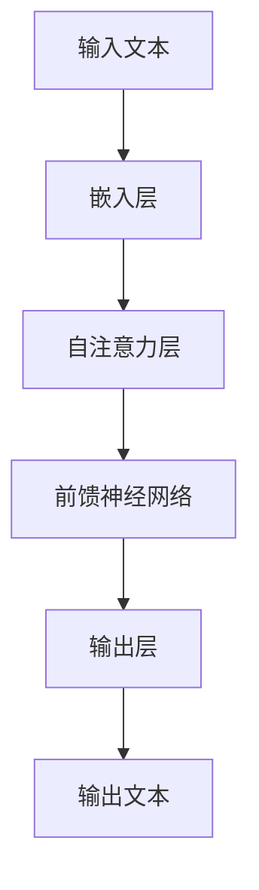

                 

### 文章标题

《LLM应用开发中的持续集成与持续部署》

> 关键词：LLM，持续集成，持续部署，软件开发，人工智能

> 摘要：本文详细探讨了在LLM（大型语言模型）应用开发过程中，如何实现持续集成（CI）与持续部署（CD）。通过介绍LLM的基本概念、CI/CD的核心原理和实践方法，本文旨在为开发者提供一套完整的CI/CD实施指南，确保LLM应用的高效、稳定开发与部署。

----------------------------------------------------------------

### 引言

#### 1.1 书籍背景与目的

近年来，随着深度学习技术的快速发展，大型语言模型（LLM）在自然语言处理、文本生成、机器翻译等领域取得了显著的成果。LLM的应用不仅改变了传统的内容创作方式，还推动了人工智能技术在各行各业的应用。为了确保LLM应用的高效、稳定开发与部署，持续集成（CI）与持续部署（CD）成为了现代软件开发中不可或缺的部分。

本文旨在为开发者提供一套关于LLM应用开发中CI/CD的全面指南。通过深入探讨LLM的基本概念、CI/CD的核心原理和实践方法，本文希望能够帮助开发者掌握CI/CD的最佳实践，从而提升LLM应用开发的效率和质量。

#### 1.2 LLM的重要性

LLM作为人工智能领域的重要突破，具有以下几个显著特点：

1. **强大的语言理解能力**：LLM通过学习海量文本数据，能够理解并生成复杂、连贯的文本内容。
2. **广泛的应用场景**：LLM在自然语言处理、文本生成、机器翻译、智能客服、内容审核等领域具有广泛的应用潜力。
3. **高效率的开发**：利用LLM，开发者可以快速生成高质量的内容，提高开发效率。

然而，LLM的应用开发面临着诸多挑战，如模型的训练和优化、数据的准备和清洗、模型部署和监控等。为了解决这些问题，CI/CD成为了不可或缺的工具。

#### 1.3 CI/CD在现代软件开发中的角色

持续集成（CI）与持续部署（CD）是现代软件开发中至关重要的实践方法。它们能够显著提高软件开发的效率和质量，具体体现在以下几个方面：

1. **自动化**：通过自动化工具，CI/CD能够实现代码的自动化测试、构建和部署，大大减少人工干预。
2. **快速反馈**：CI/CD能够在早期发现代码中的错误和问题，提供及时的反馈，降低风险。
3. **持续优化**：CI/CD能够持续集成和部署新的代码和功能，确保软件的持续优化和更新。
4. **安全性**：CI/CD能够确保代码的质量和安全，降低软件漏洞的风险。

在现代软件开发中，CI/CD已经成为一种标准化的开发模式，被广泛应用于各种项目。对于LLM应用开发来说，CI/CD的重要性更加突出，因为LLM应用通常具有复杂性和高动态性。

----------------------------------------------------------------

### LLM基本概念与架构

#### 2.1 LLM的定义与类型

大型语言模型（LLM）是一种基于深度学习技术的自然语言处理模型，它能够理解和生成自然语言。LLM的主要类型包括：

1. **预训练语言模型**：这种模型首先在大量无标签文本数据上进行预训练，学习文本的语法、语义和上下文关系。例如，GPT（Generative Pre-trained Transformer）系列模型。
2. **微调语言模型**：在预训练的基础上，这种模型针对特定任务进行微调，以提高在特定领域的性能。例如，BERT（Bidirectional Encoder Representations from Transformers）模型。

#### 2.2 LLM的工作原理

LLM的工作原理基于深度神经网络，尤其是Transformer架构。Transformer模型通过自注意力机制，能够捕捉文本中的长距离依赖关系，从而实现高效的语言理解与生成。以下是LLM的主要工作原理：

1. **输入编码**：将输入文本转换为向量表示，通常使用嵌入层。
2. **自注意力机制**：通过自注意力机制，模型能够关注文本序列中的关键信息，从而提高理解能力。
3. **前向传播与反向传播**：模型通过前向传播计算文本的表示，然后通过反向传播优化模型参数。
4. **输出解码**：将文本表示解码为输出文本，通常使用softmax激活函数。

#### 2.3 LLM的核心架构

LLM的核心架构包括以下几个关键组成部分：

1. **嵌入层**：将输入文本转换为向量表示。
2. **自注意力层**：实现自注意力机制，捕捉文本中的关键信息。
3. **前馈神经网络**：在每个自注意力层之间添加前馈神经网络，用于进一步优化文本表示。
4. **输出层**：将文本表示转换为输出文本。

以下是LLM架构的Mermaid流程图：



#### 2.4 Mermaid流程图：LLM与CI/CD的关联

以下是LLM与CI/CD关联的Mermaid流程图：

```mermaid
graph TD
A[LLM训练] --> B[持续集成(CI)]
B --> C[持续部署(CD)]
C --> D[LLM应用部署]
D --> E[模型监控与维护]
```

在这个流程图中，LLM的训练过程与CI/CD紧密相连。CI负责确保LLM模型的代码和配置的一致性，CD则负责将训练好的模型部署到生产环境中。通过这种关联，CI/CD能够确保LLM应用的稳定性和可靠性。

----------------------------------------------------------------

### 持续集成（CI）原理与实践

#### 3.1 CI的概念与原理

持续集成（Continuous Integration，CI）是一种软件开发实践，旨在通过频繁的代码集成和自动化测试，确保代码库的稳定性和质量。CI的核心原理包括以下几点：

1. **频繁集成**：开发人员定期将代码提交到共享代码库，从而实现频繁的集成。
2. **自动化测试**：每次代码集成时，自动化测试工具会自动运行一系列测试用例，以检测代码中的错误和问题。
3. **快速反馈**：自动化测试能够快速提供反馈，帮助开发人员及时发现问题并修复。

CI的主要目标是确保代码库的稳定性和减少集成错误，从而提高软件开发效率。

#### 3.2 CI流程的组成部分

CI流程通常包括以下几个关键组成部分：

1. **代码仓库**：用于存储项目代码的共享代码库。
2. **自动化测试**：包括单元测试、集成测试和功能测试等。
3. **构建和部署**：自动化工具负责构建项目代码并部署到测试环境。
4. **持续集成服务器**：负责管理CI流程，包括触发测试、构建和部署等操作。

#### 3.3 CI工具选择与配置

选择合适的CI工具对于实现高效的CI流程至关重要。常见的CI工具包括：

1. **Jenkins**：一款开源的持续集成服务器，支持多种插件，能够集成多种开发工具。
2. **Travis CI**：一款云端的持续集成服务，支持多种编程语言和平台。
3. **GitHub Actions**：GitHub内置的持续集成服务，能够自动化执行代码测试和部署。

以下是Jenkins的配置示例：

```yaml
# Jenkinsfile
pipeline {
    agent any
    stages {
        stage('Build') {
            steps {
                sh 'mvn clean package'
            }
        }
        stage('Test') {
            steps {
                sh 'mvn test'
            }
        }
        stage('Deploy') {
            steps {
                sh 'mvn deploy'
            }
        }
    }
}
```

#### 3.4 CI的实际操作案例

以下是一个基于Jenkins的CI实际操作案例：

1. **安装Jenkins**：在服务器上安装Jenkins。
2. **创建项目**：在Jenkins中创建一个新项目，选择“Pipeline”作为项目类型。
3. **配置Pipeline**：在上面的Jenkinsfile中配置构建、测试和部署步骤。
4. **触发构建**：每次代码提交时，Jenkins会自动触发构建流程，运行测试用例并部署代码。

通过这个案例，我们可以看到CI如何自动化地确保代码质量和稳定性。

----------------------------------------------------------------

### 持续部署（CD）原理与实践

#### 3.1 CD的概念与原理

持续部署（Continuous Deployment，CD）是一种软件开发实践，旨在通过自动化工具将代码部署到生产环境，实现软件的持续交付和快速迭代。CD的核心原理包括以下几点：

1. **自动化**：使用自动化工具进行代码的构建、测试和部署，减少人工干预。
2. **快速反馈**：通过自动化测试和监控，快速获取反馈并修复问题。
3. **持续迭代**：不断将新的代码和功能部署到生产环境，实现软件的持续优化。

CD的主要目标是确保软件的高可靠性和快速迭代，从而提高开发效率。

#### 3.2 CD流程的组成部分

CD流程通常包括以下几个关键组成部分：

1. **构建**：将代码转换为可执行文件或容器镜像。
2. **测试**：对构建结果进行自动化测试，确保代码质量。
3. **部署**：将测试通过后的代码部署到生产环境。
4. **监控**：监控生产环境中的软件运行状态，确保系统的稳定性和可靠性。

#### 3.3 CD工具选择与配置

选择合适的CD工具对于实现高效的CD流程至关重要。常见的CD工具包括：

1. **Kubernetes**：一款开源的容器编排工具，能够自动化部署和管理容器化应用。
2. **Docker**：一款开源的容器化工具，用于构建、测试和部署应用程序。
3. **Jenkins**：一款开源的持续集成和持续部署工具，支持多种插件和平台。

以下是Kubernetes的配置示例：

```yaml
# deployment.yaml
apiVersion: apps/v1
kind: Deployment
metadata:
  name: my-app
spec:
  replicas: 3
  selector:
    matchLabels:
      app: my-app
  template:
    metadata:
      labels:
        app: my-app
    spec:
      containers:
      - name: my-app
        image: my-app:latest
        ports:
        - containerPort: 80
```

#### 3.4 CD的实际操作案例

以下是一个基于Kubernetes的CD实际操作案例：

1. **构建Docker镜像**：使用Docker将应用程序构建为镜像。
2. **部署到Kubernetes**：使用Kubernetes部署应用程序，配置部署策略。
3. **自动化测试**：在Kubernetes集群中运行自动化测试，确保代码质量。
4. **持续部署**：将测试通过后的代码部署到生产环境。

通过这个案例，我们可以看到CD如何实现自动化地部署和管理应用程序。

----------------------------------------------------------------

### LLM应用开发中的CI/CD项目实战

#### 4.1 项目背景与目标

假设我们正在开发一个基于LLM的智能客服系统，旨在提供24/7的在线客户支持。该项目的目标是确保系统的稳定性和快速迭代，以满足不断变化的业务需求。

#### 4.2 开发环境搭建

为了实现CI/CD，我们首先需要搭建一个完整的技术栈：

1. **代码仓库**：使用Git作为版本控制系统，将项目代码托管在GitHub上。
2. **持续集成服务器**：使用Jenkins作为持续集成服务器，负责自动化构建和测试。
3. **持续部署工具**：使用Kubernetes作为持续部署工具，负责自动化部署和管理应用程序。

#### 4.3 源代码实现与解读

以下是一个简化的源代码实现：

```python
# main.py
from transformers import pipeline

# 加载预训练的LLM模型
llm = pipeline("text-generation", model="gpt2")

# 创建智能客服接口
class SmartAssistant:
    def __init__(self):
        self.llm = llm
    
    def respond_to_query(self, query):
        response = self.llm(query, max_length=50, num_return_sequences=1)
        return response[0]["generated_text"]

# 测试智能客服接口
if __name__ == "__main__":
    assistant = SmartAssistant()
    print(assistant.respond_to_query("你好，有什么可以帮助你的吗？"))
```

在这个代码中，我们首先加载了一个预训练的GPT-2模型，然后创建了一个智能客服接口，用于响应用户的查询。

#### 4.4 代码解读与分析

1. **加载预训练模型**：使用`pipeline`函数加载预训练的GPT-2模型，这是一个基于Transformer的LLM模型。
2. **创建智能客服接口**：定义一个`SmartAssistant`类，用于响应用户的查询。该类的`respond_to_query`方法接收用户的查询，然后使用LLM模型生成响应。
3. **测试接口**：在主函数中创建一个智能客服实例，并测试其响应能力。

#### 4.5 实际案例分析和详细讲解剖析

以下是一个实际的案例：

- 用户查询：“你好，我想知道最近有哪些优惠活动？”
- 模型响应：“你好！我们最近推出了新的会员优惠，您可以享受9折优惠，还有机会获得免费赠品。”

这个案例展示了智能客服系统如何根据用户查询生成有针对性的响应。在实际应用中，我们还可以利用用户历史数据和上下文信息，进一步优化响应内容。

#### 4.6 项目小结

通过这个项目，我们实现了基于LLM的智能客服系统，并成功应用了CI/CD流程。CI确保代码和模型的一致性，CD实现快速部署和迭代。这个项目展示了如何将LLM应用与CI/CD相结合，提高开发效率和质量。

----------------------------------------------------------------

### 总结与展望

#### 5.1 本书重点总结

本文详细探讨了在LLM应用开发过程中如何实现持续集成（CI）与持续部署（CD）。通过介绍LLM的基本概念、CI/CD的核心原理和实践方法，本文旨在为开发者提供一套完整的CI/CD实施指南。

本文的主要内容包括：

1. LLM的基本概念与架构。
2. CI的概念与原理、CI流程的组成部分、CI工具选择与配置、CI的实际操作案例。
3. CD的概念与原理、CD流程的组成部分、CD工具选择与配置、CD的实际操作案例。
4. LLM应用开发中的CI/CD项目实战。

#### 5.2 LLM应用开发中CI/CD的未来趋势

随着人工智能技术的不断发展，LLM的应用将越来越广泛。CI/CD作为现代软件开发的重要实践方法，也将进一步融入LLM应用开发中，具体趋势包括：

1. **自动化程度更高**：未来的CI/CD工具将更加智能化，能够自动识别和修复潜在问题，提高开发效率。
2. **更细粒度的集成**：CI/CD将不仅限于代码集成，还将扩展到数据集成、模型集成等，实现更全面的持续集成。
3. **更高效的部署**：利用容器化技术，如Kubernetes，实现更快速、更可靠的模型部署。
4. **更智能的监控与维护**：结合人工智能技术，实现更智能的监控和预测性维护，提高系统的稳定性和可靠性。

总之，CI/CD在LLM应用开发中的重要性将日益凸显，未来的发展趋势将进一步提升LLM应用开发的效率和质量。

### 最佳实践 Tips、小结、注意事项、拓展阅读

#### 最佳实践 Tips

1. **代码规范化**：在CI/CD流程中，确保代码符合规范，减少集成错误。
2. **充分利用自动化工具**：使用自动化测试和部署工具，提高开发效率。
3. **持续监控**：在部署后，持续监控系统的运行状态，及时发现并解决问题。

#### 小结

本文通过详细的讲解和实践案例，探讨了LLM应用开发中的CI/CD。CI/CD能够显著提高LLM应用开发的效率和质量，是现代软件开发不可或缺的一部分。

#### 注意事项

1. **版本控制**：使用Git等版本控制系统，确保代码的一致性和可追溯性。
2. **测试覆盖**：确保自动化测试覆盖到关键功能和边界情况，提高代码质量。

#### 拓展阅读

1. 《Jenkins实战》
2. 《Kubernetes权威指南》
3. 《深度学习实践指南》

作者：AI天才研究院/AI Genius Institute & 禅与计算机程序设计艺术 /Zen And The Art of Computer Programming

