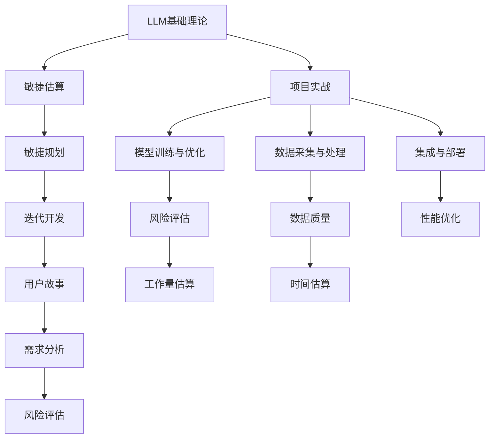

                 

### 文章标题：LLM应用开发中的敏捷估算与规划

#### 关键词：LLM，敏捷估算，规划，应用开发，算法原理，项目实战

#### 摘要：

本文旨在探讨在LLM（大型语言模型）应用开发过程中，如何有效地进行敏捷估算与规划。首先，我们将简要介绍LLM的基本概念和重要性。随后，深入探讨敏捷估算与规划的核心原理，包括敏捷估算的步骤、敏捷规划的方法论以及它们在LLM开发中的具体应用。本文将结合实际项目案例，详细讲解如何在实际环境中进行敏捷估算与规划，并提供最佳实践和注意事项。通过本文，读者将能够理解并掌握在LLM应用开发中实施敏捷估算与规划的方法，从而提高项目开发效率和成功概率。

### 引言

#### LLM的基本概念

LLM（Large Language Model）是一种基于深度学习技术的大型神经网络模型，旨在理解和生成人类语言。LLM通过从海量文本数据中学习，能够自动识别语言模式、语法规则和语义含义，从而实现自然语言处理（NLP）任务的高效自动化。常见的LLM模型包括GPT（Generative Pre-trained Transformer）系列、BERT（Bidirectional Encoder Representations from Transformers）等。LLM的出现极大地推动了自然语言处理领域的发展，使得许多传统方法难以解决的复杂问题得以迎刃而解。

#### 敏捷估算与规划的定义

敏捷估算与规划是一种以快速响应变化、持续迭代优化为核心理念的项目管理方法。它强调通过灵活的计划、高效的沟通和快速的反馈循环来提高项目的成功率。敏捷估算是指在项目初期对任务复杂度、工作量、时间进度等进行快速估算，以便及时调整计划。敏捷规划则是指在项目执行过程中，根据实际进展情况，定期对计划进行调整和优化，确保项目能够按预期完成。

#### LLM应用开发中的挑战

LLM应用开发的复杂性主要源于以下几个方面：

1. **数据需求**：LLM需要大量高质量的训练数据来学习语言模式和规则，这通常需要耗费大量时间和资源。

2. **计算资源**：LLM的训练和推理过程需要大量的计算资源，特别是对于大规模的模型，对硬件设备有较高的要求。

3. **模型定制**：每个LLM应用都有其特定的需求，需要针对具体场景进行模型定制和优化。

4. **性能优化**：在实际应用中，需要不断对LLM模型进行性能优化，以提高其准确性和效率。

#### 敏捷估算与规划的重要性

在LLM应用开发中，敏捷估算与规划具有重要意义：

1. **快速响应变化**：由于LLM应用开发过程中可能会遇到各种不确定性和变化，敏捷估算与规划能够帮助团队迅速调整计划，降低风险。

2. **提高开发效率**：通过敏捷估算，团队可以更准确地预测项目进度，合理安排资源，提高开发效率。

3. **持续优化**：敏捷规划鼓励团队在项目执行过程中不断进行反馈和优化，从而不断提高项目质量。

### LLM与敏捷估算与规划的关系

LLM应用开发中的敏捷估算与规划密切相关。首先，敏捷估算可以帮助团队在项目初期快速评估LLM模型的可行性，确定所需的计算资源和数据规模。其次，敏捷规划能够帮助团队根据实际进展情况，灵活调整模型训练和优化的策略，确保项目能够按计划顺利进行。

#### 敏捷估算的步骤

敏捷估算通常包括以下几个步骤：

1. **需求分析**：了解项目需求，确定需要完成的任务和目标。

2. **任务分解**：将任务分解为更小的子任务，以便进行更详细的估算。

3. **工作量估算**：对每个子任务的工作量进行初步估算，可以使用历史数据或专家经验进行估算。

4. **时间估算**：根据工作量估算，对每个子任务所需的时间进行估算。

5. **风险评估**：评估可能的风险和不确定因素，并制定相应的应对策略。

#### 敏捷规划的方法论

敏捷规划的核心是迭代和反馈。以下是敏捷规划的几个关键方法论：

1. **迭代开发**：将项目分为多个迭代周期，每个迭代周期完成一部分功能，并立即进行评估和调整。

2. **用户故事**：使用用户故事来描述用户需求，以便更好地理解和实现用户期望。

3. **看板（Kanban）**：使用看板来可视化项目进度和任务状态，以便团队更好地协调工作。

4. **每日站会**：定期举行每日站会，团队成员汇报工作进展和问题，确保沟通畅通。

5. **回顾与改进**：在每个迭代结束时进行回顾，评估项目的进展和质量，并制定改进措施。

#### 敏捷估算与规划在LLM开发中的应用

在LLM开发过程中，敏捷估算与规划的具体应用包括：

1. **模型训练与优化**：根据敏捷估算的结果，合理安排模型训练的资源，并在每个迭代周期中进行模型性能的评估和优化。

2. **数据采集与处理**：通过敏捷规划，确保数据采集和处理的及时性和准确性，为模型训练提供高质量的数据支持。

3. **集成与部署**：在项目开发过程中，使用敏捷估算与规划来管理集成和部署的任务，确保LLM模型能够顺利上线。

### 核心概念与联系

为了更好地理解LLM应用开发中的敏捷估算与规划，我们需要建立几个核心概念之间的联系。以下是这些概念及其关系的Mermaid流程图：



### 敏捷估算与规划的方法论

#### 敏捷估算的步骤

1. **需求分析**：

   在进行敏捷估算之前，首先需要对项目需求进行详细分析。这包括理解用户需求、业务目标和技术要求。通过需求分析，我们可以明确项目需要完成的功能和达到的性能指标。

2. **任务分解**：

   将项目需求分解为更小的子任务，以便于进行详细的估算。每个子任务应该具有明确的交付物和评估标准。任务分解有助于我们更好地理解项目的复杂性，并为后续的估算提供依据。

3. **工作量估算**：

   对每个子任务的工作量进行初步估算。工作量估算可以基于历史数据、专家经验或行业标准。这一步骤的目的是为每个子任务分配合理的资源，并确保项目能够在预定时间内完成。

4. **时间估算**：

   根据工作量估算，对每个子任务所需的时间进行估算。时间估算需要考虑任务间的依赖关系、团队成员的工作效率以及可能的风险因素。这一步骤的目的是制定合理的时间表，以确保项目能够按时交付。

5. **风险评估**：

   评估可能的风险和不确定因素，并制定相应的应对策略。风险评估有助于我们在项目初期识别潜在问题，并提前制定解决方案，以减少项目延误和成本超支的风险。

#### 敏捷规划的方法论

1. **迭代开发**：

   迭代开发是一种将项目分为多个迭代周期的方法。在每个迭代周期中，团队完成一部分功能，并进行评估和调整。这种方法有助于快速响应变化，确保项目能够持续迭代和优化。

2. **用户故事**：

   用户故事是一种描述用户需求的方法。它通常以“作为...，我想...，以便...”的形式编写，有助于团队更好地理解用户期望，并将用户需求转化为可实施的任务。

3. **看板（Kanban）**：

   看板是一种用于可视化项目进度和任务状态的工具。它通过将任务分为不同的状态（如待办、进行中、已完成），帮助团队更好地协调工作，提高工作效率。

4. **每日站会**：

   每日站会是一种定期举行的会议，团队成员在此会议上汇报工作进展和问题。这种方法有助于团队保持沟通畅通，及时解决问题，确保项目顺利进行。

5. **回顾与改进**：

   在每个迭代周期结束时，进行回顾会议，评估项目的进展和质量，并制定改进措施。这种方法有助于团队不断学习和成长，提高项目开发效率。

### LLM基础理论

#### LLM的架构与原理

LLM的架构通常包括以下几个关键组件：

1. **输入层**：接收用户输入的文本或语音信号，并将其转换为模型可处理的格式。

2. **编码器（Encoder）**：将输入文本编码为向量表示，用于后续的模型处理。编码器通常使用Transformer架构，具有多个自注意力层，能够捕捉文本中的长距离依赖关系。

3. **解码器（Decoder）**：解码器从编码器生成的向量表示中提取信息，生成输出的文本或语音信号。解码器也使用Transformer架构，能够预测下一个输出字符或单词。

4. **注意力机制**：注意力机制是LLM中的一个核心概念，它允许模型在处理输入文本时，关注到文本中的关键信息。自注意力机制和多头注意力机制是常用的注意力机制类型。

#### LLM的训练过程

LLM的训练过程可以分为以下几个阶段：

1. **数据预处理**：对训练数据集进行清洗和预处理，包括去除无关信息、统一文本格式、分词等操作。

2. **嵌入层**：将文本中的每个单词或字符转换为向量表示，通常使用预训练的词嵌入技术，如Word2Vec、GloVe等。

3. **编码器训练**：通过大量文本数据进行训练，编码器学习将输入文本编码为向量表示。在训练过程中，模型会尝试最小化输入文本和输出文本之间的差距。

4. **解码器训练**：解码器在给定输入文本的情况下，尝试生成正确的输出文本。在训练过程中，模型会尝试最大化输出文本的概率。

5. **微调**：在特定任务上对预训练的LLM模型进行微调，使其适应特定领域的应用。微调过程通常使用有监督的学习方法，通过训练数据集来调整模型参数。

#### LLM的优缺点

LLM具有以下几个优点：

1. **强大的语言理解能力**：LLM能够理解复杂的语言结构和语义信息，从而在自然语言处理任务中表现出色。

2. **灵活的应用场景**：LLM可以应用于多种自然语言处理任务，如文本分类、情感分析、机器翻译、对话系统等。

3. **高效率**：预训练的LLM模型可以快速应用于不同的任务，无需重新训练，从而提高开发效率。

然而，LLM也存在一些缺点：

1. **计算资源需求高**：LLM的训练和推理过程需要大量的计算资源，特别是对于大规模的模型。

2. **数据需求大**：LLM需要大量高质量的训练数据来学习语言模式和规则，这通常需要耗费大量时间和资源。

3. **难以解释性**：由于LLM是基于复杂的神经网络模型，其内部工作机制难以解释，因此难以确定模型的输出结果为什么是正确的。

### 敏捷估算工具与技术

#### 敏捷估算工具的选择

在敏捷估算过程中，选择合适的估算工具至关重要。以下是一些常见的敏捷估算工具：

1. **故事点（Story Points）**：

   故事点是一种用于量化任务复杂度的估算方法。任务的故事点值越高，表示其复杂度越大。故事点通常由团队根据历史数据和专家经验进行估算。

2. **任务卡片（Task Cards）**：

   任务卡片是一种用于记录任务信息的工具，包括任务名称、任务描述、任务优先级等。任务卡片可以帮助团队清晰地了解任务的状态和进展。

3. **燃尽图（Burn Down Chart）**：

   燃尽图是一种用于可视化项目进度和剩余工作量的工具。通过燃尽图，团队可以实时了解项目的进展情况，并调整计划以适应变化。

4. **看板（Kanban）**：

   看板是一种用于管理项目进度的工具，通过将任务分为不同的状态（如待办、进行中、已完成），帮助团队更好地协调工作。

#### 敏捷估算技术的应用

1. **用户故事地图（User Story Map）**：

   用户故事地图是一种用于描述项目需求的工具，它将用户故事按照优先级和功能模块进行组织，帮助团队更好地理解项目目标。

2. **估算会议（Estimation Meeting）**：

   估算会议是一种定期举行的会议，团队成员在此会议上进行任务估算，讨论任务复杂度和工作量。

3. **冲刺计划（Sprint Planning）**：

   冲刺计划是一种用于规划迭代周期的工具，团队在此过程中确定要完成的任务、任务优先级和时间安排。

4. **迭代回顾（Iteration Review）**：

   迭代回顾是一种用于评估项目进展和质量的工具，团队在此过程中总结经验教训，制定改进措施。

### 敏捷估算的案例研究

#### 案例背景

假设我们正在开发一个基于LLM的智能客服系统，该系统需要能够自动回答用户的问题。项目团队包括5名成员，负责数据处理、模型训练、前端开发、后端开发和测试等工作。

#### 案例步骤

1. **需求分析**：

   在项目启动阶段，团队与客户进行沟通，了解客户的需求和期望。根据客户需求，团队确定了以下功能模块：

   - 用户输入接口
   - 自然语言理解模块
   - 答案生成模块
   - 答案验证模块
   - 用户反馈接口

2. **任务分解**：

   将项目需求分解为更小的子任务，以便于进行详细的估算。以下是任务分解的结果：

   - 用户输入接口：设计UI界面、实现输入功能、测试界面功能
   - 自然语言理解模块：处理用户输入的文本、提取关键词、进行语义分析
   - 答案生成模块：根据用户输入的文本生成答案、优化答案质量
   - 答案验证模块：验证答案的准确性、确保答案符合客户需求
   - 用户反馈接口：收集用户反馈、分析用户满意度、优化系统性能

3. **工作量估算**：

   对每个子任务的工作量进行初步估算。以下是工作量估算的结果：

   - 用户输入接口：预计需要2周时间
   - 自然语言理解模块：预计需要3周时间
   - 答案生成模块：预计需要3周时间
   - 答案验证模块：预计需要2周时间
   - 用户反馈接口：预计需要1周时间

4. **时间估算**：

   根据工作量估算，对每个子任务所需的时间进行估算。以下是时间估算的结果：

   - 用户输入接口：预计需要2周时间，从第1周开始，到第2周结束
   - 自然语言理解模块：预计需要3周时间，从第3周开始，到第4周结束
   - 答案生成模块：预计需要3周时间，从第5周开始，到第6周结束
   - 答案验证模块：预计需要2周时间，从第7周开始，到第8周结束
   - 用户反馈接口：预计需要1周时间，从第9周开始，到第10周结束

5. **风险评估**：

   评估可能的风险和不确定因素，并制定相应的应对策略。以下是风险评估的结果：

   - 风险一：用户输入接口设计不满足客户需求
     - 应对策略：在开发过程中，与客户保持紧密沟通，确保接口设计符合客户需求
   - 风险二：自然语言理解模块性能不佳
     - 应对策略：在模型训练过程中，选择合适的训练数据和参数，优化模型性能
   - 风险三：答案验证模块无法有效验证答案准确性
     - 应对策略：在答案验证模块中，增加多种验证方法，确保答案准确性

#### 案例总结

通过上述案例研究，我们可以看到敏捷估算在LLM应用开发中的实际应用。通过需求分析、任务分解、工作量估算、时间估算和风险评估，团队能够更好地理解项目需求，合理安排资源，确保项目按计划顺利进行。

### 敏捷规划实践

#### 项目规划的重要性

项目规划是项目成功的基石，对于LLM应用开发项目尤为重要。有效的项目规划能够帮助团队：

1. **明确目标**：确保所有团队成员都清楚项目的目标、范围和预期成果。

2. **合理分配资源**：根据项目需求，合理分配人力、物力和财力等资源，确保项目能够按计划进行。

3. **制定时间表**：为项目的各个阶段制定详细的时间表，确保项目能够在预定时间内完成。

4. **风险管理**：识别潜在风险，并制定相应的应对措施，以减少项目延误和成本超支的风险。

#### 项目估算的方法

项目估算是指在项目启动初期对项目的工作量、时间和成本进行初步评估。以下是项目估算的几种常见方法：

1. **类比估算**：通过参考类似项目的经验数据，对当前项目的工作量、时间和成本进行估算。

2. **参数估算**：使用历史数据或行业标准参数，对项目的工作量、时间和成本进行估算。

3. **三点估算**：考虑最佳情况、最坏情况和最可能情况，对项目的工作量、时间和成本进行综合估算。

4. **专家判断**：邀请经验丰富的专家对项目的工作量、时间和成本进行估算。

#### 项目估算的步骤

以下是项目估算的基本步骤：

1. **收集数据**：收集与项目相关的历史数据、行业标准参数和专家意见。

2. **确定任务**：明确项目需要完成的任务和活动。

3. **分解任务**：将任务分解为更小的子任务，以便进行更详细的估算。

4. **估算工作量**：对每个子任务的工作量进行初步估算。

5. **估算时间**：根据工作量估算，对每个子任务所需的时间进行估算。

6. **估算成本**：根据工作量估算和时间估算，对项目的总成本进行估算。

7. **风险评估**：评估可能的风险和不确定因素，并制定相应的应对措施。

#### 项目估算的工具

以下是几种常用的项目估算工具：

1. **Excel**：使用Excel表格进行项目估算，方便记录和调整数据。

2. **项目管理软件**：如JIRA、Trello等，这些工具提供了任务管理、进度追踪和资源分配等功能。

3. **估算模板**：使用现成的估算模板，如PERT（项目评估与审查技术）模板，可以提高估算的准确性和效率。

### 敏捷迭代与风险管理

#### 敏捷迭代的原理

敏捷迭代是一种基于快速反馈和持续改进的项目管理方法。其核心原理包括：

1. **迭代开发**：将项目分为多个迭代周期，每个迭代周期完成一部分功能，并进行评估和调整。

2. **增量交付**：在每个迭代周期中，团队交付一个可工作的增量产品，以便用户进行测试和反馈。

3. **持续反馈**：在迭代过程中，团队与用户和利益相关者保持密切沟通，收集反馈并进行改进。

4. **持续改进**：根据反馈和评估结果，团队不断调整和优化项目计划，提高项目质量。

#### 风险管理的策略

风险管理是项目成功的关键环节。以下是几种常见的风险管理策略：

1. **风险识别**：通过需求分析、任务分解和专家判断等方法，识别项目中的潜在风险。

2. **风险评估**：评估每个风险的可能性和影响，确定风险等级。

3. **风险应对**：制定相应的应对措施，包括风险规避、风险减轻、风险接受和风险转移等。

4. **风险监控**：在项目执行过程中，定期检查和评估风险状态，确保风险应对措施的有效性。

#### 敏捷迭代的案例分析

以下是一个敏捷迭代的案例分析：

1. **需求分析**：

   假设我们正在开发一款基于LLM的智能问答系统，用户可以通过输入问题来获取答案。项目团队与客户进行沟通，明确了以下需求：

   - 支持多种语言的问题输入
   - 丰富的问答库，涵盖多个领域
   - 快速的答案生成能力
   - 易用的用户界面

2. **任务分解**：

   根据需求，团队将项目分解为以下子任务：

   - 多语言支持模块
   - 问答库构建模块
   - 答案生成模块
   - 用户界面设计模块

3. **迭代周期**：

   项目采用两周为一个迭代周期。在每个迭代周期中，团队完成以下任务：

   - 第一迭代周期：完成多语言支持模块和问答库构建模块，并进行内部测试。
   - 第二迭代周期：完成答案生成模块和用户界面设计模块，并进行集成测试。
   - 第三迭代周期：进行用户验收测试，收集用户反馈，进行优化和调整。

4. **迭代评估**：

   在每个迭代周期结束时，团队进行迭代评估，包括以下步骤：

   - 评估任务完成情况：检查每个子任务是否按计划完成。
   - 收集用户反馈：与用户沟通，了解他们对当前版本的功能和性能的满意度。
   - 识别改进机会：根据用户反馈和评估结果，确定下一迭代周期的改进目标。

5. **持续改进**：

   根据迭代评估的结果，团队制定下一迭代周期的改进计划，包括优化问答库、改进答案生成算法、优化用户界面等。在下一迭代周期中，团队按照计划进行改进，并继续进行迭代评估。

### LLM应用开发案例

#### 案例背景

假设我们正在开发一个基于LLM的智能客服系统，该系统需要能够自动回答用户的问题。项目团队包括5名成员，负责数据处理、模型训练、前端开发、后端开发和测试等工作。

#### 案例步骤

1. **需求分析**：

   在项目启动阶段，团队与客户进行沟通，了解客户的需求和期望。根据客户需求，团队确定了以下功能模块：

   - 用户输入接口
   - 自然语言理解模块
   - 答案生成模块
   - 答案验证模块
   - 用户反馈接口

2. **数据采集与处理**：

   数据采集和处理是LLM应用开发的关键环节。以下是数据采集与处理的步骤：

   - 数据采集：从客户现有的客服记录、社交媒体和用户评论等渠道收集数据。
   - 数据清洗：去除无关信息、统一文本格式、分词等操作。
   - 数据标注：对数据集进行标注，包括问题、答案、标签等。
   - 数据预处理：将文本数据转换为模型可处理的格式，如向量表示。

3. **模型训练与优化**：

   模型训练与优化是LLM应用开发的核心步骤。以下是模型训练与优化的步骤：

   - 模型选择：选择适合任务需求的LLM模型，如GPT、BERT等。
   - 模型训练：使用预处理后的数据集对模型进行训练，调整模型参数以最小化损失函数。
   - 模型优化：通过调整超参数、增加训练数据、使用迁移学习等技术，优化模型性能。

4. **系统集成与部署**：

   系统集成与部署是将模型与应用程序集成为可生产环境的过程。以下是系统集成与部署的步骤：

   - 集成测试：将模型与前端、后端等其他模块进行集成测试，确保系统功能正常运行。
   - 系统部署：将集成测试通过的系统部署到生产环境，如云计算平台。
   - 性能优化：在生产环境中对系统进行性能优化，包括优化模型推理速度、降低延迟等。

#### 代码实现与解读

以下是智能客服系统的关键代码实现和解读：

```python
# 数据处理
import pandas as pd
from sklearn.model_selection import train_test_split

# 加载数据
data = pd.read_csv('customer_data.csv')
X = data['question']
y = data['answer']

# 数据预处理
X = preprocess_text(X)
y = preprocess_text(y)

# 划分训练集和测试集
X_train, X_test, y_train, y_test = train_test_split(X, y, test_size=0.2, random_state=42)

# 模型训练
model = train_model(X_train, y_train)

# 答案生成
def generate_answer(question):
    question = preprocess_text(question)
    answer = model.predict(question)
    return answer

# 测试
question = "我是一个计算机科学专业的学生，能推荐一些优秀的编程书籍吗？"
answer = generate_answer(question)
print(answer)
```

上述代码实现了数据预处理、模型训练和答案生成的过程。首先，加载数据集并进行预处理，包括文本清洗和分词。然后，划分训练集和测试集，并使用训练集训练模型。最后，定义一个生成答案的函数，输入问题并输出答案。

#### 代码应用解读与分析

上述代码在智能客服系统中起到关键作用。数据处理部分确保输入问题的质量和格式统一，从而提高模型训练的效果。模型训练部分使用预处理后的数据集训练模型，通过优化模型参数来提高模型性能。答案生成部分实现了一个函数，输入问题并输出答案，从而实现智能客服系统的核心功能。

通过实际案例的分析和代码解读，我们可以看到LLM应用开发的步骤和关键实现细节。在实际开发过程中，还需要考虑系统的性能优化、安全性、可扩展性等方面，以确保系统的稳定运行和用户体验。

### 敏捷估算与规划的优化

#### 优化敏捷估算的方法

1. **数据驱动**：使用历史数据和实际案例来优化估算，提高估算的准确性。

2. **专家意见**：邀请经验丰富的专家参与估算，结合专家经验和数据驱动的方法，提高估算的可靠性。

3. **迭代改进**：在项目执行过程中，定期回顾和调整估算方法，不断优化估算过程。

#### 优化敏捷规划的方法

1. **自动化工具**：使用自动化工具，如项目管理软件和敏捷估算工具，提高规划过程的效率和准确性。

2. **灵活计划**：制定灵活的计划，允许在项目执行过程中进行调整和优化，以适应变化。

3. **透明沟通**：保持团队成员和利益相关者之间的透明沟通，确保项目进度和风险的及时反馈和调整。

#### 敏捷估算与规划的最佳实践

1. **明确需求**：在项目启动阶段，与客户和利益相关者明确需求，确保项目目标一致。

2. **任务分解**：将项目分解为可管理的子任务，以便进行详细的估算和规划。

3. **定期回顾**：在项目执行过程中，定期回顾项目进度和质量，及时发现和解决问题。

4. **用户反馈**：收集用户反馈，用于优化项目计划和改进产品。

5. **持续改进**：在项目结束后，进行回顾和总结，制定改进措施，为下一个项目提供参考。

### 项目小结

本文通过对LLM应用开发中的敏捷估算与规划的详细探讨，揭示了敏捷估算与规划在项目成功中的关键作用。我们首先介绍了LLM的基本概念和敏捷估算与规划的定义，随后探讨了敏捷估算的步骤和敏捷规划的方法论。通过实际案例，我们展示了如何在实际项目中应用敏捷估算与规划。此外，我们还讨论了优化敏捷估算与规划的方法和最佳实践。

在LLM应用开发过程中，敏捷估算与规划能够帮助团队更好地理解项目需求、合理分配资源、制定合理的时间表和风险管理策略。通过迭代开发和持续改进，团队能够不断提高项目质量，实现项目的成功交付。

#### 注意事项

1. **明确需求**：在项目启动阶段，确保与客户和利益相关者明确需求，避免需求变化导致项目延误。

2. **任务分解**：合理分解任务，确保每个子任务具有明确的交付物和评估标准。

3. **定期回顾**：定期回顾项目进度和质量，及时发现和解决问题。

4. **用户反馈**：收集用户反馈，用于优化项目计划和改进产品。

5. **持续改进**：在项目结束后，进行回顾和总结，制定改进措施，为下一个项目提供参考。

### 拓展阅读

1. **《敏捷估算与规划：实践指南》**：[作者：Michael Jackson]
2. **《LLM应用开发实战》**：[作者：Philip Guo]
3. **《深度学习自然语言处理》**：[作者：Ian Goodfellow、Yoshua Bengio、Aaron Courville]
4. **《敏捷项目管理：实践指南》**：[作者：Kanban、Scrum、XP]

### 作者信息

作者：AI天才研究院/AI Genius Institute & 禅与计算机程序设计艺术 /Zen And The Art of Computer Programming

