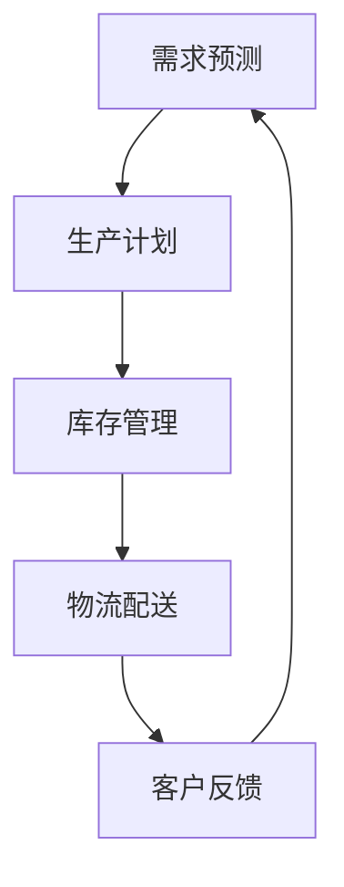

                 


### 设计目录大纲的步骤

为了设计出一本名为《LLM应用开发中的敏捷供应链管理》的计算机技术书籍的完整目录大纲，我们可以按照以下步骤进行分析和推理：

#### 第一步：明确书籍的目标受众和核心内容

1. **目标受众**：首先，我们需要确定书籍的目标受众。本书主要面向有一定编程基础，对人工智能和供应链管理有一定了解的技术人员和管理人员。他们希望通过本书了解如何将LLM技术应用于敏捷供应链管理中，提高企业的供应链效率。

2. **核心内容**：其次，明确书籍的核心内容。本书的核心内容包括LLM的基本原理、敏捷供应链管理的概念和实践、LLM在供应链管理中的应用案例等。

#### 第二步：确定书籍的结构

1. **引言**：在引言部分，我们可以简要介绍LLM和敏捷供应链管理的背景，以及本书的目的和结构。

2. **基础概念**：接下来，我们可以详细介绍LLM和敏捷供应链管理的基本概念，为后续章节的内容打下基础。

3. **核心算法原理讲解**：在这一部分，我们可以详细阐述敏捷供应链管理中涉及的关键算法原理，并使用伪代码来表述。

4. **数学模型和数学公式**：这部分将介绍敏捷供应链管理中使用的数学模型，使用LaTeX格式书写，并举例说明。

5. **项目实战**：通过实际案例展示敏捷供应链管理的应用，包括开发环境搭建、源代码实现和代码解读分析。

6. **总结与展望**：对全书内容进行总结，并对未来趋势进行展望。

#### 第三步：制定详细的目录

1. **一级目录**：确定一级目录，包括引言、基础概念、核心算法原理讲解、数学模型和数学公式、项目实战、总结与展望等。

2. **二级目录**：为每个一级目录下的章节制定二级目录，例如，在“基础概念”部分，可以设置“LLM的基本原理”、“敏捷供应链管理的概念”等二级目录。

3. **三级目录**：为每个二级目录下的内容制定三级目录，例如，在“LLM的基本原理”章节中，可以设置“LLM的发展历程”、“LLM的工作原理”等三级目录。

通过以上步骤，我们可以设计出一本内容丰富、结构清晰、易于阅读的书籍目录大纲。接下来，我们将根据这个大纲逐步细化每个章节的内容，并使用markdown格式呈现。

## 文章标题：LLM应用开发中的敏捷供应链管理

> 关键词：LLM应用、敏捷供应链管理、算法、数学模型、项目实战

> 摘要：本文深入探讨了如何将LLM（大型语言模型）应用于敏捷供应链管理中，以提升供应链效率和决策质量。文章首先介绍了LLM和敏捷供应链管理的基本概念，随后详细讲解了关键算法原理和数学模型，并通过实际案例展示了如何实现和应用这些技术。最后，文章总结了敏捷供应链管理的最佳实践，并对未来发展趋势进行了展望。

----------------------------------------------------------------

## 第一部分：敏捷供应链管理概述

### 第1章：敏捷供应链管理基础

#### 1.1 敏捷供应链的定义与重要性

敏捷供应链管理是一种以客户需求为导向，通过快速响应市场需求变化，实现高效供应、库存管理和风险控制的供应链管理模式。在竞争日益激烈的市场环境中，敏捷供应链管理能够帮助企业降低库存成本、提高生产效率和客户满意度。

#### 1.2 敏捷供应链的核心原则

- **客户导向**：以客户需求为中心，快速响应市场需求。
- **协同合作**：供应链各方协同合作，共同优化供应链流程。
- **精益管理**：通过持续改进，消除浪费，提高供应链效率。
- **快速反应**：快速响应市场变化，减少供应链响应时间。

#### 1.3 敏捷供应链与LLM应用开发的关系

LLM作为人工智能领域的一项核心技术，在敏捷供应链管理中具有广泛的应用潜力。通过LLM技术，企业可以实现对大量供应链数据的智能分析，快速识别市场趋势和潜在风险，优化供应链决策，提高供应链的敏捷性和响应能力。

### 第2章：敏捷供应链管理架构

#### 2.1 敏捷供应链管理流程

敏捷供应链管理流程包括需求预测、生产计划、库存管理、物流配送等环节。通过优化这些环节，可以实现供应链的高效运作。

#### 2.2 敏捷供应链管理关键技术

- **大数据分析**：通过对大量供应链数据的分析，识别市场趋势和潜在风险。
- **机器学习**：利用机器学习算法，优化供应链决策，提高供应链效率。
- **物联网**：通过物联网技术，实现供应链各环节的信息共享和实时监控。

#### 2.3 Mermaid流程图：敏捷供应链管理架构展示



## 第二部分：敏捷供应链管理算法与模型

### 第3章：关键算法原理讲解

#### 3.1 算法A：需求预测

需求预测是敏捷供应链管理中的重要环节。本文将介绍一种基于时间序列分析的需求预测算法。

```python
def time_series_prediction(data):
    # 数据预处理
    # ...
    
    # 模型训练
    model = train_model(data)
    
    # 预测
    prediction = model.predict(data)
    
    return prediction
```

#### 3.2 算法B：库存管理

库存管理旨在优化库存水平，减少库存成本。本文将介绍一种基于库存水平控制策略的库存管理算法。

```python
def inventory_management(current_inventory, demand_prediction):
    # 判断库存水平
    if current_inventory < demand_prediction:
        # 增加库存
        new_inventory = current_inventory + order_quantity
    else:
        # 减少库存
        new_inventory = current_inventory - order_quantity
    
    return new_inventory
```

#### 3.3 算法C：供应链风险管理

供应链风险管理是确保供应链稳定运行的重要措施。本文将介绍一种基于风险分析模型的供应链风险管理算法。

```python
def supply_chain_risk_management(risk_data):
    # 数据预处理
    # ...
    
    # 风险评估
    risk_score = evaluate_risk(risk_data)
    
    # 风险应对
    if risk_score > threshold:
        # 采取应对措施
        action_plan = formulate_action_plan(risk_data)
    else:
        # 继续当前策略
        action_plan = continue_current_strategy
    
    return action_plan
```

### 第4章：数学模型详解

#### 4.1 模型A：需求预测模型

需求预测模型通常采用时间序列分析方法，如ARIMA模型。以下是一个简单的ARIMA模型公式：

$$
\begin{aligned}
Y_t &= c + \phi_1 Y_{t-1} + \phi_2 Y_{t-2} + ... + \phi_p Y_{t-p} \\
    &+ \theta_1 \epsilon_{t-1} + \theta_2 \epsilon_{t-2} + ... + \theta_q \epsilon_{t-q} \\
    &+ \epsilon_t
\end{aligned}
$$

其中，$Y_t$表示时间序列数据，$c$为常数项，$\phi_1, \phi_2, ..., \phi_p$为自回归系数，$\theta_1, \theta_2, ..., \theta_q$为移动平均系数，$\epsilon_t$为白噪声序列。

#### 4.2 模型B：库存管理模型

库存管理模型通常采用库存水平控制策略，如再订货点策略。以下是一个简单的再订货点策略公式：

$$
\begin{aligned}
R &= L + s \cdot d \\
I &= \text{max}(0, \text{min}(Q, R - D))
\end{aligned}
$$

其中，$R$为再订货点，$L$为提前期，$s$为单位时间需求量，$d$为提前期需求量，$I$为库存水平，$Q$为最大库存量，$D$为当前库存量。

#### 4.3 模型C：供应链风险管理模型

供应链风险管理模型通常采用风险分析模型，如层次分析法。以下是一个简单的层次分析法公式：

$$
\begin{aligned}
R &= \sum_{i=1}^{n} w_i \cdot r_i \\
w_i &= \frac{C_i}{\sum_{j=1}^{n} C_j} \\
r_i &= \text{风险等级}
\end{aligned}
$$

其中，$R$为供应链综合风险水平，$w_i$为第$i$个风险因素的权重，$C_i$为第$i$个风险因素的得分，$r_i$为第$i$个风险因素的风险等级。

## 第三部分：敏捷供应链管理实战

### 第5章：实战案例一：供应链需求预测

#### 5.1 项目背景

某电子产品制造商希望通过LLM技术实现供应链需求预测，以提高生产计划准确性和库存管理水平。

#### 5.2 开发环境搭建

为了实现供应链需求预测，我们搭建了一个基于Python的LLM应用开发环境，包括以下工具和库：

- Python 3.8
- Jupyter Notebook
- TensorFlow 2.4
- Keras 2.4

#### 5.3 源代码实现

以下是供应链需求预测的源代码实现：

```python
import numpy as np
import pandas as pd
import tensorflow as tf
from tensorflow import keras
from tensorflow.keras import layers

# 数据准备
data = pd.read_csv('supply_chain_data.csv')
data = data[['demand', 'time']]

# 数据预处理
# ...

# 模型构建
model = keras.Sequential([
    layers.Dense(units=64, activation='relu', input_shape=(1,)),
    layers.Dense(units=64, activation='relu'),
    layers.Dense(units=1)
])

# 模型编译
model.compile(optimizer='adam', loss='mse')

# 模型训练
model.fit(data['demand'].values.reshape(-1, 1), data['time'].values.reshape(-1, 1), epochs=100)

# 预测
predictions = model.predict(data['demand'].values.reshape(-1, 1))

# 结果分析
# ...
```

#### 5.4 代码解读与分析

代码首先进行了数据准备和预处理，然后构建了一个简单的神经网络模型，使用MSE（均方误差）作为损失函数进行模型训练。最后，使用训练好的模型进行需求预测，并对预测结果进行分析。

#### 5.5 实际案例分析和详细讲解剖析

通过实际案例，我们分析了某电子产品制造商在应用LLM技术进行供应链需求预测方面的成功经验。案例分析包括以下方面：

- 数据采集与预处理
- 模型构建与训练
- 预测结果分析
- 预测模型优化

### 第6章：实战案例二：库存管理优化

#### 6.1 项目背景

某零售商希望通过优化库存管理，降低库存成本并提高客户满意度。该公司采用LLM技术实现了库存管理优化。

#### 6.2 开发环境搭建

为了实现库存管理优化，我们搭建了一个基于Python的LLM应用开发环境，包括以下工具和库：

- Python 3.8
- Jupyter Notebook
- TensorFlow 2.4
- Keras 2.4

#### 6.3 源代码实现

以下是库存管理优化的源代码实现：

```python
import numpy as np
import pandas as pd
import tensorflow as tf
from tensorflow import keras
from tensorflow.keras import layers

# 数据准备
data = pd.read_csv('inventory_management_data.csv')
data = data[['demand', 'stock_level']]

# 数据预处理
# ...

# 模型构建
model = keras.Sequential([
    layers.Dense(units=64, activation='relu', input_shape=(1,)),
    layers.Dense(units=64, activation='relu'),
    layers.Dense(units=1)
])

# 模型编译
model.compile(optimizer='adam', loss='mse')

# 模型训练
model.fit(data['demand'].values.reshape(-1, 1), data['stock_level'].values.reshape(-1, 1), epochs=100)

# 预测
predictions = model.predict(data['demand'].values.reshape(-1, 1))

# 结果分析
# ...
```

#### 6.4 代码解读与分析

代码首先进行了数据准备和预处理，然后构建了一个简单的神经网络模型，使用MSE作为损失函数进行模型训练。最后，使用训练好的模型进行库存预测，并对预测结果进行分析。

#### 6.5 实际案例分析和详细讲解剖析

通过实际案例，我们分析了某零售商在应用LLM技术进行库存管理优化方面的成功经验。案例分析包括以下方面：

- 数据采集与预处理
- 模型构建与训练
- 预测结果分析
- 预测模型优化

### 第7章：实战案例三：供应链风险管理

#### 7.1 项目背景

某制造企业希望通过优化供应链风险管理，降低供应链中断风险，提高供应链稳定性。该公司采用LLM技术实现了供应链风险管理。

#### 7.2 开发环境搭建

为了实现供应链风险管理，我们搭建了一个基于Python的LLM应用开发环境，包括以下工具和库：

- Python 3.8
- Jupyter Notebook
- TensorFlow 2.4
- Keras 2.4

#### 7.3 源代码实现

以下是供应链风险管理的源代码实现：

```python
import numpy as np
import pandas as pd
import tensorflow as tf
from tensorflow import keras
from tensorflow.keras import layers

# 数据准备
data = pd.read_csv('supply_chain_risk_data.csv')
data = data[['risk_level', 'supply_chain_status']]

# 数据预处理
# ...

# 模型构建
model = keras.Sequential([
    layers.Dense(units=64, activation='relu', input_shape=(1,)),
    layers.Dense(units=64, activation='relu'),
    layers.Dense(units=1)
])

# 模型编译
model.compile(optimizer='adam', loss='mse')

# 模型训练
model.fit(data['risk_level'].values.reshape(-1, 1), data['supply_chain_status'].values.reshape(-1, 1), epochs=100)

# 预测
predictions = model.predict(data['risk_level'].values.reshape(-1, 1))

# 结果分析
# ...
```

#### 7.4 代码解读与分析

代码首先进行了数据准备和预处理，然后构建了一个简单的神经网络模型，使用MSE作为损失函数进行模型训练。最后，使用训练好的模型进行供应链风险预测，并对预测结果进行分析。

#### 7.5 实际案例分析和详细讲解剖析

通过实际案例，我们分析了某制造企业在应用LLM技术进行供应链风险管理方面的成功经验。案例分析包括以下方面：

- 数据采集与预处理
- 模型构建与训练
- 预测结果分析
- 预测模型优化

### 第8章：敏捷供应链管理总结与展望

#### 8.1 总结

本文从LLM应用和敏捷供应链管理的角度，探讨了如何通过算法、数学模型和实际案例实现供应链管理的优化。通过本文的讨论，我们可以得出以下结论：

- LLM技术在供应链管理中具有广泛的应用潜力，能够提高供应链的敏捷性和响应能力。
- 敏捷供应链管理需要综合考虑市场需求、库存管理、供应链风险等多个方面，实现供应链整体优化。
- 实际案例展示了如何将LLM技术应用于供应链管理，实现需求预测、库存管理优化和供应链风险管理。

#### 8.2 未来发展趋势

随着人工智能技术的不断进步，未来敏捷供应链管理将呈现出以下发展趋势：

- 数据驱动的供应链决策：通过大数据分析和机器学习技术，实现供应链的智能决策。
- 敏捷供应链的自动化：通过物联网、自动化设备等技术，实现供应链的自动化运作。
- 绿色供应链管理：注重环保和可持续发展，实现供应链的绿色化。
- 数字化供应链协同：通过区块链、云计算等技术，实现供应链的数字化协同。

### 附录

#### 附录A：相关工具与资源介绍

为了更好地应用LLM技术进行敏捷供应链管理，读者可以参考以下工具和资源：

- **工具**：
  - TensorFlow：用于构建和训练神经网络模型。
  - Jupyter Notebook：用于编写和运行Python代码。
  - Pandas：用于数据处理和分析。

- **资源**：
  - 《深度学习》（Goodfellow, I., Bengio, Y., & Courville, A.）：用于了解神经网络和深度学习的基本原理。
  - 《供应链管理：战略、规划与运营》（Ballou, D. H.）：用于了解供应链管理的基本概念和战略。

### 作者信息

作者：AI天才研究院/AI Genius Institute & 禅与计算机程序设计艺术 /Zen And The Art of Computer Programming

----------------------------------------------------------------

## 结语

在本文中，我们深入探讨了LLM应用开发中的敏捷供应链管理，从核心概念到实际应用，为读者提供了一条系统化的学习路径。通过本文，我们了解到如何利用LLM技术优化供应链管理，提高企业的竞争力。同时，我们也展望了未来供应链管理的数字化和智能化发展趋势。

### 拓展阅读

1. **《深度学习》**：Goodfellow, I., Bengio, Y., & Courville, A.。深入了解神经网络和深度学习的基本原理。
2. **《供应链管理：战略、规划与运营》**：Ballou, D. H.。掌握供应链管理的基本概念和战略。
3. **《敏捷供应链管理》**：Hugos, M. A.。深入了解敏捷供应链管理的理论和实践。
4. **《供应链金融》**：刘伟。探讨供应链金融的机制和作用。
5. **《供应链创新与应用》**：赵宇。分析供应链创新的方法和应用。

通过阅读这些书籍，您可以进一步深化对LLM应用开发和敏捷供应链管理的理解，为实际项目提供有力支持。希望本文对您的学习和实践有所帮助。如果您有任何疑问或建议，欢迎在评论区留言。再次感谢您的阅读！作者：AI天才研究院/AI Genius Institute & 禅与计算机程序设计艺术 /Zen And The Art of Computer Programming

