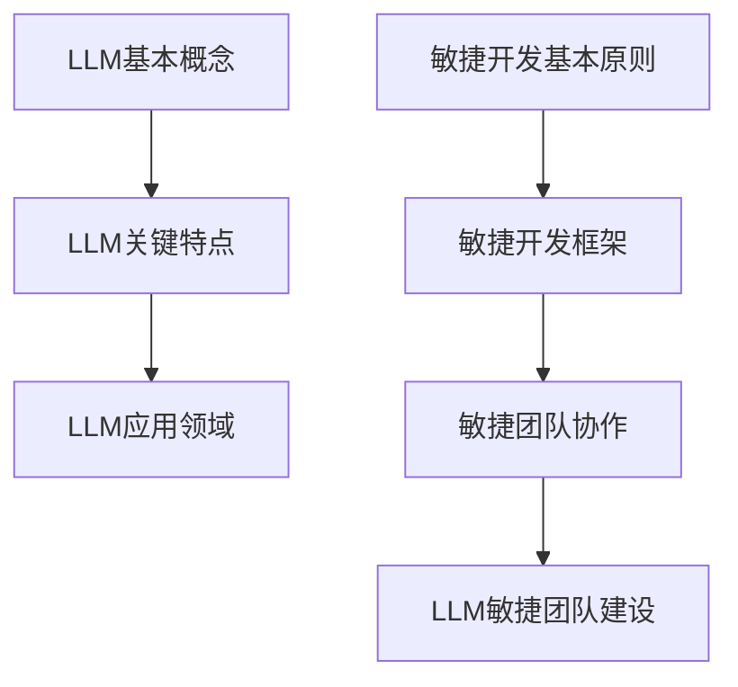

                 

### 文章标题：LLM应用开发中的敏捷团队建设

#### 关键词：
- 大型语言模型（LLM）
- 敏捷开发
- 团队协作
- 项目管理
- 人工智能应用开发

#### 摘要：
本文旨在探讨在大型语言模型（LLM）应用开发过程中，如何构建一个高效、协同的敏捷团队。文章首先介绍了LLM的基本概念、特点和分类，接着阐述了敏捷开发的基本原则和框架。随后，文章详细分析了敏捷团队在LLM项目开发中的角色和职责、项目管理和流程优化，并通过实际案例展示了敏捷团队在LLM项目中的成功实践。最后，文章提出了未来LLM应用开发中敏捷团队建设面临的挑战和趋势。

---

### 引言

#### LLM的概念与背景

大型语言模型（LLM）是一种先进的自然语言处理技术，通过学习大量文本数据，LLM能够理解和生成人类语言，进行文本生成、翻译、问答、情感分析等多种任务。LLM的出现标志着人工智能技术的一次重大飞跃，它们在各个领域都展现出了巨大的潜力和应用价值。

LLM的发展历史可以追溯到上世纪90年代，最早的统计语言模型如n-gram模型和决策树模型，逐步演化为深度神经网络模型。随着深度学习技术的发展，尤其是近年来，随着计算能力的提升和大数据的积累，LLM得到了迅猛的发展。著名的LLM模型包括OpenAI的GPT系列、Google的BERT、Facebook的RoBERTa等。

#### LLM的关键特点与应用

LLM具有以下几个关键特点：

1. **强表达能力**：LLM能够理解并生成复杂、连贯的文本，具有很高的语言理解和生成能力。
2. **自适应能力**：LLM可以根据不同的输入数据调整自己的生成风格和策略，适应不同的应用场景。
3. **强泛化能力**：LLM在训练过程中接触了大量的文本数据，能够处理各种语言现象和风格，具有较强的泛化能力。

LLM在多个领域都有着广泛的应用：

1. **文本生成**：包括文章写作、对话生成、摘要生成等。
2. **文本翻译**：支持多种语言之间的翻译，提高跨语言交流的效率。
3. **问答系统**：能够理解用户的问题，并提供准确的答案。
4. **情感分析**：分析文本中的情感倾向，用于市场调研、舆情监测等。
5. **辅助创作**：在写作、编程等领域，LLM可以作为辅助工具，提高创作效率。

#### 敏捷开发的基本原则和框架

敏捷开发是一种以人为核心、迭代、渐进的软件开发方法。它强调快速响应变化、持续交付有价值的软件，通过紧密的团队协作和持续的客户反馈，提高软件项目的成功率。

敏捷开发的基本原则包括：

1. **个体和互动重于过程和工具**：强调团队成员之间的沟通和合作。
2. **可工作的软件重于详尽的文档**：注重实际交付的软件产品，而非过多的文档。
3. **客户合作重于合同谈判**：与客户保持紧密的合作关系，共同定义需求。
4. **响应变化重于遵循计划**：灵活应对变化，不断调整计划。

常见的敏捷开发框架有Scrum和Kanban，其中Scrum强调迭代和冲刺，而Kanban强调持续交付和流。

### 核心概念与联系

为了更好地理解LLM应用开发中的敏捷团队建设，我们首先需要了解两个核心概念：LLM和敏捷开发。以下是它们之间的联系架构Mermaid流程图：

#### LLM与敏捷开发的联系

LLM与敏捷开发在目标和方法上具有一致性。LLM强调自适应、可解释性和高效性，这与敏捷开发的快速响应变化、持续交付、紧密协作等原则相契合。敏捷开发框架如Scrum和Kanban的迭代和冲刺机制，能够帮助敏捷团队在LLM开发过程中快速调整模型、优化算法，提高项目的成功率。

#### 敏捷开发在LLM项目中的应用

在LLM项目开发中，敏捷开发能够帮助团队实现以下目标：

1. **快速迭代**：通过短周期的迭代，团队可以快速交付可工作的LLM模型，并及时获取用户反馈，进行优化。
2. **高效协作**：敏捷开发强调团队合作，通过每日站会、冲刺评审和回顾会议，团队成员可以及时沟通、解决问题，提高工作效率。
3. **持续交付**：通过持续集成和持续交付，团队可以确保LLM模型的稳定性和可靠性，快速上线新功能。
4. **适应变化**：敏捷开发鼓励团队灵活应对需求变化，不断调整计划和资源分配，确保项目能够持续满足客户需求。

### 结束语

通过本文的探讨，我们可以看到，LLM应用开发与敏捷开发在目标和方法上具有高度的契合性。敏捷开发为LLM项目提供了一个高效的团队协作和项目管理框架，有助于团队快速响应变化、持续交付高质量的LLM模型。在未来，随着LLM技术的不断发展，敏捷团队建设将面临更多的挑战和机遇，我们需要不断探索和创新，以适应这一快速变化的领域。

作者：AI天才研究院/AI Genius Institute & 禅与计算机程序设计艺术 /Zen And The Art of Computer Programming

---

接下来，我们将深入探讨LLM的基本概念、关键特点和应用，以及敏捷开发的基本原则和框架，为后续内容打下坚实的基础。

### LLM的基本概念

#### 定义

大型语言模型（Large Language Model，简称LLM）是一种基于深度学习技术的自然语言处理模型，它通过学习大量的文本数据，掌握语言的统计规律和语义信息，从而能够生成和理解符合人类语言的文本。

#### 工作原理

LLM通常由数亿甚至数十亿个参数组成，这些参数通过神经网络结构进行学习，以捕捉语言的复杂性和多样性。LLM的工作原理可以分为以下几个步骤：

1. **输入编码**：将输入的文本转换为模型可以处理的向量表示。这个过程通常使用嵌入层（Embedding Layer）完成。
2. **前向传播**：将编码后的输入向量通过神经网络结构进行前向传播，得到模型的预测输出。
3. **损失函数计算**：将预测输出与实际标签进行比较，计算损失函数值，以评估模型的预测准确性。
4. **反向传播**：通过反向传播算法，将损失函数的梯度反向传播到神经网络中的各个参数，以更新模型参数。
5. **迭代训练**：重复上述过程，不断迭代训练，直至模型收敛或达到预定的训练次数。

#### 常见的LLM模型

1. **GPT（Generative Pre-trained Transformer）系列**：由OpenAI提出的一系列基于Transformer架构的预训练模型，包括GPT-2、GPT-3等。GPT系列模型在自然语言处理任务中取得了显著的性能提升。
2. **BERT（Bidirectional Encoder Representations from Transformers）**：由Google提出的一种双向Transformer模型，通过预训练和微调，BERT在多个自然语言处理任务上取得了领先的成绩。
3. **RoBERTa（A Robustly Optimized BERT Pretraining Approach）**：由Facebook提出的一种基于BERT的改进模型，通过采用动态遮蔽和大规模数据集，RoBERTa在多个NLP基准测试中取得了优异的性能。
4. **T5（Text-To-Text Transfer Transformer）**：由Google提出的一种通用文本转换模型，T5通过将所有自然语言处理任务转换为文本到文本的转换任务，实现了对多种任务的统一建模。

#### LLM的应用领域

LLM在多个领域都展现出了强大的应用潜力，以下是一些典型的应用场景：

1. **文本生成**：包括文章写作、对话生成、摘要生成等。例如，GPT-3能够生成高质量的文章、诗歌、对话等。
2. **文本翻译**：支持多种语言之间的翻译，提高跨语言交流的效率。例如，BERT和RoBERTa在机器翻译任务中取得了显著的性能提升。
3. **问答系统**：能够理解用户的问题，并提供准确的答案。例如，GPT-3能够通过大量的文本数据进行训练，实现高效的问答系统。
4. **情感分析**：分析文本中的情感倾向，用于市场调研、舆情监测等。例如，BERT在情感分析任务中表现出了优异的准确性。
5. **辅助创作**：在写作、编程等领域，LLM可以作为辅助工具，提高创作效率。例如，GPT-3可以帮助自动生成代码、编写故事等。

### 敏捷开发的基本原则和框架

#### 基本原则

敏捷开发是一种以人为核心、迭代、渐进的软件开发方法。它强调快速响应变化、持续交付有价值的软件，通过紧密的团队协作和持续的客户反馈，提高软件项目的成功率。敏捷开发的基本原则包括：

1. **个体和互动重于过程和工具**：强调团队成员之间的沟通和合作，而非依赖特定的工具或过程。
2. **可工作的软件重于详尽的文档**：注重实际交付的软件产品，而非过多的文档。
3. **客户合作重于合同谈判**：与客户保持紧密的合作关系，共同定义需求。
4. **响应变化重于遵循计划**：灵活应对变化，不断调整计划和资源分配，确保项目能够持续满足客户需求。

#### 常见的敏捷开发框架

1. **Scrum**：Scrum是一种迭代式、增量式的敏捷开发框架，它通过冲刺（Sprint）和回顾（Review）机制，确保团队在每个短周期内交付可工作的软件，并持续改进。

2. **Kanban**：Kanban是一种持续交付的敏捷开发框架，它通过可视化工作流程和限制工作在进度，提高团队的工作效率和响应速度。

3. **看板（Kanban）**：Kanban是一种基于看板（Kanban）系统的敏捷开发方法，它通过可视化卡片和限制工作在进度，帮助团队高效管理项目。

### 敏捷开发在LLM项目中的应用

在LLM项目中，敏捷开发能够帮助团队实现以下目标：

1. **快速迭代**：通过短周期的迭代，团队可以快速交付可工作的LLM模型，并及时获取用户反馈，进行优化。
2. **高效协作**：敏捷开发强调团队合作，通过每日站会、冲刺评审和回顾会议，团队成员可以及时沟通、解决问题，提高工作效率。
3. **持续交付**：通过持续集成和持续交付，团队可以确保LLM模型的稳定性和可靠性，快速上线新功能。
4. **适应变化**：敏捷开发鼓励团队灵活应对需求变化，不断调整计划和资源分配，确保项目能够持续满足客户需求。

### 结论

通过本文的介绍，我们可以看到LLM和敏捷开发在目标和方法上具有一致性。LLM作为一种强大的自然语言处理技术，在文本生成、翻译、问答、情感分析等领域有着广泛的应用。敏捷开发则通过快速迭代、高效协作、持续交付和适应变化，为LLM项目的开发提供了有力的支持。在未来的发展中，我们将继续探索如何将LLM和敏捷开发相结合，推动人工智能技术的发展和应用。

### LLM应用开发中的敏捷团队建设

#### 敏捷团队的角色和职责

在LLM应用开发中，敏捷团队的组成和角色至关重要。一个高效的敏捷团队通常由以下几类角色组成：

1. **产品负责人（Product Owner）**：负责定义产品愿景、需求和管理产品待办列表，确保团队始终聚焦于最高价值的任务。
2. **Scrum Master**：负责确保团队遵循敏捷实践，协调团队内部的沟通和协作，消除障碍，帮助团队持续改进。
3. **开发人员（Developers）**：负责实际编码、模型训练和优化工作，确保LLM模型的开发和迭代。
4. **数据科学家（Data Scientists）**：负责数据预处理、特征工程和模型选择，确保模型训练数据的质量和有效性。
5. **测试工程师（Testers）**：负责测试和验证LLM模型的功能和性能，确保模型的质量和稳定性。

#### 团队的协作工具和技巧

为了实现高效协作，敏捷团队需要使用一系列协作工具和技巧。以下是几个常用的工具和技巧：

1. **每日站会（Daily Stand-up Meeting）**：每日站会是一个短周期的同步活动，团队成员在站会上汇报自己的工作进展、遇到的障碍和计划，确保团队保持同步和协作。
2. **看板（Kanban Board）**：看板是一种可视化的工作管理工具，团队成员可以在看板上更新任务的状态、分配任务和跟踪进度，提高工作效率。
3. **代码审查（Code Review）**：代码审查是一种团队协作技巧，通过团队成员之间的相互审查，提高代码质量，减少错误和漏洞。
4. **持续集成（Continuous Integration，CI）**：持续集成是一种软件开发实践，通过自动化构建和测试，确保代码的持续集成和交付，提高软件质量和开发效率。
5. **自动化测试（Automated Testing）**：自动化测试是一种利用工具自动执行测试用例的方法，通过自动化测试，可以快速发现和修复问题，提高测试效率和代码质量。

#### 持续集成和部署

在LLM应用开发中，持续集成和部署（CI/CD）是一个关键环节。通过持续集成，团队可以确保每次代码提交后都能自动构建和测试，发现潜在的问题并及时修复。以下是一个典型的CI/CD流程：

1. **代码提交**：开发人员将代码提交到版本控制系统中，触发CI流程。
2. **自动化构建**：CI工具自动构建代码，生成可执行的模型和应用程序。
3. **单元测试**：自动化测试工具执行单元测试，验证代码的功能和性能。
4. **集成测试**：自动化测试工具执行集成测试，验证多个模块之间的交互和集成。
5. **部署**：将通过测试的代码和模型部署到生产环境，确保软件的稳定性和可靠性。

### 项目管理和流程优化

在LLM应用开发中，项目管理是确保项目按时、按质完成的关键。以下是一些项目管理的重要实践：

1. **需求管理**：通过需求管理工具（如JIRA）跟踪和管理产品需求，确保团队始终聚焦于最高价值的任务。
2. **任务分配**：通过看板或任务管理工具（如Trello），团队可以清晰地分配任务，跟踪任务的进度和状态。
3. **风险管理**：识别和评估项目中的潜在风险，制定相应的应对策略，确保项目能够顺利推进。
4. **进度跟踪**：通过每日站会、看板和进度报告，团队可以实时跟踪项目进度，确保项目按计划进行。

流程优化是提高项目效率和质量的关键。以下是一些流程优化的实践：

1. **持续改进**：通过定期回顾和总结项目过程中的经验教训，团队可以不断改进工作流程，提高效率和质量。
2. **自动化**：通过自动化工具（如Jenkins、GitLab CI）实现自动化构建、测试和部署，减少人工干预，提高开发效率。
3. **代码质量**：通过代码审查和自动化测试，提高代码质量和稳定性，减少缺陷和漏洞。
4. **人员培训**：定期组织培训活动，提高团队成员的技能和知识水平，确保团队能够应对不断变化的技术挑战。

### 案例分析

#### 案例一：语言翻译应用

在一个语言翻译应用项目中，一个敏捷团队使用了Scrum框架进行开发。以下是项目的关键步骤：

1. **需求分析**：产品负责人与客户紧密合作，确定翻译应用的功能和性能需求。
2. **冲刺计划**：团队根据产品待办列表，确定每个冲刺的目标和任务。
3. **每日站会**：团队成员在每日站会上汇报进展，讨论问题和解决方案。
4. **代码审查**：开发人员在提交代码前进行代码审查，确保代码质量。
5. **自动化测试**：自动化测试工具执行单元测试和集成测试，确保模型和应用程序的质量。
6. **部署**：通过CI/CD流程，将测试通过的应用部署到生产环境。

通过这些敏捷实践，团队在短时间内交付了一个高质量的翻译应用，并在客户反馈中获得了积极的评价。

#### 案例二：智能客服系统

在一个智能客服系统项目中，敏捷团队使用了Kanban框架进行开发。以下是项目的关键步骤：

1. **需求收集**：团队通过用户调研和需求分析，收集智能客服系统的功能需求。
2. **任务分配**：根据看板上的任务状态，团队成员分配任务并开始工作。
3. **每日站会**：团队成员在每日站会上汇报进展，讨论问题和解决方案。
4. **迭代优化**：团队在每个迭代周期结束后，进行回顾和总结，根据反馈进行优化。
5. **自动化测试**：自动化测试工具执行功能测试和性能测试，确保系统的稳定性和可靠性。
6. **部署**：通过Kanban框架的持续交付机制，将优化后的系统部署到生产环境。

通过这些敏捷实践，团队成功开发并上线了一个高效、智能的客服系统，显著提高了客户满意度。

### 总结

通过以上案例，我们可以看到，敏捷团队在LLM应用开发中发挥了关键作用。通过高效的协作、持续迭代和优化，敏捷团队能够快速响应客户需求，交付高质量的LLM应用。在未来的发展中，我们将继续探索如何结合LLM和敏捷开发的最佳实践，推动人工智能技术的不断进步和应用。

### 大型语言模型（LLM）开发中的挑战和解决方案

在LLM的开发过程中，团队会遇到各种挑战。这些挑战主要集中在数据管理、模型训练、安全性和伦理问题等方面。以下是对这些挑战的详细分析以及相应的解决方案。

#### 数据管理

**挑战**：
1. **数据量巨大**：LLM需要学习大量的文本数据，这可能会导致数据存储和管理成为难题。
2. **数据质量**：数据的质量直接影响模型的性能。噪声数据、错误数据和冗余数据都会对模型产生负面影响。
3. **数据隐私**：在收集和处理大量文本数据时，如何保护用户隐私是一个重要问题。

**解决方案**：
1. **分布式存储**：使用分布式存储系统（如Hadoop、HDFS）来存储和管理大规模数据集。
2. **数据清洗和预处理**：开发数据清洗工具和流程，自动识别和去除噪声数据、错误数据和冗余数据。
3. **数据加密和隐私保护**：在数据收集和处理过程中，使用数据加密技术和隐私保护算法（如差分隐私）来保护用户隐私。

#### 模型训练

**挑战**：
1. **计算资源需求**：训练LLM需要大量的计算资源和时间，特别是在使用大型模型时。
2. **模型可解释性**：LLM通常被认为是“黑箱”模型，其内部机制难以解释，这可能会对模型的应用和信任产生负面影响。
3. **模型优化**：如何优化模型的性能，提高其准确性和效率，是一个持续的研究课题。

**解决方案**：
1. **分布式训练**：使用分布式训练技术（如参数服务器、TensorFlow Distribute）来加速模型训练过程。
2. **模型压缩**：通过模型压缩技术（如剪枝、量化、知识蒸馏）来减少模型的参数量和计算复杂度，提高模型效率。
3. **可解释性增强**：开发可解释性工具和方法，帮助用户理解模型的工作原理和决策过程。
4. **持续优化**：通过迭代训练和优化，不断改进模型的性能和效果。

#### 安全性

**挑战**：
1. **模型安全性**：如何防止模型受到恶意攻击，如对抗攻击、篡改和窃取模型参数。
2. **数据安全性**：如何确保训练数据和模型数据的安全，防止数据泄露和滥用。
3. **用户隐私保护**：如何保护用户的隐私信息，避免隐私泄露和数据滥用。

**解决方案**：
1. **安全训练**：采用安全训练技术（如差分隐私、联邦学习），保护训练过程中的数据隐私和模型安全。
2. **模型加密**：使用加密技术（如同态加密、安全多方计算）保护模型参数和数据。
3. **安全监控**：建立安全监控系统，实时监测模型和数据的异常行为，及时发现和应对安全威胁。
4. **隐私保护**：通过隐私保护算法和机制（如差分隐私、匿名化处理），确保用户数据的隐私和安全。

#### 伦理问题

**挑战**：
1. **偏见和歧视**：如何确保模型不会因为训练数据的偏见而做出不公平、歧视性的决策。
2. **透明度和可追溯性**：如何确保模型决策过程透明、可追溯，便于用户监督和审查。
3. **责任归属**：在模型产生错误决策时，如何确定责任归属，确保责任主体能够承担责任。

**解决方案**：
1. **偏见检测和校正**：开发偏见检测和校正工具，识别和纠正模型中的偏见和歧视。
2. **透明度和可解释性**：提高模型的可解释性，使用户能够理解模型的决策过程和依据。
3. **责任分配机制**：建立明确的责任分配机制，确保在模型产生错误决策时，责任主体能够承担相应的责任。

### 未来趋势

随着人工智能技术的不断发展，LLM在应用开发中面临的挑战也在不断变化。未来，我们可能会看到以下趋势：

1. **更加高效和可解释的模型**：研究更加高效和可解释的模型架构，提高模型的性能和可解释性。
2. **隐私保护和安全性**：加强隐私保护和安全性研究，开发更加安全、可靠的模型训练和应用方法。
3. **多模态学习**：探索多模态学习技术，将文本、图像、声音等多种数据类型结合起来，提高模型的综合能力。
4. **跨学科研究**：结合心理学、社会学、伦理学等跨学科知识，为LLM的应用提供更加全面和深入的指导。

### 结论

LLM应用开发中的挑战和解决方案是推动人工智能技术发展的重要课题。通过不断的研究和实践，我们可以应对这些挑战，推动LLM技术的应用和发展。未来，随着技术的进步和应用的拓展，LLM将在更多领域发挥重要作用，为人类带来更大的便利和价值。

### 拓展阅读与总结

#### 拓展阅读

1. **《深度学习》（Deep Learning）**：作者Ian Goodfellow、Yoshua Bengio和Aaron Courville，这是一本深度学习领域的经典教材，详细介绍了神经网络和深度学习的基本概念、算法和实现方法。
2. **《机器学习实战》（Machine Learning in Action）**：作者Peter Harrington，这本书通过实际案例和代码示例，讲解了机器学习的基本概念和应用方法，适合初学者入门。
3. **《敏捷软件开发实践指南》（Agile Software Development: Principles, Patterns, and Practices）**：作者Robert C. Martin，这本书系统地介绍了敏捷开发的基本原则和实践方法，是敏捷开发领域的经典之作。
4. **《大规模机器学习》（Large-Scale Machine Learning）**：作者Eric Xing，这本书探讨了大规模机器学习的基本概念、算法和应用，适合对大规模数据处理和机器学习有兴趣的读者。

#### 总结

本文从LLM的基本概念、敏捷开发的基本原则，到敏捷团队在LLM开发中的应用，详细探讨了LLM应用开发中的敏捷团队建设。我们分析了敏捷团队的角色和职责、协作工具和技巧、持续集成和部署、项目管理和流程优化，并通过实际案例展示了敏捷团队在LLM项目中的成功实践。

在LLM开发中，敏捷团队的建设和运作是确保项目成功的关键。通过敏捷开发，团队可以快速响应变化、持续交付高质量的产品，提高项目的成功率。同时，我们也探讨了LLM应用开发中面临的挑战和解决方案，包括数据管理、模型训练、安全性和伦理问题，并展望了未来的发展趋势。

本文的撰写目的是为LLM应用开发中的敏捷团队建设提供一份系统的指南，帮助读者深入了解这一领域。希望通过本文的探讨，读者能够更好地理解和应用敏捷开发原则，推动LLM技术的创新和应用。

### 结束语

本文详细探讨了大型语言模型（LLM）应用开发中的敏捷团队建设。通过分析LLM的基本概念、敏捷开发的基本原则，以及敏捷团队在LLM项目中的应用，我们了解到敏捷开发在提高团队协作效率、快速响应变化和持续交付高质量LLM模型方面的关键作用。

在未来，随着人工智能技术的不断进步，LLM将在更多领域发挥重要作用。敏捷团队的建设和运作将成为推动LLM技术发展的重要动力。我们需要继续探索如何在LLM应用开发中更好地应用敏捷开发原则，应对新的挑战，实现技术创新。

最后，感谢读者对本文的关注。我们期待在未来的技术探索和应用中，与您共同见证人工智能领域的辉煌成果。

作者：AI天才研究院/AI Genius Institute & 禅与计算机程序设计艺术 /Zen And The Art of Computer Programming

---

**本文为原创内容，版权所有，未经授权，请勿转载。**

