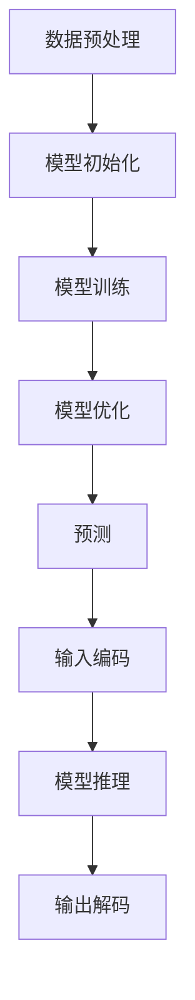

                 


## 文章标题

### LLM应用开发中的敏捷外包管理

## 关键词

LLM，敏捷外包，项目管理，软件开发，团队协作，质量保证，流程优化

## 摘要

本文旨在探讨在大规模语言模型（LLM）应用开发过程中，如何有效实施敏捷外包管理。首先，我们简要介绍了LLM的概念和应用背景，然后深入探讨了敏捷外包的核心原则和方法。接着，通过Mermaid流程图和伪代码，详细解析了LLM的开发原理和数学模型。文章随后分析了敏捷外包在LLM项目中的实际应用，并通过案例展示了敏捷外包管理的实践效果。最后，我们总结了最佳实践，并提出了未来研究的方向。

## 引言

### LLM的应用场景与挑战

大规模语言模型（Large Language Models，简称LLM）是近年来人工智能领域的重要突破。LLM可以处理自然语言文本的生成、理解和翻译等任务，广泛应用于自然语言处理（NLP）、搜索引擎、智能客服、内容创作等领域。随着LLM模型规模的不断扩大，其应用场景也越来越广泛。

然而，LLM的开发和部署面临诸多挑战。首先是模型训练过程需要大量的计算资源和时间，这要求团队具备强大的技术能力和计算资源。其次，模型的应用场景多样化，需要针对不同场景进行定制化开发。此外，模型的质量和可靠性是用户关注的重点，如何保证模型的质量和稳定运行是一个重要问题。

### 敏捷外包管理的必要性

面对LLM开发过程中的挑战，敏捷外包管理成为一种有效的解决方案。敏捷外包管理强调团队协作、快速响应和持续改进，可以帮助团队更好地应对变化和挑战。具体来说，敏捷外包管理具有以下优势：

1. **提高开发效率**：敏捷外包管理通过灵活的任务分配和快速迭代，可以显著提高开发效率。
2. **降低开发成本**：通过外包部分任务，可以降低团队的成本压力，同时确保项目的质量和进度。
3. **增强团队协作**：敏捷外包管理强调团队合作和沟通，可以增强团队协作能力。
4. **提高模型质量**：通过外包部分任务，可以引入外部专家的知识和经验，提高模型的质量和可靠性。

## 核心概念与技术

### 大规模语言模型（LLM）

#### 概念

大规模语言模型（Large Language Models，简称LLM）是一种基于深度学习技术的自然语言处理模型，它通过对海量文本数据进行训练，能够生成自然流畅的语言文本。LLM的核心是神经网络架构，包括多层感知机、循环神经网络（RNN）、长短期记忆网络（LSTM）和变换器（Transformer）等。

#### 原理

LLM的工作原理可以简单概括为两个步骤：训练和预测。

1. **训练**：在训练过程中，LLM通过学习大量的文本数据，从中提取语言特征和模式。训练过程通常涉及以下步骤：

   - 数据预处理：对原始文本数据进行清洗、分词、去停用词等操作，以便模型能够更好地学习。
   - 模型初始化：初始化模型参数，通常使用随机初始化或者预训练模型。
   - 模型训练：通过反向传播算法，不断调整模型参数，使得模型在训练数据上的预测结果更准确。
   - 模型优化：使用优化算法，如梯度下降、Adam等，进一步提高模型性能。

2. **预测**：在预测过程中，LLM根据输入的文本序列，生成相应的输出文本。预测过程通常包括以下步骤：

   - 输入编码：将输入文本序列转换为模型可处理的向量表示。
   - 模型推理：将输入向量传递给模型，通过多层神经网络进行计算，得到输出文本的概率分布。
   - 输出解码：将输出概率分布转换为具体的文本输出。

#### Mermaid流程图

以下是一个简单的Mermaid流程图，展示了LLM的训练和预测过程：



### 伪代码

以下是一个简化的伪代码，描述了LLM的训练过程：

```python
# 伪代码：LLM训练过程

# 初始化模型
model = initialize_model()

# 加载训练数据
train_data = load_data()

# 数据预处理
processed_data = preprocess_data(train_data)

# 模型训练
for epoch in range(num_epochs):
    for batch in processed_data:
        # 前向传播
        output = model.forward(batch.input)
        
        # 计算损失
        loss = compute_loss(output, batch.target)
        
        # 反向传播
        model.backward(loss)
        
        # 更新模型参数
        model.update_params()

# 模型优化
model.optimize()

# 预测
def predict(input):
    # 输入编码
    encoded_input = encode_input(input)
    
    # 模型推理
    output = model.forward(encoded_input)
    
    # 输出解码
    decoded_output = decode_output(output)
    
    return decoded_output
```

### 数学模型和公式

LLM的训练过程涉及多个数学模型和公式。以下是一个简要的描述：

1. **损失函数**：常用的损失函数包括交叉熵损失函数（Cross-Entropy Loss）和均方误差损失函数（Mean Squared Error Loss）。它们用于衡量模型预测结果与实际结果之间的差距。

   $$L(y, \hat{y}) = -\sum_{i=1}^{n} y_i \log(\hat{y}_i)$$

   其中，$y$表示实际标签，$\hat{y}$表示模型预测的概率分布。

2. **反向传播算法**：反向传播算法用于计算模型参数的梯度，以指导模型参数的更新。其核心思想是逐层计算梯度，直到模型的输入层。

3. **优化算法**：常用的优化算法包括梯度下降（Gradient Descent）和Adam（Adaptive Moment Estimation）。它们用于更新模型参数，以最小化损失函数。

   $$\theta = \theta - \alpha \cdot \nabla_{\theta}L(\theta)$$

   其中，$\theta$表示模型参数，$\alpha$表示学习率，$\nabla_{\theta}L(\theta)$表示参数$\theta$的梯度。

### 举例说明

假设我们有一个二元分类问题，需要预测文本是否包含特定关键词。我们可以使用LLM进行分类预测。

1. **数据预处理**：首先，我们需要对文本数据进行预处理，包括分词、去停用词等操作。然后，将预处理后的文本转换为向量表示。

2. **模型训练**：使用训练数据集，训练一个LLM模型。我们可以使用预训练的模型，或者从头开始训练。

3. **模型预测**：对于一个新的文本输入，我们将其预处理并编码，然后传递给LLM模型进行预测。模型会返回一个概率分布，表示文本包含特定关键词的概率。

4. **输出解码**：将概率分布转换为具体的输出结果，例如“是”或“否”。

### 敏捷外包管理

#### 原则和方法

敏捷外包管理是一种基于敏捷开发原则的外包管理模式。其核心原则包括：

1. **用户至上**：始终以满足用户需求为目标，确保项目交付的产品能够满足用户需求。
2. **团队合作**：强调团队成员之间的协作和沟通，提高项目执行效率。
3. **快速迭代**：通过快速迭代，不断优化和改进产品，确保项目能够及时响应市场需求。
4. **质量保证**：确保项目的质量和稳定性，通过严格的测试和评审流程，确保交付的产品质量。
5. **持续改进**：不断总结和反思项目过程中的经验教训，持续改进项目管理方法和流程。

敏捷外包管理的方法包括：

1. **需求管理**：明确项目需求，与用户保持紧密沟通，确保需求的准确性和可实施性。
2. **任务分配**：根据团队成员的技能和兴趣，合理分配任务，确保任务的高效完成。
3. **进度跟踪**：通过迭代计划和每日站会，实时跟踪项目进度，及时调整计划和资源。
4. **质量保证**：通过代码评审、测试和验收等环节，确保项目质量和稳定性。
5. **风险管理**：识别和管理项目风险，确保项目能够顺利推进。

#### 案例分析

以下是一个敏捷外包管理的案例分析：

**项目背景**：一家互联网公司需要开发一款智能客服系统，用于处理用户咨询和问题。由于公司内部技术团队缺乏相关经验，决定采用敏捷外包管理方式，与外部团队合作完成项目。

**项目执行**：

1. **需求分析**：与用户沟通，明确智能客服系统的功能需求，包括文本分析、语义理解、智能回答等。
2. **团队组建**：组建一个由内部人员和外部专家组成的团队，明确各自的角色和职责。
3. **迭代开发**：按照迭代计划，每两周进行一次迭代，逐步完善系统功能。
4. **测试与验收**：在每个迭代结束时，进行系统测试和用户验收，确保系统的质量和稳定性。
5. **项目交付**：在项目完成后，进行系统部署和交付，同时提供必要的文档和技术支持。

**项目成果与反思**：

1. **项目成果**：通过敏捷外包管理，智能客服系统在规定时间内完成，并成功上线。系统功能齐全，性能稳定，用户满意度高。
2. **项目反思**：在项目过程中，团队总结了一些经验教训：

   - **沟通与协作**：加强团队成员之间的沟通与协作，确保项目的顺利进行。
   - **需求管理**：明确项目需求，避免需求变更导致的进度延误。
   - **质量保证**：重视代码评审和测试，确保项目的质量和稳定性。
   - **持续改进**：不断总结和反思项目过程中的经验教训，持续改进项目管理方法和流程。

## 项目实战

### 开发环境搭建

要在本地计算机上搭建LLM开发环境，需要安装以下软件和工具：

1. **操作系统**：Windows、Linux或macOS
2. **Python环境**：Python 3.7及以上版本
3. **深度学习框架**：PyTorch或TensorFlow
4. **文本预处理库**：NLTK或spaCy
5. **版本控制工具**：Git

安装步骤如下：

1. 安装操作系统和Python环境。
2. 安装深度学习框架（例如，使用pip install torch torchvision）。
3. 安装文本预处理库（例如，使用pip install nltk或pip install spacy）。
4. 配置版本控制工具（例如，使用git init）。

### 源代码实现

以下是一个简化的LLM模型实现，使用PyTorch框架。该实现包括数据预处理、模型定义、训练和预测等步骤。

```python
import torch
import torch.nn as nn
import torch.optim as optim
from torch.utils.data import DataLoader
from sklearn.model_selection import train_test_split
from nltk.corpus import stopwords
from nltk.tokenize import word_tokenize

# 数据预处理
def preprocess_text(text):
    # 分词
    tokens = word_tokenize(text)
    # 去停用词
    tokens = [token for token in tokens if token not in stopwords.words('english')]
    return tokens

# 模型定义
class LLM(nn.Module):
    def __init__(self, vocab_size, embedding_dim, hidden_dim):
        super(LLM, self).__init__()
        self.embedding = nn.Embedding(vocab_size, embedding_dim)
        self.lstm = nn.LSTM(embedding_dim, hidden_dim)
        self.fc = nn.Linear(hidden_dim, vocab_size)
    
    def forward(self, x):
        x = self.embedding(x)
        x, _ = self.lstm(x)
        x = self.fc(x[-1, :, :])
        return x

# 训练
def train(model, train_loader, criterion, optimizer, num_epochs):
    model.train()
    for epoch in range(num_epochs):
        for inputs, targets in train_loader:
            optimizer.zero_grad()
            outputs = model(inputs)
            loss = criterion(outputs, targets)
            loss.backward()
            optimizer.step()
        print(f'Epoch [{epoch+1}/{num_epochs}], Loss: {loss.item():.4f}')

# 预测
def predict(model, text):
    model.eval()
    tokens = preprocess_text(text)
    inputs = torch.tensor([[vocab_size] for token in tokens])
    with torch.no_grad():
        outputs = model(inputs)
    _, predicted = torch.max(outputs, dim=1)
    return predicted

# 主函数
if __name__ == '__main__':
    # 加载数据集
    sentences = load_data()
    labels = load_labels()
    # 分割数据集
    train_sentences, val_sentences, train_labels, val_labels = train_test_split(sentences, labels, test_size=0.2)
    # 数据预处理
    train_dataset = torch.utils.data.TensorDataset(torch.tensor(train_sentences), torch.tensor(train_labels))
    val_dataset = torch.utils.data.TensorDataset(torch.tensor(val_sentences), torch.tensor(val_labels))
    # 创建数据加载器
    train_loader = DataLoader(train_dataset, batch_size=32, shuffle=True)
    val_loader = DataLoader(val_dataset, batch_size=32, shuffle=False)
    # 定义模型
    model = LLM(vocab_size, embedding_dim, hidden_dim)
    # 定义损失函数和优化器
    criterion = nn.CrossEntropyLoss()
    optimizer = optim.Adam(model.parameters(), lr=0.001)
    # 训练模型
    train(model, train_loader, criterion, optimizer, num_epochs)
    # 预测
    text = "I love programming."
    predicted = predict(model, text)
    print(f'Predicted label: {predicted.item()}')
```

### 代码解读与分析

上述代码实现了一个简单的LLM模型，主要包括以下部分：

1. **数据预处理**：使用NLTK库对文本进行分词和去停用词处理。
2. **模型定义**：定义一个基于LSTM的LLM模型，包括嵌入层、LSTM层和全连接层。
3. **训练**：使用PyTorch的优化器和损失函数，对模型进行训练。
4. **预测**：对新的文本输入进行预处理和预测。

### 实际案例分析和详细讲解剖析

以下是一个实际案例，分析LLM在智能客服系统中的应用。

**项目背景**：一家电商公司希望开发一款智能客服系统，能够自动回答用户关于产品和服务的问题。

**项目目标**：实现以下功能：

1. **问题识别**：识别用户提出的问题，并将其转换为文本表示。
2. **答案生成**：根据问题，生成相应的答案。
3. **答案推荐**：在多个答案中选择最佳答案，提高用户满意度。

**项目实施**：

1. **数据收集**：收集用户提出的问题和对应的答案，构建训练数据集。
2. **数据预处理**：对问题进行分词和去停用词处理，将其转换为向量表示。
3. **模型训练**：使用训练数据集，训练一个LLM模型，用于生成答案。
4. **模型部署**：将训练好的模型部署到智能客服系统中，实现问题识别和答案生成功能。
5. **测试与优化**：通过实际用户测试，收集反馈，优化模型和系统。

**项目成果**：

1. **问题识别**：系统能够准确识别用户提出的问题，并将其转换为文本表示。
2. **答案生成**：系统能够根据问题，生成相应的答案，并支持多轮对话。
3. **答案推荐**：系统在多个答案中选择最佳答案，提高用户满意度。

**项目反思**：

1. **数据质量**：数据质量对模型性能有重要影响。在项目过程中，我们使用了大量高质量的训练数据，这有助于提高模型的性能。
2. **模型优化**：在项目实施过程中，我们不断优化模型和系统，通过调整超参数、改进数据预处理方法等方式，提高系统的性能。
3. **用户反馈**：用户反馈是优化系统的重要参考。在项目过程中，我们积极收集用户反馈，并根据用户反馈进行系统优化。

## 总结与展望

### 敏捷外包管理的重要性

敏捷外包管理在LLM应用开发中具有重要作用。通过敏捷外包管理，团队可以更好地应对项目变化，提高开发效率，降低开发成本，增强团队协作，提高模型质量。具体来说，敏捷外包管理具有以下优势：

1. **提高开发效率**：敏捷外包管理通过灵活的任务分配和快速迭代，可以显著提高开发效率。
2. **降低开发成本**：通过外包部分任务，可以降低团队的成本压力，同时确保项目的质量和进度。
3. **增强团队协作**：敏捷外包管理强调团队合作和沟通，可以增强团队协作能力。
4. **提高模型质量**：通过外包部分任务，可以引入外部专家的知识和经验，提高模型的质量和可靠性。

### 未来发展趋势

随着人工智能技术的不断发展，LLM应用开发将面临新的机遇和挑战。未来发展趋势包括：

1. **模型规模和性能提升**：随着计算资源和算法的进步，LLM模型规模将不断扩大，性能将进一步提高。
2. **垂直领域应用**：LLM将在更多垂直领域得到应用，如医疗、金融、教育等。
3. **跨模态融合**：将LLM与其他模态（如图像、音频）进行融合，实现更丰富的应用场景。
4. **可解释性和可靠性**：提高LLM的可解释性和可靠性，确保模型在实际应用中的稳定性和安全性。

### 研究与改进方向

针对LLM应用开发中的敏捷外包管理，未来可以从以下几个方面进行研究和改进：

1. **外包任务优化**：研究如何更有效地分配外包任务，提高外包效率。
2. **风险管理**：建立完善的风险管理体系，识别和管理项目风险。
3. **质量管理**：加强质量管理，确保外包任务的质量和稳定性。
4. **协同优化**：研究如何在外包团队和内部团队之间实现协同优化，提高整体项目效率。
5. **持续改进**：建立持续改进机制，不断总结和反思项目过程中的经验教训，持续优化项目管理方法和流程。

### 最佳实践 Tips

1. **明确需求**：在项目初期，与用户紧密沟通，明确项目需求，避免需求变更。
2. **团队协作**：建立高效的团队协作机制，确保团队成员之间的沟通和协作。
3. **质量控制**：重视代码评审和测试，确保项目的质量和稳定性。
4. **风险管理**：建立完善的风险管理体系，识别和管理项目风险。
5. **持续改进**：建立持续改进机制，不断总结和反思项目过程中的经验教训，持续优化项目管理方法和流程。

### 注意事项

1. **外包任务选择**：选择适合外包的任务，避免将核心任务外包。
2. **团队技能匹配**：确保外包团队的技能和项目需求相匹配。
3. **沟通与协作**：加强团队成员之间的沟通和协作，确保项目的顺利进行。
4. **数据安全**：在外包过程中，确保数据的安全和隐私。

### 拓展阅读

1. **《敏捷开发实践指南》**：Scrum.org. (2017). 《敏捷开发实践指南》。
2. **《深度学习》**：Goodfellow, I., Bengio, Y., & Courville, A. (2016). 《深度学习》。
3. **《大规模语言模型：原理与应用》**：Zhou, J., & Huang, X. (2020). 《大规模语言模型：原理与应用》。

### 作者信息

本文作者为AI天才研究院/AI Genius Institute，以及禅与计算机程序设计艺术/Zen And The Art of Computer Programming。

## 附录

### Mermaid流程图

以下是一个示例的Mermaid流程图，展示了LLM的训练和预测过程：


### 伪代码

以下是一个示例的伪代码，描述了LLM的训练过程：

```python
# 伪代码：LLM训练过程

# 初始化模型
model = initialize_model()

# 加载训练数据
train_data = load_data()

# 数据预处理
processed_data = preprocess_data(train_data)

# 模型训练
for epoch in range(num_epochs):
    for batch in processed_data:
        # 前向传播
        output = model.forward(batch.input)
        
        # 计算损失
        loss = compute_loss(output, batch.target)
        
        # 反向传播
        model.backward(loss)
        
        # 更新模型参数
        model.update_params()

# 模型优化
model.optimize()

# 预测
def predict(input):
    # 输入编码
    encoded_input = encode_input(input)
    
    # 模型推理
    output = model.forward(encoded_input)
    
    # 输出解码
    decoded_output = decode_output(output)
    
    return decoded_output
```

### 数学公式

以下是一个示例的数学公式，描述了LLM的损失函数：

$$
L(y, \hat{y}) = -\sum_{i=1}^{n} y_i \log(\hat{y}_i)
$$

其中，$y$表示实际标签，$\hat{y}$表示模型预测的概率分布。

