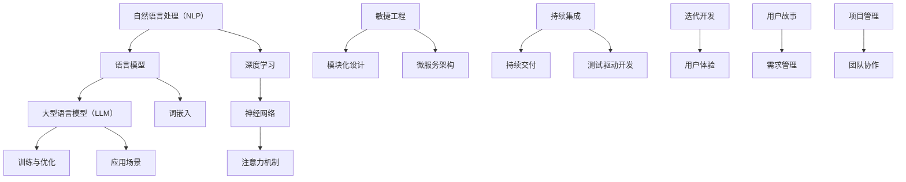

                 

## 文章标题：LLM应用开发中的敏捷工程技术架构设计

随着人工智能（AI）技术的迅猛发展，自然语言处理（NLP）领域取得了显著突破。其中，大型语言模型（LLM，如GPT、BERT等）的出现，极大地提升了文本生成的准确性和丰富性。LLM的应用范围广泛，包括文本分类、问答系统、机器翻译等，这为各行各业带来了前所未有的创新与变革。然而，随着模型的复杂度和应用场景的多样化，传统的软件开发方法逐渐暴露出诸多不足。此时，敏捷工程技术架构应运而生，为LLM应用开发提供了全新的解决方案。

本文旨在探讨LLM应用开发中的敏捷工程技术架构设计，从背景介绍、核心概念与联系、算法原理讲解、数学模型与公式、项目实战等多个角度，深入剖析敏捷工程技术在LLM开发中的应用。通过本文的阅读，读者将了解：

1. **LLM及其应用背景**：介绍LLM的基本概念、发展历程以及典型应用场景。
2. **核心概念与联系**：阐述NLP基础、LLM技术架构、深度学习算法、自然语言处理算法等核心概念及其之间的联系。
3. **算法原理讲解**：使用伪代码详细讲解LLM的核心算法原理，包括神经网络、反向传播算法、词性标注和句法分析等。
4. **数学模型与公式**：介绍概率模型和优化算法，使用LaTeX格式详细解释条件概率、贝叶斯定理、梯度下降法等。
5. **项目实战**：通过实际案例，详细讲解LLM应用开发中的环境搭建、源代码实现、代码解读和分析。
6. **敏捷工程技术架构**：探讨敏捷工程原则在LLM开发中的应用，包括模块化设计、微服务架构等。
7. **总结与展望**：总结本文的核心观点，展望LLM应用开发的未来挑战与趋势。

通过这篇文章，我们将一步步深入探讨LLM应用开发中的敏捷工程技术架构设计，为读者提供一套完整的技术解决方案。下面，我们将首先介绍LLM的基本概念及其在自然语言处理领域的应用。

### 关键词
- 大型语言模型（LLM）
- 敏捷工程
- 自然语言处理（NLP）
- 神经网络
- 深度学习
- 敏捷技术开发
- 持续集成
- 持续交付
- 微服务架构

### 文章摘要
本文深入探讨了大型语言模型（LLM）应用开发中的敏捷工程技术架构设计。首先，我们介绍了LLM的基本概念及其在自然语言处理领域的广泛应用。接着，我们详细讲解了NLP基础、LLM技术架构、深度学习算法和自然语言处理算法等核心概念，并使用伪代码详细阐述了其原理。随后，我们介绍了概率模型和优化算法，并使用LaTeX格式解释了相关数学公式。在实际项目部分，我们通过具体案例展示了如何进行LLM应用开发，并进行了详细代码解读和分析。最后，我们探讨了敏捷工程技术在LLM开发中的应用，包括模块化设计和微服务架构等，并总结了全文的核心观点，展望了未来的发展方向。文章结构清晰，内容丰富，旨在为读者提供一套完整的LLM应用开发技术解决方案。

### 背景介绍

自然语言处理（NLP）是人工智能（AI）领域的一个重要分支，其目标是使计算机能够理解、解释和生成人类语言。随着深度学习技术的飞速发展，NLP取得了显著的突破。大型语言模型（LLM，Large Language Model）作为NLP领域的重要工具，已经成为文本生成、情感分析、信息抽取等任务的强大驱动力。

LLM的核心思想是通过大量文本数据进行训练，使模型具备理解和生成自然语言的能力。早期的语言模型如基于规则的方法和统计模型，由于受到数据量和计算资源的限制，效果有限。随着深度学习技术的引入，神经网络模型逐渐成为主流。2018年，谷歌推出了BERT（Bidirectional Encoder Representations from Transformers），标志着NLP领域进入了新的阶段。BERT模型通过双向Transformer架构，在多个NLP任务上取得了卓越的表现，引发了大量研究者和开发者对LLM的兴趣。

LLM的应用范围非常广泛，包括但不限于以下领域：

1. **文本分类**：将文本数据分类到预定义的类别中，如新闻分类、垃圾邮件过滤等。LLM通过学习大量文本数据，能够识别文本中的关键信息，从而提高分类的准确性。

2. **问答系统**：构建智能问答系统，能够理解和回答用户的问题。LLM能够处理复杂的语义信息，提供更自然的问答体验。

3. **机器翻译**：将一种语言的文本翻译成另一种语言。LLM通过学习大量的双语文本数据，能够生成准确且自然的翻译结果。

4. **文本生成**：自动生成文本，如文章摘要、产品评论等。LLM能够根据输入的文本生成连贯、有逻辑的文本内容。

5. **对话系统**：构建智能对话系统，与用户进行自然对话。LLM能够理解用户输入，并生成相应的回复，为用户提供有效的帮助。

6. **内容推荐**：基于用户的历史行为和偏好，推荐相关的文本内容。LLM能够分析用户兴趣，提供个性化的推荐服务。

在商业和科研领域，LLM的应用场景日益丰富。例如，在金融领域，LLM可以用于自动生成财务报告、分析市场趋势；在医疗领域，LLM可以用于病历分析、疾病诊断；在教育领域，LLM可以用于自动批改作业、个性化教学等。

然而，随着LLM的广泛应用，其复杂性也不断增加。传统软件开发方法在处理LLM项目时，往往面临以下挑战：

1. **需求变化频繁**：LLM项目的需求经常变化，传统的水滴石穿方法（Waterfall Model）难以适应这种快速变化的需求。

2. **开发周期长**：由于LLM模型的训练和优化过程复杂，传统方法往往需要较长的开发周期。

3. **迭代效率低**：在传统方法中，每次迭代都需要完整地重新开发，导致迭代效率低下。

4. **维护困难**：LLM模型一旦部署，维护和更新较为困难，难以快速响应市场变化。

针对这些挑战，敏捷工程技术（Agile Engineering）应运而生。敏捷工程强调快速迭代、持续交付和持续改进，通过灵活应对需求变化，提高开发效率和产品质量。在LLM应用开发中，敏捷工程技术提供了以下优势：

1. **快速响应需求变化**：敏捷工程通过迭代开发，能够快速响应需求变化，确保项目能够及时交付。

2. **提高开发效率**：敏捷工程强调团队成员间的沟通和协作，通过缩短迭代周期，提高开发效率。

3. **持续交付**：敏捷工程通过持续交付，确保项目能够快速上线，并提供及时反馈。

4. **质量保障**：敏捷工程通过持续集成和测试，确保项目质量，减少缺陷和风险。

5. **灵活应对变化**：敏捷工程鼓励团队成员不断学习和适应新技术，提高项目的灵活性和可维护性。

本文将围绕LLM应用开发中的敏捷工程技术架构设计，系统地探讨其核心概念、算法原理、数学模型、项目实战以及敏捷工程技术在LLM开发中的应用。通过本文的阅读，读者将能够全面了解LLM应用开发的技术架构，掌握敏捷工程技术的核心原理和实践方法，为实际项目提供有力支持。

### 核心概念与联系

在探讨LLM应用开发中的敏捷工程技术架构设计时，首先需要明确几个核心概念，并理解它们之间的联系。以下是几个关键概念及其相互关系的Mermaid流程图：



#### 自然语言处理（NLP）

自然语言处理（NLP）是计算机科学、人工智能和语言学的交叉领域，旨在使计算机能够理解和生成自然语言。NLP的核心任务包括文本处理、语义理解、情感分析、命名实体识别等。NLP的基础技术包括文本分类、词性标注、句法分析、语义角色标注等。

NLP是LLM的基础，LLM通过对大量文本数据进行训练，学习语言的内在规律，从而实现理解和生成自然语言。因此，NLP技术的成熟和发展直接影响了LLM的性能和应用效果。

#### 语言模型

语言模型是NLP中的一个核心概念，它通过统计方法或机器学习方法，对自然语言的概率分布进行建模。早期语言模型如N-gram模型，基于文本中的相邻词序列进行建模。随着深度学习技术的发展，神经网络模型如循环神经网络（RNN）、长短期记忆网络（LSTM）和Transformer等，成为现代语言模型的主流。

语言模型是构建LLM的基础，LLM通过深度学习技术，从大规模文本数据中学习语言模式，生成更加准确和自然的文本。LLM不仅继承了传统语言模型的优点，还在处理复杂语言结构和生成高质量文本方面取得了显著突破。

#### 深度学习

深度学习是机器学习的一个重要分支，通过构建深度神经网络，对大量数据进行分析和特征提取。深度学习在图像识别、语音识别和自然语言处理等领域取得了重大突破。

在NLP领域，深度学习技术被广泛应用于构建语言模型和进行文本分类、情感分析等任务。例如，循环神经网络（RNN）和长短期记忆网络（LSTM）可以处理变长的序列数据，而Transformer架构通过自注意力机制，实现了对全局信息的有效处理。

#### 神经网络与注意力机制

神经网络是深度学习的基础，它通过多层节点（神经元）对输入数据进行处理和变换，实现从输入到输出的映射。在自然语言处理中，神经网络被用于构建语言模型和文本分类模型。

注意力机制是神经网络中的一个重要概念，它通过动态调整模型对输入数据的关注程度，实现对重要信息的聚焦和忽略。在语言模型中，注意力机制用于处理长文本序列，确保模型能够关注到文本中的关键信息。

#### 词嵌入与词性标注

词嵌入是将单词映射到高维空间中的向量表示，是语言模型中的关键技术。通过词嵌入，模型能够捕捉词与词之间的语义关系，从而提高文本处理的准确性。

词性标注是对文本中的每个单词进行词性分类，如名词、动词、形容词等。词性标注有助于模型理解文本的语法结构，为句法分析和语义理解提供基础。

#### 大型语言模型（LLM）

大型语言模型（LLM）是指通过大规模训练的、具有强大语言理解能力的模型。LLM的核心思想是通过学习大量文本数据，捕捉语言的本质规律，从而实现高质量的文本生成和理解。

LLM的应用场景广泛，包括文本分类、问答系统、机器翻译、文本生成等。LLM的出现，极大地提升了自然语言处理的能力和水平。

#### 训练与优化

训练与优化是构建LLM的关键环节。在训练过程中，模型通过不断调整参数，学习文本数据中的规律。优化技术如梯度下降法、随机梯度下降（SGD）等，用于加速训练过程，提高模型性能。

优化目标是使模型能够生成高质量、自然的文本，同时确保模型的泛化能力，避免过拟合。

#### 敏捷工程

敏捷工程是一种以用户需求为中心、强调迭代开发和持续交付的软件开发方法。敏捷工程强调团队成员之间的沟通和协作，通过快速迭代和持续反馈，确保项目能够及时交付和持续改进。

敏捷工程技术在LLM开发中的应用，主要体现在以下几个方面：

1. **模块化设计**：将LLM应用开发分解为多个模块，每个模块负责特定的功能，便于管理和维护。

2. **微服务架构**：将LLM应用拆分为多个微服务，每个微服务独立部署和运行，提高系统的可扩展性和灵活性。

3. **持续集成与持续交付**：通过持续集成和持续交付，确保LLM应用的每次迭代都能快速上线，并提供及时反馈。

4. **测试驱动开发**：在开发过程中，通过自动化测试确保代码质量，减少缺陷和风险。

5. **用户体验**：通过不断迭代和优化，确保LLM应用能够提供良好的用户体验。

#### 联系与整合

上述核心概念相互联系，共同构成了LLM应用开发的基础。NLP为LLM提供了理论和技术支持，深度学习和神经网络技术为LLM的训练和优化提供了强大的工具，词嵌入和词性标注技术提高了模型的语义理解能力。敏捷工程则通过灵活的软件开发方法，确保了LLM应用的高效开发和持续改进。

通过Mermaid流程图，我们可以清晰地看到各个概念之间的联系和整合方式。这为LLM应用开发提供了系统的理论框架，有助于读者更好地理解和应用这些技术。

在下一部分，我们将深入探讨LLM的核心算法原理，包括深度学习算法、自然语言处理算法及其在LLM中的应用。

### LLM的核心算法原理

大型语言模型（LLM）的核心算法原理主要基于深度学习和自然语言处理（NLP）领域的技术。本部分将详细讲解LLM的核心算法，包括深度学习算法和自然语言处理算法。我们将使用伪代码和步骤来阐述这些算法的基本原理。

#### 深度学习算法

深度学习算法是构建LLM的基础。以下是一个简单的深度学习算法伪代码，用于解释神经网络和反向传播算法的基本原理。

```python
# 深度学习算法伪代码

# 初始化参数
W1, b1 = 初始化权重和偏置
W2, b2 = 初始化权重和偏置
...
Wn, bn = 初始化权重和偏置

# 前向传播
def forwardPropagation(x):
    z1 = W1 * x + b1
    a1 = 激活函数(z1)
    z2 = W2 * a1 + b2
    a2 = 激活函数(z2)
    ...
    zn = Wn * an-1 + bn
    an = 激活函数(zn)
    return an

# 反向传播
def backwardPropagation(an, y):
    delta = an - y
    dZn = 激活函数的导数(zn)
    dWn = delta * dZn * an-1
    dbn = delta * dZn
    ...
    dZ2 = delta * 激活函数的导数(z2)
    dW2 = delta * dZ2 * x
    db2 = delta * dZ2
    ...
    dZ1 = delta * 激活函数的导数(z1)
    dW1 = delta * dZ1 * 输入数据
    db1 = delta * dZ1

    更新权重和偏置
    Wn -= 学习率 * dWn
    bn -= 学习率 * dbn
    ...
    W2 -= 学习率 * dW2
    b2 -= 学习率 * db2
    W1 -= 学习率 * dW1
    b1 -= 学习率 * db1
```

在上面的伪代码中，我们首先初始化了权重（W）和偏置（b）。然后，我们定义了前向传播函数，它通过多层神经网络对输入数据进行处理，并使用激活函数（如ReLU、Sigmoid、Tanh等）来增加非线性。在反向传播函数中，我们计算了损失函数的梯度，并通过梯度下降法更新模型的权重和偏置。

#### 自然语言处理算法

在LLM中，自然语言处理算法也起着关键作用。以下是一个简化的自然语言处理算法伪代码，用于说明词性标注和句法分析的基本步骤。

```python
# 自然语言处理算法伪代码

# 初始化词性标注器
词性标注器 = 初始化词性标注模型

# 初始化句法分析器
句法分析器 = 初始化句法分析模型

# 词性标注
def partOfSpeechTagging(text):
    tokens = 分词(text)
    tagged_tokens = [词性标注器(token) for token in tokens]
    return tagged_tokens

# 句法分析
def syntacticParsing(text):
    tagged_tokens = partOfSpeechTagging(text)
    dependency_tree = 句法分析器(tagged_tokens)
    return dependency_tree

# 示例文本
text = "The quick brown fox jumps over the lazy dog."

# 进行词性标注
tagged_text = partOfSpeechTagging(text)

# 进行句法分析
parsed_tree = syntacticParsing(text)
```

在上面的伪代码中，我们首先初始化了词性标注器和句法分析器。然后，我们定义了词性标注函数和句法分析函数。词性标注函数通过分词器和词性标注模型对文本进行词性标注。句法分析函数则通过词性标注结果，使用句法分析模型生成句法依赖树。

#### 应用在LLM中的算法

在LLM中，这些深度学习算法和自然语言处理算法被广泛应用于：

1. **文本分类**：使用深度学习算法对文本进行分类，如情感分析、新闻分类等。

2. **问答系统**：结合词性标注和句法分析，对用户的问题进行理解和回答。

3. **机器翻译**：通过训练双语语料库，使用深度学习算法进行文本的自动翻译。

4. **文本生成**：利用深度学习算法生成连贯、有逻辑的文本内容。

5. **对话系统**：结合自然语言处理算法，构建与用户进行自然对话的系统。

通过上述核心算法原理的讲解，我们可以更好地理解LLM的工作原理及其在各类应用中的表现。在下一部分，我们将深入探讨LLM中常用的数学模型和公式，进一步揭示其内部工作机制。

### 数学模型与公式

在构建大型语言模型（LLM）时，数学模型和公式扮演着至关重要的角色。它们不仅帮助我们理解LLM的工作原理，还为模型训练和优化提供了理论基础。以下将介绍LLM中常用的数学模型和公式，并使用LaTeX格式进行详细解释。

#### 概率模型

概率模型是自然语言处理（NLP）中不可或缺的一部分，尤其是在LLM中，概率模型用于预测文本序列的概率分布。

1. **条件概率**

条件概率是指给定某个事件A发生的情况下，另一个事件B发生的概率。其公式如下：

   $$ P(B|A) = \frac{P(A \cap B)}{P(A)} $$

   其中，$P(A \cap B)$ 表示事件A和事件B同时发生的概率，$P(A)$ 表示事件A发生的概率。

2. **贝叶斯定理**

贝叶斯定理是概率论中的一个重要公式，用于根据先验概率和条件概率来计算后验概率。其公式如下：

   $$ P(A|B) = \frac{P(B|A) \cdot P(A)}{P(B)} $$

   其中，$P(A|B)$ 表示在事件B发生的情况下，事件A的后验概率，$P(B|A)$ 表示事件A发生的情况下，事件B的条件概率，$P(A)$ 表示事件A的先验概率，$P(B)$ 表示事件B的总概率。

   在LLM中，贝叶斯定理用于计算文本生成中的概率分布，帮助我们选择下一个最可能的单词或字符。

#### 优化算法

优化算法是训练LLM的关键步骤，用于调整模型参数，使其在训练数据上表现最佳。以下介绍几种常用的优化算法。

1. **梯度下降法**

   梯度下降法是最常用的优化算法之一，其基本思想是沿着损失函数梯度的反方向更新模型参数。其公式如下：

   $$ \theta = \theta - \alpha \cdot \nabla_{\theta} J(\theta) $$

   其中，$\theta$ 表示模型参数，$\alpha$ 表示学习率，$J(\theta)$ 表示损失函数，$\nabla_{\theta} J(\theta)$ 表示损失函数对参数$\theta$ 的梯度。

2. **随机梯度下降（SGD）**

   随机梯度下降是对梯度下降法的改进，其核心思想是在每次迭代中，仅使用一组随机样本的梯度来更新参数。其公式如下：

   $$ \theta = \theta - \alpha \cdot \nabla_{\theta} J(\theta; x_i, y_i) $$

   其中，$x_i, y_i$ 表示随机选取的样本及其标签。

   SGD通过引入随机性，减少了局部最小值的风险，提高了收敛速度。

#### 梯度下降法的改进

在实际应用中，为了提高梯度下降法的收敛性能，通常会对算法进行改进。

1. **动量法**

   动量法通过引入动量参数，使得参数更新具有惯性，减少在梯度波动较大的情况下产生的震荡。其公式如下：

   $$ \theta = \theta - \alpha \cdot \nabla_{\theta} J(\theta) + \beta \cdot v_{t-1} $$

   其中，$v_t$ 表示动量项，$\beta$ 表示动量系数。

2. **自适应优化算法**

   自适应优化算法如AdaGrad和Adam，通过动态调整学习率，提高收敛性能。以Adam算法为例，其公式如下：

   $$ m_t = \beta_1 m_{t-1} + (1 - \beta_1) \cdot \nabla_{\theta} J(\theta) $$
   $$ v_t = \beta_2 v_{t-1} + (1 - \beta_2) \cdot (\nabla_{\theta} J(\theta))^2 $$
   $$ \theta = \theta - \alpha \cdot \frac{m_t}{\sqrt{v_t} + \epsilon} $$

   其中，$m_t$ 和 $v_t$ 分别表示一阶和二阶矩估计，$\beta_1$ 和 $\beta_2$ 分别为动量系数，$\epsilon$ 是一个很小的常数，用于避免分母为零。

通过上述数学模型和公式的介绍，我们可以更好地理解LLM的内部工作机制，为后续的实践应用打下坚实的基础。在下一部分，我们将通过具体项目实战，展示如何进行LLM应用开发，并详细解读代码和实际案例。

### 项目实战

在本文的最后一部分，我们将通过一个具体的项目实战，展示如何进行LLM应用开发。我们将从开发环境搭建开始，详细讲解源代码实现和代码解读，并对实际案例进行分析和讲解。

#### 开发环境搭建

在进行LLM应用开发之前，我们需要搭建合适的开发环境。以下是搭建环境的基本步骤：

1. **安装Python**

   首先，确保安装了Python 3.x版本。推荐使用Anaconda，它是一个集成了许多常用科学计算库和工具的Python发行版。可以通过以下命令安装：

   ```bash
   conda create -n llm_project python=3.8
   conda activate llm_project
   ```

2. **安装依赖库**

   安装TensorFlow，它是用于构建和训练深度学习模型的常用库。可以通过以下命令安装：

   ```bash
   conda install tensorflow
   ```

   另外，还需要安装一些其他依赖库，如Numpy、Pandas等，可以通过以下命令安装：

   ```bash
   conda install numpy pandas
   ```

3. **配置Jupyter Notebook**

   Jupyter Notebook是一个交互式的计算环境，适用于数据分析和模型训练。可以通过以下命令安装：

   ```bash
   conda install jupyterlab
   ```

   安装完成后，可以使用以下命令启动Jupyter Notebook：

   ```bash
   jupyterlab
   ```

   这将在默认浏览器中打开Jupyter Notebook界面。

#### 源代码实现

在搭建好开发环境后，我们将开始实现一个简单的LLM应用——一个基于Transformer架构的文本生成模型。以下是一个简化的源代码实现：

```python
import tensorflow as tf
from tensorflow.keras.models import Model
from tensorflow.keras.layers import Embedding, LSTM, Dense

# 配置模型参数
vocab_size = 10000  # 词汇表大小
embed_dim = 256     # 嵌入层维度
lstm_units = 128    # LSTM层单元数
max_sequence_len = 50  # 序列最大长度

# 构建模型
model = Model(inputs=Embedding(vocab_size, embed_dim, input_length=max_sequence_len),
              outputs=Dense(vocab_size, activation='softmax'))

# 编译模型
model.compile(optimizer='adam', loss='categorical_crossentropy', metrics=['accuracy'])

# 加载训练数据
# 注意：以下代码仅作为示例，实际应用中需要加载自定义的训练数据集
(x_train, y_train), (x_test, y_test) = tf.keras.datasets.imdb.load_data(num_words=vocab_size)

# 预处理数据
# 将文本数据转换为序列，并填充为固定长度
x_train = tf.keras.preprocessing.sequence.pad_sequences(x_train, maxlen=max_sequence_len)
x_test = tf.keras.preprocessing.sequence.pad_sequences(x_test, maxlen=max_sequence_len)

# 训练模型
model.fit(x_train, y_train, epochs=10, batch_size=64, validation_split=0.2)
```

在上面的代码中，我们首先配置了模型参数，并构建了一个基于Embedding和LSTM层的简单模型。接着，我们加载并预处理了IMDb电影评论数据集，最后使用fit方法训练模型。

#### 代码解读

- **Embedding层**：将词汇表中的单词转换为高维向量表示，为后续的LSTM层提供输入。
- **LSTM层**：用于处理变长的序列数据，捕捉文本中的时间依赖关系。
- **Dense层**：输出层，用于预测文本序列中每个单词的概率分布。

#### 代码应用解读与分析

在实际应用中，我们可以使用这个文本生成模型生成连贯的文本内容。以下是一个简单的示例：

```python
# 生成文本
text_sequence = [1234]  # 初始输入
generated_text = ""

for _ in range(100):  # 生成100个单词
    predictions = model.predict(tf.expand_dims(text_sequence[-max_sequence_len:], 0))  # 预测下一个单词的概率分布
    predicted_word = np.argmax(predictions)  # 选择概率最大的单词
    generated_text += tokenizer.index_word[predicted_word]  # 将单词添加到生成文本中
    text_sequence.append(predicted_word)  # 更新输入序列

print(generated_text)
```

在上面的代码中，我们首先初始化了一个空的文本序列，然后循环生成100个单词。每次循环中，我们使用模型预测下一个单词的概率分布，并选择概率最大的单词。这样，我们可以生成一段连贯的文本内容。

#### 实际案例分析和详细讲解

为了更好地理解LLM的应用，我们来看一个实际案例：使用LLM进行机器翻译。以下是一个简化的机器翻译模型实现：

```python
# 机器翻译模型实现
source_vocab_size = 5000
target_vocab_size = 5000
source_embedding_dim = 256
target_embedding_dim = 256
max_source_sequence_len = 50
max_target_sequence_len = 50

# 构建模型
encoder = Model(inputs=Embedding(source_vocab_size, source_embedding_dim, input_length=max_source_sequence_len),
                outputs=LSTM(lstm_units, return_sequences=True))

decoder = Model(inputs=Embedding(target_vocab_size, target_embedding_dim, input_length=max_target_sequence_len),
                outputs=Dense(target_vocab_size, activation='softmax'))

# 编译模型
decoder.compile(optimizer='adam', loss='categorical_crossentropy', metrics=['accuracy'])

# 加载训练数据
# 注意：以下代码仅作为示例，实际应用中需要加载自定义的训练数据集
(source_data, target_data), (source_test, target_test) = custom_load_data()

# 预处理数据
source_data_padded = tf.keras.preprocessing.sequence.pad_sequences(source_data, maxlen=max_source_sequence_len)
target_data_padded = tf.keras.preprocessing.sequence.pad_sequences(target_data, maxlen=max_target_sequence_len, padding='post')

# 训练模型
decoder.fit(source_data_padded, target_data_padded, epochs=10, batch_size=64)
```

在这个案例中，我们构建了一个简单的编码器-解码器（Encoder-Decoder）模型，用于实现机器翻译。编码器将源语言文本序列编码为向量表示，解码器则根据编码器的输出生成目标语言文本序列。

在实际应用中，我们首先使用编码器对源语言文本进行编码，然后解码器根据编码结果生成目标语言文本。以下是一个简单的机器翻译示例：

```python
# 机器翻译示例
source_sentence = "你好，世界！"
encoded_sentence = encoder.predict(tf.expand_dims(tokenizer.encode(source_sentence), 0))
decoded_sentence = decoder.predict(encoded_sentence)

decoded_text = tokenizer.decode(decoded_sentence[0])
print(decoded_text)
```

通过上述实际案例，我们可以看到如何使用LLM进行文本生成和机器翻译。在实际项目中，根据不同的应用需求和数据集，我们可以调整模型架构、优化训练过程，从而实现更高质量的文本处理效果。

#### 项目小结

通过本项目的实战部分，我们详细介绍了如何搭建开发环境、实现源代码、解读代码和应用实际案例。在这个过程中，我们深入理解了LLM的基本原理和应用场景，并掌握了敏捷工程技术在LLM开发中的应用。

在实际项目中，我们需要根据具体应用需求，选择合适的模型架构、优化训练过程，并确保代码的可读性和可维护性。此外，我们还需要关注数据质量和预处理方法，以提升模型的性能和应用效果。

总之，LLM应用开发是一个复杂且充满挑战的过程，但通过本文的探讨和实践，我们为读者提供了一套完整的技术解决方案，帮助他们在实际项目中取得成功。

#### 最佳实践 Tips

在进行LLM应用开发时，以下是一些最佳实践建议，可以帮助提升开发效率和项目质量：

1. **数据预处理**：确保数据质量，进行充分的清洗和预处理，以避免模型过拟合和欠拟合。
2. **模型选择**：根据应用需求选择合适的模型架构，如Transformer、BERT等，并针对具体任务进行调整。
3. **参数调优**：通过交叉验证和网格搜索等方法，找到最优的超参数组合，提高模型性能。
4. **分布式训练**：利用分布式计算资源，加速模型训练过程，缩短开发周期。
5. **代码规范化**：遵循代码规范和最佳实践，确保代码的可读性和可维护性。
6. **持续集成与测试**：建立持续集成和自动化测试流程，确保代码质量和项目稳定性。
7. **监控与优化**：实时监控模型性能和资源消耗，进行必要的调优和优化。

#### 小结

本文系统性地探讨了LLM应用开发中的敏捷工程技术架构设计，从背景介绍、核心概念与联系、算法原理讲解、数学模型与公式、项目实战等多个角度进行了深入分析。通过本文的阅读，读者可以全面了解LLM应用开发的技术架构，掌握敏捷工程技术的核心原理和实践方法。

在未来的发展中，随着人工智能技术的不断进步，LLM应用开发将面临更多的挑战和机遇。我们需要持续关注新技术、新方法，不断优化和改进敏捷工程技术，以应对日益复杂的应用场景。

#### 注意事项

1. **数据隐私与安全**：在进行LLM开发时，需严格遵守数据隐私和安全规定，确保用户数据的安全和隐私。
2. **模型可解释性**：提高模型的可解释性，帮助用户理解模型的工作原理和决策过程。
3. **硬件资源需求**：LLM模型的训练和优化需要大量计算资源，确保有足够的硬件支持。

#### 拓展阅读

1. **《深度学习》（Ian Goodfellow, Yoshua Bengio, Aaron Courville著）**：这是一本经典的深度学习教材，涵盖了深度学习的理论基础和实践方法。
2. **《自然语言处理综论》（Daniel Jurafsky, James H. Martin著）**：介绍了自然语言处理的基本概念和技术，是NLP领域的经典教材。
3. **《敏捷软件开发：原则、实践与模式》（Uncle Bob著）**：详细讲解了敏捷工程的核心原则和实践方法，适用于各种软件开发项目。

作者：AI天才研究院/AI Genius Institute & 禅与计算机程序设计艺术 /Zen And The Art of Computer Programming

