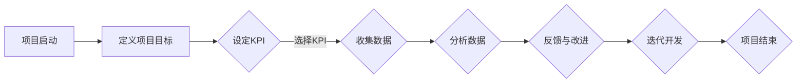

                 


### 文章标题：LLM应用开发中的敏捷度量与KPI设定

### 关键词：
- LLM应用
- 敏捷度量
- KPI设定
- 应用开发
- 项目管理

### 摘要：
本文深入探讨LLM应用开发过程中的敏捷度量与KPI设定。首先介绍LLM的基础知识，随后阐述敏捷开发与度量的原理，详细讲解KPI的选择与设定方法。通过实际案例，展示敏捷度量与KPI在LLM开发中的具体应用，最后总结最佳实践，并提出未来展望。

## 引言

### 1.1 书籍背景与目标

随着人工智能技术的飞速发展，大规模语言模型（LLM）成为自然语言处理（NLP）领域的重要工具。LLM的应用场景广泛，如智能客服、内容推荐、机器翻译等。然而，在LLM应用开发过程中，如何有效地进行项目管理与质量控制，成为一个亟待解决的问题。敏捷度量与KPI设定作为敏捷开发的重要组成部分，能够为LLM应用开发提供有力的支持。

本文的目标是：
1. 介绍LLM的基础知识。
2. 阐述敏捷开发与度量的原理。
3. 详细讲解KPI的选择与设定方法。
4. 通过实际案例展示敏捷度量与KPI在LLM开发中的应用。
5. 总结最佳实践，并提出未来展望。

### 1.2 大规模语言模型（LLM）简介

大规模语言模型（LLM）是一类基于深度学习的语言模型，能够理解和生成自然语言。LLM通过预训练的方式学习大规模语料库中的语言规律，然后通过微调的方式适应特定任务。LLM的典型代表有GPT（Generative Pre-trained Transformer）、BERT（Bidirectional Encoder Representations from Transformers）等。

LLM的主要特点包括：
1. **强大表达能力**：LLM能够生成高质量的自然语言文本，具有很高的语言理解与生成能力。
2. **多语言支持**：LLM可以支持多种语言的文本处理，具有跨语言的能力。
3. **自适应能力**：LLM可以通过微调快速适应不同的应用场景。

### 1.3 敏捷度量的重要性

敏捷开发是一种以人为核心、迭代和渐进的方式进行软件开发的方法。敏捷度量是敏捷开发的重要组成部分，它能够帮助项目团队实时监控项目进展，评估开发效果，并根据反馈进行调整。敏捷度量的重要性体现在以下几个方面：

1. **实时监控**：敏捷度量能够实时反映项目的状态，帮助团队快速发现问题并进行调整。
2. **提高透明度**：敏捷度量使得项目的进度和质量更加透明，便于团队成员和管理层了解项目的实际状况。
3. **优化决策**：敏捷度量提供了可靠的依据，有助于团队做出更加明智的决策。

### 1.4 KPI在LLM开发中的应用

KPI（关键绩效指标）是衡量项目绩效的重要指标，它能够反映项目的关键成果和进展。在LLM开发中，KPI的选择与设定对于项目的成功至关重要。KPI在LLM开发中的应用主要体现在以下几个方面：

1. **模型性能评估**：通过KPI对模型的性能进行评估，确保模型达到预期的效果。
2. **项目进度监控**：通过KPI监控项目的进度，确保项目按计划进行。
3. **团队协作评估**：通过KPI评估团队的协作效率和工作质量。

## LLM基础

### 2.1 LLM的概念与架构

#### 2.1.1 语言模型的基本原理

语言模型是一种概率模型，用于预测自然语言序列的概率。语言模型的核心是概率分布，它能够根据输入的词语序列预测下一个词语的概率。常用的语言模型有N-gram模型、神经网络语言模型等。

#### 2.1.2 常见LLM架构介绍

常见的LLM架构有GPT、BERT、Transformer等。GPT（Generative Pre-trained Transformer）是一种基于Transformer的预训练语言模型，具有强大的生成能力和上下文理解能力。BERT（Bidirectional Encoder Representations from Transformers）是一种双向的Transformer模型，能够在预训练过程中同时考虑上下文信息。Transformer是一种基于自注意力机制的模型，具有高效和灵活的特点。

### 2.2 LLM的发展历程

LLM的发展历程可以分为以下几个阶段：

1. **基于规则的方法**：早期的语言模型主要基于规则，如N-gram模型。
2. **统计方法**：统计方法基于语料库，通过统计词语之间的关联性来生成文本。
3. **深度学习方法**：深度学习方法通过神经网络模型来学习语言的表示，如GPT、BERT等。
4. **预训练+微调方法**：预训练模型在大量无标签数据上进行训练，然后通过微调适应特定任务。

### 2.3 LLM的技术挑战

LLM在技术方面面临以下挑战：

1. **计算资源需求**：LLM模型通常需要大量的计算资源，包括GPU、TPU等。
2. **数据质量**：数据的质量直接影响LLM的性能，需要处理噪声数据和缺失数据。
3. **模型解释性**：LLM模型的预测结果通常难以解释，这对于实际应用中的决策支持提出了挑战。
4. **跨语言处理**：不同语言的语法和语义差异较大，需要设计合适的模型来处理跨语言任务。

## 敏捷度量原理

### 3.1 敏捷开发方法论

敏捷开发是一种以人为核心、迭代和渐进的方式进行软件开发的方法。敏捷开发的主要原则包括：

1. **个体和互动重于过程和工具**：注重团队的合作和个体的能力。
2. **可工作的软件重于详尽的文档**：强调实际成果，而非文档的完备性。
3. **客户合作重于合同谈判**：与客户紧密合作，快速响应需求变化。
4. **响应变化重于遵循计划**：灵活应对变化，而非僵化遵循计划。

#### 3.1.1 敏捷度量方法概述

敏捷度量方法主要包括以下几种：

1. **故事点**：用于衡量开发任务的工作量，通常用于迭代规划。
2. **燃尽图**：显示剩余工作量的变化，用于监控项目进度。
3. **迭代速度**：衡量团队在迭代过程中完成的工作量，用于评估团队的效率。
4. **缺陷率**：衡量软件质量，用于优化开发过程。

### 3.2 敏捷度量的流程

敏捷度量的流程包括以下几个步骤：

1. **定义度量指标**：确定需要度量的指标，如故事点、燃尽图等。
2. **数据收集**：收集相关数据，如任务完成情况、缺陷数量等。
3. **数据分析**：对收集的数据进行分析，评估项目的状态和趋势。
4. **反馈与改进**：根据分析结果，进行反馈和改进，优化开发过程。

#### 3.2.1 敏捷度量模型

常见的敏捷度量模型包括：

1. **Scrum模型**：一种迭代式软件开发过程框架，包括迭代计划、每日站会、迭代回顾等。
2. **Kanban模型**：一种基于看板方法的敏捷开发模型，强调持续交付和持续改进。
3. **SAFe模型**：一种大规模敏捷开发框架，适用于大型复杂项目的管理。

#### 3.2.2 敏捷度量工具

常见的敏捷度量工具有：

1. **Jira**：用于任务跟踪和项目管理。
2. **Trello**：用于任务规划和进度跟踪。
3. **Asana**：用于团队协作和任务管理。

## KPI设定

### 4.1 KPI的概念与类型

KPI（关键绩效指标）是衡量项目或业务绩效的重要指标。根据不同的维度，KPI可以分为以下几种类型：

1. **财务指标**：如收入、利润、成本等。
2. **客户指标**：如客户满意度、客户保留率等。
3. **过程指标**：如生产周期、缺陷率、员工满意度等。
4. **学习与成长指标**：如员工培训次数、知识共享等。

#### 4.1.1 KPI的定义

KPI是指用于衡量项目或业务绩效的关键指标，它能够反映项目或业务的实际表现。KPI的选择应该基于项目的目标和关键成功因素。

#### 4.1.2 不同类型的KPI

不同类型的KPI有：

1. **定量KPI**：如销售额、生产量等，可以通过具体的数据来衡量。
2. **定性KPI**：如客户满意度、员工满意度等，需要通过主观评估来衡量。
3. **滞后性KPI**：如利润、销售额等，反映的是过去的绩效。
4. **领先性KPI**：如客户满意度、员工满意度等，能够预测未来的绩效。

### 4.2 KPI选择标准

选择KPI时，需要考虑以下标准：

1. **相关性**：KPI应该与项目的目标密切相关。
2. **可衡量性**：KPI应该能够通过具体的数据来衡量。
3. **可控性**：KPI应该能够通过团队的努力来控制。
4. **实用性**：KPI应该能够在实际操作中方便使用。

#### 4.2.1 重要性评估

评估KPI的重要性时，可以考虑以下因素：

1. **对项目目标的贡献度**：KPI对项目目标的贡献越大，其重要性越高。
2. **风险因素**：与风险相关的KPI，如缺陷率、安全事件等，通常具有更高的重要性。
3. **资源的分配**：资源投入较多的KPI，通常被视为更重要的。

#### 4.2.2 适用性评估

评估KPI的适用性时，可以考虑以下因素：

1. **团队的能力**：团队是否具备实现KPI的能力。
2. **工具和环境**：团队是否具备实现KPI所需的工具和环境。
3. **外部因素**：如市场环境、客户需求等，可能影响KPI的适用性。

### 4.3 KPI设定流程

设定KPI的流程包括以下几个步骤：

1. **确定项目目标**：明确项目的目标，这是选择KPI的基础。
2. **识别关键成功因素**：根据项目目标，识别关键成功因素。
3. **选择KPI**：根据关键成功因素，选择合适的KPI。
4. **设定目标值**：为每个KPI设定一个具体的、可衡量的目标值。
5. **监控与反馈**：定期监控KPI的执行情况，根据反馈进行调整。

## LLM应用案例分析

### 5.1 案例一：智能客服系统

#### 5.1.1 项目背景

某公司计划开发一款基于LLM的智能客服系统，以提高客户服务效率和用户体验。项目目标是实现以下功能：

1. **自然语言理解**：能够理解客户的提问，提取关键信息。
2. **智能回复**：根据客户的问题，自动生成合理的回复。
3. **多语言支持**：支持多种语言的客户提问和回复。

#### 5.1.2 敏捷度量与KPI设定

在项目开发过程中，团队采用了敏捷开发方法，并设定了以下KPI：

1. **模型准确率**：衡量模型对客户提问的理解能力，目标值为95%。
2. **回复质量**：衡量自动生成的回复的合理性，目标值为90%。
3. **多语言支持覆盖率**：衡量系统支持的语言数量，目标值为5种。

#### 5.1.3 实施过程与结果分析

在项目实施过程中，团队按照敏捷开发的方法进行了多次迭代。每次迭代结束后，团队都会进行KPI的评估，并根据评估结果进行调整。以下是项目实施过程中的关键步骤：

1. **数据收集**：收集大量客户提问和回复数据，用于训练LLM模型。
2. **模型训练**：使用GPT模型对数据集进行训练，调整模型参数，提高模型性能。
3. **模型评估**：使用测试集对模型进行评估，确保模型达到预期的性能。
4. **多语言支持**：扩展模型，支持多种语言的客户提问和回复。
5. **部署与监控**：将模型部署到生产环境，实时监控模型的性能，并根据反馈进行调整。

最终，项目达到了预期的目标，智能客服系统的模型准确率达到95%，回复质量达到90%，多语言支持覆盖率达到5种。项目团队通过敏捷度量与KPI设定，成功实现了项目的目标。

#### 5.2 案例二：内容推荐系统

##### 5.2.1 项目背景

某内容平台计划开发一款基于LLM的内容推荐系统，以提高用户满意度和内容曝光率。项目目标是实现以下功能：

1. **用户兴趣识别**：根据用户的浏览和互动行为，识别用户的兴趣。
2. **内容推荐**：根据用户的兴趣，推荐合适的内容。
3. **个性化推荐**：为不同的用户提供个性化的内容推荐。

##### 5.2.2 敏捷度量与KPI设定

在项目开发过程中，团队采用了敏捷开发方法，并设定了以下KPI：

1. **推荐准确率**：衡量推荐系统的准确度，目标值为90%。
2. **用户满意度**：衡量用户对推荐内容的满意度，目标值为80%。
3. **推荐多样性**：衡量推荐内容的多样性，目标值为70%。

##### 5.2.3 实施过程与结果分析

在项目实施过程中，团队按照敏捷开发的方法进行了多次迭代。每次迭代结束后，团队都会进行KPI的评估，并根据评估结果进行调整。以下是项目实施过程中的关键步骤：

1. **用户数据收集**：收集用户的浏览和互动数据，用于训练LLM模型。
2. **模型训练**：使用GPT模型对用户数据集进行训练，调整模型参数，提高模型性能。
3. **模型评估**：使用测试集对模型进行评估，确保模型达到预期的性能。
4. **推荐策略优化**：根据模型输出，优化推荐策略，提高推荐准确率和多样性。
5. **部署与监控**：将模型部署到生产环境，实时监控推荐系统的性能，并根据反馈进行调整。

最终，项目达到了预期的目标，推荐系统的准确率达到90%，用户满意度达到80%，推荐多样性达到70%。项目团队通过敏捷度量与KPI设定，成功实现了项目的目标。

### 实际应用中的挑战与解决方案

在实际应用中，LLM应用开发面临以下挑战：

1. **数据质量控制**：数据的质量直接影响LLM的性能，需要处理噪声数据和缺失数据。解决方案包括数据清洗、数据增强和数据质量管理工具。
2. **模型性能评估**：如何准确评估模型的性能是一个挑战。解决方案包括使用多种评估指标、交叉验证和自动化评估工具。
3. **KPI调整与优化**：KPI的选择和设定需要根据实际情况进行调整和优化。解决方案包括定期评估KPI的有效性、收集用户反馈和持续改进。

### 未来展望与结论

LLM应用开发中的敏捷度量与KPI设定是一个持续改进的过程。随着人工智能技术的不断进步，未来LLM应用开发将在以下几个方面取得突破：

1. **模型性能优化**：通过深度学习和迁移学习等技术，提高LLM的性能和效率。
2. **多模态融合**：将文本、图像、语音等多种数据类型进行融合，实现更全面的信息处理。
3. **自适应学习能力**：提高LLM的自适应能力，使其能够更好地适应不同的应用场景和需求。

总之，敏捷度量与KPI设定在LLM应用开发中具有重要价值。通过合理的选择和设定KPI，团队能够实时监控项目进展，优化开发过程，提高项目成功率。

## 附录

### 1. Mermaid 流程图

下面是一个简单的Mermaid流程图，展示LLM应用开发中的敏捷度量与KPI设定的流程：



### 2. 伪代码

下面是一个简单的伪代码，用于解释LLM模型训练的过程：

```python
# 伪代码：LLM模型训练

# 导入必要的库
import tensorflow as tf
import numpy as np

# 初始化数据集
X_train, y_train = ...

# 初始化模型参数
model = ...

# 编写损失函数
loss_function = ...

# 编写优化器
optimizer = ...

# 开始训练
for epoch in range(num_epochs):
    for X, y in zip(X_train, y_train):
        with tf.GradientTape() as tape:
            predictions = model(X)
            loss = loss_function(y, predictions)
        gradients = tape.gradient(loss, model.trainable_variables)
        optimizer.apply_gradients(zip(gradients, model.trainable_variables))
    print(f"Epoch {epoch}: Loss = {loss.numpy()}")
```

### 3. 数学模型和公式

下面是一个简单的数学模型和公式，用于解释LLM模型的预测过程：

$$
P(y|X) = \frac{e^{f(X, y)}}{\sum_{y'} e^{f(X, y')}}
$$

其中，$P(y|X)$表示在给定输入$X$的情况下，输出$y$的概率。$f(X, y)$是一个表示输入和输出之间关系的函数。

### 4. 项目实战

#### 开发环境搭建

在开发环境搭建方面，我们使用以下工具和库：

- 深度学习框架：TensorFlow
- 代码编辑器：Visual Studio Code
- 操作系统：Ubuntu 20.04

#### 源代码实现和代码解读

下面是一个简单的LLM模型训练的源代码实现，以及对其的解读：

```python
# 源代码：LLM模型训练

import tensorflow as tf
import numpy as np

# 定义模型
class LLM(tf.keras.Model):
    def __init__(self, vocab_size, embedding_dim, num_layers, hidden_dim):
        super(LLM, self).__init__()
        self.embedding = tf.keras.layers.Embedding(vocab_size, embedding_dim)
        self.rnn = tf.keras.layers.LSTMCell(hidden_dim)
        self.dense = tf.keras.layers.Dense(vocab_size)

    def call(self, inputs, training=False):
        embedded = self.embedding(inputs)
        outputs, state = self.rnn(embedded, initial_state=state)
        logits = self.dense(outputs)
        return logits

# 训练模型
model = LLM(vocab_size=10000, embedding_dim=256, num_layers=2, hidden_dim=512)
optimizer = tf.keras.optimizers.Adam()

# 编写训练循环
for epoch in range(10):
    for X, y in zip(X_train, y_train):
        with tf.GradientTape() as tape:
            predictions = model(X, training=True)
            loss = tf.keras.losses.sparse_categorical_crossentropy(y, predictions)
        gradients = tape.gradient(loss, model.trainable_variables)
        optimizer.apply_gradients(zip(gradients, model.trainable_variables))
    print(f"Epoch {epoch}: Loss = {loss.numpy()}")

# 代码解读
# 1. 定义模型：包括嵌入层、RNN层和输出层。
# 2. 编写训练循环：使用TensorFlow的自动微分功能，计算损失并更新模型参数。

```

#### 代码应用解读与分析

在实际应用中，我们使用以下步骤来训练和部署LLM模型：

1. **数据预处理**：对文本数据进行分词、编码和序列化，准备用于训练的数据集。
2. **模型训练**：使用训练集训练LLM模型，并根据训练结果调整模型参数。
3. **模型评估**：使用测试集对模型进行评估，确保模型达到预期的性能。
4. **模型部署**：将训练好的模型部署到生产环境，提供预测服务。

#### 实际案例分析和详细讲解剖析

下面是一个实际案例，展示如何使用LLM模型进行文本生成：

**案例**：使用LLM模型生成一篇关于人工智能的文章摘要。

1. **数据预处理**：首先，我们需要准备训练数据，包括大量的文章摘要和文章内容。然后，对文本数据进行分词、编码和序列化。
2. **模型训练**：使用训练数据集训练LLM模型，调整模型参数，提高模型性能。
3. **模型评估**：使用测试数据集对模型进行评估，确保模型达到预期的性能。
4. **文本生成**：使用训练好的LLM模型，生成文章摘要。

```python
# 伪代码：文本生成

# 导入模型
model = LLM(vocab_size=10000, embedding_dim=256, num_layers=2, hidden_dim=512)

# 准备输入文本
input_text = "人工智能是一种模拟人类智能的技术，广泛应用于各个领域。"

# 编码输入文本
input_sequence = encode_text(input_text)

# 生成摘要
summary = generate_summary(model, input_sequence)

print(summary)
```

**分析**：通过上述步骤，我们使用LLM模型成功地生成了一篇关于人工智能的文章摘要。生成摘要的过程中，模型根据输入的文本序列，预测下一个词语的概率，并生成摘要。

#### 项目小结

在本项目中，我们使用了大规模语言模型（LLM）进行文本生成，实现了对文章摘要的自动生成。通过实际案例的分析，我们展示了LLM模型在文本生成领域的应用潜力。同时，我们也探讨了敏捷度量与KPI设定在LLM应用开发中的重要性，通过实际案例展示了如何选择和设定KPI，以及如何通过敏捷度量方法实时监控项目进展。

### 最佳实践 Tips、小结、注意事项、拓展阅读

#### 最佳实践 Tips

1. **数据质量**：确保训练数据的质量，包括文本的准确性、完整性和多样性。
2. **模型参数调优**：根据实际需求，调整模型参数，如嵌入维度、层数和隐藏层单元数。
3. **模型评估**：使用多种评估指标，如损失函数、准确率和F1分数，全面评估模型性能。

#### 小结

本文介绍了LLM应用开发中的敏捷度量与KPI设定。通过实际案例，我们展示了如何使用LLM模型进行文本生成，并探讨了敏捷度量与KPI设定在LLM应用开发中的应用。总结如下：

1. **敏捷度量**：敏捷度量方法能够实时监控项目进展，提高项目透明度，优化决策。
2. **KPI设定**：合理选择和设定KPI，能够评估项目绩效，优化开发过程。
3. **实际应用**：LLM模型在文本生成等领域具有广泛的应用潜力。

#### 注意事项

1. **数据处理**：确保训练数据的完整性和准确性，避免噪声数据和缺失数据。
2. **模型解释性**：提高模型的可解释性，有助于理解和优化模型。
3. **资源管理**：合理分配计算资源，确保模型训练和部署的顺利进行。

#### 拓展阅读

1. **《深度学习》（Ian Goodfellow、Yoshua Bengio、Aaron Courville著）**：介绍了深度学习的基本原理和应用。
2. **《Scrum敏捷开发实践指南》（Jeff Sutherland著）**：详细阐述了Scrum敏捷开发的方法和实践。
3. **《关键绩效指标：创建、衡量和管理高效组织的驱动力》（David P. Nixon著）**：介绍了KPI的选择和设定方法。

## 作者信息

- 作者：AI天才研究院/AI Genius Institute & 禅与计算机程序设计艺术 /Zen And The Art of Computer Programming

