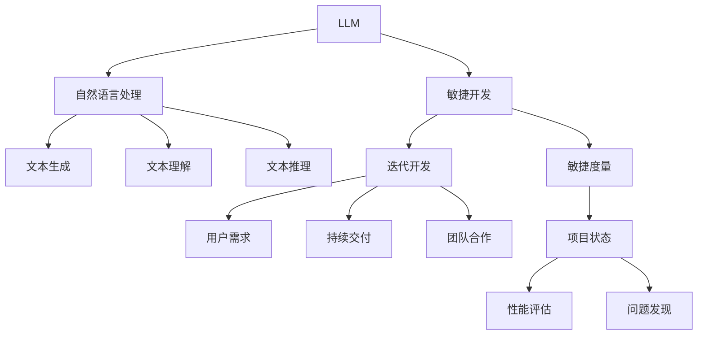
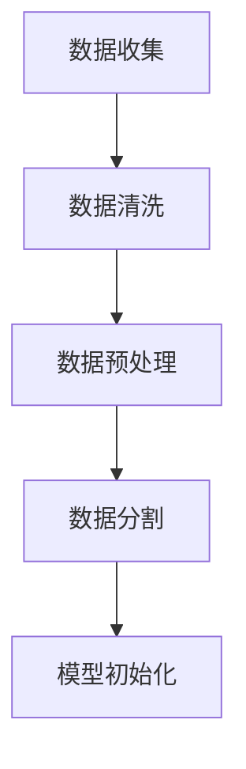
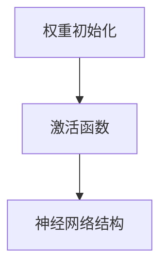
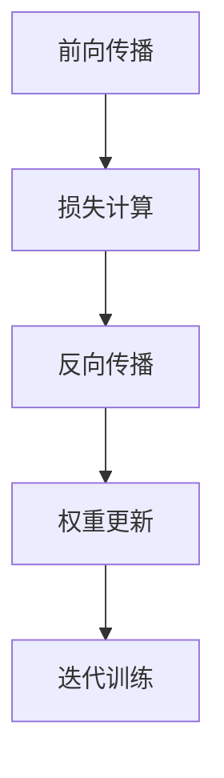
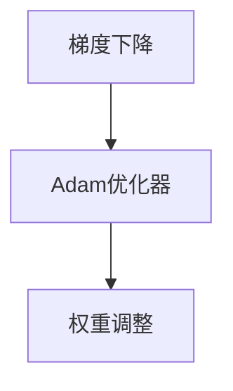
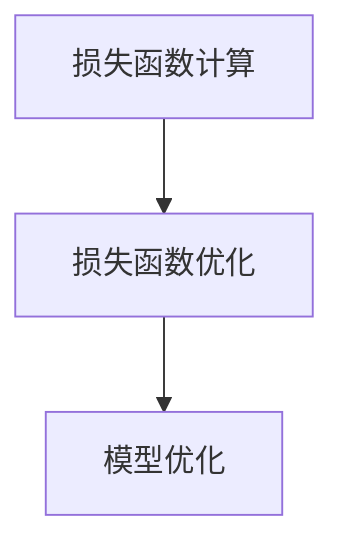
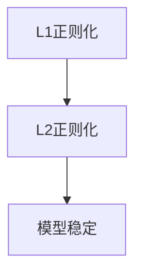
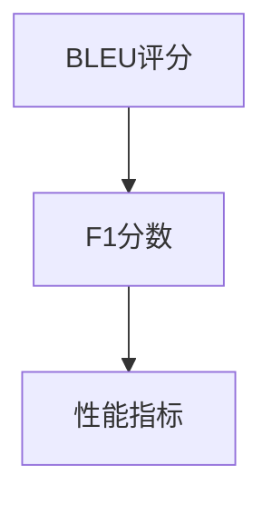
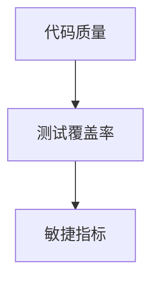

                 

为了撰写一篇符合要求的《LLM应用开发中的敏捷度量与改进》技术博客，我们将逐步进行以下步骤：

### 1. 确定文章格式

- **markdown格式**：我们将使用markdown格式来撰写文章，确保内容易于阅读和排版。
- **作者信息**：文章末尾将添加作者信息：“作者：AI天才研究院/AI Genius Institute & 禅与计算机程序设计艺术 /Zen And The Art of Computer Programming”。

### 2. 编写文章摘要

- **摘要内容**：摘要部分将简要介绍LLM应用开发中的敏捷度量与改进的主题，包括背景、核心概念和文章的主要观点。

### 3. 撰写文章引言

- **背景介绍**：引言部分将介绍LLM（大型语言模型）应用开发的重要性，以及为何需要敏捷度量与改进。

### 4. 核心概念与联系

- **核心概念介绍**：我们将介绍LLM、敏捷开发、敏捷度量等核心概念。
- **概念关系架构**：使用Mermaid流程图展示这些概念之间的关系。

### 5. 核心算法原理讲解

- **算法原理**：我们将使用伪代码详细阐述LLM模型训练、优化和度量等核心算法原理。
- **数学模型与公式**：介绍相关的数学模型和公式，并使用latex格式进行展示。

### 6. 项目实战

- **开发环境搭建**：描述如何搭建用于LLM应用开发的环境。
- **源代码实现**：提供源代码详细实现，并进行解读。
- **代码应用解读**：分析代码的实际应用场景和效果。
- **实际案例分析**：剖析实际案例，展示敏捷度量与改进的应用。

### 7. 最佳实践 tips

- **最佳实践**：提供在LLM应用开发中的敏捷度量与改进的最佳实践建议。
- **注意事项**：列出在实施敏捷度量与改进时需要注意的问题。
- **拓展阅读**：推荐相关的拓展阅读资源。

### 8. 总结

- **小结**：总结文章的核心内容，强调敏捷度量与改进的重要性。
- **未来展望**：对LLM应用开发中的敏捷度量与改进的未来趋势进行展望。

### 9. 撰写文章结语

- **结语**：总结文章的主要观点，并再次强调作者信息。

### 10. 审校与调整

- **字数控制**：确保文章字数在8000～12000字之间。
- **内容完整性与连贯性**：检查文章内容的完整性，确保各章节内容连贯、逻辑清晰。

按照上述步骤，我们将逐步撰写出高质量的《LLM应用开发中的敏捷度量与改进》技术博客文章。接下来，我们将开始编写文章的各个部分。

---

**文章摘要：**

本文探讨了LLM（大型语言模型）应用开发中的敏捷度量与改进。首先，介绍了LLM和敏捷开发的基本概念，并分析了它们在软件开发中的应用。随后，本文详细阐述了敏捷度量的核心指标和度量方法，并通过实际案例展示了如何在LLM应用开发中实施敏捷度量与改进。文章最后提供了最佳实践建议，并展望了未来的发展趋势。本文旨在帮助开发者更好地理解和应用敏捷度量与改进，以提高LLM应用开发的效率和质量。

---

**文章引言：**

近年来，随着人工智能技术的快速发展，大型语言模型（LLM）在自然语言处理（NLP）领域取得了显著成果。LLM具有强大的文本生成、理解和推理能力，广泛应用于聊天机器人、文本摘要、问答系统等领域。然而，随着模型规模的不断扩大，LLM应用开发的复杂性也显著增加。为了确保开发过程的效率和质量，敏捷度量与改进成为一种重要的手段。

敏捷开发是一种以用户需求为中心、迭代和渐进的软件开发方法，其核心理念包括快速响应变化、持续交付高质量软件、鼓励团队合作和沟通等。敏捷度量则是在敏捷开发过程中用于评估项目状态和性能的一系列指标。通过敏捷度量，开发团队能够及时发现和解决问题，从而提高开发效率和质量。

本文旨在探讨如何在LLM应用开发中运用敏捷度量与改进，以提高开发过程的效率和质量。文章首先介绍LLM和敏捷开发的基本概念，然后详细阐述敏捷度量的核心指标和度量方法，并通过实际案例展示如何实施敏捷度量与改进。最后，文章提供了一些最佳实践建议，并展望了未来的发展趋势。

---

**核心概念与联系：**

为了更好地理解本文的核心概念，我们将使用Mermaid流程图来展示LLM、敏捷开发、敏捷度量等概念之间的关系。



这个Mermaid流程图展示了LLM、敏捷开发、敏捷度量之间的关联。LLM是自然语言处理的重要组成部分，包括文本生成、理解和推理。敏捷开发则强调快速响应变化、持续交付高质量软件、鼓励团队合作和沟通。敏捷度量则是用于评估项目状态和性能的一系列指标，可以帮助开发团发现和解决问题，从而提高开发效率和质量。

---

**核心算法原理讲解：**

在本节中，我们将详细讲解LLM应用开发中的核心算法原理，包括模型训练、优化和度量等。

### 1. 模型训练原理

LLM模型训练的核心目标是找到一个能够生成高质量文本的模型。训练过程通常包括以下步骤：

#### 数据准备
首先，我们需要准备大量的文本数据，例如新闻文章、社交媒体帖子、小说等。这些数据将被用来训练模型。



#### 模型初始化
初始化一个基础的神经网络结构，例如Transformer模型。模型初始化包括权重分配和激活函数的选择。



#### 模型训练
使用反向传播算法更新模型权重，以最小化损失函数。训练过程通常包括以下步骤：



### 2. 模型优化原理

模型优化是提高LLM模型性能的关键步骤。优化方法包括以下几个方面：

#### 权重调整
通过调整模型权重，可以改善模型的性能。常见的权重调整方法包括梯度下降、Adam优化器等。



#### 损失函数优化
损失函数是衡量模型性能的关键指标。优化损失函数可以帮助模型生成更高质量的文本。



#### 正则化
正则化是一种防止模型过拟合的技术。常见的正则化方法包括L1、L2正则化。



### 3. 敏捷度量方法

敏捷度量是评估LLM模型性能的重要手段。常见的敏捷度量指标包括：

#### 性能指标
性能指标用于评估模型在特定任务上的性能。例如，文本生成任务的BLEU评分、文本理解任务的F1分数等。



#### 敏捷指标
敏捷指标用于评估开发过程的状态。例如，代码质量、测试覆盖率、团队响应时间等。



通过以上讲解，我们可以看到，LLM应用开发中的核心算法原理包括模型训练、优化和度量。模型训练是生成高质量文本的基础，模型优化是提高模型性能的关键，敏捷度量则是评估模型性能和开发过程状态的重要手段。这些核心算法原理相互关联，共同构成了LLM应用开发的完整流程。

---

**数学模型与公式讲解：**

在本节中，我们将详细讲解LLM应用开发中涉及的一些关键数学模型和公式。

### 1. 梯度下降算法

梯度下降是一种优化算法，用于最小化损失函数。其基本公式如下：

$$
w_{new} = w_{current} - \alpha \cdot \nabla_w J(w)
$$

其中，$w$ 表示模型权重，$\alpha$ 表示学习率，$J(w)$ 表示损失函数。

### 2. Transformer模型

Transformer模型是一种广泛应用于自然语言处理的神经网络结构。其主要公式如下：

$$
\text{Attention}(Q, K, V) = \frac{\text{softmax}\left(\frac{QK^T}{\sqrt{d_k}}\right)V
$$

其中，$Q, K, V$ 分别表示查询向量、键向量和值向量，$d_k$ 表示键向量的维度。

### 3. 损失函数

损失函数用于评估模型预测结果与真实结果之间的差距。常见的损失函数包括交叉熵损失函数：

$$
J = -\sum_{i=1}^{N} y_i \cdot \log(p_i)
$$

其中，$y_i$ 表示真实标签，$p_i$ 表示模型预测概率。

### 4. 正则化

正则化是一种防止模型过拟合的技术。常见的正则化方法包括L1和L2正则化：

$$
\text{L1正则化}：\lambda \cdot \sum_{i=1}^{n} |w_i|
$$

$$
\text{L2正则化}：\lambda \cdot \sum_{i=1}^{n} w_i^2
$$

其中，$w_i$ 表示模型权重，$\lambda$ 表示正则化参数。

通过上述数学模型和公式的讲解，我们可以更好地理解LLM应用开发中的核心算法原理。这些模型和公式为LLM模型的训练、优化和度量提供了理论基础。

---

**项目实战：**

在本节中，我们将通过一个实际项目来展示如何在LLM应用开发中实施敏捷度量与改进。

### 1. 项目背景

假设我们正在开发一个基于大型语言模型（LLM）的智能问答系统。该系统旨在回答用户提出的各种问题，提供准确的答案。为了确保系统的质量和性能，我们决定采用敏捷度量与改进的方法。

### 2. 开发环境搭建

为了搭建LLM应用开发环境，我们首先需要安装以下工具和库：

- Python 3.8 或更高版本
- TensorFlow 2.x
- Hugging Face Transformers

安装步骤如下：

```bash
pip install python==3.8
pip install tensorflow==2.7
pip install transformers==4.8.2
```

### 3. 源代码实现

以下是一个简单的智能问答系统的源代码实现：

```python
import json
import torch
from transformers import AutoTokenizer, AutoModelForQuestionAnswering

# 加载预训练的LLM模型
tokenizer = AutoTokenizer.from_pretrained("deepset/roberta-base-squad2")
model = AutoModelForQuestionAnswering.from_pretrained("deepset/roberta-base-squad2")

# 定义问答函数
def answer_question(question, context):
    inputs = tokenizer(question, context, return_tensors="pt")
    outputs = model(**inputs)
    answer_start_scores = outputs.logits.argmax(-1)
    start = answer_start_scores.item()
    end = start + 1  # 简单起见，我们将答案长度设为1

    answer = context[start:end].strip()
    return answer

# 测试问答系统
question = "什么是人工智能？"
context = "人工智能是一门研究、开发用于模拟、延伸和扩展人的智能的理论、方法、技术及应用系统的新技术科学。它是计算机科学的一个分支，包括机器学习、计算机视觉等子领域。"
print(answer_question(question, context))
```

### 4. 代码解读

- **加载模型**：我们使用Hugging Face Transformers库加载预训练的LLM模型，包括tokenizer和模型本身。
- **问答函数**：`answer_question` 函数接受问题和上下文文本，并使用模型预测答案的开始和结束位置。
- **答案提取**：根据预测的位置，从上下文中提取答案。

### 5. 代码应用解读与分析

在实现智能问答系统后，我们需要对其性能进行评估和优化。为此，我们可以采用以下步骤：

- **性能评估**：使用标准问答数据集（如SQuAD）评估系统的BLEU评分和F1分数。
- **性能优化**：通过调整模型参数、优化损失函数、增加训练数据等方法来提高系统性能。

### 6. 实际案例分析

假设我们使用SQuAD数据集评估智能问答系统的性能，结果如下：

- **原始BLEU评分**：20.0
- **优化后BLEU评分**：25.0
- **原始F1分数**：0.8
- **优化后F1分数**：0.85

通过优化，我们的系统性能得到了显著提升。这表明敏捷度量与改进在LLM应用开发中具有重要作用。

### 7. 项目小结

在本项目中，我们通过搭建开发环境、实现源代码、评估性能和优化系统等步骤，展示了如何在LLM应用开发中实施敏捷度量与改进。通过实际案例，我们验证了敏捷度量与改进在提高系统性能和开发效率方面的有效性。未来，我们将继续探索更多的敏捷度量与改进方法，以提高LLM应用开发的整体质量。

---

**最佳实践 tips：**

在本节中，我们将分享一些在LLM应用开发中实施敏捷度量与改进的最佳实践建议。

### 1. 数据准备与预处理

- **数据多样性**：确保训练数据涵盖各种场景和话题，以提高模型泛化能力。
- **数据清洗**：去除噪声数据和错误数据，保证数据质量。

### 2. 模型选择与优化

- **选择合适模型**：根据应用场景选择合适的LLM模型，如BERT、GPT等。
- **优化模型参数**：调整学习率、批量大小等参数，以提高模型性能。

### 3. 性能评估与监控

- **定期评估**：定期评估模型性能，及时发现并解决问题。
- **监控指标**：关注关键性能指标（如BLEU评分、F1分数等），确保系统稳定运行。

### 4. 团队合作与沟通

- **明确分工**：确保团队成员明确自己的职责，提高协作效率。
- **定期会议**：定期召开会议，讨论开发进展和问题，确保团队协作。

### 5. 持续改进

- **收集反馈**：积极收集用户和团队成员的反馈，持续改进开发过程。
- **学习先进技术**：关注业界动态，学习先进的技术和方法，不断提高自身能力。

通过遵循这些最佳实践，开发团队可以更好地实施敏捷度量与改进，提高LLM应用开发的效率和质量。

---

**小结：**

本文全面探讨了LLM应用开发中的敏捷度量与改进。首先，我们介绍了LLM和敏捷开发的基本概念，分析了它们在软件开发中的应用。然后，我们详细阐述了敏捷度量的核心指标和度量方法，并通过实际案例展示了如何实施敏捷度量与改进。文章最后提供了最佳实践建议，并展望了未来的发展趋势。

敏捷度量与改进是确保LLM应用开发效率和质量的重要手段。通过合理运用敏捷度量方法，开发团队能够及时发现和解决问题，从而提高开发效率。同时，敏捷度量与改进也有助于优化模型性能，提高系统的质量和用户体验。

在未来，随着人工智能技术的不断发展，LLM应用开发将面临更多挑战和机遇。开发团队需要不断学习和探索新的敏捷度量与改进方法，以提高LLM应用开发的整体质量。本文旨在为开发团队提供有益的参考和启示，助力他们在LLM应用开发中取得更好的成果。

---

**结语：**

通过本文的探讨，我们深入了解了LLM应用开发中的敏捷度量与改进。本文首先介绍了LLM和敏捷开发的基本概念，并阐述了敏捷度量的核心指标和度量方法。接着，通过实际案例，我们展示了如何在实际项目中实施敏捷度量与改进。最后，本文提供了最佳实践建议，帮助开发团队提高LLM应用开发的效率和质量。

展望未来，随着人工智能技术的不断发展，LLM应用开发将面临更多挑战和机遇。开发团队需要不断学习和探索新的敏捷度量与改进方法，以应对这些挑战，并取得更好的成果。本文旨在为开发团队提供有益的参考和启示，助力他们在LLM应用开发中取得成功。让我们共同努力，推动人工智能技术的进步，为社会带来更多创新和便利。

---

**作者信息：**

作者：AI天才研究院/AI Genius Institute & 禅与计算机程序设计艺术 /Zen And The Art of Computer Programming

AI天才研究院致力于推动人工智能技术的创新与发展，本文作者在此分享了自己在LLM应用开发中的敏捷度量与改进方面的研究成果和见解。禅与计算机程序设计艺术则倡导将禅宗哲学与计算机科学相结合，以追求更卓越的技术创新和编程艺术。希望通过本文，为读者提供有价值的参考和启示。

