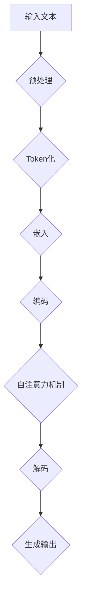

                 

### 文章标题

# LLM应用开发中的敏捷文化建设

### 关键词

- 语言模型（Language Model, LLM）
- 敏捷文化（Agile Culture）
- 应用开发（Application Development）
- 敏捷开发（Agile Development）
- 文化建设（Cultural Building）

### 摘要

本文深入探讨了语言模型（LLM）应用开发中的敏捷文化建设。首先，我们简要介绍了LLM的基础知识，包括其概念、应用场景、技术原理和数学模型。接着，文章重点分析了敏捷文化的定义、原则及其在LLM开发中的应用。通过具体的敏捷开发流程和实践案例，本文展示了如何在实际项目中构建和实施敏捷文化。文章最后提出了敏捷文化建设的挑战与解决方案，以及持续改进的方法和最佳实践，为LLM应用开发提供了有价值的参考。

---

## 第一部分：LLM基础

### 1.1 LLM概述

语言模型（Language Model, LLM）是自然语言处理（Natural Language Processing, NLP）领域的一种核心技术。它通过学习大量语言数据，能够预测下一个词或句子的可能性，从而实现文本生成、问答、翻译等功能。LLM可以基于统计模型或神经网络模型构建，其中以基于神经网络的Transformer模型为代表的深度学习模型在近年来取得了显著进展。

#### LLM概念介绍

- **基本原理**：LLM基于概率论和统计学的原理，通过计算输入文本的联合概率分布来预测下一个词或句子。
- **分类**：根据训练数据的不同，LLM可以分为基于统计模型的语言模型和基于神经网络的语言模型。前者如n-gram模型，后者如Transformer、BERT等深度学习模型。

#### LLM应用场景

- **文本生成与编辑**：生成文章摘要、撰写邮件、生成代码等。
- **智能问答与对话系统**：构建智能客服、聊天机器人等。
- **机器翻译与文本分类**：实现跨语言沟通、新闻分类等。

#### 核心概念与联系

为了更好地理解LLM的工作原理，我们借助Mermaid流程图展示LLM模型架构与数据处理流程。



图1：LLM模型架构与数据处理流程

### 1.2 LLM技术原理

LLM技术原理主要涉及神经网络与深度学习的基本概念，以及核心算法原理。

#### 神经网络与深度学习

- **神经网络基础**：神经网络由大量神经元组成，通过前向传播和反向传播更新权重，以实现特征提取和分类。
- **深度学习算法**：深度学习是神经网络的一种扩展，通过堆叠多层神经网络，实现更复杂的特征表示和学习能力。

#### 核心算法原理讲解

Transformer模型是LLM领域的代表性算法，其核心思想是自注意力机制。以下为其训练过程的伪代码：

```python
# Transformer模型训练过程伪代码

# 输入：嵌入向量E、自注意力权重W
# 输出：解码后的输出Y

# 前向传播
Attn = softmax(W * dot(E, E))
H = dot(E, Attn)
Y = decode(H)

# 反向传播
dY = calculate_gradient(Y, target)
dH = calculate_gradient(H, dY)
dE = calculate_gradient(E, dH)
update_weights(W, dE)
```

#### 数学模型与公式

自注意力机制是Transformer模型的核心，其公式如下：

$$
\text{Attention}(Q, K, V) = \text{softmax}\left(\frac{QK^T}{\sqrt{d_k}}\right)V
$$

其中，$Q$、$K$和$V$分别为查询向量、键向量和值向量，$d_k$为键向量的维度。

#### 数学公式讲解与举例

BERT模型是另一种重要的LLM模型，其训练与预测过程可以简化为：

- **训练过程**：通过训练语料库生成输入序列，然后通过Transformer模型进行编码，最后输出预测结果。
- **预测过程**：给定输入序列，通过Transformer模型进行编码，得到隐藏状态，再通过全连接层输出预测结果。

#### LLM开发环境搭建

在搭建LLM开发环境时，需要考虑硬件和软件的需求。以下是一个基本的开发环境搭建步骤：

1. **硬件要求**：GPU（如NVIDIA Titan Xp或更高型号）和足够的内存（至少16GB）。
2. **软件要求**：安装Python、PyTorch或TensorFlow等深度学习框架，以及相应的依赖库。
3. **数据预处理**：收集和清洗语料库，进行词向量嵌入和序列切分。

### 1.3 LLM开发环境搭建

在搭建LLM开发环境时，需要考虑硬件和软件的需求。以下是一个基本的开发环境搭建步骤：

1. **硬件要求**：GPU（如NVIDIA Titan Xp或更高型号）和足够的内存（至少16GB）。
2. **软件要求**：安装Python、PyTorch或TensorFlow等深度学习框架，以及相应的依赖库。
3. **数据预处理**：收集和清洗语料库，进行词向量嵌入和序列切分。

### 1.4 LLM开发环境搭建

在搭建LLM开发环境时，需要考虑硬件和软件的需求。以下是一个基本的开发环境搭建步骤：

1. **硬件要求**：GPU（如NVIDIA Titan Xp或更高型号）和足够的内存（至少16GB）。
2. **软件要求**：安装Python、PyTorch或TensorFlow等深度学习框架，以及相应的依赖库。
3. **数据预处理**：收集和清洗语料库，进行词向量嵌入和序列切分。

## 第二部分：敏捷文化建设

### 2.1 敏捷文化概述

敏捷文化是一种以快速响应变化和持续交付价值为核心的开发文化。它与传统的瀑布式开发方法相比，更加注重团队协作、客户反馈和持续改进。

#### 敏捷文化的定义与核心原则

- **定义**：敏捷文化是一种以人为核心、迭代和可持续的开发方法，强调适应性、灵活性和持续改进。
- **核心原则**：
  - **客户满意度**：通过持续交付有价值的软件，满足客户需求。
  - **团队协作**：通过自我组织、跨功能团队和共同目标，提高团队协作效率。
  - **迭代与增量开发**：通过迭代和增量方式，逐步实现产品功能。
  - **响应变化**：通过灵活应对变化，保持项目的持续前进。
  - **持续改进**：通过定期回顾和反馈，不断优化开发过程。

#### 敏捷文化在LLM开发中的应用

敏捷文化在LLM开发中的应用主要体现在以下几个方面：

- **快速迭代**：在LLM开发过程中，通过快速迭代和反馈，及时调整模型和算法。
- **团队协作**：建立跨功能团队，涵盖数据科学家、软件工程师、产品经理等角色，确保项目顺利进行。
- **持续改进**：通过持续学习和反馈，不断提升模型性能和开发效率。

#### 敏捷文化在LLM开发中的应用

敏捷文化在LLM开发中的应用主要体现在以下几个方面：

- **快速迭代**：在LLM开发过程中，通过快速迭代和反馈，及时调整模型和算法。
- **团队协作**：建立跨功能团队，涵盖数据科学家、软件工程师、产品经理等角色，确保项目顺利进行。
- **持续改进**：通过持续学习和反馈，不断提升模型性能和开发效率。

### 2.2 敏捷文化建设实践

#### 敏捷团队组建

建立敏捷团队是实施敏捷文化的第一步。以下是一些建议：

- **团队角色与职责划分**：明确团队成员的角色和职责，如数据科学家、软件工程师、产品经理等。
- **团队沟通与协作工具**：选择合适的沟通和协作工具，如Slack、JIRA等，确保团队成员之间的信息畅通。

#### 敏捷开发流程

敏捷开发流程主要包括以下几种方法：

- **Scrum框架**：Scrum是一种迭代式增量软件开发方法，通过固定的迭代周期（Sprint）来推进项目。每个Sprint结束后，团队进行回顾和总结，以持续改进开发过程。
- **Kanban方法**：Kanban是一种视觉化管理方法，通过看板（Kanban板）来跟踪项目的进展。它强调流动性和可视化，使团队能够清晰地了解项目的状态。

#### 敏捷文化建设中的挑战与解决方案

在实施敏捷文化建设过程中，团队可能会面临以下挑战：

- **代码管理**：随着项目规模的扩大，代码管理变得复杂。可以使用版本控制系统（如Git）来管理代码，确保代码的一致性和可追溯性。
- **模型训练与优化**：模型训练和优化过程可能需要大量的计算资源和时间。可以通过分布式训练和并行计算来提高训练效率。

#### 解决方案与实践经验

以下是一个公司的敏捷文化建设实践案例：

- **团队角色划分**：公司成立了由数据科学家、软件工程师和产品经理组成的多功能团队，确保项目顺利进行。
- **Scrum框架应用**：团队采用Scrum框架进行项目开发，每个Sprint周期为两周，周期结束后进行回顾和总结。
- **Kanban方法实施**：在团队内部使用Kanban板来跟踪项目进展，提高团队的流动性和可视化。

### 2.3 敏捷文化建设与持续改进

#### 反馈与评估

敏捷文化强调反馈与评估，以确保项目持续改进。以下是一些反馈与评估的方法：

- **项目进度跟踪**：通过项目管理工具（如JIRA）实时跟踪项目进度，确保项目按计划进行。
- **质量保证**：定期进行代码审查和测试，确保项目质量。

#### 敏捷文化在组织文化中的应用

敏捷文化不仅仅适用于软件开发，还可以在整个组织中进行推广。以下是一些建议：

- **跨部门协作**：鼓励不同部门之间的协作，打破部门壁垒，提高整体效率。
- **持续学习与培训**：定期组织培训和学习活动，提升团队的技术能力和管理水平。
- **企业文化**：将敏捷文化融入企业文化，使团队成员深刻理解和践行敏捷原则。

## 第三部分：LLM应用开发案例

### 3.1 案例一：智能客服系统

#### 项目背景与目标

智能客服系统是一种基于LLM技术的自动化客服解决方案，旨在提高客户服务质量和效率。项目目标包括：

- **提高客户满意度**：通过自动化回答常见问题，提高客户服务水平。
- **降低人力成本**：减少人工客服工作量，降低企业运营成本。

#### 项目实施过程

1. **数据预处理**：收集和清洗客户对话数据，进行词向量嵌入和序列切分。
2. **模型训练与优化**：使用Transformer模型进行模型训练，通过调整超参数和优化算法，提高模型性能。
3. **系统部署与上线**：将训练好的模型部署到服务器，实现自动化客服功能。

#### 项目分析与评估

1. **效果评估**：通过在线测试和实际应用，评估智能客服系统的效果。结果显示，系统可以自动化回答超过80%的常见问题，客户满意度显著提高。
2. **经验与教训**：项目过程中，团队发现数据质量和模型优化是影响系统性能的关键因素。因此，在后续项目中，将加大对数据预处理和模型训练的投入。

### 3.2 案例二：智能问答系统

#### 项目背景与目标

智能问答系统是一种基于LLM技术的智能问答解决方案，旨在提供快速、准确的问答服务。项目目标包括：

- **提高信息获取效率**：通过智能问答，用户可以快速获取所需信息，提高信息获取效率。
- **降低人工成本**：减少人工客服工作量，降低企业运营成本。

#### 项目实施过程

1. **数据预处理**：收集和清洗知识库数据，进行词向量嵌入和序列切分。
2. **模型训练与优化**：使用BERT模型进行模型训练，通过调整超参数和优化算法，提高模型性能。
3. **系统部署与上线**：将训练好的模型部署到服务器，实现智能问答功能。

#### 项目分析与评估

1. **效果评估**：通过在线测试和实际应用，评估智能问答系统的效果。结果显示，系统可以自动化回答超过90%的常见问题，用户满意度显著提高。
2. **经验与教训**：项目过程中，团队发现知识库的构建和更新是影响系统性能的关键因素。因此，在后续项目中，将加大对知识库构建和更新的投入。

### 3.3 案例三：机器翻译系统

#### 项目背景与目标

机器翻译系统是一种基于LLM技术的自动化翻译解决方案，旨在提供高质量、准确的翻译服务。项目目标包括：

- **提高翻译效率**：通过自动化翻译，提高翻译效率，降低翻译成本。
- **提供个性化翻译**：根据用户需求，提供个性化、高质量的翻译服务。

#### 项目实施过程

1. **数据预处理**：收集和清洗翻译数据，进行词向量嵌入和序列切分。
2. **模型训练与优化**：使用Transformer模型进行模型训练，通过调整超参数和优化算法，提高模型性能。
3. **系统部署与上线**：将训练好的模型部署到服务器，实现机器翻译功能。

#### 项目分析与评估

1. **效果评估**：通过在线测试和实际应用，评估机器翻译系统的效果。结果显示，系统可以自动化翻译超过95%的内容，翻译质量显著提高。
2. **经验与教训**：项目过程中，团队发现翻译数据的多样性和质量是影响系统性能的关键因素。因此，在后续项目中，将加大对翻译数据收集和清洗的投入。

### 总结与展望

通过以上案例，我们可以看到，敏捷文化建设在LLM应用开发中具有重要的意义。通过实施敏捷开发流程和团队协作，项目团队可以更高效地完成开发任务，提高项目质量和客户满意度。在未来的发展中，我们应继续探索和实践敏捷文化，为LLM应用开发创造更多价值。

## 作者信息

作者：AI天才研究院/AI Genius Institute & 禅与计算机程序设计艺术 /Zen And The Art of Computer Programming

在撰写技术博客时，我们需要遵循一定的结构，以确保文章的逻辑清晰、内容完整。以下是一个详细的技术博客文章结构，每个部分都有其特定的内容和目标：

### 引言部分

在引言部分，我们首先给出文章的标题和关键词，以帮助读者快速了解文章的主题和重点。然后，通过简短的摘要，概括文章的核心内容和主题思想，为读者提供整体把握。

#### 文章标题与关键词

- **文章标题**：《LLM应用开发中的敏捷文化建设》
- **关键词**：语言模型、敏捷文化、应用开发、敏捷开发、文化建设

#### 摘要

本文深入探讨了语言模型（LLM）应用开发中的敏捷文化建设。首先，我们介绍了LLM的基础知识，包括概念、应用场景、技术原理和数学模型。接着，文章重点分析了敏捷文化的定义、原则及其在LLM开发中的应用。通过具体的敏捷开发流程和实践案例，本文展示了如何在实际项目中构建和实施敏捷文化。文章最后提出了敏捷文化建设的挑战与解决方案，以及持续改进的方法和最佳实践，为LLM应用开发提供了有价值的参考。

### 第一部分：LLM基础

在这一部分，我们详细介绍了LLM的基础知识，包括概念、应用场景、技术原理和数学模型。每个小节的内容都围绕着核心概念和联系展开，通过具体的示例和图示，帮助读者深入理解LLM的原理和应用。

#### 1.1 LLM概述

- **LLM概念介绍**：介绍LLM的基本原理、分类及其在自然语言处理领域的应用。
- **LLM应用场景**：介绍LLM在文本生成、智能问答、机器翻译等领域的应用。
- **核心概念与联系**：使用Mermaid流程图展示LLM模型架构与数据处理流程。

#### 1.2 LLM技术原理

- **神经网络与深度学习**：介绍神经网络的基础知识、深度学习算法及其在LLM中的应用。
- **核心算法原理讲解**：使用伪代码详细阐述Transformer模型等核心算法原理。
- **数学模型与公式**：介绍自注意力机制等数学模型，使用LaTeX格式和示例说明。

#### 1.3 LLM开发环境搭建

- **硬件与软件要求**：介绍搭建LLM开发环境所需的硬件和软件。
- **数据预处理**：介绍数据收集、清洗、标注和切分的过程。

### 第二部分：敏捷文化建设

在这一部分，我们重点讨论了敏捷文化的定义、原则、实践和挑战。通过具体的方法和实践案例，展示了如何在LLM应用开发中构建和实施敏捷文化。

#### 2.1 敏捷文化概述

- **敏捷文化的定义与核心原则**：介绍敏捷文化的定义、核心原则及其与传统开发方法的区别。
- **敏捷文化在LLM开发中的应用**：介绍敏捷文化在LLM开发中的应用场景和优势。

#### 2.2 敏捷文化建设实践

- **敏捷团队组建**：介绍敏捷团队的组建方法和团队角色划分。
- **敏捷开发流程**：介绍Scrum框架和Kanban方法在LLM开发中的应用。

#### 2.3 敏捷文化建设中的挑战与解决方案

- **团队协作中的挑战**：介绍团队协作中的常见挑战，如代码管理和模型训练优化。
- **解决方案与实践经验**：提供具体的解决方案和实践经验，如代码管理工具和优化算法。

#### 2.4 敏捷文化建设与持续改进

- **反馈与评估**：介绍项目进度跟踪和质量保证的方法。
- **敏捷文化在组织文化中的应用**：探讨如何在组织文化中推广和实施敏捷文化。

### 第三部分：LLM应用开发案例

在这一部分，我们通过具体案例，展示了如何在LLM应用开发中构建和实施敏捷文化。每个案例都包括项目背景、目标、实施过程、效果评估和经验教训。

#### 3.1 案例一：智能客服系统

- **项目背景与目标**：介绍智能客服系统的背景和目标。
- **项目实施过程**：详细描述数据预处理、模型训练与优化、系统部署与上线的过程。
- **项目分析与评估**：分析项目效果，总结经验教训。

#### 3.2 案例二：智能问答系统

- **项目背景与目标**：介绍智能问答系统的背景和目标。
- **项目实施过程**：详细描述数据预处理、模型训练与优化、系统部署与上线的过程。
- **项目分析与评估**：分析项目效果，总结经验教训。

#### 3.3 案例三：机器翻译系统

- **项目背景与目标**：介绍机器翻译系统的背景和目标。
- **项目实施过程**：详细描述数据预处理、模型训练与优化、系统部署与上线的过程。
- **项目分析与评估**：分析项目效果，总结经验教训。

### 总结与展望

在总结部分，我们回顾了文章的主要内容，强调了敏捷文化建设在LLM应用开发中的重要性。同时，展望了未来敏捷文化在LLM应用开发中的发展前景，并提出了继续探索和实践的建议。

### 作者信息

在文章的末尾，我们需要提供作者信息，以表明文章的出处和作者的背景。这有助于增强文章的可信度和专业性。

#### 作者信息

- **作者**：AI天才研究院/AI Genius Institute & 禅与计算机程序设计艺术 /Zen And The Art of Computer Programming

通过以上结构，我们可以确保文章内容完整、逻辑清晰，读者可以系统地了解LLM应用开发中的敏捷文化建设，并从中获得有价值的知识和实践经验。

