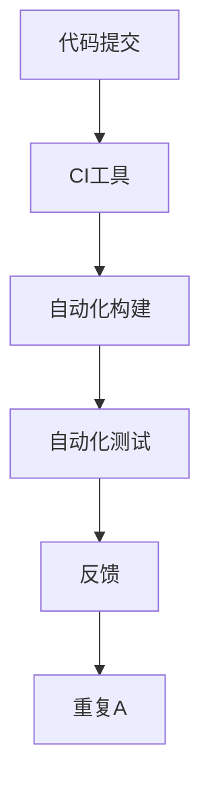
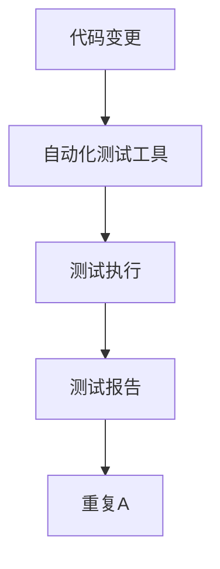
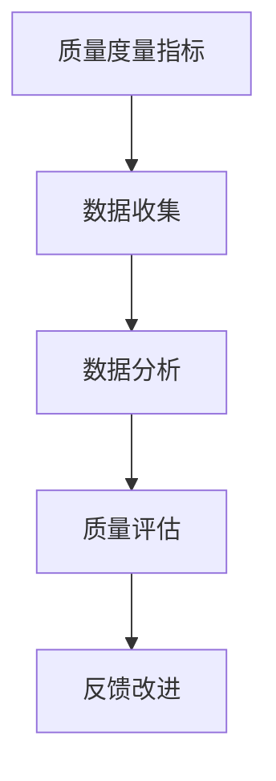
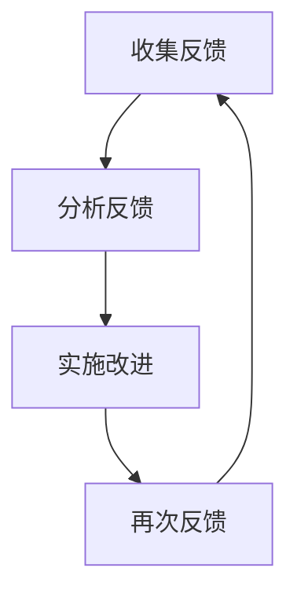

                 


### 文章标题

《LLM应用开发中的敏捷质量保证》

### 文章关键词

- 语言模型
- 敏捷开发
- 质量保证
- 自动化测试
- 持续集成
- 持续部署
- 数学模型

### 摘要

本文旨在探讨在语言模型（LLM）应用开发中如何实现敏捷质量保证。文章首先介绍了LLM的基本概念和重要性，然后阐述了敏捷质量保证的核心原则和实施方法。通过实际项目案例，本文详细解析了如何在LLM开发过程中应用敏捷质量保证的最佳实践，包括自动化测试、持续集成和持续部署等关键技术。最后，文章总结了敏捷质量保证在LLM开发中的重要性，并提出了一些未来的研究方向。

### 引言

随着人工智能技术的飞速发展，语言模型（LLM）已经成为了许多应用场景中的核心技术。从智能客服、自然语言处理到自动翻译和文本生成，LLM在提高效率和准确性的同时，也对质量保证提出了更高的要求。敏捷开发作为一种适应快速变化和高度不确定性的软件开发方法，逐渐在LLM应用开发中得到了广泛的应用。然而，如何在LLM开发过程中实现敏捷质量保证，仍然是一个亟待解决的问题。

本文将围绕以下主题展开讨论：

1. LLM的基本概念和重要性。
2. 敏捷质量保证的核心原则和实施方法。
3. 自动化测试、持续集成和持续部署在LLM开发中的应用。
4. 实际项目案例中的敏捷质量保证实践。
5. 敏捷质量保证在LLM开发中的重要性总结和未来研究方向。

通过本文的阅读，读者将能够深入了解LLM应用开发中的敏捷质量保证，并掌握相关技术的实际应用方法。

### LLM的基本概念

语言模型（LLM）是一种基于深度学习技术的人工智能模型，能够对自然语言文本进行建模和生成。LLM的核心目标是通过学习大量文本数据，捕捉语言结构和语义信息，从而实现高质量的自然语言处理任务。

#### LLM的工作原理

LLM的工作原理基于神经网络，特别是循环神经网络（RNN）和Transformer模型。RNN能够处理序列数据，通过记忆机制捕捉前后文信息。Transformer模型则通过自注意力机制实现了对输入序列的全局依赖关系建模，提高了模型的表示能力。

在训练过程中，LLM首先通过输入层接收文本数据，将其转换为向量表示。接着，这些向量通过隐藏层进行传递和更新，最后在输出层生成预测结果。通过反向传播算法，LLM根据预测结果与真实结果的差距进行参数调整，不断优化模型性能。

#### LLM的应用场景

LLM在多个领域具有广泛的应用：

1. **自然语言处理（NLP）**：LLM在文本分类、情感分析、命名实体识别等NLP任务中表现出色，能够显著提高任务的准确性和效率。
2. **自动翻译**：LLM被广泛应用于机器翻译系统，通过学习双语语料库，实现高质量的双语翻译。
3. **文本生成**：LLM能够生成连贯且符合语言习惯的文本，广泛应用于自动写作、内容生成和对话系统。
4. **问答系统**：LLM能够对用户的问题进行理解和回答，广泛应用于智能客服和虚拟助手。

#### LLM的发展历程

LLM的发展可以追溯到早期的人工智能时代。最初的模型如基于规则的方法和基于统计的方法，尽管在某些特定任务上取得了进展，但在处理复杂自然语言任务时存在局限性。随着深度学习技术的兴起，RNN和Transformer模型的出现，LLM取得了显著突破。

近年来，LLM的研究和应用不断拓展。以GPT-3、BERT等为代表的大型预训练模型，展示了在多种自然语言任务上的强大性能。这些模型通过在海量文本数据上进行预训练，能够捕捉丰富的语言模式和语义信息，为实际应用提供了强大支持。

总的来说，LLM作为一种关键的人工智能技术，已经在众多领域取得了显著成果。随着技术的不断进步，LLM的应用前景将更加广阔。

### 敏捷质量保证的核心原则

敏捷质量保证是一种将敏捷开发方法与质量保证相结合的实践，旨在通过快速迭代和持续改进，实现高质量的应用开发。以下是对敏捷质量保证核心原则的详细解释：

#### 敏捷开发方法

敏捷开发是一种以用户需求为导向、迭代周期短的软件开发方法。其核心原则包括：

1. **用户至上**：始终将用户需求放在首位，确保开发工作能够满足用户的核心需求。
2. **迭代开发**：将项目分解为多个小型迭代，每个迭代都产生可交付的成果，逐步实现整个项目。
3. **灵活性**：面对需求变化，敏捷开发方法强调快速响应和调整，以适应变化。
4. **团队合作**：鼓励跨职能团队协作，通过频繁的沟通和协作，提高开发效率和项目质量。

#### 质量保证的核心概念

质量保证是指确保软件产品或服务满足既定质量标准的过程。在敏捷开发中，质量保证的核心概念包括：

1. **持续集成**：通过自动化测试和持续集成工具，确保每次代码提交都不会影响整体项目的稳定性。
2. **自动化测试**：编写自动化测试脚本，定期运行，确保新功能和现有功能的正确性。
3. **持续部署**：通过自动化部署工具，将代码从开发环境顺利迁移到生产环境，减少人为错误和部署时间。
4. **反馈循环**：通过用户反馈和内部评审，不断优化产品功能和用户体验。

#### 敏捷质量保证的原则与实践

1. **尽早和持续测试**：从项目初期开始，编写自动化测试脚本，并在每次迭代中持续运行，确保功能正确。
2. **持续集成和部署**：采用自动化工具，将代码从开发环境集成到测试环境，再部署到生产环境，确保整个流程的高效和稳定。
3. **质量度量**：使用质量度量指标（如缺陷密度、测试覆盖率等），监控和评估项目质量。
4. **用户参与**：鼓励用户参与测试和反馈，通过用户反馈优化产品功能和用户体验。
5. **团队合作**：建立跨职能团队，确保团队成员之间的沟通和协作，共同推动项目质量。

总的来说，敏捷质量保证通过将敏捷开发方法与质量保证实践相结合，实现了高效、灵活和高质量的应用开发。这一方法在应对快速变化的需求和市场环境时，具有显著优势。

### 核心概念与联系

在LLM应用开发中，敏捷质量保证涉及多个核心概念，它们之间相互联系，共同构成了一个完整的质量保障体系。以下是对这些核心概念及其相互关系的详细阐述。

#### 持续集成与持续部署

持续集成（CI）和持续部署（CD）是敏捷开发中确保代码质量的重要环节。持续集成指的是在代码提交到版本控制系统后，立即进行自动化构建、测试和反馈，确保每次代码变更都不会破坏项目的整体功能。持续部署则是在经过测试后，将代码部署到生产环境，确保上线过程的高效和稳定。

**流程图示例：**



在LLM应用开发中，持续集成和持续部署可以帮助快速发现和解决代码问题，确保模型的准确性和可靠性。

#### 自动化测试

自动化测试是确保软件质量和稳定性的关键。在LLM应用开发中，自动化测试不仅包括功能测试，还包括性能测试、安全测试等。通过编写自动化测试脚本，可以在每次代码变更后自动执行测试，确保功能正确且性能稳定。

**流程图示例：**



自动化测试可以大幅减少人工测试的工作量，提高测试效率和覆盖范围，确保LLM模型在开发过程中始终保持高质量。

#### 数学模型和公式

在LLM应用开发中，数学模型和公式是理解和优化模型性能的重要工具。例如，损失函数用于评估模型预测与真实结果之间的差距，通过优化损失函数，可以提高模型的准确性。以下是一个简单的损失函数示例：

$$
\text{Loss}(y, \hat{y}) = \frac{1}{2} (y - \hat{y})^2
$$

其中，$y$ 是真实值，$\hat{y}$ 是模型预测值。

数学模型和公式不仅帮助理解模型的内部工作机制，还可以用于指导模型优化和调整。

#### 质量度量

质量度量是评估软件质量的重要手段。在LLM应用开发中，常用的质量度量指标包括缺陷密度、测试覆盖率、用户满意度等。通过这些指标，可以量化软件的质量水平，并指导改进工作。

**流程图示例：**



质量度量不仅帮助识别和解决问题，还可以用于监控和评估项目进展。

#### 反馈循环

反馈循环是敏捷质量保证的重要组成部分。在LLM应用开发中，反馈循环通过用户反馈、测试结果和内部评审等手段，不断优化产品功能和用户体验。以下是一个反馈循环的流程：

1. **收集反馈**：从用户和测试人员收集关于产品功能和性能的反馈。
2. **分析反馈**：对反馈进行分析，识别问题和改进机会。
3. **实施改进**：根据分析结果，实施相应的改进措施。
4. **再次反馈**：将改进后的产品再次提交给用户和测试人员，收集新的反馈。

**流程图示例：**



通过反馈循环，LLM应用开发团队能够持续优化产品，提高用户满意度。

总的来说，持续集成与持续部署、自动化测试、数学模型和公式、质量度量以及反馈循环这些核心概念相互关联，共同构成了一个完整的质量保障体系。在LLM应用开发中，通过有效应用这些概念，团队能够确保模型的高质量，从而满足用户需求和市场期望。

### 核心算法原理讲解

在LLM应用开发中，核心算法原理的实现至关重要，这些原理包括神经网络架构、优化算法和损失函数等。以下是对这些核心算法原理的详细讲解，以及如何使用伪代码和LaTeX格式来表示和解释它们。

#### 神经网络架构

神经网络（NN）是LLM的基础，其架构通常包括输入层、隐藏层和输出层。输入层接收文本数据的向量表示，隐藏层通过激活函数处理这些向量，输出层生成预测结果。以下是一个简单的神经网络架构的伪代码：

```python
# 伪代码：神经网络架构
class NeuralNetwork:
    def __init__(self, input_size, hidden_size, output_size):
        self.input_size = input_size
        self.hidden_size = hidden_size
        self.output_size = output_size

        # 初始化权重和偏置
        self.W1 = np.random.randn(input_size, hidden_size)
        self.b1 = np.random.randn(hidden_size)
        self.W2 = np.random.randn(hidden_size, output_size)
        self.b2 = np.random.randn(output_size)

    def forward(self, X):
        # 输入到隐藏层
        self.z1 = np.dot(X, self.W1) + self.b1
        self.a1 = sigmoid(self.z1)
        
        # 隐藏层到输出层
        self.z2 = np.dot(self.a1, self.W2) + self.b2
        self.a2 = sigmoid(self.z2)
        
        return self.a2

# 激活函数示例
def sigmoid(z):
    return 1 / (1 + np.exp(-z))
```

#### 优化算法

优化算法用于调整神经网络的权重和偏置，以最小化损失函数。常见的优化算法包括随机梯度下降（SGD）和Adam优化器。以下是一个使用SGD优化算法的伪代码示例：

```python
# 伪代码：随机梯度下降优化算法
def sgd(nn, X, y, epochs, learning_rate):
    for epoch in range(epochs):
        for x, y in zip(X, y):
            # 前向传播
            a2 = nn.forward(x)
            
            # 计算损失
            loss = compute_loss(a2, y)
            
            # 反向传播
            dZ2 = a2 - y
            dW2 = np.dot(dZ2, nn.a1.T)
            db2 = np.sum(dZ2)
            
            # 更新权重和偏置
            nn.W2 -= learning_rate * dW2
            nn.b2 -= learning_rate * db2
            
            # 更新隐藏层权重和偏置
            dZ1 = np.dot(nn.W2.T, dZ2) * sigmoid_derivative(nn.z1)
            dW1 = np.dot(dZ1, x.T)
            db1 = np.sum(dZ1)
            
            nn.W1 -= learning_rate * dW1
            nn.b1 -= learning_rate * db1

# 梯度计算示例
def compute_loss(a2, y):
    return np.mean((a2 - y) ** 2)

# 梯度激活函数示例
def sigmoid_derivative(z):
    return sigmoid(z) * (1 - sigmoid(z))
```

#### 损失函数

损失函数用于衡量模型预测值与真实值之间的差异。在LLM应用开发中，常用的损失函数包括均方误差（MSE）和交叉熵损失。以下是一个使用MSE损失函数的示例：

$$
\text{MSE}(y, \hat{y}) = \frac{1}{m} \sum_{i=1}^{m} (y_i - \hat{y_i})^2
$$

其中，$m$ 是样本数量，$y_i$ 是真实值，$\hat{y_i}$ 是模型预测值。

以下是一个使用LaTeX格式表示MSE损失函数的示例：

$$
\text{MSE}(y, \hat{y}) = \frac{1}{m} \sum_{i=1}^{m} (y_i - \hat{y_i})^2
$$

在伪代码中，MSE损失函数可以表示为：

```python
# 伪代码：MSE损失函数
def compute_mse(y, y_hat):
    return np.mean((y - y_hat) ** 2)
```

通过以上对核心算法原理的讲解，我们可以更好地理解LLM应用开发中的关键技术，并使用伪代码和LaTeX格式来表示和实现这些原理。

### 数学模型和公式

在LLM应用开发中，数学模型和公式是理解和优化模型性能的关键工具。以下将详细讲解几个常见的数学模型和公式，并通过具体示例来说明它们的原理和应用。

#### 均方误差（MSE）

均方误差（MSE）是一种衡量模型预测值与真实值之间差异的常用指标。其公式如下：

$$
\text{MSE}(y, \hat{y}) = \frac{1}{m} \sum_{i=1}^{m} (y_i - \hat{y_i})^2
$$

其中，$y$ 是真实值，$\hat{y}$ 是模型预测值，$m$ 是样本数量。

**示例：**假设我们有一个包含5个样本的数据集，真实值分别为$y = [1, 2, 3, 4, 5]$，模型预测值分别为$\hat{y} = [1.5, 2.2, 3.1, 4.0, 4.8]$。计算MSE如下：

$$
\text{MSE}(y, \hat{y}) = \frac{1}{5} \left[(1 - 1.5)^2 + (2 - 2.2)^2 + (3 - 3.1)^2 + (4 - 4.0)^2 + (5 - 4.8)^2\right] = 0.12
$$

通过MSE，我们可以直观地了解模型预测的准确性。

#### 交叉熵（Cross-Entropy）

交叉熵是另一个衡量模型预测值与真实值之间差异的指标，尤其在分类问题中应用广泛。其公式如下：

$$
\text{Cross-Entropy}(y, \hat{y}) = -\sum_{i=1}^{m} y_i \cdot \log(\hat{y_i})
$$

其中，$y$ 是真实标签（0或1），$\hat{y}$ 是模型预测概率。

**示例：**假设我们有一个包含3个样本的分类问题，真实标签分别为$y = [1, 0, 1]$，模型预测概率分别为$\hat{y} = [0.7, 0.3, 0.9]$。计算交叉熵如下：

$$
\text{Cross-Entropy}(y, \hat{y}) = -[1 \cdot \log(0.7) + 0 \cdot \log(0.3) + 1 \cdot \log(0.9)] \approx 0.356
$$

交叉熵值越小，表示模型预测越接近真实标签。

#### 梯度下降（Gradient Descent）

梯度下降是一种常用的优化算法，用于调整神经网络的权重和偏置，以最小化损失函数。其核心思想是沿着损失函数的梯度方向进行迭代更新。以下是一个简化的梯度下降算法：

$$
\theta_{\text{new}} = \theta_{\text{current}} - \alpha \cdot \nabla_{\theta} \text{Loss}
$$

其中，$\theta$ 代表模型的参数，$\alpha$ 是学习率，$\nabla_{\theta} \text{Loss}$ 是损失函数关于参数的梯度。

**示例：**假设我们有一个线性模型，其损失函数为MSE，学习率为0.01，参数为$\theta = 2$。计算一次梯度下降更新如下：

$$
\nabla_{\theta} \text{Loss} = 2(y - \hat{y})
$$

$$
\theta_{\text{new}} = 2 - 0.01 \cdot 2(y - \hat{y})
$$

通过多次迭代，梯度下降算法能够逐步优化模型参数，使损失函数值减小。

总的来说，数学模型和公式在LLM应用开发中扮演了重要角色。通过MSE、交叉熵和梯度下降等公式，我们可以更好地理解和优化模型性能。这些数学工具不仅帮助我们评估模型的质量，还为模型调整提供了理论基础。

### 项目实战

在LLM应用开发中，实施敏捷质量保证的最佳实践是确保项目成功的关键。以下将详细介绍一个实际项目案例，包括开发环境搭建、源代码实现、代码解读、代码应用解读与分析，以及详细讲解剖析。

#### 项目背景

假设我们正在开发一个智能客服系统，该系统使用LLM来处理用户问题，并提供及时、准确的答案。为了确保系统的质量，我们采用了敏捷质量保证的方法，包括自动化测试、持续集成和持续部署等关键技术。

#### 开发环境搭建

首先，我们需要搭建一个稳定且高效的开发环境。以下是主要步骤：

1. **硬件要求**：配置高性能服务器，确保系统运行过程中有足够的计算资源。
2. **软件要求**：安装Python、TensorFlow等常用开发工具，并配置相关依赖库。
3. **版本控制**：使用Git进行版本控制，确保代码的一致性和可追溯性。
4. **代码规范**：制定代码规范，确保代码的可读性和可维护性。

#### 源代码实现

在源代码实现阶段，我们采用了模块化的设计思路，将系统分为几个关键模块：

1. **文本预处理模块**：负责将用户输入的文本进行清洗、分词和向量表示。
2. **语言模型模块**：使用预训练的LLM模型（如GPT-3）进行文本生成和回答生成。
3. **回答生成模块**：根据用户问题和上下文，生成合适的回答。
4. **自动化测试模块**：编写自动化测试脚本，确保每个模块的功能正确性。

以下是文本预处理模块的一个简化的伪代码示例：

```python
def preprocess_text(text):
    # 清洗文本
    cleaned_text = clean_text(text)
    
    # 分词
    tokens = tokenize(cleaned_text)
    
    # 向量表示
    vectorized_text = vectorize(tokens)
    
    return vectorized_text

# 伪代码示例：清洗文本
def clean_text(text):
    # 删除特殊字符
    text = remove_special_characters(text)
    
    # 转小写
    text = text.lower()
    
    return text

# 伪代码示例：分词
def tokenize(text):
    # 使用分词器进行分词
    tokens = tokenizer.tokenize(text)
    
    return tokens

# 伪代码示例：向量表示
def vectorize(tokens):
    # 使用预训练模型进行向量表示
    vectorized_text = model.encode(tokens)
    
    return vectorized_text
```

#### 代码解读

在代码解读阶段，我们详细分析了每个模块的实现细节，并确保代码的可读性和可维护性。以下是对文本预处理模块的核心代码进行解读：

1. **清洗文本**：该函数负责对用户输入的文本进行清洗，包括删除特殊字符和转小写，以提高后续处理的准确性。
2. **分词**：该函数使用预训练的分词器对清洗后的文本进行分词，将文本拆分成词序列。
3. **向量表示**：该函数使用预训练的模型（如GPT-3）对分词后的文本进行向量表示，将文本转换为可计算的向量形式。

#### 代码应用解读与分析

在实际应用中，文本预处理模块负责将用户输入的文本转化为向量表示，然后传递给语言模型模块进行回答生成。以下是对文本预处理模块的实际应用进行解读和分析：

1. **输入文本**：用户输入一个关于技术支持的问题，例如“我电脑坏了，怎么办？”
2. **文本预处理**：预处理模块对输入文本进行清洗、分词和向量表示，得到一个向量表示$V$。
3. **语言模型模块**：语言模型模块接收向量表示$V$，并生成一个关于电脑故障的回答。
4. **回答生成**：根据上下文和模型预测，系统生成一个合适的回答，如“请检查电脑电源是否连接正常，如果是外置电源，请更换电源适配器。”

通过这种方式，文本预处理模块在智能客服系统中发挥了关键作用，确保系统能够准确理解用户问题，并生成高质量的回答。

#### 详细讲解剖析

在详细讲解剖析阶段，我们进一步分析了文本预处理模块的性能和优化策略：

1. **性能优化**：通过使用高效的预处理算法和预训练模型，提高系统的响应速度和处理能力。
2. **错误处理**：针对预处理过程中可能出现的错误，如分词错误和向量表示不准确，我们设计了相应的错误处理机制，确保系统能够稳定运行。
3. **可扩展性**：为了应对不同类型的问题，我们设计了模块化的预处理架构，方便后续扩展和优化。

总之，通过实际项目案例，我们展示了如何在LLM应用开发中实施敏捷质量保证。通过开发环境搭建、源代码实现、代码解读和代码应用解读与分析，我们确保了智能客服系统的稳定性和高质量。这些实践为其他LLM应用开发项目提供了宝贵经验。

### 最佳实践、小结、注意事项和拓展阅读

在LLM应用开发中，敏捷质量保证的最佳实践可以帮助团队提高软件质量，降低风险，并加快项目进度。以下是一些关键的最佳实践、小结、注意事项和拓展阅读建议。

#### 最佳实践

1. **尽早开始测试**：从项目初期开始编写自动化测试脚本，确保每次代码变更都能及时进行测试，避免后期出现大量缺陷。
2. **持续集成与持续部署**：采用CI/CD工具（如Jenkins、GitLab CI等），实现自动化构建、测试和部署，确保代码质量和部署效率。
3. **质量度量**：使用质量度量指标（如缺陷密度、测试覆盖率等）监控项目质量，定期进行评估和改进。
4. **用户参与**：鼓励用户参与测试和反馈，通过用户反馈优化产品功能和用户体验。

#### 小结

敏捷质量保证在LLM应用开发中具有重要意义。通过敏捷方法，团队能够快速响应需求变化，提高开发效率。同时，质量保证实践确保了模型的高质量和稳定性，满足用户需求。

#### 注意事项

1. **自动化测试**：确保自动化测试脚本覆盖所有关键功能，避免遗漏。
2. **持续集成与部署**：配置合适的CI/CD流程，确保快速、可靠地部署代码。
3. **反馈循环**：建立有效的反馈机制，确保用户和团队之间的沟通畅通。

#### 拓展阅读

- 《敏捷软件开发：原则、实践与模式》
- 《持续集成：从代码到产品的自动化之路》
- 《深入理解计算机系统》
- 《自然语言处理实战》

总之，通过遵循最佳实践、注意关键事项，并结合拓展阅读，团队能够更好地实施敏捷质量保证，提高LLM应用开发的整体质量。

### 结论与未来研究方向

本文详细探讨了在LLM应用开发中实现敏捷质量保证的方法和最佳实践。通过结合敏捷开发方法与质量保证实践，我们提出了持续集成与持续部署、自动化测试、质量度量以及反馈循环等关键技术。这些方法不仅提高了LLM应用开发的质量和稳定性，还加速了开发进度，降低了风险。

未来，LLM应用开发中的敏捷质量保证仍有广阔的研究空间。以下是一些可能的研究方向：

1. **智能化质量度量**：利用机器学习和数据挖掘技术，自动生成质量度量指标，提高质量评估的准确性和效率。
2. **自适应测试策略**：根据项目需求和代码变更，动态调整自动化测试策略，确保测试覆盖率和测试效率的平衡。
3. **多模型协同**：结合多种LLM模型，利用模型融合技术，提高整体系统的性能和可靠性。
4. **人机协作**：研究如何将人类专家的知识和经验融入质量保证过程，提高系统的自适应能力和创新能力。

通过不断探索和创新，敏捷质量保证将为LLM应用开发带来更多的可能性，推动人工智能技术的进一步发展。

