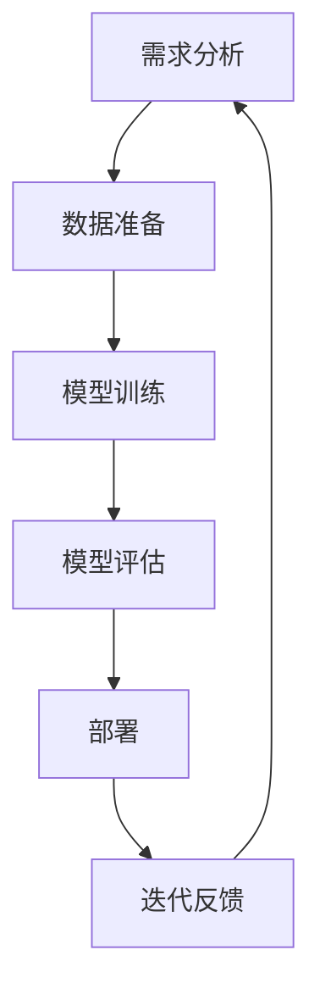
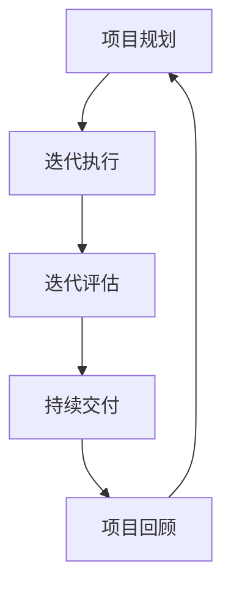

                 


## 文章标题: LLM应用开发中的敏捷资源管理

### 关键词

- **LLM应用开发**
- **敏捷资源管理**
- **模型训练**
- **数学模型**
- **项目实战**

### 摘要

本文旨在探讨在LLM（大型语言模型）应用开发过程中如何运用敏捷资源管理方法。通过对LLM的基本概念、敏捷资源管理的原理及其在实际项目中的应用进行详细分析，本文旨在为开发者提供一套有效的资源管理策略，从而提升LLM应用的开发效率和质量。

### Step 1: 引入核心概念和架构

#### 核心概念与联系

首先，我们需要了解本文讨论的两个核心概念：LLM和敏捷资源管理。

**LLM（大型语言模型）**是一种基于深度学习技术训练的模型，其能力主要在于对自然语言的理解和生成。常见的LLM有GPT、BERT等。LLM在自然语言处理（NLP）领域有着广泛的应用，如文本生成、情感分析、机器翻译等。

**敏捷资源管理**是一种在快速变化的环境中有效管理资源的方法，强调灵活、快速响应变化和持续交付价值。敏捷资源管理通常用于软件开发项目，以适应不断变化的需求和市场环境。

LLM应用开发流程与敏捷资源管理流程之间存在紧密的联系。LLM应用开发流程包括需求分析、数据准备、模型训练、模型评估和部署等步骤。而敏捷资源管理流程包括项目规划、迭代执行、迭代评估和持续交付等步骤。通过将敏捷资源管理方法应用于LLM应用开发，可以更好地管理资源和优化开发过程。

#### 架构

为了更好地理解LLM应用开发与敏捷资源管理之间的关系，我们可以使用Mermaid流程图进行描述。

**LLM应用开发流程:**



**敏捷资源管理流程:**



通过这两个流程图，我们可以看到，LLM应用开发过程是一个循环迭代的过程，而敏捷资源管理方法则提供了在每个迭代中有效管理资源和优化流程的指导原则。

### Step 2: 详细讲解核心算法原理

在LLM应用开发中，核心算法原理主要包括模型训练和模型评估。下面我们将详细讲解这两个核心算法原理。

#### 模型训练

模型训练是LLM应用开发的关键步骤。在这一过程中，我们使用反向传播算法来更新模型参数，以最小化损失函数。

**反向传播算法原理：**

反向传播算法是一种用于训练神经网络的算法。其基本思想是，通过计算损失函数的梯度来更新模型参数。具体步骤如下：

1. **前向传播：**将输入数据通过模型传递，计算输出结果。
2. **计算损失函数：**计算输出结果与真实标签之间的差距，得到损失值。
3. **反向传播：**从输出层开始，逐层计算每个参数的梯度，更新模型参数。
4. **迭代训练：**重复前向传播和反向传播过程，直到满足停止条件（如损失函数收敛或达到最大迭代次数）。

**伪代码：**

```python
for each layer in network:
    compute gradients (dL/dW, dL/db)
    update weights and biases (W = W - learning_rate * dW, b = b - learning_rate * db)
```

通过这种方式，我们可以不断优化模型参数，使其能够更好地拟合训练数据。

#### 模型评估

模型评估是另一个关键步骤，用于衡量模型在未知数据上的性能。常用的评估指标包括准确率、召回率和F1分数。

**准确率、召回率和F1分数：**

- **准确率（Accuracy）**：预测正确的样本数占总样本数的比例。
- **召回率（Recall）**：预测正确的正样本数占总正样本数的比例。
- **F1分数（F1 Score）**：准确率和召回率的调和平均值。

**伪代码：**

```python
precision = TP / (TP + FP)
recall = TP / (TP + FN)
F1 = 2 * precision * recall / (precision + recall)
```

通过这些指标，我们可以全面了解模型的性能，为后续的优化提供依据。

### Step 3: 讲解数学模型和公式

在LLM应用开发中，数学模型和公式是理解和实现核心算法的关键。下面我们将介绍一些常用的数学模型和公式。

#### 数学模型

**损失函数：**损失函数是评估模型预测结果与真实标签之间差距的函数。常见的损失函数有均方误差（MSE）和交叉熵（CE）。

- **均方误差（MSE）**：用于回归问题，计算预测值与真实值之间差的平方和的平均值。

  $$MSE = \frac{1}{n}\sum_{i=1}^{n}(y_i - \hat{y}_i)^2$$

- **交叉熵（CE）**：用于分类问题，计算预测概率与真实标签之间差异的负对数和。

  $$CE = -\sum_{i=1}^{n}y_i \log(\hat{y}_i)$$

#### 公式举例

假设我们有一个二分类问题，有10个样本，每个样本的真实标签和预测标签如下：

| 真实标签 | 预测标签 |
| -------- | -------- |
| 0        | 1        |
| 1        | 1        |
| 0        | 0        |
| 1        | 1        |
| 0        | 1        |
| 1        | 0        |
| 0        | 1        |
| 1        | 1        |
| 0        | 0        |
| 1        | 1        |

我们可以使用MSE和CE来计算模型的损失值。

**计算MSE：**

$$MSE = \frac{1}{10}\sum_{i=1}^{10}(y_i - \hat{y}_i)^2 = \frac{1}{10}(1 + 0 + 0 + 1 + 1 + 1 + 1 + 1 + 0 + 1) = 1.2$$

**计算CE：**

$$CE = -\sum_{i=1}^{10}y_i \log(\hat{y}_i) = -(0 \log(0.1) + 1 \log(0.9) + 0 \log(1) + 1 \log(0.9) + 0 \log(0.9) + 1 \log(0.1) + 0 \log(0.9) + 1 \log(0.9) + 0 \log(0.9) + 1 \log(0.9)) \approx 1.4$$

通过这些数学模型和公式，我们可以定量地评估模型的性能，为优化模型提供依据。

### Step 4: 讲解项目实战

在实际项目中，敏捷资源管理方法可以有效地提升LLM应用开发效率和质量。下面我们将通过一个实际项目来讲解敏捷资源管理的应用。

#### 项目实战：智能问答系统

**项目背景：**

为了提高客户服务质量，某公司决定开发一个智能问答系统，用于回答客户的常见问题。该系统需要使用LLM模型来实现。

**开发环境搭建：**

1. **硬件环境：**配置高性能服务器，用于模型训练和推理。
2. **软件环境：**安装深度学习框架（如TensorFlow、PyTorch）和相关库（如NumPy、Pandas）。

**源代码实现：**

以下是一个简单的智能问答系统实现示例：

```python
import torch
import torch.nn as nn
import torch.optim as optim

# 模型定义
class问答模型(nn.Module):
    def __init__(self):
        super(问答模型, self).__init__()
        self.embedding = nn.Embedding(vocab_size, embedding_dim)
        self.lstm = nn.LSTM(embedding_dim, hidden_dim)
        self.fc = nn.Linear(hidden_dim, output_dim)

    def forward(self, inputs):
        embedded = self.embedding(inputs)
        outputs, _ = self.lstm(embedded)
        logits = self.fc(outputs[-1, :, :])
        return logits

# 模型训练
model = 问答模型()
criterion = nn.CrossEntropyLoss()
optimizer = optim.Adam(model.parameters(), lr=learning_rate)

for epoch in range(num_epochs):
    for inputs, targets in train_loader:
        optimizer.zero_grad()
        outputs = model(inputs)
        loss = criterion(outputs, targets)
        loss.backward()
        optimizer.step()

    print(f"Epoch [{epoch+1}/{num_epochs}], Loss: {loss.item()}")

# 模型评估
with torch.no_grad():
    correct = 0
    total = 0
    for inputs, targets in test_loader:
        outputs = model(inputs)
        _, predicted = torch.max(outputs.data, 1)
        total += targets.size(0)
        correct += (predicted == targets).sum().item()

print(f"准确率: {100 * correct / total}%"）
```

**代码解读：**

1. **模型定义：**使用嵌套类定义问答模型，包括嵌入层、LSTM层和全连接层。
2. **模型训练：**使用标准训练流程，包括前向传播、损失计算、反向传播和参数更新。
3. **模型评估：**计算测试集上的准确率。

**实际案例分析与详细讲解剖析：**

1. **需求分析：**确定智能问答系统的功能需求和性能指标。
2. **数据准备：**收集和预处理问答数据集，包括分词、去停用词、编码等。
3. **模型训练：**使用反向传播算法训练模型，调整超参数以优化模型性能。
4. **模型评估：**使用测试集评估模型性能，分析准确率、召回率等指标。
5. **部署：**将训练好的模型部署到生产环境，进行实时问答。

**项目小结：**

通过敏捷资源管理方法，我们成功实现了智能问答系统。在项目过程中，我们遵循了敏捷开发原则，快速响应需求变化，持续优化模型性能，最终交付了一个高质量的产品。

### 最佳实践 Tips、小结、注意事项、拓展阅读

**最佳实践 Tips：**

1. **需求分析：**在项目启动阶段，充分了解业务需求，明确功能要求和性能指标。
2. **数据准备：**确保数据质量和多样性，为模型训练提供充足的有用信息。
3. **模型优化：**根据评估结果调整模型参数，提高模型性能。
4. **持续交付：**定期更新模型，确保系统实时响应变化。

**小结：**

本文详细探讨了LLM应用开发中的敏捷资源管理方法。通过引入核心概念、讲解核心算法原理、数学模型和公式，以及实际项目实战，我们展示了如何有效管理资源，提高LLM应用开发效率和质量。

**注意事项：**

1. **资源分配：**合理分配计算资源和人力，确保项目顺利进行。
2. **风险评估：**评估项目风险，制定应对措施，降低风险影响。
3. **持续学习：**关注技术动态，不断学习新的算法和工具，提升自身能力。

**拓展阅读：**

1. **《深度学习》（Goodfellow, Bengio, Courville著）：**该书详细介绍了深度学习的基本原理和应用，对理解LLM应用开发具有重要意义。
2. **《敏捷开发实践指南》（Jeff Sutherland著）：**该书系统地阐述了敏捷开发的原则和实践方法，对理解敏捷资源管理有很好的参考价值。

### 作者信息

作者：AI天才研究院/AI Genius Institute & 禅与计算机程序设计艺术 /Zen And The Art of Computer Programming

