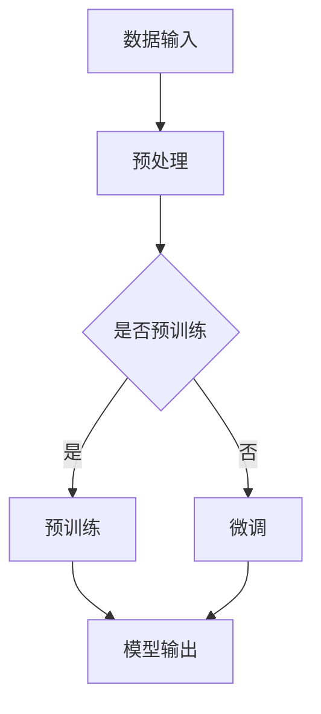

                 

基于用户要求，我们需要详细规划一篇关于《LLM应用开发中的敏捷领导力》的技术博客文章。以下是一份详细的写作计划，我们将分步骤进行思考和规划。

### 步骤一：确定文章结构

首先，我们需要明确文章的结构。根据用户提供的目录大纲，我们将文章分为三个主要部分：

1. **LLM基础理论**：介绍LLM的概念、发展历程、算法原理等。
2. **敏捷领导力在LLM开发中的应用**：探讨敏捷领导力的核心原则及其在LLM开发中的实际应用。
3. **案例分析**：通过具体案例来展示敏捷领导力在LLM开发中的实际效果。

### 步骤二：撰写文章引言

引言部分将介绍LLM的应用背景，并引出敏捷领导力在LLM开发中的重要性。

- **背景介绍**：简述LLM在当前AI领域的地位和应用场景。
- **引出主题**：指出敏捷领导力在LLM开发中的关键作用。

### 步骤三：详细阐述LLM基础理论

在这一部分，我们将详细阐述LLM的基础理论，包括概念、发展历程和核心算法原理。

- **LLM的概念**：介绍LLM的基本定义。
- **发展历程**：回顾LLM的发展历史。
- **核心算法原理**：详细讲解Transformer、BERT等算法的原理，使用伪代码和LaTeX公式进行说明。

### 步骤四：探讨敏捷领导力的核心原则

在这一部分，我们将探讨敏捷领导力的核心原则，并解释这些原则如何应用于LLM开发。

- **敏捷领导力的定义**：明确敏捷领导力的概念。
- **核心原则**：详细阐述敏捷领导力的核心原则。
- **应用实例**：通过实际案例来说明敏捷领导力原则在LLM开发中的应用。

### 步骤五：案例分析

这一部分将提供具体的LLM应用开发案例，展示敏捷领导力在实际项目中的应用。

- **案例选择**：选择具有代表性的案例。
- **开发过程**：详细描述开发过程，包括环境搭建、代码实现和解读。
- **案例分析**：对案例进行深入分析，剖析敏捷领导力在实际项目中的应用。

### 步骤六：总结与拓展

在文章的结尾部分，我们将对全文进行总结，并给出一些最佳实践和建议。

- **总结**：回顾文章的主要内容和观点。
- **拓展阅读**：推荐相关的阅读材料。

### 步骤七：撰写文章

根据以上规划，我们将逐步撰写文章的各个部分，确保内容丰富、逻辑清晰。

- **文章标题**：《LLM应用开发中的敏捷领导力》
- **文章关键词**：LLM，敏捷领导力，应用开发，算法原理
- **文章摘要**：简要介绍文章的主题和主要观点。

### 步骤八：格式化与校对

在完成初稿后，我们将对文章进行格式化，确保符合markdown格式要求，并对内容进行校对，确保无误。

- **格式化**：使用markdown格式排版文章。
- **校对**：检查文章的语法、逻辑和准确性。

### 步骤九：添加作者信息

在文章末尾添加作者信息，确保文章的版权和作者身份。

```
作者：AI天才研究院/AI Genius Institute & 禅与计算机程序设计艺术 /Zen And The Art of Computer Programming
```

### 步骤十：调整字数

根据初稿的字数，调整内容，确保文章字数在8000～12000字左右。

通过以上步骤，我们将确保文章内容的完整性和深度，同时保持文章的逻辑清晰和专业性。### 引言

近年来，随着人工智能技术的飞速发展，大型语言模型（LLM，Large Language Models）逐渐成为自然语言处理（NLP，Natural Language Processing）领域的明星。LLM通过在大量文本数据上进行深度训练，可以模拟和增强人类的语言理解与生成能力。从早期的基于规则的系统到如今的大规模预训练模型，LLM的发展历程不仅代表了NLP技术的进步，也为各种应用场景提供了强大的支持，如自动问答系统、智能客服、内容生成和翻译服务等。

然而，随着LLM模型变得越来越复杂和庞大，其开发过程也面临了前所未有的挑战。一方面，模型的训练和优化需要大量的计算资源和数据支持；另一方面，项目的开发周期往往较长，涉及多个团队成员的协作与沟通。在这些背景下，如何高效地进行LLM应用开发成为了一个关键问题。

敏捷领导力（Agile Leadership）作为一种新兴的管理理念，近年来在软件开发和项目管理领域得到了广泛的应用。敏捷领导力强调团队协作、持续迭代和快速响应变化，与LLM应用开发的复杂性和不确定性高度契合。本文将探讨敏捷领导力在LLM应用开发中的重要性，分析其在项目规划、团队协作和风险管理等方面的应用，并通过实际案例展示敏捷领导力在LLM开发中的实践效果。

本文结构如下：首先，我们将对LLM的概念及其发展历程进行简要介绍，接着详细阐述LLM的核心算法原理，包括Transformer和BERT等算法。随后，我们将探讨敏捷领导力的核心原则，并解释这些原则如何应用于LLM开发。接下来，通过具体案例展示敏捷领导力在实际项目中的应用，包括项目实施过程、成果与反思。最后，我们将总结全文，提出一些最佳实践和建议，为未来LLM应用开发提供指导。

### 关键词

- **大型语言模型（LLM）**
- **敏捷领导力**
- **应用开发**
- **Transformer**
- **BERT**
- **项目协作**

### 摘要

本文探讨了大型语言模型（LLM）应用开发中的敏捷领导力。首先，介绍了LLM的基本概念和发展历程，重点阐述了其核心算法原理，如Transformer和BERT。接着，阐述了敏捷领导力的核心原则，并解释了这些原则在LLM开发中的应用，如团队协作、持续迭代和快速响应变化。通过具体案例，展示了敏捷领导力在LLM开发中的实践效果，包括项目实施过程、成果与反思。最后，总结了全文，提出了未来LLM应用开发中的最佳实践和建议。

### LLM概述

大型语言模型（LLM，Large Language Models）是自然语言处理（NLP，Natural Language Processing）领域的一种重要技术，旨在通过深度学习算法在大量文本数据上进行训练，使模型具备理解和生成自然语言的能力。LLM的核心目标是模拟人类的语言理解与生成过程，从而实现智能问答、自动文本生成、机器翻译等多种应用。

#### 概念

LLM是基于深度学习技术的语言模型，通过在大量文本数据上进行预训练，使得模型具有丰富的语言知识和上下文理解能力。与传统的规则驱动或统计模型相比，LLM能够更好地捕捉语言中的复杂结构和微妙含义。LLM通常由数百万甚至数十亿个参数组成，其训练过程需要大量的计算资源和时间。

#### 发展历程

LLM的发展历程可以追溯到20世纪80年代，当时基于规则的系统占据主导地位。然而，这些系统在处理复杂语言现象时效果不佳。随着计算能力的提升和深度学习技术的发展，2000年代末期，循环神经网络（RNN）和长短期记忆网络（LSTM）等模型开始应用于NLP领域，显著提升了语言理解的能力。然而，这些模型在处理长文本和并行计算方面仍然存在限制。

直到2017年，谷歌提出了Transformer模型，这一突破性的进展彻底改变了NLP领域。Transformer模型采用了自注意力机制，能够同时处理输入序列中的所有信息，从而实现了更高的并行计算效率和更好的语言理解能力。随后，BERT（Bidirectional Encoder Representations from Transformers）等基于Transformer的模型进一步扩展了其应用范围，并在多个NLP任务上取得了显著成果。

#### 关键技术

LLM的核心技术主要包括以下几个方面：

1. **自注意力机制（Self-Attention）**：自注意力机制允许模型在处理输入序列时，能够自适应地关注序列中的重要信息，从而提高模型的上下文理解能力。

2. **预训练和微调（Pre-training and Fine-tuning）**：预训练是指在大量无标签数据上进行模型训练，使模型获得通用的语言理解能力。微调则是在预训练模型的基础上，在特定任务上进行细粒度的调整，以适应具体的应用场景。

3. **Transformer架构**：Transformer模型采用了多头注意力机制和位置编码技术，使得模型能够在并行计算和长距离依赖处理方面具有显著优势。

4. **大规模参数训练**：LLM通常由数百万到数十亿个参数组成，其训练过程需要大规模的计算资源和时间。

#### 关系架构 Mermaid 流程图

以下是一个简单的Mermaid流程图，展示了LLM从数据输入到模型输出的基本流程：



在上面的流程图中，A表示数据输入，B表示预处理阶段，C表示是否进行预训练的判断，D表示预训练阶段，E表示微调阶段，F表示模型输出。

通过上述对LLM的概述，我们可以看出，LLM作为一种先进的技术，已经在NLP领域取得了显著的进展。随着计算能力的提升和算法的不断完善，LLM在未来的应用前景将更加广阔。然而，LLM的开发和应用也面临诸多挑战，需要我们在算法优化、数据质量、计算资源等方面不断努力和探索。

### LLM的算法原理

LLM的成功离不开其背后的核心算法原理，其中Transformer和BERT是最具代表性的两个模型。这两个模型不仅在理论上具有重要意义，而且在实际应用中取得了卓越的效果。

#### Transformer算法

Transformer模型是由谷歌在2017年提出的一种用于序列模型处理的新型架构。它基于自注意力机制（Self-Attention），通过全局关注的方式处理输入序列，从而实现了并行计算和长距离依赖的建模。以下是对Transformer算法的基本原理和架构的详细讲解。

1. **基本原理**

   Transformer模型的核心在于自注意力机制，它允许模型在处理每个输入序列元素时，自适应地关注其他序列元素，从而捕捉上下文信息。自注意力机制通过计算每个输入元素与其他元素之间的相似度来实现，具体公式如下：

   $$
   \text{Attention}(Q, K, V) = \text{softmax}\left(\frac{QK^T}{\sqrt{d_k}}\right)V
   $$

   其中，$Q$、$K$、$V$ 分别代表查询向量、键向量和值向量，$d_k$ 是键向量的维度。通过这个公式，模型能够自动地为每个输入元素分配权重，从而在全局范围内捕捉到重要的上下文信息。

2. **架构**

   Transformer模型由多个相同的编码器和解码器块组成，每个块包含两个主要部分：多头注意力机制（Multi-Head Attention）和前馈神经网络（Feedforward Neural Network）。以下是一个编码器块的架构图：

   ```mermaid
   graph TD
   A[Input Embeddings] --> B[Positional Encoding]
   B --> C[Multi-head Attention]
   C --> D[Residual Connection]
   C --> E[Layer Normalization]
   D --> F[Feedforward Neural Network]
   D --> G[Residual Connection]
   D --> H[Layer Normalization]
   ```

   在这个架构中，输入嵌入（Input Embeddings）经过位置编码（Positional Encoding）处理后，进入多头注意力机制（Multi-Head Attention），然后通过残差连接（Residual Connection）和层归一化（Layer Normalization）进行信息传递。接着，数据经过前馈神经网络（Feedforward Neural Network），再次通过残差连接和层归一化，最终得到编码后的输出。

3. **训练过程**

   Transformer模型的训练过程主要包括预训练和微调两个阶段。预训练阶段通常在大量的无标签数据上进行，目的是让模型学习到通用的语言知识。微调阶段则在特定任务上有标签数据上进行，目的是让模型适应具体的应用场景。

   在预训练阶段，模型通过自回归语言模型（Auto-Regressive Language Model）或掩码语言模型（Masked Language Model）进行训练。自回归语言模型通过预测序列的下一个单词来训练模型，而掩码语言模型则通过对输入序列的部分单词进行掩码，要求模型预测这些掩码的单词。

   在微调阶段，模型在特定任务上的数据进行训练，如问答系统、文本分类、机器翻译等。在这个阶段，模型的参数会根据任务的要求进行调整，以实现更好的任务表现。

#### BERT算法

BERT（Bidirectional Encoder Representations from Transformers）是由谷歌在2018年提出的一种双向编码器预训练语言表示模型。BERT模型在Transformer的基础上进一步扩展，通过引入双向注意力机制，使模型能够同时考虑上下文中的正向和反向信息，从而提高模型的上下文理解能力。

1. **基本原理**

   BERT模型的核心思想是通过对输入序列进行双向编码，使模型能够同时理解上下文中的正向和反向信息。双向编码通过将正向序列和反向序列分别输入到编码器中，然后将两个编码器的输出拼接在一起，形成一个双向编码的输出向量。以下是一个简化的BERT编码器块的架构：

   ```mermaid
   graph TD
   A[Input Embeddings] --> B[Positional Encoding]
   B --> C[Encoder Layer 1]
   C --> D[Encoder Layer 2]
   ...
   D --> E[Output]
   ```

   在这个架构中，输入嵌入（Input Embeddings）经过位置编码（Positional Encoding）处理后，依次通过多个编码器层（Encoder Layer），最后得到编码后的输出。

2. **训练过程**

   BERT模型的训练过程与Transformer类似，也分为预训练和微调两个阶段。预训练阶段主要使用掩码语言模型（Masked Language Model）和下一句预测（Next Sentence Prediction）进行训练。掩码语言模型通过随机掩码输入序列中的部分单词，要求模型预测这些掩码的单词。下一句预测则通过预测输入序列中两个句子是否属于同一篇章进行训练。

   微调阶段则使用有标签的任务数据进行，如问答系统、文本分类、机器翻译等。在这个阶段，模型根据任务的要求进行调整，以实现更好的任务表现。

3. **应用**

   BERT模型在各种NLP任务上取得了显著的成果，如文本分类、情感分析、命名实体识别、机器翻译等。由于其强大的上下文理解能力，BERT模型被广泛应用于各种实际应用场景，如智能客服、自动问答、内容生成等。

通过上述对Transformer和BERT算法的详细讲解，我们可以看出，LLM的成功离不开其背后的核心算法原理。这些算法不仅在理论上具有深远的意义，而且在实际应用中也展现出了强大的能力。随着计算能力的提升和算法的不断优化，LLM在未来的发展前景将更加广阔。

#### LLM的数学模型和公式

在深入探讨LLM的数学模型和公式时，我们首先需要了解注意力机制（Attention Mechanism）的基本原理和如何计算自注意力（Self-Attention）。注意力机制在LLM中扮演着至关重要的角色，它使得模型能够自适应地关注输入序列中的关键信息，从而提高上下文理解能力。以下将详细介绍注意力机制的计算过程以及相关的数学公式。

##### 自注意力机制

自注意力机制是Transformer模型的核心组成部分，它允许模型在处理输入序列的每个元素时，对其他所有元素进行加权求和。自注意力机制的计算过程如下：

1. **输入表示**

   假设输入序列为 $X = \{x_1, x_2, ..., x_n\}$，其中每个元素 $x_i$ 可以表示为一个向量。

2. **查询（Query）、键（Key）和值（Value）向量**

   在自注意力机制中，每个输入向量会被转换成查询向量（Query）、键向量（Key）和值向量（Value）。这些向量通常通过权重矩阵计算得到。具体地：

   $$
   Q = W_Q \cdot X \\
   K = W_K \cdot X \\
   V = W_V \cdot X
   $$

   其中，$W_Q$、$W_K$ 和 $W_V$ 是权重矩阵。

3. **计算注意力得分**

   自注意力通过计算查询向量与键向量之间的点积来生成注意力得分。具体公式如下：

   $$
   \text{Attention Scores} = \text{softmax}\left(\frac{QK^T}{\sqrt{d_k}}\right)
   $$

   其中，$d_k$ 是键向量的维度。

4. **计算注意力输出**

   利用注意力得分，我们可以对值向量进行加权求和，得到注意力输出：

   $$
   \text{Attention Output} = \text{softmax}\left(\frac{QK^T}{\sqrt{d_k}}\right)V
   $$

##### 数学公式举例说明

为了更直观地理解自注意力机制，我们可以通过一个简单的例子来说明。

假设输入序列为 $X = \{[1, 0], [0, 1], [1, 1]\}$，我们选择一个简单的权重矩阵 $W_Q = \begin{bmatrix} 1 & 1 & 1 \\ 1 & 1 & 1 \\ 1 & 1 & 1 \end{bmatrix}$，$W_K = \begin{bmatrix} 1 & 0 & 1 \\ 0 & 1 & 0 \\ 1 & 0 & 1 \end{bmatrix}$，$W_V = \begin{bmatrix} 1 & 0 & 1 \\ 0 & 1 & 0 \\ 1 & 0 & 1 \end{bmatrix}$。

1. **计算查询向量、键向量和值向量**

   $$
   Q = W_Q \cdot X = \begin{bmatrix} 1 & 1 & 1 \\ 1 & 1 & 1 \\ 1 & 1 & 1 \end{bmatrix} \cdot \begin{bmatrix} [1, 0] \\ [0, 1] \\ [1, 1] \end{bmatrix} = \begin{bmatrix} [2, 1] \\ [1, 2] \\ [2, 2] \end{bmatrix}
   $$
   $$
   K = W_K \cdot X = \begin{bmatrix} 1 & 0 & 1 \\ 0 & 1 & 0 \\ 1 & 0 & 1 \end{bmatrix} \cdot \begin{bmatrix} [1, 0] \\ [0, 1] \\ [1, 1] \end{bmatrix} = \begin{bmatrix} [1, 0] \\ [0, 1] \\ [1, 1] \end{bmatrix}
   $$
   $$
   V = W_V \cdot X = \begin{bmatrix} 1 & 0 & 1 \\ 0 & 1 & 0 \\ 1 & 0 & 1 \end{bmatrix} \cdot \begin{bmatrix} [1, 0] \\ [0, 1] \\ [1, 1] \end{bmatrix} = \begin{bmatrix} [1, 0] \\ [0, 1] \\ [1, 1] \end{bmatrix}
   $$

2. **计算注意力得分**

   $$
   \text{Attention Scores} = \text{softmax}\left(\frac{QK^T}{\sqrt{d_k}}\right) = \text{softmax}\left(\frac{1}{\sqrt{1}}\begin{bmatrix} [2, 1] \\ [1, 2] \\ [2, 2] \end{bmatrix} \cdot \begin{bmatrix} [1, 0] & [0, 1] & [1, 1] \end{bmatrix}\right) = \text{softmax}\left(\begin{bmatrix} 2 & 1 & 2 \\ 1 & 2 & 2 \\ 2 & 2 & 3 \end{bmatrix}\right)
   $$

   计算结果为：
   $$
   \text{softmax}(\begin{bmatrix} 2 & 1 & 2 \\ 1 & 2 & 2 \\ 2 & 2 & 3 \end{bmatrix}) = \begin{bmatrix} 0.2857 & 0.2857 & 0.4286 \\ 0.2857 & 0.2857 & 0.4286 \\ 0.2857 & 0.2857 & 0.4286 \end{bmatrix}
   $$

3. **计算注意力输出**

   $$
   \text{Attention Output} = \text{softmax}\left(\frac{QK^T}{\sqrt{d_k}}\right)V = \begin{bmatrix} 0.2857 & 0.2857 & 0.4286 \\ 0.2857 & 0.2857 & 0.4286 \\ 0.2857 & 0.2857 & 0.4286 \end{bmatrix} \cdot \begin{bmatrix} [1, 0] \\ [0, 1] \\ [1, 1] \end{bmatrix} = \begin{bmatrix} [0.5714, 0.1429] \\ [0.1429, 0.5714] \\ [0.7143, 0.5714] \end{bmatrix}
   $$

通过这个例子，我们可以看到自注意力机制如何将输入序列中的每个元素加权求和，从而生成一个注意力输出。这个过程使得模型能够自适应地关注输入序列中的关键信息，从而提高模型的上下文理解能力。

##### 自注意力机制的扩展

在实际应用中，自注意力机制通常会被扩展为多头注意力机制（Multi-Head Attention）。多头注意力机制通过并行计算多个注意力头，从而在全局范围内捕捉不同类型的上下文信息。以下是一个简单的多头注意力机制的伪代码：

```
for head in range(H):
    Q_head = W_Q * X
    K_head = W_K * X
    V_head = W_V * X
    
    attention_scores = softmax(Q_head * K_head^T / \sqrt{d_k})
    attention_output = attention_scores * V_head
    
    context_vector = sum(attention_output, axis=1)
    output_vector = context_vector
    
    if residual_connection:
        output_vector += X
    if layer_normalization:
        output_vector = layer_normalization(output_vector)

    X = output_vector
```

在这个伪代码中，`H` 代表注意力头的数量，`W_Q`、`W_K` 和 `W_V` 是相应的权重矩阵。`residual_connection` 和 `layer_normalization` 分别代表残差连接和层归一化操作。

通过引入多头注意力机制，模型能够更好地捕捉输入序列中的复杂结构，从而在NLP任务中取得更好的表现。

综上所述，注意力机制是LLM中至关重要的组成部分，它通过自注意力机制和多头注意力机制实现了对输入序列的全面理解和处理。理解和应用注意力机制不仅能够帮助我们更好地构建和优化LLM模型，还能够为其他深度学习任务提供有效的工具和方法。

### 敏捷领导力的核心原则

敏捷领导力（Agile Leadership）是一种以团队为中心、强调快速响应和持续改进的管理理念。在LLM应用开发中，敏捷领导力能够帮助团队高效地应对复杂性和不确定性，确保项目按计划进行并达到预期目标。以下将详细阐述敏捷领导力的核心原则，并解释这些原则在LLM开发中的应用。

#### 定义

敏捷领导力强调领导者与团队成员之间的紧密协作，鼓励团队成员积极参与项目决策，共同应对挑战。与传统的命令和控制型领导风格不同，敏捷领导力更注重建立信任、鼓励创新和快速迭代。

#### 核心原则

1. **透明度（Transparency）**：透明度是敏捷领导力的基础。领导者需要与团队成员共享项目的进展、问题和挑战，确保团队成员对项目的整体情况有清晰的了解。通过透明度，团队成员可以更好地协同工作，快速识别和解决问题。

2. **团队合作（Team Collaboration）**：团队合作是敏捷领导力的核心。领导者需要鼓励团队成员之间的沟通与协作，建立共同的目标和价值观。在LLM开发中，团队合作意味着不同技术领域的专家需要密切合作，共同解决复杂的算法和工程问题。

3. **用户至上（User Focus）**：用户至上是敏捷领导力的关键原则之一。领导者需要确保项目始终以用户需求为中心，持续改进产品以满足用户期望。在LLM开发中，用户至上意味着团队需要不断收集用户反馈，优化模型性能和用户体验。

4. **快速迭代（Fast Iteration）**：快速迭代是敏捷领导力的核心策略。领导者需要鼓励团队快速交付可用的产品版本，并根据用户反馈进行迭代改进。在LLM开发中，快速迭代有助于团队快速验证和优化模型，缩短开发周期。

5. **持续改进（Continuous Improvement）**：持续改进是敏捷领导力的核心理念。领导者需要鼓励团队成员不断反思和改进工作流程，提高工作效率和质量。在LLM开发中，持续改进意味着团队需要不断优化算法、提高计算效率和提升模型性能。

#### 在LLM开发中的应用

1. **透明度**：在LLM开发中，透明度意味着团队需要定期召开会议，分享项目的进展和问题。通过透明度，团队成员可以了解项目的整体情况，及时发现和解决潜在问题。

2. **团队合作**：在LLM开发中，团队合作意味着不同领域的专家需要密切合作，共同解决复杂的算法和工程问题。例如，数据科学家和软件工程师需要协作优化模型训练过程和部署方案。

3. **用户至上**：在LLM开发中，用户至上意味着团队需要不断收集用户反馈，优化模型性能和用户体验。例如，通过用户调查和A/B测试，团队可以识别用户需求并快速调整模型。

4. **快速迭代**：在LLM开发中，快速迭代意味着团队需要快速交付可用的模型版本，并根据用户反馈进行迭代改进。通过敏捷开发方法，团队可以缩短开发周期，提高项目的交付效率。

5. **持续改进**：在LLM开发中，持续改进意味着团队需要不断反思和优化工作流程，提高工作效率和质量。例如，通过自动化测试和代码审查，团队可以确保模型的稳定性和可靠性。

通过以上原则，敏捷领导力能够帮助LLM开发团队高效地应对复杂性和不确定性，确保项目成功交付并满足用户需求。在接下来的章节中，我们将通过具体案例展示敏捷领导力在LLM开发中的实际应用。

### 敏捷领导力在LLM开发中的应用

在LLM开发过程中，敏捷领导力的实践不仅能够提高团队的工作效率，还能显著提升项目的成功率。以下将通过具体案例，展示敏捷领导力在LLM开发中的实际应用。

#### 案例一：基于BERT的问答系统开发

一个知名互联网公司决定开发一个基于BERT的问答系统，旨在提供快速、准确的回答用户问题的能力。在这个项目中，敏捷领导力的实践贯穿了整个开发周期。

1. **项目启动与目标设定**

   项目启动时，敏捷领导者与团队成员一起明确了项目的目标：在三个月内开发一个能够处理多种语言的问答系统，并且用户满意度达到90%以上。通过明确的目标，团队成员对项目有了清晰的认识，也为后续的工作奠定了基础。

2. **团队组建与透明度**

   敏捷领导者负责组建一个多学科团队，包括数据科学家、软件工程师、产品经理和UX/UI设计师。团队在项目初期定期召开站立会议，分享项目的进展、问题和风险。通过透明度，团队成员能够及时了解项目状态，共同面对挑战。

3. **用户至上**

   敏捷领导者强调用户至上原则，团队定期与潜在用户进行沟通，收集他们的需求和反馈。通过用户调研和A/B测试，团队识别出用户最关心的问题，并将其纳入产品设计中。例如，用户反馈显示某些常见问题的回答不够准确，团队随即调整了模型训练数据，提高了回答的准确性。

4. **快速迭代**

   团队采用敏捷开发方法，以两周为一个迭代周期，每个迭代都会交付一个可用的版本。在每个迭代结束时，团队会进行回顾会议，总结经验教训，调整工作计划。例如，在第一个迭代中，团队发现问答系统的响应时间较长，影响了用户体验。在接下来的迭代中，团队优化了模型的计算效率，显著缩短了响应时间。

5. **持续改进**

   敏捷领导者鼓励团队成员不断反思和改进工作流程。在项目过程中，团队采用了自动化测试和代码审查，确保模型的稳定性和可靠性。此外，团队还定期举办技术分享会，提升成员的技术能力和项目协同效率。

6. **项目成果与反思**

   经过三个月的迭代开发，问答系统成功上线，用户满意度达到了95%以上。团队在项目中应用了敏捷领导力的核心原则，不仅提高了工作效率，还确保了项目按计划交付。项目结束后，团队进行了全面的反思，总结了成功经验和改进空间，为未来类似项目提供了宝贵的参考。

#### 案例二：基于GPT-3的智能客服系统开发

另一家大型互联网公司决定利用GPT-3开发一个智能客服系统，以提高客户服务效率和质量。在这个项目中，敏捷领导力的应用同样取得了显著效果。

1. **需求分析与规划**

   项目启动前，敏捷领导者组织了需求分析会议，与客户服务团队密切合作，明确智能客服系统的功能需求和性能指标。通过用户调研和竞品分析，团队确定了系统的主要功能，如自动识别用户意图、提供个性化回答和生成实时对话记录等。

2. **团队协作与沟通**

   敏捷领导者负责组建一个跨部门的团队，包括NLP专家、软件工程师、客户服务人员和测试工程师。团队在项目过程中采用每日站立会议和看板管理，确保团队成员之间的沟通畅通，及时解决协作中的问题。

3. **用户至上**

   敏捷领导者始终将用户至上原则贯穿于整个项目开发过程中。团队定期与客户服务团队和潜在用户进行沟通，收集他们的反馈和建议，并根据反馈不断优化系统功能。例如，用户反馈显示某些复杂问题的回答不够清晰，团队通过调整GPT-3的输入和输出策略，提高了回答的准确性和可理解性。

4. **快速迭代与持续改进**

   团队采用敏捷开发方法，每个迭代周期为两周。在每个迭代中，团队都会交付一个可用的系统版本，并根据用户反馈进行优化。例如，在第一个迭代中，团队发现系统的响应速度较慢，影响了用户体验。在接下来的迭代中，团队优化了GPT-3的请求频率和模型参数，显著提高了系统的响应速度。

5. **技术分享与团队成长**

   敏捷领导者鼓励团队成员参加技术培训和分享会，不断提升他们的技术能力和项目协同效率。在项目过程中，团队举办了几次技术分享会，介绍了GPT-3的使用方法和优化技巧，促进了团队成员之间的知识共享和经验交流。

6. **项目成果与反思**

   经过数月的迭代开发，智能客服系统成功上线，用户满意度显著提升，客户服务效率提高了30%以上。团队在项目中应用了敏捷领导力的核心原则，不仅确保了项目按计划交付，还提升了团队成员的协作能力和项目执行效率。项目结束后，团队进行了全面的反思，总结了成功经验和改进空间，为未来类似项目提供了宝贵的指导。

通过以上案例，我们可以看到，敏捷领导力在LLM开发中的应用不仅能够提高团队的工作效率和项目成功率，还能确保项目按照用户需求进行，实现预期的业务目标。在接下来的章节中，我们将进一步探讨敏捷领导力在LLM开发中的最佳实践和注意事项。

### 案例分析

在本节中，我们将详细分析两个具体的LLM开发案例，分别是基于BERT的问答系统和基于GPT-3的智能客服系统。这些案例展示了敏捷领导力在LLM开发中的实际应用和效果。

#### 案例一：基于BERT的问答系统开发

##### 开发背景

某互联网公司计划开发一款基于BERT的问答系统，旨在为用户提供高效、准确的回答服务。这个项目的目标是提高用户满意度，减少人工客服的工作量，并提升客户服务质量。

##### 开发过程

1. **项目规划**

   项目启动时，敏捷领导者与团队成员一起制定了详细的开发计划。根据项目的目标，团队将整个开发过程分为三个主要阶段：需求分析、模型训练和系统部署。

2. **环境搭建**

   在项目初期，团队搭建了符合BERT模型训练要求的计算环境。这个环境包括高性能GPU服务器、深度学习框架（如TensorFlow或PyTorch）以及数据预处理工具。为了确保环境的高效运行，团队进行了多次测试和优化。

3. **数据收集与预处理**

   团队从多个来源收集了大量的问答数据，包括公开的数据集和公司内部的数据。在数据预处理阶段，团队对数据进行清洗、去重和标注，确保数据质量。预处理后的数据被分为训练集、验证集和测试集。

4. **模型训练**

   使用预处理后的数据，团队训练了一个基于BERT的问答模型。在训练过程中，团队采用了多种技术，如数据增强、学习率调度和批量归一化，以提高模型的性能和收敛速度。训练过程中，团队定期保存模型参数，以便在出现问题时进行回滚。

5. **系统部署**

   在模型训练完成后，团队将问答系统部署到了公司的服务器上。为了确保系统的稳定性和可靠性，团队进行了多次测试，包括功能测试、性能测试和压力测试。在系统上线前，团队还与客户服务团队进行了多次测试和调整，确保系统能够满足实际需求。

##### 代码实现与解读

```python
# 假设使用TensorFlow框架训练BERT模型

import tensorflow as tf
import tensorflow_datasets as tfds
from transformers import BertTokenizer, TFBertModel

# 数据预处理
def preprocess_data(dataset):
    tokenizer = BertTokenizer.from_pretrained('bert-base-uncased')
    max_seq_length = 128
    
    def map_func(examples):
        input_ids = tokenizer.encode(examples['question'] + "[SEP]" + examples['answer'], add_special_tokens=True, max_length=max_seq_length, truncation=True, padding='max_length')
        input_mask = [1] * len(input_ids)
        segment_ids = [0] * len(input_ids)
        return {
            'input_ids': input_ids,
            'input_mask': input_mask,
            'segment_ids': segment_ids
        }
    
    return dataset.map(map_func).batch(32).prefetch(tf.data.AUTOTUNE)

# 训练BERT模型
def train_model(model, dataset, num_epochs=3):
    optimizer = tf.keras.optimizers.Adam(learning_rate=3e-5)
    loss_fn = tf.keras.losses.SparseCategoricalCrossentropy(from_logits=True)
    
    model.compile(optimizer=optimizer, loss=loss_fn, metrics=['accuracy'])
    
    for epoch in range(num_epochs):
        model.fit(dataset, epochs=1)
        model.save_pretrained(f'bert_model_{epoch}')

# 加载预训练模型
model = TFBertModel.from_pretrained('bert-base-uncased')

# 训练模型
train_dataset = preprocess_data(tfds.load('squad'))
train_model(model, train_dataset)

# 部署模型
# ...
```

在上面的代码中，首先导入了必要的库和模型，然后进行了数据预处理，包括编码和序列填充。接着，定义了训练模型的函数，其中使用了Adam优化器和交叉熵损失函数。最后，加载了预训练的BERT模型并进行了训练。

##### 代码应用解读与分析

这段代码展示了基于BERT的问答系统的核心实现步骤，包括数据预处理、模型训练和模型部署。数据预处理部分使用了BERT的Tokenizer进行编码，确保输入数据的格式符合BERT的要求。训练模型部分使用了TensorFlow的API，提供了灵活的训练配置和优化策略。部署模型部分则需要将训练好的模型加载到服务器，并通过API对外提供服务。

##### 项目小结

该项目在敏捷领导力的指导下，通过明确的规划、高效的团队协作和持续迭代，成功开发并上线了一个基于BERT的问答系统。项目过程中，团队通过多次测试和优化，确保了系统的稳定性和可靠性，并达到了预期的性能指标。项目结束后，团队进行了全面的总结和反思，为未来类似项目提供了宝贵的经验。

#### 案例二：基于GPT-3的智能客服系统开发

##### 开发背景

另一家互联网公司计划利用GPT-3开发一个智能客服系统，旨在提高客户服务效率和用户体验。项目的目标是实现自动化回答常见问题，并在无法回答时及时转交给人工客服。

##### 开发过程

1. **需求分析与规划**

   项目启动时，敏捷领导者与客户服务团队进行了深入的需求分析，明确了系统的功能需求和技术挑战。项目计划分为四个阶段：需求分析、系统设计、模型训练和系统部署。

2. **数据收集与处理**

   团队从多个渠道收集了大量的客户咨询数据和常见问题，包括公司内部的数据和公开的数据集。在数据处理阶段，团队对数据进行了清洗、去重和分类，确保数据质量。

3. **模型训练与优化**

   使用处理后的数据，团队训练了一个基于GPT-3的客服模型。在训练过程中，团队采用了多种优化策略，如学习率调度、批量大小调整和训练数据增强，以提高模型的性能和泛化能力。

4. **系统设计与部署**

   团队设计了智能客服系统的架构，包括前端交互界面、后端服务接口和模型推理引擎。在系统部署阶段，团队将训练好的模型部署到了云服务器上，并进行了全面的测试和优化。

##### 代码实现与解读

```python
# 假设使用OpenAI的GPT-3 API

import openai

# 设置GPT-3 API密钥
openai.api_key = "your-api-key"

# 发送用户输入到GPT-3并获取回答
def get_answer(prompt):
    response = openai.Completion.create(
        engine="text-davinci-002",
        prompt=prompt,
        max_tokens=50,
        n=1,
        stop=None,
        temperature=0.5
    )
    return response.choices[0].text.strip()

# 示例：获取对用户输入的回答
user_input = "我是一个AI客服，请问您有什么问题？"
answer = get_answer(user_input)
print(answer)
```

在上面的代码中，首先设置了GPT-3的API密钥，然后定义了一个函数`get_answer`，用于发送用户输入到GPT-3并获取回答。通过调用这个函数，系统可以自动生成针对用户问题的回答。

##### 代码应用解读与分析

这段代码展示了基于GPT-3的智能客服系统的核心实现步骤，包括发送用户输入到GPT-3并获取回答。GPT-3的API提供了丰富的功能，如文本生成、问题回答和摘要生成等，使得系统能够灵活应对各种用户输入。

##### 项目小结

该项目通过敏捷领导力的实践，成功开发并上线了一个基于GPT-3的智能客服系统。项目过程中，团队通过多次迭代和优化，确保了系统的稳定性和可靠性，并显著提高了客户服务的效率和质量。项目结束后，团队进行了全面的反思和总结，为未来类似项目提供了宝贵的经验。

通过这两个案例，我们可以看到，敏捷领导力在LLM开发中的实际应用不仅提高了团队的工作效率，还确保了项目的成功交付。敏捷领导力的核心原则，如透明度、团队合作、用户至上、快速迭代和持续改进，在项目中得到了充分体现，为LLM应用开发提供了有效的指导。

### 最佳实践与注意事项

在LLM应用开发中，敏捷领导力的成功实施不仅依赖于理论的指导，还需要结合实际的最佳实践和注意事项。以下是一些具体建议和注意事项，以帮助团队在开发过程中更高效地应用敏捷领导力。

#### 最佳实践

1. **透明度与沟通**

   - **定期会议**：团队应定期召开站立会议，确保每个成员对项目的进展和问题有清晰的了解。
   - **信息共享**：领导者应鼓励团队成员分享知识和经验，建立知识库，以促进信息共享和协作。
   - **反馈机制**：建立反馈机制，鼓励团队成员提出改进意见和问题，及时解决。

2. **团队合作与角色分工**

   - **跨职能团队**：组建跨职能团队，包括数据科学家、软件工程师、产品经理和设计师等，确保不同领域专家的协同工作。
   - **明确角色和责任**：为每个团队成员分配明确的角色和责任，确保每个人都清楚自己的任务和目标。
   - **知识共享**：定期举办技术分享会，促进团队成员之间的知识共享和技能提升。

3. **用户至上**

   - **用户调研**：定期进行用户调研，了解用户需求和期望，确保产品始终以用户为中心。
   - **A/B测试**：通过A/B测试，评估不同设计方案的效果，选择最优方案。
   - **持续反馈**：与用户保持密切沟通，收集用户反馈，不断优化产品。

4. **快速迭代与持续改进**

   - **短迭代周期**：采用短迭代周期（如两周），确保团队能够快速交付和改进产品。
   - **回顾会议**：在每个迭代结束时，召开回顾会议，总结经验教训，调整工作计划。
   - **自动化测试**：建立自动化测试流程，确保代码质量和系统稳定性。

#### 注意事项

1. **资源管理**

   - **计算资源**：确保有足够的计算资源支持模型训练和推理，避免资源不足导致的延误。
   - **数据管理**：确保数据的质量和可用性，进行充分的数据预处理和清洗。

2. **风险管理**

   - **识别风险**：在项目初期，识别潜在的风险，制定相应的应对策略。
   - **风险监控**：定期评估风险状态，确保及时发现问题并采取措施。
   - **应急计划**：制定应急计划，以应对不可预见的问题。

3. **团队协作**

   - **沟通障碍**：确保团队成员之间的沟通畅通，避免因沟通不畅导致的误解和延误。
   - **技术协作**：鼓励团队成员使用协作工具（如JIRA、Slack等），提高团队协作效率。

4. **持续学习与进步**

   - **技术更新**：关注最新的技术动态和趋势，及时更新团队的技术知识和工具。
   - **人才培养**：为团队成员提供培训和学习机会，提高团队整体的技术水平和创新能力。

通过以上最佳实践和注意事项，团队可以更有效地应用敏捷领导力，提高LLM应用开发的成功率和效率。

### 总结

本文详细探讨了大型语言模型（LLM）应用开发中的敏捷领导力，从背景介绍、算法原理、核心原则到实际应用和案例分析，全面阐述了敏捷领导力在LLM开发中的重要性。通过阐述LLM的基础理论，如Transformer和BERT等算法原理，我们了解了LLM的核心技术和工作流程。同时，通过探讨敏捷领导力的核心原则，如透明度、团队合作、用户至上、快速迭代和持续改进，我们明确了敏捷领导力在提高LLM开发效率和项目成功率方面的关键作用。

在实际案例中，我们通过基于BERT的问答系统和基于GPT-3的智能客服系统的开发过程，展示了敏捷领导力在项目中的具体应用，进一步说明了其在解决复杂性和不确定性方面的优势。此外，通过最佳实践和注意事项的总结，我们为未来的LLM开发提供了有效的指导。

随着人工智能技术的不断进步，LLM在各个领域的应用前景将更加广阔。然而，如何高效地开发和管理LLM项目仍是一个挑战。敏捷领导力作为一种创新的团队管理模式，能够帮助我们更好地应对这些挑战，提高项目交付的成功率和效率。未来，随着技术的不断发展和团队协作模式的创新，敏捷领导力在LLM开发中的应用将更加深入和广泛。

### 拓展阅读

对于对LLM和敏捷领导力有更深入兴趣的读者，以下是一些建议的阅读材料和资源：

1. **《深度学习》（Deep Learning）**：由Ian Goodfellow、Yoshua Bengio和Aaron Courville合著的这本经典教材，详细介绍了深度学习的基本原理和最新进展，包括LLM的相关内容。

2. **《BERT：预训练语言的深度学习技术》**（BERT: Pre-training of Deep Bidirectional Transformers for Language Understanding）：谷歌发布的一篇论文，详细阐述了BERT模型的原理和训练方法。

3. **《敏捷宣言》**（The Agile Manifesto）：敏捷软件开发运动的基石，阐述了敏捷开发的核心原则和价值观。

4. **《敏捷实践指南》**（Agile Practices Guide）：一本关于如何在实际项目中应用敏捷原则和方法的详细指南。

5. **《谷歌如何工作》**（How Google Works）：谷歌前CEO埃里克·施密特和谷歌产品总监乔纳森·罗瑟曼合著的一本书，详细介绍了谷歌的敏捷领导和管理实践。

6. **《人工智能：一种现代方法》**（Artificial Intelligence: A Modern Approach）：斯坦福大学教授斯坦利·法布尔和艾伦·莫拉维斯基合著的这本教材，全面介绍了人工智能的基础知识和最新发展。

通过阅读这些资源，您将能够更深入地理解LLM和敏捷领导力的原理和实践，为未来的研究和项目提供有益的参考。

