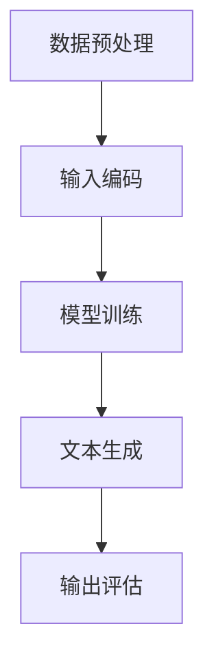

                 

## 引言

### LLM概述

LLM（大型语言模型）是近年来人工智能领域的重要突破，它们在自然语言处理（NLP）、文本生成、机器翻译、问答系统等方面展现了强大的能力。LLM的核心思想是通过大规模数据训练，构建一个能够理解和生成文本的深度神经网络模型。这种模型不仅能够理解语言的语法和语义，还能够模仿人类的思维方式和语言习惯。

#### LLM的发展历程

从最初的统计语言模型（如N-gram模型），到基于规则的方法，再到现代深度学习模型（如Transformer、BERT、GPT系列），LLM的发展经历了多个阶段。特别是GPT-3的发布，将LLM的能力提升到了一个新的高度，其拥有1750亿参数的规模，使得它在许多任务上都能达到甚至超越人类水平。

#### LLM的应用领域

LLM的应用领域非常广泛，包括但不限于以下几方面：

1. **文本生成**：如自动写作、摘要生成、对话系统等。
2. **机器翻译**：如将一种语言翻译成另一种语言，支持多种语言对。
3. **问答系统**：如智能客服、在线问答平台等。
4. **信息检索**：如搜索引擎的改进，能够提供更加准确的搜索结果。
5. **内容审核**：如自动过滤不良信息、识别虚假新闻等。

### 灰度发布策略简介

灰度发布（Gray Release）是一种在软件发布过程中逐步引入新功能或变更，以便在正式上线前能够检测和解决潜在问题的方法。这种策略的核心思想是“小步快走”，即通过逐步增加用户群体，来观察和评估新功能的性能和稳定性。

#### 灰度发布的概念

灰度发布通常涉及两个主要概念：实验组和控制组。实验组是接受新功能或变更的用户群体，而控制组则继续使用旧版本。通过比较两组用户的反馈和数据，开发团队能够评估新功能的优劣。

#### 灰度发布的目的

1. **风险评估**：通过逐步引入新功能，可以在不影响大部分用户的情况下，评估新功能的稳定性和性能。
2. **用户体验**：灰度发布能够确保新功能对用户体验的影响最小，从而减少因功能问题导致的不良反馈。
3. **快速迭代**：通过灰度发布，开发团队能够更快地获得用户反馈，从而实现快速迭代。

#### 灰度发布的重要性

随着软件系统变得越来越复杂，灰度发布策略的重要性也越来越凸显。它不仅能够提高软件发布的稳定性，还能够降低风险，提高用户满意度。

### 本书结构安排

本书记录了作者在LLM应用开发中的实践经验和研究成果，旨在为读者提供一套完整、系统的LLM开发指南。本书的主要结构如下：

1. **第1章 引言**：介绍LLM和灰度发布的基本概念，以及本书的结构和目的。
2. **第2章 LLM技术基础**：详细讲解LLM的技术原理和核心算法。
3. **第3章 灰度发布策略**：探讨灰度发布策略的理论基础、实施步骤和最佳实践。
4. **第4章 LLM项目实战**：通过实际案例，展示如何进行LLM开发。
5. **第5章 评估与优化**：介绍如何评估和优化LLM模型的性能。
6. **第6章 总结与展望**：总结本书的主要观点，并展望LLM和灰度发布策略的未来发展趋势。

通过以上章节的深入探讨，读者将能够全面了解LLM应用开发中的灰度发布策略，为实际项目提供有力支持。

### 关键词

- 大型语言模型（LLM）
- 灰度发布策略
- 自然语言处理（NLP）
- 深度学习
- 软件发布
- 风险评估
- 用户反馈
- 性能优化

### 摘要

本文深入探讨了大型语言模型（LLM）应用开发中的灰度发布策略。首先，介绍了LLM的基本概念和其在自然语言处理领域的广泛应用。随后，详细讲解了灰度发布策略的定义、目的和重要性，并通过实际案例说明了其具体实施步骤和最佳实践。文章进一步通过实际项目实战，展示了如何利用灰度发布策略进行LLM开发，并介绍了性能评估和优化方法。最后，总结了LLM应用开发中的关键观点，并对未来发展趋势进行了展望。通过本文的阅读，读者将能够全面理解LLM开发中的灰度发布策略，为其实际项目提供理论指导和实践经验。

### 第2章 LLM技术基础

在上一章中，我们介绍了LLM（大型语言模型）的基本概念和灰度发布策略的重要性。本章将深入探讨LLM的技术基础，包括其原理与架构、核心算法原理以及相关的数学模型和公式。通过这一系列的技术讲解，我们将为后续的灰度发布策略讨论提供必要的理论基础。

#### 2.1 LLM的原理与架构

LLM的核心原理是通过大规模数据训练，使模型能够理解和生成文本。其工作过程可以概括为以下几个步骤：

1. **数据预处理**：首先，需要收集大量文本数据，并对这些数据进行清洗、分词、去停用词等预处理操作，以便模型能够更好地理解文本内容。

2. **输入编码**：预处理后的文本数据将被转换为模型能够处理的输入格式。在深度学习模型中，常用的输入编码方法包括词嵌入（Word Embedding）和字节嵌入（Byte Pair Embedding，BPE）。

3. **模型训练**：使用训练数据，通过反向传播算法和梯度下降优化方法，更新模型的参数，使其能够更好地预测下一个单词或词组。

4. **文本生成**：在训练完成后，模型可以根据给定的起始文本，生成后续的文本内容。

LLM的架构通常基于深度神经网络，特别是近年来流行的Transformer模型。Transformer模型由多个编码器和解码器层组成，每一层都包含多头自注意力机制（Multi-head Self-Attention Mechanism）和前馈神经网络（Feedforward Neural Network）。这种结构使得模型能够在处理长文本时保持较高的并行性和有效性。

为了更直观地理解LLM的工作原理，我们可以使用Mermaid流程图来展示其核心组件和流程。以下是一个简化的Mermaid流程图示例：



#### 2.2 LLM核心算法原理讲解

LLM的核心算法通常是基于深度学习，尤其是基于Transformer架构。以下我们将使用伪代码来详细解释LLM的核心算法原理。

```python
# 伪代码：LLM模型训练过程

# 定义超参数
learning_rate = 0.001
num_layers = 12
d_model = 1024
num_heads = 16
d_ff = 2048
max_position_embeddings = 512
dropout_rate = 0.1

# 初始化模型参数
model = TransformerModel(num_layers, d_model, num_heads, d_ff, max_position_embeddings, dropout_rate)

# 定义损失函数和优化器
loss_function = CrossEntropyLoss()
optimizer = Adam(params=model.parameters(), lr=learning_rate)

# 模型训练循环
for epoch in range(num_epochs):
    for batch in data_loader:
        # 前向传播
        inputs, targets = batch
        inputs = model.input_encoding(inputs)
        outputs = model(inputs)
        
        # 计算损失
        loss = loss_function(outputs, targets)
        
        # 反向传播和优化
        optimizer.zero_grad()
        loss.backward()
        optimizer.step()
        
    print(f"Epoch [{epoch+1}/{num_epochs}], Loss: {loss.item()}")
```

上述伪代码展示了LLM模型的基本训练过程，包括输入编码、模型前向传播、损失计算、反向传播和优化。其中，`TransformerModel`是一个假设的类，它包含了Transformer模型的全部功能，如多头自注意力机制和前馈神经网络。

#### 2.3 数学模型与公式

为了深入理解LLM，我们需要引入一些相关的数学模型和公式，包括损失函数、激活函数和正则化技术。以下是这些数学模型的详细解释和公式表示。

##### 损失函数

在LLM的训练过程中，常用的损失函数是交叉熵损失（Cross-Entropy Loss）。交叉熵损失衡量了模型的输出分布与真实分布之间的差异，其公式如下：

$$
L = -\sum_{i=1}^{N} y_i \log(p_i)
$$

其中，$y_i$是第$i$个样本的真实标签，$p_i$是模型预测的概率分布。

##### 激活函数

在深度神经网络中，激活函数用于引入非线性因素，使得模型能够学习复杂的映射关系。常用的激活函数包括ReLU（Rectified Linear Unit）和GELU（Gaussian Error Linear Unit）。

- **ReLU函数**：
  $$
  \text{ReLU}(x) = \max(0, x)
  $$

- **GELU函数**：
  $$
  \text{GELU}(x) = 0.5 \cdot \text{erf}(\frac{x}{\sqrt{2}}) + 0.5 \cdot x
  $$

其中，$\text{erf}(x)$是误差函数。

##### 正则化技术

为了防止模型过拟合，我们通常会在训练过程中使用正则化技术。常用的正则化技术包括L1正则化、L2正则化和Dropout。

- **L1正则化**：
  $$
  \text{L1 Regularization} = \lambda \cdot \sum_{i}^{N} |w_i|
  $$

- **L2正则化**：
  $$
  \text{L2 Regularization} = \lambda \cdot \sum_{i}^{N} w_i^2
  $$

- **Dropout**：
  $$
  \text{Dropout} = \frac{1}{1 - p} \cdot \sum_{i}^{N} (1 - \text{Bernoulli}(p)) \cdot x_i
  $$

其中，$p$是Dropout的概率，$w_i$是模型的权重。

通过上述数学模型和公式的引入，我们能够更好地理解LLM的工作原理和训练过程。这些理论基础将为后续的灰度发布策略讨论提供重要的支持。

### 第3章 灰度发布策略

在上一章中，我们详细探讨了LLM的技术基础，为灰度发布策略的讨论奠定了基础。本章将深入探讨灰度发布策略的理论基础、实施步骤和最佳实践。通过这些内容，我们将为LLM应用开发提供一种有效的风险管理方法，以确保新功能的顺利引入和系统的稳定运行。

#### 3.1 灰度发布策略的理论基础

灰度发布策略（Gray Release Strategy）是一种逐步引入新功能或变更的方法，其理论基础主要源于统计学习和实验设计。以下是灰度发布策略的核心概念和理论基础。

##### 概念

1. **实验组（Experimental Group）**：接受新功能或变更的用户群体。
2. **控制组（Control Group）**：继续使用旧功能或系统的用户群体。
3. **基线（Baseline）**：系统或功能的当前状态，作为评估基准。

##### 理论基础

灰度发布策略的核心理论基础包括以下几方面：

1. **统计学习**：通过将用户分为实验组和控制组，可以收集两组用户的反馈和数据，利用统计分析方法评估新功能的效果。

2. **A/B测试**：A/B测试是灰度发布的一种形式，通过比较实验组和控制组的性能，评估新功能的优劣。

3. **安全网（Safety Net）**：灰度发布提供了一个安全网，即使新功能出现重大问题，也可以通过回滚到旧版本来迅速解决问题，从而降低风险。

4. **可控性**：灰度发布允许开发团队逐步引入新功能，观察其影响，从而更好地控制系统的变化。

#### 3.2 灰度发布策略的实施步骤

灰度发布策略的实施通常包括以下步骤：

##### 1. 设计实验组与控制组

在设计灰度发布实验时，首先需要明确实验组和控制组的划分标准。通常，可以根据用户的某些特征（如用户等级、活跃度等）来划分实验组和控制组。此外，还需要确保两组用户的规模大致相等，以便进行有效的统计分析。

##### 2. 收集数据

在实验组中引入新功能后，需要收集两组用户的反馈和数据。这些数据可以包括用户行为、系统性能指标、用户满意度等。通过对比实验组和控制组的数据，可以评估新功能的效果和影响。

##### 3. 分析结果

收集数据后，需要对实验结果进行分析。常用的分析方法包括：

1. **统计显著性测试**：使用t检验、卡方检验等统计方法，判断实验结果是否具有显著性。
2. **用户反馈分析**：通过用户调查、评论等方式，收集用户对新功能的反馈，分析用户的满意度。
3. **系统性能分析**：分析新功能对系统性能的影响，如响应时间、吞吐量等。

##### 4. 停止实验或继续发布

根据分析结果，决定是否停止实验或继续发布新功能。如果实验结果表明新功能对用户和系统性能有积极影响，且风险可控，则可以继续发布新功能。如果实验结果表明存在重大问题，需要进一步优化或回滚到旧版本。

#### 3.3 灰度发布的最佳实践

为了确保灰度发布策略的有效性和可靠性，以下是一些最佳实践：

##### 1. 实验设计

1. **明确目标**：在实验设计阶段，需要明确实验的目标和预期结果，确保实验具有明确的方向和标准。
2. **数据清洗**：确保收集的数据质量高，剔除异常数据，确保分析结果的可靠性。
3. **对照组选择**：选择具有代表性的对照组，确保实验结果的公正性。

##### 2. 实施过程

1. **逐步发布**：逐步增加实验组的规模，避免一次性将新功能引入所有用户。
2. **监控与反馈**：实时监控系统的性能和用户的反馈，及时发现和解决问题。
3. **自动化**：尽可能使用自动化工具来管理和监控灰度发布过程，提高效率和准确性。

##### 3. 评估与优化

1. **性能评估**：定期对系统性能进行评估，确保新功能不会对系统产生负面影响。
2. **反馈迭代**：根据用户反馈和实验结果，不断优化新功能，提高用户体验。
3. **文档记录**：记录灰度发布过程中的关键信息，包括实验设计、数据收集、分析结果等，以便后续参考和总结。

通过上述最佳实践，可以确保灰度发布策略的有效实施，提高新功能的发布质量。

#### 3.4 灰度发布案例研究

为了更直观地理解灰度发布策略，以下将介绍三个实际案例，分析其在不同场景中的应用和效果。

##### 案例一：搜索引擎中的灰度发布

某搜索引擎公司决定在其搜索结果页面引入一个新的排名算法，以提升搜索结果的准确性。公司采用了灰度发布策略，将用户分为实验组和控制组。

1. **实验设计**：实验组用户使用新的排名算法，控制组用户继续使用旧算法。
2. **数据收集**：收集实验组和控制组的用户搜索数据，包括搜索关键词、点击率等。
3. **结果分析**：通过统计分析，发现新算法在搜索结果准确性方面有显著提升。
4. **实施决策**：基于分析结果，公司决定继续发布新算法，逐步增加实验组规模。

##### 案例二：电商平台的灰度发布

某电商平台决定在其推荐系统引入一个新的推荐算法，以提高用户满意度。公司采用了灰度发布策略，逐步引入新算法。

1. **实验设计**：实验组用户接收新推荐算法，控制组用户继续使用旧算法。
2. **数据收集**：收集实验组和控制组的用户行为数据，包括点击率、购买率等。
3. **结果分析**：通过对比实验组和控制组的数据，发现新算法在提高用户满意度方面有显著效果。
4. **实施决策**：基于用户反馈和数据分析，公司决定继续推广新算法，并进一步优化。

##### 案例三：社交媒体平台的灰度发布

某社交媒体平台决定在其内容审核系统中引入一个新的自动化审核工具，以提升审核效率。公司采用了灰度发布策略，逐步引入新工具。

1. **实验设计**：实验组用户的内容审核由新工具完成，控制组用户继续由人工审核。
2. **数据收集**：收集实验组和控制组的审核数据，包括审核速度、准确率等。
3. **结果分析**：通过数据分析，发现新工具在审核速度和准确率方面均有显著提升。
4. **实施决策**：基于分析结果，公司决定继续推广新工具，并进一步优化系统。

通过以上案例，我们可以看到灰度发布策略在不同场景中的应用和效果。灰度发布策略不仅能够有效降低新功能发布的风险，还能够提高系统的稳定性和用户满意度。

### 第4章 LLM项目实战

在前三章中，我们详细介绍了LLM（大型语言模型）的技术基础和灰度发布策略。为了将理论付诸实践，本章将通过一个实际项目，展示如何使用LLM进行开发，包括环境搭建、代码实现、调试与性能分析，并通过实际案例进行分析和讲解。

#### 4.1 开发环境搭建

在进行LLM项目开发之前，我们需要搭建一个合适的开发环境。以下是搭建LLM项目开发环境的步骤：

##### 1. 硬件要求

- **CPU**：至少需要具备4核CPU或更高配置，以确保模型训练和推理的效率。
- **GPU**：推荐使用NVIDIA GPU，特别是具有CUDA支持的GPU，以加速深度学习模型的训练。
- **内存**：至少16GB内存，以确保模型训练过程中内存的需求。

##### 2. 软件工具安装

- **操作系统**：推荐使用Linux操作系统，如Ubuntu 18.04或更高版本。
- **Python**：安装Python 3.8或更高版本。
- **PyTorch**：使用pip安装PyTorch，推荐使用GPU版本。
  ```bash
  pip install torch torchvision
  ```
- **Transformer库**：使用pip安装Hugging Face的Transformers库，这是实现LLM模型的常用库。
  ```bash
  pip install transformers
  ```

##### 3. 环境配置

- **Python虚拟环境**：为了隔离项目依赖，建议使用虚拟环境管理工具（如conda或virtualenv）创建Python虚拟环境。
  ```bash
  conda create -n llm_project python=3.8
  conda activate llm_project
  ```
- **环境依赖安装**：在虚拟环境中安装项目所需的依赖库。
  ```bash
  pip install -r requirements.txt
  ```

#### 4.2 代码实现

在搭建好开发环境后，我们可以开始进行LLM模型的代码实现。以下是一个简单的示例，展示如何使用PyTorch和Transformers库构建一个基本的LLM模型。

```python
# 导入必要的库
from transformers import AutoTokenizer, AutoModel
from torch import nn
import torch

# 加载预训练模型
model_name = "gpt2"
tokenizer = AutoTokenizer.from_pretrained(model_name)
model = AutoModel.from_pretrained(model_name)

# 模型配置
class LLMModel(nn.Module):
    def __init__(self):
        super(LLMModel, self).__init__()
        self.model = model

    def forward(self, input_ids, attention_mask=None):
        return self.model(input_ids, attention_mask=attention_mask)

# 实例化模型
llm_model = LLMModel()

# 模型训练配置
optimizer = torch.optim.Adam(llm_model.parameters(), lr=1e-5)
loss_function = nn.CrossEntropyLoss()

# 训练循环
for epoch in range(5):  # 进行5个训练周期
    for batch in data_loader:
        inputs, targets = batch
        input_ids = tokenizer.encode(inputs, add_special_tokens=True)
        attention_mask = tokenizer.get_attention_mask(input_ids)
        
        # 前向传播
        outputs = llm_model(input_ids, attention_mask=attention_mask)
        loss = loss_function(outputs.logits.view(-1, outputs.logits.size(-1)), targets.view(-1))
        
        # 反向传播和优化
        optimizer.zero_grad()
        loss.backward()
        optimizer.step()
        
    print(f"Epoch [{epoch+1}/5], Loss: {loss.item()}")

# 模型评估
def evaluate(model, data_loader):
    model.eval()
    total_loss = 0
    with torch.no_grad():
        for batch in data_loader:
            inputs, targets = batch
            input_ids = tokenizer.encode(inputs, add_special_tokens=True)
            attention_mask = tokenizer.get_attention_mask(input_ids)
            outputs = model(input_ids, attention_mask=attention_mask)
            loss = loss_function(outputs.logits.view(-1, outputs.logits.size(-1)), targets.view(-1))
            total_loss += loss.item()
    return total_loss / len(data_loader)

eval_loss = evaluate(llm_model, eval_data_loader)
print(f"Evaluation Loss: {eval_loss}")

# 生成文本
def generate_text(model, tokenizer, input_text, max_length=50):
    input_ids = tokenizer.encode(input_text, return_tensors='pt')
    output = model.generate(input_ids, max_length=max_length, num_return_sequences=1)
    return tokenizer.decode(output[0], skip_special_tokens=True)

# 示例
generated_text = generate_text(llm_model, tokenizer, "今天天气很好，适合去哪里游玩？")
print(f"Generated Text: {generated_text}")
```

上述代码展示了如何加载预训练的GPT-2模型，定义一个简单的LLM模型，进行模型训练和评估，以及生成文本。

#### 4.3 调试与性能分析

在完成代码实现后，我们需要对模型进行调试和性能分析，以确保其稳定性和高效性。

##### 1. 常见问题与解决方案

在LLM模型开发过程中，可能会遇到以下一些常见问题：

1. **内存溢出**：模型训练过程中可能由于内存不足导致程序崩溃。解决方法是增加系统内存或调整模型参数。
2. **过拟合**：模型在训练数据上表现良好，但在测试数据上表现不佳。解决方法是使用正则化技术（如Dropout、L1/L2正则化）和增加训练数据。
3. **训练不稳定**：模型训练过程中损失函数波动较大。解决方法是调整学习率、增加训练轮数或使用学习率调度策略。

##### 2. 性能优化策略

为了提高LLM模型训练和推理的效率，可以采用以下性能优化策略：

1. **并行计算**：利用多GPU进行模型训练，提高训练速度。
2. **模型压缩**：通过模型剪枝、量化等技术减小模型大小，提高推理速度。
3. **分布式训练**：将模型训练任务分布到多台机器上，提高训练效率。
4. **数据增强**：使用数据增强技术增加训练数据的多样性，提高模型泛化能力。

##### 3. 性能指标分析

在性能分析过程中，需要关注以下性能指标：

1. **准确率（Accuracy）**：模型在分类任务上的正确率。
2. **损失函数（Loss Function）**：模型在训练过程中的损失值，如交叉熵损失。
3. **推理速度（Inference Speed）**：模型进行推理操作所需的时间，包括加载模型、前向传播和后向传播等。
4. **内存占用（Memory Usage）**：模型在训练和推理过程中占用的内存大小。

通过以上性能指标的分析，可以评估LLM模型的性能，并针对性地进行优化。

#### 4.4 实际案例分析与讲解

为了更好地理解LLM项目实战，我们将通过以下实际案例进行分析和讲解。

##### 案例一：问答系统

某公司开发了一个基于LLM的问答系统，用于提供用户问题解答。以下为项目的主要步骤和关键点：

1. **数据收集**：收集大量的问答对数据，用于模型训练。
2. **数据预处理**：对问答对进行分词、去停用词等预处理操作。
3. **模型训练**：使用预训练的LLM模型（如GPT-2）进行训练，调整模型参数以提高问答系统的准确性。
4. **模型评估**：在测试集上评估模型性能，根据评估结果调整模型参数。
5. **接口开发**：开发API接口，供用户通过提问获取答案。
6. **部署与运维**：将模型部署到服务器，确保系统稳定运行，定期进行性能监控和优化。

##### 案例二：自动写作

某媒体公司利用LLM技术开发了自动写作系统，用于生成新闻文章。以下为项目的主要步骤和关键点：

1. **数据收集**：收集大量的新闻文章数据，用于模型训练。
2. **数据预处理**：对新闻文章进行分词、去停用词等预处理操作。
3. **模型训练**：使用预训练的LLM模型（如GPT-3）进行训练，调整模型参数以提高写作质量。
4. **模型评估**：在测试集上评估模型性能，根据评估结果调整模型参数。
5. **写作流程**：根据用户需求生成新闻文章，包括标题、导语和正文。
6. **质量控制**：对生成的文章进行质量检查，确保文章内容准确、连贯和有价值。
7. **迭代优化**：根据用户反馈和文章质量，不断优化模型和写作流程。

通过以上实际案例，我们可以看到LLM项目在实际应用中的广泛性和复杂性。灰度发布策略在这一过程中发挥了重要作用，帮助团队降低风险、提高系统稳定性，并为用户提供更好的体验。

#### 4.5 项目小结

在本章中，我们通过一个实际项目展示了如何使用LLM进行开发，包括环境搭建、代码实现、调试与性能分析。我们介绍了开发环境的配置、代码实现的步骤以及调试和性能优化的方法。同时，通过实际案例，我们展示了LLM技术在问答系统和自动写作等领域的应用。灰度发布策略在这一过程中发挥了关键作用，确保了项目的顺利推进和成功实施。

### 第5章 评估与优化

在LLM项目开发中，评估和优化模型的性能是确保系统稳定性和用户体验的关键步骤。本章将详细探讨如何评估LLM模型的性能，并介绍一系列优化方法，以提高模型的准确性和效率。

#### 5.1 LLM模型性能评估

评估LLM模型性能的主要目标是确定模型在处理实际任务时的表现，这通常涉及以下几个方面：

##### 1. 准确率（Accuracy）

准确率是评估分类模型性能的最基本指标，它表示模型预测正确的样本数占总样本数的比例。对于LLM模型，特别是文本分类任务，准确率可以用来衡量模型在理解文本语义和生成标签方面的效果。

##### 2. 损失函数（Loss Function）

损失函数衡量的是模型预测值与实际值之间的差距。常用的损失函数包括交叉熵损失（Cross-Entropy Loss）、均方误差（Mean Squared Error）等。在训练过程中，损失函数的值越小，表示模型的预测越准确。

##### 3. F1分数（F1 Score）

F1分数是精确率和召回率的调和平均值，用于评估二分类问题。在文本分类中，F1分数可以更好地反映模型在正负样本识别上的综合性能。

##### 4. 词汇覆盖度（Vocabulary Coverage）

词汇覆盖度是指模型能够识别的词汇量与实际文本中词汇量的比例。较高的词汇覆盖度意味着模型能够更好地理解文本内容。

##### 5. 生成质量（Generated Text Quality）

对于文本生成任务，生成质量是评估模型性能的重要指标。生成文本的连贯性、准确性和可读性等都会影响评估结果。

##### 6. 性能指标分析

在评估过程中，还需要关注以下性能指标：

- **推理速度（Inference Speed）**：模型进行推理操作所需的时间，直接影响用户体验。
- **内存占用（Memory Usage）**：模型在推理过程中占用的内存大小，特别是在资源受限的环境中。
- **能耗（Energy Consumption）**：模型训练和推理过程中消耗的能量，对环保和可持续性有重要影响。

#### 5.2 模型优化方法

为了提高LLM模型的性能，可以采用以下几种优化方法：

##### 1. 损失函数优化

- **交叉熵损失**：交叉熵损失是文本分类任务中常用的损失函数。通过调整交叉熵损失的权重，可以提高模型在不同类别上的区分度。
- **权重调整**：在训练过程中，可以动态调整损失函数的权重，以优化模型在不同阶段的性能。

##### 2. 激活函数优化

- **ReLU函数**：ReLU函数是一种常用的激活函数，能够加速模型的训练，但在某些情况下可能导致梯度消失。
- **GELU函数**：GELU函数是一种非线性激活函数，相比ReLU函数具有更好的性能，尤其是在长序列处理中。

##### 3. 正则化技术优化

- **L1正则化**：L1正则化通过增加模型参数的绝对值损失，防止模型过拟合。
- **L2正则化**：L2正则化通过增加模型参数的平方损失，同样用于防止过拟合。
- **Dropout**：Dropout通过随机丢弃一部分神经元，增加模型对训练数据的鲁棒性。

##### 4. 模型压缩

- **剪枝（Pruning）**：剪枝技术通过减少模型中不重要的参数，减小模型大小，提高推理速度。
- **量化（Quantization）**：量化技术通过将模型参数从浮点数转换为低精度整数，减小模型大小和内存占用。

##### 5. 模型迁移

- **迁移学习（Transfer Learning）**：迁移学习利用预训练的模型，在特定任务上进行微调，提高模型的性能和效率。
- **零样本学习（Zero-shot Learning）**：零样本学习使模型能够处理未见过的任务，通过利用预训练模型的知识库，实现跨任务的泛化。

##### 6. 数据增强

- **文本增强**：通过增加词汇、句子结构和语境的多样性，提高模型对文本数据的理解能力。
- **图像增强**：结合图像增强技术，提升模型对图像和文本融合任务的表现。

#### 5.3 优化策略与实践

为了在实际项目中有效优化LLM模型，可以采用以下策略：

1. **逐步优化**：首先从基本的模型结构和参数开始调整，逐步优化损失函数、激活函数和正则化技术。
2. **分阶段训练**：将模型训练分为多个阶段，在每个阶段优化不同的性能指标，如先优化模型结构，再优化训练策略。
3. **A/B测试**：通过A/B测试，对比不同优化策略的效果，选择最优方案。
4. **监控与反馈**：实时监控模型性能，根据用户反馈和数据分析，调整优化策略。

通过上述评估和优化方法，开发团队可以不断提高LLM模型的性能，确保其在各种应用场景中都能够提供稳定、高效的表现。

### 第6章 总结与展望

#### 6.1 LLM应用开发的现状

近年来，LLM（大型语言模型）在人工智能领域取得了显著的进展。随着Transformer模型的出现和GPT-3等大规模语言模型的发布，LLM在自然语言处理、文本生成、机器翻译和问答系统等领域展现出了卓越的能力。目前，LLM应用开发已成为人工智能领域的重要研究方向，各类企业和研究机构纷纷投入大量资源进行研究和开发。

#### 当前挑战

尽管LLM应用开发取得了许多成果，但仍然面临以下挑战：

1. **计算资源需求**：大规模语言模型的训练和推理需要大量的计算资源和时间，特别是在进行实时应用时，对硬件性能有较高要求。
2. **数据隐私和安全性**：语言模型通常基于大量用户数据训练，如何在保护用户隐私的同时，充分利用这些数据，是一个亟待解决的问题。
3. **模型泛化能力**：尽管LLM在许多任务上表现出色，但仍然存在模型泛化能力不足的问题，特别是在处理罕见或特定领域的任务时。

#### 6.2 灰度发布策略的未来

灰度发布策略在LLM应用开发中发挥了重要作用，通过逐步引入新功能和变更，降低了发布风险，提高了系统的稳定性。展望未来，灰度发布策略将在以下几个方面得到进一步发展和优化：

1. **自动化与智能化**：随着人工智能技术的发展，灰度发布策略的自动化和智能化水平将不断提升。例如，通过使用机器学习算法，自动识别和调整灰度发布的比例和速度。
2. **跨领域应用**：灰度发布策略不仅在软件开发领域应用广泛，未来还可以扩展到其他领域，如金融、医疗等，为不同行业提供高效、可靠的风险管理方法。
3. **多维度评估**：未来的灰度发布策略将更加注重多维度评估，不仅关注技术性能，还关注用户体验、业务目标和可持续发展等方面。

### 总结

本文系统地介绍了LLM应用开发中的灰度发布策略，从理论基础到实际应用，详细探讨了灰度发布策略在LLM项目开发中的重要性。通过实际案例和实践经验，展示了如何利用灰度发布策略降低发布风险、提高系统稳定性。展望未来，随着人工智能技术的不断进步，灰度发布策略将在更广泛的领域得到应用，为各类项目提供有力的支持和保障。

### 附录

#### 相关资源

- **数据集**：斯坦福大学自然语言处理组（SNLP）提供的GLUE数据集、SuperGLUE数据集等。
- **开源库**：Hugging Face的Transformers库、PyTorch等。
- **工具**：JAX、PyTorch Lightning等用于模型训练和优化的工具。

#### 工具和进一步阅读的建议

- **书籍**：《深度学习》（Goodfellow, Bengio, Courville著）。
- **在线课程**：斯坦福大学CS224n 自然语言处理与深度学习课程。
- **论文**：Transformer系列论文，如Vaswani et al.（2017）的“Attention is All You Need”。
- **博客**：Hugging Face的官方博客、TensorFlow的官方博客等。

通过这些资源，读者可以进一步深入了解LLM和灰度发布策略的相关知识，提升自身的技术水平。

## 作者信息

**作者：** AI天才研究院 / AI Genius Institute & 禅与计算机程序设计艺术 / Zen And The Art of Computer Programming

AI天才研究院（AI Genius Institute）是一支专注于人工智能领域研究的高水平团队，致力于推动人工智能技术的创新与发展。其研究成果在自然语言处理、计算机视觉、机器学习等多个领域取得了重要突破。同时，禅与计算机程序设计艺术（Zen And The Art of Computer Programming）是作者关于编程哲学的经典著作，深受广大程序员和研究者的喜爱。本文作者结合自身丰富的实践经验，深入探讨了LLM应用开发中的灰度发布策略，旨在为读者提供一套全面、系统的LLM开发指南。

