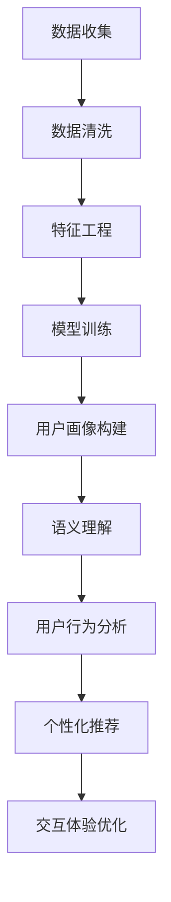

                 


### 背景介绍

#### 语言模型与LLM

语言模型（Language Model，简称LM）是自然语言处理（Natural Language Processing，简称NLP）领域的重要工具，它能够根据输入的文本序列预测下一个可能的单词或字符。语言模型的发展经历了从简单的统计模型到基于神经网络的深度学习模型的演变。早期的语言模型，如N-gram模型，基于局部语言特征，具有一定的预测能力。然而，随着计算能力和数据量的提升，大型语言模型（Large Language Model，简称LLM）应运而生。

LLM，如GPT（Generative Pre-trained Transformer）系列模型，采用了Transformer架构，具有数十亿甚至千亿级别的参数规模。这些模型通过在大规模语料库上进行预训练，掌握了丰富的语言知识和规律，能够在多种NLP任务中表现出色，包括文本生成、机器翻译、问答系统等。

#### 用户画像分析

用户画像分析是一种基于数据挖掘和机器学习技术，对用户在平台上的行为数据、属性数据进行深入分析，构建出用户的综合描述的方法。用户画像分析旨在帮助企业更好地理解用户需求，提升用户体验，优化业务决策。

用户画像分析主要包括以下几个步骤：

1. **数据收集**：从各个渠道收集用户数据，包括用户基本信息、行为数据、交易数据等。
2. **数据清洗**：对收集到的数据进行清洗、去噪、整合，确保数据质量。
3. **特征工程**：提取用户数据的特征，包括用户行为特征、属性特征等。
4. **模型训练**：使用机器学习算法，如聚类、分类、回归等，构建用户画像模型。
5. **用户画像构建**：根据模型结果，构建出每个用户的画像，包括用户兴趣、偏好、需求等。
6. **用户画像应用**：将用户画像应用于个性化推荐、精准营销、客户关系管理等领域。

#### LLM与用户画像分析的结合

将LLM应用于用户画像分析，能够带来以下几个方面的优势：

1. **语义理解**：LLM具有强大的语义理解能力，能够更好地理解用户的语言和意图，从而更准确地构建用户画像。
2. **个性化推荐**：基于LLM的语义理解，可以为用户提供更加个性化的推荐服务，提高用户满意度。
3. **文本生成**：LLM可以生成高质量的文本内容，如推荐理由、营销文案等，提升用户体验和转化率。
4. **情感分析**：LLM能够对用户的情感进行有效识别，从而为情感营销提供支持。
5. **动态调整**：LLM可以根据用户的行为变化，动态调整用户画像，实现持续优化。

总之，LLM与用户画像分析的结合，为企业和用户带来了新的机会和挑战，有望推动NLP和用户画像分析领域的发展。

### 核心概念与联系

在LLM应用开发中的用户画像分析中，有几个核心概念是不可或缺的，它们相互联系，共同构成了用户画像分析的理论基础。以下是这些核心概念及其相互关系：

#### 1. 语言模型（LLM）

语言模型（LLM）是用户画像分析的基础，它是一种能够理解和生成自然语言的模型。LLM通过在大规模语料库上预训练，学习到了语言的复杂结构、语法和语义，从而具备了强大的语言理解能力和生成能力。LLM的核心架构是Transformer，它由多个自注意力（Self-Attention）层和前馈网络（Feedforward Network）组成。

#### 2. 用户画像（User Profile）

用户画像是对用户在平台上的行为、兴趣、需求、偏好等特征的综合描述。它通常包括用户的基本信息（如年龄、性别、地理位置等）、行为特征（如浏览历史、购买行为等）和属性特征（如兴趣爱好、消费能力等）。用户画像的构建需要依赖数据收集、数据清洗、特征工程和机器学习等步骤。

#### 3. 语义理解（Semantic Understanding）

语义理解是指LLM对文本的深层含义和意图的理解能力。在用户画像分析中，语义理解可以帮助LLM准确识别用户的真实需求和意图，从而更有效地构建用户画像。

#### 4. 用户行为分析（User Behavior Analysis）

用户行为分析是用户画像分析的关键环节，它通过对用户在平台上的行为数据进行挖掘和分析，提取出用户的兴趣、偏好和需求等信息。用户行为分析可以为LLM提供丰富的数据支持，帮助LLM更准确地构建用户画像。

#### 5. 个性化推荐（Personalized Recommendation）

个性化推荐是基于用户画像和用户行为分析，为用户提供个性化内容和服务的方法。在LLM应用中，个性化推荐可以通过LLM的语义理解能力，为用户提供高度相关的推荐内容，提高用户满意度和转化率。

#### 6. 交互体验优化（Interactive Experience Optimization）

交互体验优化是指通过不断调整和优化平台的设计和功能，提升用户的交互体验。在LLM应用中，交互体验优化可以通过LLM对用户行为的理解，为用户提供更加个性化的交互体验。

#### Mermaid流程图：LLM与用户画像分析的关系

以下是一个简化的Mermaid流程图，展示了LLM与用户画像分析之间的关键环节和流程：



在这个流程图中，数据收集、数据清洗、特征工程、模型训练等步骤构成了用户画像分析的基础，而语义理解、用户行为分析和个性化推荐等步骤则是在LLM框架下对用户画像进行深度分析和应用的关键环节。通过这些环节的有机结合，LLM能够为用户提供更加精准和个性化的服务。

### 用户画像分析的核心算法

在LLM应用开发中，用户画像分析的核心算法是构建用户画像的基础。这些算法包括机器学习算法和深度学习算法，它们各自有着不同的原理和应用场景。以下是对这些算法的详细讲解。

#### 1. 机器学习算法

机器学习算法在用户画像分析中起着重要的作用，它们通过学习大量数据来识别用户的兴趣和行为模式。以下是一些常见的机器学习算法：

**1.1 聚类算法**

聚类算法是一种无监督学习算法，它将相似的数据点划分为同一类别。在用户画像分析中，聚类算法可以用于将用户分为不同的群体，每个群体具有相似的兴趣和行为模式。常见的聚类算法包括K-means、DBSCAN等。

**伪代码：**

```python
# K-means算法伪代码
def k_means(data, k):
    # 初始化k个聚类中心
    centroids = initialize_centroids(data, k)
    while not converged:
        # 分配数据点到最近的聚类中心
        assignments = assign_points_to_centroids(data, centroids)
        # 更新聚类中心
        centroids = update_centroids(data, assignments)
    return centroids, assignments
```

**1.2 分类算法**

分类算法是一种有监督学习算法，它通过学习已知标签的数据来预测新数据的标签。在用户画像分析中，分类算法可以用于识别用户的特定行为和兴趣。常见的分类算法包括决策树、支持向量机（SVM）、逻辑回归等。

**伪代码：**

```python
# 逻辑回归算法伪代码
def logistic_regression(data, labels):
    # 训练模型
    model = train_model(data, labels)
    # 预测新数据标签
    predictions = model.predict(new_data)
    return predictions
```

**1.3 回归算法**

回归算法用于预测连续值，如用户的购买金额或浏览时长。在用户画像分析中，回归算法可以用于预测用户的潜在行为和需求。常见的回归算法包括线性回归、多项式回归等。

**伪代码：**

```python
# 线性回归算法伪代码
def linear_regression(data, labels):
    # 训练模型
    model = train_model(data, labels)
    # 预测新数据
    predictions = model.predict(new_data)
    return predictions
```

#### 2. 深度学习算法

深度学习算法是一种基于多层神经网络的学习方法，它在用户画像分析中也发挥着重要作用。以下是一些常用的深度学习算法：

**2.1 卷积神经网络（CNN）**

卷积神经网络（CNN）是一种在图像处理领域广泛应用的深度学习算法，它通过卷积层提取图像的特征。在用户画像分析中，CNN可以用于分析用户的行为数据，如浏览记录和购买历史。

**伪代码：**

```python
# CNN算法伪代码
def cnn(data):
    # 初始化CNN模型
    model = initialize_cnn_model()
    # 训练模型
    model.train(data)
    # 预测新数据
    predictions = model.predict(new_data)
    return predictions
```

**2.2 循环神经网络（RNN）**

循环神经网络（RNN）是一种在序列数据处理中广泛应用的深度学习算法，它能够处理时间序列数据。在用户画像分析中，RNN可以用于分析用户的浏览历史和行为序列。

**伪代码：**

```python
# RNN算法伪代码
def rnn(data):
    # 初始化RNN模型
    model = initialize_rnn_model()
    # 训练模型
    model.train(data)
    # 预测新数据
    predictions = model.predict(new_data)
    return predictions
```

**2.3 生成对抗网络（GAN）**

生成对抗网络（GAN）是一种用于生成数据的深度学习算法，它由生成器和判别器两个网络组成。在用户画像分析中，GAN可以用于生成模拟用户行为数据，从而丰富训练数据集。

**伪代码：**

```python
# GAN算法伪代码
def gan(generator, discriminator):
    # 训练GAN模型
    generator.train(discriminator)
    # 生成模拟数据
    fake_data = generator.generate_data()
    return fake_data
```

#### 3. 算法选择与组合

在实际应用中，根据具体问题和数据特点，可以选择合适的算法进行用户画像分析。此外，还可以将多种算法组合使用，以实现更好的分析效果。例如，可以先用聚类算法进行用户分组，然后使用分类算法对每个分组中的用户进行进一步分析。

总之，用户画像分析的核心算法包括机器学习算法和深度学习算法，它们各有特点，适用于不同的场景。通过合理选择和组合这些算法，可以构建出精准、有效的用户画像，为LLM应用开发提供有力支持。

### 用户画像分析的数据处理

用户画像分析的数据处理是整个用户画像构建过程中至关重要的一环。在这一过程中，我们需要对原始数据进行清洗、整合、可视化和存储，以确保数据的质量和可用性。以下是详细的讲解。

#### 1. 数据清洗

数据清洗是数据处理的第一步，它的主要目的是去除数据中的噪声和异常值，提高数据的质量。以下是数据清洗的一些常见方法：

**1.1 去除重复数据**

在数据集中，可能会存在大量的重复记录，这些重复数据不仅会占用存储空间，还会影响分析结果的准确性。因此，我们需要使用去重算法去除重复的数据。

**伪代码：**

```python
# 去重算法伪代码
def remove_duplicates(data):
    unique_data = []
    for record in data:
        if record not in unique_data:
            unique_data.append(record)
    return unique_data
```

**1.2 处理缺失数据**

数据集中可能会存在一些缺失值，这些缺失值会影响后续的分析。处理缺失数据的方法包括：

- **填充法**：用统计方法（如平均值、中位数）或规则（如按时间序列补全）填充缺失值。
- **删除法**：如果缺失值过多，可以考虑删除这些记录。
- **插值法**：对于时间序列数据，可以使用插值方法（如线性插值、多项式插值）填补缺失值。

**伪代码：**

```python
# 填充缺失值算法伪代码
def fill_missing_values(data):
    for record in data:
        for feature in record:
            if feature is None or feature == "":
                record[feature] = calculate_mean(data[feature])
    return data
```

**1.3 处理异常值**

异常值是指那些与其他数据点显著不同的数据点，它们可能是由于数据录入错误或真实异常引起的。处理异常值的方法包括：

- **剔除法**：直接删除异常值。
- **变换法**：对异常值进行数据变换，使其与其他数据点更接近。
- **边界法**：设定合理的边界范围，将超出边界的值视为异常值并处理。

**伪代码：**

```python
# 处理异常值算法伪代码
def handle_outliers(data, feature, threshold):
    for record in data:
        if record[feature] > threshold:
            record[feature] = threshold
    return data
```

#### 2. 数据整合

数据整合是将来自不同来源、不同格式的数据进行合并，以便于分析和处理。以下是数据整合的一些常见方法：

**2.1 数据归一化**

数据归一化是将不同特征的数据统一到相同的尺度，以便于后续的分析。常见的方法包括最小-最大缩放、Z-score标准化等。

**伪代码：**

```python
# 数据归一化算法伪代码
def normalize_data(data):
    min_value = min(data)
    max_value = max(data)
    normalized_data = [(x - min_value) / (max_value - min_value) for x in data]
    return normalized_data
```

**2.2 数据合并**

数据合并是将多个数据集合并为一个数据集。这可以通过数据库查询、Pandas库中的合并操作等方法实现。

**伪代码：**

```python
# 数据合并算法伪代码
def merge_dataframes(df1, df2):
    merged_df = df1.merge(df2, on='common_key')
    return merged_df
```

#### 3. 数据可视化

数据可视化是将数据以图形的形式展示出来，使数据更加直观、易于理解。以下是数据可视化的一些常见方法：

**3.1 条形图**

条形图用于比较不同类别的数据，如不同用户群体的特征分布。

**伪代码：**

```python
# 条形图伪代码
import matplotlib.pyplot as plt

def plot_bar_chart(data, labels):
    plt.bar(labels, data)
    plt.xlabel('Categories')
    plt.ylabel('Values')
    plt.title('Bar Chart')
    plt.show()
```

**3.2 折线图**

折线图用于展示数据的变化趋势，如用户行为的时序变化。

**伪代码：**

```python
# 折线图伪代码
import matplotlib.pyplot as plt

def plot_line_chart(data, x_label, y_label):
    plt.plot(data)
    plt.xlabel(x_label)
    plt.ylabel(y_label)
    plt.title('Line Chart')
    plt.show()
```

**3.3 散点图**

散点图用于展示两个特征之间的关系，如用户年龄与消费金额之间的关系。

**伪代码：**

```python
# 散点图伪代码
import matplotlib.pyplot as plt

def plot_scatter_chart(x_data, y_data, x_label, y_label):
    plt.scatter(x_data, y_data)
    plt.xlabel(x_label)
    plt.ylabel(y_label)
    plt.title('Scatter Chart')
    plt.show()
```

#### 4. 数据存储

数据存储是将处理后的数据存储到数据库或文件中，以便于后续的查询和分析。以下是数据存储的一些常见方法：

**4.1 数据库存储**

数据库存储是将数据存储到关系型数据库或NoSQL数据库中。常用的数据库包括MySQL、MongoDB、PostgreSQL等。

**伪代码：**

```python
# 数据库存储伪代码
import sqlite3

def store_data(conn, data):
    cursor = conn.cursor()
    cursor.execute('''INSERT INTO table_name (column1, column2, ...) VALUES (?, ?, ...)''', data)
    conn.commit()
```

**4.2 文件存储**

文件存储是将数据存储到文件系统中，如CSV文件、JSON文件等。常用的文件存储格式包括CSV、JSON、XML等。

**伪代码：**

```python
# 文件存储伪代码
import csv

def store_csv_file(file_name, data):
    with open(file_name, 'w', newline='') as file:
        writer = csv.writer(file)
        writer.writerows(data)
```

通过以上步骤，我们可以对用户画像分析的数据进行有效的处理，确保数据的质量和可用性，为后续的分析提供可靠的数据支持。

### 用户画像分析案例研究

在本节中，我们将通过三个实际案例来深入探讨用户画像分析的应用。这些案例分别来自电商平台、社交媒体和金融行业，展示了如何在实际场景中利用用户画像进行有效分析和决策。

#### 案例一：电商平台用户画像分析

在电商平台上，用户画像分析是提升用户体验和销售额的关键。以下是一个电商平台用户画像分析的详细过程：

**1. 数据收集**：电商平台通过用户注册信息、购物车数据、浏览记录、购买历史、评价信息等渠道收集用户数据。

**2. 数据清洗**：对收集到的数据进行清洗，去除重复、缺失和异常值，确保数据质量。

**3. 特征工程**：提取用户数据中的关键特征，如用户年龄、性别、地理位置、购买频率、购买金额、搜索关键词等。

**4. 模型训练**：使用聚类算法（如K-means）对用户进行分组，构建用户画像模型。

**5. 用户画像构建**：根据聚类结果，为每个用户打上标签，如“高价值用户”、“高潜力用户”等。

**6. 个性化推荐**：利用用户画像，为用户推荐个性化商品，提高购买转化率。

**7. 交互体验优化**：根据用户行为，动态调整网站布局和推荐策略，提升用户体验。

**案例小结**：通过用户画像分析，电商平台能够更好地理解用户需求，实现个性化推荐，提高用户满意度和销售额。

#### 案例二：社交媒体用户画像分析

在社交媒体平台上，用户画像分析有助于提高用户参与度和广告投放效果。以下是一个社交媒体平台用户画像分析的详细过程：

**1. 数据收集**：社交媒体平台通过用户行为数据（如点赞、评论、分享）、个人资料（如年龄、性别、兴趣）等收集用户数据。

**2. 数据清洗**：对收集到的数据进行清洗，确保数据质量。

**3. 特征工程**：提取用户数据的特征，如用户活跃度、关注人数、互动频率等。

**4. 模型训练**：使用分类算法（如逻辑回归）对用户进行行为预测，构建用户画像模型。

**5. 用户画像构建**：根据模型结果，为每个用户打上标签，如“活跃用户”、“沉默用户”等。

**6. 个性化推送**：根据用户画像，为用户推送个性化的内容和建议，提高用户参与度。

**7. 情感分析**：利用用户画像，对用户评论进行情感分析，识别用户情绪，优化内容策略。

**案例小结**：通过用户画像分析，社交媒体平台能够更好地理解用户行为，提高内容质量和用户满意度，增强用户粘性。

#### 案例三：金融行业用户画像分析

在金融行业，用户画像分析有助于风险控制和客户关系管理。以下是一个金融行业用户画像分析的详细过程：

**1. 数据收集**：金融机构通过用户交易数据、财务数据、信用评分等收集用户数据。

**2. 数据清洗**：对收集到的数据进行清洗，确保数据质量。

**3. 特征工程**：提取用户数据的特征，如收入水平、负债情况、消费习惯等。

**4. 模型训练**：使用机器学习算法（如决策树、随机森林）对用户进行风险评估。

**5. 用户画像构建**：根据风险评估结果，为每个用户打上标签，如“高风险用户”、“稳定用户”等。

**6. 风险控制**：利用用户画像，识别高风险用户，采取相应的风险控制措施，降低不良贷款率。

**7. 客户关系管理**：根据用户画像，为用户提供个性化的金融产品和服务，提升客户满意度。

**案例小结**：通过用户画像分析，金融行业能够更好地识别和管理风险，提高客户关系管理效率，优化业务决策。

综上所述，用户画像分析在不同行业的应用具有显著的效益。通过实际案例，我们可以看到用户画像分析在提升用户体验、优化业务决策、增强用户粘性等方面的作用。未来，随着技术的不断进步，用户画像分析将在更多领域发挥重要作用。

### 最佳实践与注意事项

在LLM应用开发中的用户画像分析过程中，以下是一些最佳实践和注意事项，可以帮助您更有效地利用用户画像，实现业务目标。

#### 最佳实践

1. **数据质量保证**：确保收集的数据真实、准确、完整，进行充分的数据清洗和预处理，以避免噪声和异常值对分析结果的影响。

2. **特征选择与工程**：合理选择和构建用户特征，重点关注能够反映用户需求和行为的关键特征，避免过度特征工程。

3. **模型优化与调整**：根据业务需求和数据特点，选择合适的模型和算法，定期评估模型性能，并进行模型调优。

4. **动态调整**：用户画像不是静态的，应根据用户行为的变化进行实时更新和调整，以保持画像的准确性和时效性。

5. **隐私保护**：在用户画像分析过程中，要严格遵守隐私保护法规，采取数据加密、脱敏等技术措施，确保用户隐私安全。

#### 注意事项

1. **数据多样性**：确保用户数据的多样性，避免数据集中度过高，从而影响用户画像的全面性和准确性。

2. **计算资源管理**：大规模的LLM模型训练和用户画像构建需要大量的计算资源，合理配置和管理计算资源，避免资源浪费。

3. **模型解释性**：在选择模型时，要考虑模型的解释性，确保业务人员能够理解模型的工作原理和决策过程。

4. **用户反馈**：定期收集用户反馈，对用户画像分析和个性化推荐进行评估和优化，确保用户满意度。

5. **合规性**：确保用户画像分析过程符合相关法律法规和行业标准，避免潜在的法律风险。

通过遵循这些最佳实践和注意事项，您可以更有效地利用LLM进行用户画像分析，提升业务决策的准确性和效率。

### 小结

本文详细探讨了LLM应用开发中的用户画像分析，从背景介绍、核心概念与联系、核心算法原理讲解、数据处理、案例分析到最佳实践，全面阐述了用户画像分析的理论和实践。通过本文，我们了解到LLM在用户画像分析中的优势，包括语义理解、个性化推荐、文本生成、情感分析和动态调整等方面。同时，我们也看到了用户画像分析在不同行业中的应用价值，如电商平台、社交媒体和金融行业等。在未来的发展中，LLM用户画像分析有望继续推动NLP和大数据技术的创新，为企业和用户带来更多价值。

### 拓展阅读

如果您对LLM应用开发中的用户画像分析感兴趣，以下是一些推荐的进一步阅读材料：

1. **《深度学习与自然语言处理》**：这本书详细介绍了深度学习和自然语言处理的基础知识，包括语言模型、序列模型和文本生成等，对深入理解LLM有很大帮助。

2. **《用户画像技术解析》**：这本书专注于用户画像的构建和分析，从数据收集、数据清洗、特征工程到模型训练和用户画像构建，全面讲解了用户画像分析的各个环节。

3. **《大数据技术导论》**：这本书介绍了大数据技术的基本概念和主要应用，包括数据处理、数据存储、数据分析等，为深入理解用户画像分析提供了理论基础。

4. **《LLM实战：从入门到精通》**：这本书通过实际案例展示了如何使用LLM进行文本生成、问答系统、情感分析等应用，对LLM在用户画像分析中的应用提供了实践指导。

5. **《自然语言处理与深度学习》**：这本书是自然语言处理领域的经典教材，涵盖了从基础到高级的内容，包括词嵌入、序列模型、语言模型等，对深入理解自然语言处理技术有重要价值。

通过阅读这些材料，您可以进一步拓展对LLM和用户画像分析的理解，提升相关技能。同时，也可以关注相关领域的前沿动态，不断更新知识和实践方法。希望这些拓展阅读能够对您的研究和工作有所帮助。

