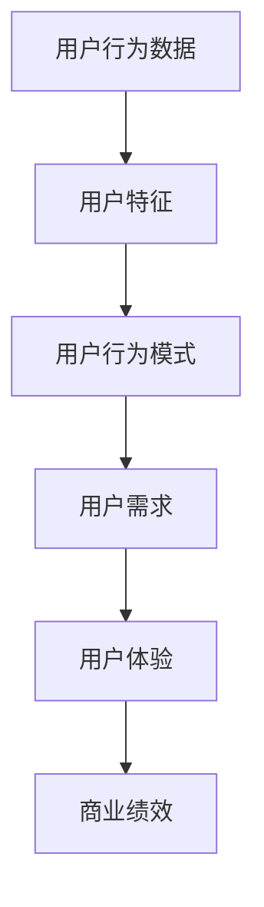
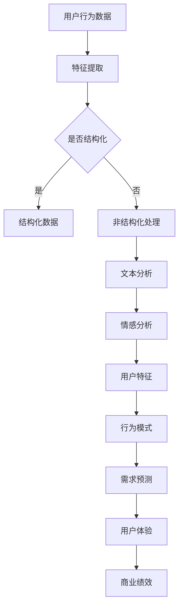
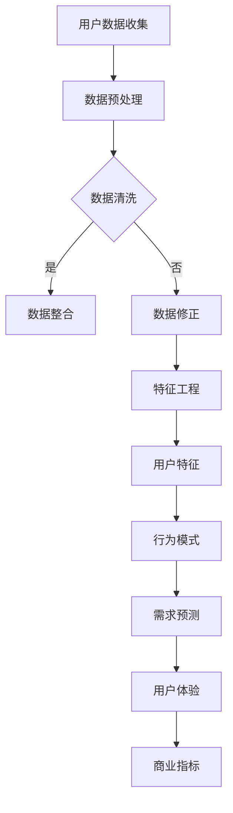

                 

# 文章标题: LLM应用开发中的用户行为分析

> 关键词：大型语言模型（LLM）、用户行为分析、数据处理、个性化推荐、用户体验优化

> 摘要：
本文旨在探讨在大型语言模型（LLM）应用开发中，如何利用用户行为分析来提升用户体验和商业性能。我们将深入分析用户行为分析的定义、目的、关键指标，以及其分析方法，并结合LLM应用开发的具体场景，探讨用户行为分析在模型训练、个性化推荐、用户转化路径优化和用户行为预测方面的应用。同时，本文也将讨论用户行为分析中面临的挑战和对策。

## 用户行为分析概述

### 用户行为分析的定义

用户行为分析是指通过收集和分析用户在数字平台上的行为数据，来理解用户的兴趣、需求、行为模式以及互动方式的过程。这一分析过程旨在帮助企业和组织优化用户体验、提升用户满意度、增强用户忠诚度，并最终提高商业绩效。

### 用户行为分析的目的

- **提升用户体验**：通过了解用户行为，企业可以更好地满足用户需求，提供个性化服务。
- **优化产品和服务**：根据用户行为数据，企业可以针对性地改进产品功能和服务流程。
- **增强用户参与度**：通过分析用户行为，企业可以设计出更吸引人的互动活动和营销策略。
- **提高转化率**：利用用户行为数据，企业可以优化用户转化路径，提高销售额。

### 用户行为分析的关键指标

- **用户留存率**：衡量用户持续使用服务的程度。
- **用户活跃度**：衡量用户在平台上活动的频率和深度。
- **用户转化率**：衡量用户从潜在用户转化为实际购买者的比率。
- **客户生命周期价值（CLV）**：预测用户在整个生命周期内为企业带来的总收益。

## 用户行为分析方法

### 数据收集

- **客户关系管理（CRM）系统**：整合用户基本信息、购买历史、沟通记录等。
- **事件跟踪**：利用技术手段追踪用户在网站、移动应用、社交媒体等平台上的行为。
- **数据仓库**：存储大量结构化、半结构化和非结构化数据，便于后续分析。

### 数据处理

- **数据清洗**：去除重复、错误和不完整的数据，确保数据质量。
- **数据整合**：将来自不同数据源的数据进行整合，形成统一的用户视图。

### 数据分析

- **描述性分析**：通过统计方法描述用户行为的基本特征。
- **趋势分析**：观察用户行为随时间变化的趋势。
- **聚类分析**：将具有相似行为的用户分为不同群体。
- **回归分析**：预测用户未来的行为，如购买行为、留存率等。

### 可视化

- **利用图表、地图、热力图等多种可视化工具，将用户行为数据直观呈现。

## 用户行为分析在LLM应用开发中的应用

### 模型训练

- 利用用户行为数据，对大型语言模型（LLM）进行训练，使其更好地理解用户需求。
- 通过分析用户评论、反馈、搜索查询等文本数据，提高模型的文本理解和生成能力。

### 个性化推荐

- 根据用户的浏览历史、搜索记录等行为数据，为用户提供个性化推荐。
- 利用用户行为数据，为不同用户提供不同的内容，提高用户满意度和参与度。

### 用户转化路径优化

- 分析用户在平台上的行为路径，识别影响用户转化的关键因素。
- 通过优化用户转化路径，降低用户流失率，提高转化率。

### 用户行为预测

- 利用历史行为数据，预测用户未来的行为，如购买意向、留存行为等。
- 通过预测结果，企业可以提前采取相应策略，提升用户满意度和商业收益。

### 用户行为分析的关键挑战与对策

#### 隐私保护

- 在用户行为分析过程中，如何保护用户隐私是一个重要挑战。
- 采用加密技术、匿名化处理、访问控制等措施，确保用户数据的安全。

#### 数据质量

- 数据质量直接影响用户行为分析的结果。
- 定期清理数据、修正错误、更新数据源，确保数据质量。

#### 技术复杂性

- 用户行为分析涉及多种技术手段，对技术人员的要求较高。
- 加强技术培训，引入先进技术，提高团队技术水平。

#### 数据整合

- 不同数据源之间的整合难度较大。
- 采用数据集成平台，实现数据的统一管理和分析。

### 总结

用户行为分析在LLM应用开发中具有重要意义，通过深入分析用户行为，企业可以更好地满足用户需求，优化产品和服务，提高用户体验和商业绩效。在未来的发展中，随着技术的不断进步，用户行为分析将在LLM应用开发中发挥越来越重要的作用。

## 第2章: 用户行为分析核心概念与联系

### 2.1 用户行为数据

#### 用户行为数据类型

- **结构化数据**：如用户信息、交易记录等，容易处理和分析。
- **半结构化数据**：如日志文件、网页点击流等，需要进行一定的预处理。
- **非结构化数据**：如文本、图片、视频等，需要复杂的处理方法。

#### 用户行为数据来源

- **网站和移动应用**：如页面访问、按钮点击、搜索查询等。
- **社交媒体**：如点赞、评论、分享等。
- **电子邮件和即时通讯**：如邮件打开率、聊天记录等。
- **客户关系管理（CRM）系统**：如客户基本信息、沟通记录等。

### 2.2 用户行为分析流程

#### 数据收集

- **事件跟踪**：在网站和应用中嵌入代码，记录用户的行为事件。
- **API调用**：通过API获取第三方平台的数据。

#### 数据预处理

- **数据清洗**：去除重复、错误和不完整的数据。
- **数据整合**：将来自不同数据源的数据进行整合，形成统一的用户视图。

### 2.3 用户行为分析核心概念与联系

#### 用户行为分析核心概念

- **用户行为数据**：用户在平台上的各种操作和交互数据。
- **用户特征**：用户行为数据的统计特征，如频次、时长、位置等。
- **用户行为模式**：用户在平台上的行为规律，如浏览习惯、购买模式等。
- **用户需求**：用户在平台上表现出的需求和期望。

#### 用户行为分析核心概念之间关系架构



- 用户行为数据是用户行为分析的基础，通过对用户行为数据进行统计分析，可以得到用户的特征和行为模式。
- 用户特征和行为模式反映了用户的需求和期望，通过对这些特征和模式的分析，可以更好地满足用户需求，提升用户体验。
- 用户体验的提升直接关系到商业绩效，良好的用户体验可以增加用户满意度和忠诚度，从而提高企业的商业收益。

### 用户行为分析核心概念与联系Mermaid流程图



### 用户行为分析核心概念联系与数据处理流程



### 用户行为分析核心算法原理讲解

#### 描述性分析

- 描述性分析是用户行为分析的基础，通过对用户行为数据进行统计分析，得到一些基本的统计指标，如平均值、中位数、标准差等。

```python
import pandas as pd

# 假设 df 是一个包含用户行为数据的DataFrame
df = pd.DataFrame({
    '点击次数': [10, 20, 30, 40, 50],
    '浏览时长': [10, 20, 30, 40, 50]
})

# 计算描述性统计指标
df.describe()
```

#### 趋势分析

- 趋势分析是观察用户行为随时间变化的趋势，可以帮助企业了解用户行为的长期变化和季节性变化。

```python
import pandas as pd
import matplotlib.pyplot as plt

# 假设 df 是一个包含用户行为数据的DataFrame，且有一个时间列 'timestamp'
df['timestamp'] = pd.to_datetime(df['timestamp'])

# 计算每个月的点击次数
monthly_clicks = df.groupby(df['timestamp'].dt.to_period('M')).size().reset_index(name='clicks')

# 绘制趋势图
monthly_clicks.plot(x='timestamp', y='clicks')
plt.xlabel('时间')
plt.ylabel('点击次数')
plt.title('点击次数趋势图')
plt.show()
```

#### 聚类分析

- 聚类分析是将具有相似行为的用户分为不同群体，可以帮助企业了解用户的不同行为模式和需求。

```python
from sklearn.cluster import KMeans

# 假设 X 是一个包含用户特征的矩阵
X = df[['点击次数', '浏览时长']]

# 使用 KMeans 算法进行聚类
kmeans = KMeans(n_clusters=3, random_state=0).fit(X)

# 计算每个用户的聚类标签
df['cluster'] = kmeans.predict(X)

# 绘制聚类结果
plt.scatter(X.iloc[:, 0], X.iloc[:, 1], c=df['cluster'])
plt.xlabel('点击次数')
plt.ylabel('浏览时长')
plt.title('聚类结果')
plt.show()
```

#### 回归分析

- 回归分析是预测用户未来的行为，如购买行为、留存率等，可以帮助企业制定相应的策略。

```python
from sklearn.linear_model import LinearRegression

# 假设 X 是一个包含用户特征的矩阵，y 是一个包含用户行为结果的向量
X = df[['点击次数', '浏览时长']]
y = df['购买行为']

# 使用 LinearRegression 算法进行回归分析
regressor = LinearRegression().fit(X, y)

# 预测新的用户行为
new_user = [[15, 25]]
predicted_behavior = regressor.predict(new_user)
print(f'预测的新用户行为：{predicted_behavior[0]}')
```

### 数学模型和公式

#### 用户留存率

$$ 留存率 = \frac{第 t 天仍然活跃的用户数}{第 t-1 天仍然活跃的用户数} $$

#### 用户活跃度

$$ 活跃度 = \frac{用户在平台上总的活动时长}{用户总数} $$

#### 用户转化率

$$ 转化率 = \frac{从潜在用户转化为实际购买者的数量}{总潜在用户数} $$

### 用户行为分析项目实战

#### 开发环境搭建

1. 安装 Python 和相关依赖库，如 Pandas、Scikit-learn、Matplotlib 等。
2. 配置数据存储和处理工具，如 MySQL、Hadoop、Spark 等。

#### 源代码详细实现

1. 数据收集：通过 API 调用获取用户行为数据，如点击次数、浏览时长等。
2. 数据预处理：对数据进行清洗、整合和特征提取。
3. 数据分析：使用描述性分析、趋势分析、聚类分析和回归分析等方法。
4. 结果可视化：使用 Matplotlib 和 Seaborn 等库绘制图表。

#### 代码解读与分析

```python
import pandas as pd
import matplotlib.pyplot as plt

# 数据收集
df = pd.read_csv('user_behavior_data.csv')

# 数据预处理
df = df.dropna()  # 去除缺失值
df = df.groupby('用户ID').agg({'点击次数': 'sum', '浏览时长': 'mean'})  # 整合数据

# 描述性分析
df.describe()

# 趋势分析
plt.plot(df['点击次数'])
plt.xlabel('时间')
plt.ylabel('点击次数')
plt.title('点击次数趋势图')
plt.show()

# 聚类分析
kmeans = KMeans(n_clusters=3, random_state=0).fit(df[['点击次数', '浏览时长']])
df['聚类标签'] = kmeans.predict(df[['点击次数', '浏览时长']])
plt.scatter(df['点击次数'], df['浏览时长'], c=df['聚类标签'])
plt.xlabel('点击次数')
plt.ylabel('浏览时长')
plt.title('聚类结果')
plt.show()

# 回归分析
regressor = LinearRegression().fit(df[['点击次数', '浏览时长']], df['购买行为'])
predicted_behavior = regressor.predict([[15, 25]])
print(f'预测的新用户行为：{predicted_behavior[0]}')
```

#### 实际案例分析和详细讲解剖析

1. **案例背景**：某电商企业希望通过用户行为分析来提升用户转化率。
2. **数据收集**：收集用户点击、浏览、购买等行为数据。
3. **数据处理**：对数据进行清洗、整合和特征提取。
4. **数据分析**：使用聚类分析和回归分析，识别用户群体和预测用户购买行为。
5. **结果应用**：根据分析结果，优化用户转化路径，提高转化率。

#### 项目小结

1. **核心内容**：用户行为分析在电商应用开发中的核心内容是数据收集、处理和分析。
2. **关键挑战**：数据质量和分析方法的选择是关键挑战。
3. **解决方案**：采用数据清洗和整合技术，选择合适的分析方法，结合实际业务需求。

### 最佳实践 Tips

1. **数据隐私保护**：在用户行为分析过程中，必须严格保护用户隐私，采用加密技术和访问控制措施。
2. **定期更新数据**：定期更新用户行为数据，确保数据的准确性和时效性。
3. **跨部门合作**：用户行为分析需要跨部门合作，包括数据分析、产品开发、市场营销等部门。

### 小结

用户行为分析在LLM应用开发中具有重要作用，通过深入分析用户行为，企业可以更好地满足用户需求，优化产品和服务，提高用户体验和商业绩效。在未来的发展中，随着技术的不断进步，用户行为分析将在LLM应用开发中发挥越来越重要的作用。

### 注意事项

1. **数据质量**：数据质量是用户行为分析的基础，确保数据质量至关重要。
2. **隐私保护**：在用户行为分析过程中，必须严格保护用户隐私，遵守相关法律法规。
3. **技术更新**：随着技术的快速发展，用户行为分析技术也在不断更新，企业需要不断学习和引进新技术。

### 拓展阅读

1. **《用户行为分析实战》**：这是一本介绍用户行为分析技术和应用案例的书籍，适合初学者和专业人士。
2. **《大数据之路》**：这本书详细介绍了大数据技术在企业中的应用，包括用户行为分析等方面。
3. **《Python数据科学手册》**：这本书涵盖了数据科学中的各种技术和工具，包括用户行为分析。

## 作者信息

- 作者：AI天才研究院/AI Genius Institute & 禅与计算机程序设计艺术 /Zen And The Art of Computer Programming

