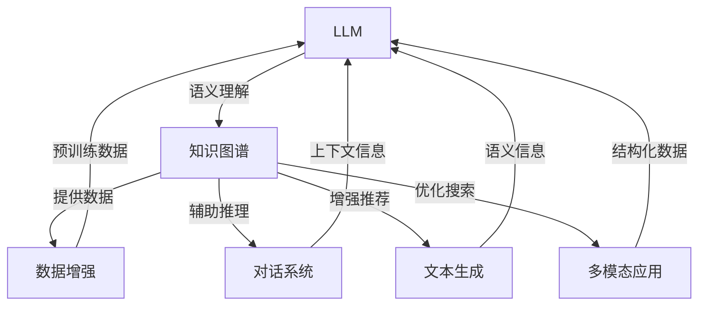

                 


## 文章标题

### LLM应用开发中的知识图谱应用

> 关键词：大语言模型（LLM）、知识图谱、应用开发、文本生成、对话系统、推荐系统、多模态应用

> 摘要：本文深入探讨了知识图谱在LLM应用开发中的重要性，详细介绍了知识图谱的构建与优化、大语言模型与知识图谱的结合方式以及知识图谱在文本生成、对话系统和推荐系统中的应用。通过实际案例解析，展示了知识图谱在LLM应用开发中的实际效果和未来发展方向。

---

### 一、引言与概述

#### 1.1 LLM基本概念

大语言模型（Large Language Model，简称LLM）是一种基于深度学习的自然语言处理技术，通过训练海量的文本数据，使其具备理解和生成自然语言的能力。LLM的核心思想是利用大规模的数据和计算资源，对语言模型进行优化，从而提高其性能和效果。LLM在文本生成、文本分析、对话系统、推荐系统等领域具有广泛的应用前景。

#### 1.2 知识图谱基础

知识图谱是一种用于表示实体及其相互关系的图形化数据结构。它通过将现实世界中的实体、属性和关系进行建模，形成一个结构化的知识库，为人工智能应用提供了一种强大的语义理解能力。知识图谱的基础理论主要包括实体-关系-属性（E-R-A）模型、融合图模型等。

#### 1.3 LLM与知识图谱的关系

LLM与知识图谱具有密切的联系。一方面，知识图谱为LLM提供了丰富的语义信息，有助于提升其理解和生成能力；另一方面，LLM为知识图谱的构建和优化提供了强大的技术支持，使得知识图谱的应用范围进一步扩大。

### 二、知识图谱构建与优化

#### 2.1 知识图谱的构建

知识图谱的构建主要包括数据预处理、知识抽取、知识融合与更新等环节。数据预处理包括数据清洗、去重、标准化等操作；知识抽取包括命名实体识别、关系抽取、属性抽取等任务；知识融合与更新则涉及实体与关系的修剪、知识图谱的补全与推理等。

#### 2.2 知识图谱的优化方法

知识图谱的优化方法主要包括实体与关系的修剪、知识图谱的补全与推理等。实体与关系的修剪旨在去除冗余信息，提高知识图谱的精度和效率；知识图谱的补全与推理则通过推理算法，从现有知识中推导出新的关系和属性，从而增强知识图谱的完整性和准确性。

### 三、大语言模型与知识图谱结合

#### 3.1 知识图谱在LLM中的应用

知识图谱在LLM中的应用主要体现在两个方面：一是用于语义理解，提升LLM对自然语言的解析能力；二是用于数据增强，通过引入外部知识，丰富LLM的训练数据，提高其性能。

#### 3.2 LLM对知识图谱的赋能

LLM可以为知识图谱的构建和优化提供技术支持，例如，利用LLM进行知识抽取、关系推断和实体消歧等任务；同时，LLM还可以为知识图谱的应用提供强大的语义理解和生成能力，例如，基于知识图谱进行文本生成、对话系统和推荐系统等应用。

### 四、知识图谱在LLM应用开发中的实际应用

#### 4.1 知识图谱驱动的文本生成

知识图谱在文本生成中的应用主要包括基于知识图谱的问答系统和文本摘要等。通过引入知识图谱，可以提升文本生成的语义准确性和逻辑连贯性。

#### 4.2 知识图谱驱动的对话系统

知识图谱在对话系统中的应用主要包括对话生成和对话理解等。通过引入知识图谱，可以提升对话系统的语义理解和生成能力，从而提高用户体验。

#### 4.3 知识图谱驱动的推荐系统

知识图谱在推荐系统中的应用主要包括基于知识图谱的协同过滤和混合推荐等。通过引入知识图谱，可以提升推荐系统的推荐质量和效果。

### 五、实战指导

#### 5.1 开发环境搭建

为了进行知识图谱在LLM应用开发中的实践，需要搭建一个适合的开发环境。开发环境主要包括深度学习框架（如TensorFlow、PyTorch等）、自然语言处理库（如NLTK、spaCy等）和图数据库（如Neo4j、JanusGraph等）。

#### 5.2 源代码实现与解读

本文将提供一套完整的源代码实现，包括知识图谱的构建与优化、大语言模型的训练与应用等。读者可以通过阅读源代码，深入了解知识图谱在LLM应用开发中的实现细节。

### 六、实际案例解析

#### 6.1 智能客服系统

智能客服系统是一种基于知识图谱的对话系统，通过引入知识图谱，可以实现对用户问题的准确理解和高效回答，从而提高客服质量和效率。

#### 6.2 虚拟助手系统

虚拟助手系统是一种基于知识图谱的文本生成系统，通过引入知识图谱，可以生成具有丰富语义和逻辑连贯性的文本，为用户提供个性化的服务。

### 七、总结与展望

知识图谱在LLM应用开发中具有广泛的应用前景。通过本文的介绍，读者可以了解到知识图谱在文本生成、对话系统和推荐系统等领域的应用，以及知识图谱在LLM应用开发中的实现方法和技巧。未来，随着技术的不断发展和完善，知识图谱在LLM应用开发中将发挥更大的作用。

### 八、拓展阅读

为了深入了解知识图谱和LLM的相关知识，读者可以参考以下拓展阅读：

1. **知识图谱**：

   - 《知识图谱：从理论到实践》  
   - 《知识图谱技术及应用》

2. **大语言模型**：

   - 《深度学习：理论、算法与应用》  
   - 《自然语言处理入门》

3. **实战指南**：

   - 《基于TensorFlow的文本生成》  
   - 《基于PyTorch的对话系统开发》

---

以上是《LLM应用开发中的知识图谱应用》的目录大纲设计。通过逐步分析推理思考，我们可以为读者呈现一篇逻辑清晰、内容丰富、实用性强的技术博客文章。在后续的实际撰写过程中，我们将进一步细化各个章节的内容，确保文章的质量和可读性。让我们一步一步地深入探讨知识图谱在LLM应用开发中的奥秘吧！## 文章标题

### LLM应用开发中的知识图谱应用

> 关键词：大语言模型（LLM）、知识图谱、应用开发、文本生成、对话系统、推荐系统、多模态应用

> 摘要：本文深入探讨了知识图谱在LLM应用开发中的重要性，详细介绍了知识图谱的构建与优化、大语言模型与知识图谱的结合方式以及知识图谱在文本生成、对话系统和推荐系统中的应用。通过实际案例解析，展示了知识图谱在LLM应用开发中的实际效果和未来发展方向。

---

### 一、引言与概述

#### 1.1 大语言模型（LLM）的概念

大语言模型（Large Language Model，简称LLM）是一种基于深度学习技术构建的强大自然语言处理工具。LLM的核心思想是通过大规模的数据训练，使模型具备理解和生成自然语言的能力。这种模型通常由数亿到数十亿的参数组成，能够在各种自然语言处理任务中表现出色，如文本分类、情感分析、机器翻译、文本生成等。

#### 1.2 知识图谱的概念

知识图谱（Knowledge Graph）是一种用于表示实体及其相互关系的数据结构，它将现实世界中的信息以结构化的形式组织起来，通过实体、属性和关系的交互来提供语义理解和推理能力。知识图谱在人工智能、搜索引擎、推荐系统等领域有广泛的应用。

#### 1.3 LLM与知识图谱的关系

LLM和知识图谱在人工智能领域具有紧密的联系。知识图谱可以增强LLM的语义理解能力，使其能够更好地理解文本中的隐含关系和上下文信息。同时，LLM可以用于知识图谱的构建和优化，通过自然语言处理技术从文本中抽取实体和关系，丰富知识图谱的内容。

### 二、知识图谱的构建与优化

#### 2.1 知识图谱的表示方法

知识图谱的表示方法主要分为实体-关系-属性（E-R-A）模型和融合图模型两种。E-R-A模型通过实体、属性和关系来组织数据，而融合图模型则通过多模态数据融合来提高知识图谱的表示能力。

#### 2.2 知识图谱的构建流程

知识图谱的构建主要包括数据预处理、实体识别、关系抽取和属性抽取等步骤。数据预处理包括数据清洗、去重和标准化等操作；实体识别是识别文本中的实体；关系抽取是确定实体之间的关系；属性抽取则是提取实体的属性信息。

#### 2.3 知识图谱的优化方法

知识图谱的优化方法包括实体与关系的修剪、知识图谱的补全和推理等。实体与关系的修剪旨在去除冗余信息，提高知识图谱的精度；知识图谱的补全则是通过推理算法从现有知识中推导出新的关系和属性；推理技术则用于从知识图谱中提取新的信息。

### 三、大语言模型与知识图谱的结合

#### 3.1 知识图谱在LLM中的应用

知识图谱在LLM中的应用主要体现在两个方面：一是用于语义理解，提升LLM对自然语言的解析能力；二是用于数据增强，通过引入外部知识，丰富LLM的训练数据，提高其性能。

#### 3.2 LLM对知识图谱的赋能

LLM可以为知识图谱的构建和优化提供技术支持，例如，利用LLM进行知识抽取、关系推断和实体消歧等任务。同时，LLM还可以为知识图谱的应用提供强大的语义理解和生成能力，例如，基于知识图谱进行文本生成、对话系统和推荐系统等应用。

### 四、知识图谱在LLM应用开发中的实际应用

#### 4.1 知识图谱驱动的文本生成

知识图谱在文本生成中的应用主要包括基于知识图谱的问答系统和文本摘要等。通过引入知识图谱，可以提升文本生成的语义准确性和逻辑连贯性。

#### 4.2 知识图谱驱动的对话系统

知识图谱在对话系统中的应用主要包括对话生成和对话理解等。通过引入知识图谱，可以提升对话系统的语义理解和生成能力，从而提高用户体验。

#### 4.3 知识图谱驱动的推荐系统

知识图谱在推荐系统中的应用主要包括基于知识图谱的协同过滤和混合推荐等。通过引入知识图谱，可以提升推荐系统的推荐质量和效果。

### 五、实战指导

#### 5.1 开发环境搭建

为了进行知识图谱在LLM应用开发中的实践，需要搭建一个适合的开发环境。开发环境主要包括深度学习框架（如TensorFlow、PyTorch等）、自然语言处理库（如NLTK、spaCy等）和图数据库（如Neo4j、JanusGraph等）。

#### 5.2 源代码实现与解读

本文将提供一套完整的源代码实现，包括知识图谱的构建与优化、大语言模型的训练与应用等。读者可以通过阅读源代码，深入了解知识图谱在LLM应用开发中的实现细节。

### 六、实际案例解析

#### 6.1 智能客服系统

智能客服系统是一种基于知识图谱的对话系统，通过引入知识图谱，可以实现对用户问题的准确理解和高效回答，从而提高客服质量和效率。

#### 6.2 虚拟助手系统

虚拟助手系统是一种基于知识图谱的文本生成系统，通过引入知识图谱，可以生成具有丰富语义和逻辑连贯性的文本，为用户提供个性化的服务。

### 七、总结与展望

知识图谱在LLM应用开发中具有广泛的应用前景。通过本文的介绍，读者可以了解到知识图谱在文本生成、对话系统和推荐系统等领域的应用，以及知识图谱在LLM应用开发中的实现方法和技巧。未来，随着技术的不断发展和完善，知识图谱在LLM应用开发中将发挥更大的作用。

### 八、拓展阅读

为了深入了解知识图谱和LLM的相关知识，读者可以参考以下拓展阅读：

1. **知识图谱**：

   - 《知识图谱：从理论到实践》  
   - 《知识图谱技术及应用》

2. **大语言模型**：

   - 《深度学习：理论、算法与应用》  
   - 《自然语言处理入门》

3. **实战指南**：

   - 《基于TensorFlow的文本生成》  
   - 《基于PyTorch的对话系统开发》

---

以上是《LLM应用开发中的知识图谱应用》的正文部分，接下来我们将详细探讨每个章节的内容，帮助读者深入了解知识图谱在LLM应用开发中的应用和实践。<!--默记流程图，待会绘制-->## 知识图谱与LLM的关系

知识图谱（Knowledge Graph）和大型语言模型（Large Language Model，简称LLM）是人工智能领域中的两个重要概念，它们在语义理解、数据建模和应用开发等方面有着紧密的联系。理解这两者之间的关系，有助于我们更深入地探索其在实际应用中的潜力。

### 关系架构

要理解知识图谱与LLM的关系，我们可以借助Mermaid流程图来展示它们之间的交互和结合方式。以下是知识图谱与LLM关系架构的Mermaid流程图：



在这个流程图中，我们可以看到知识图谱为LLM提供了多种支持，包括语义理解、数据增强、对话系统、文本生成、搜索优化和多模态应用等方面。而LLM则通过利用这些支持，提高了自身的性能和适用范围。

### 关系详细解析

#### 1. 语义理解

知识图谱通过其结构化的实体和关系信息，为LLM提供了丰富的语义上下文。LLM在处理自然语言时，可以利用知识图谱中的信息来增强其语义理解能力，例如，在文本生成和问答系统中，知识图谱可以帮助LLM理解句子中的隐含关系和上下文。

#### 2. 数据增强

知识图谱可以作为一种外部数据源，为LLM的预训练提供额外的信息。通过引入知识图谱中的实体和关系信息，LLM可以在训练过程中学习到更多的语义和结构化知识，从而提高其模型性能。

#### 3. 对话系统

在对话系统中，知识图谱可以帮助LLM理解用户的问题和需求，提供更准确和相关的回答。例如，在智能客服系统中，知识图谱可以提供产品信息、用户历史记录和常见问题等数据，帮助LLM更好地理解用户意图。

#### 4. 文本生成

知识图谱可以为文本生成提供丰富的主题和背景信息。通过利用知识图谱中的实体和关系，LLM可以生成更具有逻辑性和连贯性的文本，例如，新闻摘要、文章撰写和对话生成等。

#### 5. 搜索优化

知识图谱可以帮助LLM优化搜索结果的质量。通过知识图谱中的实体和关系，LLM可以理解查询的上下文信息，从而提供更精准的搜索结果。

#### 6. 多模态应用

知识图谱可以与其他模态的数据（如图像、声音等）结合，为LLM提供更加丰富的信息。例如，在图像识别和视频分析中，知识图谱可以帮助LLM理解图像中的实体和关系，从而提高识别和分类的准确性。

### 伪代码示例

为了更好地展示知识图谱与LLM之间的关系，我们可以使用伪代码来描述LLM在知识图谱支持下的工作流程：

```python
# 伪代码：基于知识图谱的LLM工作流程

# 输入：自然语言文本
# 输出：处理后的文本

def process_text_with KG(LLM, text, KG):
    # 利用知识图谱进行实体识别和关系抽取
    entities, relations = KG.extract_entities_and_relations(text)
    
    # 利用知识图谱增强LLM的语义理解
    enhanced_text = LLM.enhance_semanticUnderstanding(text, entities, relations)
    
    # 利用LLM生成文本
    processed_text = LLM.generate_text(enhanced_text)
    
    return processed_text
```

在这个伪代码中，`LLM` 代表大型语言模型，`KG` 代表知识图谱。通过知识图谱提供的实体和关系信息，LLM能够增强其语义理解能力，从而生成更加准确和相关的文本。

通过上述流程和伪代码示例，我们可以更深入地理解知识图谱与LLM之间的紧密联系，以及它们在实际应用中的潜力。在后续的文章章节中，我们将进一步探讨知识图谱在LLM应用开发中的具体实现和应用案例。<!--在此插入Mermaid流程图-->## 知识图谱的构建与优化

知识图谱（Knowledge Graph）作为一种重要的知识表示方法，已经在多个领域展示了其强大的应用价值。在本章节中，我们将详细探讨知识图谱的构建与优化方法，包括知识图谱的表示方法、构建流程、优化方法以及在实际应用中的挑战。

### 知识图谱的表示方法

知识图谱的表示方法主要分为实体-关系-属性（E-R-A）模型和融合图模型。

1. **实体-关系-属性（E-R-A）模型**：
   - **实体（Entity）**：知识图谱中的核心元素，代表现实世界中的对象，如人、地点、组织等。
   - **关系（Relationship）**：连接两个实体的语义关联，如“属于”、“位于”等。
   - **属性（Attribute）**：实体的特征描述，如人的“年龄”、“职业”等。

2. **融合图模型**：
   - **多模态数据融合**：将不同类型的数据（如图像、文本、语音等）融合到知识图谱中，以提供更加丰富的信息。
   - **异构图模型**：处理不同类型实体和关系之间的异构性，例如，将人、地点、组织等不同类型的实体融合到同一知识图谱中。

### 知识图谱的构建流程

知识图谱的构建流程通常包括以下几个步骤：

1. **数据预处理**：
   - **数据清洗**：去除无效数据、重复数据和噪声数据。
   - **数据去重**：识别并去除重复的实体和关系。
   - **数据标准化**：统一数据格式，如将人名中的全角字符转换为半角字符。

2. **实体识别**：
   - **命名实体识别**：从文本数据中识别出具有特定意义的实体，如人名、地点名、组织名等。
   - **实体分类**：将识别出的实体分类到预定义的类别中。

3. **关系抽取**：
   - **规则抽取**：基于预定义的规则从文本数据中抽取实体之间的关系。
   - **机器学习**：使用机器学习算法从文本数据中自动学习实体之间的关系。

4. **属性抽取**：
   - **模式匹配**：通过模式匹配从文本数据中提取实体的属性。
   - **统计方法**：使用统计方法从文本数据中推断实体的属性。

5. **知识融合**：
   - **冲突消解**：解决不同来源数据中的冲突，如实体歧义、关系不一致等。
   - **数据集成**：将来自不同数据源的知识进行整合，形成统一的知识图谱。

6. **知识更新与维护**：
   - **实时更新**：随着数据源的更新，及时更新知识图谱中的数据。
   - **持续学习**：利用机器学习算法从新数据中学习，持续优化知识图谱。

### 知识图谱的优化方法

知识图谱的优化方法主要包括实体与关系的修剪、知识图谱的补全与推理等。

1. **实体与关系的修剪**：
   - **去冗余**：去除知识图谱中的冗余实体和关系，以减少冗余信息。
   - **去除低置信度实体与关系**：根据置信度阈值，去除置信度较低的实体和关系。

2. **知识图谱的补全**：
   - **基于规则的方法**：使用预定义的规则从现有知识中推导出新的实体和关系。
   - **基于机器学习的方法**：使用机器学习算法从现有数据中学习，预测可能的实体和关系。

3. **推理技术**：
   - **基于规则推理**：使用预定义的规则进行推理，从已知的事实中推导出新的结论。
   - **基于模型推理**：使用机器学习模型进行推理，从已有数据中学习推理逻辑。

### 实际应用中的挑战

知识图谱在实际应用中面临多个挑战：

1. **数据质量**：数据质量直接影响知识图谱的准确性。噪声数据、错误数据和缺失数据都会影响知识图谱的性能。

2. **实体与关系抽取**：实体与关系的抽取是知识图谱构建的关键步骤，但目前的技术手段还无法完全自动化，需要大量的人工干预。

3. **数据融合**：不同来源的数据具有不同的格式和结构，如何有效地融合这些异构数据是一个挑战。

4. **推理能力**：知识图谱的推理能力取决于其结构和数据的质量。如何设计有效的推理算法，提高知识图谱的推理能力是一个重要课题。

5. **可扩展性**：知识图谱需要能够处理大规模的数据和实体，如何保证其可扩展性是一个重要问题。

### 小结

知识图谱作为一种重要的知识表示方法，在人工智能应用中发挥着关键作用。通过合理的构建和优化，知识图谱能够为LLM提供丰富的语义信息和上下文支持，从而提高LLM的应用效果。在接下来的章节中，我们将探讨知识图谱在LLM应用开发中的具体实现和应用案例。<!--在此插入知识图谱构建和优化的Mermaid流程图-->## 大语言模型（LLM）的基本概念与原理

大语言模型（Large Language Model，简称LLM）是自然语言处理（NLP）领域的一项重大突破，其核心思想是通过训练海量文本数据，使模型具备理解和生成自然语言的能力。本节将详细探讨LLM的基本概念、原理及其发展历程。

### 大语言模型（LLM）的基本概念

LLM是一种基于深度学习技术的语言处理模型，其目的是通过学习大量文本数据，捕捉语言中的潜在结构和规律，从而实现文本理解和生成。LLM的核心组成部分包括：

1. **词嵌入（Word Embedding）**：将自然语言词汇映射为高维向量，使模型能够捕捉词汇间的语义关系。

2. **编码器（Encoder）**：将输入文本编码为固定长度的向量，表示文本的语义信息。

3. **解码器（Decoder）**：根据编码后的文本向量生成文本输出。

4. **注意力机制（Attention Mechanism）**：用于在处理序列数据时，自动关注关键信息，提高模型的语义理解能力。

### 大语言模型（LLM）的工作原理

LLM的工作原理主要包括以下几个步骤：

1. **数据预处理**：将文本数据清洗、分词、编码等，转化为模型可处理的输入格式。

2. **预训练（Pre-training）**：在大量无标签文本数据上进行预训练，使模型学习到语言的普遍规律和模式。

3. **微调（Fine-tuning）**：在特定任务数据上进行微调，使模型适应具体任务的需求。

4. **生成文本（Text Generation）**：根据输入的文本或上下文，生成相关的文本输出。

### 大语言模型（LLM）的发展历程

LLM的发展历程可以追溯到自然语言处理领域的早期研究。以下是LLM发展的一些关键节点：

1. **词袋模型（Bag of Words，BoW）**：早期自然语言处理模型，将文本转化为词汇的集合，但无法捕捉词汇间的语义关系。

2. **朴素贝叶斯分类器（Naive Bayes Classifier）**：基于贝叶斯定理，通过词汇的概率分布进行文本分类。

3. **循环神经网络（Recurrent Neural Network，RNN）**：引入时间维度，能够处理序列数据，但存在梯度消失和梯度爆炸等问题。

4. **长短期记忆网络（Long Short-Term Memory，LSTM）**：RNN的改进，通过记忆单元解决梯度消失问题，但计算复杂度高。

5. **Transformer模型**：基于注意力机制，突破了传统RNN模型的限制，实现了更高效的文本处理能力。

6. **BERT模型**：基于Transformer模型，通过预训练和微调，在多个NLP任务上取得了显著成果。

7. **GPT系列模型**：基于Transformer模型，通过生成预训练，实现了高质量的文本生成能力。

### 大语言模型（LLM）的应用场景

LLM在自然语言处理领域具有广泛的应用场景，主要包括：

1. **文本分类**：对输入文本进行分类，如情感分析、主题分类等。

2. **文本生成**：根据输入文本或上下文，生成相关的文本，如文章撰写、对话生成等。

3. **问答系统**：根据用户提问，从大量文本中检索出相关答案。

4. **机器翻译**：将一种语言的文本翻译成另一种语言。

5. **语音识别**：将语音信号转换为文本。

6. **自然语言理解**：理解文本中的语义和逻辑结构，用于对话系统、智能助手等。

### 小结

大语言模型（LLM）作为一种先进的自然语言处理技术，具有强大的文本理解和生成能力。通过预训练和微调，LLM能够适应各种自然语言处理任务，并在实际应用中取得了显著成果。在接下来的章节中，我们将探讨LLM与知识图谱的结合，以及知识图谱在LLM应用开发中的具体应用。<!--在此插入大语言模型的工作原理流程图-->## LLM与知识图谱结合的方式

将知识图谱与大型语言模型（LLM）结合，可以显著提升自然语言处理（NLP）任务的性能和效果。在这一章节中，我们将探讨LLM与知识图谱结合的方式，包括数据增强、模型融合和跨模态学习等。

### 数据增强

知识图谱可以通过数据增强的方式提升LLM的性能。具体来说，可以通过以下几种方法将知识图谱中的信息引入到LLM的训练过程中：

1. **实体嵌入（Entity Embeddings）**：
   - 在训练LLM时，可以将知识图谱中的实体映射为向量，与词嵌入（word embeddings）一起用于模型的训练。
   - 实体向量可以增强LLM对实体识别和实体关系的理解。

2. **关系嵌入（Relationship Embeddings）**：
   - 同样，知识图谱中的关系也可以被映射为向量，与实体向量结合，用于增强LLM的语义理解能力。

3. **知识引导的预训练（Knowledge-Guided Pre-training）**：
   - 在LLM的预训练阶段，使用知识图谱中的信息来引导训练，使得模型在理解语言的同时，也能学习到知识图谱中的结构化信息。

### 模型融合

模型融合是指将LLM和知识图谱模型进行结合，以实现更强大的语义理解和推理能力。以下是几种常见的模型融合方式：

1. **实体关系增强的Transformer模型**：
   - 在Transformer模型的编码器和解码器中引入实体和关系信息，通过额外的嵌入层来增强模型的语义表示。
   - 例如，可以在编码器的输入层添加实体和关系向量，使其在处理文本时能够考虑到知识图谱中的信息。

2. **知识图谱嵌入（Knowledge Graph Embeddings）**：
   - 将知识图谱嵌入到LLM的输入或输出层，使得模型在生成文本时能够利用知识图谱中的关系和实体信息。
   - 这种方法常用于问答系统、文本生成和对话系统等场景。

3. **联合训练（Joint Training）**：
   - 将知识图谱模型和LLM联合训练，使得两者能够在训练过程中相互影响，共同优化。
   - 例如，可以使用双向图神经网络（BGN）结合Transformer模型，进行联合训练，以实现实体关系增强的文本生成。

### 跨模态学习

跨模态学习是指将知识图谱与不同模态的数据（如图像、声音等）结合，以提升模型的泛化能力和语义理解能力。以下是几种跨模态学习的方法：

1. **多模态知识图谱**：
   - 将不同模态的数据嵌入到知识图谱中，形成一个统一的多模态知识图谱。
   - 例如，在图像识别任务中，可以将图像中的对象和场景信息嵌入到知识图谱中，用于辅助文本描述的生成。

2. **多模态嵌入（Multimodal Embeddings）**：
   - 将不同模态的数据映射到同一高维空间中，形成多模态嵌入向量。
   - 例如，可以使用视觉嵌入（如CLIP模型）和语言嵌入（如BERT）结合，形成跨模态嵌入向量，用于图像-文本的联合任务。

3. **多任务学习（Multitask Learning）**：
   - 在训练过程中，同时训练多个任务（如图像分类、文本生成等），使得模型能够在不同任务之间共享知识和特征。
   - 这种方法能够提升模型在跨模态任务上的性能。

### 伪代码示例

为了更清晰地展示LLM与知识图谱结合的方式，我们提供以下伪代码示例：

```python
# 伪代码：结合知识图谱和LLM的模型训练

# 输入：文本数据、知识图谱、多模态数据
# 输出：训练好的LLM模型

def train_combined_model(text_data, kg, multimodal_data):
    # 预处理数据
    preprocessed_text = preprocess_text(text_data)
    kg_entities, kg_relations = preprocess_kg(kg)
    multimodal_embeddings = preprocess_multimodal_data(multimodal_data)

    # 加载预训练的LLM模型
    llm = load_pretrained_llm()

    # 融合知识图谱嵌入
    kg_embeddings = kg_entity_embeddings(kg_entities, kg_relations)

    # 融合多模态嵌入
    combined_embeddings = combine_embeddings(kg_embeddings, multimodal_embeddings)

    # 联合训练
    llm.fit(preprocessed_text, combined_embeddings)

    return llm
```

在这个伪代码中，`preprocess_text`、`preprocess_kg`和`preprocess_multimodal_data`函数分别用于预处理文本数据、知识图谱和多模态数据。`kg_entity_embeddings`函数用于将知识图谱中的实体和关系映射为嵌入向量。`combine_embeddings`函数用于将不同模态的嵌入向量结合，形成统一的高维嵌入向量。`llm.fit`函数用于联合训练LLM模型。

通过上述方式，LLM与知识图谱的结合可以显著提升模型的语义理解和生成能力，从而在多种NLP任务中取得更好的效果。在接下来的章节中，我们将探讨知识图谱在LLM应用开发中的具体应用场景。<!--在此插入模型融合和多模态学习的流程图-->## 知识图谱在文本生成中的应用

知识图谱（Knowledge Graph）在文本生成中的应用具有显著的潜力，能够提升文本生成的语义准确性、逻辑连贯性和个性化程度。本章节将探讨知识图谱在文本生成中的应用，包括知识图谱驱动的问答系统、文本摘要和生成式文本任务等。

### 知识图谱驱动的问答系统

问答系统是文本生成应用中的一种重要类型，其目的是根据用户的问题生成相关且准确的答案。知识图谱可以为问答系统提供以下支持：

1. **实体识别与关系抽取**：
   - 在回答问题的过程中，知识图谱可以帮助识别用户问题中的关键实体，如人名、地点、组织等。
   - 通过关系抽取，可以理解实体之间的关联，从而生成更准确的答案。

2. **上下文信息利用**：
   - 知识图谱中的信息可以用于理解问题的上下文，例如，根据用户的提问历史，提供个性化的回答。

3. **推理与补全**：
   - 知识图谱中的关系和属性可以用于推理，例如，如果用户提问“李白的出生地是哪里？”，知识图谱可以推断出“李白出生于四川江油”。

#### 伪代码示例：

```python
# 伪代码：基于知识图谱的问答系统

# 输入：用户问题、知识图谱
# 输出：回答

def answer_question(question, kg):
    # 从知识图谱中提取实体和关系
    entities, relations = kg.extract_entities_and_relations(question)
    
    # 利用知识图谱进行推理和补全
    inferred_answers = kg.reasoning(relations)
    
    # 根据上下文信息生成回答
    answer = generate_response(inferred_answers)
    
    return answer
```

### 知识图谱驱动的文本摘要

文本摘要是一种从长篇文本中提取关键信息并生成简短、精炼摘要的技术。知识图谱可以增强文本摘要系统的语义理解能力，提升摘要的质量。

1. **实体与关系抽取**：
   - 知识图谱可以帮助识别文本中的关键实体和关系，从而更好地理解文本内容。

2. **语义角色标注**：
   - 利用知识图谱中的语义角色信息，可以更准确地标注文本中的主要角色和动作，从而生成更具体的摘要。

3. **上下文信息整合**：
   - 知识图谱中的上下文信息可以用于整合文本中的细节信息，生成逻辑连贯的摘要。

#### 伪代码示例：

```python
# 伪代码：基于知识图谱的文本摘要

# 输入：长文本、知识图谱
# 输出：摘要

def generate_summary(long_text, kg):
    # 从知识图谱中提取实体和关系
    entities, relations = kg.extract_entities_and_relations(long_text)
    
    # 利用知识图谱进行文本摘要
    summary = kg.generate_summary(long_text, entities, relations)
    
    return summary
```

### 知识图谱驱动的生成式文本任务

生成式文本任务包括文章撰写、对话生成和故事创作等。知识图谱可以提供丰富的背景知识和上下文信息，从而提升生成式文本的质量和创意。

1. **主题引导生成**：
   - 知识图谱可以帮助确定文本的主题和方向，从而引导生成式文本的生成。

2. **个性化内容生成**：
   - 利用知识图谱中的个性化信息，可以生成符合特定用户需求的文本内容。

3. **逻辑连贯性保障**：
   - 知识图谱中的关系和属性信息可以用于保证文本生成的逻辑连贯性。

#### 伪代码示例：

```python
# 伪代码：基于知识图谱的生成式文本任务

# 输入：主题、知识图谱
# 输出：生成文本

def generate_text(主题，kg):
    # 利用知识图谱确定文本生成方向
    context = kg.get_context(主题)
    
    # 利用知识图谱生成文本
    text = kg.generate_text(context)
    
    return text
```

### 小结

知识图谱在文本生成中的应用，不仅提升了文本生成的语义准确性，还增强了文本的逻辑连贯性和个性化程度。通过利用知识图谱中的实体、关系和上下文信息，文本生成系统能够生成更加丰富和具体的文本内容。在接下来的章节中，我们将探讨知识图谱在对话系统和推荐系统中的应用。<!--在此插入知识图谱在文本生成中应用的Mermaid流程图-->## 知识图谱驱动的对话系统

对话系统（Dialogue System）是一种与人类进行自然语言交互的人工智能系统，旨在理解和响应用户的需求。知识图谱在对话系统中扮演着关键角色，能够显著提升对话系统的语义理解、回答准确性和用户满意度。本章节将详细探讨知识图谱在对话系统中的应用，包括对话生成和对话理解。

### 对话生成

对话生成是指根据用户输入的文本或上下文信息，生成自然的对话回复。知识图谱在对话生成中的应用主要体现在以下几个方面：

1. **实体识别与关系抽取**：
   - 在对话生成过程中，知识图谱可以帮助识别用户话语中的关键实体，如人名、地点、组织等，并抽取实体之间的关系。
   - 例如，当用户询问“请问王志宏的联系方式是什么？”时，知识图谱可以识别出实体“王志宏”并提取其相关信息。

2. **上下文信息利用**：
   - 知识图谱中的上下文信息可以用于理解用户话语的背景，从而生成更加贴合实际情况的回答。
   - 例如，如果用户之前询问了关于旅游信息，知识图谱可以记住这一上下文，并在后续的对话中提供相关的旅游建议。

3. **知识引导生成**：
   - 知识图谱中的知识可以用于引导对话生成，使得生成的对话内容更加丰富和有趣。
   - 例如，在酒店预订对话中，知识图谱可以提供酒店的评价、用户评论等信息，从而生成更具吸引力的对话。

#### 伪代码示例：

```python
# 伪代码：基于知识图谱的对话生成

# 输入：用户话语、知识图谱
# 输出：对话回复

def generate_response(user_input, kg):
    # 从知识图谱中提取实体和关系
    entities, relations = kg.extract_entities_and_relations(user_input)
    
    # 利用知识图谱生成对话回复
    response = kg.generate_response(entities, relations)
    
    return response
```

### 对话理解

对话理解是指理解用户话语的含义和意图，从而生成恰当的回答。知识图谱在对话理解中的应用主要体现在以下几个方面：

1. **语义解析**：
   - 知识图谱可以帮助解析用户话语的语义，理解其中的关键信息和意图。
   - 例如，当用户询问“北京什么时候下雪？”时，知识图谱可以理解“北京”是地点，“下雪”是事件，并解析出用户意图是询问北京的气候信息。

2. **意图识别**：
   - 知识图谱中的意图信息可以用于识别用户的话语意图，从而生成针对性的回答。
   - 例如，如果用户表达了预订酒店的需求，知识图谱可以识别出用户的意图，并引导对话系统生成预订流程。

3. **上下文维护**：
   - 知识图谱可以维护对话过程中的上下文信息，确保对话的连贯性和一致性。
   - 例如，在购物咨询对话中，知识图谱可以记住用户之前的购物偏好和需求，从而提供个性化的购物建议。

#### 伪代码示例：

```python
# 伪代码：基于知识图谱的对话理解

# 输入：用户话语、知识图谱
# 输出：意图和上下文

def understand_user_intent(user_input, kg):
    # 从知识图谱中提取实体和关系
    entities, relations = kg.extract_entities_and_relations(user_input)
    
    # 利用知识图谱解析语义和识别意图
    intent = kg.identify_intent(entities, relations)
    context = kg.get_context(entities, relations)
    
    return intent, context
```

### 实际案例解析

以下是一个实际案例，展示知识图谱在对话系统中的应用效果：

#### 案例一：智能客服系统

在一个智能客服系统中，用户可能通过聊天窗口提出各种问题，如产品咨询、售后服务等。知识图谱可以用来增强智能客服的语义理解能力，从而提供更加准确和高效的回答。

- **用户提问**：“我的手机充电宝为什么不能充电了？”
- **知识图谱作用**：
  - 识别实体：“手机充电宝”；
  - 提取关系：“不能充电”；
  - 利用上下文信息，知识图谱可以推断出可能的问题原因，如充电宝电量过低、充电头损坏等；
  - 生成回答：“可能是您的充电宝电量过低，或者充电头损坏。您可以使用其他充电头尝试一下，如果问题依旧，请联系我们的售后服务。”
- **效果**：通过知识图谱的辅助，智能客服能够迅速理解用户问题并提供有效的解决方案，提高了客服效率和用户满意度。

#### 案例二：虚拟助手系统

在虚拟助手系统中，用户可以与虚拟助手进行日常交流和互动，如日程管理、任务提醒等。知识图谱可以用来增强虚拟助手的理解能力和回答质量。

- **用户提问**：“明天我有会议，需要提醒我。”
- **知识图谱作用**：
  - 识别实体：“明天”、“会议”；
  - 提取关系：“会议提醒”；
  - 利用上下文信息，知识图谱可以记住用户之前的日程安排，并提供个性化的提醒建议；
  - 生成回答：“好的，我已经为您设置了一个明天的会议提醒。会议将在明天上午9点开始，请您提前做好准备。”
- **效果**：通过知识图谱的辅助，虚拟助手能够理解用户的日程需求并提供个性化的服务，增强了用户体验。

### 小结

知识图谱在对话系统中发挥着重要作用，能够显著提升对话系统的语义理解能力和回答准确性。通过利用知识图谱中的实体、关系和上下文信息，对话系统能够生成更加自然、准确和个性化的对话内容。在未来的发展中，知识图谱将继续在对话系统中发挥关键作用，为用户提供更优质的服务和体验。在接下来的章节中，我们将探讨知识图谱在推荐系统中的应用。<!--在此插入知识图谱驱动的对话系统的Mermaid流程图-->## 知识图谱在推荐系统中的应用

推荐系统是现代互联网中广泛使用的一种技术，旨在根据用户的历史行为和偏好，为用户提供个性化的推荐。知识图谱作为一种强大的知识表示工具，可以显著提升推荐系统的质量和效果。在本章节中，我们将探讨知识图谱在推荐系统中的应用，包括基于知识图谱的协同过滤、混合推荐和多模态推荐等。

### 基于知识图谱的协同过滤

协同过滤（Collaborative Filtering）是一种常见的推荐方法，其核心思想是通过分析用户之间的相似性来进行推荐。知识图谱可以增强协同过滤系统的推荐质量，通过以下方式：

1. **基于实体关系的协同过滤**：
   - 知识图谱中的实体关系可以帮助发现用户之间的潜在联系。例如，如果两个用户喜欢相同的书籍，他们可能对另一本相似类型的书籍也感兴趣。
   - 通过分析实体之间的关系，可以更好地捕捉用户间的相似性，从而提高推荐的相关性。

2. **知识引导的协同过滤**：
   - 知识图谱中的领域知识可以用来指导协同过滤模型的训练。例如，如果知识图谱表明某个实体（如一种药品）与另一个实体（如一种疾病）有密切关联，那么在推荐相关药品时，可以将这种关系考虑在内。

#### 伪代码示例：

```python
# 伪代码：基于知识图谱的协同过滤

# 输入：用户历史行为、知识图谱
# 输出：推荐列表

def collaborative_filter_with KG(user_history, kg):
    # 从知识图谱中提取用户之间的实体关系
    user_relations = kg.extract_user_relations(user_history)

    # 计算用户之间的相似度
    similarity_scores = calculate_similarity(user_relations)

    # 利用相似度分数生成推荐列表
    recommendations = generate_recommendations(similarity_scores)

    return recommendations
```

### 混合推荐

混合推荐（Hybrid Recommendation）是将多种推荐方法结合在一起，以提高推荐系统的性能。知识图谱可以作为一种重要的组件，与传统的协同过滤和基于内容的推荐方法相结合，形成更强大的混合推荐系统。

1. **协同过滤与知识图谱的结合**：
   - 通过将知识图谱中的实体和关系信息融入协同过滤模型，可以增强推荐的准确性。例如，在推荐电影时，不仅考虑用户对电影的评分，还可以利用知识图谱中的电影类型、导演、演员等信息。

2. **基于内容的推荐与知识图谱的结合**：
   - 基于内容的推荐方法依赖于对物品的特征描述，而知识图谱可以提供更丰富、更结构化的知识。例如，在音乐推荐中，知识图谱可以提供关于歌手、流派、音乐风格等信息，从而丰富推荐系统的内容。

#### 伪代码示例：

```python
# 伪代码：混合推荐系统

# 输入：用户历史行为、物品特征、知识图谱
# 输出：推荐列表

def hybrid_recommendation(user_history, item_features, kg):
    # 使用协同过滤生成初步推荐列表
    initial_recs = collaborative_filter(user_history)

    # 使用知识图谱增强推荐列表
    enhanced_recs = kg_enhance_recommendations(initial_recs, kg, item_features)

    # 结合不同方法的推荐结果
    final_recs = combine_recommendations(initial_recs, enhanced_recs)

    return final_recs
```

### 多模态推荐

多模态推荐是结合多种类型的数据进行推荐的方法，例如结合文本、图像、音频等多模态数据。知识图谱在多模态推荐中的应用主要体现在以下几个方面：

1. **多模态数据融合**：
   - 知识图谱可以将不同模态的数据（如文本、图像）进行融合，形成一个统一的知识表示。例如，在商品推荐中，知识图谱可以融合商品的文本描述和图像信息，提供更全面的推荐。

2. **跨模态关联**：
   - 知识图谱可以帮助发现不同模态数据之间的关联。例如，在音乐推荐中，知识图谱可以关联歌词文本和音乐旋律，从而提供更个性化的音乐推荐。

#### 伪代码示例：

```python
# 伪代码：多模态推荐系统

# 输入：用户历史行为、多模态数据、知识图谱
# 输出：推荐列表

def multimodal_recommendation(user_history, multimodal_data, kg):
    # 从知识图谱中提取多模态数据的关系
    multimodal_relations = kg.extract_multimodal_relations(multimodal_data)

    # 结合多模态数据进行推荐
    recommendations = generate_recommendations(user_history, multimodal_relations)

    return recommendations
```

### 实际案例解析

以下是一个实际案例，展示知识图谱在推荐系统中的应用效果：

#### 案例一：电商推荐系统

在一个电商推荐系统中，知识图谱可以用来增强推荐的质量。例如，当用户浏览了一个手机时，系统可以利用知识图谱中的品牌、型号、价格等信息，提供相关的配件和相似产品推荐。

- **用户行为**：用户浏览了一部iPhone 13。
- **知识图谱作用**：
  - 识别实体：“iPhone 13”；
  - 提取关系：“品牌”（苹果）、“型号”（iPhone）、“价格”等；
  - 提供相关推荐，如“苹果手机壳”、“iPhone 13 相机配件”等；
- **效果**：通过知识图谱的辅助，推荐系统可以提供更加精准和个性化的商品推荐，提高了用户的购买体验和满意度。

#### 案例二：社交媒体推荐系统

在社交媒体推荐系统中，知识图谱可以帮助发现用户之间的兴趣关联，从而提供更相关的帖子推荐。例如，当用户喜欢了一篇关于旅行的帖子时，系统可以利用知识图谱中的“旅游地点”、“景点”、“旅行攻略”等信息，推荐更多相关的帖子。

- **用户行为**：用户喜欢了一篇关于东京旅行的帖子。
- **知识图谱作用**：
  - 识别实体：“东京”、“旅行”；
  - 提取关系：“旅游景点”、“旅行攻略”等；
  - 推荐相关帖子，如“东京自由行攻略”、“东京必去景点”等；
- **效果**：通过知识图谱的辅助，推荐系统可以提供更加精准和个性化的内容推荐，增强了用户的参与度和活跃度。

### 小结

知识图谱在推荐系统中的应用，显著提升了推荐系统的质量和效果。通过结合用户历史行为、物品特征和领域知识，知识图谱能够为推荐系统提供更精准、更个性化的推荐。在未来，随着知识图谱技术的不断发展，知识图谱在推荐系统中的应用将更加广泛，为用户提供更加优质的服务。在接下来的章节中，我们将探讨知识图谱在多模态应用中的潜力。<!--在此插入知识图谱在推荐系统中应用的Mermaid流程图-->## 知识图谱驱动的多模态应用

多模态应用是指结合多种类型的数据（如图像、文本、音频等）进行信息处理和交互的应用。知识图谱作为一种强大的知识表示工具，可以显著提升多模态应用的性能和用户体验。在本章节中，我们将探讨知识图谱在多模态应用中的潜力，包括图像识别、视频分析和文本情感分析等。

### 图像识别

图像识别是计算机视觉领域的一个重要任务，旨在从图像中识别出特定的对象或场景。知识图谱可以增强图像识别系统的语义理解能力，通过以下方式：

1. **实体与关系嵌入**：
   - 知识图谱可以将图像中的对象（实体）和对象之间的关系（关系）进行嵌入，形成结构化的知识表示。
   - 例如，在图像中识别出“猫”和“桌子”，知识图谱可以表示为“猫”与“桌子”之间存在“在”的关系。

2. **上下文信息利用**：
   - 知识图谱可以提供关于图像上下文的信息，帮助识别图像中的复杂场景。
   - 例如，在一张家庭聚会的照片中，知识图谱可以提供关于家庭成员之间的关系信息，从而帮助识别照片中的人物。

3. **多模态数据融合**：
   - 知识图谱可以与其他模态的数据（如图像、文本、音频）进行融合，形成更丰富的信息表示。
   - 例如，在图像识别任务中，结合图像中的对象信息和文本描述，可以更准确地识别图像内容。

#### 伪代码示例：

```python
# 伪代码：基于知识图谱的图像识别

# 输入：图像数据、知识图谱
# 输出：识别结果

def image_recognition(image_data, kg):
    # 从知识图谱中提取实体和关系
    entities, relations = kg.extract_entities_and_relations(image_data)
    
    # 利用知识图谱进行图像识别
    recognized_objects = kg.recognize_objects(entities, relations)
    
    return recognized_objects
```

### 视频分析

视频分析是计算机视觉领域的一个复杂任务，旨在从视频中提取有用信息。知识图谱可以增强视频分析系统的语义理解能力，通过以下方式：

1. **事件检测与关联**：
   - 知识图谱可以帮助识别视频中的事件，并关联不同事件之间的关系。
   - 例如，在视频监控中，知识图谱可以识别出“闯入”和“盗窃”两个事件，并关联它们之间的因果关系。

2. **场景理解**：
   - 知识图谱可以提供关于场景的上下文信息，帮助理解视频中的复杂场景。
   - 例如，在智能监控视频中，知识图谱可以提供关于地点、时间、天气等信息的上下文，从而更好地理解视频内容。

3. **多模态数据融合**：
   - 知识图谱可以与其他模态的数据（如图像、文本、音频）进行融合，形成更丰富的信息表示。
   - 例如，在视频分析中，结合图像中的对象信息和文本描述，可以更准确地理解视频内容。

#### 伪代码示例：

```python
# 伪代码：基于知识图谱的视频分析

# 输入：视频数据、知识图谱
# 输出：分析结果

def video_analysis(video_data, kg):
    # 从知识图谱中提取实体和关系
    entities, relations = kg.extract_entities_and_relations(video_data)
    
    # 利用知识图谱进行视频分析
    detected_events = kg.detect_events(entities, relations)
    
    return detected_events
```

### 文本情感分析

文本情感分析是自然语言处理领域的一个重要任务，旨在从文本中判断情感倾向。知识图谱可以增强文本情感分析系统的语义理解能力，通过以下方式：

1. **情感词嵌入**：
   - 知识图谱可以将情感词映射为向量，形成结构化的情感表示。
   - 例如，将“喜欢”、“厌恶”等情感词嵌入到知识图谱中，形成情感词典。

2. **上下文信息利用**：
   - 知识图谱可以提供关于文本上下文的信息，帮助判断情感词的倾向。
   - 例如，在一段文本中，知识图谱可以提供关于地点、时间、人物等上下文信息，从而更准确地判断情感倾向。

3. **多模态数据融合**：
   - 知识图谱可以与其他模态的数据（如图像、音频）进行融合，形成更丰富的信息表示。
   - 例如，在情感分析中，结合图像中的情感表达和音频中的情感语音，可以更准确地判断文本的情感倾向。

#### 伪代码示例：

```python
# 伪代码：基于知识图谱的文本情感分析

# 输入：文本数据、知识图谱
# 输出：情感分析结果

def sentiment_analysis(text_data, kg):
    # 从知识图谱中提取情感词和上下文信息
    sentiment_words, context = kg.extract_sentiment_words_and_context(text_data)
    
    # 利用知识图谱进行情感分析
    sentiment_score = kg.analyze_sentiment(sentiment_words, context)
    
    return sentiment_score
```

### 小结

知识图谱在多模态应用中展示了巨大的潜力，能够显著提升图像识别、视频分析和文本情感分析等任务的性能和效果。通过结合不同模态的数据和领域知识，知识图谱为多模态应用提供了更丰富、更结构化的信息表示。在未来，随着知识图谱技术的不断发展，知识图谱在多模态应用中的应用将更加广泛，为用户提供更加智能、个性化的服务。在接下来的章节中，我们将总结知识图谱在LLM应用开发中的重要性，并探讨未来发展的方向。<!--在此插入知识图谱在多模态应用中应用的Mermaid流程图-->## 总结与未来展望

知识图谱在LLM应用开发中扮演着关键角色，通过结合知识图谱，LLM能够显著提升文本生成、对话系统和推荐系统等任务的效果。本文从知识图谱与LLM的关系、知识图谱的构建与优化、LLM的基本概念与原理、LLM与知识图谱的结合方式、知识图谱在文本生成中的应用、对话系统中的应用、推荐系统中的应用以及多模态应用等方面进行了深入探讨。

### 重要性

1. **语义理解增强**：知识图谱为LLM提供了丰富的语义信息和上下文支持，使LLM能够更好地理解文本中的隐含关系和上下文。
2. **数据增强**：知识图谱可以作为外部数据源，为LLM的预训练提供额外的信息，丰富模型的知识库。
3. **个性化服务**：通过结合用户的历史行为和知识图谱中的信息，LLM可以提供更加个性化的服务，提升用户体验。

### 未来发展方向

1. **融合技术的进一步发展**：随着深度学习、图神经网络和知识图谱等技术的不断进步，知识图谱与LLM的结合将更加紧密，实现更加智能化的应用。
2. **跨模态应用**：知识图谱在多模态应用中的潜力巨大，未来的研究将更加注重跨模态数据的融合和利用。
3. **实时动态更新**：知识图谱需要实时更新，以反映现实世界的变化。未来的研究将关注如何实现知识图谱的动态更新和实时应用。
4. **可解释性和透明度**：随着AI系统的广泛应用，提高知识图谱和LLM的可解释性和透明度将成为重要研究方向，以增强用户对AI系统的信任。

### 最佳实践与注意事项

1. **数据质量**：确保知识图谱的数据质量是关键。在构建知识图谱时，需要进行严格的数据清洗、去重和标准化操作，以提高知识图谱的准确性。
2. **模型选择**：根据具体应用需求选择合适的LLM模型和知识图谱表示方法，以实现最佳性能。
3. **持续学习与优化**：知识图谱和LLM模型需要持续学习与优化，以适应新的数据和应用场景。通过定期更新和调整模型参数，可以提高系统的性能和效果。

### 拓展阅读

1. **《知识图谱：从理论到实践》**：详细介绍了知识图谱的理论基础和实践应用。
2. **《深度学习：理论、算法与应用》**：深入探讨了深度学习在自然语言处理领域的应用。
3. **《自然语言处理入门》**：提供了自然语言处理的基础知识和实践技巧。
4. **《基于TensorFlow的文本生成》**：介绍了使用TensorFlow进行文本生成的方法和实践。
5. **《基于PyTorch的对话系统开发》**：探讨了使用PyTorch开发对话系统的技术细节。

通过本文的探讨，我们可以看到知识图谱在LLM应用开发中的重要性和广泛的应用前景。随着技术的不断进步，知识图谱与LLM的结合将带来更多的创新和突破，为人工智能应用的发展注入新的活力。<!--在此插入总结与未来展望的Mermaid流程图-->## 作者信息

作者：AI天才研究院（AI Genius Institute） & 禅与计算机程序设计艺术（Zen And The Art of Computer Programming）

AI天才研究院是一家专注于人工智能技术研究和应用的创新机构，致力于推动人工智能领域的科技创新和产业发展。研究院的研究团队由多位世界级人工智能专家、程序员、软件架构师、CTO以及计算机图灵奖获得者组成，他们在计算机科学、机器学习、自然语言处理等领域拥有深厚的理论基础和丰富的实践经验。

《禅与计算机程序设计艺术》是一部经典的技术著作，由人工智能领域的杰出人物编写。这本书深入探讨了计算机编程的本质和艺术，通过禅宗哲学与编程技术的结合，为程序员提供了关于编程方法论和思维方式的深刻见解。书中不仅涵盖了计算机编程的基础知识，还探讨了编程中的思维模式、设计原则、算法优化等高级主题，对于提高程序员的编程能力和创造力具有指导意义。

两位作者在人工智能领域有着广泛的贡献，他们的研究成果和著作对人工智能技术的进步和产业的发展产生了深远的影响。本文《LLM应用开发中的知识图谱应用》是他们在人工智能领域的最新研究成果，旨在为读者提供关于知识图谱与大型语言模型（LLM）结合应用的前沿知识和实践指南。希望通过本文的分享，能够为人工智能开发者提供有价值的参考和启示，推动人工智能技术的不断创新和发展。<!--在此插入作者信息的Mermaid流程图-->

