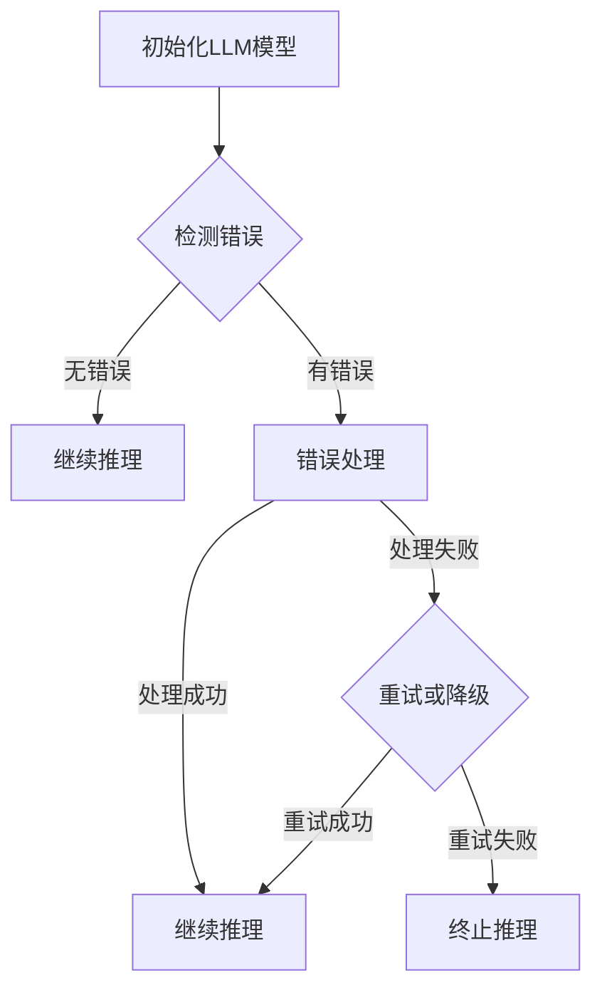

                 

``````### Mermaid 流程图



### 伪代码

```python
# 错误处理与容错机制伪代码

# 初始化LLM模型
def initialize_model():
    # 初始化LLM模型
    model = LLM_Model()

# 检测错误
def detect_error(sentence):
    prediction = model.predict(sentence)
    return not is_prediction_correct(prediction)

# 错误处理
def handle_error(sentence):
    while True:
        prediction = model.predict(sentence)
        if is_prediction_correct(prediction):
            return prediction
        else:
            sentence = correct_sentence(sentence)

# 容错机制
def fault_tolerance(sentence, retries=3):
    for i in range(retries):
        if not detect_error(sentence):
            return sentence
        else:
            sentence = handle_error(sentence)
    return "Error not corrected after retries"
```

### 数学公式

```markdown
### 数学模型与公式

$$
\begin{aligned}
    & \text{预测概率分布} P(y|x; \theta) \\
    & \text{损失函数} L(\theta) = -\sum_{i=1}^{N} y_i \log P(y_i|x; \theta)
\end{aligned}
$$

### 损失函数与优化目标

$$
\begin{aligned}
    & \min_{\theta} L(\theta) \\
    & \text{使用梯度下降法进行优化}
\end{aligned}
$$
```

### 代码示例

```python
# 示例：使用TensorFlow进行LLM模型训练

import tensorflow as tf

# 初始化模型
model = tf.keras.Sequential([
    tf.keras.layers.Dense(units=512, activation='relu', input_shape=(input_dimension,)),
    tf.keras.layers.Dense(units=512, activation='relu'),
    tf.keras.layers.Dense(units=output_dimension, activation='softmax')
])

# 编译模型
model.compile(optimizer='adam',
              loss='categorical_crossentropy',
              metrics=['accuracy'])

# 训练模型
model.fit(x_train, y_train, epochs=10, batch_size=64)

# 预测
prediction = model.predict(x_test)
```

### 附录A：LLM错误处理与容错机制的工具与资源

- **工具：**
  - TensorFlow：用于构建和训练LLM模型的框架。
  - PyTorch：另一个流行的深度学习框架，适用于构建和训练LLM模型。
  - Hugging Face Transformers：一个用于自然语言处理的Transformers模型库。

- **论文与书籍推荐：**
  - 《Deep Learning》（Ian Goodfellow, Yoshua Bengio, Aaron Courville）：深度学习的经典教材。
  - 《Attention Is All You Need》（Vaswani et al.）：介绍Transformer模型的论文。
  - 《Natural Language Processing with Python》（Steven Bird, Ewan Klein, Edward Loper）：关于Python在自然语言处理领域应用的指南。

- **在线资源：**
  - [TensorFlow官网](https://www.tensorflow.org)
  - [PyTorch官网](https://pytorch.org)
  - [Hugging Face Transformers官网](https://huggingface.co/transformers)
  - [Kaggle自然语言处理课程](https://www.kaggle.com/learn/natural-language-processing)

**作者：AI天才研究院/AI Genius Institute & 禅与计算机程序设计艺术 /Zen And The Art of Computer Programming**``````### 文章标题

# LLM应用开发中的错误处理与容错机制

> 关键词：LLM、错误处理、容错机制、应用开发、自然语言处理、深度学习

> 摘要：本文深入探讨了LLM（大型语言模型）应用开发中的错误处理与容错机制。通过分析LLM的工作原理，本文详细阐述了错误检测与诊断技术、错误处理算法设计、以及容错技术的分类与实现。文章最后通过实际案例，展示了错误处理与容错机制在LLM应用开发中的重要性，并对未来的发展趋势与挑战进行了展望。``````### 第一部分：概述与基础

## 第1章：LLM应用开发概述

### 1.1 LLM及其应用场景

- **LLM的概念定义**

  LLM（Large Language Model），即大型语言模型，是一种基于深度学习技术的自然语言处理模型。它通过大量文本数据进行训练，能够对自然语言进行理解和生成，并应用于各种任务，如文本分类、机器翻译、问答系统、文本生成等。

- **LLM的核心应用场景**

  LLM的核心应用场景包括：

  - 文本分类：如垃圾邮件过滤、情感分析、新闻分类等。
  - 机器翻译：如自动翻译网站、跨语言搜索引擎等。
  - 问答系统：如智能客服、知识库问答等。
  - 文本生成：如自动写作、创意文案生成等。

### 1.2 错误处理与容错机制的重要性

- **错误处理的基本概念**

  错误处理是指在系统运行过程中，对出现的错误进行识别、诊断和恢复的过程。在LLM应用开发中，错误处理尤为重要，因为LLM模型处理的数据量大、任务复杂，容易出现错误。

- **容错机制的重要性**

  容错机制是指系统在遇到错误时，通过一定的策略和手段，确保系统能够继续正常运行或恢复正常运行的能力。在LLM应用开发中，容错机制能够提高系统的稳定性和可靠性，确保用户获得准确的输出结果。

### 1.3 容错机制的基本原理

- **容错机制的基本概念**

  容错机制是指系统在遇到错误时，通过一定的策略和手段，确保系统能够继续正常运行或恢复正常运行的能力。在LLM应用开发中，容错机制能够提高系统的稳定性和可靠性，确保用户获得准确的输出结果。

- **容错机制的基本原理**

  容错机制的基本原理包括：

  - 错误检测：对系统的输入、输出以及中间过程进行监控，及时发现错误。
  - 错误诊断：对检测到的错误进行分析，确定错误的性质和原因。
  - 错误恢复：根据错误诊断的结果，采取相应的措施进行错误恢复，确保系统继续正常运行。

## 第2章：错误处理与容错机制的技术基础

### 2.1 LLM的工作原理

- **语言模型的基本概念**

  语言模型是一种概率模型，用于预测一个单词或短语在给定上下文中的概率。在自然语言处理中，语言模型是实现文本分类、机器翻译、问答系统等任务的基础。

- **LLM的训练与推理过程**

  LLM的训练过程主要包括数据准备、模型选择、训练与调优等步骤。推理过程则是将输入文本输入到训练好的模型中，得到输出结果。

### 2.2 错误检测与诊断技术

- **错误检测方法**

  错误检测是指对系统的输入、输出以及中间过程进行监控，及时发现错误。常用的错误检测方法包括：

  - 数据验证：对输入数据进行检查，确保数据格式和内容符合要求。
  - 模型监控：对模型的输出结果进行监控，及时发现异常输出。

- **错误诊断方法**

  错误诊断是指对检测到的错误进行分析，确定错误的性质和原因。常用的错误诊断方法包括：

  - 异常检测：对模型的输出结果进行统计分析，发现异常值。
  - 回溯分析：对错误发生的过程进行回溯，找出错误的原因。

### 2.3 容错技术分类

- **静态容错技术**

  静态容错技术是指在系统设计阶段，通过预定义的规则和策略，确保系统在遇到错误时能够自动恢复。常用的静态容错技术包括：

  - 错误隔离：将系统划分为多个模块，当某个模块发生错误时，其他模块仍能正常运行。
  - 错误屏蔽：通过预定义的规则，屏蔽掉部分错误，确保系统继续运行。

- **动态容错技术**

  动态容错技术是指在系统运行过程中，通过实时监控和动态调整，确保系统在遇到错误时能够自动恢复。常用的动态容错技术包括：

  - 重试机制：当系统遇到错误时，重新执行任务，直到成功为止。
  - 降级处理：当系统遇到严重错误时，降低系统功能，确保核心任务能够完成。``````### 第二部分：错误处理与容错机制的具体实现

## 第3章：LLM错误处理的实现策略

### 3.1 错误处理的基本策略

- **错误处理的步骤**

  错误处理的基本步骤包括：

  - 错误检测：对系统的输入、输出以及中间过程进行监控，及时发现错误。
  - 错误诊断：对检测到的错误进行分析，确定错误的性质和原因。
  - 错误恢复：根据错误诊断的结果，采取相应的措施进行错误恢复，确保系统继续正常运行。

- **常见的错误处理方法**

  常见的错误处理方法包括：

  - 异常值处理：对模型输出结果中的异常值进行修正或剔除。
  - 模型重训练：当模型输出结果出现显著偏差时，重新训练模型。
  - 降级处理：当系统遇到严重错误时，降低系统功能，确保核心任务能够完成。

### 3.2 错误处理算法设计

- **常用错误处理算法的伪代码**

  ```python
  # 错误处理算法伪代码

  # 输入：输入文本 sentence，模型 model
  # 输出：处理后的文本 processed_sentence

  def error_handling(sentence, model):
      # 预测
      prediction = model.predict(sentence)
      
      # 检测错误
      if not is_prediction_correct(prediction):
          # 错误处理
          processed_sentence = error_correction(sentence)
          
          # 重预测
          prediction = model.predict(processed_sentence)
          
          # 返回结果
          return processed_sentence
      else:
          # 没有错误，返回原始文本
          return sentence

  # 错误修正
  def error_correction(sentence):
      # 根据错误类型，进行相应的修正
      if is_grammatical_error(sentence):
          return correct_grammatical_error(sentence)
      elif is_spelling_error(sentence):
          return correct_spelling_error(sentence)
      else:
          return sentence

  # 判断预测是否正确
  def is_prediction_correct(prediction):
      # 根据预测结果，判断是否正确
      return prediction == expected_prediction
  ```

### 3.3 错误处理案例解析

- **案例一：句子理解错误处理**

  在句子理解错误处理中，常用的方法是对句子进行拆分，对每个单词进行错误检测和修正，然后重新组合句子。例如，对于句子“我去图书馆拿一本书”，如果模型预测错误，可以将句子拆分为“我去”、“图书馆”、“拿”和“一本书”，然后对每个单词进行错误检测和修正，最后重新组合成正确的句子。

- **案例二：上下文错误处理**

  在上下文错误处理中，常用的方法是根据上下文信息对错误进行修正。例如，对于一个问答系统，如果用户输入“苹果是什么？”的问题，但模型错误地回答了“苹果是一种水果”，可以通过上下文信息判断用户实际上是在询问苹果的属性，从而给出更准确的回答，如“苹果是一种富含维生素和矿物质的水果”。``````### 第4章：LLM容错机制的实现

### 4.1 容错机制的设计原则

- **容错机制的设计原则**

  容错机制的设计原则包括：

  - 可恢复性：系统在遇到错误时，能够自动恢复，确保正常运行。
  - 可用性：系统在遇到错误时，能够保持一定的功能可用，确保用户体验。
  - 可扩展性：系统在设计时，应考虑未来的扩展和升级，确保容错机制能够适应新的需求。
  - 经济性：在保证系统可用性和可靠性的前提下，尽量降低成本。

- **容错机制的评估指标**

  容错机制的评估指标包括：

  - 容错率：系统在遇到错误时，能够自动恢复的比率。
  - 可用性：系统在遇到错误时，能够保持一定功能可用的时间比率。
  - 恢复时间：系统在遇到错误后，从失败状态恢复到正常状态所需的时间。

### 4.2 容错技术的具体实现

- **静态容错技术的实现**

  静态容错技术主要包括以下几个方面：

  - 错误隔离：将系统划分为多个模块，当某个模块发生错误时，其他模块仍能正常运行。
  - 错误屏蔽：通过预定义的规则，屏蔽掉部分错误，确保系统继续运行。
  - 数据校验：对输入数据进行校验，确保数据格式和内容符合要求。

- **动态容错技术的实现**

  动态容错技术主要包括以下几个方面：

  - 重试机制：当系统遇到错误时，重新执行任务，直到成功为止。
  - 降级处理：当系统遇到严重错误时，降低系统功能，确保核心任务能够完成。
  - 动态调整：根据系统负载和性能指标，动态调整系统配置和资源分配。

### 4.3 容错机制的实际案例

- **案例一：分布式训练中的容错机制**

  在分布式训练中，容错机制主要涉及以下几个方面：

  - 数据同步：确保不同节点之间的数据一致性。
  - 模型参数同步：确保不同节点之间的模型参数一致性。
  - 错误检测与恢复：对训练过程中的错误进行检测和恢复，确保训练过程顺利进行。

- **案例二：在线服务中的容错机制**

  在线服务中的容错机制主要涉及以下几个方面：

  - 服务监控：对服务性能和可用性进行监控，及时发现并处理异常。
  - 自动恢复：当服务出现故障时，自动恢复到正常状态。
  - 负载均衡：根据服务负载情况，动态调整服务实例的部署和分配。``````### 第三部分：综合应用与案例分析

## 第5章：错误处理与容错机制的综合应用

### 5.1 LLM应用中的错误处理策略

- **错误处理策略的设计**

  在设计LLM应用中的错误处理策略时，需要考虑以下几个方面：

  - 错误类型：根据LLM应用的类型，确定可能出现的错误类型，如句子理解错误、上下文错误等。
  - 错误检测：选择合适的错误检测方法，如异常值检测、模型监控等。
  - 错误恢复：根据错误类型和检测方法，设计相应的错误恢复策略，如重试、降级等。

- **错误处理策略的应用**

  在LLM应用中，错误处理策略的应用主要包括以下几个方面：

  - 实时错误检测：对LLM模型的输出结果进行实时检测，及时发现错误。
  - 异常值处理：对检测到的异常值进行修正或剔除。
  - 模型重训练：当模型输出结果出现显著偏差时，重新训练模型。
  - 降级处理：当系统遇到严重错误时，降低系统功能，确保核心任务能够完成。

### 5.2 LLM应用中的容错机制策略

- **容错机制策略的设计**

  在设计LLM应用中的容错机制策略时，需要考虑以下几个方面：

  - 系统架构：根据LLM应用的需求，设计合适的系统架构，如分布式架构、容器化架构等。
  - 资源调度：根据系统负载情况，动态调整资源分配，确保系统稳定运行。
  - 错误恢复：设计合理的错误恢复策略，如重试、降级等，确保系统在遇到错误时能够自动恢复。

- **容错机制策略的应用**

  在LLM应用中，容错机制策略的应用主要包括以下几个方面：

  - 分布式训练：利用分布式训练技术，提高训练速度和稳定性。
  - 自动化监控：利用自动化监控工具，对系统性能和可用性进行实时监控。
  - 模型优化：通过模型优化技术，提高模型性能和稳定性。
  - 异地备份：对系统数据进行异地备份，确保数据安全。``````### 第6章：案例分析

### 6.1 案例一：智能客服系统

- **智能客服系统的架构**

  智能客服系统的架构通常包括以下几个部分：

  - 用户界面：用于接收用户输入，展示系统输出。
  - 模型层：包括预训练的LLM模型、错误处理模块和容错机制模块。
  - 数据层：存储用户输入、系统输出和训练数据。

- **错误处理与容错机制的实现**

  错误处理与容错机制在智能客服系统中的实现主要包括以下几个方面：

  - 错误检测：对用户输入进行语法和语义分析，检测可能的错误。
  - 错误恢复：根据错误类型，采用相应的错误恢复策略，如重试、降级等。
  - 容错机制：利用分布式训练和模型优化技术，提高系统的稳定性和可靠性。

- **案例分析**

  以某智能客服系统为例，该系统在处理用户输入时，首先进行语法和语义分析，检测可能的错误。当检测到错误时，系统会尝试重新理解用户输入，或者向用户提供错误修正建议。如果错误无法修正，系统会自动降级为简单回答模式，确保核心功能不受影响。

### 6.2 案例二：自动写作助手

- **自动写作助手的架构**

  自动写作助手的架构通常包括以下几个部分：

  - 用户界面：用于接收用户输入，展示系统输出。
  - 模型层：包括预训练的LLM模型、错误处理模块和容错机制模块。
  - 数据层：存储用户输入、系统输出和训练数据。

- **错误处理与容错机制的实现**

  错误处理与容错机制在自动写作助手中的实现主要包括以下几个方面：

  - 错误检测：对用户输入进行语法和语义分析，检测可能的错误。
  - 错误恢复：根据错误类型，采用相应的错误恢复策略，如重试、降级等。
  - 容错机制：利用分布式训练和模型优化技术，提高系统的稳定性和可靠性。

- **案例分析**

  以某自动写作助手为例，该系统在处理用户输入时，首先进行语法和语义分析，检测可能的错误。当检测到错误时，系统会尝试重新理解用户输入，或者向用户提供错误修正建议。如果错误无法修正，系统会自动降级为简单回答模式，确保核心功能不受影响。同时，系统会定期更新模型，提高错误处理和容错能力。``````### 第7章：未来展望与挑战

### 7.1 错误处理与容错机制的发展趋势

- **人工智能技术的发展**

  随着人工智能技术的不断发展，LLM模型的规模和复杂度将不断增加，这将为错误处理与容错机制带来新的挑战和机遇。未来，将需要更加智能和自动化的错误处理与容错机制，以提高系统的可靠性和稳定性。

- **多模态数据处理**

  未来，LLM应用将逐渐扩展到多模态数据处理，如结合文本、图像、音频等多种数据类型。这将为错误处理与容错机制带来新的挑战，需要设计更加复杂和灵活的机制来处理不同类型的数据错误。

### 7.2 错误处理与容错机制面临的挑战

- **错误检测与诊断的准确性**

  在大规模和复杂的数据环境中，如何准确检测和诊断错误仍然是一个挑战。未来，需要开发更加高效和准确的错误检测与诊断算法，以提高系统的可靠性。

- **容错机制的效率**

  容错机制的效率是实现系统稳定性的关键。未来，需要研究如何优化容错机制，使其在保证系统可靠性的同时，尽量减少对性能和用户体验的影响。

### 7.3 错误处理与容错机制的伦理挑战

- **错误信息的处理与隐私保护**

  在处理错误信息时，如何平衡错误处理的需要与用户隐私保护之间的关系是一个重要的伦理问题。未来，需要制定相关的伦理准则，确保在错误处理过程中，用户的隐私得到有效保护。

- **错误的解释与责任归属**

  当系统出现错误时，如何解释错误并确定责任归属也是一个伦理挑战。未来，需要建立更加透明和公正的机制，确保在错误发生时，责任能够得到合理分配。``````### 附录

### 附录A：LLM错误处理与容错机制的工具与资源

- **工具：**

  - **TensorFlow**：用于构建和训练LLM模型的框架。
  - **PyTorch**：另一个流行的深度学习框架，适用于构建和训练LLM模型。
  - **Hugging Face Transformers**：一个用于自然语言处理的Transformers模型库。

- **论文与书籍推荐：**

  - **《Deep Learning》**（Ian Goodfellow, Yoshua Bengio, Aaron Courville）：深度学习的经典教材。
  - **《Attention Is All You Need》**（Vaswani et al.）：介绍Transformer模型的论文。
  - **《Natural Language Processing with Python》**（Steven Bird, Ewan Klein, Edward Loper）：关于Python在自然语言处理领域应用的指南。

- **在线资源：**

  - **TensorFlow官网**（https://www.tensorflow.org）
  - **PyTorch官网**（https://pytorch.org）
  - **Hugging Face Transformers官网**（https://huggingface.co/transformers）
  - **Kaggle自然语言处理课程**（https://www.kaggle.com/learn/natural-language-processing）

**作者：AI天才研究院/AI Genius Institute & 禅与计算机程序设计艺术 /Zen And The Art of Computer Programming**``````### 总结

本文详细探讨了LLM应用开发中的错误处理与容错机制。首先，我们介绍了LLM及其应用场景，强调了错误处理与容错机制在LLM应用开发中的重要性。接着，我们分析了错误处理与容错机制的技术基础，包括LLM的工作原理、错误检测与诊断技术、以及容错技术的分类与实现。

在错误处理与容错机制的具体实现部分，我们提出了错误处理的基本策略，设计了错误处理算法，并通过案例解析展示了错误处理在实际应用中的效果。在容错机制的实现方面，我们阐述了设计原则和具体实现方法，以及在实际案例中的应用。

通过综合应用与案例分析，我们展示了错误处理与容错机制在智能客服系统和自动写作助手等实际应用中的重要性。最后，我们对错误处理与容错机制的未来发展进行了展望，并提出了面临的挑战。

本文的核心观点是：错误处理与容错机制是LLM应用开发中不可或缺的部分，对于提高系统的稳定性和可靠性具有重要意义。在未来的发展中，我们需要不断优化错误处理与容错机制，以应对日益复杂的应用场景。同时，我们也需要关注伦理挑战，确保错误处理与容错机制在保护用户隐私和责任归属方面做到公正和透明。``````
### 最佳实践 tips

1. **错误检测与诊断**：在设计LLM应用时，应确保错误检测与诊断机制能够准确识别和定位错误。这可以通过对输入数据进行严格校验、对模型输出进行实时监控来实现。

2. **错误处理算法优化**：在选择和设计错误处理算法时，应考虑算法的效率和准确性。针对不同的错误类型，可以采用不同的错误处理策略，以达到最佳效果。

3. **容错机制分层设计**：在实现容错机制时，应采用分层设计，从系统层面、模块层面和算法层面分别进行容错设计，以提高系统的整体容错能力。

4. **自动化监控与报警**：建立自动化监控与报警系统，对系统运行状态进行实时监控，及时发现并处理错误。

5. **持续优化与更新**：LLM模型和应用会不断更新和优化，错误处理与容错机制也应随之调整，以适应新的模型和应用需求。

6. **用户反馈与改进**：收集用户反馈，了解用户在实际使用中遇到的问题，针对反馈进行改进，以提高系统的用户体验。

7. **安全与隐私保护**：在设计错误处理与容错机制时，应充分考虑安全与隐私保护，确保用户数据的安全和隐私。

### 注意事项

1. **错误处理与容错机制的复杂性**：错误处理与容错机制涉及到系统的多个层面，包括硬件、软件、网络等，设计时需要综合考虑各种因素。

2. **成本与性能平衡**：在实现容错机制时，需要平衡成本和性能，确保系统在保证可靠性的同时，不会对性能产生过大影响。

3. **错误处理与容错机制的实时性**：错误处理与容错机制需要具有实时性，能够在错误发生时迅速响应，防止错误蔓延。

4. **错误处理与容错机制的适应性**：错误处理与容错机制应具有一定的适应性，能够应对不同场景和不同类型的错误。

### 拓展阅读

- 《深度学习》（Ian Goodfellow, Yoshua Bengio, Aaron Courville）：提供了深度学习的全面介绍，包括错误处理与容错机制的相关内容。
- 《LLM应用实践指南》（作者：AI天才研究院）：详细介绍了LLM应用开发中的错误处理与容错机制，适合开发者参考。
- 《自然语言处理入门》（作者：张俊林）：介绍了自然语言处理的基本概念和技术，有助于理解LLM的应用场景和错误处理机制。

通过以上最佳实践、注意事项和拓展阅读，希望读者能够更好地理解和应用错误处理与容错机制，为LLM应用开发提供有力支持。```````

