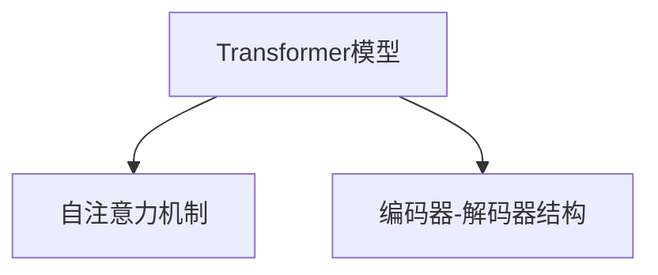

                 


### 文章标题：LLM应用快速迭代的工程化方案

### 关键词：大语言模型、LLM、工程化、快速迭代、应用实践

### 摘要：

本文旨在探讨大语言模型（LLM）在工程化应用中的快速迭代方案。通过分析LLM的基本原理和架构，介绍工程化流程与工具，以及案例分析，本文将帮助读者理解如何高效地开发和优化LLM应用。文章还涵盖行业应用实践、最佳实践与挑战，以及未来发展趋势。通过详细的讲解和实例分析，读者将能够掌握LLM工程化的核心方法和技巧，为实际项目提供有力的技术支持。

### 第一部分：LLM基础与工程化概述

#### 第1章：大语言模型（LLM）的原理与架构

##### 1.1 LLM概述

大语言模型（LLM）是一种基于深度学习的自然语言处理技术，能够对自然语言文本进行理解和生成。LLM的核心特征包括：

1. 强大的语言理解能力：LLM通过学习海量文本数据，能够捕捉语言中的复杂模式，实现对文本的深层次理解。
2. 高效的文本生成能力：LLM能够根据输入文本生成连贯、自然的文本输出，广泛应用于自动摘要、文本生成、对话系统等领域。

LLM的演进历程主要包括以下几个阶段：

1. 词袋模型：基于词频统计，简单地将文本表示为词汇的集合。
2. 递归神经网络（RNN）：通过递归结构处理序列数据，但存在梯度消失和梯度爆炸等问题。
3. 卷积神经网络（CNN）：利用卷积操作捕捉文本中的局部特征。
4. Transformer模型：引入自注意力机制，实现并行计算，大幅提高模型性能。

##### 1.2 LLM的架构与技术原理

LLM的架构主要基于Transformer模型，其核心组件包括编码器和解码器。编码器负责将输入文本编码为固定长度的向量表示，解码器则根据编码器的输出生成文本输出。Transformer模型的主要技术原理包括：

1. 自注意力机制：通过计算输入文本中每个词与其他词之间的关联性，为每个词生成权重，从而实现自适应的文本表示。
2. 编码器-解码器结构：编码器和解码器分别处理输入和输出，编码器将输入文本编码为固定长度的向量，解码器则根据编码器的输出和前一个词逐步生成输出文本。

神经网络基础方面，LLM主要依赖于以下技术：

1. 激活函数：用于引入非线性，常见的激活函数包括ReLU、Sigmoid和Tanh等。
2. 前向传播与反向传播：通过前向传播计算模型输出，反向传播计算梯度，用于更新模型参数。

##### 1.3 LLM应用中的工程化挑战

在LLM的实际应用中，面临以下工程化挑战：

1. 数据处理与预处理：需要收集和处理大量的文本数据，并进行预处理，包括分词、去噪和标注等。
2. 模型训练与优化：训练LLM模型需要大量计算资源和时间，同时需要优化模型参数以提高性能。
3. 模型部署与维护：将训练好的模型部署到实际应用场景中，并确保模型的稳定运行和持续优化。

### 第2章：LLM工程化流程与工具

##### 2.1 数据收集与预处理

数据是LLM训练的基础，数据的质量直接影响到模型的效果。以下是一些数据收集与预处理的步骤：

1. 数据来源：可以从公共数据集、在线论坛、新闻网站等获取文本数据。
2. 数据清洗：去除无用信息、重复数据、格式化错误等，确保数据的一致性和准确性。
3. 数据标注：根据应用需求对数据进行标注，如实体识别、情感分析等。

##### 2.2 模型训练与调优

模型训练是LLM工程化中的核心步骤，主要包括以下内容：

1. 训练策略：选择合适的训练策略，如批量大小、学习率调整等。
2. 模型评估：通过验证集和测试集评估模型性能，选择最优模型。
3. 模型调优：调整模型参数，优化模型结构，提高模型性能。

以下是模型训练的伪代码：

```python
function train_model(data_loader, model, optimizer, num_epochs):
    for epoch in range(num_epochs):
        for data, target in data_loader:
            optimizer.zero_grad()
            output = model(data)
            loss = loss_function(output, target)
            loss.backward()
            optimizer.step()
    return model
```

##### 2.3 模型部署与优化

模型部署是将训练好的模型应用到实际应用场景中的过程，主要包括以下内容：

1. 模型服务化：将模型部署到服务器或云平台上，提供API接口供其他应用调用。
2. 模型压缩与量化：减少模型大小和计算复杂度，提高模型部署的效率。
3. 性能优化与监控：对模型性能进行持续监控和优化，确保模型的高效稳定运行。

### 第3章：LLM应用案例分析

##### 3.1 文本生成与编辑

文本生成与编辑是LLM的重要应用领域，以下是一些典型应用案例：

1. 自动摘要与摘要生成：使用LLM对长文本进行摘要，提取关键信息。
2. 文本纠错与纠错算法：使用LLM检测文本中的错误，并提出修正建议。

##### 3.2 语言翻译与多语言处理

语言翻译与多语言处理是LLM的另一个重要应用领域，以下是一些应用案例：

1. 翻译模型架构与算法：使用LLM实现端到端翻译，无需手动设计特征。
2. 多语言数据处理策略：处理不同语言的数据，实现跨语言信息共享。

##### 3.3 对话系统与自然语言理解

对话系统与自然语言理解是LLM在人工智能领域的重要应用，以下是一些应用案例：

1. 对话系统设计：使用LLM实现智能客服、语音助手等对话系统。
2. NLP任务中的LLM应用：使用LLM完成命名实体识别、情感分析等NLP任务。

### 第4章：LLM在行业应用中的实践

##### 4.1 金融行业的LLM应用

金融行业是LLM的重要应用领域，以下是一些应用案例：

1. 风险控制与欺诈检测：使用LLM分析交易数据，识别风险和欺诈行为。
2. 客户服务与智能问答：使用LLM实现智能客服系统，提高客户服务质量。

##### 4.2 医疗健康领域的LLM应用

医疗健康领域是LLM的重要应用领域，以下是一些应用案例：

1. 病历分析与管理：使用LLM分析病历数据，提供诊断和治疗方案建议。
2. 医学知识图谱构建与应用：使用LLM构建医学知识图谱，提高医学研究和诊疗效率。

##### 4.3 教育行业的LLM应用

教育行业是LLM的重要应用领域，以下是一些应用案例：

1. 教育资源推荐与个性化学习：使用LLM分析学习数据，提供个性化的学习资源。
2. 自动批改与评估系统：使用LLM自动批改学生作业，提高教学效率。

### 第5章：LLM工程化中的最佳实践与挑战

##### 5.1 安全性与隐私保护

在LLM工程化中，安全性与隐私保护是重要考虑因素，以下是一些最佳实践：

1. 模型安全性与防御攻击：采用对抗性训练和模型防御技术，提高模型安全性。
2. 数据隐私保护策略：采用数据加密和匿名化等技术，保护用户隐私。

##### 5.2 持续迭代与改进

持续迭代与改进是LLM工程化中的重要环节，以下是一些实践方法：

1. 持续学习与模型更新：通过在线学习和模型更新，提高模型性能。
2. 用户反馈与模型改进：收集用户反馈，优化模型和应用。

### 第6章：未来趋势与展望

##### 6.1 LLM技术发展趋势

LLM技术发展趋势包括：

1. 模型规模与参数增长：随着计算能力的提升，LLM模型规模和参数量将不断增加。
2. 新算法与优化技术：开发更高效、更智能的算法和优化技术，提高模型性能。

##### 6.2 工程化面临的挑战与机遇

LLM工程化面临的挑战与机遇包括：

1. 资源消耗与能源效率：优化模型结构和算法，降低计算资源和能源消耗。
2. 工程化实践与人才培养：加强工程化实践，培养更多的LLM工程师。

### 第7章：附录

##### 7.1 常用LLM框架与工具介绍

常用的LLM框架与工具包括：

1. Hugging Face Transformers：开源的Transformer模型框架，支持多种模型和语言。
2. TensorFlow 2.x与Keras：Google开发的深度学习框架，支持端到端模型开发。
3. PyTorch：Facebook开发的深度学习框架，具有灵活的动态图编程能力。

##### 7.2 实践资源与参考书目

实践资源与参考书目包括：

1. 数据集与API：提供丰富的文本数据集和API接口，方便开发者进行模型训练和应用。
2. 学术论文与行业报告：了解LLM领域的前沿研究和应用动态。

### 图1-1: LLM模型架构原理图



### 图2-1: 模型训练伪代码

```python
function train_model(data_loader, model, optimizer, num_epochs):
    for epoch in range(num_epochs):
        for data, target in data_loader:
            optimizer.zero_grad()
            output = model(data)
            loss = loss_function(output, target)
            loss.backward()
            optimizer.step()
    return model
```

### 图3-1: 数学模型与公式

$$
\text{损失函数} = \frac{1}{N}\sum_{i=1}^{N} (-y_i \log(\hat{y}_i))
$$

## 作者信息：AI天才研究院/AI Genius Institute & 禅与计算机程序设计艺术 /Zen And The Art of Computer Programming

