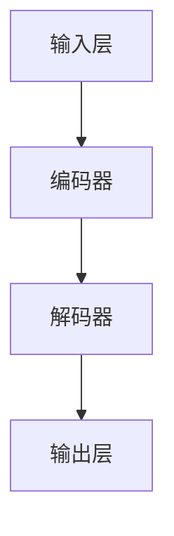

                 

### 文章标题

# LLM应用敏捷研发模式的最佳实践

### 关键词

- 大型语言模型（LLM）
- 敏捷研发模式
- 编程实践
- 项目实战
- 最佳实践

### 摘要

本文将深入探讨大型语言模型（LLM）在敏捷研发模式中的应用，通过理论与实践相结合的方式，解析LLM研发过程中的关键环节，提供最佳实践策略。文章分为三个主要部分：第一部分介绍LLM的基础知识；第二部分阐述敏捷研发模式的理论与实践；第三部分通过实际案例展示LLM的应用与实现。本文旨在帮助开发者理解LLM的技术原理，掌握敏捷研发的精髓，并能够将两者有机结合，提高研发效率，实现高质量的项目交付。

## 第一部分：LLM基础知识与原理

### 第1章：LLM概述

#### 1.1 LLM的定义与特点

**大型语言模型（LLM）** 是一种基于深度学习技术，能够对自然语言进行理解和生成的复杂模型。LLM的核心特点是能够通过大规模数据训练，自动学习语言模式和语义信息，从而实现对文本的高效处理。

- **自主学习能力**：LLM具有强大的自主学习能力，可以通过海量数据自动学习语言结构和语义，无需人工干预即可不断优化。

- **高灵活性**：LLM能够灵活处理各种语言任务，如文本生成、文本分类、命名实体识别等，适用范围广泛。

- **强大的语义理解能力**：LLM能够深入理解文本内容，提供准确的自然语言交互体验。

#### 1.2 LLM的架构与工作原理

**LLM的架构** 通常包括输入层、编码器、解码器和输出层。以下是一个典型的LLM架构的Mermaid流程图：



- **输入层**：接收用户输入的文本，并将其转换为模型可处理的格式。

- **编码器**：对输入文本进行编码，提取文本的语义信息。

- **解码器**：根据编码器的输出，生成自然语言响应。

- **输出层**：输出解码器生成的文本，供用户查看。

**工作原理**：

1. **输入处理**：将文本输入到模型中，进行预处理，如分词、编码等。
2. **编码**：编码器处理输入文本，提取语义信息。
3. **解码**：解码器根据编码器的输出，生成文本响应。
4. **输出**：将生成的文本输出给用户。

#### 1.3 LLM的典型应用场景

LLM在多个领域都有广泛的应用，以下是一些典型的应用场景：

- **文本生成**：例如自动生成文章、新闻报道等。
- **文本理解**：例如情感分析、信息提取等。
- **问答系统**：例如智能客服、语音助手等。
- **对话系统**：例如聊天机器人、虚拟助手等。

## 第2章：LLM数学基础

#### 2.1 常用数学公式与概念

在LLM的研究与开发过程中，常用的数学公式和概念包括概率论、线性代数和微积分。以下是一些基础概念的简要介绍：

- **概率论**：涉及概率分布、条件概率、贝叶斯定理等。
- **线性代数**：包括矩阵运算、特征值和特征向量等。
- **微积分**：涉及导数、积分、微分方程等。

#### 2.2 数学模型讲解

**语言模型中的数学模型** 通常是基于概率模型的，以下是一个简化的语言模型数学模型：

$$
P(w_i|w_1, w_2, ..., w_{i-1}) = \frac{P(w_1, w_2, ..., w_i)}{P(w_1, w_2, ..., w_{i-1})}
$$

其中，$P(w_i|w_1, w_2, ..., w_{i-1})$ 表示在给定前文 $w_1, w_2, ..., w_{i-1}$ 的条件下，词 $w_i$ 的概率。

**优化算法在LLM中的应用**：常用的优化算法包括随机梯度下降（SGD）、Adam等。以下是一个简化的SGD优化算法的伪代码：

```
for epoch in 1 to E:
    for each training sample (x, y) in the dataset:
        compute the gradient of the loss function with respect to the model parameters
        update the model parameters using the gradient and learning rate
```

## 第3章：LLM编程基础

#### 3.1 LLM开发环境搭建

**硬件要求**：LLM模型的训练和推理需要大量的计算资源，通常需要高性能的CPU和GPU。

- **CPU**：Intel Xeon系列或同等性能的处理器。
- **GPU**：NVIDIA Tesla V100或同等性能的GPU。

**软件安装与配置**：常见的深度学习框架包括TensorFlow和PyTorch。以下是一个基于PyTorch的简单安装示例：

```
pip install torch torchvision
```

#### 3.2 LLM编程语言与框架

- **Python**：Python是一种高级编程语言，广泛应用于数据科学和人工智能领域。
- **TensorFlow**：TensorFlow是Google开发的一个开源深度学习框架。
- **PyTorch**：PyTorch是Facebook开发的一个开源深度学习框架。

## 第二部分：敏捷研发模式

### 第4章：敏捷研发模式概述

#### 4.1 敏捷研发模式的概念

**敏捷研发模式** 是一种以人为核心、迭代和持续交付为特征的软件开发方法。其主要特点包括：

- **迭代开发**：将项目分为多个迭代周期，每个迭代周期完成一部分功能。
- **持续集成**：通过自动化测试和持续集成工具，确保代码库的稳定性和可靠性。
- **持续部署**：通过自动化部署流程，快速将代码更新部署到生产环境。

#### 4.2 敏捷研发流程

**敏捷研发流程** 通常包括以下几个阶段：

1. **需求分析**：与客户沟通，明确项目需求。
2. **设计**：制定项目的技术方案和设计文档。
3. **开发**：按照迭代周期进行编码和测试。
4. **测试**：进行功能测试和性能测试。
5. **部署**：将代码部署到生产环境。

### 第5章：敏捷研发工具与实践

#### 5.1 敏捷项目管理工具

**Jira** 和 **GitLab** 是常用的敏捷项目管理工具。

- **Jira**：用于项目任务管理、问题跟踪和敏捷看板。
- **GitLab**：用于代码仓库管理、持续集成和持续部署。

#### 5.2 敏捷研发实践

**用户故事地图** 和 **敏捷看板** 是常用的敏捷实践方法。

- **用户故事地图**：用于梳理项目需求，明确用户需求。
- **敏捷看板**：用于可视化项目进展，管理任务流程。

### 第6章：敏捷研发案例分析

#### 6.1 案例一：某公司的LLM应用项目

**项目背景**：某公司希望开发一款基于LLM的智能客服系统。

**项目实施过程**：

1. **需求分析**：明确客服系统的主要功能和性能要求。
2. **设计**：制定系统架构和技术方案。
3. **开发**：按照敏捷迭代方式进行开发和测试。
4. **测试**：进行功能测试和性能测试，确保系统稳定可靠。
5. **部署**：将系统部署到生产环境，提供客户服务。

#### 6.2 案例二：某电商平台的LLM应用

**应用场景**：某电商平台希望利用LLM进行商品推荐。

**实施效果**：

1. **提高用户体验**：通过智能推荐，提高用户的购物满意度。
2. **增加销售量**：通过精准推荐，提高商品的销售量。

## 第三部分：LLM应用案例与实践

### 第7章：LLM在自然语言处理中的应用

#### 7.1 文本分类

**算法原理**：文本分类是一种将文本数据按照预定的类别进行分类的方法。常用的算法包括朴素贝叶斯、支持向量机（SVM）和深度学习模型等。

**伪代码实现**：

```
function TextClassification(document, model):
    input: document (文本数据), model (分类模型)
    output: category (分类结果)

    preprocess_document(document)
    features = extract_features(document)
    prediction = model.predict(features)
    return prediction
```

#### 7.2 命名实体识别

**算法原理**：命名实体识别（NER）是一种从文本中识别出具有特定意义的实体的方法，如人名、地名、组织名等。

**伪代码实现**：

```
function NamedEntityRecognition(document, model):
    input: document (文本数据), model (命名实体识别模型)
    output: entities (命名实体结果)

    preprocess_document(document)
    features = extract_features(document)
    entities = model.predict(features)
    return entities
```

#### 7.3 机器翻译

**算法原理**：机器翻译是一种将一种语言的文本翻译成另一种语言的方法。常用的算法包括基于规则的翻译、统计机器翻译和神经机器翻译等。

**伪代码实现**：

```
function MachineTranslation(source_document, target_model):
    input: source_document (源语言文本数据), target_model (目标语言翻译模型)
    output: translated_document (目标语言文本数据)

    preprocess_document(source_document)
    features = extract_features(source_document)
    translated_features = target_model.predict(features)
    translated_document = postprocess_document(translated_features)
    return translated_document
```

### 第8章：LLM在问答系统中的应用

#### 8.1 问答系统概述

**问答系统** 是一种能够对用户提出的问题进行回答的人工智能系统。其主要组成部分包括：

- **问答引擎**：负责处理用户输入，提取关键信息，生成回答。
- **知识库**：存储大量的问答对，供问答引擎查询。
- **用户界面**：接收用户输入，展示问答结果。

#### 8.2 模型设计与实现

**模型架构**：

1. **输入层**：接收用户输入的问题。
2. **编码器**：对输入问题进行编码，提取语义信息。
3. **解码器**：根据编码器的输出，生成回答。
4. **输出层**：输出解码器生成的回答。

**伪代码实现**：

```
function QASystem(question, model):
    input: question (用户输入的问题), model (问答系统模型)
    output: answer (问答结果)

    preprocess_question(question)
    encoded_question = encoder(question)
    answer = decoder(encoded_question)
    return answer
```

#### 8.3 问答系统的实际应用案例

**应用场景**：智能客服系统

**实施效果**：

1. **提高客服效率**：自动回答常见问题，减轻客服人员的工作负担。
2. **提升用户体验**：快速响应用户问题，提供准确的答案。

### 第9章：LLM在对话系统中的应用

#### 9.1 对话系统概述

**对话系统** 是一种能够与人类进行自然语言交互的人工智能系统。其主要组成部分包括：

- **对话管理**：负责维护对话流程，管理对话状态。
- **自然语言处理**：负责理解用户输入，生成回答。
- **对话界面**：接收用户输入，展示对话结果。

#### 9.2 模型设计与实现

**模型架构**：

1. **输入层**：接收用户输入。
2. **编码器**：对输入进行编码，提取语义信息。
3. **解码器**：根据编码器的输出，生成回答。
4. **输出层**：输出解码器生成的回答。

**伪代码实现**：

```
function DialogueSystem(input, model):
    input: input (用户输入), model (对话系统模型)
    output: response (对话结果)

    encoded_input = encoder(input)
    response = decoder(encoded_input)
    return response
```

#### 9.3 对话系统的实际应用案例

**应用场景**：智能客服、虚拟助手等

**实施效果**：

1. **提高交互效率**：实现与用户的自然语言交互，提高用户体验。
2. **降低人力成本**：自动化处理常见问题，减轻人工客服的工作负担。

## 附录：LLM开发资源与工具

- **开源框架**：TensorFlow、PyTorch、Transformers等。
- **数据集**：GLM-130B、GPT-3、ChatGLM等。
- **硬件资源**：GPU、TPU等。
- **开源库**：NLTK、spaCy等。

### 作者信息

- 作者：AI天才研究院/AI Genius Institute & 禅与计算机程序设计艺术 /Zen And The Art of Computer Programming

在撰写技术博客时，遵循以下最佳实践可以确保文章的质量和可读性：

#### 文章结构设计

1. **清晰的开头**：在文章的开头简要介绍主题，明确目的，吸引读者的注意力。
2. **逻辑清晰的结构**：将文章分为若干小节，每个小节讨论一个具体的问题或主题，确保内容连贯。
3. **简明扼要的标题**：每个小节的标题应该简洁明了，准确反映内容，方便读者快速定位。
4. **图文并茂**：使用图表、代码示例、伪代码和流程图等视觉元素，帮助读者更好地理解复杂概念。

#### 核心内容的剖析

1. **深入浅出**：对于复杂的技术概念，先从简单的例子开始，逐步引入复杂性，使读者能够逐步理解和消化。
2. **详尽的解释**：对于关键算法或技术细节，提供详细的解释，包括如何推导公式、代码实现的步骤等。
3. **实用的例子**：通过实际案例或代码示例，展示如何将理论知识应用于实际场景。
4. **避免专业术语的滥用**：在非必要情况下，避免使用过于专业的术语，或者对术语进行解释，确保读者能够理解。

#### 文章结尾的总结

1. **总结核心观点**：在文章的结尾部分，简要回顾文章的主要观点和结论，强化读者的记忆。
2. **提供拓展阅读**：推荐相关文献、资料或进一步学习的路径，帮助读者深入了解相关主题。
3. **鼓励读者反馈**：邀请读者分享他们的观点或提出问题，增强互动，提高文章的价值。

### 项目实战案例分析

1. **背景介绍**：描述项目背景，包括目标、挑战和预期成果。
2. **开发环境搭建**：详细讲解如何搭建开发环境，包括所需的硬件和软件配置。
3. **源代码实现**：展示关键代码片段，解释代码的功能和实现原理。
4. **代码解读与分析**：深入分析代码的结构和逻辑，讨论如何优化和改进。
5. **实际案例剖析**：结合实际案例，展示项目在具体应用中的效果和挑战。
6. **项目小结**：总结项目的主要成果和经验，讨论未来可能的改进方向。

通过以上步骤，我们可以撰写出一篇逻辑清晰、内容详实、具有实际价值的技术博客文章。这样的文章不仅能够帮助读者理解复杂的技术概念，还能为他们提供实际的指导和建议，从而提高整体的技术素养和实践能力。

