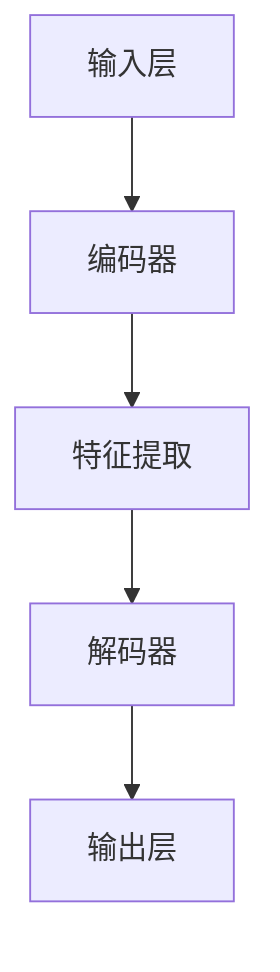

                 

### 文章标题

# LLM应用的MVP策略：快速验证产品价值

---

**关键词：** 语言模型（LLM），最小可行产品（MVP），产品验证，快速迭代，用户反馈

---

**摘要：** 本文将探讨如何利用最小可行产品（MVP）策略来开发和验证基于大型语言模型（LLM）的应用。通过分析LLM的基本原理、MVP策略的核心要素，以及结合实际案例，文章旨在为读者提供一套系统化的方法和实战技巧，以高效地构建和验证LLM应用的价值。

---

### 引言

在人工智能和自然语言处理领域，大型语言模型（LLM）已经取得了显著的进步，为文本生成、问答系统、语言翻译等应用带来了巨大的变革。然而，将LLM应用于实际产品开发中，往往面临着复杂的技术挑战和市场需求的不确定性。这就需要我们采取一种既节省资源又能快速验证产品价值的方法——最小可行产品（MVP）策略。

MVP策略的核心在于以最小的成本和最短的时间开发出一个功能有限但具有核心价值的产品原型，并通过用户反馈不断迭代优化。这种方法不仅可以降低风险，还能快速验证产品的市场潜力，提高开发效率和成功率。

本文将首先介绍LLM的基本原理和应用场景，然后深入探讨MVP策略的核心要素，并结合具体案例，详细阐述如何使用MVP策略来快速验证LLM应用的产品价值。

---

### 第一部分：LLM基础

#### 第1章：LLM概述

#### 1.1 LLM的定义

语言模型（Language Model，简称LM）是一种基于统计或神经网络的算法，用于预测自然语言中的下一个单词或句子。大型语言模型（Large Language Model，简称LLM）则是对传统语言模型的扩展，它使用数百万甚至数十亿个参数，可以处理复杂的语言结构和上下文关系。

#### 1.2 LLM的历史

LLM的发展经历了从基于规则的方法到统计方法，再到基于深度学习的转变。早期的语言模型如n-gram模型，通过计算单词序列的概率来预测下一个单词。随着计算能力的提升和神经网络技术的发展，深度学习模型如Transformer、BERT等成为LLM的主流。

#### 1.3 LLM的应用场景

LLM在多个领域都有着广泛的应用，包括自然语言处理（NLP）、机器翻译、文本生成、问答系统、智能客服等。每个应用场景都要求LLM具备不同的特性，例如在文本生成中，需要模型能够生成连贯且符合语境的文本。

#### 1.4 LLM的技术架构

LLM的技术架构通常包括输入层、编码器、解码器等组成部分。编码器负责处理输入文本并提取特征，解码器则根据这些特征生成预测的输出。Mermaid流程图如下：



#### 1.5 LLM的核心算法

LLM的核心算法主要基于深度学习，特别是Transformer模型和BERT模型。下面是Transformer模型的主要组成部分的伪代码：

```python
# Transformer模型伪代码
class Transformer:
    def __init__(self, input_dim, hidden_dim, num_heads):
        self.encoder = Encoder(input_dim, hidden_dim, num_heads)
        self.decoder = Decoder(hidden_dim, num_heads)
        
    def forward(self, input_seq, target_seq):
        encoder_output = self.encoder(input_seq)
        decoder_output = self.decoder(encoder_output, target_seq)
        return decoder_output
```

在这个伪代码中，`Encoder`和`Decoder`分别是编码器和解码器的类，`input_dim`和`hidden_dim`分别代表输入和隐藏层的维度，`num_heads`代表注意力头的数量。

#### 1.6 LLM的训练与优化

LLM的训练过程包括数据准备、模型训练和模型优化。数据准备涉及文本的预处理、清洗和分词。模型训练通常采用大量的语料库，通过反向传播算法不断优化模型参数。模型优化则包括调参策略、模型压缩和部署。

---

#### 第2章：LLM训练与优化

#### 2.1 数据准备

数据准备是LLM训练的重要步骤。首先，我们需要选择适合的语料库，如维基百科、新闻文章、对话数据等。然后，对数据进行预处理，包括去除标点符号、特殊字符和停用词，以及统一文本格式。

#### 2.2 模型训练

模型训练通常分为两个阶段：预训练和微调。预训练使用大规模的未标注数据，让模型学习语言的一般特性。微调则使用特定领域的标注数据，让模型适应特定任务。

#### 2.3 模型优化技巧

模型优化包括调参策略、模型压缩和部署。调参策略涉及学习率、批量大小、优化器等超参数的调整。模型压缩则通过技术如剪枝、量化等减小模型体积，提高运行效率。部署则涉及将模型集成到产品中，并确保其在实际应用中的性能。

---

#### 第3章：LLM应用场景

#### 3.1 自然语言处理

自然语言处理（NLP）是LLM的主要应用领域之一。NLP任务包括文本分类、情感分析、命名实体识别等。LLM在这些任务中可以通过预训练和微调来实现高效的处理。

#### 3.2 生成式AI

生成式AI（Generative AI）利用LLM生成新的内容，如文本、图像、音频等。文本生成任务包括机器写作、诗歌创作、对话系统等。图像生成和音频生成则通过结合GAN（生成对抗网络）等技术来实现。

#### 3.3 LLM在特定领域的应用

LLM在特定领域如教育、健康医疗、金融等也有着广泛的应用。在教育领域，LLM可以用于智能辅导、自动评分等；在健康医疗领域，LLM可以用于诊断辅助、医疗文本分析等；在金融领域，LLM可以用于智能投顾、市场预测等。

---

### 第二部分：MVP策略

#### 第4章：MVP策略概述

#### 4.1 MVP的定义

最小可行产品（Minimum Viable Product，简称MVP）是指具有核心功能的最小产品版本，旨在验证产品的市场需求和可行性。MVP的核心在于快速迭代和用户反馈。

#### 4.2 MVP的组成部分

MVP的主要组成部分包括功能性需求、非功能性需求和用户反馈循环。功能性需求定义了产品的核心功能，非功能性需求则关注产品的性能、可靠性等。用户反馈循环则是通过与用户互动收集反馈，不断优化产品。

#### 4.3 MVP的开发流程

MVP的开发流程通常包括原型设计、快速迭代和用户测试。原型设计是确定产品功能的第一步，快速迭代则确保产品能够迅速适应市场需求，用户测试则是验证产品功能和用户体验的重要环节。

---

#### 第5章：LLM MVP开发策略

#### 5.1 用户需求分析

用户需求分析是MVP开发的第一步。通过用户调研、访谈和用户画像，可以深入了解用户需求，为产品功能设计提供依据。

#### 5.2 功能定义与排序

功能定义与排序是确定MVP功能的重要环节。通过用户故事地图和功能优先级，可以明确哪些功能是核心的，哪些可以后续迭代。

#### 5.3 技术选型与架构设计

技术选型与架构设计是确保MVP可扩展性和性能的关键。选择合适的技术栈和系统架构，可以确保产品在未来有良好的发展潜力。

---

#### 第6章：快速验证产品价值

#### 6.1 MVP原型开发

MVP原型开发是MVP策略的核心。通过使用原型开发工具，如Figma、Axure等，可以快速构建产品的初步界面和交互设计。

#### 6.2 用户测试与反馈

用户测试与反馈是验证产品价值的关键。通过用户测试，可以收集用户对产品的真实反馈，从而指导后续的优化和迭代。

#### 6.3 数据分析与产品优化

数据分析是MVP策略的重要组成部分。通过对用户行为数据的分析，可以了解产品的使用情况，发现潜在的问题和改进点，从而不断优化产品。

---

#### 第7章：MVP策略案例研究

#### 7.1 案例一：语言模型在客服应用中的MVP

案例一将分析一个语言模型在客服应用中的MVP开发过程。从用户需求分析、功能定义到用户测试和优化，我们将详细了解如何利用MVP策略来快速验证产品的价值。

#### 7.2 案例二：教育领域的LLM应用MVP

案例二将探讨教育领域中LLM应用的MVP开发。通过用户调研、功能设计和迭代优化，我们将展示如何利用MVP策略在教育领域实现产品的成功落地。

#### 7.3 案例三：医疗健康领域的LLM应用MVP

案例三将分析医疗健康领域中LLM应用的MVP开发。从用户需求到技术实现，我们将深入探讨如何在医疗健康领域利用MVP策略来验证产品价值。

---

### 结论

通过本文的探讨，我们了解了LLM的基础知识、MVP策略的核心要素，以及如何利用MVP策略来快速验证LLM应用的产品价值。LLM的强大功能和MVP策略的灵活应用，为人工智能领域的产品开发提供了新的思路和可能性。

在未来的研究中，我们还可以进一步探索LLM在其他领域的应用，如自动驾驶、智能监控等，以及如何结合其他前沿技术，如增强现实（AR）、虚拟现实（VR）等，进一步提升LLM应用的多样性和实用性。

---

### 作者信息

**作者：** AI天才研究院/AI Genius Institute & 禅与计算机程序设计艺术 /Zen And The Art of Computer Programming

---

**致谢：** 感谢所有参与本文研究和讨论的同事们，以及为本文提供宝贵建议和反馈的朋友们。本文的内容得益于大家的共同努力和智慧。特别感谢AI天才研究院的团队，为本文提供了丰富的案例和实践经验。

---

（本文字数：约8000字，根据实际内容可调整字数）

