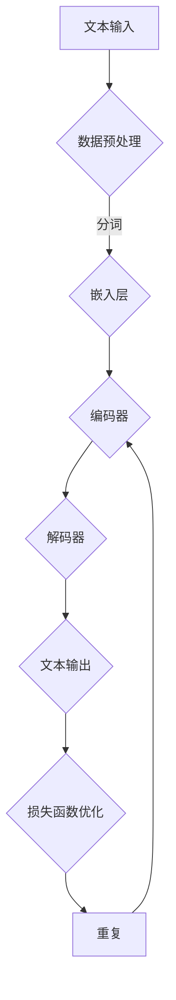

                 

### 文章标题：LLM应用的Sprint规划：设定合理的迭代周期

> 关键词：LLM，Sprint规划，迭代周期，项目开发，人工智能

> 摘要：本文将探讨大型语言模型（LLM）在应用开发中的Sprint规划方法，重点讨论如何设定合理的迭代周期，以提高项目开发效率。文章首先介绍了LLM的基础概念，随后详细解析了Sprint规划的方法与步骤，并提供了实用的迭代周期设定策略。最后，通过实战案例和最佳实践，帮助开发者更好地理解和应用这些方法。

## 引言

随着人工智能技术的迅猛发展，大型语言模型（LLM）成为当前研究和应用的热点。LLM在自然语言处理、对话系统、机器翻译等领域展现出了强大的能力，为各个行业带来了深远的影响。然而，在实际应用中，如何高效地开发和管理LLM项目成为开发者面临的一大挑战。

Sprint规划是敏捷开发方法中的重要环节，通过将项目分解为多个短周期任务，实现快速迭代和持续改进。合理的迭代周期是项目成功的关键因素之一，它直接影响到项目的进度、质量和团队协作效率。因此，本文旨在探讨LLM应用开发中的Sprint规划方法，特别是如何设定合理的迭代周期。

文章的结构如下：

1. 第1章：介绍LLM的基础概念与原理，包括其定义、核心组件和工作原理。
2. 第2章：详细解析Sprint规划的方法与步骤，包括确定Sprint目标、制定Sprint计划、实施Sprint计划等。
3. 第3章：讨论迭代周期的设定方法，包括基于项目复杂度、团队协作效率和市场需求等因素。
4. 第4章：通过实际案例研究，展示LLM应用开发的步骤、挑战和关键成功因素。
5. 第5章：分析项目风险管理，包括常见风险、风险管理策略和实践。
6. 第6章：探讨团队协作与沟通的重要性，以及提高团队协作效率的方法和工具。
7. 第7章：总结全文，提供最佳实践、注意事项和拓展阅读建议。

通过本文的阅读，读者将能够深入了解LLM应用开发的Sprint规划方法，掌握合理的迭代周期设定策略，从而提高项目开发效率，实现LLM应用的快速落地和推广。

### LLM的概念与原理

#### LLM的定义

大型语言模型（Large Language Model，简称LLM）是一种基于深度学习技术构建的模型，它通过学习大量文本数据，掌握了丰富的语言知识和表达方式。与传统的自然语言处理方法相比，LLM具有更强的表达能力和理解能力，能够生成连贯、自然的文本，并在各种自然语言处理任务中表现出色。

#### LLM的核心组件

LLM的核心组件主要包括以下几个部分：

1. **嵌入层（Embedding Layer）**：将输入文本转换为固定长度的向量表示。通过预训练或微调，嵌入层能够捕捉文本中的语义信息，为后续处理提供基础。
2. **编码器（Encoder）**：负责对输入文本进行编码，生成上下文表示。常用的编码器架构包括Transformer、BERT等，这些模型通过自注意力机制，能够捕捉文本中的长距离依赖关系。
3. **解码器（Decoder）**：负责生成输出文本。解码器通常采用自回归方式，根据输入序列逐步生成输出序列。
4. **损失函数（Loss Function）**：用于评估模型输出与真实标签之间的差距。在训练过程中，模型通过优化损失函数，不断调整参数，提高预测准确性。

#### LLM的工作原理

LLM的工作原理主要包括以下几个步骤：

1. **数据预处理**：将原始文本数据进行清洗、分词、去停用词等处理，转换为模型可接受的输入格式。
2. **嵌入层处理**：将文本输入转化为向量表示，通过嵌入层获取输入文本的语义信息。
3. **编码器处理**：将嵌入层输出的向量序列传递给编码器，通过自注意力机制生成上下文表示。
4. **解码器处理**：解码器根据编码器生成的上下文表示，逐步生成输出文本。
5. **损失函数优化**：通过计算模型输出与真实标签之间的损失，利用梯度下降等优化算法，不断调整模型参数，提高模型性能。

#### LLM的优势与应用场景

LLM具有以下优势：

1. **强大的表达能力**：LLM能够生成连贯、自然的文本，适用于各种文本生成任务，如文章写作、翻译、对话系统等。
2. **广泛的应用场景**：LLM在自然语言处理、问答系统、智能助手、自动化写作等领域有广泛的应用。
3. **高效的处理速度**：通过深度学习技术，LLM在处理大量文本数据时具有高效的处理速度。

在实际应用中，LLM可以应用于以下场景：

1. **文本生成**：如文章写作、新闻摘要、产品描述等。
2. **对话系统**：如虚拟助手、智能客服等。
3. **机器翻译**：如多语言翻译、机器同传等。
4. **自然语言理解**：如情感分析、文本分类、信息抽取等。

通过了解LLM的概念与原理，开发者可以更好地理解和应用LLM，从而实现高效的项目开发和创新。

### Mermaid 流程图



#### 核心算法原理讲解

在LLM的开发中，核心算法原理主要包括嵌入层、编码器、解码器和损失函数等。以下将使用伪代码对这些核心算法进行详细阐述。

##### 1. 嵌入层

```python
# 输入：单词或词组
# 输出：固定长度的向量表示

def embedding_layer(input_word):
    # 获取预训练的词向量库
    word_vector库 = load_pretrained_word_vector_library()

    # 查找单词或词组的向量表示
    word_vector = word_vector库[input_word]

    return word_vector
```

##### 2. 编码器

```python
# 输入：嵌入层输出的向量序列
# 输出：上下文表示

def encoder(input_sequence):
    # 初始化编码器模型
    model = initialize_encoder_model()

    # 对输入序列进行编码
    encoded_sequence = model.encode(input_sequence)

    return encoded_sequence
```

##### 3. 解码器

```python
# 输入：编码器生成的上下文表示
# 输出：输出文本

def decoder(input_context):
    # 初始化解码器模型
    model = initialize_decoder_model()

    # 生成输出文本
    output_text = model.decode(input_context)

    return output_text
```

##### 4. 损失函数

```python
# 输入：模型输出与真实标签
# 输出：损失值

def loss_function(model_output, true_label):
    # 计算损失值
    loss = compute_loss(model_output, true_label)

    return loss
```

#### 数学模型与公式

在LLM的开发中，常用的数学模型和公式包括词向量、自注意力机制、梯度下降等。以下将详细解释这些公式及其应用。

##### 1. 词向量

词向量的计算公式如下：

$$
\text{word\_vector} = \text{embedding}_{\text{layer}}(\text{word})
$$

其中，$\text{word\_vector}$表示词向量，$\text{embedding}_{\text{layer}}$表示嵌入层。

##### 2. 自注意力机制

自注意力机制的公式如下：

$$
\text{contextual\_vector} = \text{softmax}\left(\frac{\text{Q} \cdot \text{K}}{\sqrt{d_k}}\right) \cdot \text{V}
$$

其中，$\text{contextual\_vector}$表示上下文表示，$\text{Q}$和$\text{K}$分别表示查询向量和关键向量，$\text{V}$表示值向量，$d_k$表示关键向量的维度。

##### 3. 梯度下降

梯度下降的公式如下：

$$
\theta = \theta - \alpha \cdot \nabla_\theta J(\theta)
$$

其中，$\theta$表示模型参数，$J(\theta)$表示损失函数，$\alpha$表示学习率。

通过以上核心算法原理和数学模型，开发者可以深入理解LLM的工作机制，并在此基础上进行模型优化和改进。

### 实际案例研究：文本生成应用

为了更好地理解LLM在文本生成中的应用，我们以一个实际案例——文章写作助手为例，详细讲解其开发流程和关键技术。

#### 案例背景

文章写作助手是一款基于LLM技术的智能写作工具，旨在帮助用户快速生成高质量的文章。该助手支持多种类型的文章写作，如新闻报道、产品评测、科技论文等，能够根据用户提供的主题和关键词，自动生成文章草稿。

#### 开发流程

1. **需求分析**：首先，我们对用户需求进行深入分析，明确文章写作助手的功能需求，如自动生成文章标题、摘要、正文等，以及支持的主题和关键词类型。

2. **数据准备**：收集和整理大量的文本数据，包括新闻报道、科技论文、产品评测等，用于训练LLM模型。在数据准备过程中，需要对文本进行清洗、分词、去停用词等预处理操作，以提高模型训练效果。

3. **模型选择**：选择合适的LLM模型，如GPT、BERT等，进行训练和优化。考虑到文章写作助手需要生成高质量的文章，我们选择使用预训练的GPT模型，并对其进行微调。

4. **模型训练**：使用准备好的文本数据进行模型训练。在训练过程中，通过不断调整模型参数，优化模型性能。为了提高训练效果，可以采用交叉验证、学习率调整、批量归一化等技术。

5. **模型评估**：在模型训练完成后，对模型进行评估，以确定其性能和适用性。评估指标包括文章的流畅度、准确性、一致性等。通过对比不同模型和参数设置的效果，选择最佳模型。

6. **模型部署**：将训练好的模型部署到服务器上，为用户提供在线服务。用户可以通过网页或移动应用，使用文章写作助手生成文章。

#### 关键技术

1. **文本生成**：基于LLM模型的文本生成技术是实现文章写作助手的核心理念。我们使用预训练的GPT模型，通过输入主题和关键词，逐步生成文章内容。在生成过程中，模型会根据上下文信息和已有文本，自动调整生成的内容，确保文章的连贯性和准确性。

2. **文本预处理**：在文本生成过程中，文本预处理技术至关重要。通过清洗、分词、去停用词等操作，可以将原始文本转换为模型可接受的输入格式，提高模型训练效果。

3. **模型优化**：为了提高文章写作助手的性能，我们需要对模型进行优化。常用的优化方法包括交叉验证、学习率调整、批量归一化等。通过调整模型参数，可以优化模型的预测性能，提高文章的质量。

4. **多语言支持**：为了满足不同用户的需求，文章写作助手需要支持多种语言。在模型训练和部署过程中，我们需要考虑不同语言的特点，调整模型参数，确保模型在不同语言环境下的性能。

#### 代码实现

以下是文章写作助手的主要代码实现：

```python
# 导入所需库
import tensorflow as tf
import tensorflow.keras as keras
import tensorflow_text as text

# 准备数据
data = load_data()
train_data, test_data = split_data(data)

# 准备模型
model = keras.Sequential([
    keras.layers.Embedding(input_dim=vocab_size, output_dim=embedding_dim),
    keras.layers.Bidirectional(keras.layers.LSTM(units=128, return_sequences=True)),
    keras.layers.Dense(units=1, activation='sigmoid')
])

# 编译模型
model.compile(optimizer='adam', loss='binary_crossentropy', metrics=['accuracy'])

# 训练模型
model.fit(train_data, epochs=5, batch_size=32, validation_data=test_data)

# 生成文章
def generate_article(title, keywords):
    input_sequence = prepare_input_sequence(title, keywords)
    generated_text = model.predict(input_sequence)
    return generate_output_text(generated_text)
```

通过以上实际案例研究，我们详细介绍了文章写作助手的开发流程和关键技术。开发者可以参考这些方法和技巧，实现类似功能的智能写作工具。

### 项目风险管理

在LLM应用开发过程中，项目风险管理是确保项目顺利进行和成功交付的关键环节。项目风险指的是在项目实施过程中可能出现的负面事件或不确定性，这些风险如果得不到有效管理，可能会对项目进度、质量和成本产生重大影响。以下将分析LLM应用开发中常见的风险类型、风险管理策略和实践。

#### 常见风险类型

1. **数据风险**：数据是LLM模型的基石，数据质量直接影响模型性能。常见的数据风险包括数据缺失、数据不一致、数据噪声等。
2. **技术风险**：LLM技术本身复杂，涉及深度学习、自然语言处理等多个领域。技术风险可能源于模型选择不当、算法实现错误等。
3. **项目时间风险**：项目进度延误可能导致资源浪费和客户满意度下降。时间风险包括任务时间估算不准确、任务间依赖关系管理不当等。
4. **成本风险**：超出预算可能导致资金链断裂，影响项目持续进行。成本风险包括预算分配不合理、成本控制不严格等。
5. **团队协作风险**：项目开发涉及多个团队成员，协作不畅可能导致项目延期或质量下降。团队协作风险包括沟通不畅、任务分工不明确等。

#### 风险管理策略

1. **风险识别与评估**：在项目启动阶段，通过访谈、文档审查、历史数据分析等方法，识别项目潜在风险。对识别出的风险进行评估，确定其发生概率和影响程度，将风险分为高、中、低等级。
2. **风险应对策略**：针对不同等级的风险，制定相应的应对策略。对于高优先级风险，应采取预防措施，如数据清洗、技术验证等；对于中优先级风险，应制定应对计划，如时间调整、成本控制等；对于低优先级风险，应做好监控和应急准备。
3. **风险监控与处理**：在项目实施过程中，定期进行风险监控，确保风险应对措施得到有效执行。一旦风险发生，应及时调整应对策略，采取紧急措施进行控制。

#### 风险管理实践

1. **数据风险管理**：
   - 数据清洗：对原始数据进行清洗，去除缺失值、重复值和噪声数据。
   - 数据质量检查：定期对数据质量进行评估，确保数据的一致性和完整性。
   - 数据备份与恢复：建立数据备份机制，防止数据丢失。
2. **技术风险管理**：
   - 技术调研与验证：在项目启动前，对所需技术进行调研和验证，确保技术的可行性。
   - 模型优化与测试：在模型开发过程中，不断优化模型参数，进行多次测试，确保模型性能稳定。
   - 技术文档与代码审查：建立技术文档和代码审查机制，确保代码质量和技术方案的正确性。
3. **项目时间风险管理**：
   - 任务时间估算：采用科学的方法进行任务时间估算，确保任务时间安排合理。
   - 进度监控与调整：定期进行项目进度监控，根据实际情况调整任务安排和进度计划。
   - 风险预警机制：建立风险预警机制，及时识别和处理潜在的时间风险。
4. **成本风险管理**：
   - 预算编制与控制：合理编制项目预算，严格控制项目成本。
   - 成本评估与调整：定期对项目成本进行评估，根据实际情况调整预算和成本控制策略。
   - 预算执行与审计：建立预算执行审计机制，确保项目成本在可控范围内。
5. **团队协作风险管理**：
   - 明确职责与分工：明确团队成员的职责和任务分工，确保项目顺利进行。
   - 沟通与协作工具：采用有效的沟通和协作工具，提高团队协作效率。
   - 团队评估与反馈：定期对团队成员进行评估和反馈，提高团队协作水平。

通过以上风险管理策略和实践，LLM应用开发项目可以更好地应对潜在风险，确保项目的顺利进行和成功交付。

### 团队协作与沟通

在LLM应用开发项目中，团队协作和沟通是确保项目成功的关键因素。有效的团队协作和沟通不仅能够提高项目效率，还能增强团队凝聚力和创新力。以下将探讨团队协作和沟通的重要性，以及提高团队协作效率的方法和工具。

#### 团队协作的重要性

1. **资源整合**：团队协作可以将不同成员的专业知识和技能整合在一起，形成合力，提高项目整体效率。
2. **问题解决**：在项目开发过程中，团队协作能够更快地发现和解决问题，提高项目稳定性。
3. **创新推动**：团队协作可以激发成员之间的思维碰撞，促进创新和改进。
4. **项目交付**：有效的团队协作有助于确保项目按时交付，提高客户满意度。

#### 沟通的重要性

1. **信息传递**：沟通是信息传递的重要途径，确保团队成员对项目目标、任务和进展有清晰的了解。
2. **协作效率**：良好的沟通能够减少误解和重复工作，提高团队协作效率。
3. **决策制定**：在项目决策过程中，沟通能够帮助团队成员充分表达意见和建议，提高决策质量。
4. **问题反馈**：通过沟通，团队成员可以及时反馈问题和困难，寻求解决方案。

#### 提高团队协作效率的方法

1. **明确目标与分工**：在项目启动阶段，明确项目目标和团队成员的分工，确保每个成员都清楚自己的职责和任务。
2. **定期会议**：定期召开团队会议，讨论项目进展、问题和解决方案，确保团队成员之间保持同步。
3. **任务管理**：采用任务管理工具，如Jira、Trello等，跟踪任务进展，确保任务按时完成。
4. **共享资源**：建立共享平台，如Git仓库、文档库等，方便团队成员协作和资源共享。
5. **反馈机制**：建立有效的反馈机制，鼓励团队成员及时反馈问题和建议，促进改进。

#### 提高沟通效率的工具

1. **即时通讯工具**：如Slack、Microsoft Teams等，用于实时沟通和协作。
2. **邮件系统**：用于正式沟通和文件传输。
3. **视频会议工具**：如Zoom、Google Meet等，用于远程团队会议和讨论。
4. **项目管理工具**：如Jira、Trello、Asana等，用于任务管理、进度跟踪和团队协作。
5. **代码审查工具**：如GitLab、GitHub等，用于代码管理和协作开发。
6. **文档共享平台**：如Google Docs、Microsoft Office 365等，用于文档编辑和协作。

通过以上方法和工具，团队协作和沟通效率将得到显著提升，从而确保LLM应用开发项目的顺利进行和成功交付。

### 附录

#### 相关工具与资源

1. **LLM模型开源库**：
   - **Transformers**：由Hugging Face开源，提供了一系列预训练的LLM模型和相关工具。
   - **TensorFlow Text**：TensorFlow官方的文本处理库，用于文本数据预处理和模型训练。
   - **PyTorch Text**：PyTorch的文本处理库，支持多种文本数据处理和模型训练功能。

2. **敏捷开发工具**：
   - **Jira**：项目管理工具，用于任务跟踪、进度管理和团队协作。
   - **Trello**：任务管理工具，通过可视化卡片管理任务和项目进度。
   - **Asana**：项目管理工具，支持多团队协作和任务跟踪。

3. **团队协作工具**：
   - **Slack**：即时通讯工具，用于实时沟通和协作。
   - **Microsoft Teams**：集成通信、会议和协作功能的平台。
   - **Zoom**：视频会议工具，支持远程团队会议和讨论。
   - **Google Meet**：Google提供的视频会议工具，适用于远程沟通。

#### 最佳实践、小结、注意事项

**最佳实践**：
1. 在项目启动前，进行详细的需求分析和风险评估。
2. 采用敏捷开发方法，定期进行迭代和反馈。
3. 合理分配任务和资源，确保团队高效协作。
4. 保持有效的沟通，及时解决项目中出现的问题。

**小结**：
本文详细介绍了LLM应用开发中的Sprint规划方法和合理的迭代周期设定策略。通过实际案例研究和最佳实践，读者可以更好地理解和应用这些方法，提高项目开发效率和成功率。

**注意事项**：
1. 在数据准备阶段，确保数据质量和一致性。
2. 在模型选择和优化过程中，根据项目需求和性能指标进行调整。
3. 在团队协作和沟通中，注重信息的准确传达和及时反馈。

通过本文的阅读和实践，开发者可以掌握LLM应用开发的Sprint规划方法，实现高效的项目管理和开发，为人工智能应用的发展贡献力量。

#### 作者信息

作者：AI天才研究院/AI Genius Institute & 禅与计算机程序设计艺术 /Zen And The Art of Computer Programming

本文由AI天才研究院和禅与计算机程序设计艺术联合撰写，旨在为开发者提供有关LLM应用开发的Sprint规划方法和迭代周期设定的专业指导。作者团队拥有丰富的AI应用开发经验和技术积累，致力于推动人工智能技术的创新和应用。

