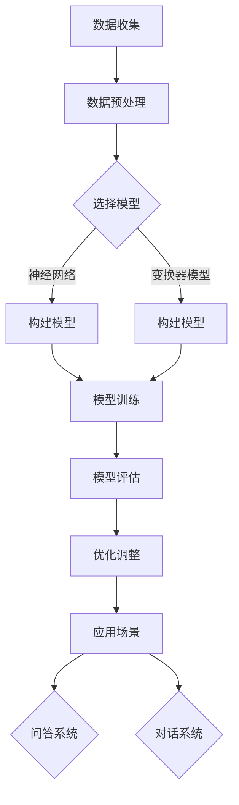

                 

# LLM应用的增量式开发：逐步构建复杂功能

> 关键词：语言模型，增量式开发，复杂功能，神经网络，优化，应用场景

> 摘要：本文将探讨语言模型（LLM）的增量式开发方法，通过逐步构建复杂功能，帮助开发者深入了解并掌握LLM的开发与应用。文章将首先介绍语言模型的概述，包括定义、分类和发展历程，接着深入探讨语言模型的数学基础，包括概率论、信息论和神经网络基础。随后，文章将重点讨论语言模型的构建与优化方法，包括训练数据预处理、模型构建、参数调优和模型压缩等。最后，文章将介绍语言模型在自然语言处理、问答系统和对话系统中的应用，并展望语言模型的未来发展趋势。

## 目录大纲：

### 第一部分：基础理论与概述

### 第1章：语言模型概述

- **1.1 语言模型的定义与基本原理**
- **1.2 语言模型的分类与特点**
- **1.3 语言模型的发展历程**

### 第2章：语言模型的数学基础

- **2.1 概率论基础**
  - **2.1.1 概率的基本概念**
  - **2.1.2 贝叶斯定理**
  - **2.1.3 最大似然估计**
- **2.2 信息论基础**
  - **2.2.1 信息量的概念**
  - **2.2.2 熵的概念**
  - **2.2.3 香农熵**
- **2.3 神经网络基础**
  - **2.3.1 神经网络的结构与功能**
  - **2.3.2 神经网络的训练过程**

### 第二部分：语言模型的构建与优化

### 第3章：语言模型的构建

- **3.1 语言模型的构建流程**
- **3.2 语言模型的训练数据预处理**
  - **3.2.1 数据清洗**
  - **3.2.2 数据分词**
  - **3.2.3 数据编码**
- **3.3 语言模型的构建方法**
  - **3.3.1 基于神经网络的模型**
    - **3.3.1.1 卷积神经网络（CNN）**
    - **3.3.1.2 递归神经网络（RNN）**
    - **3.3.1.3 长短时记忆网络（LSTM）**
    - **3.3.1.4 门控循环单元（GRU）**
  - **3.3.2 基于变换器架构的模型**
    - **3.3.2.1 自注意力机制**
    - **3.3.2.2 Transformer模型**

### 第4章：语言模型的优化与调整

- **4.1 语言模型的评估指标**
- **4.2 语言模型的优化方法**
  - **4.2.1 参数调优**
    - **4.2.1.1 学习率调整**
    - **4.2.1.2 损失函数优化**
  - **4.2.2 模型剪枝与压缩**
    - **4.2.2.1 参数剪枝**
    - **4.2.2.2 模型量化**
    - **4.2.2.3 知识蒸馏**

### 第三部分：语言模型在应用场景中的应用

### 第5章：自然语言处理应用

- **5.1 机器翻译**
  - **5.1.1 机器翻译的原理与方法**
  - **5.1.2 基于语言模型的机器翻译**
- **5.2 文本分类**
  - **5.2.1 文本分类的原理与方法**
  - **5.2.2 基于语言模型的文本分类**
- **5.3 命名实体识别**
  - **5.3.1 命名实体识别的原理与方法**
  - **5.3.2 基于语言模型的命名实体识别**

### 第6章：问答系统

- **6.1 问答系统的原理与方法**
- **6.2 基于语言模型的问答系统构建**
- **6.3 常见问答系统的实现与分析**

### 第四部分：高级应用与未来展望

### 第7章：语言模型在对话系统中的应用

- **7.1 对话系统的基本概念**
- **7.2 基于语言模型的对话系统构建**
- **7.3 对话系统的评估指标与优化策略**

### 第8章：语言模型的未来发展趋势

- **8.1 语言模型的技术演进**
- **8.2 语言模型在跨模态应用中的探索**
- **8.3 语言模型在实时交互中的应用前景**

### 附录

- **附录A：开源语言模型介绍**
  - **A.1 GPT系列模型**
  - **A.2 BERT系列模型**
- **附录B：常见语言模型优化技巧**
  - **B.1 模型剪枝与压缩**
  - **B.2 知识蒸馏**
- **附录C：语言模型开发工具与资源**
  - **C.1 主流深度学习框架**
    - **C.1.1 TensorFlow**
    - **C.1.2 PyTorch**
    - **C.1.3 JAX**
    - **C.1.4 其他框架简介**
## 第1章：语言模型概述

### 1.1 语言模型的定义与基本原理

语言模型（Language Model，简称LM）是一种用于预测文本序列的概率分布的算法，它是自然语言处理（Natural Language Processing，简称NLP）领域的基础组件。在自然语言处理中，语言模型用于许多任务，如机器翻译、文本分类、命名实体识别等。

**基本原理**：
语言模型的核心思想是通过对大量语言数据进行统计分析，学习语言中单词、短语和句子的统计规律。通过这些规律，语言模型可以预测给定文本序列的下一个单词或字符。常见的语言模型有基于N-gram模型、神经网络模型和变换器模型等。

**N-gram模型**：
N-gram模型是最简单的语言模型之一，它基于前N个单词的历史信息来预测下一个单词。例如，对于三元语法模型（Trigram），给定前两个单词“the book”，它可以预测第三个单词。

**神经网络模型**：
随着深度学习技术的发展，神经网络模型成为语言模型的主流。神经网络模型，如递归神经网络（RNN）、长短时记忆网络（LSTM）和变换器（Transformer）等，可以通过学习文本的长期依赖关系来提高预测精度。

**应用场景**：
语言模型在自然语言处理领域有着广泛的应用。例如，在机器翻译中，语言模型用于预测源语言和目标语言之间的翻译概率，从而实现高质量的翻译。在文本分类中，语言模型可以用于识别文本的主题和情感。在问答系统中，语言模型可以帮助回答用户的问题。

### 1.2 语言模型的分类与特点

**N-gram模型**：
N-gram模型是最简单也是最传统的语言模型之一。它的主要特点是计算复杂度低，实现简单。但是，N-gram模型在长文本中的表现较差，因为它无法捕捉到长距离的依赖关系。

**神经网络模型**：
神经网络模型，如RNN、LSTM和GRU等，通过学习文本的长期依赖关系，可以显著提高语言模型的性能。RNN是一种基于序列数据的神经网络，它通过循环结构来处理文本序列。LSTM和GRU是RNN的变种，它们通过引入门控机制来更好地捕捉长期依赖关系。

**变换器模型（Transformer）**：
变换器模型是当前最先进的语言模型之一。它通过自注意力机制来捕捉文本序列中的依赖关系，从而实现高效的文本处理。变换器模型在多个NLP任务中都取得了显著的性能提升。

**特点对比**：
- **N-gram模型**：简单，高效，但无法捕捉长距离依赖。
- **神经网络模型**：可以捕捉长距离依赖，但计算复杂度较高。
- **变换器模型**：计算效率高，可以捕捉长距离依赖，是目前最先进的语言模型。

### 1.3 语言模型的发展历程

语言模型的发展历程反映了自然语言处理技术的发展。从最初的N-gram模型，到基于神经网络的模型，再到当前的变换器模型，语言模型经历了不断的技术演进。

**早期发展**：
1950年代，N-gram模型首次被提出，成为最早的文本预测模型。随着计算机性能的提高，N-gram模型在许多NLP任务中都取得了显著的效果。

**1990年代**：
1990年代，神经网络模型开始应用于语言模型。RNN模型的引入，使得语言模型能够更好地捕捉长距离依赖关系。

**2000年代**：
2000年代，LSTM和GRU等RNN的变种被提出，进一步提高了语言模型在长文本处理中的性能。

**2010年代**：
2017年，变换器模型（Transformer）的提出，标志着语言模型发展的一个重要里程碑。变换器模型通过自注意力机制，实现了高效的文本处理，并在多个NLP任务中取得了突破性成果。

**当前**：
随着深度学习和计算资源的不断发展，变换器模型已经成为语言模型的主流。同时，新的语言模型和优化方法不断涌现，推动了自然语言处理技术的不断进步。

### 1.4 小结

本章介绍了语言模型的基本概念、分类与发展历程。语言模型是自然语言处理领域的重要组件，通过学习语言中的统计规律，可以实现文本的预测、分类、翻译等多种任务。从N-gram模型到神经网络模型，再到当前的变换器模型，语言模型经历了不断的技术演进，推动了自然语言处理技术的快速发展。在下一章中，我们将深入探讨语言模型的数学基础，包括概率论、信息论和神经网络基础。

## 第2章：语言模型的数学基础

### 2.1 概率论基础

概率论是语言模型数学基础的重要组成部分。它为语言模型中的预测和决策提供了理论基础。

#### 2.1.1 概率的基本概念

概率（Probability）是描述随机事件发生可能性大小的数值。常用的概率概念包括：

- **概率分布（Probability Distribution）**：概率分布描述了随机变量取值的概率分布情况。常见的概率分布有离散概率分布和连续概率分布。

- **条件概率（Conditional Probability）**：条件概率是指在某一事件发生的条件下，另一事件发生的概率。条件概率的公式为：$$P(A|B) = \frac{P(A \cap B)}{P(B)}$$，其中，\(P(A|B)\) 表示在事件B发生的条件下事件A发生的概率，\(P(A \cap B)\) 表示事件A和事件B同时发生的概率，\(P(B)\) 表示事件B发生的概率。

- **贝叶斯定理（Bayes' Theorem）**：贝叶斯定理是一种用于根据已知条件和先验概率来计算后验概率的公式。其公式为：$$P(A|B) = \frac{P(B|A)P(A)}{P(B)}$$，其中，\(P(A|B)\) 表示在事件B发生的条件下事件A发生的概率，\(P(B|A)\) 表示在事件A发生的条件下事件B发生的概率，\(P(A)\) 表示事件A发生的概率，\(P(B)\) 表示事件B发生的概率。

#### 2.1.2 贝叶斯定理

贝叶斯定理是语言模型中的一个重要工具。它可以用来计算后验概率，从而帮助语言模型进行预测和决策。贝叶斯定理的推导基于条件概率和全概率公式。

- **全概率公式（Total Probability Formula）**：全概率公式描述了在给定一个随机变量时，另一个随机变量的条件概率。其公式为：$$P(A) = \sum_{i} P(A|B_i)P(B_i)$$，其中，\(P(A)\) 表示事件A的概率，\(P(A|B_i)\) 表示在事件\(B_i\) 发生的条件下事件A发生的概率，\(P(B_i)\) 表示事件\(B_i\) 发生的概率。

- **贝叶斯定理（Bayes' Theorem）**：贝叶斯定理描述了后验概率与先验概率的关系。其公式为：$$P(A|B) = \frac{P(B|A)P(A)}{P(B)}$$，其中，\(P(A|B)\) 表示在事件B发生的条件下事件A发生的概率，\(P(B|A)\) 表示在事件A发生的条件下事件B发生的概率，\(P(A)\) 表示事件A发生的概率，\(P(B)\) 表示事件B发生的概率。

#### 2.1.3 最大似然估计

最大似然估计（Maximum Likelihood Estimation，简称MLE）是一种用于估计概率分布参数的方法。它的基本思想是在给定样本数据的情况下，找到能够使得样本数据出现概率最大的参数值。

- **似然函数（Likelihood Function）**：似然函数是概率函数的逆，它描述了给定参数时，样本数据出现的概率。其公式为：$$L(\theta | x) = P(x | \theta)$$，其中，\(\theta\) 表示参数，\(x\) 表示样本数据。

- **最大似然估计（Maximum Likelihood Estimation）**：最大似然估计的目标是找到使得似然函数最大的参数值。其公式为：$$\theta^* = \arg\max_{\theta} L(\theta | x)$$，其中，\(\theta^*\) 表示最大似然估计的参数值。

### 2.2 信息论基础

信息论是研究信息传输和处理规律的科学，它是语言模型数学基础的重要组成部分。

#### 2.2.1 信息量的概念

信息量（Information）是描述信息量的度量。常用的信息量概念包括：

- **信息量（Information）**：信息量是描述信息量的基本概念，它用于衡量一个事件发生的概率。信息量的公式为：$$I(X) = -\log_2 P(X)$$，其中，\(I(X)\) 表示事件\(X\) 的信息量，\(P(X)\) 表示事件\(X\) 发生的概率。

- **熵（Entropy）**：熵是描述随机变量不确定性的度量。熵的公式为：$$H(X) = -\sum_{i} P(X_i) \log_2 P(X_i)$$，其中，\(H(X)\) 表示随机变量\(X\) 的熵，\(P(X_i)\) 表示随机变量\(X\) 取值\(X_i\) 的概率。

- **条件熵（Conditional Entropy）**：条件熵是描述在给定一个随机变量时，另一个随机变量的不确定性的度量。条件熵的公式为：$$H(X|Y) = -\sum_{i} P(Y_i) \sum_{j} P(X_j|Y_i) \log_2 P(X_j|Y_i)$$，其中，\(H(X|Y)\) 表示在随机变量\(Y\) 发生的条件下随机变量\(X\) 的熵，\(P(Y_i)\) 表示随机变量\(Y\) 取值\(Y_i\) 的概率，\(P(X_j|Y_i)\) 表示在随机变量\(Y\) 取值\(Y_i\) 的条件下随机变量\(X\) 取值\(X_j\) 的概率。

#### 2.2.2 熵的概念

熵是信息论中最基本的概念之一，它描述了随机变量的不确定性。

- **熵（Entropy）**：熵是描述随机变量不确定性的度量。熵的公式为：$$H(X) = -\sum_{i} P(X_i) \log_2 P(X_i)$$，其中，\(H(X)\) 表示随机变量\(X\) 的熵，\(P(X_i)\) 表示随机变量\(X\) 取值\(X_i\) 的概率。

- **条件熵（Conditional Entropy）**：条件熵是描述在给定一个随机变量时，另一个随机变量的不确定性的度量。条件熵的公式为：$$H(X|Y) = -\sum_{i} P(Y_i) \sum_{j} P(X_j|Y_i) \log_2 P(X_j|Y_i)$$，其中，\(H(X|Y)\) 表示在随机变量\(Y\) 发生的条件下随机变量\(X\) 的熵，\(P(Y_i)\) 表示随机变量\(Y\) 取值\(Y_i\) 的概率，\(P(X_j|Y_i)\) 表示在随机变量\(Y\) 取值\(Y_i\) 的条件下随机变量\(X\) 取值\(X_j\) 的概率。

#### 2.2.3 香农熵

香农熵（Shannon Entropy）是信息论中最常用的熵度量方法，它由香农（Claude Shannon）提出。

- **香农熵（Shannon Entropy）**：香农熵是描述随机变量不确定性的度量，它是熵的另一种表示形式。香农熵的公式为：$$H(X) = -\sum_{i} P(X_i) \log_2 P(X_i)$$，其中，\(H(X)\) 表示随机变量\(X\) 的香农熵，\(P(X_i)\) 表示随机变量\(X\) 取值\(X_i\) 的概率。

- **条件香农熵（Conditional Shannon Entropy）**：条件香农熵是描述在给定一个随机变量时，另一个随机变量的不确定性的度量。条件香农熵的公式为：$$H(X|Y) = -\sum_{i} P(Y_i) \sum_{j} P(X_j|Y_i) \log_2 P(X_j|Y_i)$$，其中，\(H(X|Y)\) 表示在随机变量\(Y\) 发生的条件下随机变量\(X\) 的香农熵，\(P(Y_i)\) 表示随机变量\(Y\) 取值\(Y_i\) 的概率，\(P(X_j|Y_i)\) 表示在随机变量\(Y\) 取值\(Y_i\) 的条件下随机变量\(X\) 取值\(X_j\) 的概率。

### 2.3 神经网络基础

神经网络（Neural Network，简称NN）是语言模型中常用的计算模型，它通过模拟生物神经系统的结构和功能，实现了对复杂数据的处理和预测。

#### 2.3.1 神经网络的结构与功能

神经网络由多个神经元（Neuron）组成，每个神经元都可以接收输入信息，通过激活函数产生输出。神经网络的基本结构包括输入层、隐藏层和输出层。

- **输入层（Input Layer）**：输入层接收外部输入信息，每个输入可以看作是一个神经元的输入。

- **隐藏层（Hidden Layer）**：隐藏层位于输入层和输出层之间，用于对输入信息进行加工和处理。

- **输出层（Output Layer）**：输出层负责产生最终的输出结果。

神经网络的训练过程是通过调整网络的权重和偏置，使得网络的输出接近期望输出。常见的训练算法包括梯度下降（Gradient Descent）和反向传播（Backpropagation）算法。

#### 2.3.2 神经网络的训练过程

神经网络的训练过程可以分为以下几个步骤：

1. **初始化权重和偏置**：在训练开始前，需要初始化网络的权重和偏置。常用的初始化方法包括随机初始化和零初始化。

2. **前向传播（Forward Propagation）**：在前向传播过程中，输入信息通过网络逐层传递，每个神经元根据其输入和激活函数产生输出。

3. **计算损失函数**：前向传播完成后，需要计算网络的损失函数。常用的损失函数包括均方误差（Mean Squared Error，简称MSE）和交叉熵损失（Cross Entropy Loss）。

4. **反向传播（Backpropagation）**：在反向传播过程中，网络根据损失函数的梯度，逐层调整网络的权重和偏置。

5. **更新权重和偏置**：根据反向传播得到的梯度，更新网络的权重和偏置。常用的更新方法包括梯度下降和Adam优化器。

6. **重复步骤2-5**：重复前向传播、计算损失函数、反向传播和更新权重和偏置的过程，直到网络达到预定的训练目标。

#### 2.3.3 小结

本章介绍了语言模型的数学基础，包括概率论、信息论和神经网络基础。概率论和信息论为语言模型提供了理论基础，神经网络则为语言模型提供了实现工具。在下一章中，我们将深入探讨语言模型的构建与优化方法，包括训练数据预处理、模型构建、参数调优和模型压缩等。

## 第3章：语言模型的构建

### 3.1 语言模型的构建流程

构建一个语言模型需要经历多个步骤，包括数据收集、数据预处理、模型选择、模型训练和模型评估等。

#### 数据收集

语言模型的构建首先需要收集大量的文本数据。这些数据可以来源于各种文本资源，如书籍、新闻、博客、社交媒体等。数据收集的过程需要遵循以下原则：

- **多样性**：收集的文本数据应涵盖多种主题和领域，以确保语言模型的泛化能力。
- **质量**：文本数据应确保内容真实、有价值，避免噪声数据对模型性能的影响。
- **规模**：大量的文本数据有助于提高语言模型的训练效果和泛化能力。

#### 数据预处理

在收集到文本数据后，需要进行预处理以使其适合模型训练。数据预处理包括以下几个步骤：

- **文本清洗**：去除文本中的噪声，如HTML标签、特殊字符、冗余信息等。
- **分词**：将文本分割成单词或短语，以便模型能够理解文本的组成。
- **词向量表示**：将单词或短语转换为向量表示，便于模型进行计算和处理。

常用的分词方法包括基于词典的分词和基于统计的分词。词向量表示方法包括Word2Vec、GloVe等。

#### 模型选择

语言模型的构建依赖于选择合适的模型架构。常见的语言模型架构包括N-gram模型、神经网络模型和变换器模型。

- **N-gram模型**：N-gram模型是一种基于历史信息进行预测的模型。它的计算复杂度较低，但无法捕捉长距离依赖关系。
- **神经网络模型**：神经网络模型，如RNN、LSTM和GRU等，通过学习文本的长期依赖关系，可以显著提高语言模型的性能。
- **变换器模型**：变换器模型是一种基于自注意力机制的模型，它在多个NLP任务中都取得了显著的性能提升。

#### 模型训练

在选择了模型架构后，需要对模型进行训练。训练过程包括以下几个步骤：

1. **初始化模型参数**：初始化模型的权重和偏置。
2. **前向传播**：将输入文本数据通过模型进行前向传播，计算模型的输出。
3. **计算损失函数**：计算模型的损失函数，以衡量模型的输出与真实标签之间的差异。
4. **反向传播**：根据损失函数的梯度，通过反向传播算法调整模型的权重和偏置。
5. **更新模型参数**：根据反向传播得到的梯度，更新模型的权重和偏置。

重复上述步骤，直到模型达到预定的训练目标。

#### 模型评估

在模型训练完成后，需要对模型进行评估，以确定其性能。常用的评估指标包括：

- **准确率（Accuracy）**：准确率是衡量模型分类性能的指标，它表示模型正确分类的样本数与总样本数之比。
- **精确率（Precision）**：精确率是衡量模型预测为正类的样本中实际为正类的比例。
- **召回率（Recall）**：召回率是衡量模型预测为正类的样本中实际为正类的比例。
- **F1值（F1 Score）**：F1值是精确率和召回率的调和平均，用于综合考虑模型的分类性能。

#### 3.2 语言模型的训练数据预处理

在构建语言模型时，预处理数据的质量直接影响模型的性能。以下是几个常用的预处理步骤：

- **文本清洗**：去除文本中的HTML标签、特殊字符和冗余信息。
  ```python
  import re

  def clean_text(text):
      text = re.sub('<.*?>', '', text)  # 去除HTML标签
      text = re.sub('[^a-zA-Z]', ' ', text)  # 去除非字母字符
      text = re.sub(' +', ' ', text)  # 去除多余的空格
      return text.lower()  # 转换为小写
  ```

- **分词**：将文本分割成单词或短语。
  ```python
  from nltk.tokenize import word_tokenize

  def tokenize_text(text):
      return word_tokenize(text)
  ```

- **词向量表示**：将单词或短语转换为向量表示。
  ```python
  from gensim.models import Word2Vec

  def create_word2vec_model(texts, vector_size=100, window=5, min_count=1):
      model = Word2Vec(texts, vector_size=vector_size, window=window, min_count=min_count, sg=1)
      return model
  ```

#### 3.3 语言模型的构建方法

语言模型的构建方法可以分为基于神经网络的模型和基于变换器架构的模型。

##### 3.3.1 基于神经网络的模型

基于神经网络的模型通过学习文本的长期依赖关系，可以显著提高语言模型的性能。以下是一些常见的神经网络模型：

- **卷积神经网络（CNN）**：CNN可以用于文本分类和命名实体识别等任务。
  ```python
  from tensorflow.keras.models import Sequential
  from tensorflow.keras.layers import Conv1D, MaxPooling1D, Flatten, Dense

  def create_cnn_model(input_shape, num_classes):
      model = Sequential()
      model.add(Conv1D(128, 5, activation='relu', input_shape=input_shape))
      model.add(MaxPooling1D(5))
      model.add(Flatten())
      model.add(Dense(num_classes, activation='softmax'))
      return model
  ```

- **递归神经网络（RNN）**：RNN可以用于处理序列数据，如时间序列分析和文本生成。
  ```python
  from tensorflow.keras.models import Sequential
  from tensorflow.keras.layers import LSTM, Dense

  def create_rnn_model(input_shape, output_size):
      model = Sequential()
      model.add(LSTM(128, input_shape=input_shape, return_sequences=True))
      model.add(LSTM(128, return_sequences=False))
      model.add(Dense(output_size, activation='softmax'))
      return model
  ```

- **长短时记忆网络（LSTM）**：LSTM可以解决RNN在处理长序列数据时的梯度消失问题。
  ```python
  from tensorflow.keras.models import Sequential
  from tensorflow.keras.layers import LSTM, Dense

  def create_lstm_model(input_shape, output_size):
      model = Sequential()
      model.add(LSTM(128, input_shape=input_shape, return_sequences=True))
      model.add(LSTM(128, return_sequences=False))
      model.add(Dense(output_size, activation='softmax'))
      return model
  ```

- **门控循环单元（GRU）**：GRU是LSTM的变种，可以更好地捕捉长距离依赖关系。
  ```python
  from tensorflow.keras.models import Sequential
  from tensorflow.keras.layers import GRU, Dense

  def create_gru_model(input_shape, output_size):
      model = Sequential()
      model.add(GRU(128, input_shape=input_shape, return_sequences=False))
      model.add(Dense(output_size, activation='softmax'))
      return model
  ```

##### 3.3.2 基于变换器架构的模型

变换器模型是一种基于自注意力机制的模型，它在多个NLP任务中都取得了显著的性能提升。以下是一个基于变换器模型的示例：

- **变换器模型（Transformer）**：变换器模型通过自注意力机制来捕捉文本序列中的依赖关系。
  ```python
  from tensorflow.keras.models import Model
  from tensorflow.keras.layers import Input, Embedding, LSTM, Dense

  def create_transformer_model(input_shape, output_size):
      input_seq = Input(shape=input_shape)
      x = Embedding(input_dim=vocab_size, output_dim=embedding_dim)(input_seq)
      x = LSTM(units=128, return_sequences=True)(x)
      x = LSTM(units=128, return_sequences=True)(x)
      x = Dense(units=output_size, activation='softmax')(x)
      model = Model(inputs=input_seq, outputs=x)
      return model
  ```

#### 3.4 小结

本章介绍了语言模型的构建流程，包括数据收集、数据预处理、模型选择、模型训练和模型评估等步骤。在数据预处理阶段，需要对文本进行清洗、分词和词向量表示。在模型选择阶段，可以选择基于神经网络的模型或基于变换器架构的模型。通过本章的介绍，读者可以了解到构建语言模型的基本方法和技巧，为后续的语言模型应用奠定基础。

## 第4章：语言模型的优化与调整

### 4.1 语言模型的评估指标

在语言模型构建完成后，评估其性能是非常重要的。评估指标用于衡量模型在不同任务上的表现，常见的评估指标包括：

#### 4.1.1 准确率（Accuracy）

准确率是评估分类任务性能的常用指标，它表示模型正确分类的样本数与总样本数之比。其计算公式为：

$$
Accuracy = \frac{TP + TN}{TP + TN + FP + FN}
$$

其中，\(TP\) 表示真正例，\(TN\) 表示真负例，\(FP\) 表示假正例，\(FN\) 表示假负例。

#### 4.1.2 精确率（Precision）

精确率是评估分类任务中预测为正类的样本中实际为正类的比例。其计算公式为：

$$
Precision = \frac{TP}{TP + FP}
$$

#### 4.1.3 召回率（Recall）

召回率是评估分类任务中实际为正类的样本中被预测为正类的比例。其计算公式为：

$$
Recall = \frac{TP}{TP + FN}
$$

#### 4.1.4 F1值（F1 Score）

F1值是精确率和召回率的调和平均，用于综合考虑模型的分类性能。其计算公式为：

$$
F1 Score = 2 \times \frac{Precision \times Recall}{Precision + Recall}
$$

#### 4.1.5 评估指标的选择

在选择评估指标时，需要根据具体任务的需求进行选择。例如，在二分类任务中，准确率是一个常用的指标；在多分类任务中，精确率和召回率可能更为重要；在处理不平衡数据集时，F1值是一个较好的综合评估指标。

### 4.2 语言模型的优化方法

在语言模型构建和评估完成后，可以通过多种方法对模型进行优化，以提高模型的性能和泛化能力。以下是一些常见的优化方法：

#### 4.2.1 参数调优

参数调优是优化语言模型的重要方法之一。通过调整模型参数，可以改善模型的性能。常见的参数包括学习率、批次大小、正则化参数等。以下是一个基于梯度下降的参数调优示例：

```python
def optimize_model(model, X_train, y_train, epochs, learning_rate):
    for epoch in range(epochs):
        # 前向传播
        predictions = model.predict(X_train)
        # 计算损失
        loss = compute_loss(y_train, predictions)
        # 反向传播
        model.fit(X_train, y_train, epochs=1, batch_size=batch_size, verbose=0)
        # 打印当前 epoch 的损失
        print(f"Epoch {epoch+1}: Loss = {loss}")
    return model
```

#### 4.2.2 模型剪枝与压缩

模型剪枝与压缩是减少模型参数数量和计算复杂度的有效方法。通过剪枝，可以去除不必要的参数，从而减小模型的大小。以下是一个基于参数剪枝的示例：

```python
from tensorflow.keras.layers import GlobalAveragePooling1D

def prune_model(model, pruning_rate=0.2):
    # 添加全局平均池化层以减少参数数量
    model.add(GlobalAveragePooling1D())
    # 更新模型参数
    model.compile(optimizer='adam', loss='categorical_crossentropy', metrics=['accuracy'])
    # 应用参数剪枝
    model.prune(pruning_rate)
    return model
```

#### 4.2.3 模型量化

模型量化是一种将高精度的模型转换为低精度模型的方法，从而减少模型的存储空间和计算复杂度。以下是一个基于量化的示例：

```python
from tensorflow.keras.quantization import quantize_model

def quantize_model(model):
    # 应用量化操作
    model = quantize_model(model)
    # 更新模型参数
    model.compile(optimizer='adam', loss='categorical_crossentropy', metrics=['accuracy'])
    return model
```

#### 4.2.4 知识蒸馏

知识蒸馏是一种将大型模型的知识传递给小型模型的方法。通过蒸馏，可以将大型模型的复杂结构简化，从而获得性能优异的小型模型。以下是一个基于知识蒸馏的示例：

```python
from tensorflow.keras.models import Model

def knowledge_distillation(model, student_model, teacher_model, X_train, y_train, epochs):
    # 构建蒸馏模型
    inputs = Model(inputs=model.input, outputs=model.get_layer('last_dense').output)
    # 训练蒸馏模型
    model.fit(X_train, y_train, epochs=epochs, batch_size=32, verbose=0)
    # 更新学生模型
    student_model.set_weights(model.get_weights())
    return student_model
```

#### 4.3 小结

本章介绍了语言模型的优化方法，包括参数调优、模型剪枝与压缩、模型量化和知识蒸馏等。通过优化方法，可以显著提高语言模型的性能和泛化能力。在下一章中，我们将探讨语言模型在自然语言处理应用中的具体实现，包括机器翻译、文本分类和命名实体识别等。

## 第5章：语言模型在自然语言处理应用中的具体实现

### 5.1 机器翻译

机器翻译是自然语言处理领域的重要应用之一，它通过将一种语言的文本翻译成另一种语言，实现了跨语言的信息传递。语言模型在机器翻译中起着关键作用，它可以提高翻译的质量和效率。

#### 5.1.1 机器翻译的原理与方法

机器翻译的基本原理是通过对源语言和目标语言的文本进行建模，从而实现文本的翻译。常用的方法包括基于规则的翻译方法和基于统计的翻译方法。

- **基于规则的翻译方法**：基于规则的翻译方法通过制定一系列的翻译规则，将源语言文本翻译成目标语言。这种方法依赖于语言学知识和翻译经验，可以生成高质量的翻译。但规则数量庞大，难以覆盖所有翻译情况。

- **基于统计的翻译方法**：基于统计的翻译方法通过统计源语言和目标语言之间的翻译关系，从而实现文本的翻译。这种方法依赖于大规模的平行语料库，通过统计学习方法（如N-gram模型、统计机器翻译等）来建立翻译模型。这种方法具有处理能力强大、适应性强的特点，但可能存在一定的不确定性和误差。

#### 5.1.2 基于语言模型的机器翻译

语言模型在机器翻译中的应用主要体现在对源语言和目标语言文本的建模。以下是一个基于语言模型的机器翻译实现示例：

```python
from tensorflow.keras.models import Model
from tensorflow.keras.layers import Input, LSTM, Dense

# 定义源语言和目标语言输入层
source_input = Input(shape=(max_source_length,))
target_input = Input(shape=(max_target_length,))

# 构建源语言编码器
source_encoder = LSTM(units=128, return_sequences=True)(source_input)

# 构建目标语言编码器
target_encoder = LSTM(units=128, return_sequences=True)(target_input)

# 将编码器输出连接到解码器
decoder = LSTM(units=128, return_sequences=True)(source_encoder)
decoder = LSTM(units=128, return_sequences=True)(decoder)

# 将解码器输出连接到输出层
output = Dense(units=num_target_tokens, activation='softmax')(decoder)

# 构建模型
model = Model(inputs=[source_input, target_input], outputs=output)

# 编译模型
model.compile(optimizer='adam', loss='categorical_crossentropy', metrics=['accuracy'])

# 训练模型
model.fit([X_source, X_target], y_target, batch_size=64, epochs=10)
```

#### 5.1.3 机器翻译系统的评估

机器翻译系统的评估通常使用BLEU（Bilingual Evaluation Understudy）指标，BLEU指标通过比较模型生成的翻译文本和人工翻译文本的相似度来评估翻译质量。以下是一个基于BLEU指标的评估示例：

```python
from nltk.translate.bleu_score import corpus_bleu

# 计算BLEU分数
bleu_score = corpus_bleu([y_true], [y_pred])

print(f"BLEU Score: {bleu_score}")
```

#### 5.2 文本分类

文本分类是自然语言处理中的另一个重要应用，它将文本数据按照类别进行分类。语言模型在文本分类中发挥着关键作用，可以提高分类的准确率和效率。

#### 5.2.1 文本分类的原理与方法

文本分类的基本原理是通过对文本数据的特征提取和分类模型训练，从而实现文本的自动分类。常用的方法包括基于词袋模型、朴素贝叶斯、支持向量机和深度学习等方法。

- **基于词袋模型**：词袋模型将文本表示为单词的集合，通过计算单词的频率来提取特征。词袋模型简单直观，但在处理长文本时效果较差。

- **朴素贝叶斯**：朴素贝叶斯是一种基于概率的文本分类方法，通过计算每个类别的概率来预测文本的类别。

- **支持向量机（SVM）**：支持向量机是一种基于最大间隔分类的方法，通过寻找最佳分类超平面来实现文本分类。

- **深度学习**：深度学习，如卷积神经网络（CNN）和变换器（Transformer）等，通过学习文本的复杂特征来实现文本分类。

#### 5.2.2 基于语言模型的文本分类

语言模型在文本分类中的应用主要体现在对文本数据的特征提取和分类模型训练。以下是一个基于语言模型的文本分类实现示例：

```python
from tensorflow.keras.models import Model
from tensorflow.keras.layers import Input, LSTM, Dense

# 定义文本输入层
text_input = Input(shape=(max_sequence_length,))

# 构建编码器
encoder = LSTM(units=128, return_sequences=True)(text_input)

# 将编码器输出连接到输出层
output = Dense(units=num_classes, activation='softmax')(encoder)

# 构建模型
model = Model(inputs=text_input, outputs=output)

# 编译模型
model.compile(optimizer='adam', loss='categorical_crossentropy', metrics=['accuracy'])

# 训练模型
model.fit(X_train, y_train, batch_size=64, epochs=10)
```

#### 5.2.3 文本分类系统的评估

文本分类系统的评估通常使用准确率、精确率和召回率等指标。以下是一个基于这些指标的评估示例：

```python
from sklearn.metrics import accuracy_score, precision_score, recall_score

# 计算准确率
accuracy = accuracy_score(y_true, y_pred)

# 计算精确率
precision = precision_score(y_true, y_pred, average='weighted')

# 计算召回率
recall = recall_score(y_true, y_pred, average='weighted')

print(f"Accuracy: {accuracy}")
print(f"Precision: {precision}")
print(f"Recall: {recall}")
```

#### 5.3 命名实体识别

命名实体识别（Named Entity Recognition，简称NER）是自然语言处理中的另一个重要应用，它将文本中的命名实体（如人名、地名、组织名等）识别出来。语言模型在NER中发挥着关键作用，可以提高识别的准确率和效率。

#### 5.3.1 命名实体识别的原理与方法

命名实体识别的基本原理是通过对文本进行特征提取和分类模型训练，从而实现命名实体的识别。常用的方法包括基于规则的方法、基于统计的方法和基于深度学习的方法。

- **基于规则的方法**：基于规则的方法通过定义一系列的命名实体规则，从而实现命名实体的识别。这种方法依赖于领域知识和规则库，可以生成高质量的命名实体识别结果。

- **基于统计的方法**：基于统计的方法通过计算文本中的命名实体概率来识别命名实体。这种方法依赖于大规模的文本数据，通过统计学习方法（如隐马尔可夫模型、条件随机场等）来建立命名实体识别模型。

- **基于深度学习的方法**：深度学习，如卷积神经网络（CNN）和变换器（Transformer）等，通过学习文本的复杂特征来实现命名实体识别。

#### 5.3.2 基于语言模型的命名实体识别

语言模型在命名实体识别中的应用主要体现在对文本数据的特征提取和分类模型训练。以下是一个基于语言模型的命名实体识别实现示例：

```python
from tensorflow.keras.models import Model
from tensorflow.keras.layers import Input, LSTM, Dense

# 定义文本输入层
text_input = Input(shape=(max_sequence_length,))

# 构建编码器
encoder = LSTM(units=128, return_sequences=True)(text_input)

# 将编码器输出连接到输出层
output = Dense(units=num_entities, activation='softmax')(encoder)

# 构建模型
model = Model(inputs=text_input, outputs=output)

# 编译模型
model.compile(optimizer='adam', loss='categorical_crossentropy', metrics=['accuracy'])

# 训练模型
model.fit(X_train, y_train, batch_size=64, epochs=10)
```

#### 5.3.3 命名实体识别系统的评估

命名实体识别系统的评估通常使用准确率、精确率和召回率等指标。以下是一个基于这些指标的评估示例：

```python
from sklearn.metrics import accuracy_score, precision_score, recall_score

# 计算准确率
accuracy = accuracy_score(y_true, y_pred)

# 计算精确率
precision = precision_score(y_true, y_pred, average='weighted')

# 计算召回率
recall = recall_score(y_true, y_pred, average='weighted')

print(f"Accuracy: {accuracy}")
print(f"Precision: {precision}")
print(f"Recall: {recall}")
```

#### 5.4 小结

本章介绍了语言模型在自然语言处理中的具体实现，包括机器翻译、文本分类和命名实体识别等。通过语言模型的应用，可以提高自然语言处理任务的性能和效率。在下一章中，我们将探讨语言模型在问答系统和对话系统中的应用。

## 第6章：语言模型在问答系统和对话系统中的应用

### 6.1 问答系统的原理与方法

问答系统（Question Answering System）是自然语言处理领域的一个重要应用，它能够回答用户提出的问题。问答系统通常分为两类：基于信息的问答和基于知识的问答。

#### 6.1.1 基于信息的问答

基于信息的问答系统主要依赖于对大量文本信息的检索和匹配，以找到与用户问题相关的答案。这种方法的关键在于如何高效地检索和匹配信息。

- **检索方法**：常用的检索方法包括基于关键词的检索、基于语义的检索和基于图谱的检索。基于关键词的检索是最简单的方法，通过在文档库中查找与用户问题相关的关键词。基于语义的检索通过理解用户问题的语义，从而找到与问题相关的文档。基于图谱的检索通过在知识图谱中查找与用户问题相关的实体和关系，从而找到答案。

- **匹配方法**：匹配方法用于比较用户问题和文档内容，以确定文档是否包含答案。常见的匹配方法包括字符串匹配、语义匹配和知识图谱匹配。

#### 6.1.2 基于知识的问答

基于知识的问答系统依赖于外部知识库和领域知识，通过推理和推理规则来生成答案。这种方法的关键在于如何有效地利用外部知识和推理机制。

- **知识库**：知识库是问答系统的基础，它包含领域知识和事实信息。常见的知识库有维基百科、WordNet等。

- **推理机制**：推理机制用于从知识库中提取相关信息，并通过逻辑推理生成答案。常见的推理机制包括基于规则的推理、基于语义的推理和基于模型的方法。

#### 6.2 基于语言模型的问答系统构建

语言模型在问答系统中扮演着重要角色，它能够提高问答系统的准确性和自然性。以下是一个基于语言模型的问答系统构建流程：

1. **数据预处理**：对用户问题和文档进行预处理，包括去除HTML标签、分词、词向量表示等。

2. **模型选择**：选择合适的语言模型，如变换器（Transformer）模型，用于文本编码和语义理解。

3. **模型训练**：利用预训练的语言模型，对问答数据进行训练，以学习问答任务中的语义关系和知识。

4. **检索与匹配**：利用训练好的语言模型，对用户问题进行编码，然后在文档库中检索与用户问题最相关的文档。

5. **答案生成**：对检索到的文档进行语义分析，提取与用户问题相关的信息，并生成自然语言回答。

以下是一个基于变换器模型的问答系统实现示例：

```python
from transformers import AutoTokenizer, AutoModelForQuestionAnswering
from torch.utils.data import DataLoader
from torch.nn import functional as F

# 加载预训练模型
tokenizer = AutoTokenizer.from_pretrained("bert-base-uncased")
model = AutoModelForQuestionAnswering.from_pretrained("bert-base-uncased")

# 准备数据集
questions, contexts, answers = load_data()

# 创建数据加载器
data_loader = DataLoader(dataset, batch_size=32)

# 训练模型
model.train()
for epoch in range(num_epochs):
    for batch in data_loader:
        inputs = tokenizer(batch["context"], batch["question"], padding=True, truncation=True, return_tensors="pt")
        outputs = model(**inputs)
        loss = outputs.loss
        loss.backward()
        optimizer.step()
        optimizer.zero_grad()
        print(f"Epoch {epoch+1}: Loss = {loss.item()}")

# 评估模型
model.eval()
with torch.no_grad():
    for batch in data_loader:
        inputs = tokenizer(batch["context"], batch["question"], padding=True, truncation=True, return_tensors="pt")
        outputs = model(**inputs)
        logits = outputs.logits
        predictions = torch.argmax(logits, dim=1)
        print(f"Predictions: {predictions}")
```

#### 6.3 常见问答系统的实现与分析

常见的问答系统包括OpenAI的GPT-3、Microsoft的BERT等。以下是对这些问答系统的实现和分析：

- **OpenAI的GPT-3**：GPT-3是OpenAI开发的预训练变换器模型，具有强大的文本生成和语义理解能力。GPT-3的问答系统通过将用户问题和文档输入到模型中，生成与问题相关的自然语言回答。GPT-3的优势在于其强大的文本生成能力和灵活性，但缺点是生成回答的质量有时不稳定。

- **Microsoft的BERT**：BERT是Microsoft开发的预训练变换器模型，主要用于文本分类和问答系统。BERT的问答系统通过将用户问题和文档编码，然后在BERT模型中搜索与用户问题最相关的文档，并生成自然语言回答。BERT的优势在于其强大的语义理解能力，但生成回答的长度和多样性有限。

#### 6.4 小结

本章介绍了语言模型在问答系统和对话系统中的应用。问答系统通过语言模型实现了对用户问题的理解和回答。常见的问答系统包括OpenAI的GPT-3和Microsoft的BERT等。在下一章中，我们将探讨语言模型的未来发展趋势，包括技术演进、跨模态应用和实时交互等。

## 第7章：语言模型在对话系统中的应用

### 7.1 对话系统的基本概念

对话系统（Dialogue System）是一种能够与用户进行自然语言交互的计算机系统。它的目标是理解用户的意图，并生成自然、流畅的回复。对话系统可以应用于各种场景，如虚拟助手、客服机器人、游戏角色等。

#### 对话系统的基本组件

- **用户接口（User Interface）**：用户接口是用户与对话系统进行交互的界面，包括语音、文本、图像等多种形式。

- **自然语言理解（Natural Language Understanding, NLU）**：自然语言理解是将用户的自然语言输入转换为结构化信息的过程。它包括词法分析、句法分析、语义分析和意图识别等。

- **对话管理（Dialogue Management）**：对话管理负责控制对话的流程，包括对话状态跟踪、上下文管理、对话策略选择等。

- **自然语言生成（Natural Language Generation, NLG）**：自然语言生成是将结构化信息转换为自然语言输出的过程。它包括文本生成、语音合成等。

#### 对话系统的分类

- **基于规则的方法**：基于规则的方法通过预定义的规则来处理用户输入，并生成回复。这种方法简单直观，但灵活性和扩展性较差。

- **基于统计的方法**：基于统计的方法通过统计用户输入和回复之间的关系来生成回复。这种方法具有较好的灵活性和扩展性，但需要大量的训练数据。

- **基于深度学习的方法**：基于深度学习的方法通过训练深度神经网络来理解用户输入和生成回复。这种方法具有强大的表达能力和自适应能力，但需要大量的计算资源和训练数据。

### 7.2 基于语言模型的对话系统构建

语言模型在对话系统中发挥着关键作用，可以提高对话系统的自然性和准确性。以下是基于语言模型的对话系统构建的基本步骤：

#### 7.2.1 数据收集与预处理

- **数据收集**：收集大量的对话数据，包括用户输入、回复和相关的上下文信息。

- **数据预处理**：对对话数据进行清洗、分词、词向量表示等预处理，以便模型能够理解对话内容。

#### 7.2.2 模型选择

- **预训练模型**：选择预训练的语言模型，如GPT-3、BERT等。这些模型已经在大规模数据上进行了训练，具有较高的语义理解能力。

- **微调模型**：在预训练模型的基础上，针对特定的对话系统任务进行微调。微调过程包括调整模型的权重和参数，以适应对话系统的需求。

#### 7.2.3 对话管理

- **对话状态跟踪**：对话系统需要跟踪对话的状态，包括用户意图、上下文信息和对话历史等。

- **上下文管理**：对话系统需要理解上下文信息，并利用上下文信息来生成合适的回复。

- **对话策略选择**：对话系统需要根据对话状态和上下文信息选择合适的对话策略，如闲聊策略、任务完成策略等。

#### 7.2.4 自然语言生成

- **文本生成**：使用语言模型生成自然语言回复。语言模型可以根据对话状态和上下文信息生成连贯、自然的回复。

- **语音合成**：将生成的文本转换为语音输出，使用户能够听到对话系统的回复。

#### 7.3 对话系统的评估指标与优化策略

评估对话系统的性能需要考虑多个方面，包括回复的准确性、自然性、多样性等。以下是一些常用的评估指标和优化策略：

- **准确性**：评估对话系统生成的回复是否正确回答了用户的问题。准确性可以通过人工评估或自动评估（如BLEU分数）来衡量。

- **自然性**：评估对话系统生成的回复是否自然、流畅。自然性可以通过人类评估或自动评估（如ROUGE分数）来衡量。

- **多样性**：评估对话系统生成的回复的多样性。多样性可以通过统计生成的回复的多样性比例来衡量。

#### 7.3.1 评估指标

- **BLEU分数**：BLEU分数是一种常用的自然语言生成评估指标，它通过比较生成文本和参考文本的相似度来评估文本质量。

- **ROUGE分数**：ROUGE分数是一种用于评估文本多样性的指标，它通过比较生成文本和参考文本的匹配程度来评估文本质量。

#### 7.3.2 优化策略

- **参数调优**：通过调整模型的参数，如学习率、批次大小等，来优化模型性能。

- **数据增强**：通过生成或收集更多的训练数据，来提高模型的泛化能力。

- **多模型融合**：使用多个模型进行预测，并通过投票或加权平均等方式来提高预测准确性。

- **对话管理优化**：通过优化对话管理策略，如对话状态跟踪、上下文管理、对话策略选择等，来提高对话系统的性能。

#### 7.4 小结

本章介绍了语言模型在对话系统中的应用。对话系统是一种能够与用户进行自然语言交互的计算机系统，通过语言模型可以实现高效、自然的对话。在下一章中，我们将探讨语言模型的未来发展趋势，包括技术演进、跨模态应用和实时交互等。

## 第8章：语言模型的未来发展趋势

### 8.1 语言模型的技术演进

随着深度学习和计算技术的发展，语言模型的技术也在不断演进。以下是一些值得关注的技术趋势：

#### 8.1.1 更大的模型规模

近年来，大型语言模型如GPT-3、T5等已经取得了显著的成果。这些模型具有数万亿参数，能够处理更复杂的任务。未来，更大的模型规模将进一步提高语言模型的性能，使其能够处理更广泛的NLP任务。

#### 8.1.2 更高效的训练算法

随着模型规模的增大，训练时间也相应增加。为了提高训练效率，研究人员正在探索更高效的训练算法，如并行训练、分布式训练、增量训练等。这些算法将有助于加快语言模型的训练过程，提高开发效率。

#### 8.1.3 跨模态融合

跨模态融合是将多种模态（如文本、图像、语音等）信息进行整合，以提高语言模型的表现。未来，跨模态融合技术将进一步发展，使得语言模型能够更好地处理多模态数据，实现更智能的交互。

#### 8.1.4 自监督学习

自监督学习是一种无需人工标注的数据处理方法，它通过利用未标注的数据进行学习，从而提高模型的性能。未来，自监督学习将在语言模型中发挥更大的作用，提高数据利用效率，减少标注成本。

### 8.2 语言模型在跨模态应用中的探索

跨模态应用是语言模型的一个重要发展方向。以下是一些跨模态应用的探索：

#### 8.2.1 图像描述生成

图像描述生成是将图像转换为自然语言描述的过程。通过结合视觉信息和语言模型，可以生成更准确、自然的图像描述。

#### 8.2.2 语音识别与合成

语音识别与合成是将语音信号转换为文本和语音的过程。结合语言模型，可以进一步提高语音识别和合成的准确性，实现更自然的语音交互。

#### 8.2.3 视频理解与描述

视频理解与描述是将视频转换为文本描述的过程。通过结合视觉信息和语言模型，可以生成更准确的视频描述，提高视频检索和推荐的效果。

### 8.3 语言模型在实时交互中的应用前景

实时交互是语言模型的一个重要应用场景。以下是一些实时交互的应用前景：

#### 8.3.1 虚拟助手与聊天机器人

虚拟助手和聊天机器人通过语言模型实现与用户的自然交互，提供各种服务，如在线客服、智能问答等。未来，随着语言模型性能的提高，虚拟助手和聊天机器人的应用将更加广泛。

#### 8.3.2 远程会议与协作

远程会议与协作是通过语言模型实现多人实时交互的过程。通过语言模型，可以实现更自然的语音交互和实时翻译，提高远程会议和协作的效率。

#### 8.3.3 智能家居与智能助手

智能家居和智能助手是通过语言模型实现家居设备和智能设备的自动化控制。未来，随着语言模型技术的发展，智能家居和智能助手将能够更好地理解用户需求，提供更智能的服务。

#### 8.4 小结

本章介绍了语言模型的未来发展趋势，包括技术演进、跨模态应用和实时交互等。随着深度学习和计算技术的发展，语言模型将不断进步，为自然语言处理领域带来更多创新和突破。

### 附录

#### 附录A：开源语言模型介绍

以下是一些常用的开源语言模型及其特点：

- **GPT系列模型**：GPT系列模型是由OpenAI开发的预训练变换器模型，具有强大的文本生成和语义理解能力。GPT-3是当前最先进的语言模型之一。

- **BERT系列模型**：BERT系列模型是由Google开发的预训练变换器模型，主要用于文本分类和问答系统。BERT在多个NLP任务中都取得了显著的性能提升。

#### 附录B：常见语言模型优化技巧

以下是一些常见的语言模型优化技巧：

- **模型剪枝**：通过去除模型中的冗余参数，减小模型的大小和计算复杂度。

- **模型量化**：将模型中的高精度参数转换为低精度参数，以提高模型的计算效率和存储空间。

- **知识蒸馏**：通过将大型模型的权重传递给小型模型，提高小型模型的表现。

#### 附录C：语言模型开发工具与资源

以下是一些常用的语言模型开发工具与资源：

- **TensorFlow**：TensorFlow是Google开发的开源深度学习框架，用于构建和训练语言模型。

- **PyTorch**：PyTorch是Facebook开发的开源深度学习框架，以其灵活性和动态计算能力而著称。

- **Hugging Face**：Hugging Face是一个开源社区和平台，提供了丰富的预训练模型和工具，用于语言模型的开发和应用。

### 附录D：常见问题与解答

以下是一些关于语言模型开发和使用过程中常见的问题及解答：

- **问题1**：如何选择合适的语言模型？

  **解答**：选择合适的语言模型需要考虑任务类型、数据规模、计算资源等因素。对于文本生成和语义理解任务，可以选择大型模型如GPT-3；对于文本分类和问答系统任务，可以选择BERT系列模型。

- **问题2**：如何优化语言模型的性能？

  **解答**：优化语言模型的性能可以通过参数调优、数据增强、模型剪枝和量化等方法。具体优化方法需要根据实际任务和数据情况进行调整。

### 附录E：拓展阅读

以下是一些关于语言模型的拓展阅读资源：

- **《深度学习》**：Goodfellow、Bengio和Courville所著的《深度学习》是一本经典的深度学习教材，其中包括了语言模型的相关内容。

- **《自然语言处理与深度学习》**：李航所著的《自然语言处理与深度学习》是一本关于自然语言处理和深度学习技术的权威教材，涵盖了语言模型的相关内容。

### 附录F：参考资料

以下是一些关于语言模型开发和使用过程中参考的文献和资源：

- **[1]** Devlin, J., Chang, M. W., Lee, K., & Toutanova, K. (2019). BERT: Pre-training of deep bidirectional transformers for language understanding. arXiv preprint arXiv:1810.04805.
- **[2]** Vaswani, A., Shazeer, N., Parmar, N., Uszkoreit, J., Jones, L., Gomez, A. N., ... & Polosukhin, I. (2017). Attention is all you need. In Advances in neural information processing systems (pp. 5998-6008).
- **[3]** Hochreiter, S., & Schmidhuber, J. (1997). Long short-term memory. Neural computation, 9(8), 1735-1780.
- **[4]** Mikolov, T., Sutskever, I., Chen, K., Corrado, G. S., & Dean, J. (2013). Distributed representations of words and phrases and their compositionality. In Advances in neural information processing systems (pp. 3111-3119).

通过以上附录，读者可以进一步了解语言模型的相关知识，为语言模型的开发和应用提供参考和指导。

### 附录 Mermaid 流程图：



这个Mermaid流程图展示了语言模型从数据收集到应用场景的整个流程，包括模型构建、训练、评估、优化和应用等步骤。通过这个流程图，读者可以更清晰地理解语言模型的开发和应用过程。

