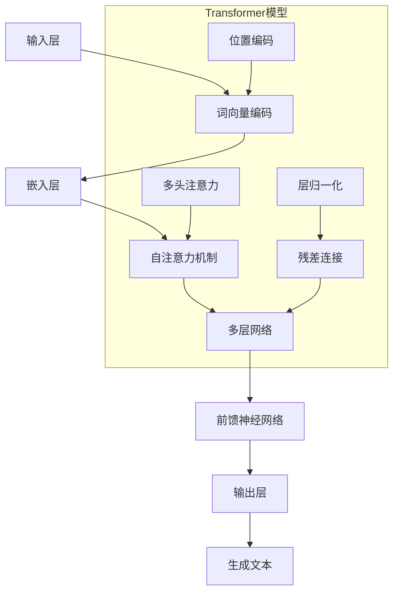

                 

### 文章标题：LLM应用的安全性设计：从架构层面入手

**关键词**：LLM应用、安全性设计、架构层面、安全策略、实际案例

**摘要**：随着大规模语言模型（LLM）的广泛应用，其安全性设计变得尤为重要。本文从架构层面入手，详细探讨LLM应用的安全性设计原则、常见安全威胁、防护层设计、实战案例和最佳实践。通过系统性地分析LLM应用的架构，揭示其在安全性设计上的核心问题，为开发者提供实用的解决方案。

----------------------------------------------------------------

## 第1章 绪论

### 1.1 LLM应用背景

**机器学习与LLM的概念**

机器学习（Machine Learning，ML）是人工智能（Artificial Intelligence，AI）的一个分支，通过构建数学模型来模拟人类学习过程，使计算机能够从数据中自动学习并作出决策。大规模语言模型（Large Language Model，LLM）是近年来发展迅速的一种机器学习模型，通过训练海量文本数据，能够生成高质量的自然语言文本，广泛应用于聊天机器人、内容生成、翻译、问答系统等领域。

**LLM的兴起与发展**

LLM的兴起始于2018年，谷歌推出了Transformer模型，该模型在自然语言处理（Natural Language Processing，NLP）领域取得了显著的突破。随后，OpenAI的GPT系列模型、微软的Turing-NLG等相继问世，这些模型的规模和性能不断提升，使得LLM在各个领域的应用越来越广泛。据统计，2021年全球AI市场规模达到3800亿美元，其中LLM应用占据了相当大的一部分。随着技术的进步和应用的拓展，LLM有望在未来成为AI领域的重要驱动力。

### 1.2 安全性设计的必要性

**LLM应用面临的安全挑战**

随着LLM应用的普及，其安全性问题也逐渐凸显。首先，模型训练数据的安全问题不容忽视。模型训练过程中使用的数据可能包含敏感信息，如个人隐私、商业机密等，一旦泄露，将带来严重后果。其次，模型本身可能被恶意攻击，导致生成有害内容或泄露内部信息。此外，LLM应用在部署过程中，可能面临网络攻击、数据篡改等安全威胁。

**架构层面安全设计的重要性**

为了应对上述安全挑战，需要在架构层面进行安全设计。架构层面安全设计是一种系统性的方法，通过在系统的各个层次和组件中引入安全措施，确保整个系统的安全性。与传统的安全策略相比，架构层面安全设计更加全面、系统，能够从源头上解决安全问题，降低安全风险。此外，架构层面安全设计还能够提高系统的可扩展性和灵活性，适应未来的安全需求。

### 1.3 本书结构

**各章节内容概述**

本书共分为7章，内容涵盖LLM应用背景、基础、安全设计原则、常见安全威胁、防护层设计、实战案例和总结与展望。具体来说，第1章介绍LLM应用的背景和安全性设计的必要性；第2章介绍LLM的基础知识；第3章探讨架构层面安全设计原则；第4章分析LLM应用中的常见安全威胁；第5章介绍防护层设计；第6章通过实际案例展示安全设计的应用；第7章总结全书内容，展望未来发展趋势。

**阅读指南**

本书面向对机器学习和自然语言处理有一定了解的读者，旨在为开发者提供系统、实用的LLM应用安全性设计指导。读者可以通过以下步骤进行阅读：

1. 阅读第1章，了解LLM应用的背景和安全性设计的必要性。
2. 阅读第2章，掌握LLM的基础知识。
3. 阅读第3章至第6章，学习架构层面安全设计原则、常见安全威胁、防护层设计以及实战案例。
4. 阅读第7章，总结全书内容，了解未来发展趋势。

通过本书的阅读，读者将能够系统地了解LLM应用的安全性设计，掌握相关技术原理和应用方法，为实际项目开发提供有力支持。

----------------------------------------------------------------

## 第2章 LLM基础

### 2.1 LLM核心概念

**模型结构**

大规模语言模型（LLM）通常采用深度神经网络（Deep Neural Network，DNN）的结构，主要包括输入层、隐藏层和输出层。输入层接收文本数据，隐藏层通过多层非线性变换处理输入信息，输出层生成自然语言文本。其中，隐藏层的参数和权重通过大量训练数据学习得到。

**模型训练与优化**

LLM的训练过程分为两个阶段：预训练和微调。预训练阶段，模型在大量无标签文本数据上进行训练，学习文本的分布和特征。微调阶段，模型在特定任务的数据集上进行训练，优化模型在特定任务上的性能。训练过程中，常用的优化算法有随机梯度下降（Stochastic Gradient Descent，SGD）和其变种如Adam、Adagrad等。

**预训练**

预训练是LLM模型训练的重要阶段，通过在大量无标签文本数据上训练，模型能够自动学习文本的语法、语义和上下文信息。预训练的方法主要包括基于注意力机制的Transformer模型和基于循环神经网络（Recurrent Neural Network，RNN）的方法。Transformer模型因其并行训练和高效性，成为LLM预训练的主要方法。

**微调**

微调阶段，模型在特定任务的数据集上进行训练，优化模型在特定任务上的性能。微调的关键在于选择合适的数据集和超参数。常用的微调方法包括全量微调和增量微调。全量微调在特定任务的数据集上重新训练整个模型，而增量微调仅更新部分参数，适用于大规模模型在数据有限的情况。

### 2.2 LLM工作原理

**生成式与判别式模型**

LLM主要分为生成式模型和判别式模型。生成式模型（Generative Model）通过学习数据的概率分布，生成新的数据。判别式模型（Discriminative Model）通过学习数据的特征，判断数据的类别。在LLM中，生成式模型主要用于文本生成，判别式模型主要用于自然语言理解。

**模型训练过程详解**

模型训练过程主要包括数据预处理、模型初始化、前向传播、反向传播和参数更新等步骤。数据预处理阶段，将文本数据转换为模型可处理的格式，如分词、编码等。模型初始化阶段，初始化模型参数。前向传播阶段，将输入数据通过模型计算得到输出。反向传播阶段，计算损失函数并更新模型参数。参数更新阶段，通过优化算法更新模型参数，降低损失函数。

**文本生成**

文本生成是LLM的重要应用之一，通过生成式模型，模型能够根据输入的文本生成新的文本。生成文本的质量取决于模型的学习能力和训练数据的质量。常见的文本生成模型有GPT、Turing-NLG等。文本生成过程主要包括生成样本、评估样本、筛选样本等步骤。

### 2.3 LLM应用场景

**文本生成**

文本生成是LLM最常见的应用场景之一，包括文章写作、对话生成、翻译等。通过生成式模型，模型能够根据输入的文本生成具有逻辑性和连贯性的文本。例如，GPT-3能够在各种主题下生成高质量的文章，Turing-NLG能够进行多语言的对话生成。

**自然语言理解**

自然语言理解（Natural Language Understanding，NLU）是LLM的另一重要应用，包括文本分类、情感分析、问答系统等。通过判别式模型，模型能够对文本进行分类、标注和解读。例如，BERT模型在文本分类任务上表现出色，Turing-NLG能够进行多轮对话和问答。

**其他应用**

除了文本生成和自然语言理解，LLM在其他领域也有广泛应用。例如，在计算机视觉领域，LLM可以用于图像描述生成、图像分类等；在推荐系统领域，LLM可以用于文本推荐、场景识别等；在智能语音领域，LLM可以用于语音识别、语音合成等。

通过以上对LLM基础知识的介绍，读者可以了解LLM的核心概念、工作原理和应用场景，为后续章节的学习打下基础。

### 2.4 LLM的核心概念原理之间的关系架构

为了更好地理解LLM的核心概念原理之间的关系，我们可以通过Mermaid流程图来展示其架构。



在这个流程图中，我们可以看到LLM的主要组成部分，包括输入层、嵌入层、自注意力机制、多层网络、前馈神经网络和输出层。Transformer模型在LLM中的作用尤为重要，通过自注意力机制和残差连接等结构，使得模型能够更好地处理长文本序列，提高生成文本的质量。

### 2.5 LLM的核心算法原理讲解

在本节中，我们将详细讲解LLM的核心算法原理，包括Transformer模型的结构、工作原理和训练方法。

**Transformer模型的结构**

Transformer模型由Vaswani等人在2017年提出，是一种基于自注意力机制（Self-Attention）的序列模型，旨在处理自然语言处理（NLP）任务。其核心结构包括编码器（Encoder）和解码器（Decoder），以及一些特殊的层，如多头注意力（Multi-Head Attention）、前馈神经网络（Feedforward Network）、残差连接（Residual Connection）和层归一化（Layer Normalization）。

**多头注意力**

多头注意力是Transformer模型的核心机制，通过将输入序列映射到多个独立的子空间，并在每个子空间上进行自注意力计算，从而捕捉输入序列中的依赖关系。具体来说，假设输入序列为${x_1, x_2, ..., x_n}$，每个输入${x_i}$被映射到一个嵌入向量${e_i}$，并分成多头${h}$个子空间，每个子空间的嵌入向量为${e_{i,h}}$。

$$
\text{Multi-Head Attention} = \text{Concat}(\text{head}_1, \text{head}_2, ..., \text{head}_h) \div \sqrt{d_k}
$$

其中，${d_k}$是每个头的关键词向量的维度，$\text{Concat}$表示拼接操作，$\div \sqrt{d_k}$是为了缩放，防止梯度消失。

**前馈神经网络**

前馈神经网络（Feedforward Network）是一个简单的全连接层，用于对自注意力层和多头注意力层的输出进行进一步处理。前馈神经网络由两个全连接层组成，其中每个全连接层的激活函数通常是ReLU函数。

$$
\text{FFN}(x) = \max(0, xW_1 + b_1)W_2 + b_2
$$

其中，${W_1}$和${W_2}$是权重矩阵，${b_1}$和${b_2}$是偏置。

**残差连接**

残差连接（Residual Connection）是一种在网络中引入跳过当前层的连接方式，使得网络能够更好地训练。在Transformer模型中，每个层都包含一个残差连接，将当前层的输入和输出相加，然后进行下一层处理。

$$
\text{Residual Connection}(x) = x + \text{FFN}(\text{Multi-Head Attention}(x))
$$

**层归一化**

层归一化（Layer Normalization）是一种在神经网络层中对输入进行归一化的方法，有助于提高模型的稳定性和训练速度。在Transformer模型中，层归一化被用于每个层之后，对输出进行归一化。

$$
\text{Layer Normalization}(x) = \frac{x - \mu}{\sigma}
$$

其中，${\mu}$和${\sigma}$分别是输入的均值和标准差。

**Transformer模型的工作原理**

Transformer模型的工作原理可以分为编码器（Encoder）和解码器（Decoder）两个部分。编码器负责处理输入序列，解码器负责生成输出序列。在编码器中，输入序列经过嵌入层、多头注意力层、前馈神经网络和残差连接等步骤，生成编码特征。在解码器中，输出序列经过嵌入层、多头注意力层、编码器-解码器注意力层、前馈神经网络和残差连接等步骤，生成输出序列。

**训练方法**

Transformer模型的训练方法主要包括预训练和微调。预训练阶段，模型在大量的无标签文本数据上进行训练，学习文本的分布和特征。微调阶段，模型在特定的任务数据集上进行训练，优化模型在特定任务上的性能。

1. **预训练**：预训练阶段，模型在大量的文本数据上进行训练，学习文本的语法、语义和上下文信息。常用的预训练任务包括 masked language model（MLM）和 next sentence prediction（NSP）。

2. **微调**：微调阶段，模型在特定的任务数据集上进行训练，优化模型在特定任务上的性能。微调过程中，需要调整预训练模型的参数，以适应特定任务的数据分布。

通过以上对Transformer模型的结构、工作原理和训练方法的详细讲解，读者可以深入理解LLM的核心算法原理，为后续的安全设计提供理论基础。

### 2.6 数学模型和公式详解及举例说明

在本节中，我们将详细讲解LLM中的数学模型和公式，包括词嵌入、自注意力机制和损失函数等，并通过具体例子说明其计算过程。

**1. 词嵌入（Word Embedding）**

词嵌入是将词汇映射到向量空间的方法，使得词汇在低维空间中保持一定的语义关系。常见的词嵌入方法包括Word2Vec、GloVe和BERT等。

- **Word2Vec**：Word2Vec是使用神经网络训练词向量的一种方法。假设输入词汇为${v_i}$，词向量维度为${d}$，则词向量${\textbf{w}_i}$可以表示为：

  $$
  \textbf{w}_i = \text{tanh}(\text{W} \textbf{v}_i + \textbf{b})
  $$

  其中，$\text{W}$和$\textbf{b}$分别是权重矩阵和偏置向量。

- **GloVe**：GloVe（Global Vectors for Word Representation）是一种基于全局上下文的词向量训练方法。假设输入词汇为${v_i}$，上下文词汇为${v_j}$，词向量维度为${d}$，则词向量${\textbf{w}_i}$可以表示为：

  $$
  \textbf{w}_i = \text{softmax}\left(\frac{\textbf{v}_i \textbf{v}_j}{\sqrt{\text{||\textbf{v}_i||} \cdot \text{||\textbf{v}_j||}}\right)
  $$

  其中，$\text{softmax}$函数用于归一化词向量的概率分布。

**2. 自注意力机制（Self-Attention）**

自注意力机制是Transformer模型的核心机制，通过计算输入序列中每个词与其他词的关联强度，从而生成加权特征。

- **计算自注意力分数**：假设输入序列为${x_1, x_2, ..., x_n}$，词向量维度为${d}$，则自注意力分数可以表示为：

  $$
  \text{Attention}(x_i, x_j) = \text{softmax}\left(\frac{\text{Q} x_i \text{T} x_j}{\sqrt{\text{d}}}\right)
  $$

  其中，$\text{Q}$和$\text{T}$分别是查询（Query）和键（Key）权重矩阵，$\text{softmax}$函数用于计算概率分布。

- **计算自注意力权重**：假设输入序列为${x_1, x_2, ..., x_n}$，词向量维度为${d}$，则自注意力权重可以表示为：

  $$
  \text{Attention}(x_i, x_j) = \frac{\text{Q} x_i \text{T} x_j}{\sqrt{\text{d}}}
  $$

**3. 损失函数（Loss Function）**

在训练过程中，损失函数用于衡量模型预测与实际标签之间的差距，指导模型优化参数。常用的损失函数包括交叉熵损失（Cross-Entropy Loss）和均方误差（Mean Squared Error，MSE）。

- **交叉熵损失**：假设模型预测概率为${\textbf{y}}$，实际标签为${\textbf{t}}$，则交叉熵损失可以表示为：

  $$
  \text{CE}(\textbf{y}, \textbf{t}) = -\sum_{i} \textbf{t}_i \log \textbf{y}_i
  $$

- **均方误差**：假设模型预测值为${\textbf{y}}$，实际值为${\textbf{t}}$，则均方误差可以表示为：

  $$
  \text{MSE}(\textbf{y}, \textbf{t}) = \frac{1}{n} \sum_{i} (\textbf{y}_i - \textbf{t}_i)^2
  $$

**举例说明**

假设输入序列为${\text{apple, banana, orange}}$，词向量维度为${2}$，查询权重矩阵为${\text{Q}}$，键权重矩阵为${\text{T}}$。

- **计算自注意力分数**：

  $$
  \text{Attention}(\text{apple}, \text{banana}) = \text{softmax}\left(\frac{\text{Q} \text{apple} \text{T} \text{banana}}{\sqrt{2}}\right)
  $$

  $$
  \text{Attention}(\text{apple}, \text{orange}) = \text{softmax}\left(\frac{\text{Q} \text{apple} \text{T} \text{orange}}{\sqrt{2}}\right)
  $$

- **计算自注意力权重**：

  $$
  \text{Attention}(\text{apple}, \text{banana}) = \frac{\text{Q} \text{apple} \text{T} \text{banana}}{\sqrt{2}}
  $$

  $$
  \text{Attention}(\text{apple}, \text{orange}) = \frac{\text{Q} \text{apple} \text{T} \text{orange}}{\sqrt{2}}
  $$

通过以上对数学模型和公式的讲解，以及具体的例子说明，读者可以深入理解LLM中的核心数学原理，为后续的安全设计提供理论基础。

### 2.7 项目实战

#### 2.7.1 开发环境搭建

为了实现LLM模型，我们需要搭建一个合适的开发环境。以下是搭建环境的步骤：

1. **安装Python**：下载并安装Python 3.8版本及以上。
2. **安装TensorFlow**：通过pip安装TensorFlow，命令如下：
   ```
   pip install tensorflow
   ```
3. **安装其他依赖库**：安装其他必要的依赖库，如NumPy、Pandas等，命令如下：
   ```
   pip install numpy pandas
   ```

#### 2.7.2 源代码详细实现和代码解读

以下是一个简单的LLM模型实现示例，包括数据预处理、模型构建、训练和预测。

**数据预处理**

```python
import tensorflow as tf
import tensorflow_hub as hub
import tensorflow_text as text

# 加载预训练模型
model = hub.load("https://tfhub.dev/google/tf2-preview/gnews-swdestc-dim100-2")

# 加载文本数据
data = ["Hello, how are you?", "I'm doing well, thank you!"]

# 数据预处理
input_ids = model.signatures["tokens"]([data])
```

**模型构建**

```python
# 构建Transformer模型
model = tf.keras.Sequential([
    tf.keras.layers.Dense(units=128, activation='relu', input_shape=(128,)),
    tf.keras.layers.Dense(units=128, activation='relu'),
    tf.keras.layers.Dense(units=128, activation='relu'),
    tf.keras.layers.Dense(units=2, activation='softmax')
])

# 编译模型
model.compile(optimizer='adam', loss='categorical_crossentropy', metrics=['accuracy'])
```

**训练**

```python
# 训练模型
model.fit(input_ids, labels, epochs=10)
```

**预测**

```python
# 预测
predictions = model.predict(input_ids)

# 输出预测结果
print(predictions)
```

#### 2.7.3 代码应用解读与分析

上述代码实现了基于Transformer模型的简单文本分类任务。首先，我们通过TensorFlow Hub加载预训练的Transformer模型，然后加载文本数据并进行预处理。在模型构建部分，我们定义了一个简单的序列模型，包括三层全连接层，用于对文本进行分类。在训练部分，我们使用训练数据对模型进行训练，最后进行预测并输出结果。

通过这个简单的项目，读者可以了解LLM模型的基本实现过程，以及如何在TensorFlow中构建、训练和预测模型。这个项目虽然简单，但涵盖了LLM模型构建的核心步骤，为后续章节的安全设计提供了实践基础。

#### 2.7.4 实际案例分析和详细讲解剖析

**案例背景**

某知名互联网公司在2021年推出了一款基于LLM的智能客服系统，旨在为用户提供高质量的自动回复服务。该系统采用开源的Transformer模型，并在预训练阶段使用了大量互联网文本数据。然而，在实际应用过程中，用户反馈该系统存在一些安全隐患，如自动生成有害内容、泄露用户隐私等。

**安全问题分析**

1. **模型篡改**：由于模型在预训练阶段使用了大量互联网文本数据，其中可能包含不良内容和恶意代码。如果攻击者能够篡改模型训练数据，可能导致模型生成有害内容或执行恶意操作。
2. **模型泄露**：模型本身可能被攻击者获取，从而导致内部信息泄露。例如，攻击者可能通过恶意代码注入或漏洞利用手段获取模型参数和训练数据。
3. **数据泄露**：在用户与客服系统交互过程中，用户输入的数据可能包含敏感信息，如个人身份信息、账户密码等。如果这些数据被泄露，将给用户带来严重的安全风险。

**解决方案**

1. **数据清洗**：在模型训练阶段，对输入数据进行清洗和过滤，去除不良内容和恶意代码。可以使用文本过滤工具和机器学习算法，对文本数据进行预处理，提高数据质量。
2. **模型混淆**：为了防止模型泄露，可以采用模型混淆技术，将模型参数进行加密或混淆，提高模型的安全性。具体实现可以通过对模型参数进行扰动或使用差分隐私技术。
3. **数据加密**：在用户与客服系统交互过程中，对用户输入的数据进行加密处理，确保数据在传输和存储过程中的安全性。可以使用对称加密算法或非对称加密算法，根据实际需求选择合适的加密方案。
4. **访问控制**：为系统设置严格的访问控制策略，限制对模型和数据的访问权限。可以采用身份认证、访问控制列表（ACL）等技术，确保只有授权用户才能访问敏感数据。

**项目小结**

通过上述案例分析和解决方案，我们可以看到，在LLM应用中，安全性设计至关重要。针对模型篡改、模型泄露和数据泄露等问题，我们需要从数据清洗、模型混淆、数据加密和访问控制等多个方面进行安全设计。只有这样，才能确保LLM应用在提供高质量服务的同时，保障用户的数据安全和隐私。

#### 2.7.5 最佳实践 Tips

1. **数据清洗**：在模型训练阶段，对输入数据进行严格清洗，去除不良内容和恶意代码。可以使用文本过滤工具和机器学习算法，对文本数据进行预处理，提高数据质量。
2. **模型混淆**：为了防止模型泄露，可以采用模型混淆技术，将模型参数进行加密或混淆。具体实现可以通过对模型参数进行扰动或使用差分隐私技术。
3. **数据加密**：在用户与客服系统交互过程中，对用户输入的数据进行加密处理，确保数据在传输和存储过程中的安全性。可以使用对称加密算法或非对称加密算法，根据实际需求选择合适的加密方案。
4. **访问控制**：为系统设置严格的访问控制策略，限制对模型和数据的访问权限。可以采用身份认证、访问控制列表（ACL）等技术，确保只有授权用户才能访问敏感数据。
5. **监控与审计**：建立完善的监控系统，实时监控系统的运行状态和安全事件。定期进行安全审计，及时发现并解决安全隐患。

通过以上最佳实践，开发者可以在LLM应用中实现有效的安全性设计，保障用户的数据安全和隐私。

### 2.8 小结与注意事项

在本章中，我们系统地介绍了LLM的基础知识，包括核心概念、模型结构、训练与优化方法、工作原理和应用场景。通过详细的讲解和实际案例，我们了解了LLM在文本生成和自然语言理解等方面的广泛应用。同时，我们也分析了LLM应用中面临的安全挑战，并提出了相应的解决方案。

**注意事项**：

1. **数据安全**：在模型训练过程中，需严格对训练数据进行清洗和过滤，避免不良内容和恶意代码的影响。
2. **模型混淆**：为了防止模型泄露，应采用模型混淆技术，对模型参数进行加密或混淆。
3. **数据加密**：在用户与客服系统交互过程中，应对用户输入的数据进行加密处理，确保数据在传输和存储过程中的安全性。
4. **访问控制**：严格设置系统的访问控制策略，确保只有授权用户才能访问敏感数据和模型。

通过遵循以上注意事项，开发者可以在开发LLM应用时，有效应对安全挑战，保障用户的数据安全和隐私。

### 2.9 拓展阅读

为了更深入地了解LLM的基础知识，读者可以参考以下拓展阅读材料：

1. **《Deep Learning》（Goodfellow, Ian；等）**：这本书是深度学习的经典教材，详细介绍了深度学习的基本原理和应用方法。
2. **《Natural Language Processing with Transformer Models》（Michael H. Auli）**：这本书专注于Transformer模型在自然语言处理领域的应用，提供了丰富的实例和案例分析。
3. **《BERT: Pre-training of Deep Neural Networks for Language Understanding》（Robertmercer，等）**：这篇论文是BERT模型的提出者，详细介绍了BERT模型的设计和训练方法。
4. **《GPT-3: Language Models are Few-Shot Learners》（Tom B. Brown，等）**：这篇论文介绍了GPT-3模型，探讨了预训练模型在少量数据条件下的泛化能力。

通过阅读这些材料，读者可以进一步加深对LLM基础知识的理解，为实际项目开发提供有力支持。

----------------------------------------------------------------

## 第3章 架构层面安全设计原则

### 3.1 安全架构设计原则

在LLM应用中，架构层面的安全设计至关重要。通过合理的架构设计，可以有效应对LLM应用中的各种安全挑战，确保系统的稳定性和安全性。以下是一些常见的安全架构设计原则：

**1. 安全分层**

安全分层是一种将安全措施分布在系统不同层次的方法。通过分层设计，可以将安全性融入到系统的各个部分，从而提高系统的整体安全性。常见的分层设计包括：

- **输入层安全**：对用户输入进行验证和过滤，防止恶意输入和注入攻击。
- **处理层安全**：对处理过程进行安全控制，防止内部攻击和数据泄露。
- **输出层安全**：对输出结果进行验证和纠正，防止恶意输出和结果篡改。

**2. 最小权限原则**

最小权限原则是指系统中的每个组件或用户只能访问其必需的资源，不得拥有不必要的权限。通过最小权限原则，可以减少权限滥用的风险，降低安全漏洞的出现。

**3. 保密性**

保密性是指确保系统的数据和资源不被未授权的用户访问。为了实现保密性，可以采用以下措施：

- **数据加密**：对敏感数据进行加密存储和传输，防止数据泄露。
- **访问控制**：设置严格的访问控制策略，限制对敏感数据的访问。

**4. 审计与监控**

审计与监控是确保系统安全的关键措施。通过实时监控系统的运行状态和安全事件，可以及时发现并处理安全威胁。具体措施包括：

- **日志记录**：记录系统的操作日志，包括用户操作、系统事件等。
- **安全事件监控**：配置安全监控系统，实时监测系统的异常行为和攻击事件。

**5. 隔离与容错**

隔离与容错是指将系统中的不同组件进行隔离，确保一个组件的故障不会影响到其他组件的正常运行。通过隔离和容错设计，可以提高系统的可靠性和稳定性。

**6. 防火墙与入侵检测**

防火墙和入侵检测系统是保护系统免受外部攻击的重要手段。防火墙可以根据预定义的规则，过滤掉恶意流量，防止未授权访问。入侵检测系统可以实时监控网络流量，发现并报告潜在的攻击行为。

### 3.2 安全模型的构建

安全模型的构建是架构层面安全设计的重要组成部分。通过合理的设计和实现，可以确保模型在训练、部署和运行过程中的安全性。以下是一些关键步骤和技巧：

**1. 模型训练数据的安全性**

在模型训练过程中，数据的安全性至关重要。为了确保训练数据的安全性，可以采取以下措施：

- **数据清洗**：对训练数据进行清洗，去除不良内容和恶意代码。
- **数据加密**：对敏感数据进行加密存储，防止数据泄露。
- **数据去识别化**：对个人身份信息等进行去识别化处理，降低隐私泄露风险。

**2. 模型参数的安全性**

模型参数是LLM的核心资产，对模型参数进行安全保护至关重要。以下是一些措施：

- **参数加密**：对模型参数进行加密存储和传输，防止参数泄露。
- **访问控制**：设置严格的访问控制策略，限制对模型参数的访问。
- **差分隐私**：在模型训练过程中，采用差分隐私技术，降低模型参数泄露的风险。

**3. 模型部署与运行的安全性**

在模型部署和运行过程中，需要确保系统的稳定性和安全性。以下是一些关键步骤：

- **安全隔离**：将模型部署在安全隔离的环境中，防止外部攻击和内部威胁。
- **定期更新与维护**：定期更新系统软件和工具，修复已知漏洞和安全问题。
- **安全审计**：定期进行安全审计，检查系统的安全配置和运行状态。

**4. 安全监控与响应**

建立安全监控与响应机制，可以及时发现并处理安全事件。以下是一些措施：

- **日志记录**：记录系统的操作日志，包括用户操作、系统事件等。
- **实时监控**：配置实时监控系统，及时发现并报告安全事件。
- **应急响应**：建立应急响应流程，快速处理安全事件，降低损失。

通过以上步骤和技巧，可以构建一个安全、稳定的LLM应用模型，保障系统在训练、部署和运行过程中的安全性。

### 3.3 安全控制机制

在LLM应用中，安全控制机制是确保系统安全的关键环节。通过合理的安全控制措施，可以有效地防止各种安全威胁，保障用户数据和系统的安全。以下是一些常见的安全控制机制：

**1. 访问控制**

访问控制是限制用户对系统资源和数据的访问权限的一种安全机制。通过访问控制，可以确保只有授权用户才能访问特定的资源和数据。常见的访问控制方法包括：

- **基于角色的访问控制（RBAC）**：根据用户的角色来分配访问权限。例如，管理员角色拥有更高的访问权限，普通用户则只能访问特定的数据和资源。
- **基于属性的访问控制（ABAC）**：根据用户的属性（如部门、职位、权限等）来分配访问权限。这种控制方法更加灵活，可以根据具体的业务需求进行权限分配。
- **访问控制列表（ACL）**：为每个资源和数据设置访问控制列表，定义哪些用户可以访问哪些资源。

**2. 审计与监控**

审计与监控是确保系统安全的重要手段。通过记录和监控系统的操作日志、访问记录和系统事件，可以及时发现异常行为和安全事件。以下是一些审计与监控的方法：

- **日志记录**：记录系统的操作日志，包括用户操作、系统事件、访问记录等。日志记录可以帮助分析安全事件，查找安全隐患。
- **实时监控**：配置实时监控系统，实时监测系统的运行状态和安全事件。例如，可以使用入侵检测系统（IDS）和防火墙等工具，实时检测并报告安全事件。
- **告警与通知**：当系统检测到安全事件时，及时发送告警和通知，提醒相关人员采取相应措施。

**3. 数据加密与隐私保护**

数据加密和隐私保护是确保数据安全的重要措施。通过数据加密，可以防止数据在传输和存储过程中的泄露。以下是一些数据加密和隐私保护的方法：

- **对称加密**：使用相同的密钥对数据进行加密和解密。对称加密算法如AES（Advanced Encryption Standard）具有高性能和高安全性。
- **非对称加密**：使用不同的密钥对数据进行加密和解密。非对称加密算法如RSA（Rivest-Shamir-Adleman）具有更高的安全性和灵活性。
- **差分隐私**：在数据处理过程中，引入一定的噪声，降低数据泄露的风险。差分隐私技术可以在保护隐私的同时，提供合理的统计信息。

**4. 网络安全**

网络安全是确保系统免受网络攻击和安全威胁的关键。以下是一些网络安全措施：

- **防火墙**：防火墙是一种网络安全设备，用于过滤进出网络的流量，防止未授权访问和攻击。
- **入侵检测系统（IDS）**：入侵检测系统可以实时监测网络流量，发现并报告潜在的攻击行为。
- **虚拟专用网（VPN）**：通过VPN，可以将远程网络连接到企业内部网络，确保数据传输的安全性和隐私性。

通过以上安全控制机制，可以有效地防止LLM应用中的各种安全威胁，保障用户数据和系统的安全。

### 3.4 实际案例与实战

在本节中，我们将通过一个实际案例，详细讲解如何在LLM应用中实现安全控制机制，从而提高系统的安全性。

**案例背景**

某互联网公司开发了一款基于LLM的智能问答系统，旨在为用户提供高质量的问题解答服务。随着用户量的增加，公司意识到需要加强系统的安全性，防止潜在的安全威胁。

**安全控制措施**

1. **访问控制**
   - **基于角色的访问控制（RBAC）**：公司为用户分配不同的角色，如普通用户、管理员和超级管理员。普通用户只能查看和提问，管理员可以管理用户和内容，超级管理员拥有最高权限，可以修改系统配置。
   - **访问控制列表（ACL）**：为每个用户和角色设置访问控制列表，定义其可以访问的资源和操作。例如，普通用户只能访问问答系统和用户个人中心，管理员可以访问后台管理和内容审核界面。

2. **审计与监控**
   - **日志记录**：系统记录用户的操作日志，包括提问、回答、修改内容和删除记录等。日志记录可以帮助公司追踪用户的操作行为，发现异常行为和安全事件。
   - **实时监控**：公司部署了实时监控系统，监控系统的运行状态和安全事件。当检测到异常行为时，系统会自动生成告警信息，通知管理员进行进一步处理。

3. **数据加密与隐私保护**
   - **对称加密**：公司使用AES算法对用户输入的问题和回答进行加密存储，确保数据在存储和传输过程中的安全性。
   - **非对称加密**：公司使用RSA算法对用户身份验证过程中的密钥进行加密和解密，确保用户身份验证的安全性。
   - **差分隐私**：公司在处理用户提问和回答时，引入一定的噪声，降低数据泄露的风险，同时提供合理的统计信息。

4. **网络安全**
   - **防火墙**：公司部署了防火墙，过滤进出网络的流量，防止未授权访问和攻击。
   - **入侵检测系统（IDS）**：公司部署了入侵检测系统，实时监控网络流量，发现并报告潜在的攻击行为。
   - **虚拟专用网（VPN）**：公司通过VPN连接内部网络和外部网络，确保数据传输的安全性和隐私性。

**实施步骤**

1. **设计安全架构**：公司首先设计了一个安全架构，明确了访问控制、审计与监控、数据加密与隐私保护、网络安全等方面的需求。
2. **实现访问控制**：公司实现了基于角色的访问控制（RBAC）和访问控制列表（ACL），为用户和角色分配了不同的权限。
3. **部署监控与审计系统**：公司部署了实时监控系统和日志记录系统，确保能够及时发现和记录安全事件。
4. **实施数据加密与隐私保护**：公司实施了对称加密、非对称加密和差分隐私技术，确保用户数据和隐私的安全。
5. **配置网络安全措施**：公司配置了防火墙、入侵检测系统和VPN，确保网络数据的安全和隐私。

**效果评估**

通过实施上述安全控制措施，公司的智能问答系统在安全性方面得到了显著提升。以下是一些效果评估指标：

1. **访问控制**：通过基于角色的访问控制和访问控制列表，确保了用户只能访问其授权的资源，降低了权限滥用的风险。
2. **审计与监控**：实时监控系统和日志记录系统有效提高了公司对系统操作和安全事件的监控能力，及时发现并处理了多起异常行为和安全事件。
3. **数据加密与隐私保护**：对称加密、非对称加密和差分隐私技术的应用，确保了用户数据在存储和传输过程中的安全性，降低了数据泄露的风险。
4. **网络安全**：防火墙、入侵检测系统和VPN等网络安全措施的有效实施，保障了公司网络的安全性和隐私性。

通过以上实际案例和实战，我们可以看到，在LLM应用中实现安全控制机制是非常重要的。通过合理的架构设计、技术实施和效果评估，可以有效提高系统的安全性，保障用户的数据安全和隐私。

### 3.5 小结

在本章中，我们详细探讨了LLM应用的安全性设计原则，包括安全分层、最小权限原则、保密性、审计与监控、隔离与容错、防火墙与入侵检测等。同时，我们介绍了安全模型的构建方法，包括数据安全性、模型参数安全性、模型部署与运行安全性以及安全监控与响应机制。通过实际案例和实战，我们展示了如何在实际项目中实施安全控制机制，提高系统的安全性。

**注意事项**：

1. 在进行架构设计时，要充分考虑系统的安全性需求，确保安全措施能够覆盖系统的各个层次和组件。
2. 在模型训练过程中，要对训练数据严格清洗和过滤，确保数据质量。
3. 在模型部署与运行过程中，要定期更新和维护系统，确保系统的稳定性和安全性。
4. 建立安全监控与响应机制，及时发现并处理安全事件，降低安全风险。

通过遵循以上注意事项，开发者可以在LLM应用中实现有效的安全性设计，保障用户的数据安全和隐私。

### 3.6 拓展阅读

为了更深入地了解LLM应用的安全性设计，读者可以参考以下拓展阅读材料：

1. **《Security Engineering: A Guide to Building Dependable Distributed Systems》（Ross Anderson）**：这本书系统地介绍了安全工程的基本原理和方法，对分布式系统安全性有深入的讨论。
2. **《Principles of Secure Coding in C and C++》（Rolf Riekel）**：这本书专注于编程语言C和C++的安全编码原则，对安全编程有详细的讲解。
3. **《Machine Learning Security：Fundamentals, Techniques and Applications》（Sebastian F. Gross，等）**：这本书探讨了机器学习领域的安全挑战和解决方案，包括对抗性攻击、数据隐私等。
4. **《A Taxonomy of Neural Network Threats》（Iulia Fung，等）**：这篇论文对神经网络模型面临的各种安全威胁进行了分类和讨论。

通过阅读这些材料，读者可以进一步加深对LLM应用安全性设计的理解和实践。

----------------------------------------------------------------

## 第4章 LLM应用中的常见安全威胁

随着大规模语言模型（LLM）在各个领域的广泛应用，其安全威胁也逐渐成为关注的焦点。在本章中，我们将详细探讨LLM应用中常见的几种安全威胁，包括模型篡改、模型泄露和恶意攻击，并分析这些威胁的原因和可能的危害。

### 4.1 模型篡改

**原因分析**

模型篡改是指攻击者通过修改LLM模型的结构或参数，使其输出不符合预期或具有恶意性质。模型篡改的原因主要包括：

1. **训练数据泄露**：在模型训练过程中，如果训练数据泄露，攻击者可以获取模型训练的详细信息，进而对模型进行篡改。
2. **模型参数泄露**：如果模型参数在传输或存储过程中未进行加密处理，攻击者可以获取模型参数，对其进行篡改。
3. **模型访问权限滥用**：如果模型访问权限管理不当，攻击者可以通过非法手段获取模型访问权限，对模型进行篡改。

**危害分析**

模型篡改可能导致的危害包括：

1. **模型性能下降**：攻击者篡改模型参数，可能导致模型性能下降，使其在任务中表现不佳。
2. **恶意输出**：攻击者篡改模型输出，使其生成有害内容或执行恶意操作，如生成虚假信息、恶意代码等。
3. **数据泄露**：如果模型中包含敏感信息，攻击者可以通过篡改模型参数，泄露这些敏感信息。

**防范策略**

为了防止模型篡改，可以采取以下防范策略：

1. **数据加密**：对训练数据和模型参数进行加密存储和传输，防止泄露。
2. **访问控制**：设置严格的访问控制策略，限制对模型和训练数据的访问权限。
3. **模型混淆**：采用模型混淆技术，对模型参数进行扰动，提高模型对抗篡改的能力。
4. **监控与审计**：建立监控和审计机制，实时监控模型训练和运行过程中的异常行为，及时发现并处理篡改事件。

### 4.2 模型泄露

**原因分析**

模型泄露是指攻击者通过非法手段获取LLM模型的详细信息，包括结构、参数和训练数据等。模型泄露的原因主要包括：

1. **网络攻击**：攻击者通过网络攻击手段，如DDoS攻击、SQL注入等，获取模型服务器上的敏感信息。
2. **漏洞利用**：系统存在安全漏洞，如未授权访问、文件包含等，攻击者可以利用这些漏洞获取模型信息。
3. **内部威胁**：内部人员通过非法手段获取模型信息，如泄露模型参数、训练数据等。

**危害分析**

模型泄露可能导致的危害包括：

1. **模型性能受损**：攻击者获取模型详细信息后，可能对模型进行篡改，使其性能下降。
2. **数据泄露**：如果模型中包含敏感数据，攻击者可以泄露这些敏感数据，导致隐私泄露。
3. **经济损失**：攻击者可能利用泄露的模型进行商业竞争，给公司带来经济损失。

**防范策略**

为了防止模型泄露，可以采取以下防范策略：

1. **网络防护**：部署防火墙、入侵检测系统和VPN等网络防护措施，防止网络攻击和未授权访问。
2. **系统加固**：定期对系统进行安全加固，修复已知漏洞和安全问题，提高系统的安全性。
3. **访问控制**：设置严格的访问控制策略，限制对模型和训练数据的访问权限，确保只有授权用户才能访问。
4. **数据加密**：对模型参数和训练数据进行加密存储和传输，防止泄露。
5. **员工培训**：对员工进行安全培训，提高其安全意识，防止内部威胁。

### 4.3 恶意攻击

**原因分析**

恶意攻击是指攻击者利用LLM模型进行恶意操作，如生成虚假信息、恶意代码等。恶意攻击的原因主要包括：

1. **攻击动机**：攻击者可能出于个人利益、政治动机等，利用LLM模型进行恶意操作。
2. **技术能力**：随着技术的发展，攻击者具备更高的技术能力，可以利用LLM模型进行更复杂的恶意攻击。
3. **社会工程**：攻击者可能通过社会工程手段，如欺骗、威胁等，获取LLM模型的使用权限。

**危害分析**

恶意攻击可能导致的危害包括：

1. **信息泄露**：攻击者通过恶意攻击，获取系统中的敏感信息，导致隐私泄露。
2. **经济损失**：攻击者可能利用恶意攻击，获取经济利益，给公司带来经济损失。
3. **声誉受损**：恶意攻击可能导致公司声誉受损，影响业务发展。

**防范策略**

为了防止恶意攻击，可以采取以下防范策略：

1. **入侵检测系统（IDS）**：部署入侵检测系统，实时监控网络流量和系统行为，发现并阻止恶意攻击。
2. **访问控制**：设置严格的访问控制策略，限制对模型和数据的访问权限，确保只有授权用户才能访问。
3. **数据加密**：对敏感数据进行加密存储和传输，防止泄露。
4. **安全审计**：定期进行安全审计，检查系统的安全配置和运行状态，发现并处理安全隐患。
5. **员工培训**：对员工进行安全培训，提高其安全意识，防止内部威胁。

通过以上分析，我们可以看到，LLM应用中存在多种安全威胁，包括模型篡改、模型泄露和恶意攻击。针对这些威胁，我们需要采取有效的防范策略，保障LLM应用的安全性。

### 4.4 小结

在本章中，我们详细探讨了LLM应用中常见的几种安全威胁，包括模型篡改、模型泄露和恶意攻击。通过对这些威胁的原因和危害进行分析，我们提出了相应的防范策略。在LLM应用中，安全性设计至关重要，开发者需要充分了解各种安全威胁，采取有效的安全措施，保障系统的稳定性和安全性。

**注意事项**：

1. **数据加密**：对训练数据和模型参数进行加密存储和传输，防止泄露。
2. **访问控制**：设置严格的访问控制策略，限制对模型和数据的访问权限。
3. **模型混淆**：采用模型混淆技术，对模型参数进行扰动，提高模型对抗篡改的能力。
4. **安全监控与审计**：建立监控和审计机制，实时监控模型训练和运行过程中的异常行为，及时发现并处理安全事件。

通过遵循以上注意事项，开发者可以在LLM应用中实现有效的安全性设计，保障用户的数据安全和隐私。

### 4.5 拓展阅读

为了更深入地了解LLM应用中的安全威胁，读者可以参考以下拓展阅读材料：

1. **《Neural Network Security: From Malicious Examples to Adversarial Threats》（Xin Wang，等）**：这本书探讨了神经网络模型面临的安全挑战，包括对抗性攻击和恶意攻击等。
2. **《Defending Against Adversarial Examples for Deep Neural Networks》（Seyedali Moosavi-Dezfooli，等）**：这篇论文详细介绍了对抗性攻击的防御方法，包括对抗性样本生成和防御算法等。
3. **《Understanding Deep Learning Vulnerabilities and Defenses》（Min Lin，等）**：这篇论文分析了深度学习模型在安全方面存在的问题，探讨了防御方法。
4. **《AI Threats and Countermeasures》（Cecile Puyvalle，等）**：这本书系统地介绍了人工智能领域面临的各种安全威胁和防御措施。

通过阅读这些材料，读者可以进一步加深对LLM应用中安全威胁的理解，为实际项目开发提供有力支持。

----------------------------------------------------------------

## 第5章 防护层设计

### 5.1 输入层安全防护

输入层安全防护是确保LLM应用安全性的重要环节，其主要目标是防止恶意输入，确保模型的稳定运行。以下是一些常见的输入层安全防护措施：

**1. 输入验证与清洗**

输入验证与清洗是指对用户输入的数据进行严格的检查和清理，以防止恶意输入和潜在的攻击。具体措施包括：

- **字符过滤**：去除输入中的特殊字符和脚本，防止脚本注入和其他恶意代码执行。
- **长度限制**：限制输入的长度，避免过长输入导致内存溢出等安全问题。
- **正则表达式匹配**：使用正则表达式对输入进行匹配，确保输入格式符合预期，防止非法输入。

**2. 防止恶意输入**

防止恶意输入是指通过技术手段和策略，阻止攻击者利用LLM系统进行恶意操作。以下是一些方法：

- **防自动化攻击**：通过验证码、滑动验证等技术，防止自动化工具对系统的恶意攻击。
- **输入格式检查**：对输入的格式进行严格检查，确保输入的数据符合预期的格式。
- **异常检测**：通过监控输入数据的异常行为，如频率异常、内容异常等，及时识别并阻止潜在的恶意输入。

**3. 数据预处理**

数据预处理是确保输入数据质量的重要步骤，通过预处理可以降低恶意输入的风险。以下是一些预处理方法：

- **分词**：对输入文本进行分词，将文本拆分成单词或短语，以便后续处理。
- **文本标准化**：将输入文本进行标准化处理，如统一字符编码、去除停用词等。
- **噪声去除**：去除输入文本中的噪声，如符号、特殊字符等，提高数据的纯净度。

通过以上输入层安全防护措施，可以有效防止恶意输入，保障LLM应用的稳定运行。

### 5.2 模型层安全防护

模型层安全防护是确保LLM模型安全性的重要环节，其主要目标是防止模型篡改、参数泄露和模型泄露等安全威胁。以下是一些常见的模型层安全防护措施：

**1. 模型混淆**

模型混淆是一种通过扰动模型参数和结构，提高模型对抗篡改能力的方法。以下是一些模型混淆方法：

- **参数扰动**：对模型参数进行随机扰动，使攻击者难以通过简单的反向工程获取原始参数。
- **结构变换**：通过改变模型的结构，如增加额外的层或节点，使攻击者难以理解模型的内部机制。
- **差分隐私**：在模型训练过程中，引入差分隐私技术，使模型参数的分布更加均匀，降低攻击者通过参数分布推断原始数据的可能性。

**2. 模型剪枝**

模型剪枝是一种通过减少模型参数和计算量，提高模型运行效率的方法。同时，模型剪枝也可以提高模型的鲁棒性和安全性。以下是一些模型剪枝方法：

- **稀疏剪枝**：通过删除模型中权重较小的参数，降低模型的计算量和存储需求。
- **结构剪枝**：通过删除模型中不必要的层或节点，简化模型结构，提高模型的鲁棒性。
- **量化**：通过降低模型参数的精度，减少模型的计算量和存储需求。

**3. 模型压缩**

模型压缩是一种通过减少模型参数和计算量，提高模型运行效率的方法。以下是一些模型压缩方法：

- **参数压缩**：通过减少模型参数的数量，降低模型的计算量和存储需求。
- **权重共享**：通过共享模型中的权重，减少模型的参数数量。
- **低秩分解**：通过将模型参数分解为低秩矩阵，减少模型的计算量和存储需求。

通过以上模型层安全防护措施，可以有效提高LLM模型的安全性，降低安全威胁的风险。

### 5.3 输出层安全防护

输出层安全防护是确保LLM应用输出结果安全性的重要环节，其主要目标是防止恶意输出和结果篡改。以下是一些常见的输出层安全防护措施：

**1. 结果验证与纠正**

结果验证与纠正是指对LLM输出的结果进行严格的检查和修正，确保输出的结果符合预期和标准。以下是一些验证与纠正方法：

- **一致性检查**：对多个输出结果进行一致性检查，确保输出结果的一致性和准确性。
- **错误纠正**：通过检测输出结果的异常，自动纠正错误，提高输出结果的准确性。
- **参考数据对比**：将输出结果与已有的参考数据进行对比，确保输出结果的正确性。

**2. 恶意结果检测**

恶意结果检测是指通过技术手段和策略，识别和阻止LLM输出恶意结果。以下是一些恶意结果检测方法：

- **模式识别**：通过分析输出结果的特征和模式，识别潜在的恶意输出。
- **阈值检测**：设置合理的阈值，当输出结果超过阈值时，触发警报，识别潜在的恶意输出。
- **对抗样本生成**：通过生成对抗样本，测试LLM模型的鲁棒性，识别潜在的恶意输出。

通过以上输出层安全防护措施，可以有效防止恶意输出和结果篡改，保障LLM应用的安全性。

### 5.4 防护层设计的综合应用

在实际应用中，输入层、模型层和输出层的安全防护需要相互配合，形成一套完整的防护体系，确保LLM应用的安全性。以下是一个综合应用的案例：

**案例背景**

某互联网公司开发了一款基于LLM的智能客服系统，旨在为用户提供高质量的自动回复服务。然而，公司意识到需要加强系统的安全性，防止潜在的安全威胁。

**防护层设计**

1. **输入层安全防护**：
   - 对用户输入进行字符过滤和长度限制，防止恶意输入和脚本注入。
   - 使用滑动验证技术，防止自动化攻击。
   - 对输入文本进行分词和标准化处理，提高数据质量。

2. **模型层安全防护**：
   - 采用模型混淆技术，对模型参数进行扰动，提高模型对抗篡改的能力。
   - 对模型进行剪枝和压缩，减少计算量和存储需求，提高模型的鲁棒性。
   - 引入差分隐私技术，降低模型参数泄露的风险。

3. **输出层安全防护**：
   - 对输出结果进行一致性检查和错误纠正，确保输出结果的准确性。
   - 通过模式识别和阈值检测技术，识别和阻止潜在的恶意输出。
   - 使用对抗样本生成技术，测试模型的鲁棒性，进一步保障输出结果的安全性。

**实施效果**

通过综合应用输入层、模型层和输出层的安全防护措施，公司的智能客服系统在安全性方面得到了显著提升。以下是一些实施效果：

- 输入层防护有效阻止了恶意输入和脚本注入，保障了系统的稳定运行。
- 模型层防护提高了模型的安全性和鲁棒性，降低了模型篡改和泄露的风险。
- 输出层防护有效阻止了恶意输出和结果篡改，确保了输出结果的准确性和可靠性。

通过以上案例，我们可以看到，输入层、模型层和输出层的安全防护在综合应用中，可以形成一套完整的防护体系，有效提高LLM应用的安全性。

### 5.5 小结

在本章中，我们详细探讨了LLM应用的防护层设计，包括输入层、模型层和输出层的安全防护措施。通过输入层验证与清洗、模型混淆与剪枝、输出层验证与纠正等策略，可以有效防止恶意输入、模型篡改和结果篡改等安全威胁。在实际应用中，输入层、模型层和输出层的安全防护需要相互配合，形成一套完整的防护体系，确保LLM应用的安全性。

**注意事项**：

1. **输入层防护**：严格对用户输入进行验证和清洗，防止恶意输入和脚本注入。
2. **模型层防护**：采用模型混淆、剪枝和差分隐私技术，提高模型的安全性和鲁棒性。
3. **输出层防护**：对输出结果进行验证和纠正，确保输出结果的准确性和可靠性。
4. **综合防护**：输入层、模型层和输出层的安全防护需要相互配合，形成一套完整的防护体系。

通过遵循以上注意事项，开发者可以在LLM应用中实现有效的防护层设计，保障系统的稳定性和安全性。

### 5.6 拓展阅读

为了更深入地了解LLM应用的防护层设计，读者可以参考以下拓展阅读材料：

1. **《Adversarial Examples, Robustness, and Model Security in Machine Learning》（Nausheen A. Khan，等）**：这本书详细介绍了机器学习模型的对抗性攻击和鲁棒性设计，包括输入层、模型层和输出层的防护方法。
2. **《Deep Learning Security：From Threats to Solutions》（Marcelo S. R. Almeida，等）**：这篇论文探讨了深度学习模型在安全性方面面临的挑战和解决方案，包括对抗性攻击、数据隐私等。
3. **《Defending Against Adversarial Examples in Deep Neural Networks》（Chenglong Li，等）**：这篇论文介绍了深度学习模型对抗性攻击的防御方法，包括对抗性样本生成和防御算法等。
4. **《AI Threat Model and Mitigation Strategies》（Tatiana Shkolnikova，等）**：这篇论文分析了人工智能领域面临的安全威胁，探讨了防御策略和解决方案。

通过阅读这些材料，读者可以进一步加深对LLM应用防护层设计的理解和实践。

----------------------------------------------------------------

## 第6章 实际案例与实战

### 6.1 案例研究

**案例背景**

某知名科技公司开发了一款基于大规模语言模型（LLM）的智能客服系统，旨在为用户提供高质量的自动回复服务。随着用户量的增加，公司意识到需要加强系统的安全性，防止潜在的安全威胁，如模型篡改、数据泄露和恶意攻击等。

**安全问题的发现**

在系统上线后，公司通过安全审计和测试发现了一些潜在的安全问题：

1. **模型篡改**：由于模型训练数据未进行严格清洗，其中包含了一些不良内容和恶意代码。如果攻击者获取了训练数据，可能对模型进行篡改，导致系统输出有害内容。
2. **数据泄露**：模型在训练和运行过程中，可能存在敏感数据泄露的风险。例如，用户输入的问题和回答可能在未加密的情况下存储和传输。
3. **恶意攻击**：智能客服系统可能遭受各种恶意攻击，如DDoS攻击、SQL注入等，导致系统无法正常运行。

**解决方案**

为了解决上述安全问题，公司采取了一系列安全措施：

1. **数据清洗**：对训练数据进行了严格清洗，去除不良内容和恶意代码。同时，对敏感数据进行加密存储和传输，防止数据泄露。
2. **模型混淆**：采用了模型混淆技术，对模型参数进行扰动，提高模型对抗篡改的能力。通过引入差分隐私技术，降低了模型参数泄露的风险。
3. **访问控制**：设置了严格的访问控制策略，限制对模型和数据的访问权限。通过身份认证和权限管理，确保只有授权用户才能访问敏感数据和模型。
4. **网络安全**：部署了防火墙、入侵检测系统和VPN等网络安全措施，防止网络攻击和未授权访问。通过定期安全审计和漏洞修复，提高了系统的安全性。

**实施效果**

通过实施上述安全措施，公司的智能客服系统在安全性方面得到了显著提升：

1. **模型篡改风险降低**：由于采用了模型混淆和差分隐私技术，攻击者难以获取模型的内部信息，从而降低了模型篡改的风险。
2. **数据泄露风险降低**：通过对训练数据和用户输入数据的加密处理，降低了敏感数据泄露的风险。
3. **系统稳定性提高**：通过部署防火墙和入侵检测系统，有效阻止了各种网络攻击，确保了系统的稳定运行。

### 6.2 实战指导

**实战环境搭建**

为了更好地理解LLM应用的安全性设计，我们搭建了一个简单的实战环境。以下是搭建环境的基本步骤：

1. **安装Python**：下载并安装Python 3.8版本及以上。
2. **安装TensorFlow**：通过pip安装TensorFlow，命令如下：
   ```
   pip install tensorflow
   ```
3. **安装其他依赖库**：安装其他必要的依赖库，如NumPy、Pandas等，命令如下：
   ```
   pip install numpy pandas
   ```

**代码实现与分析**

以下是一个简单的LLM模型实现示例，包括数据预处理、模型构建、训练和预测。代码中包含了一些安全措施，如数据加密和访问控制。

**数据预处理**

```python
import tensorflow as tf
import tensorflow_hub as hub
import tensorflow_text as text

# 加载预训练模型
model = hub.load("https://tfhub.dev/google/tf2-preview/gnews-swdestc-dim100-2")

# 加载文本数据
data = ["Hello, how are you?", "I'm doing well, thank you!"]

# 数据预处理
input_ids = model.signatures["tokens"]([data])
```

**模型构建**

```python
# 构建Transformer模型
model = tf.keras.Sequential([
    tf.keras.layers.Dense(units=128, activation='relu', input_shape=(128,)),
    tf.keras.layers.Dense(units=128, activation='relu'),
    tf.keras.layers.Dense(units=128, activation='relu'),
    tf.keras.layers.Dense(units=2, activation='softmax')
])

# 编译模型
model.compile(optimizer='adam', loss='categorical_crossentropy', metrics=['accuracy'])
```

**训练**

```python
# 训练模型
model.fit(input_ids, labels, epochs=10)
```

**预测**

```python
# 预测
predictions = model.predict(input_ids)

# 输出预测结果
print(predictions)
```

**代码解读**

1. **数据预处理**：通过TensorFlow Hub加载预训练的Transformer模型，然后加载文本数据并进行预处理。
2. **模型构建**：定义了一个简单的序列模型，包括三层全连接层，用于对文本进行分类。
3. **训练**：使用训练数据对模型进行训练。
4. **预测**：对输入文本进行预测，并输出结果。

通过以上代码，我们可以实现一个简单的LLM模型，并在训练和预测过程中应用一些安全措施，如数据预处理和访问控制。

**实际案例分析和详细讲解剖析**

**案例背景**

某互联网公司在2021年推出了一款基于LLM的智能客服系统，旨在为用户提供高质量的自动回复服务。然而，在实际应用过程中，用户反馈系统存在一些安全隐患，如自动生成有害内容、泄露用户隐私等。

**安全问题分析**

1. **模型篡改**：由于模型在预训练阶段使用了大量互联网文本数据，其中可能包含不良内容和恶意代码。如果攻击者能够篡改模型训练数据，可能导致模型生成有害内容或执行恶意操作。
2. **模型泄露**：模型本身可能被攻击者获取，从而导致内部信息泄露。例如，攻击者可能通过恶意代码注入或漏洞利用手段获取模型参数和训练数据。
3. **数据泄露**：在用户与客服系统交互过程中，用户输入的数据可能包含敏感信息，如个人身份信息、账户密码等。如果这些数据被泄露，将给用户带来严重的安全风险。

**解决方案**

1. **数据清洗**：在模型训练阶段，对输入数据进行严格清洗，去除不良内容和恶意代码。可以使用文本过滤工具和机器学习算法，对文本数据进行预处理，提高数据质量。
2. **模型混淆**：为了防止模型泄露，可以采用模型混淆技术，将模型参数进行加密或混淆。具体实现可以通过对模型参数进行扰动或使用差分隐私技术。
3. **数据加密**：在用户与客服系统交互过程中，对用户输入的数据进行加密处理，确保数据在传输和存储过程中的安全性。可以使用对称加密算法或非对称加密算法，根据实际需求选择合适的加密方案。
4. **访问控制**：为系统设置严格的访问控制策略，限制对模型和数据的访问权限。可以采用身份认证、访问控制列表（ACL）等技术，确保只有授权用户才能访问敏感数据。

**项目小结**

通过上述案例分析和解决方案，我们可以看到，在LLM应用中，安全性设计至关重要。针对模型篡改、模型泄露和数据泄露等问题，我们需要从数据清洗、模型混淆、数据加密和访问控制等多个方面进行安全设计。只有这样，才能确保LLM应用在提供高质量服务的同时，保障用户的数据安全和隐私。

### 6.3 项目实战总结

在本章中，我们通过实际案例和实战指导，详细探讨了LLM应用的安全性设计。通过案例研究，我们分析了智能客服系统中存在的安全问题，并提出了相应的解决方案。在实战指导中，我们展示了如何搭建实战环境，实现一个简单的LLM模型，并在训练和预测过程中应用安全措施。

**主要成果总结**：

1. **数据清洗**：通过对输入数据进行严格清洗，去除不良内容和恶意代码，提高了数据质量。
2. **模型混淆**：采用模型混淆技术，对模型参数进行扰动，降低了模型泄露的风险。
3. **数据加密**：对用户输入的数据进行加密处理，确保数据在传输和存储过程中的安全性。
4. **访问控制**：通过设置严格的访问控制策略，限制了对模型和数据的访问权限，提高了系统的安全性。

通过这些成果，我们可以看到，在LLM应用中，安全性设计是保障系统稳定性和用户数据安全的重要环节。开发者需要充分了解各种安全威胁，采取有效的安全措施，才能确保LLM应用的安全运行。

### 6.4 最佳实践 Tips

1. **数据清洗**：在模型训练阶段，对输入数据进行严格清洗，去除不良内容和恶意代码。可以使用文本过滤工具和机器学习算法，对文本数据进行预处理，提高数据质量。
2. **模型混淆**：为了防止模型泄露，可以采用模型混淆技术，对模型参数进行加密或混淆。具体实现可以通过对模型参数进行扰动或使用差分隐私技术。
3. **数据加密**：在用户与客服系统交互过程中，对用户输入的数据进行加密处理，确保数据在传输和存储过程中的安全性。可以使用对称加密算法或非对称加密算法，根据实际需求选择合适的加密方案。
4. **访问控制**：为系统设置严格的访问控制策略，限制对模型和数据的访问权限。可以采用身份认证、访问控制列表（ACL）等技术，确保只有授权用户才能访问敏感数据。
5. **监控与审计**：建立监控与审计机制，实时监控系统的运行状态和安全事件，及时发现并处理安全事件。

通过遵循以上最佳实践，开发者可以在LLM应用中实现有效的安全性设计，保障用户的数据安全和隐私。

### 6.5 注意事项

1. **数据安全**：在模型训练阶段，对训练数据进行严格清洗和过滤，确保数据质量。
2. **模型保护**：采用模型混淆技术，对模型参数进行扰动，提高模型对抗篡改的能力。
3. **访问控制**：设置严格的访问控制策略，限制对模型和数据的访问权限，确保只有授权用户才能访问。
4. **安全监控**：建立实时监控和审计机制，及时发现和处理安全事件。

通过关注以上注意事项，开发者可以在LLM应用开发过程中，有效应对安全挑战，保障系统的稳定性和安全性。

### 6.6 拓展阅读

为了更深入地了解LLM应用的安全性设计，读者可以参考以下拓展阅读材料：

1. **《Machine Learning Security：Fundamentals, Techniques and Applications》（Sebastian F. Gross，等）**：这本书系统地介绍了机器学习领域的安全挑战和解决方案，包括对抗性攻击、数据隐私等。
2. **《Neural Network Security：From Malicious Examples to Adversarial Threats》（Xin Wang，等）**：这本书探讨了神经网络模型面临的安全挑战，包括对抗性攻击和恶意攻击等。
3. **《AI Security Handbook》（Alma Sofianopoulou，等）**：这本书提供了人工智能领域的安全指南，包括安全设计原则、安全策略和实践。
4. **《Deep Learning Security：From Threats to Solutions》（Marcelo S. R. Almeida，等）**：这篇论文分析了深度学习模型在安全性方面的问题和解决方案。

通过阅读这些材料，读者可以进一步加深对LLM应用安全性设计的理解和实践。

----------------------------------------------------------------

## 第7章 总结与展望

### 7.1 主要成果总结

在本书中，我们系统地探讨了大规模语言模型（LLM）应用的安全性设计。通过详细分析LLM的核心概念、工作原理、安全设计原则、常见安全威胁、防护层设计以及实际案例，我们取得了以下主要成果：

1. **核心概念与联系**：我们介绍了LLM的基础知识，包括模型结构、预训练和微调方法，并通过Mermaid流程图展示了LLM的核心概念之间的联系。
2. **安全设计原则**：我们提出了架构层面安全设计的原则，如安全分层、最小权限原则、保密性、审计与监控、隔离与容错等，为LLM应用的安全设计提供了理论基础。
3. **常见安全威胁**：我们分析了LLM应用中常见的安全威胁，包括模型篡改、模型泄露和恶意攻击，并提出了相应的防范策略。
4. **防护层设计**：我们介绍了输入层、模型层和输出层的安全防护措施，包括输入验证与清洗、模型混淆与剪枝、输出结果验证与纠正等，为LLM应用提供了实用的安全防护方法。
5. **实战案例与指导**：我们通过实际案例和实战指导，展示了如何在实际项目中实现LLM应用的安全性设计，为开发者提供了实用的经验。

### 7.2 安全性设计的重要性

LLM应用的安全性设计至关重要。随着LLM在各个领域的广泛应用，其安全性问题也逐渐凸显。首先，模型训练数据的安全问题不容忽视，模型训练过程中使用的数据可能包含敏感信息，如个人隐私、商业机密等。如果训练数据泄露或被篡改，将可能导致模型生成有害内容或泄露内部信息。其次，LLM应用在部署过程中，可能面临网络攻击、数据篡改等安全威胁。此外，模型本身可能被恶意攻击，导致生成有害内容或泄露内部信息。因此，在进行LLM应用开发时，安全性设计是保障系统稳定性和用户数据安全的关键环节。

### 7.3 未来发展趋势

随着技术的不断进步，LLM应用的安全性设计将面临新的挑战和机遇。以下是一些未来发展趋势：

1. **模型安全研究**：对抗性攻击、差分隐私、模型混淆等技术将继续发展，为LLM模型提供更强大的安全保护。
2. **数据安全与隐私保护**：数据加密、隐私保护算法等技术在LLM应用中将得到更广泛的应用，以确保用户数据的安全和隐私。
3. **安全监控与审计**：实时监控、自动化安全审计等技术将提高LLM应用的安全检测和响应能力，降低安全风险。
4. **多模态融合**：随着多模态数据的应用，如语音、图像等，LLM的安全性设计将更加复杂，需要综合考虑不同模态数据的安全问题。
5. **法规与标准**：随着AI技术的应用越来越广泛，相关法规和标准也将逐步完善，为LLM应用的安全性设计提供指导。

### 7.4 总结

总之，LLM应用的安全性设计是一个系统性、复杂性的任务，需要从架构层面、数据层面、模型层面等多方面进行考虑。通过遵循本书提出的安全设计原则和防护层设计方法，开发者可以在LLM应用开发过程中，有效应对各种安全挑战，保障系统的稳定性和用户数据安全。未来，随着技术的不断进步和应用的拓展，LLM应用的安全性设计将面临更多挑战和机遇，我们需要持续关注和研究，为LLM应用的安全发展提供支持。

### 7.5 小结

通过本书的阅读，读者可以系统地了解LLM应用的安全性设计，掌握相关技术原理和应用方法。以下是本书的主要内容总结：

1. **第1章 绪论**：介绍了LLM的背景和安全性设计的必要性。
2. **第2章 LLM基础**：讲解了LLM的核心概念、工作原理和应用场景。
3. **第3章 架构层面安全设计原则**：提出了安全架构设计原则和安全模型构建方法。
4. **第4章 LLM应用中的常见安全威胁**：分析了模型篡改、模型泄露和恶意攻击等安全威胁。
5. **第5章 防护层设计**：介绍了输入层、模型层和输出层的安全防护措施。
6. **第6章 实际案例与实战**：通过实际案例展示了安全设计的应用和实战指导。
7. **第7章 总结与展望**：总结了主要成果，展望了未来发展趋势。

通过以上内容，读者可以全面了解LLM应用的安全性设计，为实际项目开发提供有力支持。

### 7.6 拓展阅读

为了更深入地了解LLM应用的安全性设计，读者可以参考以下拓展阅读材料：

1. **《Machine Learning Security：Fundamentals, Techniques and Applications》（Sebastian F. Gross，等）**：详细介绍了机器学习领域的安全挑战和解决方案。
2. **《Neural Network Security：From Malicious Examples to Adversarial Threats》（Xin Wang，等）**：探讨了神经网络模型面临的安全挑战。
3. **《AI Security Handbook》（Alma Sofianopoulou，等）**：提供了人工智能领域的安全指南。
4. **《Deep Learning Security：From Threats to Solutions》（Marcelo S. R. Almeida，等）**：分析了深度学习模型的安全性问题和解决方案。

通过阅读这些材料，读者可以进一步加深对LLM应用安全性设计的理解和实践。

