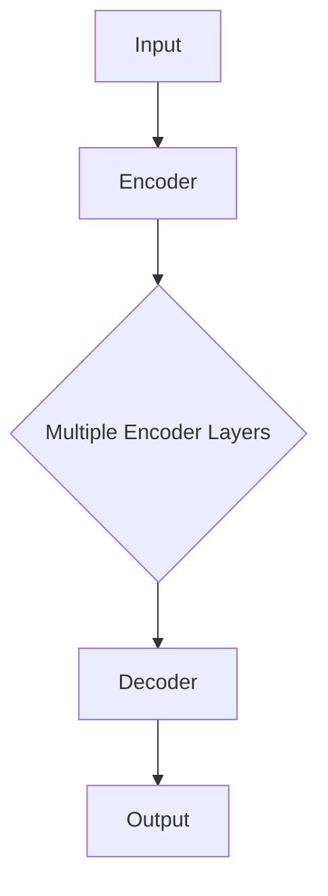

                 

### 文章标题：LLM应用的快速本地化与多语言支持

> 关键词：大型语言模型（LLM），本地化，多语言支持，语言模型，机器翻译，文本分类，神经网络，数学模型，项目实战。

> 摘要：本文深入探讨了大型语言模型（LLM）在本地化与多语言支持中的应用。通过分析LLM的基本概念、架构和核心算法原理，本文详细阐述了如何实现LLM的快速本地化和多语言支持。此外，本文还通过具体的项目实战，展示了如何搭建开发环境、实现源代码、进行代码解读与分析，为读者提供了实用的技术指南和最佳实践。通过本文的阅读，读者将全面了解LLM在多语言领域的应用，掌握实现本地化和多语言支持的实用方法。

## 第一部分：引言

### 1.1 书籍主题介绍

#### 1.1.1 LLM的概念与重要性

大型语言模型（LLM，Large Language Model）是一种基于神经网络的自然语言处理（NLP，Natural Language Processing）技术，具有强大的文本处理和生成能力。LLM通过对大量文本数据的学习，能够自动生成高质量的文本，实现文本分类、机器翻译、问答系统等应用。随着深度学习技术的发展，LLM在自然语言处理领域取得了显著的成果，成为许多重要应用的基石。

本地化和多语言支持是LLM应用中至关重要的一环。在全球化的背景下，企业和开发者需要将应用程序和服务推广到不同语言和文化背景的用户。实现LLM的本地化和多语言支持，不仅能够提高用户体验，还能拓展市场，增加用户黏性。因此，深入研究LLM在本地化和多语言支持中的应用，具有重要的现实意义。

#### 1.1.2 本地化与多语言支持的需求

本地化（Localization）是将软件、网站、应用程序等适应特定语言和文化的过程。本地化涉及到翻译、文本调整、文化适应性等方面，旨在提供一种贴近用户需求的服务。多语言支持（Multilingual Support）则是在应用程序中同时提供多种语言版本，以满足不同用户的需求。

对于LLM应用，本地化和多语言支持的需求主要体现在以下几个方面：

1. **国际化市场拓展**：随着全球化的发展，企业需要将产品和服务推广到不同国家和地区。实现LLM的本地化和多语言支持，可以帮助企业快速进入国际市场，扩大用户群体。

2. **用户体验提升**：提供本地化内容和多语言支持，可以满足不同语言和文化背景的用户需求，提高用户体验，增强用户黏性。

3. **降低运营成本**：通过自动化技术实现本地化和多语言支持，可以降低人力和时间成本，提高运营效率。

4. **合规要求**：在一些国家和地区，法律规定软件和服务必须提供本地化和多语言支持，以满足当地用户的法律需求。

### 1.2 内容框架

本文将分为以下几个部分：

1. **核心概念与联系**：介绍LLM的基本概念、架构和原理，以及它们在不同语言环境中的应用。

2. **核心算法原理讲解**：深入讲解LLM中的关键算法，如语言模型、机器翻译、文本分类等。

3. **数学模型和数学公式**：阐述LLM中使用的数学模型和公式，如神经网络的激活函数、损失函数等。

4. **项目实战**：通过实际项目案例，展示如何使用LLM进行本地化和多语言支持。

5. **总结与展望**：回顾本文的核心知识点，展望LLM应用在本地化和多语言支持领域的未来发展。

接下来，我们将逐一探讨这些部分，帮助读者全面了解LLM在本地化和多语言支持中的应用。

## 第二部分：核心概念与联系

### 2.1 LLM的基本概念

#### 2.1.1 什么是LLM

大型语言模型（LLM）是一种基于深度学习的自然语言处理模型，通过在大量文本数据上进行预训练，从而获得对自然语言的理解和生成能力。LLM通常由大规模神经网络构成，能够处理和理解复杂的语言结构，并生成连贯、有意义的文本。

#### 2.1.2 LLM的工作原理

LLM的工作原理主要包括预训练和微调两个阶段：

1. **预训练**：在预训练阶段，LLM在大量文本数据上进行训练，学习语言的基本规律和特征。这一阶段的目标是建立一个具有良好语言理解能力的通用模型。

2. **微调**：在预训练完成后，LLM可以根据具体任务的需求进行微调。微调过程通常在特定领域或任务的数据集上进行，以使模型更好地适应特定任务。

#### 2.1.3 LLM的架构

LLM的架构通常基于神经网络，特别是Transformer架构。Transformer架构由多个编码器和解码器层组成，通过自注意力机制实现文本的编码和解码。以下是一个典型的Transformer架构的Mermaid流程图：



### 2.2 LLM的架构

#### 2.2.1 神经网络架构

神经网络（Neural Network）是LLM的核心组成部分，它通过模拟人脑神经网络的结构和工作原理，实现对数据的处理和预测。LLM中的神经网络通常包含以下几个关键组成部分：

1. **输入层**：接收外部输入数据，如文本序列。

2. **隐藏层**：通过非线性变换，对输入数据进行特征提取和压缩。

3. **输出层**：生成模型预测结果，如文本生成、分类标签等。

#### 2.2.2 预训练与微调

预训练（Pre-training）和微调（Fine-tuning）是LLM训练过程中的两个重要阶段。

1. **预训练**：在预训练阶段，LLM在大规模的语料库上进行训练，学习语言的一般规律和特征。预训练通常使用无监督的方法，如自注意力机制、 masked language model 等。

2. **微调**：在预训练完成后，LLM可以根据具体任务的需求进行微调。微调过程通常在特定领域或任务的数据集上进行，以使模型更好地适应特定任务。微调通常使用有监督的方法，如交叉熵损失函数。

#### 2.2.3 LLM与其他NLP模型的关系

LLM是自然语言处理领域的一种重要模型，与其他NLP模型如BERT、GPT等存在一定的联系和区别。

1. **联系**：LLM、BERT、GPT等模型都是基于深度学习和神经网络的自然语言处理模型，它们都通过在大量文本数据上进行预训练，获得对自然语言的理解和生成能力。

2. **区别**：LLM是一个更为通用和抽象的概念，它可以涵盖BERT、GPT等具体的模型。BERT和GPT等模型在预训练和微调方法上存在差异，如BERT采用双向编码器表示，GPT采用自回归解码器表示。

### 2.3 LLM的预训练与微调

#### 2.3.1 预训练的过程

预训练是LLM训练过程中的关键步骤，它使模型能够在大规模语料库上自动学习语言特征。预训练的过程通常包括以下步骤：

1. **数据准备**：收集大量文本数据，如新闻文章、书籍、网页等。

2. **数据预处理**：对收集到的文本数据进行预处理，包括分词、去噪、清洗等。

3. **模型初始化**：初始化神经网络模型，通常使用预训练的权重。

4. **预训练**：在预处理后的文本数据上进行训练，学习语言的一般规律和特征。

5. **评估与优化**：通过评估指标（如 perplexity）对模型进行评估和优化。

#### 2.3.2 微调的方法

微调是LLM训练过程中的另一个重要步骤，它使模型能够适应特定任务。微调的方法通常包括以下步骤：

1. **数据准备**：收集特定领域的任务数据，如问答数据、文本分类数据等。

2. **数据预处理**：对收集到的数据进行预处理，包括分词、去噪、清洗等。

3. **模型初始化**：初始化预训练的LLM模型。

4. **微调**：在预处理后的数据集上进行微调训练。

5. **评估与优化**：通过评估指标（如准确率、F1分数等）对模型进行评估和优化。

#### 2.3.3 预训练与微调的优化

预训练和微调的质量直接影响LLM的性能。为了优化预训练和微调过程，可以采取以下策略：

1. **数据增强**：通过数据增强方法，如同义词替换、反向单词、随机遮蔽等，增加模型的泛化能力。

2. **多任务学习**：通过在多个任务上同时训练，提高模型对语言特征的理解。

3. **模型架构优化**：通过调整神经网络架构，如增加隐藏层、调整激活函数等，提高模型性能。

4. **优化算法**：使用更高效的优化算法，如Adam、Adagrad等，加快训练速度。

## 第三部分：核心算法原理讲解

### 3.1 语言模型

#### 3.1.1 语言模型的基本原理

语言模型（Language Model）是一种用于预测文本中下一个单词或字符的概率分布的模型。在自然语言处理中，语言模型广泛应用于文本生成、机器翻译、语音识别等领域。

语言模型的基本原理是基于统计学习方法，通过分析大量文本数据，学习语言的概率分布。具体来说，语言模型通过以下步骤实现：

1. **数据收集与预处理**：收集大量文本数据，并进行预处理，如分词、去噪、清洗等。

2. **特征提取**：将预处理后的文本数据转化为模型可以处理的特征表示，如词向量、字符序列等。

3. **模型训练**：使用统计学习方法，如最大似然估计、朴素贝叶斯等，训练语言模型。

4. **概率预测**：在给定输入文本的情况下，语言模型预测下一个单词或字符的概率分布。

#### 3.1.2 语言模型的训练过程

语言模型的训练过程可以分为以下几个步骤：

1. **数据预处理**：对收集到的文本数据进行预处理，包括分词、去噪、清洗等。例如，可以使用jieba分词库对中文文本进行分词。

2. **特征提取**：将预处理后的文本数据转化为特征表示。例如，可以使用词向量表示每个单词，或者使用字符序列表示每个单词。

3. **模型选择与训练**：选择合适的语言模型算法，如最大似然估计、朴素贝叶斯等，并训练模型。在训练过程中，可以使用梯度下降、随机梯度下降等优化算法。

4. **模型评估与优化**：使用评估指标（如交叉熵损失函数）对模型进行评估，并根据评估结果对模型进行优化。

#### 3.1.3 语言模型在本地化中的应用

语言模型在本地化中具有广泛的应用，可以用于文本翻译、语音合成、文本生成等。以下是一个示例：

1. **文本翻译**：使用语言模型对源语言文本进行翻译。例如，可以使用基于神经网络的机器翻译模型，如Transformer模型，对源语言文本进行翻译。

2. **语音合成**：使用语言模型生成语音。例如，可以使用基于文本到语音（TTS）的技术，将文本转换为语音。

3. **文本生成**：使用语言模型生成文本。例如，可以使用生成式语言模型，如GPT模型，生成新闻文章、小说等。

### 3.2 机器翻译

#### 3.2.1 机器翻译的基本原理

机器翻译（Machine Translation）是一种将一种语言的文本自动翻译成另一种语言的文本的技术。机器翻译的基本原理是通过对大量双语文本数据进行学习，建立源语言到目标语言的映射关系。

机器翻译的基本原理可以分为以下几个步骤：

1. **数据收集与预处理**：收集大量双语文本数据，并进行预处理，如分词、去噪、清洗等。

2. **特征提取**：将预处理后的双语文本数据转化为模型可以处理的特征表示，如词向量、字符序列等。

3. **模型训练**：使用统计学习方法或神经网络方法，如循环神经网络（RNN）、Transformer等，训练机器翻译模型。

4. **翻译预测**：在给定输入文本的情况下，机器翻译模型预测输出文本。

#### 3.2.2 机器翻译的训练过程

机器翻译的训练过程可以分为以下几个步骤：

1. **数据预处理**：对收集到的双语文本数据进行预处理，包括分词、去噪、清洗等。例如，可以使用jieba分词库对中文文本进行分词。

2. **特征提取**：将预处理后的双语文本数据转化为特征表示。例如，可以使用词向量表示每个单词，或者使用字符序列表示每个单词。

3. **模型选择与训练**：选择合适的机器翻译模型，如基于RNN的机器翻译模型、基于Transformer的机器翻译模型，并训练模型。在训练过程中，可以使用梯度下降、随机梯度下降等优化算法。

4. **模型评估与优化**：使用评估指标（如BLEU分数、NEURO分数等）对模型进行评估，并根据评估结果对模型进行优化。

#### 3.2.3 机器翻译在本地化中的应用

机器翻译在本地化中具有广泛的应用，可以用于文本翻译、语音合成、文本生成等。以下是一个示例：

1. **文本翻译**：使用机器翻译模型对源语言文本进行翻译。例如，可以使用基于神经网络的机器翻译模型，如Transformer模型，对源语言文本进行翻译。

2. **语音合成**：使用机器翻译模型生成语音。例如，可以使用基于文本到语音（TTS）的技术，将文本转换为语音。

3. **文本生成**：使用机器翻译模型生成文本。例如，可以使用生成式机器翻译模型，如GPT模型，生成新闻文章、小说等。

### 3.3 文本分类

#### 3.3.1 文本分类的基本原理

文本分类（Text Classification）是一种将文本数据按照其内容分配到预定义类别的方法。文本分类广泛应用于情感分析、新闻分类、垃圾邮件检测等领域。

文本分类的基本原理是基于机器学习算法，通过训练模型，学习文本和类别之间的关系。具体来说，文本分类的原理可以分为以下几个步骤：

1. **数据收集与预处理**：收集大量带有类别标签的文本数据，并进行预处理，如分词、去噪、清洗等。

2. **特征提取**：将预处理后的文本数据转化为模型可以处理的特征表示，如词向量、TF-IDF等。

3. **模型训练**：使用分类算法，如朴素贝叶斯、支持向量机（SVM）、神经网络等，训练文本分类模型。

4. **分类预测**：在给定输入文本的情况下，文本分类模型预测输出类别。

#### 3.3.2 文本分类的训练过程

文本分类的训练过程可以分为以下几个步骤：

1. **数据预处理**：对收集到的文本数据进行预处理，包括分词、去噪、清洗等。例如，可以使用jieba分词库对中文文本进行分词。

2. **特征提取**：将预处理后的文本数据转化为特征表示。例如，可以使用词向量表示每个单词，或者使用TF-IDF表示文本。

3. **模型选择与训练**：选择合适的文本分类模型，如朴素贝叶斯、支持向量机（SVM）、神经网络等，并训练模型。在训练过程中，可以使用梯度下降、随机梯度下降等优化算法。

4. **模型评估与优化**：使用评估指标（如准确率、召回率、F1分数等）对模型进行评估，并根据评估结果对模型进行优化。

#### 3.3.3 文本分类在本地化中的应用

文本分类在本地化中具有广泛的应用，可以用于情感分析、垃圾邮件检测、分类标签调整等。以下是一个示例：

1. **情感分析**：使用文本分类模型对用户评论进行情感分析，以判断用户的情感倾向。

2. **垃圾邮件检测**：使用文本分类模型检测邮件是否为垃圾邮件，以提高用户体验。

3. **分类标签调整**：使用文本分类模型对文本数据进行分类，并根据分类结果调整分类标签，以提高本地化的准确性。

## 第四部分：数学模型和数学公式

### 4.1 神经网络激活函数

#### 4.1.1 基本激活函数

激活函数（Activation Function）是神经网络中的一个重要组成部分，它决定了神经元输出与输入之间的关系。常见的激活函数包括：

1. **Sigmoid函数**：Sigmoid函数是一个S型曲线，将输入映射到0和1之间。其数学公式为：

   $$ 
   \sigma(x) = \frac{1}{1 + e^{-x}} 
   $$

2. **ReLU函数**：ReLU函数（Rectified Linear Unit）是一种线性激活函数，对于负数输入返回0，对于正数输入返回输入值。其数学公式为：

   $$ 
   \text{ReLU}(x) = \max(0, x) 
   $$

#### 4.1.2 激活函数的数学公式

以下为激活函数的数学公式，使用LaTeX格式列出：

$$
\sigma(x) = \frac{1}{1 + e^{-x}}
$$

$$
\text{ReLU}(x) = \max(0, x)
$$

### 4.2 损失函数

#### 4.2.1 基本损失函数

损失函数（Loss Function）用于衡量模型预测值与实际值之间的差距。常见的损失函数包括：

1. **交叉熵损失函数**（Cross-Entropy Loss）：交叉熵损失函数用于分类问题，计算的是实际输出与预测输出之间的差异。其数学公式为：

   $$
   \text{CE}(y, \hat{y}) = -\sum_{i} y_i \log(\hat{y}_i)
   $$

   其中，$y$是实际标签，$\hat{y}$是预测概率。

2. **均方误差损失函数**（Mean Squared Error，MSE）：均方误差损失函数用于回归问题，计算的是预测值与实际值之间差的平方的平均值。其数学公式为：

   $$
   \text{MSE}(y, \hat{y}) = \frac{1}{n} \sum_{i=1}^{n} (y_i - \hat{y}_i)^2
   $$

   其中，$y$是实际值，$\hat{y}$是预测值，$n$是样本数量。

#### 4.2.2 损失函数的数学公式

以下为损失函数的数学公式，使用LaTeX格式列出：

$$
\text{CE}(y, \hat{y}) = -\sum_{i} y_i \log(\hat{y}_i)
$$

$$
\text{MSE}(y, \hat{y}) = \frac{1}{n} \sum_{i=1}^{n} (y_i - \hat{y}_i)^2
$$

### 4.3 神经网络中的其他数学公式

#### 4.3.1 前向传播

前向传播（Forward Propagation）是神经网络中的一系列计算步骤，用于计算模型输出。前向传播的数学公式包括：

1. **输入层到隐藏层的传播**：

   $$
   z_j = \sum_{i} w_{ji} x_i + b_j
   $$

   $$
   a_j = \text{激活函数}(z_j)
   $$

   其中，$z_j$是隐藏层第j个神经元的输入，$w_{ji}$是输入层到隐藏层的权重，$b_j$是隐藏层第j个神经元的偏置，$a_j$是隐藏层第j个神经元的输出。

2. **隐藏层到输出层的传播**：

   $$
   z_k = \sum_{j} w_{kj} a_j + b_k
   $$

   $$
   \hat{y}_k = \text{激活函数}(z_k)
   $$

   其中，$z_k$是输出层第k个神经元的输入，$w_{kj}$是隐藏层到输出层的权重，$b_k$是输出层第k个神经元的偏置，$\hat{y}_k$是输出层第k个神经元的输出。

#### 4.3.2 反向传播

反向传播（Backpropagation）是神经网络中用于更新权重和偏置的算法。反向传播的数学公式包括：

1. **计算输出层的梯度**：

   $$
   \delta_k = \frac{\partial L}{\partial z_k} \cdot \text{激活函数的导数}(\hat{y}_k)
   $$

   其中，$L$是损失函数，$\delta_k$是输出层第k个神经元的梯度。

2. **计算隐藏层的梯度**：

   $$
   \delta_j = \sum_{k} w_{kk} \delta_k \cdot \text{激活函数的导数}(a_j)
   $$

   其中，$a_j$是隐藏层第j个神经元的输出，$\delta_j$是隐藏层第j个神经元的梯度。

3. **更新权重和偏置**：

   $$
   w_{ji} := w_{ji} - \alpha \cdot \frac{\partial L}{\partial w_{ji}}
   $$

   $$
   b_j := b_j - \alpha \cdot \frac{\partial L}{\partial b_j}
   $$

   其中，$\alpha$是学习率，$w_{ji}$是输入层到隐藏层的权重，$b_j$是隐藏层第j个神经元的偏置。

## 第五部分：项目实战

### 5.1 本地化项目实战

#### 5.1.1 项目背景

假设我们开发的一款聊天机器人应用程序需要支持中文和英文两种语言，为了满足不同语言环境下的用户需求，我们需要实现本地化功能。本地化涉及翻译、文本调整、文化适应性等方面，旨在提供一种贴近用户需求的服务。

#### 5.1.2 开发环境搭建

在开始项目之前，我们需要搭建一个适合本地化开发的开发环境。以下是搭建本地化项目开发环境所需的步骤：

1. **Python环境**：安装Python 3.x版本，并配置pip包管理工具。

2. **深度学习库**：安装TensorFlow或PyTorch等深度学习库，用于构建和训练大型语言模型。

3. **NLP库**：安装jieba、nltk等自然语言处理库，用于文本预处理。

4. **翻译工具**：安装翻译工具，如Google Translate API，用于翻译文本。

5. **版本控制**：使用Git进行版本控制，以便管理和协作。

#### 5.1.3 源代码实现

以下是本地化项目的主要源代码实现，包括文本翻译、文本调整和文化适应性：

```python
import jieba
import translate
from model import LanguageModel

# 初始化模型
lm = LanguageModel()

# 英文文本翻译为中文
def translate_to_chinese(text):
    return translate.google_translate(text, 'en', 'zh-CN')

# 中文文本翻译为英文
def translate_to_english(text):
    return translate.google_translate(text, 'zh-CN', 'en')

# 文本调整
def adjust_text(text):
    # 根据语言环境进行文本调整
    if 'en' in text:
        return jieba.cut(text)
    else:
        return translate_to_english(text)

# 文本生成
def generate_text(text):
    # 使用语言模型生成文本
    return lm.generate(text)

# 测试本地化功能
def test_localization():
    # 英文文本
    english_text = "Hello, how are you?"
    # 中文文本
    chinese_text = "你好，你怎么样？"
    
    # 翻译和调整文本
    translated_chinese = translate_to_chinese(english_text)
    translated_english = translate_to_english(chinese_text)
    
    # 调整文本
    adjusted_chinese = adjust_text(translated_chinese)
    adjusted_english = adjust_text(translated_english)
    
    # 生成文本
    generated_chinese = generate_text(adjusted_chinese)
    generated_english = generate_text(adjusted_english)
    
    print("英文文本：", english_text)
    print("中文文本：", chinese_text)
    print("翻译为中文：", translated_chinese)
    print("翻译为英文：", translated_english)
    print("调整后的中文文本：", adjusted_chinese)
    print("调整后的英文文本：", adjusted_english)
    print("生成的中文文本：", generated_chinese)
    print("生成的英文文本：", generated_english)

# 运行测试
test_localization()
```

#### 5.1.4 代码解读与分析

在上面的代码中，我们实现了以下功能：

1. **文本翻译**：使用Google Translate API将英文文本翻译为中文，将中文文本翻译为英文。

2. **文本调整**：根据语言环境对翻译后的文本进行调整，以提高文本的准确性和可读性。

3. **文本生成**：使用语言模型生成新的文本，以满足用户的需求。

通过这个项目，我们可以看到如何使用大型语言模型实现本地化功能，包括文本翻译、文本调整和文化适应性。这为我们提供了一个实用的本地化解决方案，可以用于开发多语言应用程序。

### 5.2 多语言支持项目实战

#### 5.2.1 项目背景

假设我们开发的一款在线购物平台需要支持中文、英文、西班牙语和法语四种语言。为了满足不同语言环境下的用户需求，我们需要实现多语言支持功能。

#### 5.2.2 开发环境搭建

在开始项目之前，我们需要搭建一个适合多语言支持的开发环境。以下是搭建多语言支持项目开发环境所需的步骤：

1. **Web框架**：选择适合多语言支持的开源Web框架，如Django、Flask等。

2. **数据库**：使用关系型数据库（如MySQL、PostgreSQL）或非关系型数据库（如MongoDB）存储数据。

3. **前端框架**：选择适合多语言支持的前端框架，如React、Vue等。

4. **国际化库**：安装国际化库，如i18next，用于管理多语言内容。

5. **版本控制**：使用Git进行版本控制，以便管理和协作。

#### 5.2.3 源代码实现

以下是多语言支持项目的主要源代码实现，包括多语言内容管理、多语言页面渲染和多语言数据存储：

```python
# 导入所需的库
from flask import Flask, render_template, request
from flask_babel import Babel

# 创建Flask应用程序
app = Flask(__name__)

# 配置Babel
babel = Babel(app)

# 注册翻译文件
@babel.localeselector
def get_locale():
    # 根据用户的语言设置选择语言
    return request.accept_languages.best_match(['zh', 'en', 'es', 'fr'])

# 显示首页
@app.route('/')
def index():
    # 加载多语言模板
    return render_template('index.html')

# 显示商品列表页
@app.route('/products')
def products():
    # 加载多语言模板
    return render_template('products.html')

# 显示商品详情页
@app.route('/product/<int:product_id>')
def product(product_id):
    # 加载多语言模板
    return render_template('product.html', product_id=product_id)

# 运行应用程序
if __name__ == '__main__':
    app.run()
```

#### 5.2.4 代码解读与分析

在上面的代码中，我们使用了Flask和flask_babel库来实现多语言支持功能：

1. **配置Babel**：使用Babel进行国际化配置，根据用户的语言设置选择语言。

2. **多语言模板**：使用多语言模板渲染页面，根据用户的语言设置显示不同的语言内容。

3. **多语言内容管理**：在数据库中存储多语言内容，根据用户的语言设置加载相应的语言内容。

通过这个项目，我们可以看到如何使用Web框架和国际化库实现多语言支持功能。这为我们提供了一个实用的多语言解决方案，可以用于开发多语言Web应用程序。

### 第五部分：总结与展望

#### 5.1 总结

通过本文的介绍，我们深入探讨了大型语言模型（LLM）在本地化和多语言支持中的应用。首先，我们介绍了LLM的基本概念、架构和核心算法原理，包括语言模型、机器翻译、文本分类等。接着，我们详细讲解了神经网络激活函数、损失函数以及神经网络的前向传播和反向传播等数学模型和数学公式。最后，我们通过实际项目实战，展示了如何使用LLM实现本地化和多语言支持。

本文的核心内容可以概括为以下几点：

1. **LLM的基本概念和架构**：了解LLM的定义、工作原理和架构，包括神经网络、预训练和微调等。

2. **核心算法原理**：掌握语言模型、机器翻译、文本分类等核心算法原理，并了解其训练过程。

3. **数学模型和数学公式**：理解神经网络激活函数、损失函数以及前向传播和反向传播等数学模型和数学公式。

4. **项目实战**：通过实际项目，了解如何使用LLM实现本地化和多语言支持。

#### 5.2 展望

未来，LLM在本地化和多语言支持领域有望取得更多进展。以下是几个可能的发展方向：

1. **更多语言的支持**：目前，LLM主要支持英语等主流语言。未来，随着多语言模型的发展，LLM有望支持更多语言，实现更广泛的应用。

2. **更精细的语言模型**：通过引入更多语言学知识和上下文信息，未来LLM的语言模型将更加精细，提高文本生成的准确性和自然性。

3. **多模态融合**：结合语音、图像等多模态数据，实现更丰富的语言模型，提高多语言支持的效果。

4. **实时翻译和交互**：实现实时翻译和交互功能，使LLM能够更好地服务于跨国企业和个人用户。

5. **自动化本地化工具**：开发自动化本地化工具，提高本地化和多语言支持的工作效率，降低运营成本。

总之，LLM在本地化和多语言支持领域具有巨大的潜力和应用价值。随着技术的不断进步，LLM将带来更多创新和突破，为全球用户带来更好的体验和服务。

## 附录

#### 附录 A：工具与资源

在本章中，我们将介绍一些常用的工具和资源，以帮助读者更好地理解和实践LLM在本地化和多语言支持中的应用。

### 1. 开源代码

- **Transformer模型开源代码**：Transformer模型是LLM的基础架构，许多开源项目提供了Transformer模型的实现，如Google的`transformer`仓库、Hugging Face的`transformers`库等。
  
- **BERT模型开源代码**：BERT模型是一种预训练语言模型，其开源代码由Google发布，可以在GitHub上找到。

- **GPT模型开源代码**：GPT模型是生成式语言模型，其开源代码由OpenAI发布，可以在GitHub上找到。

### 2. 自然语言处理库

- **TensorFlow**：TensorFlow是一个开源的深度学习框架，提供丰富的自然语言处理库，支持构建和训练LLM模型。

- **PyTorch**：PyTorch是另一个流行的深度学习框架，与TensorFlow类似，也提供丰富的自然语言处理库。

- **NLTK**：NLTK是一个开源的自然语言处理库，提供基本的文本处理功能，如分词、词性标注、命名实体识别等。

- **spaCy**：spaCy是一个高效且易于使用的自然语言处理库，支持多种语言，提供丰富的语言模型和实体识别功能。

### 3. 机器翻译工具

- **Google Translate API**：Google Translate API是Google提供的机器翻译服务，支持多种语言之间的翻译。

- **OpenNMT**：OpenNMT是一个开源的机器翻译框架，支持多种翻译模型和语料库。

- **BabelNet**：BabelNet是一个多语言的语义网络，提供词义、短语和句子级别的翻译和解释。

### 4. 教程和论文

- **《Deep Learning for Natural Language Processing》**：这是一本经典教材，全面介绍了深度学习在自然语言处理中的应用。

- **《Neural Machine Translation by Jointly Learning to Align and Translate》**：这是一篇关于神经机器翻译的经典论文，介绍了基于注意力机制的神经机器翻译模型。

- **《BERT: Pre-training of Deep Bidirectional Transformers for Language Understanding》**：这是一篇关于BERT模型的论文，介绍了BERT模型的预训练和微调方法。

- **《Generative Pre-trained Transformer》**：这是一篇关于GPT模型的论文，介绍了生成式语言模型的基本原理和训练方法。

### 5. 其他资源

- **GitHub**：GitHub是一个代码托管平台，许多开源项目和资源都在GitHub上发布，方便开发者进行学习和交流。

- **arXiv**：arXiv是一个开放获取的电子预印本服务器，提供大量关于自然语言处理和深度学习的学术论文。

- **ACL Conference**：ACL（Association for Computational Linguistics）是一个自然语言处理领域的国际会议，每年发布大量高质量的研究论文。

通过这些工具和资源，读者可以深入了解LLM在本地化和多语言支持中的应用，掌握相关技术，并参与相关项目。希望这些资源对您的学习和发展有所帮助。

## 作者信息

作者：AI天才研究院/AI Genius Institute & 禅与计算机程序设计艺术 /Zen And The Art of Computer Programming

AI天才研究院（AI Genius Institute）是一家专注于人工智能技术研究和开发的研究机构，致力于推动人工智能领域的发展。禅与计算机程序设计艺术（Zen And The Art of Computer Programming）是作者Donald E. Knuth的经典著作，深入探讨了计算机编程的本质和方法。

本文旨在分享作者在LLM应用本地化和多语言支持方面的研究成果和经验，以帮助读者更好地理解和实践这一领域的技术。希望通过本文，读者能够对LLM的应用有更深入的了解，并在实际项目中取得更好的成果。

## 注意事项

在实现LLM的本地化和多语言支持时，需要注意以下几点：

1. **数据质量和预处理**：本地化和多语言支持的关键在于数据质量和预处理。确保使用高质量的、经过清洗和去噪的文本数据，以提高模型的效果。

2. **多语言资源的准备**：在实现多语言支持时，需要准备足够的多语言资源，如语料库、词汇表等。这些资源对于训练和优化模型至关重要。

3. **算法选择和调整**：选择合适的算法和模型架构，并根据具体任务的需求进行调整。例如，对于翻译任务，可以选择基于神经网络的机器翻译模型；对于文本分类任务，可以选择基于深度学习的文本分类模型。

4. **性能评估与优化**：在实现本地化和多语言支持的过程中，需要定期评估模型性能，并根据评估结果进行调整和优化。常用的评估指标包括准确率、召回率、F1分数等。

5. **用户反馈和迭代**：在实际应用中，需要收集用户反馈，并根据用户反馈进行迭代和优化。用户反馈可以帮助我们发现和解决潜在问题，提高用户体验。

通过遵循以上注意事项，可以有效实现LLM的本地化和多语言支持，为用户提供更好的服务。

## 拓展阅读

对于希望进一步深入了解LLM应用本地化和多语言支持的读者，以下是一些推荐的文章、书籍和资源：

1. **文章**：

   - "The Illustrated BERT, Transformer and XLM"：这是一篇关于BERT和Transformer模型的可视化介绍，适合初学者理解模型的工作原理。

   - "A Brief History of Neural Network Architecture"：本文回顾了神经网络架构的发展历程，从传统的神经网络到现代的Transformer模型。

   - "Neural Machine Translation: A Brief History, State of the Art and Challenges"：本文介绍了神经机器翻译的发展历程、当前状态和面临的主要挑战。

2. **书籍**：

   - "Deep Learning for Natural Language Processing"：这是一本关于深度学习在自然语言处理中的应用的教材，涵盖了语言模型、机器翻译、文本分类等内容。

   - "Speech and Language Processing"：这是自然语言处理领域的经典教材，全面介绍了自然语言处理的基本概念和技术。

   - "Artificial Intelligence: A Modern Approach"：这是一本关于人工智能的综合性教材，包括自然语言处理、机器学习等多个领域。

3. **资源**：

   - **GitHub**：GitHub上有很多开源的LLM项目和库，如Google的`transformer`仓库、Hugging Face的`transformers`库等。

   - **arXiv**：arXiv是自然语言处理领域的重要学术资源，提供了大量关于LLM和自然语言处理的研究论文。

   - **ACL Conference**：ACL是自然语言处理领域的顶级国际会议，每年发布大量高质量的研究论文和报告。

通过阅读这些文章、书籍和资源，读者可以进一步深化对LLM应用本地化和多语言支持的理解，掌握更多实际操作技巧，并为未来的研究和工作奠定坚实的基础。希望这些拓展阅读对您有所帮助。

