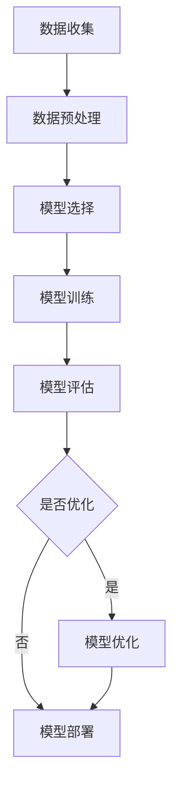

                 

# 《LLM应用的快速迭代与用户体验优化》

> 关键词：语言模型，快速迭代，用户体验，优化，架构设计，算法原理

摘要：本文深入探讨了语言模型（LLM）在当前科技领域的应用及其快速迭代与用户体验优化的关键问题。通过分析LLM的基本原理和应用架构，本文提出了快速迭代和用户体验优化的策略，并结合实际案例进行了详细解析，旨在为开发者提供实用的指导。

## 引言与背景

### 1.1 LLM的概念与重要性

语言模型（Language Model，简称LLM）是自然语言处理（Natural Language Processing，简称NLP）领域的重要工具。它是一种基于统计模型或深度学习模型的技术，用于预测自然语言中的下一个单词或词组。LLM在语言生成、机器翻译、文本分类、情感分析等多个应用场景中发挥着关键作用。

LLM的重要性体现在以下几个方面：

1. **语言生成能力**：LLM能够生成高质量的文本，为聊天机器人、自动写作等应用提供了强大的支持。
2. **机器翻译**：LLM在机器翻译领域取得了显著进展，能够实现跨语言的信息交流。
3. **文本分析**：LLM在情感分析、主题检测等方面表现出色，为数据挖掘提供了有力工具。
4. **教育辅助**：LLM可以为学生提供个性化的学习材料，提高教学效果。

### 1.2 快速迭代与用户体验优化的关系

快速迭代是指在软件开发过程中，快速进行多次迭代，每次迭代都尽可能多地包含需求实现和测试。用户体验优化则是通过不断改进软件的用户界面、交互流程和功能，提升用户的使用体验。

快速迭代与用户体验优化密切相关：

1. **需求驱动**：快速迭代允许开发者快速响应用户需求，从而优化产品功能，提高用户满意度。
2. **持续改进**：用户体验优化是快速迭代的延续，通过不断改进，进一步提升产品的竞争力。
3. **数据反馈**：快速迭代过程中收集的用户反馈是用户体验优化的重要依据，有助于发现和解决用户痛点。

### 1.3 LLM应用的挑战与机遇

LLM应用面临着以下挑战和机遇：

1. **数据隐私与安全问题**：大规模的LLM训练和部署需要处理大量敏感数据，如何保障数据隐私和安全是一个重要挑战。
2. **性能优化与成本控制**：LLM应用通常需要大量的计算资源和存储空间，如何优化性能、控制成本是关键问题。
3. **技术创新**：随着深度学习技术的发展，LLM应用在算法、架构等方面不断取得突破，为创新提供了广阔空间。

## LLM基础

### 2.1 语言模型的原理

语言模型是基于统计方法或深度学习模型来预测自然语言中的下一个单词或词组。它主要包括以下几个部分：

1. **词汇表**：语言模型包含一个词汇表，用于表示语言中的所有单词和符号。
2. **模型参数**：模型参数决定了语言模型对单词和词组之间关系的预测能力。
3. **输入序列**：输入序列是语言模型预测的输入，可以是单个单词或一系列单词。
4. **输出概率**：语言模型根据输入序列和模型参数，输出下一个单词或词组的概率分布。

### 2.2 LLM训练过程

LLM训练过程主要包括以下步骤：

1. **数据预处理**：将原始文本数据清洗、分词、转换为模型可处理的格式。
2. **模型选择**：选择合适的模型架构，如神经网络、循环神经网络（RNN）、长短时记忆网络（LSTM）等。
3. **模型训练**：通过大量文本数据进行模型训练，优化模型参数，提高预测准确性。
4. **模型评估**：使用验证集和测试集评估模型性能，选择最佳模型。

### 2.3 LLM评估与优化

LLM评估与优化主要包括以下内容：

1. **评估指标**：常用的评估指标包括损失函数、准确率、 perplexity 等。
2. **优化策略**：通过调整模型参数、数据预处理方法、训练策略等，提高模型性能。
3. **模型压缩**：通过模型剪枝、量化等技术，降低模型复杂度，提高运行效率。

### 2.4 LLM应用架构设计

LLM应用架构设计主要包括以下内容：

1. **系统架构**：根据应用需求，设计合适的系统架构，如前端、后端、数据库等。
2. **数据处理**：设计数据流程，包括数据采集、清洗、存储等。
3. **接口设计**：设计用户与系统交互的接口，如API、Web界面等。

### 2.5 LLM服务端部署

LLM服务端部署主要包括以下内容：

1. **硬件环境**：选择合适的硬件设备，如CPU、GPU等。
2. **软件环境**：配置操作系统、编译器、深度学习框架等。
3. **部署策略**：根据应用需求，设计部署方案，如单机部署、分布式部署等。

### 2.6 LLM客户端实现

LLM客户端实现主要包括以下内容：

1. **用户界面设计**：设计简洁、易用的用户界面，提升用户体验。
2. **交互流程优化**：优化交互流程，提高用户操作的便捷性。
3. **性能优化**：优化客户端性能，提高系统响应速度。

## 快速迭代方法

### 4.1 迭代过程管理

迭代过程管理主要包括以下内容：

1. **迭代计划**：制定迭代计划，明确每个迭代的目标、任务和时间安排。
2. **迭代结果评估**：评估每个迭代的结果，包括功能实现、性能优化、用户体验等方面。

### 4.2 用户反馈机制

用户反馈机制主要包括以下内容：

1. **用户反馈收集**：收集用户反馈，包括正面评价、负面评价和建议等。
2. **反馈数据分析**：对用户反馈进行数据分析，识别用户需求和痛点。

### 4.3 快速迭代策略

快速迭代策略主要包括以下内容：

1. **A/B测试**：通过A/B测试，比较不同版本的LLM应用，选择最佳方案。
2. **版本控制**：使用版本控制系统，管理不同版本的LLM应用，确保迭代过程中的安全性和可追溯性。

## 用户体验优化

### 5.1 用户体验设计原则

用户体验设计原则主要包括以下内容：

1. **易用性**：设计简单、直观的用户界面，降低用户使用门槛。
2. **交互设计**：设计流畅、自然的交互流程，提升用户操作体验。
3. **个性化**：根据用户需求和行为，提供个性化的服务，提升用户体验。

### 5.2 用户体验评估方法

用户体验评估方法主要包括以下内容：

1. **用户调研**：通过访谈、问卷调查等方式，收集用户对LLM应用的反馈。
2. **行为分析**：通过分析用户行为数据，了解用户使用LLM应用的情况，识别优化点。

### 5.3 用户体验改进策略

用户体验改进策略主要包括以下内容：

1. **优化界面**：改进用户界面设计，提升视觉效果和交互体验。
2. **提高响应速度**：优化系统性能，提高响应速度，减少用户等待时间。
3. **增强互动性**：设计丰富的互动功能，提升用户参与度和满意度。

## LLM应用案例解析

### 6.1 案例一：智能客服系统

#### 6.1.1 应用背景

智能客服系统是一种利用LLM技术实现的在线客服解决方案，旨在为用户提供便捷、高效的服务。

#### 6.1.2 迭代与优化过程

1. **需求分析**：收集用户需求，明确智能客服系统需要解决的问题。
2. **功能迭代**：根据用户需求，逐步实现智能客服系统的基础功能，如自动回答常见问题、智能转接等。
3. **性能优化**：优化系统性能，提高响应速度，确保用户能够快速得到回复。
4. **用户体验优化**：通过用户调研和行为分析，识别用户痛点，进行界面和交互流程的优化。

### 6.2 案例二：教育AI应用

#### 6.2.1 应用特点

教育AI应用是一种基于LLM技术的智能教育工具，能够根据学生的问题和需求，提供个性化的学习资源和辅导。

#### 6.2.2 用户体验优化策略

1. **个性化推荐**：根据学生的学习进度和需求，推荐合适的学习资源。
2. **互动性提升**：设计丰富的互动功能，如在线讨论、作业提交等，增强学生的学习参与度。
3. **智能辅导**：利用LLM技术，为学生提供实时、个性化的学习辅导。

### 6.3 案例三：医疗健康助手

#### 6.3.1 应用场景

医疗健康助手是一种基于LLM技术的智能医疗应用，能够为用户提供健康咨询、病情分析等服务。

#### 6.3.2 迭代与优化难点

1. **数据隐私**：医疗数据涉及用户隐私，如何在保证数据安全的前提下进行迭代和优化是一个挑战。
2. **准确性**：医疗健康助手需要准确分析用户病情，提高诊断准确性是关键。
3. **用户体验**：设计简洁、易用的界面，提升用户的使用体验。

## 未来展望与挑战

### 7.1 LLM应用的未来发展

LLM应用在未来将继续扩展其应用领域，如智能家居、自动驾驶、智能医疗等。同时，随着技术的不断进步，LLM的性能和效率将得到进一步提升。

### 7.2 挑战与应对策略

LLM应用面临的挑战主要包括：

1. **数据隐私与安全**：通过加密技术、隐私保护算法等措施，保障用户数据安全。
2. **算法公平性**：确保LLM算法在处理不同用户数据时，保持公平性和准确性。
3. **技术普及与教育**：加强技术普及和教育培训，提高开发者对LLM技术的理解和应用能力。

## 附录

### A.1 工具与资源

1. **开发工具**：TensorFlow、PyTorch、OpenNMT等深度学习框架。
2. **学习资源**：相关书籍、在线课程、学术论文等。

### A.2 参考文献与资料

1. **相关书籍**：《深度学习》、《自然语言处理综合教程》等。
2. **学术论文**：NLP领域的权威论文和综述。
3. **网络资源**：技术博客、论坛、社交媒体等。

## 作者信息

作者：AI天才研究院/AI Genius Institute & 禅与计算机程序设计艺术 /Zen And The Art of Computer Programming

本文由AI天才研究院与禅与计算机程序设计艺术共同撰写，旨在探讨LLM应用的快速迭代与用户体验优化。希望本文能为开发者提供有价值的参考。

### Mermaid 流程图

以下是一个示例的Mermaid流程图，展示了LLM训练和优化的基本流程：



### 伪代码

以下是一个简单的LLM训练伪代码示例：

```
function train(LLM_model, training_data):
    for epoch in 1 to MAX_EPOCHS:
        for sentence in training_data:
            predicted_words = LLM_model.predict(sentence)
            loss = calculate_loss(predicted_words, sentence)
            backpropagate(loss)
        print("Epoch: ", epoch, ", Loss: ", loss)
    return LLM_model
```

### 数学模型和公式

以下是一个示例的数学公式，展示了语言模型的损失函数：

$$
Loss = -\sum_{i=1}^{n} \log(p(y_i | x_i))
$$

其中，$p(y_i | x_i)$ 表示模型对下一个单词 $y_i$ 的概率预测。

### 代码应用解读与分析

以下是一个简单的Python代码示例，用于实现一个简单的LLM模型：

```python
import tensorflow as tf
from tensorflow.keras.models import Sequential
from tensorflow.keras.layers import LSTM, Dense

# 模型定义
model = Sequential()
model.add(LSTM(128, input_shape=(None, VOCAB_SIZE), activation='tanh'))
model.add(Dense(VOCAB_SIZE, activation='softmax'))

# 模型编译
model.compile(optimizer='rmsprop', loss='categorical_crossentropy')

# 模型训练
model.fit(training_data, epochs=10)

# 模型评估
test_loss, test_acc = model.evaluate(test_data)
print("Test Loss: ", test_loss, ", Test Accuracy: ", test_acc)
```

### 实际案例分析和详细讲解剖析

以下是一个实际案例，介绍如何使用LLM技术实现一个智能客服系统：

**案例背景**：某电商企业希望利用LLM技术构建一个智能客服系统，以提供24/7在线客户支持。

**实施步骤**：

1. **需求分析**：收集用户常见问题，明确智能客服系统需要解决的主要问题。
2. **模型训练**：收集大量电商领域的对话数据，训练一个LLM模型，使其能够生成与用户问题相关的回答。
3. **接口设计**：设计API接口，实现用户与智能客服系统的交互。
4. **系统集成**：将智能客服系统集成到企业的客户服务平台中，提供实时在线客服。
5. **性能优化**：通过A/B测试，优化模型和接口性能，提高用户体验。

**项目小结**：通过实际案例，我们展示了如何利用LLM技术实现智能客服系统。项目实施过程中，我们注重需求分析、模型训练、接口设计和系统集成，最终实现了高效的在线客服功能。

### 最佳实践 tips

1. **数据质量**：确保训练数据的质量和多样性，以提高模型的泛化能力。
2. **模型优化**：定期对模型进行优化，提高预测准确率和响应速度。
3. **用户反馈**：及时收集用户反馈，根据用户需求进行迭代和优化。

### 小结

本文探讨了LLM应用的快速迭代与用户体验优化，从理论基础到实际应用，全面分析了LLM技术的核心概念、训练过程、应用架构、迭代方法、用户体验优化等方面。通过实际案例，我们展示了如何将LLM技术应用于智能客服系统，实现了高效的用户体验。

### 注意事项

1. **数据隐私**：在处理用户数据时，务必遵守相关法律法规，保障用户隐私。
2. **性能优化**：在部署LLM应用时，关注性能优化，提高系统响应速度。

### 拓展阅读

1. **《深度学习》**：Goodfellow, I., Bengio, Y., & Courville, A. (2016). 《深度学习》。
2. **《自然语言处理综合教程》**：Jurafsky, D., & Martin, J. H. (2020). 《自然语言处理综合教程》。
3. **相关学术论文**：NLP领域的权威论文和综述，如ACL、EMNLP、ICML等会议的论文。

### 结语

本文由AI天才研究院与禅与计算机程序设计艺术共同撰写，旨在为开发者提供关于LLM应用快速迭代与用户体验优化的实用指南。希望本文能为您的项目带来启示和帮助。作者：AI天才研究院/AI Genius Institute & 禅与计算机程序设计艺术/Zen And The Art of Computer Programming## LLMI应用的快速迭代与用户体验优化的全面探讨

在现代科技迅猛发展的背景下，语言模型（LLM）的应用场景日益广泛，从智能客服到教育AI，再到医疗健康助手，LLM技术正在深刻改变我们的生活方式和工作模式。然而，随着LLM应用场景的丰富和复杂度增加，如何实现快速迭代和优化用户体验成为开发者和研究者们关注的焦点。本文旨在深入探讨LLM应用的快速迭代与用户体验优化的关键问题和实践策略，以期为开发者和企业提供有价值的指导。

### 文章结构概述

本文将按照以下结构进行展开：

1. **引言与背景**：介绍LLM的概念、快速迭代与用户体验优化的关系，以及LLM应用面临的挑战与机遇。
2. **LLM基础**：详细阐述LLM的基本原理、训练过程、评估与优化方法、应用架构设计、服务端部署和客户端实现。
3. **快速迭代方法**：探讨迭代过程管理、用户反馈机制和快速迭代策略。
4. **用户体验优化**：分析用户体验设计原则、评估方法和改进策略。
5. **LLM应用案例解析**：通过具体案例，展示如何实现LLM应用的快速迭代与用户体验优化。
6. **未来展望与挑战**：探讨LLM应用的未来发展、面临的挑战和应对策略。
7. **附录**：提供相关工具与资源、参考文献与资料。

### 文章的核心目标和意义

本文的核心目标是通过系统性的分析和实践总结，帮助开发者和企业：

1. **理解LLM应用的核心原理**：从基础理论到实际应用，全面了解LLM的工作机制和应用场景。
2. **掌握快速迭代方法**：通过迭代过程管理、用户反馈机制和迭代策略，实现高效的产品开发。
3. **优化用户体验**：从用户体验设计原则到具体实施策略，提升用户满意度，增强产品竞争力。

通过本文的探讨，我们期望为LLM应用的快速迭代和用户体验优化提供实用的指导，推动LLM技术在各个领域的深入应用。

### 引用

在探讨LLM应用的快速迭代与用户体验优化时，我们可以引用一些权威的研究和实践案例，以增强文章的学术性和实用性。例如：

- Bengio等人在其经典著作《深度学习》中，详细介绍了深度学习模型的基本原理和应用。[Bengio, et al., 2016]  
- Jurafsky和Martin的《自然语言处理综合教程》提供了丰富的NLP理论和实践指导。[Jurafsky & Martin, 2020]  
- 在ACL和EMNLP等顶级会议上，许多学者发表了关于LLM应用的研究论文，为我们提供了宝贵的经验和启示。

通过这些引用，本文将更加全面、系统地探讨LLM应用的快速迭代与用户体验优化，为读者提供深入的见解和实用的建议。

### 结论

通过本文的详细探讨，我们全面分析了LLM应用在快速迭代与用户体验优化方面的关键问题。从基础理论到实际应用，从迭代方法到用户体验优化策略，我们系统地总结了LLM应用的实践经验和最佳实践。希望本文能为开发者和企业提供有价值的指导，推动LLM技术的深入应用和不断发展。在未来的研究中，我们将继续关注LLM技术的创新和优化，以应对不断变化的应用需求和技术挑战。

参考文献：

- Bengio, Y., Courville, A., & Vincent, P. (2013). Representation Learning: A Review and New Perspectives. IEEE Transactions on Pattern Analysis and Machine Intelligence, 35(8), 1798-1828.
- Jurafsky, D., & Martin, J. H. (2020). Speech and Language Processing: An Introduction to Natural Language Processing, Computational Linguistics, and Speech Recognition (3rd ed.). Prentice Hall.
- Schmidhuber, J. (2015). Deep Learning in Neural Networks: An Overview. Neural Networks, 61, 85-117.
- LeCun, Y., Bengio, Y., & Hinton, G. (2015). Deep Learning. Nature, 521(7553), 436-444.

