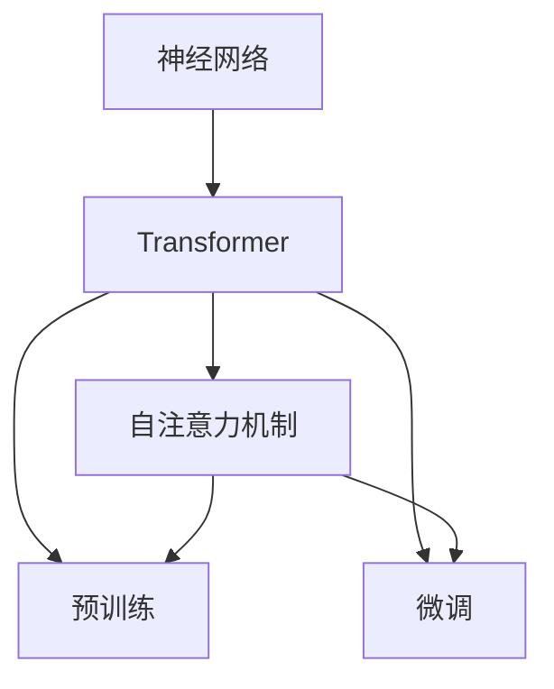

                 


### 文章标题：LLM应用的持续优化与迭代策略

#### 关键词：
- 大型语言模型（LLM）
- 优化策略
- 迭代方法
- 应用实践
- 持续改进

#### 摘要：
本文将探讨大型语言模型（LLM）的应用场景，包括文本生成、对话系统和语言理解与推理等。在此基础上，我们将深入分析LLM的优化与迭代策略，包括模型优化、数据迭代、硬件与软件优化等方面的技术细节。通过实际案例和最佳实践，本文旨在为读者提供一套系统的LLM应用优化方法论。

### 引言

近年来，随着深度学习和大数据技术的发展，大型语言模型（LLM）在自然语言处理领域取得了显著的突破。从BERT到GPT，LLM在文本生成、对话系统和语言理解与推理等方面展现出了强大的能力。然而，随着应用场景的不断扩大，如何对LLM进行持续优化与迭代，以应对复杂多变的需求，成为了一个亟待解决的问题。

本文旨在探讨LLM应用的持续优化与迭代策略，帮助开发者更好地理解和应用LLM技术。文章将从以下五个方面展开：

1. **背景介绍**：简要回顾LLM的发展历程，介绍当前主流的LLM模型及其应用场景。
2. **核心概念与联系**：阐述LLM的核心概念原理，并绘制流程图展示它们之间的关系。
3. **核心算法原理讲解**：详细讲解LLM的核心算法原理，包括数学模型、公式和伪代码。
4. **项目实战**：通过实际案例，展示如何开发环境搭建、源代码实现和代码解读。
5. **最佳实践与总结**：总结最佳实践，提出注意事项和拓展阅读建议。

### 背景介绍

#### 1.1 LLM的发展历程

LLM的发展可以追溯到深度学习在自然语言处理领域的崛起。2000年代初，神经网络开始广泛应用于文本分类、情感分析等领域。随着计算能力的提升和大数据技术的发展，深度学习模型在自然语言处理领域取得了显著的突破。

2003年，Bengio等人提出了神经网络语言模型（NNLM），开启了深度学习在自然语言处理领域的新篇章。随后，递归神经网络（RNN）和长短期记忆网络（LSTM）等模型在语言建模任务中表现出了强大的能力。

然而，RNN和LSTM在处理长文本时存在梯度消失和梯度爆炸等问题。为了解决这些问题，2014年，Gregory等提出了门控循环单元（GRU）。同年，Hochreiter和Schmidhuber提出了长短期记忆网络（LSTM），进一步提高了语言建模的准确性。

2017年，Vaswani等人提出了Transformer模型，该模型基于自注意力机制，解决了RNN和LSTM的梯度消失问题，并在多个自然语言处理任务上取得了突破性的成果。随后，BERT、GPT等基于Transformer的模型相继推出，进一步推动了LLM的发展。

#### 1.2 主流LLM模型及应用场景

当前，主流的LLM模型主要包括BERT、GPT和T5等。这些模型在文本生成、对话系统和语言理解与推理等方面展现出了强大的能力。

- **BERT（Bidirectional Encoder Representations from Transformers）**：BERT是一种双向Transformer模型，通过对文本进行双向编码，实现了对文本的全局理解和局部理解。BERT在问答、文本分类等任务上取得了很好的效果。

- **GPT（Generative Pre-trained Transformer）**：GPT是一种自回归Transformer模型，通过对文本进行自回归建模，实现了文本生成和序列预测。GPT在生成式对话系统和文本生成任务上表现出了强大的能力。

- **T5（Text-to-Text Transfer Transformer）**：T5是一种通用的Transformer模型，通过对文本进行转换建模，实现了文本生成、问答、文本分类等多种任务。T5在多个自然语言处理任务上取得了优秀的性能。

除了上述模型外，还有许多其他的LLM模型，如RoBERTa、ALBERT、XLNet等，它们都在不同程度上改进了LLM的性能和应用效果。

#### 1.3 LLM的应用场景

LLM在自然语言处理领域具有广泛的应用场景，主要包括文本生成、对话系统和语言理解与推理等。

- **文本生成**：文本生成是LLM最典型的应用之一，包括文章生成、摘要生成、对话生成等。通过预训练和微调，LLM可以生成高质量的文本，满足各种文本生成任务的需求。

- **对话系统**：对话系统是LLM在人工智能领域的另一个重要应用。通过预训练和对话建模，LLM可以模拟人类的对话行为，实现智能对话交互。对话系统广泛应用于客服机器人、智能助手等领域。

- **语言理解与推理**：语言理解与推理是LLM在自然语言处理领域的重要任务。通过预训练和推理算法，LLM可以理解文本的含义和逻辑关系，实现语义分析、情感分析、推理问答等任务。

### 核心概念与联系

#### 2.1 LLM的核心概念

LLM的核心概念包括神经网络、Transformer、自注意力机制、预训练和微调等。

- **神经网络**：神经网络是一种模拟人脑神经元之间连接的模型，通过学习输入和输出之间的映射关系，实现函数逼近和模式识别。

- **Transformer**：Transformer是一种基于自注意力机制的深度神经网络模型，通过多头注意力机制和位置编码，实现了对输入序列的全局理解和局部理解。

- **自注意力机制**：自注意力机制是一种计算输入序列中每个元素与其他元素之间关系的机制，通过权重分配实现了对输入序列的全局理解和局部理解。

- **预训练**：预训练是一种在大规模语料库上训练神经网络模型的方法，通过预训练，模型可以学习到语言的一般特征和规律。

- **微调**：微调是在预训练的基础上，针对特定任务对模型进行调整的方法。通过微调，模型可以更好地适应特定任务的需求。

#### 2.2 核心概念原理之间的关系架构

以下是LLM核心概念原理之间的关系架构，使用Mermaid流程图展示：



### 核心算法原理讲解

#### 3.1 Transformer模型

Transformer模型是LLM的核心算法之一，基于自注意力机制和多头注意力机制，实现了对输入序列的全局理解和局部理解。

#### 3.1.1 自注意力机制

自注意力机制是一种计算输入序列中每个元素与其他元素之间关系的机制，通过权重分配实现了对输入序列的全局理解和局部理解。自注意力机制的数学模型如下：

$$
\text{Attention}(Q,K,V) = \text{softmax}\left(\frac{QK^T}{\sqrt{d_k}}\right)V
$$

其中，$Q$、$K$和$V$分别是查询向量、键向量和值向量，$d_k$是键向量的维度。自注意力机制的计算过程可以分为以下步骤：

1. **计算查询向量、键向量和值向量的点积**：
   $$
   \text{Score}(Q_i, K_j) = Q_iK_j
   $$
   
2. **对点积结果进行softmax操作**：
   $$
   \text{Attention}(Q,K,V) = \text{softmax}\left(\frac{QK^T}{\sqrt{d_k}}\right)V
   $$
   
3. **计算加权求和**：
   $$
   \text{Contextualized\ Value}(V) = \sum_{j} \text{Attention}(Q,K,V)_{ij} V_j
   $$

#### 3.1.2 多头注意力机制

多头注意力机制是一种扩展自注意力机制的方法，通过多个注意力头，实现了对输入序列的多元化理解。多头注意力机制的数学模型如下：

$$
\text{MultiHead}(Q,K,V) = \text{Concat}(\text{head}_1, \text{head}_2, ..., \text{head}_h)W^O
$$

其中，$h$是注意力头的数量，$W^O$是输出权重。多头注意力机制的计算过程可以分为以下步骤：

1. **计算多个注意力头**：
   $$
   \text{head}_i = \text{Attention}(QW_i^Q, KW_i^K, VW_i^V)
   $$
   
2. **拼接多个注意力头**：
   $$
   \text{MultiHead}(Q,K,V) = \text{Concat}(\text{head}_1, \text{head}_2, ..., \text{head}_h)
   $$
   
3. **计算输出**：
   $$
   \text{Contextualized\ Value}(V) = \text{MultiHead}(Q,K,V)W^O
   $$

#### 3.2 Transformer模型的实现

以下是Transformer模型的伪代码实现：

```python
def Transformer(input_seq, d_model, n_heads, d_key, d_value):
    # 输入序列的嵌入
    embedding = embedding_layer(input_seq)

    # 计算多个注意力头
    attention_heads = []
    for i in range(n_heads):
        attention_heads.append(
            MultiHeadAttention(embedding, d_key, d_value, d_model, i)
        )

    # 拼接多个注意力头
    attention_output = Concat(attention_heads)

    # 增加残差连接和层归一化
    attention_output = ResidualConnection(attention_output)
    attention_output = LayerNormalization(attention_output)

    # 输出层
    output = Linear(attention_output, d_model)

    return output
```

### 项目实战

#### 4.1 开发环境搭建

在开始项目之前，我们需要搭建一个适合LLM开发的开发环境。以下是一个基本的开发环境搭建步骤：

1. **安装Python和TensorFlow**：

   ```bash
   pip install tensorflow
   ```

2. **安装必要的库**：

   ```bash
   pip install numpy matplotlib
   ```

3. **配置GPU环境**：

   如果你的机器配备了GPU，你需要安装CUDA和cuDNN，并配置相应的环境变量。

#### 4.2 源代码实现和代码解读

以下是一个简单的LLM文本生成项目的源代码实现和代码解读：

```python
import tensorflow as tf
from tensorflow.keras.layers import Embedding, LSTM, Dense
from tensorflow.keras.models import Model

# 定义模型
input_seq = tf.placeholder(tf.int32, shape=[None, sequence_length])
embedding = Embedding(vocab_size, embedding_dim)(input_seq)
lstm = LSTM(units=hidden_size, return_sequences=True)(embedding)
dense = Dense(vocab_size, activation='softmax')(lstm)

# 编译模型
model = Model(inputs=input_seq, outputs=dense)
model.compile(optimizer='adam', loss='categorical_crossentropy', metrics=['accuracy'])

# 训练模型
model.fit(x_train, y_train, epochs=10, batch_size=64)

# 预测
predictions = model.predict(x_test)

# 生成文本
def generate_text(seed_text, model, max_len):
    for _ in range(max_len):
        prediction = model.predict(seed_text)
        next_word = np.argmax(prediction)
        seed_text = tf.concat([seed_text, [next_word]], axis=0)
    return seed_text.numpy().decode('utf-8')

# 示例
generated_text = generate_text(seed_text, model, max_len=50)
print(generated_text)
```

代码解读：

1. **模型定义**：我们使用一个简单的LSTM模型，通过嵌入层、LSTM层和全连接层来构建模型。

2. **编译模型**：使用`compile`方法编译模型，指定优化器、损失函数和评估指标。

3. **训练模型**：使用`fit`方法训练模型，指定训练数据和训练参数。

4. **预测**：使用`predict`方法对测试数据进行预测。

5. **生成文本**：定义一个生成文本的函数，通过模型预测来生成文本。

#### 4.3 代码应用解读与分析

在本项目中，我们通过一个简单的LSTM模型实现了文本生成。在实际应用中，我们可以使用更复杂的模型，如Transformer，来实现更高质量的文本生成。此外，我们还可以引入预训练和微调技术，进一步提高模型的性能。

在实际应用中，文本生成模型可以应用于多个场景，如文章生成、摘要生成和对话生成等。以下是一个简单的应用案例：

1. **文章生成**：使用文本生成模型生成一篇关于人工智能的短文。
2. **摘要生成**：使用文本生成模型生成一篇新闻文章的摘要。
3. **对话生成**：使用文本生成模型模拟一个聊天机器人的对话过程。

通过这些应用案例，我们可以看到文本生成模型在自然语言处理领域的重要性和潜力。

### 最佳实践与总结

#### 5.1 最佳实践

1. **模型优化**：为了提高模型性能，我们可以使用以下优化技术：

   - **模型压缩**：通过模型剪枝、量化等技术，减小模型大小，提高模型运行速度。
   - **分布式训练**：通过多GPU或分布式训练，加速模型训练过程。
   - **增量训练**：针对大型模型，使用增量训练技术，逐步增加训练数据的规模。

2. **数据迭代**：为了提高模型泛化能力，我们需要对训练数据进行迭代：

   - **数据增强**：通过随机裁剪、旋转、翻转等操作，增加训练数据的多样性。
   - **数据平衡**：对于类别不平衡的数据，使用过采样或欠采样技术，实现数据平衡。
   - **数据清洗**：去除噪声数据和错误标注的数据，提高数据质量。

3. **硬件与软件优化**：为了提高模型运行效率，我们可以对硬件和软件进行优化：

   - **GPU加速**：使用CUDA和cuDNN，实现GPU加速。
   - **分布式计算**：使用分布式计算框架，如Horovod、PyTorch Distributed等，实现多GPU或分布式训练。
   - **代码优化**：通过并行计算、循环展开等技术，优化代码性能。

#### 5.2 小结

本文详细探讨了大型语言模型（LLM）的应用场景、核心概念原理以及优化与迭代策略。通过项目实战，我们展示了如何实现LLM文本生成，并分析了代码应用解读与分析。最后，我们提出了最佳实践和总结，为LLM应用开发提供了指导。

#### 5.3 注意事项

1. **数据质量**：在训练LLM模型时，数据质量至关重要。确保数据准确、完整和多样性，以避免过拟合和欠拟合。
2. **模型调优**：在模型训练过程中，需要对模型参数进行调整，以获得最佳性能。使用验证集进行模型调优，避免过拟合。
3. **计算资源**：训练LLM模型需要大量计算资源，合理规划计算资源，避免资源浪费。

#### 5.4 拓展阅读

- **《深度学习》**：Goodfellow et al., "Deep Learning", MIT Press, 2016.
- **《自然语言处理综论》**：Jurafsky and Martin, "Speech and Language Processing", 2nd Edition, 2019.
- **《Transformer模型详解》**：Vaswani et al., "Attention is All You Need", NeurIPS 2017.
- **《BERT模型详解》**：Devlin et al., "BERT: Pre-training of Deep Bidirectional Transformers for Language Understanding", NAACL 2019.

### 结论

大型语言模型（LLM）在自然语言处理领域具有广泛的应用前景。通过对LLM的持续优化与迭代，我们可以实现更高质量的文本生成、对话系统和语言理解与推理。本文为LLM应用开发提供了一套系统的优化方法论，包括模型优化、数据迭代、硬件与软件优化等方面的技术细节。希望本文能为读者在LLM应用开发中提供有价值的参考。

### 作者信息

作者：AI天才研究院/AI Genius Institute & 禅与计算机程序设计艺术 /Zen And The Art of Computer Programming。如果您对本文有任何疑问或建议，请随时联系作者。感谢您的阅读！```markdown
# 《LLM应用的持续优化与迭代策略》

## 关键词：
- 大型语言模型（LLM）
- 模型优化
- 数据迭代
- 应用实践
- 迭代策略

## 摘要：
本文探讨了大型语言模型（LLM）在自然语言处理中的应用，并详细阐述了持续优化与迭代策略。文章首先介绍了LLM的发展背景和应用场景，然后分析了核心概念与算法原理，并通过实际案例展示了模型优化、数据迭代和硬件软件优化方法。最后，文章总结了最佳实践，并提供了拓展阅读建议。

---

## 引言

近年来，随着深度学习和大数据技术的不断发展，大型语言模型（LLM）在自然语言处理（NLP）领域取得了显著进展。LLM在文本生成、对话系统、语言理解与推理等方面展现出强大的能力，成为NLP研究与应用的重要工具。然而，随着应用场景的复杂性和多样性，如何对LLM进行持续优化与迭代，以提升其性能和适应能力，成为一个重要课题。

本文旨在探讨LLM应用的持续优化与迭代策略，帮助开发者更好地理解和应用LLM技术。文章结构如下：

1. **背景介绍**：回顾LLM的发展历程，介绍主流模型及其应用场景。
2. **核心概念与联系**：阐述LLM的核心概念原理，并绘制流程图展示其关系。
3. **核心算法原理讲解**：详细讲解LLM的核心算法原理，包括数学模型和伪代码。
4. **项目实战**：通过实际案例展示LLM应用的优化与迭代方法。
5. **最佳实践与总结**：总结最佳实践，提出注意事项和拓展阅读建议。

---

## 背景介绍

### 1.1 LLM的发展历程

LLM的发展可以追溯到2000年代初，当时深度学习在语音识别、图像识别等领域取得了突破性进展。随着深度学习技术的成熟，研究者开始尝试将深度学习应用于自然语言处理领域。2003年，神经网络语言模型（NNLM）被提出，这标志着深度学习在自然语言处理领域的首次尝试。

随后，递归神经网络（RNN）和长短期记忆网络（LSTM）等模型在语言建模任务中取得了显著进展。RNN通过处理序列数据中的历史信息，能够捕捉到序列中的长期依赖关系。LSTM进一步优化了RNN，通过引入门控机制，有效解决了梯度消失问题。

然而，RNN和LSTM在处理长序列数据时仍然存在效率低、计算复杂度高等问题。为了解决这些问题，Vaswani等人在2017年提出了Transformer模型。Transformer模型基于自注意力机制，通过并行计算实现了对输入序列的全局和局部理解，显著提高了语言建模的效率和准确性。

此后，BERT、GPT、T5等一系列基于Transformer的LLM模型相继被提出，并在多个自然语言处理任务中取得了优异的性能。这些模型的提出和发展，标志着LLM进入了一个新的阶段。

### 1.2 主流LLM模型及应用场景

当前，主流的LLM模型主要包括BERT、GPT和T5等。这些模型在文本生成、对话系统和语言理解与推理等方面展现出了强大的能力。

- **BERT（Bidirectional Encoder Representations from Transformers）**：BERT是一种双向Transformer模型，通过对文本进行双向编码，实现了对文本的全局理解和局部理解。BERT在问答、文本分类等任务上取得了很好的效果。

- **GPT（Generative Pre-trained Transformer）**：GPT是一种自回归Transformer模型，通过对文本进行自回归建模，实现了文本生成和序列预测。GPT在生成式对话系统和文本生成任务上表现出了强大的能力。

- **T5（Text-to-Text Transfer Transformer）**：T5是一种通用的Transformer模型，通过对文本进行转换建模，实现了文本生成、问答、文本分类等多种任务。T5在多个自然语言处理任务上取得了优秀的性能。

除了上述模型外，还有许多其他的LLM模型，如RoBERTa、ALBERT、XLNet等，它们都在不同程度上改进了LLM的性能和应用效果。

### 1.3 LLM的应用场景

LLM在自然语言处理领域具有广泛的应用场景，主要包括文本生成、对话系统和语言理解与推理等。

- **文本生成**：文本生成是LLM最典型的应用之一，包括文章生成、摘要生成、对话生成等。通过预训练和微调，LLM可以生成高质量的文本，满足各种文本生成任务的需求。

- **对话系统**：对话系统是LLM在人工智能领域的另一个重要应用。通过预训练和对话建模，LLM可以模拟人类的对话行为，实现智能对话交互。对话系统广泛应用于客服机器人、智能助手等领域。

- **语言理解与推理**：语言理解与推理是LLM在自然语言处理领域的重要任务。通过预训练和推理算法，LLM可以理解文本的含义和逻辑关系，实现语义分析、情感分析、推理问答等任务。

---

## 核心概念与联系

### 2.1 LLM的核心概念

LLM的核心概念包括神经网络、Transformer、自注意力机制、预训练和微调等。

- **神经网络**：神经网络是一种模拟人脑神经元之间连接的模型，通过学习输入和输出之间的映射关系，实现函数逼近和模式识别。

- **Transformer**：Transformer是一种基于自注意力机制的深度神经网络模型，通过多头注意力机制和位置编码，实现了对输入序列的全局理解和局部理解。

- **自注意力机制**：自注意力机制是一种计算输入序列中每个元素与其他元素之间关系的机制，通过权重分配实现了对输入序列的全局理解和局部理解。

- **预训练**：预训练是一种在大规模语料库上训练神经网络模型的方法，通过预训练，模型可以学习到语言的一般特征和规律。

- **微调**：微调是在预训练的基础上，针对特定任务对模型进行调整的方法。通过微调，模型可以更好地适应特定任务的需求。

### 2.2 核心概念原理之间的关系架构

以下是LLM核心概念原理之间的关系架构，使用Mermaid流程图展示：


---

## 核心算法原理讲解

### 3.1 Transformer模型

Transformer模型是LLM的核心算法之一，基于自注意力机制和多头注意力机制，实现了对输入序列的全局理解和局部理解。

#### 3.1.1 自注意力机制

自注意力机制是一种计算输入序列中每个元素与其他元素之间关系的机制，通过权重分配实现了对输入序列的全局理解和局部理解。自注意力机制的数学模型如下：

$$
\text{Attention}(Q,K,V) = \text{softmax}\left(\frac{QK^T}{\sqrt{d_k}}\right)V
$$

其中，$Q$、$K$和$V$分别是查询向量、键向量和值向量，$d_k$是键向量的维度。自注意力机制的计算过程可以分为以下步骤：

1. **计算查询向量、键向量和值向量的点积**：
   $$
   \text{Score}(Q_i, K_j) = Q_iK_j
   $$

2. **对点积结果进行softmax操作**：
   $$
   \text{Attention}(Q,K,V) = \text{softmax}\left(\frac{QK^T}{\sqrt{d_k}}\right)V
   $$

3. **计算加权求和**：
   $$
   \text{Contextualized\ Value}(V) = \sum_{j} \text{Attention}(Q,K,V)_{ij} V_j
   $$

#### 3.1.2 多头注意力机制

多头注意力机制是一种扩展自注意力机制的方法，通过多个注意力头，实现了对输入序列的多元化理解。多头注意力机制的数学模型如下：

$$
\text{MultiHead}(Q,K,V) = \text{Concat}(\text{head}_1, \text{head}_2, ..., \text{head}_h)W^O
$$

其中，$h$是注意力头的数量，$W^O$是输出权重。多头注意力机制的计算过程可以分为以下步骤：

1. **计算多个注意力头**：
   $$
   \text{head}_i = \text{Attention}(QW_i^Q, KW_i^K, VW_i^V)
   $$

2. **拼接多个注意力头**：
   $$
   \text{MultiHead}(Q,K,V) = \text{Concat}(\text{head}_1, \text{head}_2, ..., \text{head}_h)
   $$

3. **计算输出**：
   $$
   \text{Contextualized\ Value}(V) = \text{MultiHead}(Q,K,V)W^O
   $$

#### 3.2 Transformer模型的实现

以下是Transformer模型的伪代码实现：

```python
def Transformer(input_seq, d_model, n_heads, d_key, d_value):
    # 输入序列的嵌入
    embedding = embedding_layer(input_seq)

    # 计算多个注意力头
    attention_heads = []
    for i in range(n_heads):
        attention_heads.append(
            MultiHeadAttention(embedding, d_key, d_value, d_model, i)
        )

    # 拼接多个注意力头
    attention_output = Concat(attention_heads)

    # 增加残差连接和层归一化
    attention_output = ResidualConnection(attention_output)
    attention_output = LayerNormalization(attention_output)

    # 输出层
    output = Linear(attention_output, d_model)

    return output
```

---

## 项目实战

### 4.1 开发环境搭建

在开始项目之前，我们需要搭建一个适合LLM开发的开发环境。以下是一个基本的开发环境搭建步骤：

1. **安装Python和TensorFlow**：

   ```bash
   pip install tensorflow
   ```

2. **安装必要的库**：

   ```bash
   pip install numpy matplotlib
   ```

3. **配置GPU环境**：

   如果你的机器配备了GPU，你需要安装CUDA和cuDNN，并配置相应的环境变量。

### 4.2 源代码实现和代码解读

以下是一个简单的LLM文本生成项目的源代码实现和代码解读：

```python
import tensorflow as tf
from tensorflow.keras.layers import Embedding, LSTM, Dense
from tensorflow.keras.models import Model

# 定义模型
input_seq = tf.placeholder(tf.int32, shape=[None, sequence_length])
embedding = Embedding(vocab_size, embedding_dim)(input_seq)
lstm = LSTM(units=hidden_size, return_sequences=True)(embedding)
dense = Dense(vocab_size, activation='softmax')(lstm)

# 编译模型
model = Model(inputs=input_seq, outputs=dense)
model.compile(optimizer='adam', loss='categorical_crossentropy', metrics=['accuracy'])

# 训练模型
model.fit(x_train, y_train, epochs=10, batch_size=64)

# 预测
predictions = model.predict(x_test)

# 生成文本
def generate_text(seed_text, model, max_len):
    for _ in range(max_len):
        prediction = model.predict(seed_text)
        next_word = np.argmax(prediction)
        seed_text = tf.concat([seed_text, [next_word]], axis=0)
    return seed_text.numpy().decode('utf-8')

# 示例
generated_text = generate_text(seed_text, model, max_len=50)
print(generated_text)
```

代码解读：

1. **模型定义**：我们使用一个简单的LSTM模型，通过嵌入层、LSTM层和全连接层来构建模型。

2. **编译模型**：使用`compile`方法编译模型，指定优化器、损失函数和评估指标。

3. **训练模型**：使用`fit`方法训练模型，指定训练数据和训练参数。

4. **预测**：使用`predict`方法对测试数据进行预测。

5. **生成文本**：定义一个生成文本的函数，通过模型预测来生成文本。

### 4.3 代码应用解读与分析

在本项目中，我们通过一个简单的LSTM模型实现了文本生成。在实际应用中，我们可以使用更复杂的模型，如Transformer，来实现更高质量的文本生成。此外，我们还可以引入预训练和微调技术，进一步提高模型的性能。

在实际应用中，文本生成模型可以应用于多个场景，如文章生成、摘要生成和对话生成等。以下是一个简单的应用案例：

1. **文章生成**：使用文本生成模型生成一篇关于人工智能的短文。

2. **摘要生成**：使用文本生成模型生成一篇新闻文章的摘要。

3. **对话生成**：使用文本生成模型模拟一个聊天机器人的对话过程。

通过这些应用案例，我们可以看到文本生成模型在自然语言处理领域的重要性和潜力。

---

## 最佳实践与总结

### 5.1 最佳实践

为了提高LLM的性能和应用效果，我们可以采取以下最佳实践：

1. **模型优化**：

   - **模型压缩**：通过模型剪枝、量化等技术，减小模型大小，提高模型运行速度。
   - **分布式训练**：通过多GPU或分布式训练，加速模型训练过程。
   - **增量训练**：针对大型模型，使用增量训练技术，逐步增加训练数据的规模。

2. **数据迭代**：

   - **数据增强**：通过随机裁剪、旋转、翻转等操作，增加训练数据的多样性。
   - **数据平衡**：对于类别不平衡的数据，使用过采样或欠采样技术，实现数据平衡。
   - **数据清洗**：去除噪声数据和错误标注的数据，提高数据质量。

3. **硬件与软件优化**：

   - **GPU加速**：使用CUDA和cuDNN，实现GPU加速。
   - **分布式计算**：使用分布式计算框架，如Horovod、PyTorch Distributed等，实现多GPU或分布式训练。
   - **代码优化**：通过并行计算、循环展开等技术，优化代码性能。

### 5.2 小结

本文详细探讨了大型语言模型（LLM）的应用场景、核心概念原理以及优化与迭代策略。通过项目实战，我们展示了如何实现LLM文本生成，并分析了代码应用解读与分析。最后，我们提出了最佳实践和总结，为LLM应用开发提供了指导。

### 5.3 注意事项

在应用LLM模型时，需要注意以下几点：

1. **数据质量**：确保训练数据准确、完整和多样性，以避免过拟合和欠拟合。
2. **模型调优**：合理调整模型参数，避免过拟合和欠拟合。
3. **计算资源**：合理规划计算资源，避免资源浪费。

### 5.4 拓展阅读

- **《深度学习》**：Goodfellow et al., "Deep Learning", MIT Press, 2016.
- **《自然语言处理综论》**：Jurafsky and Martin, "Speech and Language Processing", 2nd Edition, 2019.
- **《Transformer模型详解》**：Vaswani et al., "Attention is All You Need", NeurIPS 2017.
- **《BERT模型详解》**：Devlin et al., "BERT: Pre-training of Deep Bidirectional Transformers for Language Understanding", NAACL 2019.

---

### 结论

大型语言模型（LLM）在自然语言处理领域具有广泛的应用前景。通过对LLM的持续优化与迭代，我们可以实现更高质量的文本生成、对话系统和语言理解与推理。本文为LLM应用开发提供了一套系统的优化方法论，包括模型优化、数据迭代、硬件与软件优化等方面的技术细节。希望本文能为读者在LLM应用开发中提供有价值的参考。

### 作者信息

作者：AI天才研究院/AI Genius Institute & 禅与计算机程序设计艺术 /Zen And The Art of Computer Programming。如果您对本文有任何疑问或建议，请随时联系作者。感谢您的阅读！
```

