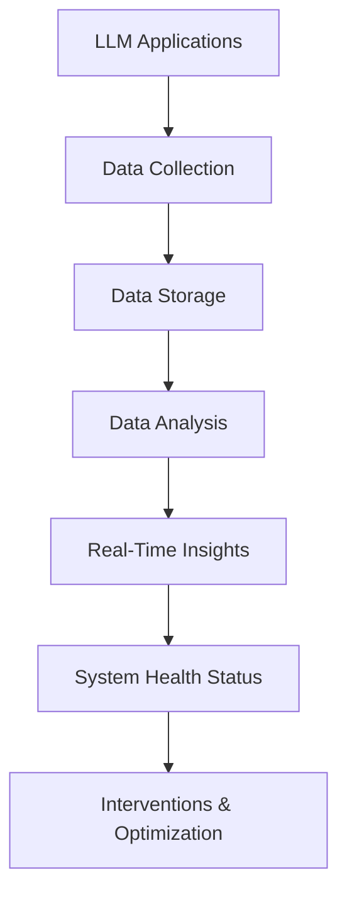

                 

### LLMM Applications Continuous Monitoring: Real-Time Insights into System Health Status

# LLMM Applications Continuous Monitoring: Real-Time Insights into System Health Status

## Keywords:
- LLM Continuous Monitoring
- Real-Time Insights
- System Health Status
- Machine Learning Algorithms
- Data Collection and Analysis

### Abstract:
This article delves into the realm of LLM (Large Language Model) applications continuous monitoring, focusing on providing real-time insights into the system's health status. We will explore the foundational concepts, techniques, and mathematical models involved in this domain. By examining system architecture, data collection, real-time analysis, and practical case studies, we aim to provide a comprehensive understanding of implementing and maintaining an effective LLM monitoring system.

### Introduction to LLM Continuous Monitoring

#### 1.1 What is LLM Continuous Monitoring

LLM Continuous Monitoring refers to the process of systematically collecting, analyzing, and interpreting data from LLM applications to gain real-time insights into the system's health status. The primary goal of continuous monitoring is to detect and diagnose potential issues, anomalies, or performance degradation in LLM applications, enabling timely interventions and optimization.

#### 1.1.1 Core Concepts and Relationships

To better understand LLM Continuous Monitoring, let's examine the core concepts and their relationships using a Mermaid flowchart:

In this flowchart, we can see that data collection is the foundation of continuous monitoring. The collected data is stored in a data storage system, which is then analyzed to generate real-time insights. These insights are used to assess the system's health status, which guides interventions and optimization efforts.

#### 1.1.2 Definition and Importance of LLM Continuous Monitoring

Continuous monitoring involves a cycle of data collection, analysis, and action. The key elements are:

1. **Data Collection**: Gather data from various sources related to LLM applications, such as logs, metrics, and user interactions.
2. **Data Storage**: Store the collected data in a structured format that is easily accessible for analysis.
3. **Data Analysis**: Analyze the stored data using machine learning algorithms and statistical methods to extract meaningful insights.
4. **Real-Time Insights**: Generate real-time insights from the analyzed data to evaluate the system's health status.
5. **System Health Status**: Assess the current state of the system based on the insights obtained from data analysis.
6. **Interventions & Optimization**: Take corrective actions based on the system's health status to improve performance, address issues, and optimize resources.

The importance of LLM Continuous Monitoring can be summarized as follows:

1. **Early Detection of Anomalies**: Continuous monitoring enables the early detection of anomalies or performance degradation in LLM applications, allowing for timely interventions.
2. **Optimized Resource Allocation**: By continuously monitoring the system's health status, organizations can allocate resources more efficiently, ensuring optimal performance.
3. **Improved User Experience**: Continuous monitoring helps maintain the quality of LLM applications, leading to an improved user experience and reduced downtime.
4. **Enhanced Security**: Continuous monitoring helps identify potential security threats or vulnerabilities in LLM applications, enabling proactive measures to safeguard the system.
5. **Compliance and Reporting**: Continuous monitoring ensures compliance with regulatory requirements and facilitates the generation of detailed reports for auditing and analysis.

#### 1.1.3 Historical Context and Evolution of LLM Monitoring

The concept of continuous monitoring has been around for decades, initially applied in industries such as manufacturing and telecommunications. However, the advent of machine learning and big data analytics has revolutionized the field, enabling the development of sophisticated LLM monitoring systems.

In the early days, monitoring systems were primarily based on rule-based approaches, which were limited in their ability to detect and diagnose complex issues. With the emergence of machine learning algorithms and big data analytics, continuous monitoring has become more powerful and accurate.

Over time, LLM monitoring systems have evolved to incorporate advanced techniques such as anomaly detection, real-time processing, and embedded machine learning models. These advancements have significantly improved the effectiveness and efficiency of continuous monitoring, making it an integral part of modern LLM applications.

### Conclusion

In this chapter, we introduced the concept of LLM Continuous Monitoring and its importance in maintaining the health and performance of LLM applications. We discussed the core concepts and relationships involved in continuous monitoring and provided a historical context of its evolution. In the following chapters, we will delve deeper into the various techniques, mathematical models, and practical applications of LLM Continuous Monitoring. By the end of this article, you will have a comprehensive understanding of how to implement and maintain an effective LLM monitoring system.

