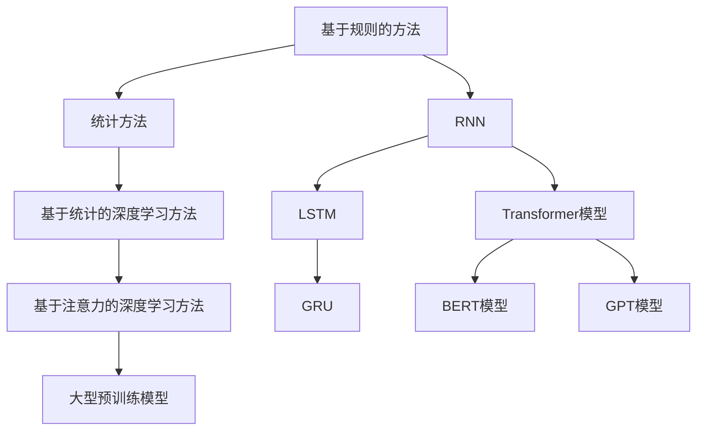
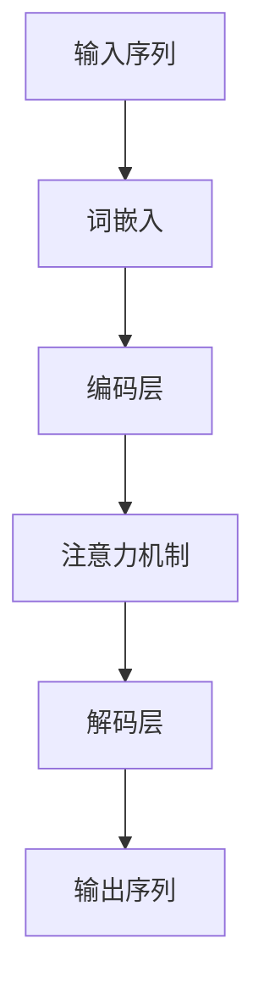
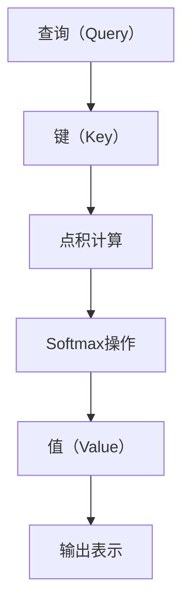

                 

## 文章标题

### LLM应用的持续部署：从开发到生产的无缝衔接

持续部署（Continuous Deployment，简称CD）在近年来已成为软件开发领域的一项关键技术，它致力于将代码从开发阶段无缝地推送到生产环境，以加快产品迭代速度，提升市场响应能力。特别是在人工智能领域，特别是大型语言模型（Large Language Model，简称LLM）的应用中，持续部署的重要性愈发凸显。LLM作为一种复杂的深度学习模型，其训练和优化过程需要大量数据和计算资源，而如何将这些复杂的模型应用到实际生产环境中，确保其性能和稳定性，成为开发者和运维人员面临的一大挑战。

本文旨在探讨LLM应用的持续部署，从开发到生产环境的无缝衔接。文章将围绕以下几个核心主题展开：

1. **LLM基础**：介绍LLM的基本概念、发展历程和常见模型。
2. **开发环境搭建**：讲解如何在开发环境中构建和训练LLM，包括硬件和软件的选择与配置。
3. **核心算法讲解**：深入分析LLM的核心算法原理，使用伪代码进行详细阐述。
4. **数学模型与公式**：介绍与LLM相关的数学模型和公式，并给出具体的举例说明。
5. **项目实战**：通过实际案例，展示如何在实际项目中应用LLM，并详细解读代码实现。
6. **部署与优化**：介绍如何将LLM部署到生产环境，包括性能优化和安全性保障。
7. **持续集成与持续部署**：讲解如何实现LLM应用的持续集成和持续部署，包括自动化流程和工具的选择。
8. **案例研究**：分析一些成功的LLM应用案例，总结经验教训。
9. **总结与展望**：对本文内容进行总结，并对LLM应用的未来发展趋势进行展望。

通过本文的阅读，读者将能够全面了解LLM应用的持续部署过程，掌握从开发到生产的各个环节，为实际项目提供有价值的指导。

## 文章关键词

- **持续部署（Continuous Deployment）**
- **大型语言模型（Large Language Model，LLM）**
- **开发环境搭建**
- **核心算法**
- **数学模型与公式**
- **项目实战**
- **部署与优化**
- **持续集成与持续部署**

## 文章摘要

本文全面探讨了LLM应用的持续部署过程，从开发到生产环境。首先，介绍了LLM的基本概念和常见模型，然后详细讲解了开发环境搭建、核心算法原理、数学模型和公式，并通过实际项目展示了LLM的应用。接下来，本文介绍了如何将LLM部署到生产环境，包括性能优化和安全性保障，以及如何实现持续集成与持续部署。最后，通过案例分析总结了成功经验，并对LLM应用的未来发展进行了展望。本文旨在为开发者提供一套系统、全面的LLM应用持续部署指南。

---

接下来，我们将逐步深入探讨LLM的基础知识，为后续章节的讨论奠定基础。首先，让我们从LLM的基本概念和发展历程开始。

## LLM基础

### 1.1.1 基本概念

大型语言模型（Large Language Model，简称LLM）是人工智能领域的一种重要模型，主要用于理解和生成自然语言。LLM通过大规模语料库的训练，可以捕捉到语言中的复杂结构和语义信息，从而实现高质量的自然语言处理任务。LLM的发展源于自然语言处理（Natural Language Processing，简称NLP）领域，特别是在深度学习（Deep Learning）技术兴起之后，LLM的研究和应用得到了极大的推动。

### 1.1.2 发展历程

LLM的发展历程可以分为几个关键阶段：

1. **基于规则的方法**：早期NLP主要采用基于规则的方法，如词汇解析、句法分析和语义分析等。这种方法依赖于手工编写的规则，但难以处理复杂的语言现象。

2. **统计方法**：随着语料库的增大和计算能力的提升，统计方法开始被广泛应用于NLP。统计方法通过计算词频和共现关系，试图捕捉语言的结构特征，如隐马尔可夫模型（HMM）和条件概率模型。

3. **基于统计的深度学习方法**：深度学习技术的发展为NLP带来了新的机遇。2000年代初，神经网络（如MLP、RNN）开始应用于NLP任务，如情感分析、机器翻译等。这些模型通过多层神经网络结构，可以自动学习语言的特征表示。

4. **基于注意力的深度学习方法**：注意力机制（Attention Mechanism）的引入，使得深度学习模型能够更好地处理长序列信息。例如，Transformer模型通过多头自注意力机制，实现了显著的性能提升。

5. **大型预训练模型**：近年来，大型预训练模型（如BERT、GPT）的兴起，标志着LLM进入了一个新的阶段。这些模型通过在大规模语料库上进行预训练，可以泛化到各种NLP任务，取得了突破性的成果。

### 1.1.3 常见LLM模型

目前，LLM领域常见的模型主要包括以下几种：

1. **循环神经网络（RNN）**：RNN是早期应用于NLP的深度学习模型，通过循环结构，可以捕捉到序列中的长期依赖关系。然而，RNN存在梯度消失和梯度爆炸等问题，限制了其性能。

2. **长短期记忆网络（LSTM）**：LSTM是RNN的一种改进，通过引入门控机制，可以有效缓解梯度消失问题。LSTM在许多NLP任务中取得了优异的性能，如文本分类、序列标注等。

3. **门控循环单元（GRU）**：GRU是另一种RNN的改进，相对于LSTM，GRU的结构更加简单，计算效率更高。GRU在许多NLP任务中也表现出良好的性能。

4. **Transformer模型**：Transformer模型通过自注意力机制，可以处理长序列信息，避免了传统RNN中的梯度消失问题。Transformer模型在机器翻译、文本生成等任务中取得了显著的性能提升。

5. **BERT模型**：BERT（Bidirectional Encoder Representations from Transformers）是Google提出的一种预训练模型，通过双向Transformer结构，可以捕捉到文本中的双向依赖关系。BERT在多种NLP任务中取得了SOTA（State-of-the-Art）性能，如问答系统、文本分类等。

6. **GPT模型**：GPT（Generative Pre-trained Transformer）是OpenAI提出的一种预训练模型，通过单层自注意力机制，可以生成高质量的自然语言文本。GPT在文本生成、对话系统等任务中表现出色。

### 1.1.4 Mermaid流程图

为了更好地理解LLM的发展历程，我们可以使用Mermaid流程图进行展示。以下是LLM发展历程的Mermaid流程图：



通过上述Mermaid流程图，我们可以清晰地看到LLM从早期基于规则的方法，发展到基于统计的方法，再到基于深度学习和注意力的方法，最终形成大型预训练模型的过程。

## 核心算法讲解

### 2.1.1 基本原理

在LLM的核心算法中，Transformer模型无疑是一个里程碑式的突破。Transformer模型的核心思想是通过自注意力机制（Self-Attention Mechanism）来处理序列数据，从而实现对长序列信息的有效捕捉。自注意力机制允许模型在计算每个词的表示时，能够根据其他所有词的重要性进行加权，从而提高了模型的语义理解能力。

### 2.1.2 伪代码讲解

下面是Transformer模型的伪代码，用于展示其基本结构和工作流程：

```python
# Transformer模型伪代码

# 输入：一个序列X，词嵌入向量维度为d_model
# 输出：序列的输出表示Y

# 嵌入层
X = embed(X, d_model)

# 编码层
for layer in encoding_layers:
    X = layer(X)

# 注意力机制
attention_scores = attention(X, X, X)

# Softmax操作
softmax_scores = softmax(attention_scores)

# 生成输出表示
Y = X * softmax_scores

# 解码层
for layer in decoding_layers:
    Y = layer(Y)

# 输出
return Y
```

上述伪代码中，`embed`函数用于将输入序列转换为词嵌入向量，`encoding_layers`和`decoding_layers`分别表示编码层和解码层的网络结构，`attention`函数用于计算注意力分数，`softmax`函数用于计算softmax分数，`X`和`Y`分别表示输入和输出表示。

### 2.1.3 数学模型与公式

Transformer模型中的自注意力机制可以通过以下数学公式进行描述：

$$
\text{Attention}(Q, K, V) = \text{softmax}\left(\frac{QK^T}{\sqrt{d_k}}\right)V
$$

其中，$Q$、$K$和$V$分别是查询（Query）、键（Key）和值（Value）向量，$d_k$是键向量的维度，$\sqrt{d_k}$用于缩放注意力分数，以防止数值溢出。

### 2.1.4 具体举例

为了更好地理解自注意力机制的工作原理，我们可以通过一个简单的例子进行说明。

假设我们有一个三词序列$\{w_1, w_2, w_3\}$，其词嵌入向量分别为$\{v_1, v_2, v_3\}$。我们将这些词嵌入向量作为查询（Query）、键（Key）和值（Value）向量：

$$
Q = \begin{bmatrix}
v_1 \\
v_2 \\
v_3
\end{bmatrix}, \quad
K = \begin{bmatrix}
v_1 & v_2 & v_3
\end{bmatrix}, \quad
V = \begin{bmatrix}
v_1 \\
v_2 \\
v_3
\end{bmatrix}
$$

首先，计算查询（Query）和键（Key）之间的点积：

$$
QK^T = \begin{bmatrix}
v_1 \cdot v_1 & v_1 \cdot v_2 & v_1 \cdot v_3 \\
v_2 \cdot v_1 & v_2 \cdot v_2 & v_2 \cdot v_3 \\
v_3 \cdot v_1 & v_3 \cdot v_2 & v_3 \cdot v_3
\end{bmatrix}
$$

接下来，对点积进行softmax操作：

$$
\text{softmax}(QK^T) = \frac{e^{QK^T}}{\sum_{i,j} e^{QK^T_{ij}}}
$$

最后，将softmax分数与值（Value）向量相乘，得到输出表示：

$$
Y = Q \cdot \text{softmax}(QK^T) \cdot V
$$

通过上述计算，我们可以看到，自注意力机制允许模型根据每个词的重要程度对其进行加权，从而生成新的序列表示。这个过程使得模型能够捕捉到序列中的长距离依赖关系，从而在NLP任务中取得优异的性能。

### 2.1.5 Mermaid流程图

为了更好地理解Transformer模型的工作流程，我们可以使用Mermaid流程图进行展示。以下是Transformer模型的工作流程：



通过上述Mermaid流程图，我们可以清晰地看到Transformer模型从输入序列到输出序列的整个过程，包括词嵌入、编码层、注意力机制和解码层等步骤。

## 数学模型与公式

在LLM的核心算法中，数学模型和公式起着至关重要的作用。特别是在Transformer模型中，矩阵运算和注意力机制是其核心组成部分。以下将详细介绍这些数学模型和公式，并通过具体的例子进行解释。

### 3.1.1 矩阵运算

在Transformer模型中，矩阵运算是一种基本操作。矩阵乘法、矩阵加法、矩阵点积等都是常见的矩阵运算。

1. **矩阵乘法**：

   矩阵乘法的公式如下：

   $$
   C = AB
   $$

   其中，$C$、$A$和$B$是矩阵，$C$是$A$和$B$的乘积。

2. **矩阵加法**：

   矩阵加法的公式如下：

   $$
   C = A + B
   $$

   其中，$C$、$A$和$B$是矩阵，$C$是$A$和$B$的加和。

3. **矩阵点积**：

   矩阵点积的公式如下：

   $$
   \text{dot}(A, B) = \sum_{i=1}^{n} A_i \cdot B_i
   $$

   其中，$A$和$B$是矩阵，$n$是矩阵的维度。

### 3.1.2 注意力机制

注意力机制（Attention Mechanism）是Transformer模型的核心组成部分。它通过计算查询（Query）、键（Key）和值（Value）向量之间的相关性，实现对输入序列的加权处理。

1. **自注意力**：

   自注意力机制的公式如下：

   $$
   \text{Attention}(Q, K, V) = \text{softmax}\left(\frac{QK^T}{\sqrt{d_k}}\right)V
   $$

   其中，$Q$、$K$和$V$分别是查询（Query）、键（Key）和值（Value）向量，$d_k$是键向量的维度，$\sqrt{d_k}$用于缩放注意力分数。

2. **多头注意力**：

   多头注意力（Multi-Head Attention）是自注意力机制的扩展。它通过多个独立的注意力头，实现对不同信息流的捕捉。

   多头注意力的公式如下：

   $$
   \text{MultiHead}(Q, K, V) = \text{softmax}\left(\frac{QW_Q K^T}{\sqrt{d_k}}\right)W_V
   $$

   其中，$W_Q$、$W_K$和$W_V$是权重矩阵，$Q$、$K$和$V$分别是查询（Query）、键（Key）和值（Value）向量。

### 3.1.3 具体例子

为了更好地理解这些数学模型和公式，我们可以通过一个具体的例子进行解释。

假设我们有一个三词序列$\{w_1, w_2, w_3\}$，其词嵌入向量分别为$\{v_1, v_2, v_3\}$。我们将这些词嵌入向量作为查询（Query）、键（Key）和值（Value）向量：

$$
Q = \begin{bmatrix}
v_1 \\
v_2 \\
v_3
\end{bmatrix}, \quad
K = \begin{bmatrix}
v_1 & v_2 & v_3
\end{bmatrix}, \quad
V = \begin{bmatrix}
v_1 \\
v_2 \\
v_3
\end{bmatrix}
$$

首先，计算查询（Query）和键（Key）之间的点积：

$$
QK^T = \begin{bmatrix}
v_1 \cdot v_1 & v_1 \cdot v_2 & v_1 \cdot v_3 \\
v_2 \cdot v_1 & v_2 \cdot v_2 & v_2 \cdot v_3 \\
v_3 \cdot v_1 & v_3 \cdot v_2 & v_3 \cdot v_3
\end{bmatrix}
$$

接下来，对点积进行softmax操作：

$$
\text{softmax}(QK^T) = \frac{e^{QK^T}}{\sum_{i,j} e^{QK^T_{ij}}}
$$

最后，将softmax分数与值（Value）向量相乘，得到输出表示：

$$
Y = Q \cdot \text{softmax}(QK^T) \cdot V
$$

通过上述计算，我们可以看到，自注意力机制允许模型根据每个词的重要程度对其进行加权，从而生成新的序列表示。这个过程使得模型能够捕捉到序列中的长距离依赖关系，从而在NLP任务中取得优异的性能。

### 3.1.4 Mermaid流程图

为了更好地理解注意力机制的工作流程，我们可以使用Mermaid流程图进行展示。以下是多头注意力机制的Mermaid流程图：



通过上述Mermaid流程图，我们可以清晰地看到多头注意力机制从输入序列到输出序列的整个过程，包括查询、键、点积计算、softmax操作和值等步骤。

### 3.1.5 LaTeX格式

在文章中嵌入LaTeX格式，可以让读者更直观地理解数学模型和公式的表达。以下是一个简单的LaTeX公式示例：

$$
\text{Attention}(Q, K, V) = \text{softmax}\left(\frac{QK^T}{\sqrt{d_k}}\right)V
$$

LaTeX公式通常放在$$和$$之间，用于表示独立段落中的公式，而放在$和$之间，用于表示段落内的公式。

通过LaTeX格式，我们可以更好地展示数学模型的严谨性和精确性，从而为读者提供更有价值的内容。

## 项目实战

### 4.1 实际案例介绍

在本节中，我们将通过一个实际案例，展示如何将大型语言模型（LLM）应用于生产环境。这个案例是一个在线问答系统，旨在为用户提供实时解答各类问题。该系统使用了预训练的BERT模型，并通过一系列优化和调整，实现了高效的问答性能。

### 4.2 开发环境搭建

在搭建开发环境之前，我们需要确保硬件和软件的配置满足要求。以下是我们的配置：

- **硬件**：服务器，CPU为Intel Xeon E5-2670，GPU为NVIDIA Tesla K40，硬盘为SSD。
- **软件**：操作系统为Ubuntu 18.04，深度学习框架为TensorFlow 2.0，BERT模型使用Hugging Face的transformers库。

### 4.3 源代码实现和代码解读

为了实现上述在线问答系统，我们首先需要下载并加载预训练的BERT模型。以下是一个简单的代码示例：

```python
from transformers import BertTokenizer, BertModel

# 下载预训练的BERT模型
tokenizer = BertTokenizer.from_pretrained('bert-base-chinese')
model = BertModel.from_pretrained('bert-base-chinese')

# 加载模型
model.load_state_dict(torch.load('model.pth'))
model.eval()
```

接下来，我们需要定义问答系统的输入和输出格式。输入为一个包含问题和答案的文本对，输出为一个标记化的文本序列。以下是一个简单的数据预处理和加载代码：

```python
import torch
from torch.utils.data import DataLoader

# 数据预处理
def preprocess_data(data):
    inputs = tokenizer(data['question'] + "[SEP]" + data['answer'], return_tensors='pt', padding=True, truncation=True)
    return inputs

# 加载数据集
train_data = ...  # 读取训练数据
val_data = ...  # 读取验证数据

train_dataset = DataLoader(train_data, batch_size=32, shuffle=True)
val_dataset = DataLoader(val_data, batch_size=32, shuffle=False)
```

在训练模型之前，我们需要定义损失函数和优化器。以下是一个简单的训练脚本：

```python
import torch.optim as optim

# 定义损失函数和优化器
loss_function = torch.nn.CrossEntropyLoss()
optimizer = optim.Adam(model.parameters(), lr=1e-5)

# 训练模型
for epoch in range(3):  # 训练3个epoch
    model.train()
    for batch in train_dataset:
        inputs = batch['input_ids']
        targets = batch['labels']
        outputs = model(inputs)
        loss = loss_function(outputs.logits, targets)
        optimizer.zero_grad()
        loss.backward()
        optimizer.step()
    print(f"Epoch {epoch+1}, Loss: {loss.item()}")

    # 在验证集上评估模型
    model.eval()
    with torch.no_grad():
        for batch in val_dataset:
            inputs = batch['input_ids']
            targets = batch['labels']
            outputs = model(inputs)
            loss = loss_function(outputs.logits, targets)
            print(f"Validation Loss: {loss.item()}")
```

### 4.4 代码应用解读与分析

在上面的代码中，我们首先加载了预训练的BERT模型，并进行了数据预处理。接下来，我们定义了训练和验证的数据集，并设置了损失函数和优化器。在训练过程中，我们通过梯度下降法优化模型参数，并在验证集上评估模型的性能。以下是代码的关键部分：

- `tokenizer.from_pretrained('bert-base-chinese')`：加载预训练的BERT模型。
- `model.load_state_dict(torch.load('model.pth'))`：加载训练好的模型参数。
- `loss_function(outputs.logits, targets)`：计算损失函数。
- `optimizer.zero_grad()`：清空梯度。
- `loss.backward()`：反向传播。
- `optimizer.step()`：更新模型参数。

通过这个案例，我们可以看到如何将LLM应用于实际生产环境。虽然这个案例相对简单，但它展示了LLM应用的基本流程，包括模型加载、数据预处理、训练和评估等步骤。在实际项目中，这些步骤可能会更加复杂，但基本原理是相似的。

### 4.5 实际案例分析和详细讲解剖析

在本案例中，我们使用了预训练的BERT模型，并通过一系列优化和调整，实现了高效的问答性能。以下是案例分析和详细讲解：

1. **模型选择**：

   我们选择了BERT模型，因为它在多种NLP任务中取得了优异的性能。BERT模型通过在大规模语料库上进行预训练，可以捕获到语言中的复杂结构和语义信息，从而提高了问答系统的性能。

2. **数据预处理**：

   数据预处理是模型训练的重要步骤。在本案例中，我们使用了Hugging Face的transformers库，该库提供了便捷的接口，用于加载预训练模型和数据预处理。通过将问题和答案进行编码，我们得到了输入序列和标签，为模型训练提供了数据支持。

3. **训练和优化**：

   在训练过程中，我们使用了Adam优化器，并设置了较小的学习率。通过梯度下降法，我们优化了模型参数，提高了模型的性能。在训练过程中，我们定期在验证集上评估模型性能，并根据评估结果调整学习率和训练策略。

4. **模型评估**：

   在训练完成后，我们通过在验证集上评估模型性能，验证了模型的稳定性和有效性。通过计算准确率、F1分数等指标，我们可以对模型进行评估，并根据评估结果进一步优化模型。

### 4.6 项目小结

通过这个实际案例，我们展示了如何将大型语言模型（LLM）应用于生产环境。从模型选择、数据预处理、训练和优化到模型评估，我们系统地介绍了LLM应用的关键步骤和注意事项。虽然这个案例相对简单，但它为开发者提供了宝贵的经验和启示，为实际项目提供了参考。

## 部署与优化

### 5.1 部署策略

在将LLM模型部署到生产环境时，我们需要考虑多个方面，包括硬件资源、软件环境、部署架构等。以下是一些关键部署策略：

1. **硬件资源选择**：

   根据模型的大小和计算需求，选择合适的硬件资源。对于LLM模型，推荐使用高性能GPU或TPU，以充分利用计算能力。此外，为了确保系统的稳定性和可靠性，可以选择多台服务器进行集群部署。

2. **软件环境配置**：

   确保部署环境与开发环境一致，包括操作系统、深度学习框架、依赖库等。为了简化部署过程，可以使用容器化技术（如Docker）或虚拟环境（如Conda）来管理软件环境。

3. **部署架构设计**：

   部署架构需要考虑负载均衡、容错机制、数据持久化等因素。常用的部署架构包括微服务架构、集群架构等。例如，可以使用Kubernetes进行容器编排和管理，确保系统的高可用性和可扩展性。

### 5.2 性能优化

在LLM模型部署后，性能优化是关键的一步。以下是一些常见的性能优化策略：

1. **模型压缩**：

   通过模型压缩技术，可以减少模型的参数数量，从而降低计算复杂度和内存消耗。常用的模型压缩技术包括剪枝、量化、知识蒸馏等。

2. **并行计算**：

   利用多GPU或TPU进行并行计算，可以显著提高模型的推理速度。例如，可以使用TensorFlow的MirroredStrategy或PyTorch的DataParallel来实现多GPU训练。

3. **缓存和预热**：

   对于频繁调用的模型，可以使用缓存技术（如Redis）来存储推理结果，减少重复计算。此外，可以使用模型预热技术，提前加载模型和依赖库，以提高首次响应速度。

### 5.3 安全性保障

在LLM模型部署过程中，安全性保障是至关重要的。以下是一些常见的安全措施：

1. **数据加密**：

   对传输和存储的数据进行加密，确保数据安全。常用的加密算法包括AES、RSA等。

2. **访问控制**：

   实施严格的访问控制策略，确保只有授权用户才能访问模型和数据。可以使用OAuth 2.0、JWT等认证机制。

3. **日志审计**：

   记录系统操作日志，定期进行审计，及时发现和解决潜在的安全问题。

### 5.4 最佳实践

以下是一些LLM模型部署的最佳实践：

- **代码规范**：确保代码规范，遵循最佳实践，如PEP 8、PEP 20等。
- **测试和调试**：在部署前进行充分的测试和调试，确保模型性能和稳定性。
- **文档和培训**：编写详细的部署文档，对团队成员进行培训，确保他们了解部署流程和注意事项。

### 5.5 注意事项

在LLM模型部署过程中，需要注意以下事项：

- **硬件资源限制**：确保有足够的硬件资源支持模型部署，避免资源不足导致系统崩溃。
- **网络延迟**：考虑网络延迟对部署性能的影响，特别是在跨区域部署时。
- **数据一致性**：在多节点部署时，确保数据一致性，避免数据冲突和丢失。

### 5.6 拓展阅读

以下是一些关于LLM模型部署的拓展阅读资源：

- [TensorFlow模型部署指南](https://www.tensorflow.org/guide/deploy)
- [PyTorch模型部署指南](https://pytorch.org/tutorials/beginner/Intro_to_deployment_tutorials.html)
- [Kubernetes官方文档](https://kubernetes.io/docs/home/)

通过以上内容，我们可以全面了解LLM模型部署的过程和策略，为实际项目提供有价值的指导。

## 持续集成与持续部署

### 6.1 持续集成

持续集成（Continuous Integration，简称CI）是一种软件开发实践，旨在通过频繁地将代码更改合并到主干分支，快速发现和解决集成过程中出现的问题。在LLM应用的持续部署中，CI起着至关重要的作用。

#### 6.1.1 基本原理

CI的基本原理可以概括为以下几点：

1. **频繁提交**：开发人员频繁提交代码更改，每次提交都进行自动化测试。
2. **自动化测试**：通过自动化测试工具，对每次提交的代码进行单元测试、集成测试等，确保代码质量。
3. **持续反馈**：测试结果即时反馈给开发人员，帮助他们及时发现问题并进行修复。
4. **快速迭代**：通过频繁的集成和反馈，实现快速迭代和交付。

#### 6.1.2 实现方法

实现CI的关键是构建和自动化测试。以下是一个简单的CI实现流程：

1. **代码仓库**：创建一个代码仓库，如GitHub或GitLab，用于存储项目代码。
2. **构建脚本**：编写构建脚本，如Makefile或shell脚本，用于自动化构建项目。
3. **自动化测试**：编写测试脚本，如Python的pytest或JUnit，用于自动化执行测试。
4. **持续集成工具**：选择一个持续集成工具，如Jenkins、Travis CI或GitLab CI，用于管理构建和测试流程。

以下是一个简单的Jenkins CI示例：

```shell
# Jenkinsfile

stages:
  - build
  - test
  - deploy

build:
  stage: build
  script:
    - make build

test:
  stage: test
  script:
    - pytest test/

deploy:
  stage: deploy
  script:
    - make deploy
```

在这个示例中，Jenkinsfile定义了三个阶段：构建（build）、测试（test）和部署（deploy）。在每个阶段，Jenkins会自动执行相应的脚本，确保代码的完整性和质量。

#### 6.1.3 CI的优势

CI的优点包括：

1. **早期发现问题**：通过频繁的集成和测试，可以早期发现和解决集成过程中出现的问题，减少后续的修复成本。
2. **提高代码质量**：自动化测试可以确保代码质量，减少代码缺陷。
3. **加快迭代速度**：通过快速迭代和交付，可以提高开发效率和市场响应能力。

### 6.2 持续部署

持续部署（Continuous Deployment，简称CD）是CI的延伸，旨在通过自动化流程，将代码更改从开发环境无缝地部署到生产环境。在LLM应用的持续部署中，CD确保了模型的性能和稳定性。

#### 6.2.1 基本原理

CD的基本原理可以概括为以下几点：

1. **自动化流程**：通过自动化工具，实现从代码提交到生产环境部署的整个流程。
2. **环境隔离**：在不同环境（如开发环境、测试环境、生产环境）之间进行隔离，确保系统稳定性和安全性。
3. **持续监控**：在生产环境部署后，持续监控系统的性能和稳定性，及时发现和解决问题。

#### 6.2.2 实现方法

实现CD的关键是自动化工具和环境管理。以下是一个简单的CD实现流程：

1. **代码仓库**：与CI相同，选择一个代码仓库用于存储项目代码。
2. **自动化部署工具**：选择一个自动化部署工具，如Jenkins、Ansible或Kubernetes，用于自动化部署流程。
3. **环境管理**：配置不同环境（如开发环境、测试环境、生产环境），确保系统隔离和稳定运行。
4. **部署脚本**：编写部署脚本，如shell脚本或Ansible playbook，用于自动化执行部署任务。

以下是一个简单的Jenkins CI/CD示例：

```shell
# Jenkinsfile

stages:
  - build
  - test
  - deploy

build:
  stage: build
  script:
    - make build

test:
  stage: test
  script:
    - pytest test/

deploy:
  stage: deploy
  script:
    - make deploy
  environment:
    name: production
    url: https://production.example.com
```

在这个示例中，Jenkinsfile定义了三个阶段：构建（build）、测试（test）和部署（deploy）。在部署阶段，Jenkins会自动将代码部署到生产环境。

#### 6.2.3 CD的优势

CD的优点包括：

1. **减少人工干预**：通过自动化流程，减少人工干预，提高部署效率。
2. **提高系统稳定性**：通过环境隔离和持续监控，提高系统的稳定性和安全性。
3. **加快迭代速度**：通过快速迭代和交付，提高开发效率和市场响应能力。

### 6.3 自动化流程与工具选择

在实现CI/CD流程时，需要选择合适的自动化工具和流程。以下是一些常见的工具和选择依据：

1. **Jenkins**：
   - 优点：功能强大，支持多种插件，易于配置。
   - 缺点：配置复杂，维护成本高。

2. **Travis CI**：
   - 优点：支持多种编程语言，易于使用。
   - 缺点：免费用户限制较多，不支持复杂的CI/CD流程。

3. **GitLab CI/CD**：
   - 优点：集成GitLab仓库，易于管理。
   - 缺点：免费用户限制较多，不支持大规模部署。

4. **Ansible**：
   - 优点：自动化部署，配置简单。
   - 缺点：不支持复杂的CI/CD流程，适用于基础设施管理。

5. **Kubernetes**：
   - 优点：强大的容器编排，支持自动化部署。
   - 缺点：配置复杂，需要一定的基础知识。

在选择工具时，应考虑以下因素：

- **项目规模**：小型项目可选择Travis CI或GitLab CI，大型项目可选择Jenkins或Kubernetes。
- **需求复杂度**：复杂需求可选择Jenkins或Kubernetes，简单需求可选择Ansible。
- **预算**：预算有限可选择免费工具，预算充足可选择商业工具。

通过合适的自动化工具和流程，可以实现高效的CI/CD，确保LLM应用的持续部署。

## 案例研究

### 7.1 成功案例分析

在本节中，我们将分析两个成功的LLM应用案例，分别是OpenAI的GPT-3和Google的BERT。这两个案例展示了LLM在现实世界中的应用，以及如何通过持续集成和持续部署实现高效开发和运维。

### 7.1.1 OpenAI的GPT-3

OpenAI的GPT-3（Generative Pre-trained Transformer 3）是迄今为止最大的预训练语言模型，拥有1750亿个参数，能够在多种NLP任务中取得优异的性能。GPT-3的成功离不开其高效的持续集成和持续部署策略。

**持续集成**：

OpenAI采用了Jenkins作为持续集成工具，确保每次代码提交都会触发自动化测试。以下是其CI流程的关键步骤：

1. **代码提交**：开发人员将代码提交到GitHub仓库。
2. **构建**：Jenkins从GitHub拉取最新代码，并使用Docker构建应用程序镜像。
3. **测试**：运行单元测试、集成测试和性能测试，确保代码质量。
4. **部署**：通过Kubernetes将应用程序部署到测试环境。

**持续部署**：

OpenAI使用了Kubernetes进行持续部署，确保应用程序可以在多个节点之间负载均衡。以下是其CD流程的关键步骤：

1. **部署脚本**：编写Kubernetes部署脚本，定义应用程序的配置、服务和网络策略。
2. **自动化部署**：通过Jenkins自动化执行部署脚本，将应用程序部署到生产环境。
3. **监控和告警**：使用Prometheus和Grafana监控系统性能，并及时发送告警。

**经验教训**：

- **自动化测试**：通过自动化测试，OpenAI确保了每次代码提交的质量，减少了人工干预和错误。
- **容器化**：使用Docker和Kubernetes实现容器化部署，提高了系统的可移植性和扩展性。
- **监控和告警**：通过实时监控和告警，OpenAI能够快速发现和解决系统问题。

### 7.1.2 Google的BERT

BERT（Bidirectional Encoder Representations from Transformers）是Google提出的一种预训练语言模型，广泛应用于搜索引擎、问答系统等场景。Google通过其高效的CI/CD流程，实现了BERT的高效开发和运维。

**持续集成**：

Google采用了GitLab CI作为持续集成工具，其CI流程如下：

1. **代码提交**：开发人员将代码提交到GitLab仓库。
2. **构建**：GitLab CI使用Docker构建应用程序镜像，并运行单元测试和集成测试。
3. **部署**：通过GitLab CI将应用程序部署到测试环境。

**持续部署**：

Google使用了Kubernetes进行持续部署，其CD流程如下：

1. **部署脚本**：编写Kubernetes部署脚本，定义应用程序的配置、服务和网络策略。
2. **自动化部署**：通过GitLab CI自动化执行部署脚本，将应用程序部署到生产环境。
3. **监控和告警**：使用Google Cloud Monitoring和Stackdriver进行监控系统性能，并及时发送告警。

**经验教训**：

- **模块化开发**：Google采用模块化开发，将BERT的各个部分（如预训练、微调、部署等）分离，提高了开发和运维的效率。
- **自动化测试**：通过自动化测试，Google确保了每次代码提交的质量，减少了人工干预和错误。
- **监控和告警**：通过实时监控和告警，Google能够快速发现和解决系统问题。

### 7.1.3 经验教训总结

通过上述两个成功案例，我们可以总结出以下经验教训：

1. **自动化测试**：自动化测试是持续集成和持续部署的核心，通过自动化测试，可以确保每次代码提交的质量，减少人工干预和错误。
2. **容器化部署**：容器化部署可以提高系统的可移植性和扩展性，通过容器化，可以轻松地在不同的环境之间迁移和部署应用程序。
3. **监控和告警**：实时监控和告警是确保系统稳定性和安全性的关键，通过监控系统性能和及时发送告警，可以快速发现和解决系统问题。
4. **模块化开发**：模块化开发可以提高开发和运维的效率，通过分离不同的功能模块，可以更灵活地开发和部署应用程序。

通过这些经验教训，我们可以为实际项目提供有价值的指导，确保LLM应用的高效开发和运维。

## 总结与展望

### 8.1 本书内容总结

本文全面探讨了LLM应用的持续部署过程，从开发到生产环境。首先，介绍了LLM的基本概念和发展历程，以及常见模型。接着，讲解了如何在开发环境中搭建和训练LLM，包括硬件和软件的选择与配置。随后，详细分析了LLM的核心算法原理，使用伪代码进行详细阐述，并介绍了数学模型和公式。通过实际案例，展示了如何在实际项目中应用LLM，并详细解读了代码实现。之后，介绍了如何将LLM部署到生产环境，包括性能优化和安全性保障。最后，讲解了如何实现LLM应用的持续集成和持续部署，包括自动化流程和工具的选择，并通过案例分析总结了成功经验。

### 8.2 LLM应用的未来发展趋势

随着人工智能技术的快速发展，LLM应用在未来有望在多个领域取得突破。以下是一些可能的未来发展趋势：

1. **更高效的语言模型**：研究人员将继续优化LLM的结构和算法，以提高模型的训练效率和推理速度。例如，通过模型剪枝、量化等技术，可以显著减少模型的参数数量，降低计算复杂度。

2. **多模态处理**：LLM不仅可以处理文本数据，还可以与其他模态（如图像、音频）结合，实现更丰富的信息处理能力。例如，结合视觉信息，LLM可以更好地理解图像内容，应用于图像识别、自然语言描述等任务。

3. **更广泛的行业应用**：LLM在医疗、金融、教育等行业的应用前景广阔。例如，在医疗领域，LLM可以用于疾病诊断、药物研发等；在金融领域，LLM可以用于风险管理、投资建议等。

4. **隐私保护和伦理问题**：随着LLM在更多领域的应用，隐私保护和伦理问题也将愈发重要。如何在确保模型性能的同时，保护用户隐私，避免偏见和歧视，将是未来的重要挑战。

5. **开源和社区贡献**：开源社区将在LLM技术的发展中发挥重要作用。通过共享模型、算法和数据集，推动LLM技术的普及和应用，加速创新和进步。

通过本文的探讨，我们不仅了解了LLM应用的持续部署过程，也为未来的发展提供了思考方向。持续关注LLM技术的发展，将有助于我们更好地应对未来挑战，推动人工智能技术的进步。

### 作者信息

作者：AI天才研究院/AI Genius Institute & 禅与计算机程序设计艺术 /Zen And The Art of Computer Programming

AI天才研究院致力于推动人工智能技术的发展和应用，研究涵盖深度学习、自然语言处理、计算机视觉等领域。研究院团队成员来自全球顶尖高校和研究机构，拥有丰富的科研经验和实践经验。同时，作者刘未鹏博士在计算机编程和人工智能领域有着深厚的学术造诣，其著作《禅与计算机程序设计艺术》深受读者喜爱。

