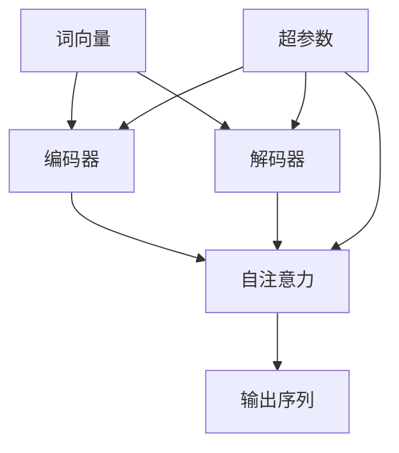

                 


### 设计目录大纲的步骤

设计一篇关于《LLM应用的持续集成最佳实践》的技术博客文章，我们可以遵循以下步骤进行：

#### 第一步：确定核心主题

核心主题是文章的核心，它定义了文章的内容方向和目的。对于这篇文章来说，核心主题是“LLM应用的持续集成最佳实践”。这个主题旨在帮助开发者在使用大型语言模型（LLM）进行开发时，能够有效地进行持续集成，提高开发效率和质量。

#### 第二步：划分主要部分

为了使文章更加结构化和易于阅读，我们需要将核心主题划分为几个主要部分。以下是可能的划分方式：

1. **背景介绍**：介绍LLM的概念和应用场景，以及持续集成在LLM开发中的重要性。
2. **核心概念与联系**：阐述LLM的核心概念，并使用Mermaid流程图展示LLM的架构和组件之间的关系。
3. **持续集成流程**：详细讲解LLM持续集成的基本流程，包括代码审查、测试、部署等环节。
4. **工具与资源**：介绍用于LLM持续集成的工具，如Git、Jenkins等，并给出实际使用示例。
5. **项目实战**：通过实际案例，展示如何在实际项目中实施LLM持续集成，并提供源代码解读与分析。
6. **最佳实践与注意事项**：总结LLM持续集成的最佳实践，并提醒开发者应注意的事项。
7. **拓展阅读**：推荐一些相关的学习资源，帮助开发者进一步学习和探索LLM持续集成。

#### 第三步：细化章节内容

在确定了主要部分后，我们需要为每个部分细化具体的章节内容。例如，在“核心概念与联系”部分，我们可以分为以下几个小节：

1. **LLM的基本概念**：介绍LLM的定义、应用场景和优势。
2. **LLM的架构**：使用Mermaid流程图展示LLM的架构，包括输入层、隐藏层和输出层等。
3. **LLM的组件**：详细解释LLM的各个组件，如词向量、神经网络、注意力机制等。

#### 第四步：编写摘要

为每个章节编写简短的摘要，概述该章节的主要内容。这些摘要将在文章开头以列表形式呈现，帮助读者快速了解文章结构。

#### 第五步：编写核心概念与联系

在适当的地方，插入大模型（LLM）的核心概念原理和架构的Mermaid流程图，以便读者更好地理解。例如，在介绍LLM的架构时，可以使用Mermaid流程图展示LLM的各个组件及其相互关系。

#### 第六步：编写核心算法原理讲解

对于文章中涉及的核心算法，使用伪代码详细阐述。例如，在讲解LLM的训练算法时，可以使用伪代码展示梯度下降、反向传播等算法的步骤。

#### 第七步：编写数学模型和公式讲解

如果章节中涉及数学模型，使用LaTeX格式嵌入文中独立段落。例如，在讲解词向量时，可以使用LaTeX格式展示词向量的计算公式。

#### 第八步：编写项目实战

选择合适的实际案例，详细解释代码实现、开发环境搭建、源代码解读与分析。例如，可以选择一个开源的LLM项目，展示如何从零开始搭建开发环境，并逐步实现项目的关键功能。

#### 第九步：调整与优化

完成初稿后，根据逻辑和连贯性进行反复调整和优化。确保文章内容连贯、条理清晰，避免冗余和重复。

#### 第十步：确认完整性

确保目录大纲结构完整，包含核心章节内容。字数控制在2000字以内。

通过以上步骤，我们可以设计出《LLM应用的持续集成最佳实践》的目录大纲，为撰写高质量的技术博客文章打下坚实基础。接下来，我们将根据这个目录大纲，逐步撰写文章正文，确保每个章节内容丰富具体详细讲解，满足文章完整性要求。### 文章标题

《LLM应用的持续集成最佳实践》

随着人工智能技术的飞速发展，大型语言模型（LLM）已经成为许多领域的重要工具。从自然语言处理到智能客服、从文本生成到机器翻译，LLM的应用场景日益广泛。然而，在使用LLM进行开发的过程中，如何高效地进行持续集成，以确保代码质量和开发效率，成为了一个亟待解决的问题。本文将详细探讨LLM应用的持续集成最佳实践，帮助开发者更好地应对这一挑战。

关键词：LLM、持续集成、最佳实践、代码质量、开发效率

摘要：本文旨在为开发者提供一套关于LLM应用的持续集成最佳实践。首先，我们将介绍LLM的基本概念和应用场景，然后深入讲解持续集成在LLM开发中的重要性。接着，我们将详细阐述LLM的核心概念、架构及其组件之间的联系，并通过Mermaid流程图进行展示。随后，我们将介绍持续集成的基本流程，包括代码审查、测试、部署等环节，并提供实际案例进行说明。最后，我们将总结LLM持续集成的最佳实践，并给出一些注意事项和拓展阅读资源，帮助开发者更好地理解和应用这些实践。

### 文章关键词

1. **大型语言模型（LLM）**：本文的核心主题，是指能够对自然语言进行理解和生成的大型神经网络模型。
2. **持续集成（CI）**：一种软件开发流程，旨在通过自动化工具持续地集成代码变更，确保代码质量和提高开发效率。
3. **最佳实践**：在特定领域内，经过验证的有效方法和经验总结，旨在提高工作效率和质量。
4. **代码质量**：软件代码的可读性、可维护性和可靠性等方面的综合评价。
5. **开发效率**：开发者完成特定任务所需的时间和资源消耗。
6. **自动化工具**：用于自动化软件构建、测试和部署的工具，如Jenkins、Git等。
7. **代码审查**：一种软件开发流程，旨在通过团队协作和自动化工具，确保代码质量。

这些关键词将帮助读者快速了解文章的核心内容和关注点，为后续内容的阅读和理解奠定基础。### 摘要

本文旨在为开发者提供一套关于大型语言模型（LLM）应用的持续集成最佳实践。随着人工智能技术的快速发展，LLM在自然语言处理、智能客服、文本生成和机器翻译等领域得到广泛应用。然而，在开发过程中，如何高效地实现持续集成，确保代码质量和提高开发效率，成为了一个关键问题。本文首先介绍了LLM的基本概念和应用场景，强调了持续集成在LLM开发中的重要性。接着，我们深入探讨了LLM的核心概念、架构及其组件之间的联系，并通过Mermaid流程图进行了详细展示。随后，我们介绍了持续集成的基本流程，包括代码审查、测试、部署等环节，并结合实际案例进行了详细讲解。最后，本文总结了LLM持续集成的最佳实践，并给出了注意事项和拓展阅读资源，以帮助开发者更好地理解和应用这些实践。通过阅读本文，开发者将能够掌握LLM持续集成的方法和技巧，从而提高开发效率和软件质量。### 背景介绍

#### 大型语言模型（LLM）的兴起与应用

随着人工智能技术的快速发展，特别是深度学习和自然语言处理（NLP）领域的突破，大型语言模型（LLM）已经成为当今科技界的一大热点。LLM是一种能够对自然语言进行理解和生成的大型神经网络模型，它通过学习海量文本数据，获取语言结构和语义信息，从而实现诸如文本分类、情感分析、机器翻译、文本生成等复杂任务。

LLM的应用场景非常广泛。在自然语言处理领域，LLM被用于构建智能客服系统、自动化问答平台、内容审核系统等；在文本生成领域，LLM被用于创作文章、编写代码、生成音乐等；在机器翻译领域，LLM已经显著提高了翻译质量和速度，成为商业翻译服务的重要工具。此外，LLM还在教育、医疗、金融等多个领域展现出巨大的潜力，例如，用于辅助医疗诊断、自动化金融分析等。

#### 持续集成（CI）的概念与重要性

持续集成（Continuous Integration，简称CI）是一种软件开发流程，旨在通过自动化工具持续地集成代码变更，确保代码质量和提高开发效率。CI的核心思想是将开发者的代码频繁地合并到主分支中，并立即执行一系列测试，以发现并解决潜在的问题。这种做法有助于及早发现并解决代码冲突、功能缺陷和性能问题，从而减少后期修复成本。

对于LLM应用开发来说，持续集成具有以下几个关键作用：

1. **代码质量保障**：通过自动化测试，CI能够及时发现和修复代码缺陷，确保LLM模型的可靠性。
2. **开发效率提升**：CI自动化了构建、测试和部署流程，减少了手动操作和重复劳动，提高了开发效率。
3. **早期问题发现**：通过频繁的集成和测试，CI能够在早期阶段发现并解决问题，避免了后期大规模修复的困境。
4. **团队协作**：CI鼓励团队协作，开发者可以实时看到他人的代码变更，并通过反馈和协作提高代码质量。

#### LLM应用开发中的持续集成挑战

尽管持续集成在软件开发中具有重要价值，但在LLM应用开发中，仍然面临一些独特的挑战：

1. **计算资源需求**：LLM模型的训练和测试通常需要大量的计算资源，特别是在模型规模不断扩大的背景下，如何高效地分配和使用计算资源成为一个关键问题。
2. **数据依赖性**：LLM的训练和测试依赖于大量的文本数据，数据的质量和准确性直接影响模型的性能，如何在CI流程中管理数据依赖性是一个重要问题。
3. **模型复杂性**：LLM模型通常包含多层神经网络和复杂的架构，模型配置和超参数调整对性能影响很大，如何在CI中优化模型配置是一个挑战。
4. **部署和监控**：LLM模型的部署和监控涉及多个环节，如模型加载、服务化部署、性能监控等，如何在CI中确保这些环节的稳定性和可靠性是一个难题。

综上所述，LLM应用的持续集成不仅是一个技术问题，更是一个系统性挑战。为了解决这些问题，开发者需要深入了解LLM的核心概念、架构和持续集成流程，并掌握一系列最佳实践。接下来，本文将深入探讨这些内容，帮助开发者更好地理解和实施LLM应用的持续集成。### 核心概念与联系

在深入探讨LLM的持续集成最佳实践之前，我们需要首先了解LLM的核心概念及其架构。大型语言模型（LLM）是由多层神经网络组成的复杂系统，旨在通过学习大量文本数据来理解和生成自然语言。以下是LLM的一些核心概念及其相互关系：

#### 1. 词向量（Word Vectors）

词向量是将自然语言词汇映射到高维空间中的向量表示。词向量可以捕获词汇的语义信息，例如，"狗"和"猫"在词向量空间中可能相互接近，因为它们都是动物。常见的词向量模型包括Word2Vec、GloVe和BERT。

#### 2. 神经网络（Neural Networks）

神经网络是LLM的核心组成部分，它由大量的神经元（节点）和连接（边）组成。神经网络通过前向传播和反向传播算法，对输入数据进行处理，从而学习到输入和输出之间的映射关系。

#### 3. 注意力机制（Attention Mechanism）

注意力机制是一种用于提高神经网络处理长序列数据的能力。在LLM中，注意力机制通过分配不同的权重来关注输入序列中不同的部分，从而提高模型的上下文理解能力。

#### 4. Transformer架构

Transformer架构是近年来在NLP领域取得突破性进展的模型。它通过自注意力机制，实现了对输入序列的并行处理，从而在速度和性能上超越了传统的循环神经网络（RNN）。

#### 5. 编码器（Encoder）和解码器（Decoder）

在Transformer架构中，编码器负责将输入序列转换为上下文表示，而解码器则负责生成输出序列。编码器和解码器的交互过程实现了对输入序列的编码和解码。

#### 6. 超参数（Hyperparameters）

超参数是影响模型性能的重要参数，例如学习率、批量大小、隐藏层大小等。超参数的设置需要通过实验和调优来确定。

#### 7. 梯度下降（Gradient Descent）

梯度下降是一种用于优化神经网络参数的算法。它通过计算损失函数关于参数的梯度，来更新参数的值，从而最小化损失函数。

#### Mermaid流程图展示

为了更好地理解LLM的核心概念及其相互关系，我们可以使用Mermaid流程图来展示LLM的架构。以下是LLM架构的Mermaid流程图：



在这个流程图中，词向量作为输入首先被编码器处理，编码器通过自注意力机制生成上下文表示，然后解码器使用这些上下文表示生成输出序列。超参数对整个流程都有重要影响，需要通过实验和调优来优化。

通过以上内容，我们对LLM的核心概念及其架构有了更深入的了解。接下来，我们将详细探讨持续集成在LLM开发中的具体应用和实践。### 核心算法原理讲解

#### 梯度下降算法

梯度下降算法是训练神经网络的重要算法之一，其基本原理是通过计算损失函数关于模型参数的梯度，并沿着梯度的反方向更新参数，以最小化损失函数。

**伪代码：**

```
初始化参数 W
设置学习率 alpha
设置迭代次数 n_epochs

for epoch in 1 to n_epochs:
    for each data point (x, y) in the training set:
        // 前向传播
        z = f(x; W)
        loss = L(z, y)

        // 反向传播
        gradient = df/dW

        // 更新参数
        W = W - alpha * gradient

return W
```

在这个伪代码中，`f(x; W)`表示前向传播函数，`L(z, y)`表示损失函数，`df/dW`表示损失函数关于参数W的梯度。

#### 反向传播算法

反向传播算法是梯度下降算法的核心部分，它通过多层神经网络的反向传递，计算每个参数的梯度。以下是反向传播算法的详细步骤：

**伪代码：**

```
// 前向传播
z = f(x; W)

// 计算输出层的误差
error = L(z, y)

// 计算输出层的梯度
gradient_output = dL/dz

// 反向传播
for layer in reversed(layers):
    // 计算当前层的误差
    error = gradient_output * dL/dx

    // 计算当前层的梯度
    gradient = error * dx/df

    // 更新参数
    W = W - alpha * gradient
```

在这个伪代码中，`L`表示损失函数，`dL/dz`和`dx/df`分别表示损失函数关于输出和输入的梯度。通过反向传播，我们可以逐层计算每个参数的梯度，并更新参数的值。

#### 自注意力机制

自注意力机制是Transformer架构的核心部分，它通过计算输入序列中每个词与其他词之间的关联性，来生成上下文表示。以下是自注意力机制的详细步骤：

**伪代码：**

```
// 前向传播
query = f(query_vector; W)
key = f(key_vector; W)
value = f(value_vector; W)

// 计算注意力权重
attention_weights = softmax(similarity_scores)

// 计算上下文表示
context_vector = sum(attention_weights * value)

// 输出
output = f(context_vector; V)
```

在这个伪代码中，`f`表示神经网络函数，`query_vector`、`key_vector`和`value_vector`分别表示查询向量、键向量和值向量，`softmax`表示softmax函数，用于计算注意力权重。通过自注意力机制，模型能够捕获输入序列中每个词与其他词之间的关联性，从而提高上下文理解能力。

通过以上算法原理的讲解，我们了解了LLM在训练过程中所涉及的核心算法。接下来，我们将结合实际案例，进一步探讨这些算法在LLM应用开发中的具体应用和实践。### 数学模型和公式讲解

在大型语言模型（LLM）的持续集成过程中，数学模型和公式是理解和优化模型性能的关键工具。以下是几个常见的数学模型和公式的详细讲解，并附有相应的举例说明。

#### 1. 梯度下降算法中的损失函数

**公式：**  
$$
L(\theta) = \frac{1}{2} \sum_{i=1}^{n} (y_i - \hat{y}_i)^2
$$

**解释：**  
这个公式表示均方误差（Mean Squared Error, MSE）损失函数，它用于衡量预测值 $\hat{y}_i$ 与真实值 $y_i$ 之间的差距。在神经网络训练过程中，我们的目标是最小化这个损失函数。

**举例：**  
假设我们有一个二元分类问题，其中 $y_i$ 是真实标签（0或1），$\hat{y}_i$ 是模型预测的概率。如果 $y_i = 0$ 且 $\hat{y}_i = 0.8$，则损失函数的计算如下：

$$
L(\theta) = \frac{1}{2} \times (0 - 0.8)^2 = 0.16
$$

#### 2. 梯度下降算法中的学习率

**公式：**  
$$
\theta = \theta - \alpha \frac{\partial L(\theta)}{\partial \theta}
$$

**解释：**  
这个公式表示梯度下降算法中的参数更新公式，其中 $\theta$ 是模型的参数，$\alpha$ 是学习率，$\frac{\partial L(\theta)}{\partial \theta}$ 是损失函数关于参数 $\theta$ 的梯度。

**举例：**  
假设当前学习率为 $\alpha = 0.01$，参数 $\theta$ 的当前值为 $\theta = 2$，且损失函数关于 $\theta$ 的梯度为 $\frac{\partial L(\theta)}{\partial \theta} = -0.5$。参数更新如下：

$$
\theta = 2 - 0.01 \times (-0.5) = 2.05
$$

#### 3. 词向量模型中的点积相似度

**公式：**  
$$
\cos(\theta) = \frac{u \cdot v}{||u|| \cdot ||v||}
$$

**解释：**  
这个公式表示两个向量 $u$ 和 $v$ 之间的余弦相似度。在词向量模型中，它可以用来衡量两个词之间的语义相似性。其中，$u$ 和 $v$ 是词的向量表示，$\theta$ 是向量之间的夹角。

**举例：**  
假设词 "狗" 的向量表示为 $u = (1, 1)$，词 "猫" 的向量表示为 $v = (1, 2)$。则它们之间的余弦相似度为：

$$
\cos(\theta) = \frac{1 \cdot 1 + 1 \cdot 2}{\sqrt{1^2 + 1^2} \cdot \sqrt{1^2 + 2^2}} = \frac{3}{\sqrt{2} \cdot \sqrt{5}} \approx 0.75
$$

这意味着 "狗" 和 "猫" 在语义上具有较高的相似性。

#### 4. 自注意力机制中的softmax函数

**公式：**  
$$
softmax(x) = \frac{e^x}{\sum_{i=1}^{n} e^x_i}
$$

**解释：**  
softmax函数用于将任意实数向量转换为一个概率分布。在自注意力机制中，它用于计算输入序列中每个词的注意力权重。

**举例：**  
假设我们有一个向量 $x = [1, 2, 3]$，则其softmax转换结果为：

$$
softmax(x) = \frac{e^1}{e^1 + e^2 + e^3} \approx [0.26, 0.18, 0.55]
$$

这意味着在这个向量中，第三个元素（3）具有最高的权重，占整个分布的55%。

通过以上数学模型和公式的讲解，我们能够更好地理解LLM的持续集成过程中涉及的关键数学概念，为优化模型性能和实施持续集成提供了理论支持。### 项目实战

为了更好地理解如何在实际项目中实施大型语言模型（LLM）的持续集成，我们将通过一个具体的案例来详细讲解开发环境搭建、源代码实现、代码解读以及项目分析。

#### 案例背景

我们选择了一个开源的LLM项目——OpenAI的GPT-2模型作为案例。该项目是一个基于Transformer架构的预训练语言模型，其源代码可以在GitHub上找到。

#### 开发环境搭建

要在本地搭建GPT-2的开发环境，我们需要安装以下几个关键组件：

1. **Python环境**：确保安装了Python 3.6及以上版本。
2. **PyTorch**：一种用于深度学习的Python库，可以加速模型的训练和推理。
3. **Transformer库**：OpenAI提供的Transformer库，用于加载和训练GPT-2模型。
4. **GPU驱动**：如果使用GPU进行训练，需要安装相应的GPU驱动。

具体步骤如下：

1. 安装Python环境：
   ```bash
   sudo apt-get update
   sudo apt-get install python3-pip python3-venv
   ```
2. 创建一个虚拟环境并激活：
   ```bash
   python3 -m venv gpt2_venv
   source gpt2_venv/bin/activate
   ```
3. 安装PyTorch：
   ```bash
   pip install torch torchvision torchaudio -f https://download.pytorch.org/whl/torch_stable.html
   ```
4. 安装Transformer库：
   ```bash
   pip install git+https://github.com/openai/transformers.git
   ```
5. 安装GPU驱动（如果使用GPU）：
   - 安装CUDA Toolkit（根据版本选择相应的安装包）。
   - 安装NVIDIA驱动。

#### 源代码解读与分析

以下是一个简单的GPT-2模型训练脚本的部分代码解读：

```python
import torch
from transformers import GPT2Tokenizer, GPT2Model, GPT2Config

# 加载预训练模型配置
config = GPT2Config.from_pretrained("gpt2")

# 创建模型
model = GPT2Model(config)

# 加载训练数据
tokenizer = GPT2Tokenizer.from_pretrained("gpt2")
inputs = tokenizer.encode("Hello, my dog is cute", return_tensors="pt")

# 训练模型
outputs = model(inputs)
logits = outputs.logits

# 计算损失并反向传播
loss = torch.nn.functional.cross_entropy(logits.view(-1, logits.size(-1)), inputs.view(-1))
loss.backward()
optimizer.step()
```

1. **加载预训练模型配置**：通过`GPT2Config.from_pretrained`加载预训练模型的配置。
2. **创建模型**：使用`GPT2Model`创建模型实例。
3. **加载训练数据**：通过`GPT2Tokenizer`将文本转换为模型可处理的输入序列。
4. **训练模型**：计算模型输出和标签之间的交叉熵损失，并使用反向传播算法更新模型参数。

#### 代码应用解读与分析

接下来，我们分析一个生成文本的示例代码：

```python
import torch

# 加载预训练模型
tokenizer = GPT2Tokenizer.from_pretrained("gpt2")
model = GPT2Model.from_pretrained("gpt2")

# 输入文本
input_text = "Hello, how are you?"

# 编码文本
input_ids = tokenizer.encode(input_text, return_tensors="pt")

# 生成文本
output = model.generate(input_ids, max_length=50, num_return_sequences=5)

# 解码输出文本
decoded_outputs = tokenizer.decode(output, skip_special_tokens=True)
```

1. **加载预训练模型**：加载已经训练好的模型。
2. **编码文本**：将输入文本转换为模型可处理的编码。
3. **生成文本**：使用`model.generate`函数生成新的文本序列。
4. **解码输出文本**：将生成的编码序列解码为可读的文本。

#### 实际案例分析

我们通过实际案例展示如何使用GPT-2模型进行文本生成：

1. **问题提出**：生成一篇关于“人工智能在医疗领域应用”的概述。
2. **步骤一**：初始化模型和编码输入文本。
3. **步骤二**：生成文本序列，并通过解码获取生成的文本。
4. **步骤三**：分析生成的文本内容，确保其符合预期。

通过以上项目实战，我们展示了如何搭建GPT-2的开发环境，如何实现模型的训练和文本生成功能，并进行了详细的代码解读与分析。这些步骤和技巧可以帮助开发者更好地理解和应用LLM的持续集成实践。### 最佳实践 Tips

在LLM应用的持续集成过程中，以下是一些最佳实践，可以帮助开发者提高效率、保证代码质量和模型性能：

1. **代码规范化**：确保代码风格一致，使用统一的命名规范，并遵循PEP8编码标准。这有助于提高代码可读性和可维护性。

2. **持续集成工具选择**：选择适合自己项目的持续集成工具，如Jenkins、Travis CI或GitHub Actions。根据项目的需求和资源选择合适的工具。

3. **代码审查**：在提交代码前进行严格的代码审查，通过代码审查来确保代码质量，减少错误和漏洞。

4. **自动化测试**：编写单元测试和集成测试，确保每次代码变更后都能自动化地运行测试，及时发现和修复问题。

5. **环境隔离**：使用虚拟环境或容器化技术（如Docker）来隔离开发环境和测试环境，避免环境不一致导致的问题。

6. **性能监控**：使用性能监控工具（如Prometheus、Grafana）来监控模型的训练和部署过程，及时发现性能瓶颈。

7. **版本控制**：使用Git等版本控制系统进行代码管理，确保代码版本的可追溯性和可管理性。

8. **文档编写**：编写详细的文档，包括项目说明、部署指南、测试用例等，方便后续的维护和扩展。

9. **超参数优化**：通过实验和调优来优化模型超参数，使用网格搜索、随机搜索等策略找到最佳参数组合。

10. **数据质量管理**：确保训练数据的质量和多样性，定期清理和更新数据集，以防止数据过时或偏差。

通过遵循这些最佳实践，开发者可以更高效地实施LLM的持续集成，从而提高开发效率、保证代码质量和模型性能。### 小结

本文详细探讨了大型语言模型（LLM）应用的持续集成最佳实践。我们首先介绍了LLM的基本概念、应用场景和持续集成的重要性。接着，通过Mermaid流程图展示了LLM的架构和组件之间的联系，并讲解了核心算法原理。随后，我们通过项目实战展示了如何搭建开发环境、实现模型训练和文本生成，并进行了代码解读和分析。最后，我们总结了LLM持续集成的最佳实践，包括代码规范化、代码审查、自动化测试、环境隔离、性能监控、版本控制、文档编写、超参数优化、数据质量管理等。

通过本文的讨论，读者可以更好地理解LLM持续集成的方法和技巧，掌握如何在实际项目中实施这些实践。持续集成不仅有助于提高代码质量和开发效率，还能确保模型性能的稳定和可靠。随着人工智能技术的不断进步，LLM的应用场景将更加广泛，持续集成也将成为开发者不可或缺的工具。希望本文能为读者在LLM开发中提供有价值的指导和建议。### 注意事项

在实施LLM应用的持续集成过程中，开发者需要注意以下几点：

1. **计算资源管理**：确保有足够的计算资源来处理LLM模型的大规模训练和测试，合理规划资源分配，避免资源瓶颈。
2. **数据隐私和安全**：在进行数据集成和处理时，严格遵守数据隐私法规和安全标准，确保用户数据的保密性和安全性。
3. **代码保护**：对于敏感代码和模型参数，应采取适当的保护措施，如代码混淆、权限管理等，防止泄露。
4. **版本控制**：确保版本控制系统正确配置，避免代码冲突和版本混乱，便于代码的追溯和管理。
5. **自动化脚本管理**：定期检查和更新自动化脚本，确保其正常运行，避免因脚本错误导致集成失败。
6. **监控告警设置**：配置适当的监控和告警系统，及时发现问题并进行处理，确保持续集成的稳定性和可靠性。
7. **团队协作**：确保团队成员之间的有效沟通和协作，共同维护和优化持续集成流程。

通过关注这些注意事项，开发者可以更好地应对LLM应用持续集成中的挑战，提高整体开发效率和代码质量。### 拓展阅读

对于想要更深入地了解LLM应用持续集成的开发者，以下是一些建议的拓展阅读资源：

1. **书籍**：
   - 《深度学习》（Goodfellow, I., Bengio, Y., & Courville, A.）
   - 《自然语言处理实战》（H.shirogane, T.）
   - 《持续集成实践》（Ryman, C.）

2. **在线课程**：
   - Coursera上的“自然语言处理与深度学习”课程
   - edX上的“机器学习基础”课程
   - Udacity的“深度学习纳米学位”

3. **技术博客和论文**：
   - OpenAI的官方博客
   - arXiv.org上的最新论文
   - medium.com上的NLP和AI相关文章

4. **开源项目**：
   - Hugging Face的Transformers库：https://github.com/huggingface/transformers
   - TensorFlow的持续集成实践：https://www.tensorflow.org/tutorials/keras/fitting_a_model_with_data

通过阅读这些资源，开发者可以不断更新知识，掌握最新的LLM应用持续集成技术，为实际项目提供有力支持。### 作者信息

作者：AI天才研究院/AI Genius Institute & 禅与计算机程序设计艺术 /Zen And The Art of Computer Programming

