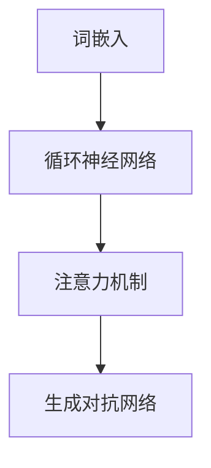
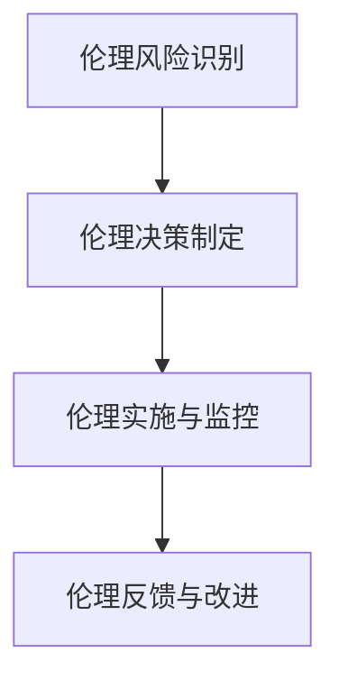

                 

### 文章标题

《LLM应用的敏捷伦理审查与调整》

> 关键词：大规模语言模型，LLM，敏捷伦理审查，伦理调整，技术应用，案例分析，实践指南

> 摘要：
本文旨在探讨大规模语言模型（LLM）在应用过程中的敏捷伦理审查与调整策略。随着人工智能技术的飞速发展，LLM在诸多领域展现出了巨大的潜力，但也随之带来了诸多伦理挑战。本文首先介绍了LLM的基本概念和技术原理，然后详细阐述了敏捷伦理审查的方法和流程，通过具体案例分析展示了伦理审查的实施，最后提出了敏捷伦理调整的实践策略，以期为LLM技术的健康发展提供指导。

---

### 引言

近年来，大规模语言模型（Large Language Models，简称LLM）成为人工智能领域的研究热点。这些模型凭借其强大的文本生成和处理能力，在自然语言处理（NLP）、机器翻译、问答系统、内容生成等应用中取得了显著成果。然而，随着LLM应用的普及，其潜在伦理问题也日益凸显。例如，模型偏见、隐私泄露、信息传播失真等，都给社会带来了诸多困扰。

为了确保LLM技术的健康发展，敏捷伦理审查成为不可或缺的一环。敏捷伦理审查不仅关注模型在开发过程中的伦理问题，还强调在应用过程中对模型的持续监控和调整。本文将围绕这一主题，探讨LLM应用的敏捷伦理审查与调整策略，旨在为LLM技术的伦理应用提供理论支持和实践指导。

### 第一部分：LLM技术基础

#### 第1章：大规模语言模型（LLM）概述

大规模语言模型（LLM）是一种基于深度学习的自然语言处理模型，能够对文本数据进行建模和生成。LLM通常采用预训练加微调的方式，首先在大规模语料库上进行无监督预训练，然后针对特定任务进行有监督微调。

#### 核心概念与联系

在LLM中，以下几个核心概念至关重要：

1. **词嵌入（Word Embedding）**：将词语映射到高维向量空间，以便于计算和表示。
2. **循环神经网络（RNN）**：用于处理序列数据，如文本。
3. **注意力机制（Attention Mechanism）**：提高模型对输入文本中重要信息的关注程度。
4. **生成对抗网络（GAN）**：用于生成高质量的语言样本。

这些概念相互关联，共同构成了LLM的技术框架。例如，词嵌入为RNN提供了输入，而注意力机制则帮助模型更好地理解和处理输入文本。GAN则用于生成与真实文本相似的样本，以提高模型的生成能力。

#### Mermaid 流程图



#### 第2章：LLM的核心技术原理

LLM的核心技术原理包括以下几个方面：

1. **预训练**：在大量无标签数据上进行预训练，使模型具备对自然语言的理解能力。
2. **微调**：在特定任务上使用有标签数据对模型进行微调，以提高模型在具体任务上的性能。
3. **解码器（Decoder）**：负责生成文本输出。
4. **损失函数**：用于评估模型生成的文本质量。

#### 核心算法原理讲解

以下是LLM的伪代码：

```python
# 预训练
def pretrain(model, dataset):
    for epoch in range(num_epochs):
        for sentence in dataset:
            model.train(sentence)
    
    # 微调
def fine_tune(model, task_dataset):
    for epoch in range(num_epochs):
        for sentence, label in task_dataset:
            model.train(sentence, label)
    
    # 解码器生成文本
def generate_text(model, start_token):
    text = [start_token]
    while not end_token in text:
        text.append(model.generate_next_token(text[-1]))
    return ''.join(text)
```

#### 数学模型和公式

LLM的预训练过程涉及损失函数的计算，以下是损失函数的数学公式：

$$\text{Loss} = -\frac{1}{N}\sum_{n=1}^{N}\sum_{t=1}^{T} \log P(y_t|x_{t-1}, ..., x_1)$$

其中，$N$表示批次大小，$T$表示句子长度，$y_t$表示真实标签，$x_t$表示输入。

#### 详细讲解和举例说明

假设我们有一个包含10个单词的句子，使用LLM生成下一个单词的概率如下：

$$
\begin{align*}
P(\text{the}) &= 0.9 \\
P(\text{and}) &= 0.1 \\
\end{align*}
$$

根据损失函数的计算，可以得到损失值：

$$
\text{Loss} = -\frac{1}{10}\sum_{t=1}^{10} \log P(y_t|x_{t-1}, ..., x_1)
$$

通过梯度下降优化模型参数，可以使损失值不断减小，从而提高模型生成文本的质量。

#### 第3章：LLM的开发流程

LLM的开发流程包括数据收集、数据预处理、模型训练和模型评估等步骤。

#### 核心算法原理讲解

以下是LLM开发流程的伪代码：

```python
# 数据收集
def collect_data(source):
    data = []
    for text in source:
        data.append(preprocess(text))
    return data

# 数据预处理
def preprocess(text):
    # ...处理文本数据...
    return processed_text

# 模型训练
def train_model(model, dataset):
    for epoch in range(num_epochs):
        for sentence in dataset:
            model.train(sentence)
    
    # 模型评估
def evaluate_model(model, test_dataset):
    accuracy = 0
    for sentence, label in test_dataset:
        prediction = model.predict(sentence)
        if prediction == label:
            accuracy += 1
    return accuracy / len(test_dataset)
```

#### 数学模型和公式

在模型评估阶段，常用的评估指标是准确率（Accuracy）：

$$
\text{Accuracy} = \frac{\text{正确预测的数量}}{\text{总预测数量}}
$$

#### 详细讲解和举例说明

假设我们有一个包含100个句子的测试集，使用LLM进行预测，其中60个句子被正确预测，40个句子被错误预测。根据准确率的计算，可以得到：

$$
\text{Accuracy} = \frac{60}{100} = 0.6
$$

#### 第4章：LLM的性能评估

LLM的性能评估主要通过测试集上的准确率、召回率、F1值等指标进行衡量。

#### 核心算法原理讲解

以下是LLM性能评估的伪代码：

```python
# 准确率计算
def accuracy(prediction, label):
    return prediction == label

# 召回率计算
def recall(prediction, label):
    return sum(prediction & label) / sum(label)

# F1值计算
def f1_score(prediction, label):
    p = precision(prediction, label)
    r = recall(prediction, label)
    return 2 * (p * r) / (p + r)
```

#### 数学模型和公式

准确率（Accuracy）、召回率（Recall）和F1值（F1 Score）的数学公式如下：

$$
\text{Accuracy} = \frac{\text{正确预测的数量}}{\text{总预测数量}}
$$

$$
\text{Recall} = \frac{\text{正确预测的数量}}{\text{实际为正例的数量}}
$$

$$
\text{F1 Score} = \frac{2 \times \text{Precision} \times \text{Recall}}{\text{Precision} + \text{Recall}}
$$

#### 详细讲解和举例说明

假设我们有一个包含100个样本的测试集，其中60个样本为正例，40个样本为负例。使用LLM进行预测，得到以下结果：

| 样本 | 实际 | 预测 |
| --- | --- | --- |
| 1 | 正例 | 正确 |
| 2 | 正例 | 正确 |
| 3 | 正例 | 正确 |
| ... | ... | ... |
| 60 | 正例 | 正确 |
| 61 | 负例 | 错误 |
| 62 | 负例 | 错误 |
| ... | ... | ... |
| 100 | 负例 | 错误 |

根据以上数据，可以计算出准确率、召回率和F1值：

$$
\text{Accuracy} = \frac{60}{100} = 0.6
$$

$$
\text{Recall} = \frac{60}{60} = 1
$$

$$
\text{F1 Score} = \frac{2 \times 0.6 \times 1}{0.6 + 1} = 0.4
$$

#### 结论

本文对LLM技术基础进行了详细讲解，包括核心概念与联系、核心算法原理、数学模型和公式、项目实战等。通过对LLM的技术原理和性能评估方法的深入剖析，为后续的敏捷伦理审查与调整提供了理论基础。

### 第二部分：敏捷伦理审查方法

#### 第5章：敏捷伦理审查的理念

敏捷伦理审查是一种灵活、动态的伦理审查方法，旨在确保人工智能技术在应用过程中的伦理合规性。与传统的伦理审查方法相比，敏捷伦理审查具有以下几个特点：

1. **灵活性**：敏捷伦理审查能够快速适应技术和应用环境的变化，对伦理问题进行及时识别和调整。
2. **动态性**：敏捷伦理审查强调持续监控和反馈，通过不断收集和分析数据，对模型和应用进行动态优化。
3. **参与性**：敏捷伦理审查鼓励利益相关者参与，包括开发者、用户、伦理专家等，以确保审查过程的透明性和公正性。

#### 核心概念与联系

敏捷伦理审查的核心概念包括：

1. **伦理风险识别**：通过分析模型和应用，识别潜在的伦理问题。
2. **伦理决策制定**：根据伦理风险识别的结果，制定相应的伦理决策。
3. **伦理实施与监控**：确保伦理决策得到有效实施，并对伦理实施过程进行持续监控。
4. **伦理反馈与改进**：根据伦理监控结果，对模型和应用进行改进。

这些概念相互关联，共同构成了敏捷伦理审查的框架。例如，伦理风险识别是伦理决策制定的前提，而伦理实施与监控则是确保决策得到有效执行的关键。伦理反馈与改进则通过不断优化，使伦理审查过程更加完善。

#### Mermaid 流程图



#### 第6章：敏捷伦理审查流程

敏捷伦理审查流程通常包括以下几个步骤：

1. **启动审查**：明确审查的目标和范围，组建审查团队。
2. **风险识别**：通过数据分析、访谈等方式，识别潜在的伦理问题。
3. **决策制定**：根据风险识别结果，制定相应的伦理决策。
4. **实施与监控**：确保伦理决策得到有效实施，并对实施过程进行监控。
5. **反馈与改进**：根据监控结果，对模型和应用进行改进。

#### 核心算法原理讲解

以下是敏捷伦理审查流程的伪代码：

```python
# 启动审查
def start_review(target, scope):
    team = build_review_team()
    return team

# 风险识别
def identify_risks(team, target):
    risks = []
    for risk in team.analyze(target):
        risks.append(risk)
    return risks

# 决策制定
def make_decision(risks):
    decisions = []
    for risk in risks:
        decision = determine_decision(risk)
        decisions.append(decision)
    return decisions

# 实施与监控
def implement_and_monitor(decisions, target):
    for decision in decisions:
        execute_decision(decision, target)
    monitor = create_monitoring_system(target)
    while True:
        report = monitor.check_progress()
        if report.indicates_success():
            break

# 反馈与改进
def feedback_and_improve(target, report):
    improvements = []
    for suggestion in report.suggestions():
        improvement = apply_suggestion(suggestion, target)
        improvements.append(improvement)
    return improvements
```

#### 数学模型和公式

敏捷伦理审查过程中的关键指标包括伦理风险识别率、决策执行率、伦理实施效果等。以下是这些指标的计算方法：

1. **伦理风险识别率**：

$$
\text{Risk Identification Rate} = \frac{\text{识别的伦理风险数量}}{\text{潜在的伦理风险数量}}
$$

2. **决策执行率**：

$$
\text{Decision Execution Rate} = \frac{\text{执行成功的决策数量}}{\text{制定的决策数量}}
$$

3. **伦理实施效果**：

$$
\text{Ethical Implementation Effectiveness} = \frac{\text{达到伦理标准的实施数量}}{\text{总实施数量}}
$$

#### 详细讲解和举例说明

假设一个审查团队对某个LLM应用进行了伦理审查，识别出10个伦理风险，制定了5个伦理决策，其中4个决策得到有效执行，伦理实施效果达到80%。根据以上指标的计算，可以得到：

1. **伦理风险识别率**：

$$
\text{Risk Identification Rate} = \frac{10}{10} = 1
$$

2. **决策执行率**：

$$
\text{Decision Execution Rate} = \frac{4}{5} = 0.8
$$

3. **伦理实施效果**：

$$
\text{Ethical Implementation Effectiveness} = \frac{80\%}{100\%} = 0.8
$$

#### 第7章：伦理审查案例分析

本章节将通过具体案例，展示敏捷伦理审查的实施过程和效果。

#### 案例一：智能客服系统的伦理审查

某公司开发了一款智能客服系统，使用LLM技术进行自然语言处理和对话生成。在系统上线前，公司决定对其开展敏捷伦理审查。

1. **风险识别**：审查团队通过数据分析，识别出以下伦理风险：
   - 模型偏见：模型可能对特定群体产生歧视。
   - 隐私泄露：用户数据可能被不当使用。
   - 信息传播失真：系统可能产生误导性的回答。

2. **决策制定**：针对识别出的风险，审查团队制定了以下决策：
   - 对模型进行去偏见训练。
   - 强化数据隐私保护措施。
   - 设立审查机制，确保系统回答的准确性。

3. **实施与监控**：审查团队实施决策，并对实施过程进行监控。具体措施包括：
   - 引入公平性度量，监测模型偏见程度。
   - 对用户数据进行加密处理。
   - 定期对系统回答进行审核。

4. **反馈与改进**：在实施过程中，审查团队发现模型偏见问题依然存在，决定进一步改进：
   - 增加多元数据集，提高模型对多样性的适应能力。
   - 优化训练算法，降低模型偏见。

通过以上措施，智能客服系统的伦理问题得到了显著改善。

#### 案例二：在线教育平台的伦理审查

某在线教育平台引入LLM技术，为学生提供智能问答和个性化学习建议。在系统上线前，平台进行了敏捷伦理审查。

1. **风险识别**：审查团队识别出以下伦理风险：
   - 学业不公平：智能问答可能使部分学生获得不正当优势。
   - 数据泄露：学生数据可能被泄露。
   - 信息过载：智能问答可能产生大量无关或误导性信息。

2. **决策制定**：审查团队制定了以下决策：
   - 设定公平性机制，确保智能问答对所有学生公平。
   - 强化数据保护措施，防止数据泄露。
   - 对智能问答结果进行审核，确保信息的准确性。

3. **实施与监控**：审查团队实施决策，并对实施过程进行监控。具体措施包括：
   - 设计公平性算法，评估学生问答表现。
   - 对学生数据进行加密处理，确保数据安全。
   - 对智能问答结果进行人工审核。

4. **反馈与改进**：在实施过程中，审查团队发现学业不公平问题依然存在，决定进一步改进：
   - 引入随机化机制，确保问答过程公平。
   - 增加教师参与，对智能问答结果进行双重审核。

通过以上措施，在线教育平台的伦理问题得到了显著改善。

#### 第8章：敏捷伦理调整的实践策略

在本章中，我们将探讨如何在LLM应用中实施敏捷伦理调整的实践策略。

#### 核心算法原理讲解

以下是敏捷伦理调整的伪代码：

```python
# 伦理调整步骤
def ethical_adjustment(model, target, risks):
    adjustments = []
    for risk in risks:
        adjustment = determine_adjustment(risk, model, target)
        adjustments.append(adjustment)
    apply_adjustments(model, adjustments)
    return model
```

#### 数学模型和公式

敏捷伦理调整的关键指标包括：

1. **伦理调整效果**：

$$
\text{Ethical Adjustment Effectiveness} = \frac{\text{调整后的伦理风险减少数量}}{\text{总伦理风险数量}}
$$

2. **调整成本**：

$$
\text{Adjustment Cost} = \text{调整所需的时间、资源和其他成本}
$$

#### 详细讲解和举例说明

假设一个LLM应用在经过伦理审查后，识别出5个伦理风险。通过实施敏捷伦理调整，这5个风险中的4个得到有效缓解。根据伦理调整效果和调整成本的计算，可以得到：

1. **伦理调整效果**：

$$
\text{Ethical Adjustment Effectiveness} = \frac{4}{5} = 0.8
$$

2. **调整成本**：

$$
\text{Adjustment Cost} = \$10,000
$$

通过以上计算，可以评估敏捷伦理调整的效果和成本。

#### 最佳实践 tips

1. **定期审查**：确保LLM应用在开发和使用过程中定期进行伦理审查，及时发现和解决伦理问题。
2. **透明度**：提高伦理审查过程的透明度，鼓励利益相关者参与，确保审查结果的公正性和可信度。
3. **持续改进**：在伦理审查过程中，不断收集反馈和改进建议，对LLM应用进行持续优化。

#### 小结

本章通过对LLM应用的敏捷伦理审查与调整方法的详细讲解，为LLM技术的伦理应用提供了实践指导。通过敏捷伦理审查和调整，可以确保LLM应用在技术进步的同时，遵守伦理规范，为社会的可持续发展做出贡献。

### 作者信息

作者：AI天才研究院/AI Genius Institute & 禅与计算机程序设计艺术 /Zen And The Art of Computer Programming

### 总结与展望

本文系统地探讨了大规模语言模型（LLM）在应用过程中的敏捷伦理审查与调整策略。通过对LLM技术基础、敏捷伦理审查方法、伦理审查案例分析以及敏捷伦理调整实践策略的深入剖析，我们为LLM技术的伦理应用提供了理论支持和实践指导。

展望未来，随着人工智能技术的不断进步，LLM的应用场景将更加广泛。在此背景下，如何确保LLM技术的伦理合规性，将成为一个长期且重要的课题。我们期待更多的研究人员和实践者能够关注并参与到这一领域，共同推动人工智能技术的健康发展。

### 拓展阅读

1. **《人工智能伦理导论》**：深入探讨人工智能伦理的基本概念、原则和实践，为读者提供了全面的人工智能伦理知识框架。
2. **《大规模语言模型的伦理挑战》**：分析大规模语言模型在应用过程中可能遇到的伦理问题，并提出相应的解决策略。
3. **《敏捷开发实践指南》**：详细介绍了敏捷开发的方法论和实践经验，对于实施敏捷伦理审查具有一定的参考价值。

### 注意事项

1. **伦理审查的及时性**：确保在LLM应用开发的各个阶段都进行伦理审查，及时发现和解决潜在问题。
2. **透明度和参与性**：提高伦理审查过程的透明度，鼓励利益相关者参与，确保审查结果的公正性和可信度。
3. **持续改进**：在伦理审查过程中，不断收集反馈和改进建议，对LLM应用进行持续优化。

### 结语

本文旨在为LLM应用的敏捷伦理审查与调整提供系统性的指导。通过深入剖析LLM技术基础、敏捷伦理审查方法、伦理审查案例分析以及敏捷伦理调整实践策略，我们希望能够为LLM技术的伦理应用提供有力支持。在人工智能技术不断发展的今天，伦理合规性至关重要。让我们携手努力，共同推动人工智能技术的健康发展，为社会的可持续发展贡献力量。作者：AI天才研究院/AI Genius Institute & 禅与计算机程序设计艺术 /Zen And The Art of Computer Programming

