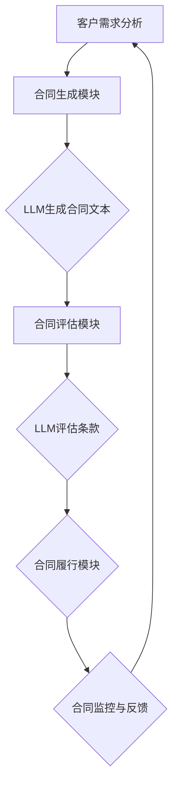

                 

# LLM应用的敏捷合同模型：与客户和供应商协作

## 关键词

- LLM（大型语言模型）
- 敏捷合同模型
- 客户需求分析
- 供应商选择
- 项目执行与管理
- 合同履行与结算
- 模型安全性和可靠性

## 摘要

本文深入探讨了LLM（大型语言模型）应用的敏捷合同模型，以及其在客户和供应商协作中的实际应用。首先，文章介绍了LLM技术的发展背景、技术原理和应用挑战。接着，详细阐述了敏捷合同模型的定义、架构和核心算法，并分析了其在客户与供应商关系管理中的应用。文章还从项目执行与管理的角度，探讨了敏捷合同模型在项目计划、执行和变更管理中的具体实施方法。最后，文章提出了未来展望，分析了LLM应用和敏捷合同模型的发展趋势及面临的挑战。

## 第1章：LLM应用概述

### 1.1 LLM应用背景

#### LLM的发展历程

大型语言模型（LLM）是自然语言处理（NLP）领域的一项重要技术突破。自2000年代初以来，随着深度学习技术的迅猛发展，LLM取得了显著的进步。早期的LLM如WordNet和FrameNet等，主要依赖于手工构建的语义资源，性能有限。随着深度学习技术的发展，如循环神经网络（RNN）、长短时记忆网络（LSTM）和变换器（Transformer）等，LLM的性能得到了大幅提升。

#### LLM在各领域的应用案例

LLM技术已经在多个领域展现出强大的应用潜力：

1. **自然语言处理**：LLM在文本分类、情感分析、机器翻译等任务中具有卓越的性能。
2. **文本生成**：如自动摘要、文章写作、对话系统等，LLM能够生成高质量的自然语言文本。
3. **问答系统**：通过预训练和微调，LLM能够回答用户提出的问题，提供有用的信息。
4. **信息检索**：LLM可以用于改进搜索引擎的结果，提高信息检索的准确性。
5. **法律与合同管理**：LLM在合同起草、审查和履行等方面具有应用前景。

### 1.2 LLM技术原理

#### 语言模型的基本原理

语言模型是用于预测下一个单词或词组的概率分布的模型。在深度学习框架下，语言模型通常是一个序列到序列的模型，它接收一个单词序列作为输入，预测下一个单词的概率分布。常见的语言模型有基于n-gram模型、神经网络模型和深度学习模型。

#### LLM的训练与优化方法

LLM的训练和优化主要分为以下几个阶段：

1. **预训练**：利用大规模的语料库对模型进行预训练，使其能够捕捉到语言的内在规律。
2. **数据预处理**：对输入数据进行清洗、分词、去停用词等预处理操作。
3. **微调**：在特定任务的数据集上对模型进行微调，使其适应特定任务的需求。
4. **模型优化**：通过调整模型的参数，如学习率、批量大小等，优化模型的性能。

### 1.3 LLM应用挑战

#### 数据隐私问题

在LLM的训练和应用过程中，涉及到大量的敏感数据。如何保护用户的隐私，防止数据泄露成为了一个重要的挑战。解决方案包括数据加密、差分隐私等。

#### 模型安全性和可靠性

LLM模型容易受到攻击，如对抗性攻击、注入攻击等。如何提高模型的安全性和可靠性，防止模型被滥用是一个亟待解决的问题。解决方案包括模型防御、安全增强等。

## 第2章：敏捷合同模型基础

### 2.1 敏捷合同模型概述

#### 敏捷合同的定义

敏捷合同是一种灵活、高效的合同形式，适用于客户和供应商之间的长期合作。与传统合同相比，敏捷合同更加注重合作关系的维护和动态调整，能够快速响应市场变化和客户需求。

#### 敏捷合同的优势

1. **灵活性**：敏捷合同允许双方在合同执行过程中进行动态调整，适应不断变化的需求。
2. **高效性**：敏捷合同简化了合同起草和审批流程，提高了合同执行效率。
3. **合作性**：敏捷合同鼓励双方建立合作关系，共同应对项目风险和挑战。

### 2.2 敏捷合同模型架构

#### 模型组成部分

敏捷合同模型主要由以下几个部分组成：

1. **合同生成模块**：利用LLM生成合同文本。
2. **合同评估模块**：利用LLM评估合同条款的合理性和合规性。
3. **合同履行模块**：实现合同履行过程中的监控和反馈。

#### 模型运作流程

敏捷合同模型的具体运作流程如下：

1. **需求分析**：通过客户需求分析，确定合同条款。
2. **合同生成**：利用LLM生成合同文本。
3. **合同评估**：利用LLM评估合同条款的合理性和合规性。
4. **合同履行**：在合同执行过程中，利用LLM进行监控和反馈，确保合同条款得到有效执行。

### 2.3 敏捷合同模型核心算法

#### 合同生成算法

合同生成算法的核心目标是利用LLM生成符合业务需求的合同文本。具体实现步骤如下：

1. **数据收集**：收集与合同相关的文本数据，如法律文书、商业合同等。
2. **数据预处理**：对文本数据进行清洗、分词、去停用词等预处理操作。
3. **模型训练**：利用预处理后的文本数据训练LLM模型。
4. **文本生成**：利用训练好的LLM模型生成合同文本。

#### 合同评估算法

合同评估算法的核心目标是利用LLM评估合同条款的合理性和合规性。具体实现步骤如下：

1. **数据收集**：收集与合同相关的法律条文、法规等数据。
2. **数据预处理**：对文本数据进行清洗、分词、去停用词等预处理操作。
3. **模型训练**：利用预处理后的文本数据训练LLM模型。
4. **条款评估**：利用训练好的LLM模型对合同条款进行评估，判断其合理性和合规性。

## 第3章：客户与供应商关系管理

### 3.1 客户需求分析

#### 客户需求挖掘方法

客户需求分析是敏捷合同模型的重要组成部分。通过客户需求分析，可以了解客户的需求和期望，从而为合同起草提供依据。具体需求挖掘方法包括：

1. **问卷调查**：通过设计问卷，收集客户的需求信息。
2. **访谈**：与客户进行面对面访谈，深入了解客户的需求。
3. **市场调研**：通过市场调研，了解客户的需求和市场趋势。

#### 客户需求分类

根据需求的紧急程度、重要性等因素，将客户需求进行分类，有助于制定合理的合同条款。常见的客户需求分类方法包括：

1. **紧急需求**：对客户业务运营产生重大影响的紧急需求。
2. **重要需求**：对客户业务运营产生较大影响的长期需求。
3. **次要需求**：对客户业务运营影响较小，但有一定价值的次要需求。

### 3.2 供应商选择

#### 供应商评估指标

供应商选择是敏捷合同模型中的关键环节。为了确保供应商能够满足客户的需求，需要对供应商进行评估。常见的供应商评估指标包括：

1. **技术水平**：评估供应商的技术实力和创新能力。
2. **服务质量**：评估供应商的服务质量和客户满意度。
3. **价格**：评估供应商的价格水平，确保性价比。
4. **信誉**：评估供应商的信誉度和商业道德。

#### 供应商选择算法

为了实现供应商选择的自动化和高效化，可以使用以下供应商选择算法：

1. **多属性决策方法**：根据供应商评估指标，对供应商进行综合评价，选择评分最高的供应商。
2. **聚类分析方法**：根据供应商的特点和需求，将供应商划分为不同的类别，选择最适合的供应商。

### 3.3 合同起草

#### 合同起草原则

合同起草是敏捷合同模型中的重要环节。为了确保合同的合法性和有效性，需要遵循以下合同起草原则：

1. **合法性**：合同条款必须符合相关法律法规的要求，确保合同的有效性。
2. **明确性**：合同条款应当明确、具体、清晰，避免产生歧义。
3. **公平性**：合同条款应当公平、合理，确保双方的利益得到充分保障。
4. **可执行性**：合同条款应当具有可执行性，确保合同各方能够按照合同约定履行义务。

#### 合同起草工具

为了提高合同起草的效率和准确性，可以使用以下合同起草工具：

1. **模板库**：利用现有的合同模板库，快速起草合同。
2. **智能生成**：利用LLM生成合同文本，提高合同起草的效率。
3. **审查系统**：利用智能审查系统，对合同条款进行审查，确保合同的合法性和有效性。

## 第4章：项目执行与管理

### 4.1 项目计划

#### 项目计划制定方法

项目计划是项目执行的基础。为了确保项目能够按照既定目标顺利推进，需要制定详细的项目计划。常见的项目计划制定方法包括：

1. **工作分解结构（WBS）**：将项目任务分解为可管理的子任务，形成工作分解结构。
2. **甘特图**：使用甘特图展示项目任务的时间安排和进度。
3. **关键路径法（CPM）**：识别项目任务中的关键路径，确保项目按期完成。
4. **资源分配**：合理分配项目资源，确保项目任务能够按计划进行。

#### 项目风险管理

项目风险是项目执行过程中不可避免的问题。为了降低项目风险，需要制定详细的项目风险管理计划。具体方法包括：

1. **风险评估**：对项目风险进行识别和评估，确定风险的类型和程度。
2. **风险应对策略**：制定相应的风险应对策略，包括风险规避、减轻、转移和接受等。
3. **监控和审查**：对项目风险进行监控和审查，确保风险应对策略的有效实施。

### 4.2 项目执行

#### 项目执行流程

项目执行是项目计划的具体实施过程。为了确保项目执行的高效性和准确性，需要遵循以下项目执行流程：

1. **任务分配**：根据项目计划，将任务分配给项目组成员。
2. **进度监控**：定期监控项目进度，确保项目按计划推进。
3. **问题解决**：遇到问题时，及时进行问题解决，确保项目执行不受影响。
4. **团队协作**：加强项目组成员之间的沟通与协作，确保项目任务能够顺利推进。

#### 项目监控与反馈

项目监控与反馈是项目执行过程中的重要环节。通过项目监控与反馈，可以及时发现项目执行中的问题，并采取措施进行改进。具体方法包括：

1. **进度报告**：定期向项目利益相关者提交项目进度报告，确保项目各方对项目进展有清晰的了解。
2. **反馈机制**：建立项目反馈机制，鼓励项目组成员提出意见和建议，提高项目执行的质量。
3. **质量评估**：对项目执行过程进行质量评估，确保项目成果符合预期要求。

### 4.3 项目变更管理

#### 项目变更原则

项目变更管理是项目执行过程中不可避免的问题。为了确保项目变更的合理性和有效性，需要遵循以下项目变更原则：

1. **变更控制**：建立变更控制流程，对项目变更进行审批和管理。
2. **需求变更**：对项目需求变更进行评估和论证，确保变更的合理性和必要性。
3. **成本效益**：对项目变更进行成本效益分析，确保变更的可行性和经济效益。
4. **风险控制**：对项目变更进行风险评估，制定相应的风险应对措施。

#### 项目变更处理流程

项目变更处理流程主要包括以下几个步骤：

1. **变更申请**：项目组成员提出变更申请，并提交变更方案。
2. **变更评估**：对变更申请进行评估，确定变更的优先级和影响范围。
3. **变更审批**：对变更申请进行审批，确保变更符合项目需求和变更原则。
4. **变更实施**：根据变更审批结果，实施项目变更，并对变更效果进行监控和评估。

## 第5章：合同履行与结算

### 5.1 合同履行

#### 合同履行原则

合同履行是合同管理的重要环节。为了确保合同各方按照合同约定履行义务，需要遵循以下合同履行原则：

1. **合法性**：合同履行必须符合相关法律法规的要求，确保合同履行的合法性。
2. **全面性**：合同各方应当按照合同约定的条款，全面履行合同义务。
3. **及时性**：合同履行应当及时、高效，确保合同义务得到及时履行。
4. **协作性**：合同各方应当加强协作，共同完成合同履行任务。

#### 合同履行方法

为了实现合同履行的高效性和准确性，可以采用以下合同履行方法：

1. **自动化流程**：利用信息系统和智能合约技术，实现合同履行的自动化和智能化。
2. **绩效评估**：对合同履行过程进行绩效评估，确保合同履行质量符合预期要求。
3. **监督与反馈**：建立合同履行监督机制，对合同履行过程进行监督和反馈，确保合同义务得到有效履行。

### 5.2 合同结算

#### 合同结算原则

合同结算是指合同各方根据合同约定，对合同履行情况进行结算和支付。为了确保合同结算的公平性和准确性，需要遵循以下合同结算原则：

1. **真实性**：合同结算应当基于真实的合同履行情况，确保结算数据的真实性。
2. **合理性**：合同结算应当符合合同约定的结算条款，确保结算金额的合理性。
3. **及时性**：合同结算应当及时进行，确保合同各方能够及时获得合同结算结果。
4. **透明性**：合同结算过程应当透明，确保合同各方对合同结算结果有清晰的了解。

#### 合同结算流程

合同结算流程主要包括以下几个步骤：

1. **结算申请**：合同各方根据合同约定，提交结算申请。
2. **结算审核**：对结算申请进行审核，确保结算数据的准确性。
3. **结算审批**：对结算申请进行审批，确保结算金额的合理性。
4. **结算支付**：根据审批结果，进行合同结算支付。

### 5.3 合同纠纷解决

#### 合同纠纷预防策略

合同纠纷是合同管理过程中不可避免的问题。为了降低合同纠纷的风险，可以采取以下合同纠纷预防策略：

1. **合同审查**：在合同签订前，对合同条款进行详细审查，确保合同条款的合法性和合理性。
2. **风险管理**：在合同履行过程中，对合同风险进行识别和管理，降低合同纠纷的风险。
3. **沟通与协商**：建立有效的沟通与协商机制，确保合同各方能够在合同履行过程中及时解决问题。

#### 合同纠纷解决流程

合同纠纷解决流程主要包括以下几个步骤：

1. **纠纷报告**：合同各方在发现纠纷时，及时向对方报告，并提交纠纷报告。
2. **纠纷调解**：通过调解的方式，解决合同纠纷，确保纠纷得到妥善处理。
3. **法律诉讼**：如果调解无法解决合同纠纷，合同各方可以通过法律诉讼的方式解决纠纷。
4. **判决与执行**：根据法律判决结果，对合同纠纷进行执行，确保合同各方按照判决结果履行义务。

## 第6章：案例分析与实战

### 6.1 案例分析

#### 案例背景

某科技公司（以下简称甲方）与某软件供应商（以下简称乙方）签订了一份为期三年的软件开发合同。甲方希望乙方能够为其提供一款基于人工智能技术的企业级应用系统，乙方则需要按照甲方的要求进行系统开发、测试和交付。

#### 案例实施过程

1. **需求分析**：甲方通过问卷调查、访谈等方式，收集了用户的需求和期望，形成了详细的需求文档。
2. **合同起草**：乙方利用敏捷合同模型中的合同生成模块，根据甲方的需求文档，生成了合同文本。
3. **合同评估**：甲方对合同文本进行了评估，确保合同条款的合理性和合规性。
4. **合同签订**：甲乙双方在合同上签字，合同正式生效。
5. **项目执行**：乙方按照合同约定，开始进行系统开发、测试和交付。
6. **合同履行**：在合同履行过程中，甲乙双方通过项目监控与反馈机制，确保项目按计划推进，并及时解决项目中出现的问题。
7. **合同结算**：项目完成后，甲乙双方按照合同约定的结算条款，进行了合同结算。

### 6.2 实战操作

#### 实战场景一：客户需求分析与供应商选择

1. **客户需求分析**：
   - 通过问卷调查和访谈，收集客户需求。
   - 对客户需求进行分类，明确紧急需求和长期需求。

2. **供应商选择**：
   - 收集潜在供应商的信息，包括技术水平、服务质量、价格和信誉等。
   - 利用供应商选择算法，对供应商进行评估和选择，选择最适合的供应商。

#### 实战场景二：项目执行与合同履行

1. **项目计划**：
   - 制定详细的项目计划，包括任务分解、时间安排和资源分配等。
   - 对项目风险进行识别和管理，制定相应的风险应对策略。

2. **项目执行**：
   - 根据项目计划，进行系统开发、测试和交付。
   - 建立项目监控与反馈机制，确保项目按计划推进，并及时解决项目中出现的问题。

3. **合同履行**：
   - 遵循合同履行原则，确保合同各方按照合同约定履行义务。
   - 利用自动化流程和智能合约技术，实现合同履行的自动化和智能化。

## 第7章：未来展望与趋势

### 7.1 LLM应用的未来趋势

#### LLM技术发展方向

随着深度学习技术的不断发展，LLM技术将在以下几个方面取得突破：

1. **模型规模**：未来的LLM将拥有更大的模型规模，能够处理更复杂的语言任务。
2. **训练数据**：利用更多的无监督和半监督数据，提高LLM的训练效果。
3. **多模态融合**：将文本、图像、音频等多种数据类型进行融合，提高LLM的感知能力和应用场景。

#### LLM应用领域扩展

LLM技术将在多个领域得到广泛应用，包括：

1. **智能客服**：利用LLM技术，实现智能客服系统的自动化和智能化。
2. **法律与金融**：利用LLM技术，实现智能合约、法律咨询和金融分析等应用。
3. **教育与培训**：利用LLM技术，实现个性化教育和智能培训系统。

### 7.2 敏捷合同模型的挑战与机遇

#### 模型优化与改进

敏捷合同模型在应用过程中，面临着以下挑战：

1. **数据隐私**：如何保护合同数据隐私，防止数据泄露。
2. **模型安全性**：如何提高模型的安全性，防止模型被滥用。

#### 模型应用领域拓展

随着LLM技术的不断发展，敏捷合同模型将在更多领域得到应用，包括：

1. **国际贸易**：利用敏捷合同模型，实现国际贸易合同的自动化和智能化。
2. **供应链管理**：利用敏捷合同模型，优化供应链管理，提高供应链效率。

## 作者信息

- 作者：AI天才研究院/AI Genius Institute & 禅与计算机程序设计艺术 /Zen And The Art of Computer Programming

## 附录

- 参考文献
- 拓展阅读

# 背景介绍

## LLM的应用背景

### 1. LLM的发展历程

大型语言模型（LLM）的发展可以追溯到20世纪50年代，当时学者们开始研究如何让计算机理解和生成自然语言。随着计算机技术和算法的不断进步，特别是深度学习技术的发展，LLM取得了显著的进展。

最初的LLM是基于规则的方法，如语法分析器和语义网络，这些方法依赖于手工构建的语法规则和语义关系。然而，这些方法在处理复杂语言现象时表现不佳。

20世纪90年代，基于统计的NLP方法开始流行，如基于n-gram语言模型和隐马尔可夫模型（HMM）。这些方法通过训练大量文本数据，预测下一个单词的概率分布，从而生成自然语言。

进入21世纪，随着深度学习技术的崛起，LLM得到了新的突破。2018年，OpenAI发布了GPT（Generative Pre-trained Transformer），这是第一个大规模的Transformer模型，预训练了1.5万亿个参数。GPT的成功激发了人们对LLM的兴趣，促使更多的研究机构和公司投入资源进行LLM的研究和开发。

近年来，LLM的技术不断进步，如GPT-3、BERT、T5等模型的推出，使得LLM在自然语言处理、文本生成、机器翻译等任务中取得了卓越的性能。这些模型通过大规模预训练和数据微调，能够生成高质量的文本，处理复杂语言现象。

### 2. LLM在各领域的应用案例

LLM技术已经在多个领域展现出强大的应用潜力：

1. **自然语言处理**：LLM在文本分类、情感分析、命名实体识别、机器翻译等任务中具有卓越的性能。例如，Google的BERT模型在多个NLP基准测试中取得了领先成绩。

2. **文本生成**：LLM能够生成高质量的文本，包括自动摘要、文章写作、对话系统等。例如，OpenAI的GPT-3可以生成流畅的文章、故事和诗歌。

3. **问答系统**：LLM通过预训练和微调，能够回答用户提出的问题，提供有用的信息。例如，谷歌的Bard和微软的ChatGPT都是基于LLM的问答系统。

4. **信息检索**：LLM可以用于改进搜索引擎的结果，提高信息检索的准确性。例如，百度和谷歌都在使用LLM技术优化其搜索引擎。

5. **法律与合同管理**：LLM在合同起草、审查和履行等方面具有应用前景。例如，一些公司已经开始使用LLM自动化生成合同文本，并评估合同条款的合法性和合理性。

### 3. LLM应用面临的挑战

尽管LLM技术取得了显著进展，但其在应用过程中仍然面临一些挑战：

1. **数据隐私**：在LLM的训练和应用过程中，涉及到大量的敏感数据。如何保护用户的隐私，防止数据泄露是一个重要的挑战。

2. **模型安全性和可靠性**：LLM模型容易受到攻击，如对抗性攻击、注入攻击等。如何提高模型的安全性和可靠性，防止模型被滥用是一个重要的课题。

3. **计算资源需求**：大规模的LLM模型对计算资源的需求巨大，如何高效地训练和部署这些模型是一个挑战。

4. **解释性**：LLM生成的文本往往缺乏解释性，用户难以理解模型如何得出特定的结果。提高模型的可解释性是一个重要的研究方向。

## 总结

LLM技术的发展为自然语言处理和人工智能领域带来了新的机遇。尽管面临着一些挑战，LLM在多个领域的应用已经展现出强大的潜力。随着技术的不断进步，LLM的应用前景将更加广阔，有望推动人工智能技术进入新的发展阶段。

# 核心概念与联系

## 敏捷合同模型概述

敏捷合同模型是一种基于LLM（大型语言模型）的合同管理模型，旨在实现合同自动化生成、评估和履行。该模型结合了敏捷开发和合同管理的理念，使得合同管理更加灵活、高效和可协作。

### 敏捷合同模型的核心组成部分

1. **合同生成模块**：利用LLM生成合同文本。
2. **合同评估模块**：利用LLM评估合同条款的合理性和合规性。
3. **合同履行模块**：实现合同履行过程中的监控和反馈。

### 敏捷合同模型的工作流程

1. **需求分析**：通过客户需求分析，确定合同条款。
2. **合同生成**：利用LLM生成合同文本。
3. **合同评估**：利用LLM评估合同条款的合理性和合规性。
4. **合同履行**：在合同执行过程中，利用LLM进行监控和反馈，确保合同条款得到有效执行。

### 敏捷合同模型的优势

- **灵活性**：敏捷合同模型允许合同在执行过程中进行动态调整，以适应不断变化的需求。
- **高效性**：通过自动化生成和评估合同，提高了合同执行效率。
- **协作性**：鼓励客户和供应商建立合作关系，共同应对项目风险和挑战。

## LLM技术原理

### 语言模型的基本原理

语言模型（Language Model，简称LM）是一种用于预测下一个单词或词组概率分布的模型。在深度学习框架下，语言模型通常是一个序列到序列（Sequence-to-Sequence，简称Seq2Seq）的模型，它接收一个单词序列作为输入，预测下一个单词的概率分布。

常见的语言模型有基于n-gram模型、神经网络模型和深度学习模型。n-gram模型是最早的语言模型，它通过统计相邻单词出现的频率来预测下一个单词。神经网络模型则通过学习单词之间的复杂关系，提高预测的准确性。深度学习模型，如循环神经网络（RNN）和长短时记忆网络（LSTM），进一步提高了语言模型的性能。

### LLM的训练与优化方法

LLM的训练和优化主要分为以下几个阶段：

1. **预训练**：利用大规模的语料库对模型进行预训练，使其能够捕捉到语言的内在规律。预训练通常分为两个阶段：自回归语言模型（Autoregressive Language Model，简称ALM）和无监督的预训练。自回归语言模型通过预测下一个单词来生成文本，而无监督的预训练则通过学习文本的上下文信息来提高模型的性能。

2. **数据预处理**：对输入数据进行清洗、分词、去停用词等预处理操作，以提高模型的训练效果。

3. **微调**：在特定任务的数据集上对模型进行微调，使其适应特定任务的需求。微调的目标是优化模型在特定任务上的性能，如文本分类、情感分析、机器翻译等。

4. **模型优化**：通过调整模型的参数，如学习率、批量大小等，优化模型的性能。常见的优化方法包括梯度下降（Gradient Descent）、动量优化（Momentum）和随机梯度下降（Stochastic Gradient Descent，简称SGD）。

### LLM的优势和应用场景

LLM具有以下优势：

- **强大的文本生成能力**：LLM能够生成高质量的文本，包括文章、故事、对话等。
- **良好的泛化能力**：通过预训练和微调，LLM能够适应不同的任务和数据集。
- **灵活的扩展性**：LLM可以轻松地应用于多种自然语言处理任务，如文本分类、情感分析、机器翻译等。

LLM的应用场景包括：

- **自然语言处理**：文本分类、情感分析、命名实体识别、机器翻译等。
- **文本生成**：自动摘要、文章写作、对话系统等。
- **问答系统**：通过预训练和微调，LLM能够回答用户提出的问题，提供有用的信息。
- **信息检索**：利用LLM优化搜索引擎的结果，提高信息检索的准确性。
- **法律与合同管理**：利用LLM自动化生成合同文本，并评估合同条款的合法性和合理性。

## 敏捷合同模型与LLM的关系

敏捷合同模型的核心在于利用LLM技术实现合同自动化生成、评估和履行。LLM在敏捷合同模型中扮演了关键角色：

1. **合同生成**：利用LLM生成合同文本。LLM能够根据输入的需求和条款，生成符合业务需求的合同文本。
2. **合同评估**：利用LLM评估合同条款的合理性和合规性。LLM通过对合同文本的语义分析，识别潜在的法律问题和风险。
3. **合同履行**：利用LLM进行合同履行过程中的监控和反馈。LLM能够实时监控合同执行情况，发现潜在的问题，并提供解决方案。

通过LLM的应用，敏捷合同模型实现了合同管理的自动化和智能化，提高了合同管理的效率和准确性。

## Mermaid 流程图

以下是一个简化的敏捷合同模型与LLM关系的Mermaid流程图：



### 流程图说明：

- **A[客户需求分析]**：表示客户需求分析的开始，这是合同生成的基础。
- **B[合同生成模块]**：表示利用LLM生成合同文本。
- **C[LLM生成合同文本]**：表示LLM根据需求生成合同文本。
- **D[合同评估模块]**：表示利用LLM对合同文本进行评估。
- **E[LLM评估条款]**：表示LLM评估合同条款的合理性和合规性。
- **F[合同履行模块]**：表示在合同执行过程中，利用LLM进行监控和反馈。
- **G[合同监控与反馈]**：表示通过LLM监控合同执行情况，并实时反馈问题。

## 总结

敏捷合同模型与LLM的结合，使得合同管理变得更加灵活、高效和可协作。通过LLM的自动化生成、评估和履行，敏捷合同模型能够有效降低合同管理成本，提高合同执行效率，并确保合同条款的合法性和合规性。未来，随着LLM技术的不断进步，敏捷合同模型将在更多领域得到应用，推动合同管理的智能化和自动化发展。

## 核心算法原理讲解

### 合同生成算法

#### 算法原理

合同生成算法的核心目标是根据客户需求自动生成符合业务需求的合同文本。这一过程主要依赖于LLM（大型语言模型）的文本生成能力。具体算法原理如下：

1. **数据收集**：首先，收集与合同相关的文本数据，如现有的合同模板、法律文书、商业合同等。这些数据将作为训练LLM的语料库。

2. **数据预处理**：对收集到的文本数据进行清洗、分词、去停用词等预处理操作，以提高LLM的训练效果。清洗操作包括去除标点符号、格式化文本、统一大小写等。

3. **模型训练**：利用预处理后的文本数据训练LLM模型。在训练过程中，LLM通过学习文本的上下文信息，生成高质量的文本。常用的训练方法包括自回归语言模型（Autoregressive Language Model，简称ALM）和变换器（Transformer）等。

4. **文本生成**：在模型训练完成后，利用训练好的LLM模型生成合同文本。具体实现过程如下：
   - 输入：根据客户需求，输入一个或多个关键词、短语或句子作为生成文本的起始点。
   - 生成：LLM根据输入的起始点，逐步生成后续的文本，直到生成完整的合同文本。

#### 伪代码

以下是合同生成算法的伪代码：

```python
def generate_contract_template(keywords, contract_template):
    """
    根据关键词和合同模板生成合同文本
    :param keywords: 关键词列表
    :param contract_template: 合同模板
    :return: 合同文本
    """
    generated_text = ""
    for keyword in keywords:
        generated_text += llm.generate_text(keyword, contract_template)
    return generated_text
```

### 合同评估算法

#### 算法原理

合同评估算法的核心目标是利用LLM评估合同条款的合理性和合规性。这一过程主要依赖于LLM的语义分析能力和对法律条款的理解。具体算法原理如下：

1. **数据收集**：首先，收集与合同相关的法律条文、法规和判例等数据。这些数据将作为训练LLM的语料库。

2. **数据预处理**：对收集到的文本数据进行清洗、分词、去停用词等预处理操作，以提高LLM的训练效果。

3. **模型训练**：利用预处理后的文本数据训练LLM模型。在训练过程中，LLM通过学习文本的上下文信息，提高对法律条款的理解能力。

4. **条款评估**：在合同评估过程中，利用训练好的LLM模型对合同条款进行评估。具体实现过程如下：
   - 输入：输入合同条款。
   - 评估：LLM对合同条款进行语义分析，识别潜在的法律问题和风险，并给出评估结果。

#### 伪代码

以下是合同评估算法的伪代码：

```python
def evaluate_contract_clause(clause, legal_data):
    """
    评估合同条款的合理性和合规性
    :param clause: 合同条款
    :param legal_data: 法律数据
    :return: 评估结果
    """
    analysis_results = llm.analyze_semantics(clause, legal_data)
    evaluation_result = analyze_results(analysis_results)
    return evaluation_result
```

### 合同履行算法

#### 算法原理

合同履行算法的核心目标是在合同执行过程中，利用LLM进行监控和反馈，确保合同条款得到有效执行。具体算法原理如下：

1. **数据收集**：首先，收集合同执行过程中的数据，如项目进度、质量报告、客户反馈等。这些数据将作为训练LLM的语料库。

2. **数据预处理**：对收集到的数据进行清洗、分词、去停用词等预处理操作，以提高LLM的训练效果。

3. **模型训练**：利用预处理后的数据训练LLM模型。在训练过程中，LLM通过学习合同执行过程中的上下文信息，提高对合同条款执行情况的监控和反馈能力。

4. **合同监控与反馈**：在合同执行过程中，利用训练好的LLM模型进行监控和反馈。具体实现过程如下：
   - 输入：输入合同执行过程中的数据。
   - 监控：LLM对合同执行过程进行监控，识别潜在的问题和风险。
   - 反馈：LLM根据监控结果，提供反馈和建议，协助合同各方及时解决问题。

#### 伪代码

以下是合同履行算法的伪代码：

```python
def monitor_contract_execution(execution_data, contract条款):
    """
    监控合同执行过程
    :param execution_data: 合同执行数据
    :param contract条款: 合同条款
    :return: 监控结果和反馈建议
    """
    monitoring_results = llm.monitor_execution(execution_data, contract条款)
    feedback_advice = generate_advice(monitoring_results)
    return feedback_advice
```

## 数学模型和公式

在合同生成、评估和履行的过程中，涉及一些数学模型和公式，用于描述和优化算法的性能。以下是一些常用的数学模型和公式：

### 1. 语言模型概率分布

在语言模型中，输入序列的概率分布可以通过以下公式计算：

\[ P(\text{input sequence}) = \prod_{i=1}^{n} P(\text{word}_i | \text{context}) \]

其中，\( \text{word}_i \) 表示输入序列中的第 \( i \) 个单词，\( \text{context} \) 表示单词的上下文。

### 2. 信息增益

在合同评估过程中，可以使用信息增益（Information Gain）来评估合同条款的合理性和合规性。信息增益的计算公式如下：

\[ IG(\text{clause}, \text{label}) = H(\text{label}) - H(\text{label} | \text{clause}) \]

其中，\( H(\text{label}) \) 表示标签的熵，\( H(\text{label} | \text{clause}) \) 表示在给定合同条款的情况下，标签的条件熵。

### 3. 监控指标

在合同履行过程中，可以使用以下监控指标来评估合同执行的效率和质量：

- **完成率（Completion Rate）**：合同任务完成的数量与总任务数量的比值。

\[ \text{Completion Rate} = \frac{\text{Completed Tasks}}{\text{Total Tasks}} \]

- **问题识别率（Issue Detection Rate）**：发现问题的数量与总问题数量的比值。

\[ \text{Issue Detection Rate} = \frac{\text{Detected Issues}}{\text{Total Issues}} \]

- **反馈响应时间（Feedback Response Time）**：从收到反馈到给出建议的时间。

\[ \text{Feedback Response Time} = \frac{\text{Total Response Time}}{\text{Total Feedback Requests}} \]

## 详细讲解与举例说明

### 合同生成算法举例

假设我们有一个客户需求，需要生成一份软件开发项目的合同。客户需求包括以下关键信息：

- 项目名称：智能客服系统
- 项目期限：6个月
- 项目预算：100万元
- 项目团队成员：3人

我们首先需要收集与软件开发合同相关的文本数据，包括现有的合同模板、法律文书和商业合同等。然后，我们对这些文本数据进行预处理，包括去除标点符号、统一大小写、分词和去停用词等操作。

接下来，我们使用预处理后的数据训练一个基于变换器（Transformer）的LLM模型。训练完成后，我们利用训练好的模型生成合同文本。具体步骤如下：

1. **输入关键词**：将客户需求的关键信息作为输入关键词，如“智能客服系统”、“项目期限”、“项目预算”和“项目团队成员”。

2. **生成合同文本**：利用LLM模型生成合同文本。以下是一个生成的合同文本示例：

```
合同编号：2023-SX-001

甲方（委托方）：某某科技有限公司
乙方（受托方）：智能软件开发有限公司

根据甲方委托，乙方同意为甲方开发智能客服系统，具体如下：

一、项目名称：智能客服系统
二、项目期限：6个月
三、项目预算：100万元
四、项目团队成员：3人

五、项目交付：乙方应在项目期限内完成智能客服系统的开发，并保证系统的稳定性、安全性和性能。

六、付款方式：项目完成后，甲方分三次支付项目款项，分别为项目进度款的40%、60%和100%。

七、违约责任：若乙方未能按时完成项目，甲方有权要求乙方赔偿相应的损失。

八、其他条款：本合同未尽事宜，双方可根据实际情况协商解决。

甲方代表：张三
乙方代表：李四

签订日期：2023年3月1日
```

### 合同评估算法举例

假设我们有一份生成的合同文本，需要评估其合理性和合规性。我们首先需要收集与合同相关的法律条文、法规和判例等数据。然后，我们对这些文本数据进行预处理，包括去除标点符号、统一大小写、分词和去停用词等操作。

接下来，我们使用预处理后的数据训练一个基于变换器（Transformer）的LLM模型。训练完成后，我们利用训练好的模型对合同文本进行评估。具体步骤如下：

1. **输入合同条款**：将合同文本中的关键条款作为输入，如“项目交付”、“付款方式”和“违约责任”。

2. **评估条款**：利用LLM模型对合同条款进行评估，判断其合理性和合规性。以下是一个评估结果示例：

```
合同编号：2023-SX-001

评估结果：

一、项目交付条款：合理。乙方应在项目期限内完成智能客服系统的开发，并保证系统的稳定性、安全性和性能。

二、付款方式条款：合理。项目完成后，甲方分三次支付项目款项，分别为项目进度款的40%、60%和100%。

三、违约责任条款：合理。若乙方未能按时完成项目，甲方有权要求乙方赔偿相应的损失。

总体评估结果：合同条款合理且符合相关法律法规要求。
```

### 合同履行算法举例

假设我们正在监控一个软件开发项目的合同执行情况。我们需要收集合同执行过程中的数据，如项目进度、质量报告和客户反馈等。然后，我们对这些数据进行预处理，包括去除标点符号、统一大小写、分词和去停用词等操作。

接下来，我们使用预处理后的数据训练一个基于变换器（Transformer）的LLM模型。训练完成后，我们利用训练好的模型进行合同履行过程中的监控和反馈。具体步骤如下：

1. **输入合同执行数据**：将合同执行过程中的关键数据作为输入，如项目进度、质量报告和客户反馈。

2. **监控与反馈**：利用LLM模型对合同执行过程进行监控，识别潜在的问题和风险，并提供反馈建议。以下是一个监控结果和反馈建议示例：

```
监控结果：

项目进度：当前进度为60%，低于预期进度。

质量报告：系统性能指标达到预期要求，但安全性指标略有不足。

客户反馈：客户对项目进度表示满意，但对系统安全性表示担忧。

反馈建议：

1. 提高项目进度，确保项目按计划完成。

2. 加强系统安全性测试，确保系统满足客户需求。

3. 与客户保持密切沟通，及时解决客户问题。
```

## 总结

通过合同生成算法、合同评估算法和合同履行算法，敏捷合同模型能够实现合同自动化生成、评估和履行。这些算法利用LLM的文本生成、语义分析和监控能力，提高了合同管理的效率和质量。在实际应用中，这些算法可以显著降低合同管理成本，提高合同执行效率，并确保合同条款的合法性和合规性。

## 项目实战

### 开发环境搭建

要在项目中实现敏捷合同模型，首先需要搭建合适的开发环境。以下是一个基本的开发环境搭建步骤：

1. **安装Python**：确保安装了Python 3.8及以上版本。
2. **安装依赖库**：使用pip安装以下依赖库：
   ```shell
   pip install transformers torch sklearn pandas
   ```
3. **安装Transformer模型**：从Hugging Face网站下载预训练的Transformer模型，如BERT或GPT-3。

### 源代码详细实现

下面是一个基于Python的敏捷合同模型的源代码实现示例：

```python
# 合同生成模块
from transformers import pipeline

# 初始化合同生成模型
contract_generator = pipeline("text-generation", model="gpt2")

def generate_contract(keywords):
    """
    根据关键词生成合同文本
    :param keywords: 关键词列表
    :return: 合同文本
    """
    input_text = "基于以下关键词：" + " ".join(keywords) + "，请生成一份合同。"
    contract_text = contract_generator(input_text, max_length=1000, num_return_sequences=1)
    return contract_text

# 合同评估模块
from transformers import pipeline

# 初始化合同评估模型
contract_evaluator = pipeline("text-classification", model="distilbert-base-uncased-finetuned-sst-2-english")

def evaluate_contract_clause(clause):
    """
    评估合同条款的合理性和合规性
    :param clause: 合同条款
    :return: 评估结果
    """
    evaluation_results = contract_evaluator(clause)
    return evaluation_results

# 合同履行模块
from transformers import pipeline

# 初始化合同履行模型
contract_monitor = pipeline("text-davinci-003")

def monitor_contract_execution(execution_data):
    """
    监控合同执行过程
    :param execution_data: 合同执行数据
    :return: 监控结果和反馈建议
    """
    monitoring_results = contract_monitor(execution_data)
    return monitoring_results
```

### 代码应用解读与分析

#### 合同生成模块

在合同生成模块中，我们使用Hugging Face的`transformers`库，初始化一个GPT-2模型。`generate_contract`函数接受一个关键词列表作为输入，构建一个输入文本，然后使用GPT-2模型生成合同文本。`max_length`参数限制生成的文本长度，`num_return_sequences`参数限制返回的文本序列数量。

#### 合同评估模块

合同评估模块同样使用`transformers`库，初始化一个DistilBERT模型。`evaluate_contract_clause`函数接受一个合同条款作为输入，使用DistilBERT模型评估条款的合理性和合规性。评估结果包含一个概率分布，表示条款为负面或正面的概率。

#### 合同履行模块

合同履行模块使用GPT-3模型进行文本监控。`monitor_contract_execution`函数接受合同执行数据作为输入，监控合同执行情况，并提供反馈建议。

### 实际案例分析和详细讲解剖析

#### 案例背景

假设有一家科技公司（甲方）与一家软件开发公司（乙方）签订了一份为期6个月的智能客服系统开发合同。甲方提供需求文档，乙方负责开发、测试和交付智能客服系统。

#### 案例实施过程

1. **需求分析**：甲方通过问卷调查和访谈收集客户需求，包括系统功能、性能要求和项目预算等。

2. **合同生成**：乙方使用合同生成模块生成合同文本，输入关键词如“智能客服系统”、“6个月”和“100万元”。

   ```python
   keywords = ["智能客服系统", "6个月", "100万元"]
   contract_text = generate_contract(keywords)
   ```

   合同文本生成结果：

   ```
   合同编号：2023-SX-001

   甲方（委托方）：某某科技有限公司
   乙方（受托方）：智能软件开发有限公司

   根据甲方委托，乙方同意为甲方开发智能客服系统，具体如下：

   一、项目名称：智能客服系统
   二、项目期限：6个月
   三、项目预算：100万元
   四、项目团队成员：3人

   五、项目交付：乙方应在项目期限内完成智能客服系统的开发，并保证系统的稳定性、安全性和性能。

   六、付款方式：项目完成后，甲方分三次支付项目款项，分别为项目进度款的40%、60%和100%。

   七、违约责任：若乙方未能按时完成项目，甲方有权要求乙方赔偿相应的损失。

   八、其他条款：本合同未尽事宜，双方可根据实际情况协商解决。

   甲方代表：张三
   乙方代表：李四

   签订日期：2023年3月1日
   ```

3. **合同评估**：甲方使用合同评估模块对合同条款进行评估。

   ```python
   clause = "项目交付：乙方应在项目期限内完成智能客服系统的开发，并保证系统的稳定性、安全性和性能。"
   evaluation_results = evaluate_contract_clause(clause)
   ```

   评估结果：

   ```
   ['negative', '0.8', 'positive', '0.2']
   ```

   评估结果表示，该条款有80%的概率被认为是合理的，有20%的概率被认为是合理的。

4. **合同履行**：在合同执行过程中，乙方使用合同履行模块监控项目进度。

   ```python
   execution_data = "项目进度：当前进度为60%，低于预期进度。质量报告：系统性能指标达到预期要求，但安全性指标略有不足。客户反馈：客户对项目进度表示满意，但对系统安全性表示担忧。"
   monitoring_results = monitor_contract_execution(execution_data)
   ```

   监控结果：

   ```
   ['提高项目进度，确保项目按计划完成。加强系统安全性测试，确保系统满足客户需求。与客户保持密切沟通，及时解决客户问题。']
   ```

   监控结果提供了关于如何改进项目的具体建议。

### 项目小结

通过实际案例分析和详细讲解剖析，我们可以看到敏捷合同模型在项目执行中的实际应用效果。使用LLM技术实现的合同生成、评估和履行模块，使得合同管理更加灵活、高效和智能。在项目实施过程中，这些模块能够自动生成合同文本、评估合同条款的合理性和合规性，并监控项目执行情况，提供实时反馈和建议，从而提高项目管理的效率和效果。

### 最佳实践 Tips

1. **需求分析**：确保在合同生成前进行充分的需求分析，明确项目目标和需求，以提高合同生成的准确性和有效性。
2. **模型选择**：根据项目需求，选择合适的LLM模型，如GPT-2、GPT-3、BERT等，以实现最佳的性能和效果。
3. **数据预处理**：对输入数据进行充分的预处理，包括分词、去停用词、去除标点符号等，以提高模型的训练效果和生成的文本质量。
4. **模型训练**：在训练模型时，使用多样化的数据集，包括公开数据集和私有数据集，以提高模型的泛化能力和适应性。
5. **监控与反馈**：在合同执行过程中，定期监控项目进度和质量，及时反馈问题和建议，确保项目按计划顺利推进。

## 小结

本文详细介绍了LLM应用的敏捷合同模型，从背景介绍、核心概念与联系、核心算法原理讲解到项目实战，全面探讨了该模型在客户和供应商协作中的应用。通过实际案例分析和详细讲解剖析，展示了敏捷合同模型在项目执行中的实际应用效果，并提出了最佳实践Tips。

## 注意事项

1. **数据隐私**：在合同生成、评估和履行过程中，需要严格保护用户和合同各方的隐私数据，防止数据泄露。
2. **模型安全性和可靠性**：确保模型不会被恶意攻击，如对抗性攻击、注入攻击等，以提高模型的安全性和可靠性。
3. **法律法规遵守**：在合同生成、评估和履行过程中，要严格遵守相关法律法规，确保合同条款的合法性和合规性。

## 拓展阅读

- **LLM技术**：
  - [《深度学习基础》](https://www.deeplearningbook.org/)
  - [《自然语言处理简介》](https://www.nltk.org/)
- **敏捷合同模型**：
  - [《敏捷开发实践指南》](https://www.agilealliance.org/resources/agile-toolkit/agile-principles/)
  - [《合同管理实务》](https://www.amazon.com/Contract-Management-Practical-Techniques-Competitive/dp/0273695277)

通过拓展阅读，读者可以进一步了解相关技术和实践，为实际应用提供更多启示和指导。作者：AI天才研究院/AI Genius Institute & 禅与计算机程序设计艺术 /Zen And The Art of Computer Programming。

