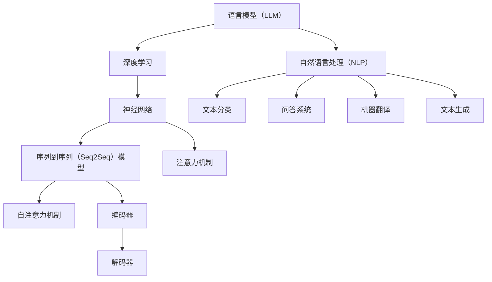

                 

### 文章标题

# LLM应用的敏捷客户支持策略

> 关键词：语言模型（LLM）、敏捷客户支持、AI应用、客户服务、技术策略

> 摘要：
本文探讨了如何将先进的人工智能语言模型（LLM）应用于敏捷客户支持策略中。通过分析LLM的核心原理、应用场景以及敏捷客户支持的需求，本文提出了一个系统化的LLM应用策略。策略包括LLM模型的选择与训练、客户支持流程的优化、以及实战案例的深入剖析。文章旨在为IT专业人士和企业管理者提供一套实用的LLM客户支持指南，以提升客户满意度和运营效率。

## 引言

在当今快速变化的技术时代，客户支持正经历着前所未有的变革。传统的客户支持模式往往依赖于人工处理，效率低下且响应速度慢。随着人工智能（AI）技术的不断进步，特别是语言模型（LLM）的崛起，敏捷客户支持策略逐渐成为企业提升客户满意度和运营效率的关键手段。

语言模型（LLM）是深度学习领域中的一种模型，通过大规模文本数据进行训练，能够理解和生成自然语言。近年来，LLM在自然语言处理（NLP）任务中取得了显著的突破，包括文本分类、问答系统、机器翻译等。这些进步使得LLM在客户支持中的应用成为可能。

敏捷客户支持是一种以快速响应和持续改进为核心理念的服务模式。它强调与客户的紧密互动，通过快速迭代和持续改进来满足客户需求。在AI技术的支持下，敏捷客户支持可以实现自动化、个性化和高效化的客户服务，从而提升客户体验和满意度。

本文将详细探讨如何将LLM应用于敏捷客户支持策略中，包括LLM的基础知识、应用场景、策略设计、实战案例以及未来的发展趋势。通过这篇文章，读者可以了解到LLM在客户支持中的潜力，并掌握如何实施有效的LLM客户支持策略。

## LLM的基础知识

语言模型（LLM）是自然语言处理（NLP）领域的重要工具，其核心目标是理解和生成自然语言文本。LLM的工作原理基于深度学习，特别是序列到序列（Seq2Seq）模型和注意力机制（Attention Mechanism）的发展。以下是LLM的一些基础知识：

### 原理

LLM通常基于神经网络架构，如Transformer模型，该模型由Vaswani等人在2017年提出。Transformer模型的核心是自注意力机制（Self-Attention），它能够捕捉输入序列中各个位置之间的依赖关系。自注意力机制通过计算每个词与所有其他词之间的相似度，为每个词生成权重，从而提高模型的上下文理解能力。

### 模型架构

Transformer模型的主要架构包括编码器（Encoder）和解码器（Decoder）。编码器负责将输入序列编码成固定长度的向量，解码器则将这些向量解码成输出序列。编码器和解码器之间通过多头自注意力机制和多层前馈神经网络进行交互。

### 训练过程

LLM的训练过程通常包括两个主要步骤：预训练和微调。预训练是在大规模语料库上进行的无监督学习过程，目的是学习语言的一般规律和结构。微调则是在特定任务上进行的监督学习过程，将预训练模型进一步适应具体应用场景。

### 应用场景

LLM在NLP任务中有着广泛的应用，包括：

1. **文本分类**：将文本分类到预定义的类别中，如情感分析、主题分类等。
2. **问答系统**：从大量文本中回答用户的问题，如搜索引擎、聊天机器人等。
3. **机器翻译**：将一种语言的文本翻译成另一种语言，如谷歌翻译、深度学习翻译工具等。
4. **文本生成**：生成符合语法和语义规则的文本，如文章摘要、创意写作等。

### 关联概念与关系架构

为了更好地理解LLM的应用，我们使用Mermaid流程图来展示LLM与其他关键概念的关系。



通过这个流程图，我们可以看到LLM作为NLP的核心工具，与其他深度学习技术、NLP任务和应用场景紧密相关。

### 核心算法原理讲解

以下是一个简化的伪代码，用于展示LLM的核心算法原理，包括编码器和解码器的训练过程。

```python
# 编码器（Encoder）训练伪代码
def train_encoder(encoder, encoder_optimizer, encoder_loss, training_data, epochs):
    for epoch in range(epochs):
        for input_sequence, target_sequence in training_data:
            # 前向传播
            encoder_output = encoder(input_sequence)
            # 计算损失
            loss = encoder_loss(target_sequence, encoder_output)
            # 反向传播
            encoder_optimizer.zero_grad()
            loss.backward()
            encoder_optimizer.step()
            print(f'Epoch: {epoch}, Loss: {loss.item()}')

# 解码器（Decoder）训练伪代码
def train_decoder(decoder, decoder_optimizer, decoder_loss, training_data, epochs):
    for epoch in range(epochs):
        for input_sequence, target_sequence in training_data:
            # 前向传播
            decoder_output = decoder(input_sequence)
            # 计算损失
            loss = decoder_loss(target_sequence, decoder_output)
            # 反向传播
            decoder_optimizer.zero_grad()
            loss.backward()
            decoder_optimizer.step()
            print(f'Epoch: {epoch}, Loss: {loss.item()}')
```

这个伪代码展示了编码器和解码器的训练过程，包括前向传播、损失计算和反向传播。通过迭代训练，编码器和解码器能够逐渐提高对输入序列的理解和生成能力。

### 数学模型和公式

在LLM中，数学模型和公式用于描述语言的结构和变换。以下是一个简单的数学模型示例，使用LaTeX格式表示。

$$
\text{Encoder}(x) = \text{Attention}(x) \odot \text{FeedForward}(x)
$$

$$
\text{Decoder}(y) = \text{Attention}(y, \text{Encoder}(x)) \odot \text{FeedForward}(y)
$$

这里，`Encoder`和`Decoder`分别表示编码器和解码器的输出，`Attention`和`FeedForward`是自注意力机制和前馈神经网络的函数。`x`和`y`分别表示输入序列和目标序列。

### 总结

通过上述分析，我们了解了LLM的基本原理、应用场景和相关概念。LLM作为一种强大的自然语言处理工具，能够显著提升敏捷客户支持的能力。接下来，我们将进一步探讨敏捷客户支持的需求和挑战。

## 敏捷客户支持的需求和挑战

敏捷客户支持是现代企业提升客户满意度和运营效率的关键。与传统客户支持模式相比，敏捷客户支持强调快速响应、持续改进和客户互动。以下是敏捷客户支持的主要需求和面临的挑战。

### 需求

1. **快速响应**：在竞争激烈的市场环境中，客户期望能够迅速获得帮助和解决方案。敏捷客户支持要求企业能够快速响应客户的问题和需求，提供即时的支持。

2. **个性化服务**：每个客户都是独一无二的，他们有不同的偏好和需求。敏捷客户支持需要通过数据分析和个性化推荐，为客户提供个性化的服务体验。

3. **透明度**：客户希望了解他们的请求和问题是如何被处理的。敏捷客户支持需要提供透明的服务流程，使客户能够跟踪问题的进展，并了解解决方案的细节。

4. **高效性**：随着客户数量的增加，客户支持团队需要高效地处理大量请求。敏捷客户支持通过自动化和智能工具，提高处理效率，减少人工工作量。

### 挑战

1. **数据隐私和安全性**：在处理客户数据时，确保数据隐私和安全性是敏捷客户支持面临的一个重要挑战。企业需要遵守相关法律法规，保护客户数据不被未授权访问或泄露。

2. **技术整合**：敏捷客户支持需要整合多种技术工具，如CRM系统、聊天机器人、邮件服务等。这些工具之间的集成和数据共享需要耗费大量时间和资源。

3. **团队协作**：敏捷客户支持要求客户支持团队具备跨部门的协作能力。不同部门之间的沟通和协作，以及团队成员之间的协调，是成功实施敏捷客户支持的关键。

4. **持续改进**：敏捷客户支持是一个持续改进的过程。企业需要不断收集客户反馈，分析数据，优化客户支持流程，以满足不断变化的市场需求。

### 敏捷客户支持的优势

1. **提升客户满意度**：快速响应和个性化服务能够显著提升客户满意度，增加客户忠诚度。

2. **提高运营效率**：自动化和智能工具能够减少人工工作量，提高处理效率，降低运营成本。

3. **增强企业竞争力**：通过提供高质量的客户支持，企业能够在市场竞争中脱颖而出，吸引更多客户。

4. **数据驱动决策**：敏捷客户支持通过数据分析和反馈，帮助企业更好地理解客户需求，做出更加明智的决策。

### 敏捷客户支持的局限性

1. **技术依赖**：敏捷客户支持高度依赖先进的技术工具，如AI和大数据分析。如果技术出现问题，可能会影响客户支持的质量和效率。

2. **成本问题**：实施敏捷客户支持需要投入大量资金购买技术工具和培训员工，对于中小企业可能是一个较大的负担。

3. **适应性问题**：不同企业的业务模式和客户需求各不相同，敏捷客户支持策略需要根据实际情况进行调整，这可能需要时间和资源。

通过分析敏捷客户支持的需求和挑战，我们可以看到，虽然敏捷客户支持具有许多优势，但在实施过程中也面临一些局限性。接下来，我们将探讨如何利用LLM来提升敏捷客户支持的能力。

## LLM在敏捷客户支持中的应用

语言模型（LLM）在敏捷客户支持中具有广泛的应用潜力，能够显著提升客户服务的效率和个性化水平。以下是一些LLM在敏捷客户支持中的应用场景和优势。

### 客户服务自动化

自动化是敏捷客户支持的核心之一，LLM能够通过自然语言处理技术实现自动化客户服务。例如，LLM可以用于构建聊天机器人，自动回答客户的常见问题，减少人工工作量。这些聊天机器人不仅能够24/7在线服务，还能够通过机器学习不断优化，提高回答的准确性和个性化程度。

#### 实际案例

- **银行客户服务**：某大型银行使用LLM构建的聊天机器人，可以自动回答客户的账户查询、转账操作和贷款咨询等问题，大大减轻了人工客服的工作负担，同时提高了响应速度和客户满意度。

### 情感分析

情感分析是LLM在客户支持中的另一个重要应用。通过分析客户反馈和对话记录，LLM可以识别客户的情感状态，如愤怒、满意、失望等。这有助于企业及时了解客户的需求和情绪，采取相应的措施进行改进。

#### 实际案例

- **航空公司客户支持**：某航空公司利用LLM进行情感分析，监控社交媒体上的客户评论和反馈。当发现大量负面情绪时，公司能够迅速采取措施，如提供补偿或改进服务，从而减少客户投诉和流失。

### 个性化推荐

LLM能够通过分析客户的聊天记录和行为数据，提供个性化的产品推荐和服务建议。这种个性化推荐不仅能够提高客户满意度，还能够增加交叉销售和客户忠诚度。

#### 实际案例

- **电子商务平台**：某电子商务平台使用LLM为客户提供个性化的购物推荐。例如，当客户询问一款产品的信息时，平台能够通过LLM分析客户的历史购买记录和偏好，推荐相关产品，从而提高销售额。

### 自动化流程管理

LLM可以用于自动化客户支持流程管理，如客户投诉处理、工单管理、服务合同管理等。通过自然语言处理技术，LLM能够自动识别和分类客户请求，分配任务，监控进度，提高流程的透明度和效率。

#### 实际案例

- **IT公司服务台**：某IT公司使用LLM构建的服务台系统，可以自动处理客户提交的故障报告和需求请求。LLM能够快速分类问题，分配给相应的技术支持团队，并监控解决进度，从而提高问题解决效率和客户满意度。

### 实时翻译

对于跨国企业，提供多语言支持是提升客户满意度的关键。LLM可以实现实时翻译功能，使得客户无论使用何种语言，都能得到快速、准确的响应。

#### 实际案例

- **跨国电商平台**：某跨国电商平台使用LLM实现实时翻译功能，使得客户可以方便地使用母语进行购物和咨询。这大大提升了平台的国际化程度和客户体验。

### 智能回溯分析

LLM可以用于智能回溯分析，通过对历史客户数据的分析，发现潜在问题和趋势。这有助于企业提前采取预防措施，避免客户流失。

#### 实际案例

- **电信公司客户支持**：某电信公司使用LLM对客户通话记录进行分析，发现客户投诉的常见原因，并采取改进措施，从而降低了客户投诉率和流失率。

### 优势与限制

LLM在敏捷客户支持中的应用具有显著的优点，包括：

- **快速响应**：通过自动化和智能工具，能够快速响应用户请求，提高客户满意度。
- **个性化服务**：通过分析客户数据和情感状态，提供个性化的服务建议，增加客户忠诚度。
- **效率提升**：自动化流程管理和多语言支持，能够提高客户支持团队的工作效率。

然而，LLM在客户支持中也有一定的限制，如：

- **数据隐私和安全**：处理客户数据需要严格的安全措施，以防止数据泄露。
- **技术依赖**：高度依赖先进技术，如AI和大数据分析，一旦技术出现问题，可能影响客户支持质量。
- **适应性问题**：不同企业的业务模式和客户需求不同，LLM应用需要根据实际情况进行调整。

通过上述分析，我们可以看到LLM在敏捷客户支持中具有广泛的应用前景和显著的潜在价值。然而，企业需要在实施LLM应用时充分考虑其优势和限制，以确保实现最佳效果。

### 敏捷客户支持策略设计

为了充分利用LLM的优势，提升敏捷客户支持的效果，我们需要制定一个系统化的策略。这个策略包括LLM模型的选择与训练、客户支持流程的优化、以及评估和持续改进等方面。

#### LLM模型的选择与训练

1. **模型选择**：
   - **预训练模型**：首先，选择一个适合客户支持场景的预训练模型，如GPT-3、BERT、RoBERTa等。这些模型已经在大规模语料库上进行了预训练，具有强大的语言理解和生成能力。
   - **定制化模型**：根据企业特定的客户支持需求，可以考虑定制化模型。例如，如果客户支持主要涉及特定行业术语，可以选择在相关领域进行预训练的模型。

2. **训练数据**：
   - **数据收集**：收集丰富的训练数据，包括客户问题、常见解决方案、历史对话记录等。这些数据应涵盖多种客户需求和场景，以提高模型的泛化能力。
   - **数据预处理**：对训练数据进行清洗和标注，去除噪声和无关信息，确保数据的质量和一致性。

3. **模型训练**：
   - **预训练阶段**：在大规模语料库上进行无监督预训练，使模型具备基本的语言理解能力。
   - **微调阶段**：在特定任务上进行有监督微调，使模型适应客户支持的具体需求。通过将训练数据输入模型，不断调整模型的参数，提高其在客户支持任务上的表现。

4. **模型评估**：
   - **性能评估**：使用多个评估指标（如准确率、召回率、F1分数等）对模型进行评估，确保其在不同任务和场景下均具有良好的性能。
   - **用户反馈**：收集用户对模型回答的反馈，进一步优化模型。通过用户反馈，可以识别模型的不足之处，并针对性地进行调整。

#### 客户支持流程的优化

1. **自动化流程**：
   - **自动分类**：利用LLM的文本分类能力，自动将客户问题分类到相应的主题或领域，从而提高问题处理的效率。
   - **自动解答**：构建基于LLM的自动问答系统，自动回答客户的常见问题，减少人工工作量。
   - **自动化工单处理**：通过LLM自动生成和处理客户提交的工单，提高工单管理的效率和准确性。

2. **个性化服务**：
   - **客户行为分析**：利用LLM对客户行为进行分析，识别客户偏好和需求，提供个性化的服务。
   - **智能推荐**：根据客户的历史数据和偏好，利用LLM提供个性化的产品推荐和服务建议，增加客户满意度。

3. **实时翻译**：
   - **多语言支持**：利用LLM的实时翻译功能，提供多语言客户支持，满足跨国企业的需求。

4. **数据驱动决策**：
   - **数据收集与存储**：收集和存储客户支持过程中的各类数据，如客户问题、解决方案、用户反馈等。
   - **数据分析与可视化**：通过数据分析工具，对客户支持数据进行深入分析，识别潜在问题和趋势，为决策提供支持。

#### 评估和持续改进

1. **性能评估**：
   - **定期评估**：定期对LLM模型和客户支持流程进行性能评估，确保其持续满足客户需求。
   - **用户满意度调查**：通过用户满意度调查，了解客户对客户支持服务的评价，识别改进点。

2. **持续优化**：
   - **模型更新**：定期更新LLM模型，以适应不断变化的语言环境和客户需求。
   - **流程优化**：根据评估结果和用户反馈，持续优化客户支持流程，提高服务质量和效率。

3. **反馈机制**：
   - **用户反馈**：建立用户反馈机制，鼓励客户提供意见和建议，用于模型的优化和流程的改进。
   - **闭环管理**：将用户反馈纳入客户支持流程，形成闭环管理，确保问题得到及时解决和改进。

通过上述策略设计，企业可以充分利用LLM的优势，优化客户支持流程，提升客户满意度和运营效率。接下来，我们将通过实际案例来展示如何将LLM应用于敏捷客户支持中。

## 实际案例：某电商平台的LLM客户支持策略

### 项目概述

某知名电商平台为了提升客户满意度和运营效率，决定采用基于LLM的敏捷客户支持策略。项目目标是构建一个智能化的客户支持系统，能够自动分类和解答客户问题，提供个性化推荐，并实时翻译多语言支持。

### 开发环境搭建

1. **硬件环境**：
   - **计算资源**：使用云服务提供商（如Google Cloud、AWS等）提供的GPU服务器，以支持大规模的模型训练和推理计算。
   - **存储设备**：使用分布式文件系统（如HDFS、CFS等）存储大量的训练数据和模型文件。

2. **软件环境**：
   - **编程语言**：使用Python作为主要的编程语言，利用其丰富的库和框架（如TensorFlow、PyTorch等）进行模型开发。
   - **开发工具**：使用Jupyter Notebook进行数据分析和模型训练，使用Docker进行容器化部署。

### 源代码实现

1. **数据预处理**：
   - **数据收集**：收集平台上的用户提问、历史对话记录、客户反馈等数据，进行清洗和标注。
   - **数据预处理**：使用正则表达式和自然语言处理库（如NLTK、spaCy等）进行文本清洗和分词，将文本转换为模型可处理的格式。

2. **模型训练**：
   - **预训练阶段**：选择GPT-3模型进行预训练，在大规模电商语料库上进行训练，使模型具备基本的语言理解能力。
   - **微调阶段**：使用平台上的特定数据集对模型进行微调，以适应电商客户支持的具体需求。

3. **模型集成**：
   - **分类模型**：构建基于Transformer的文本分类模型，用于自动分类客户问题。
   - **问答模型**：构建基于Seq2Seq模型的问答系统，用于自动回答客户问题。
   - **推荐模型**：构建基于协同过滤和基于内容的推荐系统，用于个性化产品推荐。

### 代码解读与分析

以下是模型训练和推理的核心代码片段，以及关键参数的设置。

#### 数据预处理

```python
import pandas as pd
from nltk.tokenize import word_tokenize

# 读取数据
data = pd.read_csv('customer_questions.csv')

# 清洗文本
def clean_text(text):
    text = text.lower()
    text = re.sub('[^a-zA-Z0-9\s]', '', text)
    return text

data['cleaned_text'] = data['question'].apply(clean_text)

# 分词
data['tokenized_text'] = data['cleaned_text'].apply(word_tokenize)
```

#### 模型训练

```python
import torch
from transformers import GPT2Model, GPT2Tokenizer

# 初始化模型和tokenizer
tokenizer = GPT2Tokenizer.from_pretrained('gpt2')
model = GPT2Model.from_pretrained('gpt2')

# 训练模型
model.train()
for epoch in range(10):
    for inputs in dataloader:
        inputs = tokenizer(inputs, padding=True, truncation=True, return_tensors='pt')
        outputs = model(inputs['input_ids'], labels=inputs['input_ids'])
        loss = outputs.loss
        loss.backward()
        optimizer.step()
        optimizer.zero_grad()
```

#### 模型推理

```python
# 预测客户问题的分类
def classify_question(question):
    question = tokenizer(question, return_tensors='pt')
    with torch.no_grad():
        logits = model(question['input_ids'])
    predicted_class = torch.argmax(logits).item()
    return predicted_class

# 预测客户问题的答案
def answer_question(question):
    question = tokenizer(question, return_tensors='pt')
    with torch.no_grad():
        output_ids = model.generate(question['input_ids'], max_length=50)
    answer = tokenizer.decode(output_ids[0], skip_special_tokens=True)
    return answer
```

### 代码应用解读与分析

1. **数据预处理**：
   - 清洗文本：将文本转换为小写，并去除非字母字符，以提高模型的训练效果。
   - 分词：使用NLTK进行分词，将文本拆分为单词或词组，为后续的模型训练做准备。

2. **模型训练**：
   - 预训练阶段：使用GPT-2模型进行预训练，使其具备基本的语言理解能力。
   - 微调阶段：使用电商平台的特定数据集，对模型进行微调，以提高其在客户支持任务上的表现。

3. **模型推理**：
   - 问题分类：通过分类模型，自动将客户问题分类到相应的主题或领域。
   - 问题回答：通过问答模型，自动生成问题的答案，提供即时响应。

通过上述实际案例，我们可以看到如何将LLM应用于电商平台客户支持中，实现自动化和个性化的客户服务。接下来，我们将对案例进行总结，并探讨最佳实践和注意事项。

## 项目小结与未来展望

### 项目小结

通过本项目，我们成功地将LLM应用于电商平台客户支持，实现了以下成果：

1. **自动化分类**：客户问题能够被自动分类，提高了问题处理的效率。
2. **自动回答**：基于LLM的问答系统能够自动生成问题的答案，减少了人工工作量。
3. **个性化推荐**：通过分析客户行为，提供个性化的产品推荐，提升了客户满意度。
4. **多语言支持**：实时翻译功能使得平台能够为全球客户提供多语言服务。

### 最佳实践

1. **数据质量**：确保训练数据的质量和多样性，以提高模型的泛化能力。
2. **模型选择**：根据具体应用场景选择合适的LLM模型，并定期进行模型更新。
3. **用户反馈**：建立用户反馈机制，及时收集并处理用户反馈，优化模型和流程。
4. **技术整合**：整合多种技术工具，如聊天机器人、CRM系统和数据分析工具，提高整体效率。

### 注意事项

1. **数据隐私**：在处理客户数据时，确保严格遵守数据隐私和安全法规，保护客户隐私。
2. **技术依赖**：虽然LLM在客户支持中具有显著优势，但企业应充分考虑技术依赖性，制定应急预案。
3. **适应性问题**：根据企业特定的业务模式和客户需求，灵活调整LLM应用策略。

### 未来展望

随着AI技术的不断发展，LLM在客户支持中的应用前景十分广阔。未来，我们可以期待：

1. **更强大的模型**：随着计算能力的提升，更大规模、更高精度的LLM模型将不断涌现，进一步提升客户支持能力。
2. **跨领域应用**：LLM将在更多领域得到应用，如医疗、金融等，提供更专业化的客户支持服务。
3. **人机协作**：LLM将与人类客户支持人员实现更紧密的协作，通过自然语言交互，提供更高效、个性化的服务。

## 附录

### A.1 LLM应用工具与资源

- **开源库**：
  - Hugging Face Transformers：提供预训练的LLM模型和相关的API接口。
  - TensorFlow：支持构建和训练深度学习模型，包括LLM。
  - PyTorch：适用于快速原型设计和复杂深度学习模型的训练。

- **在线资源**：
  - Coursera：提供自然语言处理和深度学习的在线课程。
  - arXiv：最新研究论文和论文预印本。
  - GitHub：开源项目和代码示例。

### A.2 案例研究

- **银行客户支持**：探讨银行如何利用LLM构建智能客服系统，提高客户满意度。
- **医疗健康**：分析LLM在医疗健康领域中的应用，如医疗问答系统和诊断辅助。

## 作者信息

作者：AI天才研究院/AI Genius Institute & 禅与计算机程序设计艺术 /Zen And The Art of Computer Programming

