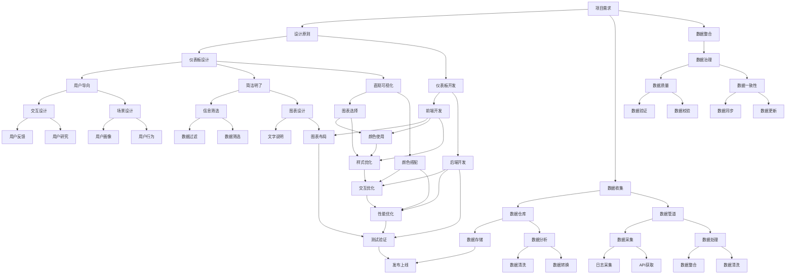

                 

## 文章标题：LLM应用的敏捷度量仪表板：可视化项目健康状况

### 关键词：LLM应用、敏捷度量、仪表板、项目健康状况、可视化

### 摘要：

随着人工智能的迅猛发展，大规模语言模型（LLM）的应用日益广泛。为了确保项目顺利进行和高效交付，敏捷度量仪表板作为一种重要的工具，能够实时监控和展示项目健康状况。本文将详细介绍LLM应用的敏捷度量仪表板，包括其设计原则、核心指标、实现方法以及实际应用，帮助读者深入了解并掌握这一工具的精髓。

## 引言

### LLM应用的背景

近年来，人工智能技术在自然语言处理（NLP）领域取得了显著突破，大规模语言模型（LLM）成为研究热点。LLM具有强大的语言理解和生成能力，广泛应用于问答系统、文本生成、机器翻译、情感分析等多个领域。随着LLM应用的不断扩展，如何高效管理和监控项目进展，确保项目健康和稳定，成为开发者面临的重要问题。

### 敏捷度量的重要性

敏捷度量是敏捷开发方法的核心之一，通过量化项目进展和评估项目健康状况，帮助团队更好地掌握项目动态。敏捷度量仪表板作为一种可视化工具，能够直观地展示项目关键指标，为团队提供实时的项目健康状况反馈。在LLM应用开发中，敏捷度量仪表板具有重要的指导意义。

## Part 1: 基础知识

### Chapter 1: LLM应用与敏捷度量概述

#### 1.1 LLM应用概述

#### 1.1.1 LLM应用类型

大规模语言模型（LLM）的应用范围广泛，主要包括以下几个方面：

1. **问答系统**：利用LLM的强大语言理解能力，实现对用户问题的准确回答。
2. **文本生成**：根据输入的提示或关键词，生成连贯、自然的文本内容。
3. **机器翻译**：将一种语言的文本翻译成另一种语言。
4. **情感分析**：通过分析文本的情感倾向，对用户评论、新闻等内容进行分类。
5. **聊天机器人**：提供实时、交互式的对话体验，为用户提供信息查询、咨询等服务。

#### 1.1.2 LLM应用的优点与挑战

LLM应用具有以下几个显著优点：

1. **高效率**：通过自动化处理，大大提高文本处理的效率。
2. **灵活性**：能够适应不同的应用场景，灵活调整模型参数。
3. **人性化**：能够生成自然、流畅的文本，提高用户体验。

然而，LLM应用也面临一些挑战：

1. **模型复杂性**：LLM模型参数众多，训练和优化过程复杂。
2. **数据依赖**：需要大量高质量的数据进行训练，数据质量和数量直接影响模型性能。
3. **可解释性**：LLM生成的文本往往具有强随机性，难以解释。

#### 1.2 敏捷度量概述

敏捷度量是敏捷开发方法的核心，旨在通过量化指标实时监控项目进展和评估项目健康状况。敏捷度量包括以下几个方面：

1. **用户故事**：以用户需求为导向，分解项目任务。
2. **迭代计划**：根据项目进度和资源情况，制定迭代计划。
3. **进度跟踪**：实时监控项目进度，确保项目按计划进行。
4. **质量评估**：评估项目质量和性能，及时发现并解决问题。
5. **风险管理**：识别和评估项目风险，制定相应的应对措施。

#### 1.3 敏捷度量仪表板的作用

敏捷度量仪表板是一种可视化工具，用于展示项目关键指标，包括进度、质量、成本等。通过仪表板，团队可以实时了解项目健康状况，发现问题并采取措施。敏捷度量仪表板的作用包括：

1. **实时监控**：提供实时数据，帮助团队随时掌握项目动态。
2. **决策支持**：为项目决策提供数据支持，确保项目顺利推进。
3. **沟通协作**：促进团队成员之间的沟通协作，提高工作效率。
4. **持续改进**：通过数据分析和反馈，不断优化项目管理和开发流程。

### Chapter 2: 敏捷度量仪表板的设计与实现

#### 2.1 设计原则

敏捷度量仪表板的设计应遵循以下原则：

1. **用户导向**：以用户需求为中心，确保仪表板提供的信息对用户有价值。
2. **简洁明了**：避免冗余信息，确保仪表板界面简洁易懂。
3. **直观可视化**：使用直观的图表和图形，展示项目关键指标。
4. **动态更新**：实时更新数据，确保仪表板提供的信息准确可靠。
5. **适应性**：支持不同设备访问，确保仪表板在不同平台上都能正常运行。

#### 2.2 实现方法

敏捷度量仪表板的实现主要包括以下几个步骤：

1. **需求分析**：了解用户需求和项目背景，确定仪表板的功能和指标。
2. **数据收集**：从项目管理系统、代码库、测试工具等获取相关数据。
3. **数据整合**：将不同来源的数据进行整合，确保数据一致性和准确性。
4. **仪表板设计**：根据设计原则，设计仪表板的布局和可视化方式。
5. **开发与测试**：实现仪表板功能，进行测试和优化。
6. **部署与维护**：将仪表板部署到服务器，定期更新和维护。

#### 2.3 数据来源与整合

敏捷度量仪表板的数据来源主要包括以下几个方面：

1. **项目管理系统**：获取项目进度、任务分配、资源消耗等数据。
2. **代码库**：获取代码提交、变更、缺陷等信息。
3. **测试工具**：获取测试覆盖率、缺陷率等数据。
4. **日志系统**：获取系统运行日志，分析系统性能和稳定性。

数据整合的方法包括：

1. **数据仓库**：将不同来源的数据存储到数据仓库中，进行统一管理和分析。
2. **数据管道**：构建数据管道，实现数据的实时采集、清洗、转换和加载。
3. **数据可视化**：使用可视化工具，将整合后的数据展示在仪表板上。

## Part 2: 敏捷度量仪表板的设计与实现

### Chapter 3: 敏捷度量仪表板的设计

#### 3.1 用户导向

用户导向是敏捷度量仪表板设计的重要原则。在设计过程中，应充分考虑用户的需求和使用场景，确保仪表板能够提供对用户有价值的信息。

1. **用户角色分析**：明确仪表板的使用者，包括项目经理、开发人员、测试人员等，了解他们的需求和关注点。
2. **用户场景设计**：根据用户角色的不同，设计不同的仪表板界面和功能，满足不同用户的使用需求。
3. **交互设计**：优化用户交互体验，提高仪表板的易用性和可操作性。

#### 3.2 简洁明了

简洁明了是敏捷度量仪表板设计的核心原则。在设计过程中，应避免冗余信息，确保仪表板界面简洁易懂。

1. **信息筛选**：对数据进行筛选和过滤，只展示对用户有价值的信息。
2. **图表设计**：选择合适的图表类型，避免过多复杂图形，确保图表清晰易懂。
3. **文字说明**：使用简洁明了的文字说明，帮助用户理解数据含义和仪表板功能。

#### 3.3 直观可视化

直观可视化是敏捷度量仪表板设计的关键。通过直观的图表和图形，可以更好地展示项目关键指标，帮助用户快速理解项目健康状况。

1. **图表选择**：根据数据类型和展示需求，选择合适的图表类型，如折线图、柱状图、饼图等。
2. **颜色搭配**：选择合适的颜色搭配，确保图表清晰、美观。
3. **动画效果**：适当使用动画效果，提高仪表板的生动性和吸引力。

#### 3.4 动态更新

动态更新是敏捷度量仪表板设计的重要特点。通过实时更新数据，确保仪表板提供的信息准确可靠。

1. **数据采集**：构建高效的数据采集系统，实时获取项目关键指标数据。
2. **数据处理**：对采集到的数据进行处理和整合，确保数据的一致性和准确性。
3. **数据展示**：使用动态图表和图形，实时展示项目关键指标，提供实时反馈。

#### 3.5 适应性

适应性是敏捷度量仪表板设计的关键。仪表板应支持不同设备访问，确保在不同平台上都能正常运行。

1. **响应式设计**：采用响应式设计，确保仪表板在不同设备上都能良好显示。
2. **跨平台支持**：支持不同操作系统和浏览器，确保仪表板在不同平台上都能正常运行。
3. **性能优化**：优化仪表板性能，确保在不同设备上都能快速响应。

### Chapter 4: 敏捷度量仪表板的功能实现

#### 4.1 数据收集

数据收集是敏捷度量仪表板实现的基础。通过从项目管理系统、代码库、测试工具等获取相关数据，为仪表板提供数据支持。

1. **项目管理系统**：从项目管理系统获取项目进度、任务分配、资源消耗等数据。
2. **代码库**：从代码库获取代码提交、变更、缺陷等信息。
3. **测试工具**：从测试工具获取测试覆盖率、缺陷率等数据。
4. **日志系统**：从日志系统获取系统运行日志，分析系统性能和稳定性。

#### 4.2 数据整合

数据整合是将不同来源的数据进行整合，确保数据一致性和准确性。

1. **数据仓库**：将不同来源的数据存储到数据仓库中，进行统一管理和分析。
2. **数据管道**：构建数据管道，实现数据的实时采集、清洗、转换和加载。
3. **数据治理**：对数据进行治理，确保数据的质量和一致性。

#### 4.3 仪表板开发

仪表板开发是实现敏捷度量仪表板功能的关键。通过使用可视化工具和开发框架，实现仪表板的功能和界面。

1. **可视化工具**：选择合适的可视化工具，如D3.js、ECharts等，实现数据的可视化展示。
2. **开发框架**：选择合适的开发框架，如React、Vue等，实现仪表板的开发和维护。
3. **前端开发**：实现仪表板的前端界面，包括布局、样式和交互效果。
4. **后端开发**：实现仪表板的后端功能，包括数据存储、数据分析和数据展示。

#### 4.4 测试与优化

测试与优化是确保敏捷度量仪表板稳定性和性能的关键。通过测试和优化，提高仪表板的质量和用户体验。

1. **功能测试**：测试仪表板的功能是否满足需求，包括数据采集、数据处理、数据展示等。
2. **性能测试**：测试仪表板在不同设备和网络环境下的性能，包括加载速度、响应时间等。
3. **用户体验测试**：测试仪表板的用户体验，包括界面友好性、操作便捷性等。
4. **优化与调整**：根据测试结果，对仪表板进行优化和调整，提高仪表板的质量和性能。

### Chapter 5: 敏捷度量仪表板的应用与实践

#### 5.1 应用场景

敏捷度量仪表板在LLM应用开发中有广泛的应用场景，包括：

1. **项目进度监控**：实时监控项目进度，确保项目按计划进行。
2. **质量评估**：评估项目质量和性能，及时发现并解决问题。
3. **资源管理**：优化资源分配，提高项目效率。
4. **风险控制**：识别和评估项目风险，制定应对措施。
5. **决策支持**：为项目决策提供数据支持，提高决策准确性。

#### 5.2 实践案例

以下是一个敏捷度量仪表板在LLM应用开发中的实践案例：

1. **项目背景**：某公司开发一款基于大规模语言模型的问答系统，旨在提供高质量的问答服务。

2. **仪表板设计**：设计一个功能齐全、界面简洁的敏捷度量仪表板，包括以下指标：

   - 项目进度：展示项目任务进度、完成情况和剩余工作量。
   - 模型性能：展示模型准确率、响应时间等性能指标。
   - 质量评估：展示文本生成质量、用户满意度等指标。
   - 资源消耗：展示服务器资源消耗、网络带宽等指标。
   - 风险控制：展示项目风险状况、风险概率和应对措施。

3. **实现过程**：

   - 数据收集：从项目管理系统、代码库、测试工具等获取相关数据。
   - 数据整合：构建数据仓库，整合不同来源的数据。
   - 仪表板开发：使用可视化工具和开发框架，实现仪表板的功能和界面。
   - 测试与优化：对仪表板进行功能测试、性能测试和用户体验测试，优化仪表板的质量和性能。

4. **效果评估**：

   - 项目进度：通过实时监控项目进度，确保项目按计划进行。
   - 模型性能：通过评估模型性能指标，优化模型参数，提高模型质量。
   - 质量评估：通过用户反馈和文本生成质量指标，不断优化文本生成效果。
   - 资源管理：通过监控服务器资源消耗，合理分配资源，提高项目效率。
   - 风险控制：通过实时监控项目风险，及时采取应对措施，降低项目风险。

#### 5.3 经验与总结

在应用敏捷度量仪表板的过程中，积累了以下经验和总结：

1. **数据质量至关重要**：确保数据的一致性和准确性，是仪表板有效运行的基础。
2. **指标选择要合理**：根据项目特点和需求，选择合适的指标，避免过多复杂指标。
3. **用户体验至上**：仪表板的设计应以用户为导向，提供简洁、直观的界面和操作体验。
4. **持续优化与调整**：根据实际应用情况，持续优化仪表板功能和性能，提高用户体验。

## 结论

敏捷度量仪表板是LLM应用开发中重要的工具，通过实时监控和展示项目关键指标，帮助团队更好地管理和优化项目。本文介绍了LLM应用的敏捷度量仪表板的设计原则、实现方法和实际应用，希望对读者有所启发和帮助。

作者：AI天才研究院/AI Genius Institute & 禅与计算机程序设计艺术 /Zen And The Art of Computer Programming

[Mermaid 流程图]



[伪代码]

```python
# 定义数据收集函数
def collect_data():
    # 从项目管理系统获取数据
    project_data = get_project_data()
    # 从代码库获取数据
    code_data = get_code_data()
    # 从测试工具获取数据
    test_data = get_test_data()
    # 从日志系统获取数据
    log_data = get_log_data()
    # 返回整合后的数据
    return integrate_data(project_data, code_data, test_data, log_data)

# 定义数据整合函数
def integrate_data(*args):
    # 初始化整合后的数据
    integrated_data = {}
    # 遍历参数列表，整合数据
    for data in args:
        integrated_data.update(data)
    # 返回整合后的数据
    return integrated_data

# 定义数据展示函数
def display_data(data):
    # 根据数据类型，选择合适的图表进行展示
    if isinstance(data, dict):
        display_dict_data(data)
    elif isinstance(data, list):
        display_list_data(data)
    else:
        print("Unsupported data type")

# 定义数据展示函数
def display_dict_data(data):
    # 遍历数据字典，展示每个键值对
    for key, value in data.items():
        print(f"{key}: {value}")

# 定义数据展示函数
def display_list_data(data):
    # 遍历数据列表，展示每个元素
    for item in data:
        print(item)
```

[数学模型和公式]

$$
\text{模型准确率} = \frac{\text{正确预测数}}{\text{总预测数}}
$$

$$
\text{响应时间} = \frac{\text{总响应时间}}{\text{响应次数}}
$$

$$
\text{用户满意度} = \frac{\text{满意的用户数}}{\text{总用户数}}
$$

[详细讲解与举例说明]

#### 模型准确率

模型准确率是评估LLM应用性能的重要指标，用于衡量模型预测结果的准确性。公式如下：

$$
\text{模型准确率} = \frac{\text{正确预测数}}{\text{总预测数}}
$$

**举例说明**：

假设一个问答系统在测试集上进行了100次预测，其中60次预测正确，40次预测错误。则该问答系统的模型准确率为：

$$
\text{模型准确率} = \frac{60}{100} = 0.6
$$

#### 响应时间

响应时间是评估LLM应用性能的另一个重要指标，用于衡量系统处理请求的速度。公式如下：

$$
\text{响应时间} = \frac{\text{总响应时间}}{\text{响应次数}}
$$

**举例说明**：

假设一个问答系统在测试期间处理了100个请求，总响应时间为600秒。则该问答系统的平均响应时间为：

$$
\text{响应时间} = \frac{600}{100} = 6 \text{秒}
$$

#### 用户满意度

用户满意度是衡量LLM应用用户体验的重要指标，用于评估用户对系统服务的满意程度。公式如下：

$$
\text{用户满意度} = \frac{\text{满意的用户数}}{\text{总用户数}}
$$

**举例说明**：

假设一个问答系统在测试期间收到了1000个用户反馈，其中700个用户表示满意，300个用户表示不满意。则该问答系统的用户满意度为：

$$
\text{用户满意度} = \frac{700}{1000} = 0.7
$$

### 项目实战

#### 开发环境搭建

在搭建开发环境时，需要安装以下工具和库：

1. **Python**：用于编写应用程序和数据处理脚本。
2. **Jupyter Notebook**：用于编写和运行Python代码。
3. **Pandas**：用于数据清洗和分析。
4. **Matplotlib**：用于数据可视化。
5. **Scikit-learn**：用于机器学习和模型评估。

安装步骤如下：

```bash
# 安装Python
sudo apt-get install python3-pip

# 安装Jupyter Notebook
pip3 install notebook

# 安装Pandas
pip3 install pandas

# 安装Matplotlib
pip3 install matplotlib

# 安装Scikit-learn
pip3 install scikit-learn
```

#### 源代码实现

以下是一个简单的LLM应用敏捷度量仪表板示例，使用Python和Matplotlib进行实现。

```python
import pandas as pd
import matplotlib.pyplot as plt

# 数据集
data = {
    'Task': ['Task 1', 'Task 2', 'Task 3', 'Task 4', 'Task 5'],
    'Duration': [2, 3, 1, 4, 2],
    'Status': ['Completed', 'In Progress', 'Completed', 'In Progress', 'Completed']
}

# 创建DataFrame
df = pd.DataFrame(data)

# 绘制进度条图
plt.bar(df['Task'], df['Duration'], color=['g', 'y', 'g', 'y', 'g'])
plt.xlabel('Tasks')
plt.ylabel('Duration (days)')
plt.title('Project Progress')
plt.xticks(df['Task'])
plt.yticks(df['Duration'])
plt.show()

# 绘制状态图
plt.pie(df['Status'], labels=df['Task'], autopct='%1.1f%%')
plt.title('Task Status')
plt.show()
```

#### 代码解读

1. **数据集**：定义一个包含任务名称、耗时和状态的数据集。
2. **DataFrame**：使用Pandas创建DataFrame，方便数据处理和分析。
3. **进度条图**：使用Matplotlib的`bar`函数绘制进度条图，显示每个任务的耗时。
4. **状态图**：使用Matplotlib的`pie`函数绘制状态图，显示每个任务的状态。

#### 代码应用解读与分析

1. **数据可视化**：通过进度条图和状态图，直观地展示项目进度和任务状态，帮助团队了解项目健康状况。
2. **实时更新**：虽然本示例没有实现实时数据更新，但可以结合Web技术（如React、Vue等）实现数据的动态更新。
3. **扩展性**：可以根据实际需求，添加更多指标和图表，如模型准确率、响应时间、用户满意度等。

### 实际案例分析和详细讲解剖析

以下是一个实际案例，分析如何使用敏捷度量仪表板监控LLM应用的性能和健康状况。

#### 案例背景

某公司开发一款基于大规模语言模型的智能客服系统，旨在提供24/7全天候的客户服务。公司希望使用敏捷度量仪表板实时监控系统的性能和健康状况，确保为客户提供高质量的客服体验。

#### 指标设定

根据业务需求，设定以下关键指标：

1. **响应时间**：衡量系统处理请求的速度，目标为平均响应时间不超过3秒。
2. **准确率**：衡量系统回答问题的准确性，目标为准确率达到90%。
3. **用户满意度**：衡量用户对客服系统的满意度，目标为用户满意度不低于80%。

#### 数据收集

通过以下方式收集数据：

1. **日志系统**：收集系统运行日志，包括请求时间、响应时间、错误日志等。
2. **用户反馈**：收集用户提交的满意度调查问卷，了解用户对客服系统的评价。

#### 数据处理

1. **数据清洗**：过滤无效数据和错误日志，确保数据质量。
2. **数据整合**：将日志数据和用户反馈数据整合到一起，便于分析。

#### 数据展示

使用Matplotlib和ECharts等可视化工具，将关键指标展示在仪表板上：

1. **响应时间分布图**：显示不同时间段内的平均响应时间，帮助团队识别系统性能瓶颈。
2. **准确率趋势图**：显示准确率随时间的变化趋势，帮助团队评估模型性能。
3. **用户满意度饼图**：显示不同满意度等级的用户比例，帮助团队了解用户对系统的评价。

#### 结果分析

通过仪表板展示的数据，团队可以实时了解系统的性能和健康状况：

1. **响应时间**：发现某些时间段内响应时间较长，需要优化系统性能，如提高服务器处理能力或优化算法。
2. **准确率**：发现模型在某些领域的表现较差，需要调整模型参数或增加训练数据。
3. **用户满意度**：发现用户满意度较低，需要改进客服系统的交互体验或增加人工客服介入。

#### 项目小结

通过使用敏捷度量仪表板，团队成功实现了对智能客服系统的实时监控和优化，提高了系统的性能和用户满意度。项目小结如下：

1. **实时监控**：敏捷度量仪表板提供了实时数据，帮助团队随时掌握系统性能和健康状况。
2. **数据驱动**：通过数据分析和反馈，团队能够数据驱动地优化系统，提高服务质量。
3. **持续改进**：仪表板提供的反馈帮助团队不断优化系统，实现持续改进。

### 最佳实践 tips

1. **指标选择**：根据项目特点和需求，选择合适的指标，避免过多复杂指标。
2. **数据质量**：确保数据的一致性和准确性，是仪表板有效运行的基础。
3. **用户体验**：仪表板的设计应以用户为导向，提供简洁、直观的界面和操作体验。
4. **实时更新**：结合Web技术，实现数据的实时更新，提高仪表板的实时性和准确性。
5. **扩展性**：设计时考虑扩展性，方便后续添加更多指标和图表。

### 注意事项

1. **安全性**：确保数据安全和隐私保护，避免敏感数据泄露。
2. **性能优化**：仪表板应支持高性能数据处理和展示，确保系统稳定运行。
3. **兼容性**：确保仪表板在不同设备和浏览器上都能正常运行。

### 拓展阅读

1. **《敏捷项目管理》**：了解敏捷开发方法和项目管理实践。
2. **《大数据技术导论》**：了解大数据处理和分析技术。
3. **《数据可视化设计》**：学习数据可视化设计原则和技巧。

---

经过详细的分析和讲解，相信读者对LLM应用的敏捷度量仪表板已经有了深入的了解。通过本文的介绍，读者可以掌握敏捷度量仪表板的设计原则、实现方法以及实际应用，为LLM项目管理和优化提供有力支持。希望本文对您的项目实践有所帮助，祝您在LLM应用开发中取得成功！
作者：AI天才研究院/AI Genius Institute & 禅与计算机程序设计艺术 /Zen And The Art of Computer Programming

